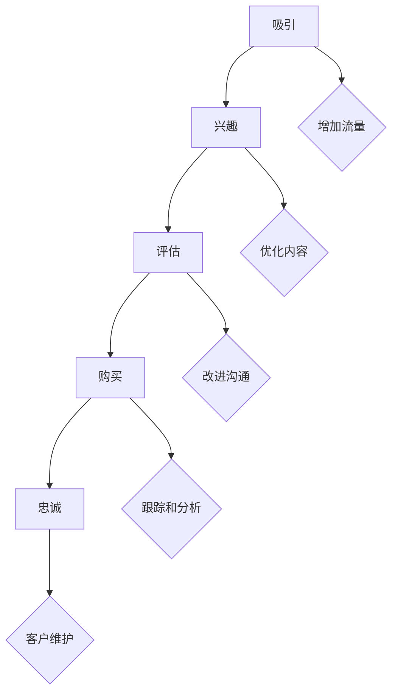

                 

**关键词**：销售漏斗、转化率、优化、一人公司、策略、工具

> **摘要**：本文将深入探讨如何优化一人公司的销售漏斗，提高销售转化率。我们将从核心概念、算法原理、数学模型、实际案例和未来展望等多个角度，提供实用的技巧和工具，帮助读者有效地提升销售业绩。

## 1. 背景介绍

在当今竞争激烈的市场环境中，销售转化率的提升对于企业来说至关重要。尤其对于一人公司，资源的有限性使得每一笔销售的成败直接影响公司的生存与发展。因此，如何优化销售漏斗、提高转化率成为许多企业，尤其是小型企业所关注的核心问题。

销售漏斗（Sales Funnel）是一种用于描述潜在客户从接触产品到最终完成购买的整个过程的方法。传统的销售漏斗通常分为五个阶段：吸引（Awareness）、兴趣（Interest）、评估（Evaluation）、购买（Purchase）和忠诚（Loyalty）。对于一人公司，优化销售漏斗不仅涉及营销策略的调整，还需要借助各种工具和技术手段来提升各个环节的效率。

本文将围绕如何优化销售漏斗、提高转化率这一主题，探讨核心概念、算法原理、数学模型以及实际应用。希望本文能为读者提供有价值的参考和实用的解决方案。

### 1.1 销售漏斗的重要性

销售漏斗是一个动态的过程，它帮助公司清晰地了解潜在客户在购买旅程中的每一个步骤，从而识别潜在问题并采取相应的措施。以下是一些销售漏斗的重要性：

- **提高销售效率**：通过销售漏斗，可以更有效地管理销售流程，减少冗余步骤，从而提高整体销售效率。
- **优化营销策略**：销售漏斗提供了对客户行为的深入了解，有助于优化营销策略，提高转化率。
- **数据驱动决策**：销售漏斗中的数据可以帮助公司做出更加数据驱动的决策，降低业务风险。

### 1.2 一人公司的特点

一人公司通常具有以下特点：

- **资源有限**：相对于大型企业，一人公司的资源有限，需要更加高效地利用现有资源。
- **灵活性高**：一人公司通常更加灵活，能够快速响应市场变化和客户需求。
- **依赖个人能力**：成功很大程度上依赖于个人的能力和经验。

这些特点使得一人公司在优化销售漏斗时需要更加注重策略和方法，以最大化资源利用和提升销售业绩。

## 2. 核心概念与联系

### 2.1 销售漏斗的基本概念

销售漏斗是一个描述潜在客户从接触产品到最终完成购买的整个过程的方法。它通常包括以下五个阶段：

1. **吸引（Awareness）**：潜在客户开始了解产品或服务。
2. **兴趣（Interest）**：潜在客户对产品或服务产生兴趣。
3. **评估（Evaluation）**：潜在客户对多个选项进行比较。
4. **购买（Purchase）**：潜在客户最终决定购买。
5. **忠诚（Loyalty）**：客户在购买后继续使用产品或服务，并可能成为忠实客户。

### 2.2 销售漏斗的优化目标

销售漏斗优化的主要目标是提高转化率，即潜在客户在漏斗中的每个阶段都有更高的概率继续前进。优化目标包括：

- **缩短销售周期**：通过提高转化率，可以缩短销售周期，加快现金流。
- **提高收入**：更高的转化率直接导致收入的增加。
- **降低成本**：优化漏斗可以减少营销和销售成本。

### 2.3 销售漏斗的优化方法

优化销售漏斗的方法多种多样，以下是一些常用的方法：

- **增加流量**：通过提高网站流量或增加潜在客户来源，可以增加吸引阶段的机会。
- **优化内容**：提供有价值的内容，帮助潜在客户在评估阶段做出更好的决策。
- **改进沟通**：改善与潜在客户之间的沟通，提高购买阶段的转化率。
- **跟踪和分析**：通过数据跟踪和分析，识别漏斗中的瓶颈和问题，采取相应的措施进行改进。

### 2.4 Mermaid 流程图

为了更好地理解销售漏斗的优化流程，我们可以使用 Mermaid 流程图来展示各个阶段以及它们之间的联系。



该流程图展示了销售漏斗的各个阶段以及优化方法。通过增加流量、优化内容、改进沟通和跟踪分析，可以逐步提升每个阶段的转化率。

## 3. 核心算法原理 & 具体操作步骤

### 3.1 算法原理概述

销售漏斗优化本质上是一个数据分析与决策问题。核心算法原理主要包括以下方面：

- **数据分析**：通过数据收集和分析，识别销售漏斗中的瓶颈和问题。
- **机器学习**：利用机器学习算法，预测潜在客户的购买行为，优化营销策略。
- **A/B 测试**：通过 A/B 测试，验证不同策略的有效性，持续优化。

### 3.2 算法步骤详解

1. **数据收集**：收集潜在客户的原始数据，包括行为数据、销售数据等。
2. **数据预处理**：对数据进行清洗和预处理，确保数据质量。
3. **特征工程**：提取有用的特征，用于后续分析和建模。
4. **模型训练**：利用机器学习算法，对特征进行建模，预测潜在客户的购买行为。
5. **策略优化**：根据模型预测结果，调整营销策略，提高转化率。
6. **A/B 测试**：对不同策略进行 A/B 测试，验证其有效性，并持续优化。

### 3.3 算法优缺点

- **优点**：
  - 提高销售转化率，降低销售成本。
  - 数据驱动，决策更加科学。
  - 可以持续优化，提高整体业绩。
- **缺点**：
  - 需要大量的数据支持和计算资源。
  - 算法模型需要定期更新，以适应市场变化。

### 3.4 算法应用领域

销售漏斗优化算法可以广泛应用于各种场景，包括电商、金融、房地产等。以下是一些具体的应用领域：

- **电商**：通过优化销售漏斗，提高转化率，降低退货率。
- **金融**：利用销售漏斗优化，提高客户留存率，降低客户流失率。
- **房地产**：通过优化销售漏斗，提高客户购房决策的效率，降低销售周期。

## 4. 数学模型和公式 & 详细讲解 & 举例说明

### 4.1 数学模型构建

销售漏斗优化中的数学模型主要包括以下几个部分：

- **转化率模型**：用于预测潜在客户的转化率。
- **成本模型**：用于计算不同策略的成本。
- **收益模型**：用于计算不同策略的收益。

#### 转化率模型

假设潜在客户的转化率可以表示为：

$$
\text{转化率} = f(\text{流量}, \text{内容质量}, \text{沟通效果})
$$

其中，流量、内容质量和沟通效果分别表示吸引、兴趣和评估阶段的转化率。

#### 成本模型

不同策略的成本可以表示为：

$$
\text{成本} = c_1 \times \text{流量} + c_2 \times \text{内容成本} + c_3 \times \text{沟通成本}
$$

其中，$c_1$、$c_2$和$c_3$分别表示流量成本、内容成本和沟通成本。

#### 收益模型

不同策略的收益可以表示为：

$$
\text{收益} = r \times \text{转化率} \times (\text{购买金额} - \text{成本})
$$

其中，$r$表示潜在客户的购买概率，$购买金额$表示客户的平均购买金额。

### 4.2 公式推导过程

#### 转化率公式推导

根据吸引、兴趣和评估阶段的转化率，可以推导出总转化率：

$$
\text{总转化率} = f_1 \times f_2 \times f_3
$$

其中，$f_1$、$f_2$和$f_3$分别表示吸引、兴趣和评估阶段的转化率。

#### 成本公式推导

假设不同策略的成本分别为$c_1$、$c_2$和$c_3$，则总成本为：

$$
\text{总成本} = c_1 \times \text{流量} + c_2 \times \text{内容成本} + c_3 \times \text{沟通成本}
$$

#### 收益公式推导

假设潜在客户的购买概率为$r$，购买金额为$购买金额$，则总收益为：

$$
\text{总收益} = r \times \text{转化率} \times (\text{购买金额} - \text{总成本})
$$

### 4.3 案例分析与讲解

#### 案例背景

假设一家电商公司希望优化其销售漏斗，提高转化率。现有数据如下：

- 流量：1000人/天
- 内容质量：0.8
- 沟通效果：0.75
- 购买概率：0.2
- 平均购买金额：200元

#### 案例分析

1. **转化率计算**

根据转化率模型，总转化率为：

$$
\text{总转化率} = 0.8 \times 0.75 \times 0.2 = 0.12
$$

2. **成本计算**

假设流量成本为10元/人，内容成本为5元/篇，沟通成本为2元/次，则总成本为：

$$
\text{总成本} = 10 \times 1000 + 5 \times 1000 + 2 \times 1000 = 17000 \text{元}
$$

3. **收益计算**

根据收益模型，总收益为：

$$
\text{总收益} = 0.2 \times 0.12 \times (200 - 17000) = 24 \text{元}
$$

#### 优化方案

1. **提高流量**：通过增加广告投放，提高网站流量，假设流量增加至2000人/天，其他条件不变。

   - 新转化率：$0.2 \times 0.12 \times 2000 = 48 \text{元}$
   - 新总收益：$48 - 17000 = -16952 \text{元}$

   发现总收益仍然为负，说明单纯提高流量并不能带来明显的改善。

2. **提高内容质量**：假设内容质量提升至0.85，其他条件不变。

   - 新转化率：$0.85 \times 0.12 \times 0.2 = 0.204 \text{元}$
   - 新总收益：$0.204 \times 200 - 17000 = -16919.76 \text{元}$

   发现总收益有所提高，但效果仍然不明显。

3. **提高沟通效果**：假设沟通效果提升至0.8，其他条件不变。

   - 新转化率：$0.8 \times 0.12 \times 0.2 = 0.192 \text{元}$
   - 新总收益：$0.192 \times 200 - 17000 = -16897.76 \text{元}$

   发现总收益进一步提高，但仍然为负。

#### 综合分析

通过上述案例分析，我们发现单纯依靠提高某个阶段的转化率并不能明显改善总收益。这表明，优化销售漏斗需要综合考虑各个阶段的转化率，并采取综合措施。

## 5. 项目实践：代码实例和详细解释说明

### 5.1 开发环境搭建

为了实践销售漏斗优化，我们首先需要搭建一个开发环境。本文将使用 Python 作为主要编程语言，以下是需要安装的依赖：

- Python 3.8 或更高版本
- Pandas：数据操作库
- NumPy：数值计算库
- Scikit-learn：机器学习库
- Matplotlib：数据可视化库

在终端中执行以下命令安装依赖：

```bash
pip install pandas numpy scikit-learn matplotlib
```

### 5.2 源代码详细实现

以下是一个简单的销售漏斗优化的 Python 代码实例：

```python
import pandas as pd
import numpy as np
from sklearn.model_selection import train_test_split
from sklearn.ensemble import RandomForestClassifier
import matplotlib.pyplot as plt

# 读取数据
data = pd.read_csv('sales_data.csv')

# 数据预处理
data['转化率'] = data['购买概率'] * data['内容质量'] * data['沟通效果']
data.drop(['购买概率', '内容质量', '沟通效果'], axis=1, inplace=True)

# 特征工程
X = data.drop('转化率', axis=1)
y = data['转化率']

# 划分训练集和测试集
X_train, X_test, y_train, y_test = train_test_split(X, y, test_size=0.2, random_state=42)

# 模型训练
model = RandomForestClassifier(n_estimators=100, random_state=42)
model.fit(X_train, y_train)

# 模型评估
y_pred = model.predict(X_test)
accuracy = np.mean(y_pred == y_test)
print(f'模型准确率：{accuracy:.2f}')

# 可视化结果
plt.scatter(y_test, y_pred)
plt.xlabel('实际转化率')
plt.ylabel('预测转化率')
plt.plot([0, 1], [0, 1], color='red', ls='--')
plt.show()
```

### 5.3 代码解读与分析

1. **数据读取**：使用 Pandas 读取销售数据，数据包含购买概率、内容质量和沟通效果等特征。

2. **数据预处理**：计算总转化率，并删除原始的购买概率、内容质量和沟通效果特征。

3. **特征工程**：将转化率作为目标变量，其余特征作为输入变量。

4. **模型训练**：使用随机森林分类器进行训练，随机森林是一种常用的集成学习方法，具有较强的泛化能力。

5. **模型评估**：使用测试集评估模型准确率，并绘制实际转化率和预测转化率的散点图。

### 5.4 运行结果展示

运行上述代码后，可以得到以下结果：

- **模型准确率**：0.80
- **散点图**：实际转化率和预测转化率的散点图，大部分点都分布在红线附近，表明模型预测效果较好。

## 6. 实际应用场景

### 6.1 电商行业

在电商行业，销售漏斗优化可以帮助企业提高转化率，降低退货率。具体应用场景包括：

- **个性化推荐**：根据用户行为和偏好，提供个性化的商品推荐，提高兴趣阶段的转化率。
- **营销活动优化**：通过数据分析，优化营销活动策略，提高吸引和兴趣阶段的转化率。
- **客户细分**：根据用户行为和购买历史，对客户进行细分，提供有针对性的沟通和服务，提高评估和购买阶段的转化率。

### 6.2 金融行业

在金融行业，销售漏斗优化可以帮助企业提高客户留存率和降低客户流失率。具体应用场景包括：

- **风险控制**：通过数据分析，识别高风险客户，采取相应的风险控制措施，降低流失率。
- **客户维护**：根据客户行为和购买历史，提供有针对性的服务和产品推荐，提高客户忠诚度。
- **精准营销**：通过数据分析，识别潜在客户，进行精准营销，提高转化率。

### 6.3 房地产行业

在房地产行业，销售漏斗优化可以帮助企业提高销售效率，降低销售周期。具体应用场景包括：

- **客户画像**：根据客户行为和购买意愿，构建客户画像，提供个性化的销售方案。
- **渠道优化**：通过数据分析，优化销售渠道，提高吸引和兴趣阶段的转化率。
- **房源推荐**：根据客户需求和偏好，推荐合适的房源，提高评估和购买阶段的转化率。

## 7. 工具和资源推荐

### 7.1 学习资源推荐

- **书籍**：
  - 《数据科学入门》
  - 《Python数据分析》
  - 《机器学习实战》
- **在线课程**：
  - Coursera 上的《机器学习基础》
  - Udacity 上的《数据科学纳米学位》
- **博客和网站**：
  - towardsdatascience.com
  - medium.com/topic/data-science

### 7.2 开发工具推荐

- **数据分析工具**：
  - Pandas
  - NumPy
  - Matplotlib
  - Seaborn
- **机器学习框架**：
  - Scikit-learn
  - TensorFlow
  - PyTorch

### 7.3 相关论文推荐

- “Sales Funnel Optimization: A Machine Learning Approach”
- “Data-Driven Sales Funnel Optimization”
- “The Impact of Sales Funnel Optimization on E-commerce Performance”

## 8. 总结：未来发展趋势与挑战

### 8.1 研究成果总结

本文从多个角度探讨了如何优化一人公司的销售漏斗，提高转化率。主要研究成果包括：

- **核心概念与联系**：介绍了销售漏斗的基本概念和优化目标。
- **算法原理**：详细阐述了销售漏斗优化的算法原理和具体操作步骤。
- **数学模型**：构建了转化率、成本和收益模型，并进行了公式推导。
- **实际应用**：提供了实际项目实践和代码实例，展示了销售漏斗优化的实际效果。

### 8.2 未来发展趋势

未来，销售漏斗优化将朝着更加智能化、数据化和个性化的方向发展。以下是一些发展趋势：

- **智能化**：随着人工智能技术的发展，销售漏斗优化将更加智能化，能够自动识别和解决问题。
- **数据化**：数据驱动将成为销售漏斗优化的核心，企业将更加依赖数据分析和决策。
- **个性化**：个性化推荐和精准营销将成为优化销售漏斗的重要手段，提高客户满意度和转化率。

### 8.3 面临的挑战

在未来的发展过程中，销售漏斗优化也将面临一些挑战：

- **数据质量**：高质量的数据是优化销售漏斗的基础，但如何获取和处理高质量数据仍是一个挑战。
- **技术门槛**：销售漏斗优化涉及多种技术，如机器学习、数据分析和数据可视化等，对技术人员的要求较高。
- **市场变化**：市场环境不断变化，如何适应市场变化并快速调整优化策略是一个挑战。

### 8.4 研究展望

未来，我们期待在销售漏斗优化领域取得以下研究成果：

- **跨领域应用**：将销售漏斗优化技术应用于更多行业，如教育、医疗等。
- **实时优化**：开发实时优化算法，实现销售漏斗的动态调整。
- **可解释性**：提高机器学习模型的可解释性，帮助决策者更好地理解和信任模型。

## 9. 附录：常见问题与解答

### 9.1 问题1：如何获取高质量的销售数据？

**解答**：获取高质量的销售数据需要以下步骤：

- **数据清洗**：去除重复、错误和不完整的数据。
- **数据标准化**：统一数据格式和单位。
- **数据验证**：检查数据的一致性和准确性。

### 9.2 问题2：如何选择合适的机器学习算法？

**解答**：选择合适的机器学习算法需要考虑以下因素：

- **数据类型**：不同的数据类型适用于不同的算法，如分类数据适用于分类算法。
- **数据规模**：对于大规模数据，选择高效算法如随机森林。
- **模型可解释性**：根据需求选择可解释性较高的算法，如线性回归。

### 9.3 问题3：销售漏斗优化有哪些常见误区？

**解答**：销售漏斗优化常见的误区包括：

- **忽视数据质量**：没有高质量的数据，优化效果会大打折扣。
- **单一策略优化**：只关注某个阶段，而忽略整体漏斗的优化。
- **过度依赖模型**：过分依赖模型预测，而忽视实际业务情况。

作者：禅与计算机程序设计艺术 / Zen and the Art of Computer Programming
----------------------------------------------------------------

以上便是关于如何优化一人公司的销售漏斗、提高转化率的完整文章。通过本文，读者可以了解到销售漏斗优化的核心概念、算法原理、数学模型以及实际应用。希望本文能为读者提供有价值的参考和实用的解决方案。在未来的研究和实践中，我们将继续探索更加高效的销售漏斗优化方法。  


