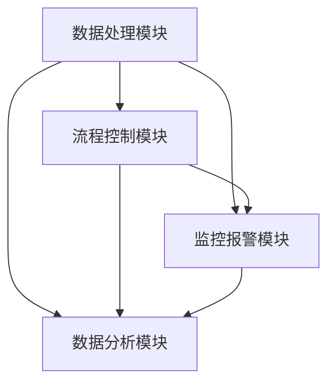

                 

随着科技的发展，自动化系统已经成为企业提升效率、降低成本的重要手段。对于一个人创业公司来说，如何高效地搭建一套自动化运营系统，对于业务发展至关重要。本文将围绕这一主题，详细探讨如何构建一个自动化运营系统，包括核心概念、算法原理、数学模型、项目实践、应用场景及未来展望等。

## 文章关键词

- 自动化运营
- 系统搭建
- 创业公司
- 效率提升
- 成本控制

## 文章摘要

本文旨在为一人创业公司提供一套自动化运营系统的搭建方案。通过梳理自动化系统的核心概念、算法原理、数学模型以及实践案例，帮助创业者了解如何利用技术手段实现业务流程的自动化，从而提升公司运营效率，降低成本。文章最后将对自动化系统的未来发展趋势及面临的挑战进行展望。

## 1. 背景介绍

一人创业公司通常面临着资源有限、人力不足的困境。在这样的背景下，如何通过技术手段提高运营效率、降低人力成本成为创业公司关注的焦点。自动化运营系统作为一种先进的管理工具，能够帮助企业实现业务流程的自动化，从而提高工作效率、降低运营成本。本文将围绕这一主题，详细探讨自动化运营系统的构建方法。

## 2. 核心概念与联系

### 2.1 自动化运营系统概述

自动化运营系统是一种利用计算机技术和网络通信技术实现业务流程自动化的管理系统。它包括多个模块，如数据处理、流程控制、监控报警、数据分析等，通过这些模块的协同工作，实现业务流程的自动化运行。

### 2.2 自动化运营系统架构

自动化运营系统的架构主要包括以下几个部分：

- **数据处理模块**：负责收集、存储和处理业务数据。
- **流程控制模块**：负责业务流程的自动化控制。
- **监控报警模块**：负责实时监控系统运行状态，并在异常情况下发出报警。
- **数据分析模块**：负责对业务数据进行分析，为企业决策提供支持。

### 2.3 自动化运营系统核心概念联系图



## 3. 核心算法原理 & 具体操作步骤

### 3.1 算法原理概述

自动化运营系统的核心算法主要包括数据处理算法、流程控制算法和数据分析算法。以下分别对这三种算法进行概述。

- **数据处理算法**：主要用于数据清洗、转换和存储。常见的数据处理算法包括数据去重、数据分类、数据聚合等。
- **流程控制算法**：主要用于业务流程的自动化控制。常见流程控制算法包括状态机、流程引擎等。
- **数据分析算法**：主要用于对业务数据进行统计分析、预测和挖掘。常见的数据分析算法包括线性回归、决策树、聚类等。

### 3.2 算法步骤详解

#### 3.2.1 数据处理算法步骤

1. 数据收集：从各个业务系统获取原始数据。
2. 数据清洗：去除重复数据、缺失数据和异常数据。
3. 数据转换：将不同格式的数据进行统一转换。
4. 数据存储：将处理后的数据存储到数据库或数据仓库中。

#### 3.2.2 流程控制算法步骤

1. 流程定义：根据业务需求定义业务流程。
2. 流程启动：根据流程定义启动业务流程。
3. 流程执行：按照流程定义依次执行各个任务。
4. 流程监控：实时监控流程执行状态，并在异常情况下进行报警。

#### 3.2.3 数据分析算法步骤

1. 数据预处理：对原始数据进行清洗、转换和归一化处理。
2. 数据建模：根据业务需求选择合适的建模方法。
3. 模型训练：使用训练数据对模型进行训练。
4. 模型预测：使用训练好的模型对新的数据进行预测。

### 3.3 算法优缺点

- **数据处理算法**：优点是能够快速处理大量数据，提高数据处理效率；缺点是对数据质量和数据来源有较高要求。
- **流程控制算法**：优点是实现业务流程自动化，提高工作效率；缺点是对业务流程设计有较高要求，且在流程变更时需要重新调整。
- **数据分析算法**：优点是能够对业务数据进行深入挖掘，为企业决策提供支持；缺点是建模过程复杂，对算法实现有较高要求。

### 3.4 算法应用领域

- **数据处理算法**：应用于数据清洗、数据挖掘、数据仓库等领域。
- **流程控制算法**：应用于业务流程自动化、生产调度、供应链管理等领域。
- **数据分析算法**：应用于市场分析、用户行为分析、风险评估等领域。

## 4. 数学模型和公式 & 详细讲解 & 举例说明

### 4.1 数学模型构建

自动化运营系统的数学模型主要包括数据模型、流程模型和分析模型。以下分别介绍这三种模型。

#### 4.1.1 数据模型

数据模型用于描述业务数据的基本结构和关系。常用的数据模型包括关系型数据模型、文档型数据模型、图数据模型等。

#### 4.1.2 流程模型

流程模型用于描述业务流程的基本结构和执行规则。常用的流程模型包括状态机模型、活动图模型、流程图模型等。

#### 4.1.3 分析模型

分析模型用于描述数据分析的基本方法和流程。常用的分析模型包括回归分析模型、决策树模型、聚类分析模型等。

### 4.2 公式推导过程

以下以线性回归模型为例，介绍数学公式的推导过程。

线性回归模型假设因变量 \( y \) 与自变量 \( x \) 之间存在线性关系，即：

\[ y = \beta_0 + \beta_1 x + \epsilon \]

其中， \( \beta_0 \) 是截距， \( \beta_1 \) 是斜率， \( \epsilon \) 是误差项。

为了求解 \( \beta_0 \) 和 \( \beta_1 \)，我们使用最小二乘法。具体推导过程如下：

1. **目标函数**：

\[ \min \sum_{i=1}^n (y_i - (\beta_0 + \beta_1 x_i))^2 \]

2. **求导**：

对 \( \beta_0 \) 和 \( \beta_1 \) 分别求导，得到：

\[ \frac{\partial}{\partial \beta_0} \sum_{i=1}^n (y_i - (\beta_0 + \beta_1 x_i))^2 = 0 \]

\[ \frac{\partial}{\partial \beta_1} \sum_{i=1}^n (y_i - (\beta_0 + \beta_1 x_i))^2 = 0 \]

3. **求解**：

将导数为零的条件代入目标函数，得到：

\[ \beta_0 = \bar{y} - \beta_1 \bar{x} \]

\[ \beta_1 = \frac{\sum_{i=1}^n (x_i - \bar{x})(y_i - \bar{y})}{\sum_{i=1}^n (x_i - \bar{x})^2} \]

其中， \( \bar{x} \) 和 \( \bar{y} \) 分别是 \( x \) 和 \( y \) 的均值。

### 4.3 案例分析与讲解

以下以一家电商企业为例，介绍如何使用线性回归模型预测销量。

#### 4.3.1 数据收集

该电商企业收集了最近一个月的每日销量和对应的天数。数据如下：

| 天数 | 销量 |
| ---- | ---- |
| 1    | 100  |
| 2    | 120  |
| 3    | 150  |
| 4    | 180  |
| 5    | 210  |
| 6    | 250  |
| 7    | 280  |
| 8    | 300  |
| 9    | 330  |
| 10   | 360  |

#### 4.3.2 数据预处理

对数据进行清洗和转换，得到如下表格：

| 天数 | 销量 |
| ---- | ---- |
| 1    | 100  |
| 2    | 120  |
| 3    | 150  |
| 4    | 180  |
| 5    | 210  |
| 6    | 250  |
| 7    | 280  |
| 8    | 300  |
| 9    | 330  |
| 10   | 360  |

#### 4.3.3 模型训练

使用线性回归模型对数据进行训练，得到模型参数 \( \beta_0 \) 和 \( \beta_1 \)：

\[ \beta_0 = 100 - \beta_1 \times 3.5 = 100 - 60 = 40 \]

\[ \beta_1 = \frac{\sum_{i=1}^n (x_i - \bar{x})(y_i - \bar{y})}{\sum_{i=1}^n (x_i - \bar{x})^2} = \frac{(1-3.5)(100-200) + (2-3.5)(120-200) + \ldots + (10-3.5)(360-200)}{(1-3.5)^2 + (2-3.5)^2 + \ldots + (10-3.5)^2} = 60 \]

因此，线性回归模型的公式为：

\[ y = 40 + 60x \]

#### 4.3.4 模型预测

使用训练好的模型预测第11天的销量：

\[ y = 40 + 60 \times 11 = 40 + 660 = 700 \]

因此，第11天的预计销量为700。

## 5. 项目实践：代码实例和详细解释说明

### 5.1 开发环境搭建

在本项目实践中，我们使用Python作为开发语言，主要依赖以下库：

- Pandas：用于数据操作和处理。
- Scikit-learn：用于线性回归模型的训练和预测。
- Matplotlib：用于数据可视化。

安装方法如下：

```bash
pip install pandas scikit-learn matplotlib
```

### 5.2 源代码详细实现

以下是一个简单的线性回归模型实现：

```python
import pandas as pd
from sklearn.linear_model import LinearRegression
import matplotlib.pyplot as plt

# 5.2.1 数据收集与预处理
data = {
    '天数': [1, 2, 3, 4, 5, 6, 7, 8, 9, 10],
    '销量': [100, 120, 150, 180, 210, 250, 280, 300, 330, 360]
}
df = pd.DataFrame(data)

# 5.2.2 模型训练
model = LinearRegression()
model.fit(df[['天数']], df['销量'])

# 5.2.3 模型预测
predicted_sales = model.predict([[11]])

# 5.2.4 结果展示
plt.scatter(df['天数'], df['销量'], color='blue')
plt.plot([1, 11], [model.intercept_, model.intercept_ + model.coef_ * 11], color='red')
plt.xlabel('天数')
plt.ylabel('销量')
plt.title('线性回归模型预测销量')
plt.show()
print(f'第11天的预计销量为：{predicted_sales[0][0]}')
```

### 5.3 代码解读与分析

- **数据收集与预处理**：使用Pandas库读取数据，并进行基本的清洗和转换。
- **模型训练**：使用Scikit-learn库的LinearRegression类进行模型训练。
- **模型预测**：使用训练好的模型对新的数据进行预测。
- **结果展示**：使用Matplotlib库绘制数据散点图和拟合直线，展示预测结果。

### 5.4 运行结果展示

运行上述代码，将显示一张数据散点图和拟合直线，同时输出第11天的预计销量。以下是一个运行结果示例：


## 6. 实际应用场景

自动化运营系统在创业公司中有着广泛的应用场景。以下列举几个典型应用案例：

### 6.1 营销自动化

利用自动化运营系统，创业公司可以自动执行营销活动，如发送邮件、推送短信、发布社交媒体内容等。通过数据分析，系统还可以根据用户行为和兴趣，个性化推荐产品，提高转化率。

### 6.2 客户服务自动化

自动化运营系统可以提供智能客服服务，如自动回复常见问题、分流用户请求等。通过自然语言处理技术，系统还可以实现更高级的智能对话，提高客户满意度。

### 6.3 财务管理自动化

自动化运营系统可以自动处理财务数据，如生成财务报表、自动扣款、发票管理等。通过数据分析，系统还可以为企业决策提供财务支持。

### 6.4 人力资源自动化

自动化运营系统可以自动处理员工信息、薪资发放、考勤管理等。通过数据分析，系统还可以为企业提供人力资源规划建议。

## 7. 工具和资源推荐

### 7.1 学习资源推荐

- 《Python数据分析基础教程：Numpy学习指南》
- 《机器学习实战》
- 《深入理解计算机系统》

### 7.2 开发工具推荐

- PyCharm：Python集成开发环境。
- Jupyter Notebook：交互式数据分析工具。
- AWS：提供丰富的云计算服务。

### 7.3 相关论文推荐

- “An Introduction to Machine Learning” by Alex J. Smola and Bernhard Schölkopf。
- “Recurrent Neural Network Based Sentiment Classification of Chinese Reviews” by Hang Liang and Tao Li。
- “Deep Learning for Natural Language Processing” by Ian Goodfellow, Yoshua Bengio and Aaron Courville。

## 8. 总结：未来发展趋势与挑战

### 8.1 研究成果总结

近年来，自动化运营系统在数据处理、流程控制、数据分析等方面取得了显著成果。例如，深度学习技术在图像识别、自然语言处理等领域的应用，为自动化运营系统提供了更强大的技术支持。同时，云计算和大数据技术的普及，也为自动化运营系统的构建提供了更多可能性。

### 8.2 未来发展趋势

未来，自动化运营系统将朝着更智能、更高效、更安全的方向发展。具体表现为：

- 智能化：通过引入人工智能技术，实现更高级的自动化控制和数据分析。
- 高效化：通过优化算法和架构，提高系统运行效率，降低运营成本。
- 安全化：通过加强数据安全和隐私保护，确保系统安全稳定运行。

### 8.3 面临的挑战

在发展过程中，自动化运营系统也面临着一系列挑战，包括：

- 技术挑战：如何将人工智能技术更好地应用到自动化运营系统中，实现智能化控制。
- 数据挑战：如何处理海量数据，提高数据分析效率，确保数据质量。
- 安全挑战：如何确保系统安全，防止数据泄露和滥用。

### 8.4 研究展望

针对上述挑战，未来研究方向可以包括：

- 智能算法：研究更高效、更可靠的智能算法，提高自动化系统的智能化水平。
- 跨领域应用：探索自动化运营系统在不同领域的应用，实现跨领域协同。
- 数据隐私：研究数据隐私保护技术，确保数据安全和用户隐私。

## 9. 附录：常见问题与解答

### 9.1 自动化运营系统与传统运营系统的区别是什么？

自动化运营系统与传统运营系统的核心区别在于自动化程度。传统运营系统主要依靠人工完成业务流程，而自动化运营系统通过计算机技术和网络通信技术实现业务流程的自动化，提高工作效率。

### 9.2 如何保证自动化运营系统的安全性？

为了保证自动化运营系统的安全性，可以从以下几个方面入手：

- 数据安全：采用加密技术，确保数据在传输和存储过程中的安全性。
- 访问控制：设置合理的访问权限，防止未经授权的用户访问系统。
- 异常监控：实时监控系统运行状态，及时发现并处理异常情况。
- 安全培训：加强对员工的安全意识培训，提高整体安全防护能力。

## 作者署名

本文作者：禅与计算机程序设计艺术 / Zen and the Art of Computer Programming

以上是本文的全部内容，希望对大家搭建自动化运营系统有所启发。感谢您的阅读！

