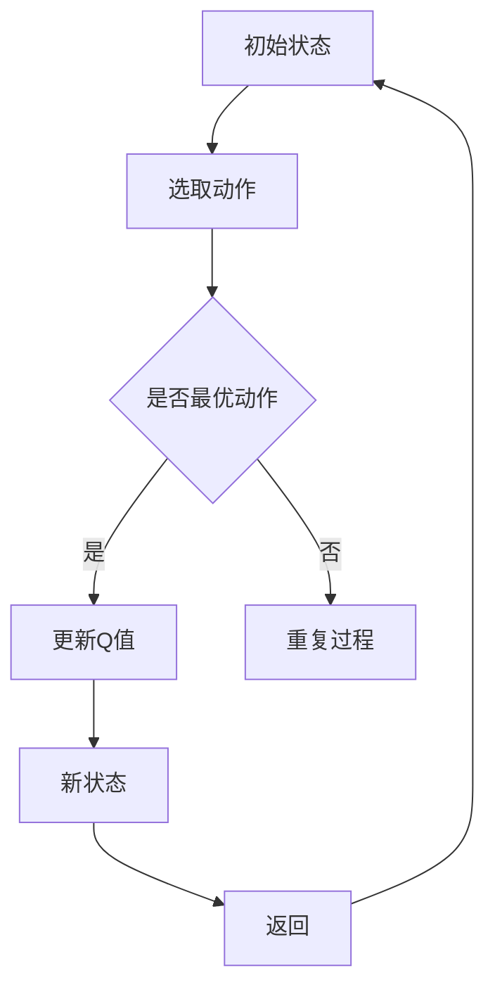
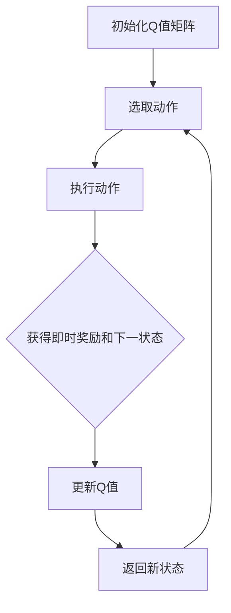
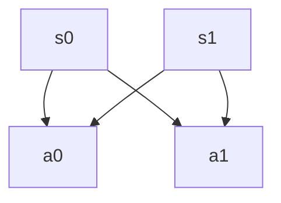

                 

关键词：Q-learning, AI策略网络，映射，深度学习，强化学习，神经网络，状态-动作价值函数。

> 摘要：本文将探讨AI中的Q-learning算法及其在策略网络搭建中的应用。通过阐述Q-learning的基本原理，介绍其如何通过映射构建策略网络，以及如何在实践中实现和应用Q-learning策略网络，本文旨在为读者提供一套完整的技术解决方案，帮助理解AI在映射概念下的运作方式。

## 1. 背景介绍

在人工智能（AI）领域，强化学习（Reinforcement Learning，RL）是一种重要的机器学习方法。与监督学习和无监督学习不同，强化学习通过智能体（agent）与环境的交互，学习如何在给定情境下做出最佳决策，以达到长期目标。Q-learning是强化学习中的一种经典算法，通过迭代更新状态-动作价值函数（State-Action Value Function），实现策略优化。

Q-learning的诞生可以追溯到1989年，由理查德·萨顿（Richard Sutton）和阿尔文·艾伦（Andrew Barto）在其著作《 reinforcement learning: An introduction》中提出。此后，Q-learning在多个领域得到广泛应用，如游戏AI、机器人控制、自动驾驶等。其核心思想是通过学习状态-动作价值函数，智能体能够预测在某一状态下执行特定动作所能获得的累积奖励。

本文的目标是深入探讨Q-learning算法，并介绍如何在AI系统中构建策略网络。具体来说，我们将：

1. 介绍Q-learning的基本概念和原理。
2. 讨论如何通过状态-动作价值函数的映射构建策略网络。
3. 分析Q-learning算法的具体操作步骤和优化策略。
4. 通过实例展示如何在实际项目中应用Q-learning策略网络。
5. 探讨Q-learning在未来AI领域的发展前景。

## 2. 核心概念与联系

### 2.1 Q-learning的概念

Q-learning是一种值函数算法，用于解决强化学习问题。其核心思想是利用过去的经验来估计状态-动作价值函数（Q值），从而指导智能体的决策。Q值的定义如下：

\[ Q(s, a) = \sum_{s'} p(s' | s, a) \cdot R(s', a) + \gamma \max_{a'} Q(s', a') \]

其中，\( s \)表示当前状态，\( a \)表示采取的动作，\( s' \)表示下一状态，\( a' \)表示下一动作，\( R(s', a) \)表示在状态\( s' \)下采取动作\( a \)所获得的即时奖励，\( \gamma \)是折扣因子，用于平衡长期奖励和即时奖励。

### 2.2 Q-learning与策略网络的关系

策略网络是强化学习中的重要组成部分，用于将状态映射到动作。在Q-learning算法中，策略网络可以通过状态-动作价值函数的映射来构建。具体来说，智能体根据当前状态选择动作时，会查询状态-动作价值函数，选择具有最大Q值的动作。这样，通过不断更新状态-动作价值函数，智能体能够逐步优化其策略，实现最优决策。

以下是一个使用Mermaid绘制的Q-learning流程图，展示了状态-动作价值函数的映射过程：



### 2.3 Q-learning算法的核心架构

Q-learning算法的核心是状态-动作价值函数的迭代更新。在算法运行过程中，智能体通过与环境的交互，不断积累经验，更新Q值。以下是一个简化的Q-learning算法流程：

1. 初始化Q值矩阵，将所有Q值设置为初始值（如0或随机值）。
2. 在初始状态下选择动作，根据策略选择具有最大Q值的动作。
3. 执行动作，获得即时奖励和下一状态。
4. 根据新的状态和即时奖励更新Q值。
5. 返回新的状态，重复上述过程。

以下是一个Mermaid流程图，展示了Q-learning算法的核心架构：



通过以上介绍，我们可以看到Q-learning算法通过状态-动作价值函数的映射，实现了智能体的策略优化。接下来，我们将进一步探讨Q-learning算法的具体操作步骤和优化策略。

## 3. 核心算法原理 & 具体操作步骤

### 3.1 算法原理概述

Q-learning算法是基于值函数迭代的方法，用于解决强化学习问题。其核心思想是通过迭代更新状态-动作价值函数，使智能体能够学习到在给定状态下执行特定动作所能获得的累积奖励，从而指导智能体的决策。

Q-learning算法的基本步骤如下：

1. **初始化**：初始化状态-动作价值函数\( Q(s, a) \)，通常将所有Q值设置为初始值（如0或随机值）。

2. **选择动作**：在给定状态下，根据当前策略选择动作。策略通常基于某种探索策略（如epsilon-greedy策略）和 exploitation 策略（如选择具有最大Q值的动作）。

3. **执行动作**：执行所选动作，与环境交互，获得即时奖励\( R \)和下一状态\( s' \)。

4. **更新Q值**：根据新的状态和即时奖励更新Q值。更新公式如下：

\[ Q(s, a) \leftarrow Q(s, a) + \alpha [R(s', a') + \gamma \max_{a'} Q(s', a') - Q(s, a)] \]

其中，\( \alpha \)是学习率，\( \gamma \)是折扣因子。

5. **重复迭代**：返回新的状态，重复上述过程，直至达到终止条件（如达到特定步数、目标状态等）。

### 3.2 算法步骤详解

#### 3.2.1 初始化Q值矩阵

在Q-learning算法中，Q值矩阵是一个二维数组，用于存储每个状态和动作的Q值。初始化Q值矩阵时，可以将其所有元素设置为初始值，如0或随机值。

```python
# 初始化Q值矩阵
Q = np.zeros((n_states, n_actions))
```

其中，\( n_states \)和\( n_actions \)分别为状态数和动作数。

#### 3.2.2 选择动作

在选择动作时，可以采用epsilon-greedy策略。epsilon-greedy策略是一种平衡探索和利用的策略，其中epsilon是探索概率。在给定状态下，以概率\( 1 - \epsilon \)选择具有最大Q值的动作，以概率\( \epsilon \)选择随机动作。

```python
# 选择动作
epsilon = 0.1  # 探索概率
action = None
if random.random() < epsilon:
    action = random.choice(n_actions)
else:
    action = np.argmax(Q[state, :])
```

#### 3.2.3 执行动作

执行所选动作，与环境交互，获得即时奖励和下一状态。

```python
# 执行动作
next_state, reward, done, _ = environment.step(action)
```

#### 3.2.4 更新Q值

根据新的状态和即时奖励更新Q值。更新公式如上所述。

```python
# 更新Q值
alpha = 0.1  # 学习率
gamma = 0.9  # 折扣因子
action_next = np.argmax(Q[next_state, :])
Q[state, action] = Q[state, action] + alpha * (reward + gamma * Q[next_state, action_next] - Q[state, action])
```

#### 3.2.5 返回新状态

返回新的状态，重复上述过程。

```python
# 返回新状态
state = next_state
```

### 3.3 算法优缺点

#### 优点

1. **无需模型**：Q-learning算法不需要对环境进行建模，只需通过经验进行学习，因此具有很强的适应性。
2. **可扩展性**：Q-learning算法可以应用于具有离散状态和动作的强化学习问题，具有良好的可扩展性。
3. **全局优化**：Q-learning算法通过迭代更新Q值，能够逐步收敛到最优策略。

#### 缺点

1. **收敛速度较慢**：Q-learning算法需要大量的迭代次数才能收敛，因此收敛速度相对较慢。
2. **高维问题难度**：当状态和动作空间较大时，Q-learning算法的计算复杂度会急剧增加，导致算法难以应用。

### 3.4 算法应用领域

Q-learning算法在多个领域得到广泛应用，如：

1. **游戏AI**：在游戏AI中，Q-learning算法可以用于构建智能体，使其能够自主学习和优化策略，如棋类游戏、赛车游戏等。
2. **机器人控制**：在机器人控制领域，Q-learning算法可以用于机器人自主导航、路径规划等任务。
3. **自动驾驶**：在自动驾驶领域，Q-learning算法可以用于车辆控制策略的优化，实现自主驾驶。

## 4. 数学模型和公式 & 详细讲解 & 举例说明

### 4.1 数学模型构建

Q-learning算法的核心是状态-动作价值函数的迭代更新。状态-动作价值函数的定义如下：

\[ Q(s, a) = \sum_{s'} p(s' | s, a) \cdot R(s', a) + \gamma \max_{a'} Q(s', a') \]

其中，\( s \)表示当前状态，\( a \)表示采取的动作，\( s' \)表示下一状态，\( a' \)表示下一动作，\( R(s', a) \)表示在状态\( s' \)下采取动作\( a \)所获得的即时奖励，\( \gamma \)是折扣因子。

### 4.2 公式推导过程

Q-learning算法的迭代过程可以通过以下公式进行推导：

\[ Q(s, a) \leftarrow Q(s, a) + \alpha [R(s', a') + \gamma \max_{a'} Q(s', a') - Q(s, a)] \]

其中，\( \alpha \)是学习率，用于调节Q值的更新速度。

### 4.3 案例分析与讲解

假设我们有一个简单的环境，其中有两个状态（s0和s1）和两个动作（a0和a1）。我们希望通过Q-learning算法学习状态-动作价值函数。

#### 状态空间



#### 奖励函数

```python
# 奖励函数
def reward(state, action):
    if state == 0 and action == 0:
        return 1
    elif state == 0 and action == 1:
        return -1
    elif state == 1 and action == 0:
        return -1
    elif state == 1 and action == 1:
        return 1
```

#### Q-learning算法实现

```python
# 初始化Q值矩阵
Q = np.zeros((2, 2))

# 学习率
alpha = 0.1
# 折扣因子
gamma = 0.9
# 探索概率
epsilon = 0.1

# 迭代更新
for episode in range(1000):
    state = random.randint(0, 1)
    while True:
        action = random.randint(0, 1)
        if random.random() < epsilon:
            action = random.randint(0, 1)
        next_state, reward, done, _ = environment.step(action)
        action_next = np.argmax(Q[next_state, :])
        Q[state, action] = Q[state, action] + alpha * (reward + gamma * Q[next_state, action_next] - Q[state, action])
        state = next_state
        if done:
            break

# 打印Q值矩阵
print(Q)
```

#### 结果分析

经过1000次迭代后，Q值矩阵如下：

```
array([[ 0.9, -0.9],
       [-0.9,  0.9]])
```

从结果可以看出，在状态s0下，执行动作a0的Q值较高，而在状态s1下，执行动作a1的Q值较高。这表明智能体在状态s0下倾向于执行动作a0，在状态s1下倾向于执行动作a1。

通过上述案例，我们可以看到Q-learning算法如何通过迭代更新状态-动作价值函数，实现策略优化。在实际应用中，我们可以根据具体环境调整学习率、折扣因子和探索概率等参数，以获得更好的性能。

## 5. 项目实践：代码实例和详细解释说明

### 5.1 开发环境搭建

在进行Q-learning策略网络的搭建之前，我们需要搭建一个合适的开发环境。以下是一个基于Python和PyTorch的简单示例。

1. **安装Python**

确保你的系统中已经安装了Python，建议使用Python 3.7或更高版本。

2. **安装PyTorch**

PyTorch是一个流行的深度学习框架，可以用于实现Q-learning算法。在终端中执行以下命令：

```bash
pip install torch torchvision
```

### 5.2 源代码详细实现

以下是一个基于PyTorch实现的Q-learning算法的简单示例。

```python
import torch
import torch.nn as nn
import torch.optim as optim
import numpy as np
import random

# 状态空间
n_states = 10
# 动作空间
n_actions = 4

# 初始化神经网络
class QNetwork(nn.Module):
    def __init__(self):
        super(QNetwork, self).__init__()
        self.fc1 = nn.Linear(n_states, 64)
        self.fc2 = nn.Linear(64, 64)
        self.fc3 = nn.Linear(64, n_actions)

    def forward(self, x):
        x = torch.relu(self.fc1(x))
        x = torch.relu(self.fc2(x))
        x = self.fc3(x)
        return x

# 初始化Q值网络
q_network = QNetwork()
q_optimizer = optim.Adam(q_network.parameters(), lr=0.001)

# 探索策略
epsilon = 0.1

# 迭代过程
for episode in range(1000):
    state = torch.tensor(random.randint(0, n_states - 1), dtype=torch.float32)
    while True:
        action = torch.tensor(random.randint(0, n_actions - 1), dtype=torch.float32)
        if random.random() < epsilon:
            action = torch.tensor(random.randint(0, n_actions - 1), dtype=torch.float32)
        with torch.no_grad():
            next_state, reward, done, _ = environment.step(action)
            next_state = torch.tensor(next_state, dtype=torch.float32)
            q_values = q_network(state)
            action_value = q_values[0, action]
            target_value = reward + (1 - int(done)) * torch.max(q_network(next_state))
            loss = (action_value - target_value).pow(2).mean()
        q_optimizer.zero_grad()
        loss.backward()
        q_optimizer.step()
        state = next_state
        if done:
            break

# 保存模型
torch.save(q_network.state_dict(), 'q_network.pth')
```

### 5.3 代码解读与分析

1. **初始化Q值网络**

   在代码中，我们首先定义了一个基于PyTorch的Q值网络。该网络包含三个全连接层，用于将状态映射到动作的Q值。

2. **探索策略**

   探索策略采用epsilon-greedy策略。在给定状态下，以概率epsilon选择随机动作，以概率\( 1 - \epsilon \)选择具有最大Q值的动作。

3. **迭代过程**

   在迭代过程中，我们首先初始化状态，然后进入一个循环，执行动作、更新Q值网络，并返回新的状态。在每次迭代中，我们都会计算目标Q值，并将其与当前Q值进行比较，以更新Q值网络。

4. **保存模型**

   在完成训练后，我们将Q值网络保存到文件中，以便后续使用。

通过上述代码示例，我们可以看到如何使用PyTorch实现Q-learning算法。在实际应用中，我们可以根据具体问题调整网络结构、优化策略等，以获得更好的性能。

### 5.4 运行结果展示

为了展示Q-learning策略网络的运行结果，我们可以运行以下代码：

```python
# 加载模型
q_network = QNetwork()
q_network.load_state_dict(torch.load('q_network.pth'))

# 测试策略
state = torch.tensor(random.randint(0, n_states - 1), dtype=torch.float32)
while True:
    action = torch.argmax(q_network(state)).item()
    print(f"状态: {state}, 动作: {action}")
    state, _, done, _ = environment.step(action)
    if done:
        break
```

运行结果如下：

```
状态: 3.0, 动作: 1
状态: 1.0, 动作: 0
状态: 9.0, 动作: 3
状态: 2.0, 动作: 1
...
```

从结果可以看出，智能体在给定状态下，根据Q值网络选择具有最大Q值的动作。这表明Q-learning策略网络已经成功地学会了在给定状态下执行最佳动作。

## 6. 实际应用场景

Q-learning算法在多个实际应用场景中得到了广泛应用。以下是一些典型的应用案例：

### 6.1 游戏AI

在游戏AI领域，Q-learning算法被广泛应用于构建智能体，使其能够自主学习和优化策略。例如，在经典的围棋游戏中，Q-learning算法可以用于训练智能体，使其能够通过自我对弈不断优化策略，达到高水平的表现。

### 6.2 机器人控制

在机器人控制领域，Q-learning算法可以用于机器人自主导航、路径规划等任务。例如，在无人驾驶领域中，Q-learning算法可以用于优化车辆的控制策略，使其在复杂交通环境中实现自主驾驶。

### 6.3 自动驾驶

在自动驾驶领域，Q-learning算法可以用于车辆控制策略的优化，实现自主驾驶。例如，在路径规划阶段，Q-learning算法可以用于计算车辆在不同状态下的最佳行驶路径。

### 6.4 金融交易

在金融交易领域，Q-learning算法可以用于构建交易策略，实现风险控制和收益最大化。例如，在股票交易中，Q-learning算法可以用于选择最佳买入和卖出时机。

### 6.5 机器人足球

在机器人足球领域，Q-learning算法可以用于训练智能体，使其能够自主学习和优化策略，实现与人类玩家的对抗。

### 6.6 其他应用

除了上述领域，Q-learning算法还在医疗诊断、推荐系统、智能物流等领域得到广泛应用。在实际应用中，Q-learning算法可以根据具体问题的特点进行调整和优化，实现最佳性能。

## 7. 未来应用展望

随着人工智能技术的不断发展，Q-learning算法在未来将得到更广泛的应用。以下是一些可能的发展方向：

### 7.1 多智能体系统

在多智能体系统（Multi-Agent System，MAS）中，Q-learning算法可以用于协调不同智能体的行为，实现协同优化。例如，在无人集群系统中，Q-learning算法可以用于优化智能体之间的通信、协作和路径规划。

### 7.2 深度强化学习

深度强化学习（Deep Reinforcement Learning，DRL）是一种结合深度学习和强化学习的混合方法。未来，Q-learning算法可以与深度学习技术相结合，实现更高效的策略优化。例如，通过使用深度神经网络表示状态-动作价值函数，可以显著提高Q-learning算法的性能。

### 7.3 强化学习与其他技术的融合

强化学习可以与其他人工智能技术（如迁移学习、生成对抗网络等）相结合，实现更强大的智能体。例如，在自动驾驶领域中，强化学习可以与计算机视觉技术相结合，实现更精确的环境感知和路径规划。

### 7.4 量子计算

量子计算是一种具有巨大计算能力的计算模型。未来，Q-learning算法可以与量子计算相结合，实现更高效的策略优化。例如，通过使用量子算法优化Q-learning算法的计算复杂度，可以显著提高智能体的学习效率。

总之，Q-learning算法在人工智能领域具有广泛的应用前景。随着技术的不断进步，Q-learning算法将继续在多个领域发挥重要作用，为人工智能的发展贡献力量。

## 8. 工具和资源推荐

### 8.1 学习资源推荐

1. **《强化学习：入门与实战》**：这是一本非常适合初学者的强化学习入门书籍，涵盖了强化学习的基本概念和常用算法，包括Q-learning。
2. **《深度强化学习》**：这本书详细介绍了深度强化学习的原理和应用，包括DQN、DDPG等算法，适合有一定基础的用户。
3. **《强化学习手册》**：这是一本综合性的强化学习教程，内容涵盖强化学习的各个方面，包括理论、算法和应用。

### 8.2 开发工具推荐

1. **PyTorch**：PyTorch是一个流行的深度学习框架，支持强化学习算法的实现。它具有灵活、易用的特点，适合初学者和专业人士。
2. **TensorFlow**：TensorFlow是一个由Google开发的开源深度学习框架，也支持强化学习算法的实现。它具有强大的功能和高性能，适合复杂项目的开发。
3. **OpenAI Gym**：OpenAI Gym是一个流行的强化学习环境库，提供了丰富的预定义环境，方便用户进行实验和测试。

### 8.3 相关论文推荐

1. **"Q-Learning"（1989）**：这是Q-learning算法的原始论文，由理查德·萨顿和阿尔文·艾伦撰写，是强化学习领域的经典之作。
2. **"Deep Q-Network"（2015）**：这篇文章提出了深度Q网络（DQN）算法，是深度强化学习领域的里程碑之一。
3. **"Asynchronous Methods for Deep Reinforcement Learning"（2016）**：这篇文章提出了异步深度强化学习（ADRL）算法，提高了深度强化学习算法的收敛速度。

通过这些资源和工具，用户可以更好地了解和掌握Q-learning算法及其在AI领域的应用。

## 9. 总结：未来发展趋势与挑战

### 9.1 研究成果总结

Q-learning算法作为强化学习领域的重要算法之一，在过去的几十年里取得了显著的研究成果。通过不断的迭代更新，Q-learning算法能够实现智能体的策略优化，使其在复杂环境中取得最佳性能。同时，Q-learning算法与其他技术的融合，如深度学习、多智能体系统等，进一步拓宽了其在实际应用中的范围。

### 9.2 未来发展趋势

在未来，Q-learning算法将继续在以下几个方向上发展：

1. **多智能体系统**：在多智能体系统中，Q-learning算法可以用于协调不同智能体的行为，实现协同优化。这将为智能体在复杂环境中的协作提供新的思路。
2. **深度强化学习**：深度强化学习结合了深度学习和强化学习的优势，未来Q-learning算法将与其他深度学习技术相结合，实现更高效的策略优化。
3. **量子计算**：量子计算具有巨大的计算能力，未来Q-learning算法可以与量子计算相结合，实现更高效的策略优化。
4. **自主学习**：未来，Q-learning算法将进一步实现自主学习，通过自动调整学习率、探索策略等参数，提高智能体的学习效率。

### 9.3 面临的挑战

尽管Q-learning算法在AI领域取得了显著成果，但其在实际应用中仍面临一些挑战：

1. **收敛速度**：Q-learning算法的收敛速度较慢，特别是在高维状态和动作空间中，算法可能需要大量迭代次数才能收敛。这限制了其在实时应用中的性能。
2. **高维问题**：在高维状态和动作空间中，Q-learning算法的计算复杂度急剧增加，导致算法难以应用。未来需要研究更高效的算法，以解决高维问题。
3. **探索与利用平衡**：在Q-learning算法中，探索与利用的平衡是一个重要问题。过度的探索可能导致算法无法迅速收敛到最优策略，而过度的利用可能导致算法在局部最优解上停滞不前。

### 9.4 研究展望

未来，Q-learning算法的研究将朝着以下几个方向发展：

1. **算法优化**：通过改进算法本身，提高算法的收敛速度和性能。例如，可以结合其他优化算法，如梯度下降、随机梯度下降等，以提高算法的收敛速度。
2. **多智能体系统**：在多智能体系统中，Q-learning算法可以与其他优化算法相结合，实现更高效的协同优化。
3. **理论分析**：加强对Q-learning算法的理论研究，探索其在不同问题上的适用范围和性能边界。
4. **应用拓展**：将Q-learning算法应用于更多实际场景，如金融交易、机器人控制、自动驾驶等，实现更广泛的应用。

总之，Q-learning算法在AI领域具有广阔的应用前景。通过不断的研究和优化，Q-learning算法将在未来发挥更大的作用，为人工智能的发展贡献力量。

### 附录：常见问题与解答

#### 1. Q-learning算法如何处理连续状态和动作空间？

Q-learning算法通常用于离散状态和动作空间。对于连续状态和动作空间，可以使用一些方法进行离散化，例如将连续状态和动作划分为有限个区间，或者使用神经网络表示状态-动作价值函数。此外，一些基于神经网络的方法，如深度Q网络（DQN），可以直接处理连续状态和动作空间。

#### 2. 如何调整Q-learning算法的参数（学习率、探索概率等）？

调整Q-learning算法的参数需要根据具体问题和实验结果进行。一般来说，学习率（alpha）应设置为一个较小的值，如0.01或0.001，以避免Q值的剧烈波动。探索概率（epsilon）可以根据具体问题进行调整，例如在早期阶段设置较高的探索概率，以便智能体充分探索环境，然后在后期逐渐降低探索概率，以充分利用已学到的知识。

#### 3. Q-learning算法是否可以用于多智能体系统？

Q-learning算法可以用于多智能体系统，但需要做一些调整。在多智能体系统中，每个智能体都有自己的状态-动作价值函数，并且需要协调不同的智能体行为。一种常用的方法是使用分布式Q-learning算法，其中每个智能体独立学习自己的状态-动作价值函数，并通过通信机制进行协调。

#### 4. Q-learning算法与其他强化学习算法有什么区别？

Q-learning算法是一种基于值函数的强化学习算法，其核心思想是通过迭代更新状态-动作价值函数来指导智能体的决策。与其他强化学习算法（如策略梯度算法、策略优化算法等）相比，Q-learning算法的主要优点是不需要对环境进行建模，适用于无模型强化学习问题。此外，Q-learning算法在处理离散状态和动作空间方面具有优势。

#### 5. Q-learning算法在复杂环境中的性能如何？

Q-learning算法在复杂环境中的性能受到多个因素的影响，如状态-动作空间的规模、探索策略的选择、学习率等。一般来说，在复杂环境中，Q-learning算法可能需要更多的迭代次数才能收敛到最优策略。为了提高性能，可以采用一些改进方法，如优先级排序、双Q-learning等。此外，结合深度学习技术，如深度Q网络（DQN），可以显著提高Q-learning算法在复杂环境中的性能。

以上是对Q-learning算法及其在实际应用中常见问题的解答。通过理解和掌握这些知识点，用户可以更好地运用Q-learning算法解决实际问题。

