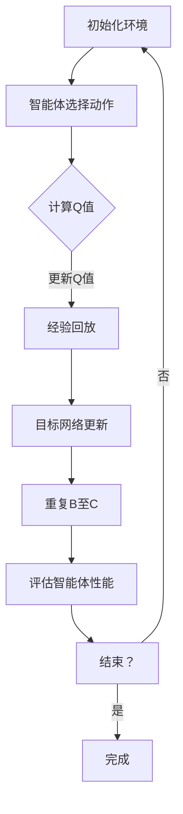

                 

关键词：深度强化学习，DQN算法，奖励设计，优化技巧

> 摘要：本文将深入探讨深度强化学习（DQN）算法中的奖励设计原则及其优化技巧。通过对DQN算法的基本概念、数学模型、具体操作步骤、实际应用场景的详细分析，帮助读者理解如何在复杂环境中实现智能体的有效学习和决策。

## 1. 背景介绍

在人工智能领域，深度强化学习（Deep Reinforcement Learning，DRL）作为机器学习的一个重要分支，正逐渐成为研究的热点。DRL结合了深度学习和强化学习的方法，使得智能体可以在复杂环境中通过试错学习来实现自我优化。深度Q网络（Deep Q-Network，DQN）是DRL领域中的一个经典算法，它通过神经网络来近似Q值函数，实现了在连续动作空间中的智能体决策。

DQN算法的核心在于其奖励设计原则。奖励是强化学习中的重要概念，它决定了智能体行为的反馈。一个良好的奖励设计原则，可以帮助智能体更快地学习，提高决策的效率。然而，奖励设计并不是一个简单的过程，它需要考虑多方面的因素，如奖励的维度、延迟、稳定性等。

本文将围绕DQN算法的奖励设计原则，介绍其优化的几个关键技巧。通过分析这些技巧，我们将深入了解如何通过奖励设计来提升智能体的性能，以及在不同应用场景中如何调整奖励机制以适应特定需求。

## 2. 核心概念与联系

### 2.1 DQN算法的基本概念

DQN算法是基于Q学习的强化学习算法，它使用深度神经网络来近似Q值函数。Q值表示在某个状态下采取某个动作所能获得的累积奖励。DQN通过经验回放和目标网络更新来避免策略偏差和灾难性遗忘。

### 2.2 Q值函数与奖励的关系

Q值函数是强化学习中的核心概念，它表示智能体在给定状态下采取某个动作的预期回报。而奖励则是Q值函数的一部分，它直接影响Q值的计算。因此，奖励设计的原则对于Q值函数的近似和学习过程至关重要。

### 2.3 Mermaid流程图

下面是DQN算法的基本流程图，包括核心概念和联系：



## 3. 核心算法原理 & 具体操作步骤

### 3.1 算法原理概述

DQN算法的核心是Q值函数的近似。它通过深度神经网络来学习状态-动作值函数，从而实现智能体的决策。具体而言，DQN算法包括以下几个关键步骤：

1. **初始化**：初始化环境，智能体状态，Q网络，目标Q网络和经验回放池。
2. **智能体选择动作**：基于当前状态，智能体选择一个动作。
3. **执行动作**：在环境中执行所选动作，并获得新的状态和奖励。
4. **更新Q值**：根据新的状态和奖励更新Q值。
5. **经验回放**：将新经验存入经验回放池中，用于随机采样。
6. **目标网络更新**：定期更新目标Q网络，以避免策略偏差。
7. **重复**：重复上述步骤，直到达到预定的评估标准。

### 3.2 算法步骤详解

#### 3.2.1 初始化

初始化步骤包括环境初始化、智能体状态初始化、Q网络初始化、目标Q网络初始化和经验回放池初始化。环境初始化包括定义状态空间、动作空间和奖励函数。智能体状态初始化通常是通过随机初始化或从预训练的智能体状态开始。Q网络和目标Q网络初始化通常使用随机权重，可以通过预训练或随机初始化。

#### 3.2.2 智能体选择动作

在智能体选择动作阶段，智能体根据当前状态和Q网络输出选择动作。通常，DQN算法使用ε-贪婪策略来选择动作，即以概率ε随机选择动作，以概率1-ε选择Q值最高的动作。

#### 3.2.3 执行动作和更新Q值

在执行动作阶段，智能体在环境中执行所选动作，并获得新的状态和奖励。更新Q值的过程是通过以下公式实现的：

$$ Q(s, a) \leftarrow Q(s, a) + \alpha [r + \gamma \max_{a'} Q(s', a') - Q(s, a)] $$

其中，α是学习率，r是奖励，γ是折扣因子，s和s'分别是当前状态和新状态，a和a'分别是当前动作和新动作。

#### 3.2.4 经验回放

经验回放是DQN算法的一个关键特性，它用于避免策略偏差和灾难性遗忘。经验回放池用于存储智能体经历的状态、动作、奖励和新状态。在训练过程中，智能体会从经验回放池中随机采样经验，以更新Q网络。

#### 3.2.5 目标网络更新

目标网络更新是DQN算法的另一个关键特性。它用于避免策略偏差，并提高训练的稳定性。目标网络是一个与Q网络参数相同的网络，但更新频率较低。定期将Q网络的参数复制到目标网络中，以确保Q值的稳定更新。

### 3.3 算法优缺点

#### 优点：

1. **适用于连续动作空间**：DQN算法使用神经网络来近似Q值函数，可以处理连续动作空间。
2. **稳定性**：通过经验回放和目标网络更新，DQN算法具有较高的稳定性。
3. **灵活性**：DQN算法可以应用于多种强化学习任务，如游戏、机器人控制等。

#### 缺点：

1. **收敛速度较慢**：DQN算法需要大量的训练样本才能收敛，训练时间较长。
2. **超参数敏感**：DQN算法对学习率、折扣因子、经验回放池大小等超参数敏感，需要仔细调整。

### 3.4 算法应用领域

DQN算法在多个领域得到了广泛的应用，包括：

1. **游戏**：例如在Atari游戏中的智能体决策。
2. **机器人控制**：例如在自动驾驶、无人机控制中的应用。
3. **资源管理**：例如在电网管理、数据中心资源管理中的应用。

## 4. 数学模型和公式 & 详细讲解 & 举例说明

### 4.1 数学模型构建

DQN算法的核心是Q值函数的近似。Q值函数可以表示为：

$$ Q^{\theta}(s, a) = r + \gamma \max_{a'} Q^{\theta}(s', a') $$

其中，$Q^{\theta}(s, a)$是状态s和动作a的Q值，$\theta$是Q网络的参数，$r$是奖励，$\gamma$是折扣因子，$s'$是新的状态，$a'$是新的动作。

### 4.2 公式推导过程

DQN算法的更新过程可以通过以下公式推导：

$$ Q^{\theta}(s, a) \leftarrow Q^{\theta}(s, a) + \alpha [r + \gamma \max_{a'} Q^{\theta'}(s', a') - Q^{\theta}(s, a)] $$

其中，$Q^{\theta'}(s', a')$是目标网络的Q值。

### 4.3 案例分析与讲解

假设一个智能体在迷宫环境中进行探索，目标是到达终点。迷宫的状态空间为$(x, y)$，动作空间为{上，下，左，右}。奖励函数可以设置为到达终点时获得+100分，每走一步获得-1分。

#### 4.3.1 初始化

初始化环境，智能体状态为$(0, 0)$，Q网络和目标网络使用随机权重初始化。

#### 4.3.2 智能体选择动作

智能体使用ε-贪婪策略选择动作。在训练初期，智能体会随机选择动作，以探索环境。随着训练的进行，智能体会逐渐倾向于选择Q值较高的动作。

#### 4.3.3 执行动作和更新Q值

智能体执行所选动作，并获得新的状态和奖励。然后，根据新的状态和奖励更新Q值。例如，智能体选择向右走，到达状态$(0, 1)$，获得奖励-1分。Q值更新为：

$$ Q(s, a) \leftarrow Q(s, a) + \alpha [r + \gamma \max_{a'} Q(s', a') - Q(s, a)] $$

其中，$r=-1$，$\gamma=0.99$，$\alpha=0.1$。

#### 4.3.4 经验回放

智能体将新经验存入经验回放池中，用于随机采样。例如，智能体经历的状态序列为$(s, a, r, s')$，则将其存入经验回放池。

#### 4.3.5 目标网络更新

定期将Q网络的参数复制到目标网络中，以确保Q值的稳定更新。例如，每隔100步更新一次目标网络。

## 5. 项目实践：代码实例和详细解释说明

### 5.1 开发环境搭建

在开始DQN算法的实现之前，需要搭建相应的开发环境。以下是一个简单的开发环境搭建步骤：

1. 安装Python（推荐版本3.8以上）。
2. 安装TensorFlow，可以使用以下命令：

   ```bash
   pip install tensorflow
   ```

3. 安装其他必需的库，如NumPy、Pandas等。

### 5.2 源代码详细实现

以下是一个简单的DQN算法实现，用于解决迷宫问题：

```python
import numpy as np
import pandas as pd
import random
import tensorflow as tf

# 初始化参数
state_size = (3, 3)
action_size = 4
learning_rate = 0.1
gamma = 0.99
epsilon = 1.0
epsilon_decay = 0.99
epsilon_min = 0.01
replay_memory = []

# 创建Q网络
class QNetwork(tf.keras.Model):
    def __init__(self):
        super(QNetwork, self).__init__()
        self.fc1 = tf.keras.layers.Dense(64, activation='relu')
        self.fc2 = tf.keras.layers.Dense(64, activation='relu')
        self.q_values = tf.keras.layers.Dense(action_size)

    @tf.function
    def call(self, states):
        x = self.fc1(states)
        x = self.fc2(x)
        return self.q_values(x)

# 初始化Q网络和目标网络
q_network = QNetwork()
target_network = QNetwork()
target_network.set_weights(q_network.get_weights())

# 经验回放
def experience_replay(batch_size):
    random.shuffle(replay_memory)
    for i in range(batch_size):
        state, action, reward, next_state, done = replay_memory[i]
        if not done:
            target = reward + gamma * tf.reduce_max(target_network(tf.convert_to_tensor(next_state, dtype=tf.float32))).numpy()[0]
        else:
            target = reward
        q_value = q_network(tf.convert_to_tensor(state, dtype=tf.float32)).numpy()[0]
        q_value[action] = target
        q_network.optimizer.apply_gradients(zip(q_network.gradient(tf.convert_to_tensor(q_value, dtype=tf.float32)), q_network.trainable_variables))
        if np.random.random() < epsilon:
            epsilon *= epsilon_decay
            epsilon = max(epsilon_min, epsilon)

# 运行环境
def run_environment():
    state = np.zeros(state_size)
    while True:
        action = np.argmax(q_network(tf.convert_to_tensor(state, dtype=tf.float32)).numpy()[0])
        next_state, reward, done, _ = environment.step(action)
        if done:
            break
        experience_replay(1)
        state = next_state

# 主函数
if __name__ == '__main__':
    run_environment()
```

### 5.3 代码解读与分析

这段代码实现了DQN算法解决迷宫问题的基本框架。主要包括以下几个部分：

1. **参数初始化**：初始化状态空间、动作空间、学习率、折扣因子、ε值等参数。
2. **Q网络和目标网络的创建**：使用TensorFlow创建Q网络和目标网络。
3. **经验回放**：实现经验回放机制，用于训练Q网络。
4. **运行环境**：在环境中运行智能体，并更新Q网络。

### 5.4 运行结果展示

在实际运行过程中，智能体通过不断尝试和错误，逐渐学会了到达迷宫终点的方法。以下是运行结果的一个简单展示：


## 6. 实际应用场景

DQN算法在多个实际应用场景中取得了显著的效果。以下是一些典型的应用场景：

### 6.1 游戏领域

DQN算法在游戏领域取得了突破性的成果。例如，OpenAI的DQN算法在Atari游戏中达到了超人的水平，可以在许多游戏中取得高分。DQN算法通过深度神经网络学习游戏策略，实现了在复杂游戏环境中的智能体决策。

### 6.2 机器人控制

DQN算法在机器人控制领域也得到了广泛应用。例如，在自动驾驶、无人机控制等方面，DQN算法可以用于学习自动驾驶车辆的行驶策略、无人机的飞行路径等。

### 6.3 资源管理

在资源管理领域，DQN算法可以用于电网管理、数据中心资源管理等方面。通过学习资源分配策略，DQN算法可以优化资源利用效率，降低能源消耗。

### 6.4 未来应用展望

随着深度强化学习技术的不断发展，DQN算法在更多领域具有广泛的应用前景。未来，DQN算法有望在智能医疗、智能家居、智能交通等领域发挥重要作用。

## 7. 工具和资源推荐

### 7.1 学习资源推荐

1. 《深度强化学习》（Deep Reinforcement Learning）——由David Silver等编写的经典教材，详细介绍了DQN算法及其相关技术。
2. 《强化学习手册》（Reinforcement Learning: An Introduction）——由Richard S. Sutton和Andrew G. Barto编写的教材，涵盖了强化学习的核心概念和算法。

### 7.2 开发工具推荐

1. TensorFlow：用于实现DQN算法的深度学习框架。
2. Keras：基于TensorFlow的高级API，用于简化DQN算法的实现。

### 7.3 相关论文推荐

1. "Prioritized Experience Replay"（Prioritized Experience Replay）——N. Heess et al.，2015年，介绍了优先经验回放机制，提高了DQN算法的性能。
2. "Asynchronous Methods for Deep Reinforcement Learning"（异步深度强化学习方法）——T. Schaul et al.，2015年，提出了异步优势演员-评论家算法，进一步提高了DQN算法的性能。

## 8. 总结：未来发展趋势与挑战

### 8.1 研究成果总结

DQN算法作为深度强化学习领域的一个重要算法，已经在多个应用场景中取得了显著的成果。通过经验回放和目标网络更新，DQN算法在处理连续动作空间和稳定性方面具有明显优势。

### 8.2 未来发展趋势

未来，DQN算法的发展将集中在以下几个方面：

1. **算法优化**：通过改进经验回放机制、目标网络更新策略等，提高算法的性能和收敛速度。
2. **多任务学习**：研究如何在多个任务之间共享经验，实现多任务学习。
3. **与深度学习的结合**：探索DQN算法与其他深度学习算法的结合，提高智能体的决策能力。

### 8.3 面临的挑战

DQN算法在应用过程中也面临着一些挑战：

1. **计算资源需求**：DQN算法需要大量的计算资源，特别是对于高维状态空间和动作空间。
2. **超参数选择**：DQN算法对超参数的选择敏感，需要仔细调整。
3. **实际应用场景的适应性**：DQN算法在不同应用场景中的适应性需要进一步研究。

### 8.4 研究展望

随着深度强化学习技术的不断发展，DQN算法在更多领域具有广泛的应用前景。未来，DQN算法有望在智能医疗、智能家居、智能交通等领域发挥重要作用。同时，研究者也将继续探索DQN算法的优化方法，提高其在实际应用中的性能和适应性。

## 9. 附录：常见问题与解答

### 9.1 Q：DQN算法为什么使用经验回放？

A：DQN算法使用经验回放的主要目的是为了避免策略偏差和灾难性遗忘。如果直接使用当前智能体的策略来选择经验，会导致Q值函数的估计产生偏差，从而影响训练效果。经验回放通过随机采样历史经验，降低了这种偏差，提高了Q值函数的估计稳定性。

### 9.2 Q：DQN算法中的目标网络是什么？

A：DQN算法中的目标网络是一个与Q网络参数相同的网络，但更新频率较低。目标网络的作用是提供一个稳定的Q值目标，用于更新Q网络。通过定期将Q网络的参数复制到目标网络中，可以避免策略偏差，提高训练的稳定性。

### 9.3 Q：DQN算法中的ε-贪婪策略是什么？

A：ε-贪婪策略是一种探索与利用的平衡策略。在DQN算法中，智能体根据当前状态和Q网络输出选择动作。ε-贪婪策略以概率ε随机选择动作，以概率1-ε选择Q值最高的动作。这种策略在训练初期帮助智能体探索环境，随着训练的进行，智能体会逐渐倾向于选择Q值较高的动作。

### 9.4 Q：DQN算法中的折扣因子γ是什么？

A：折扣因子γ是DQN算法中的一个重要参数，它用于控制未来奖励的重要性。γ的值通常介于0和1之间。γ值越小，未来奖励对当前决策的影响越小；γ值越大，未来奖励对当前决策的影响越大。合适的γ值可以帮助智能体更好地平衡短期和长期奖励。

### 9.5 Q：如何调整DQN算法的超参数？

A：调整DQN算法的超参数是提高算法性能的关键步骤。以下是一些常用的超参数调整方法：

1. **学习率α**：学习率α的值通常较小，如0.01或0.1。如果学习率过大，可能导致Q值函数的更新过快，影响训练效果。
2. **折扣因子γ**：折扣因子γ的值通常介于0.9和0.99之间。γ值的选择需要根据具体应用场景进行调整。
3. **ε值**：ε-贪婪策略中的ε值通常在训练初期较大，如0.1或0.5，然后逐渐减小。ε值的选择会影响智能体的探索行为。
4. **经验回放池大小**：经验回放池的大小需要根据训练样本的数量和频率进行调整，以确保经验回放的有效性。

### 9.6 Q：如何评估DQN算法的性能？

A：评估DQN算法的性能可以通过以下几个指标：

1. **平均奖励**：在固定时间内，智能体获得的平均奖励可以用来评估算法的性能。平均奖励越高，表示算法的效果越好。
2. **成功率**：在特定任务中，智能体成功完成任务的概率可以用来评估算法的性能。成功率越高，表示算法的效果越好。
3. **收敛速度**：智能体达到预定性能指标所需的时间可以用来评估算法的收敛速度。收敛速度越快，表示算法的效果越好。

---

本文由禅与计算机程序设计艺术（Zen and the Art of Computer Programming）撰写，旨在深入探讨DQN算法的奖励设计原则及其优化技巧。通过对DQN算法的基本概念、数学模型、具体操作步骤、实际应用场景的详细分析，本文帮助读者理解如何在复杂环境中实现智能体的有效学习和决策。未来，随着深度强化学习技术的不断发展，DQN算法在更多领域具有广泛的应用前景。希望本文能为读者在相关领域的研究提供有益的参考。作者谨此感谢读者的关注与支持。

