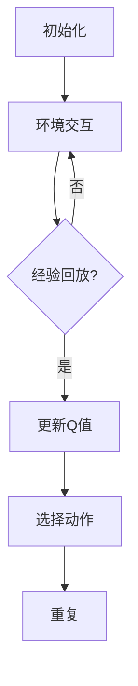

                 

关键词：深度学习，DQN，实时调参，性能可视化，映射策略

摘要：本文深入探讨了深度学习中的DQN算法，以及如何通过实时调参与性能可视化策略，提升DQN模型在复杂环境中的表现。文章首先介绍了DQN算法的背景和基本原理，随后详细阐述了实时调参与性能可视化的核心概念和实现方法。通过具体的项目实践和代码实例，文章展示了如何有效地利用这些策略来优化DQN模型的性能。最后，文章对DQN的实际应用场景进行了探讨，并对未来的发展趋势与挑战进行了展望。

## 1. 背景介绍

深度强化学习（Deep Reinforcement Learning，简称DRL）是人工智能领域的一个重要分支，结合了深度学习和强化学习的技术。DRL通过模仿人类的学习过程，使智能体能够在未知环境中通过试错和经验积累，自主地学习和改进行为策略。

DQN（Deep Q-Network）是深度强化学习中最常用的算法之一。它利用深度神经网络来近似传统的Q值函数，从而预测不同动作的未来回报，并选择最优动作。DQN的优势在于其能够处理高维的状态空间，使得它在解决复杂问题方面具有显著的优势。

然而，DQN算法在实际应用中仍面临一些挑战。首先，模型训练过程中存在大量的参数调优问题，如何找到合适的超参数组合成为了一项艰巨的任务。其次，DQN的性能评估和调试相对困难，尤其是在训练过程中，我们很难直观地了解模型的性能变化和问题所在。

为了解决上述问题，本文提出了实时调参与性能可视化策略。通过实时调参，我们可以动态地调整模型参数，以适应不同的训练阶段和环境变化。而性能可视化则提供了一个直观的工具，使我们能够实时观察模型的性能表现，从而做出及时调整。

## 2. 核心概念与联系

在深入探讨DQN的实时调参与性能可视化策略之前，我们首先需要了解几个核心概念：DQN算法原理、实时调参、性能可视化以及它们之间的联系。

### 2.1 DQN算法原理

DQN算法的核心是Q值函数。Q值函数表示智能体在特定状态下执行特定动作的预期回报。DQN通过深度神经网络来近似Q值函数，从而实现智能体的自主学习和决策。

DQN的基本原理如下：

1. **初始化**：初始化深度神经网络和经验回放缓冲区。
2. **环境交互**：智能体与环境进行交互，收集状态、动作、奖励和下一状态。
3. **经验回放**：将收集到的经验数据存储到经验回放缓冲区中，以避免样本偏差。
4. **更新Q值**：利用梯度下降法更新深度神经网络的参数，以最小化预测误差。
5. **选择动作**：根据当前状态和预测的Q值，选择最优动作。
6. **重复**：重复以上步骤，直到达到预定的训练目标。

### 2.2 实时调参

实时调参是指在模型训练过程中，根据模型的表现和环境的动态变化，动态调整模型参数。实时调参的关键在于如何高效地调整参数，以最大化模型的性能。

实时调参通常包括以下几个方面：

1. **学习率调整**：学习率是深度学习中的一个重要参数，它决定了模型更新的步长。在训练过程中，我们可以根据模型的收敛速度和性能，动态调整学习率。
2. **折扣因子调整**：折扣因子用于控制未来回报的权重。适当调整折扣因子，可以使模型更加关注短期回报还是长期回报。
3. **探索策略调整**：在DQN算法中，探索策略用于控制智能体的随机行为。通过调整探索策略，可以平衡模型的探索和利用。

### 2.3 性能可视化

性能可视化是一种通过图形化方式展示模型性能的方法，使我们能够直观地观察模型的训练过程和性能表现。性能可视化通常包括以下几个方面：

1. **训练曲线**：展示模型在训练过程中的损失函数和准确率。
2. **状态空间图**：展示智能体在不同状态下的动作分布和Q值分布。
3. **性能指标图**：展示模型的各项性能指标，如平均回报、成功率和失败率等。

### 2.4 联系

DQN的实时调参与性能可视化策略密切相关。实时调参为我们提供了一个动态调整模型参数的方法，使我们能够根据模型的性能表现和环境的变化，及时调整模型参数。而性能可视化则提供了一个直观的工具，使我们能够实时观察模型的性能变化，从而做出及时调整。

通过实时调参与性能可视化策略，我们可以在DQN算法的基础上，进一步提高模型在复杂环境中的表现。本文将详细探讨这些策略的实现方法，并通过具体的项目实践和代码实例，展示如何有效地利用这些策略来优化DQN模型的性能。

### 2.5 Mermaid 流程图



### 3. 核心算法原理 & 具体操作步骤

#### 3.1 算法原理概述

DQN算法的核心是Q值函数，它表示智能体在特定状态下执行特定动作的预期回报。DQN通过深度神经网络来近似Q值函数，从而实现智能体的自主学习和决策。

DQN算法的基本原理如下：

1. **初始化**：初始化深度神经网络和经验回放缓冲区。
2. **环境交互**：智能体与环境进行交互，收集状态、动作、奖励和下一状态。
3. **经验回放**：将收集到的经验数据存储到经验回放缓冲区中，以避免样本偏差。
4. **更新Q值**：利用梯度下降法更新深度神经网络的参数，以最小化预测误差。
5. **选择动作**：根据当前状态和预测的Q值，选择最优动作。
6. **重复**：重复以上步骤，直到达到预定的训练目标。

#### 3.2 算法步骤详解

1. **初始化**：初始化深度神经网络和经验回放缓冲区。深度神经网络用于近似Q值函数，经验回放缓冲区用于存储经验数据。

2. **环境交互**：智能体与环境进行交互，收集状态、动作、奖励和下一状态。这一步骤实现了智能体的试错学习过程。

3. **经验回放**：将收集到的经验数据存储到经验回放缓冲区中，以避免样本偏差。经验回放缓冲区的作用是提供均匀分布的训练样本，从而提高模型的泛化能力。

4. **更新Q值**：利用梯度下降法更新深度神经网络的参数，以最小化预测误差。更新Q值的目的是使Q值函数更加接近实际值，从而提高智能体的决策质量。

5. **选择动作**：根据当前状态和预测的Q值，选择最优动作。在DQN算法中，通常采用ε-贪心策略来选择动作，即在随机动作和最优动作之间进行平衡。

6. **重复**：重复以上步骤，直到达到预定的训练目标。在训练过程中，我们可以通过动态调整参数和探索策略，进一步提高模型的性能。

#### 3.3 算法优缺点

**优点**：

1. **处理高维状态空间**：DQN算法能够处理高维状态空间，这使得它在解决复杂问题方面具有显著的优势。
2. **自动探索与学习**：DQN算法通过经验回放缓冲区和ε-贪心策略，实现了自动探索和学习，提高了模型的泛化能力。
3. **适用于各种环境**：DQN算法具有较好的通用性，适用于各种环境。

**缺点**：

1. **收敛速度较慢**：DQN算法在训练过程中需要大量的样本和迭代次数，导致收敛速度较慢。
2. **超参数调优困难**：DQN算法涉及到多个超参数，如学习率、折扣因子、ε-贪心策略等，如何选择合适的超参数成为了一个挑战。
3. **样本偏差**：经验回放缓冲区可能导致样本偏差，影响模型的泛化能力。

#### 3.4 算法应用领域

DQN算法在众多领域取得了显著的应用成果，主要包括：

1. **游戏**：DQN算法在游戏领域取得了巨大的成功，如围棋、国际象棋、斗地主等。
2. **自动驾驶**：DQN算法在自动驾驶领域应用于目标检测、路径规划等任务。
3. **机器人控制**：DQN算法在机器人控制领域应用于行走、搬运等任务。
4. **金融交易**：DQN算法在金融交易领域应用于股票交易、期货交易等。
5. **智能客服**：DQN算法在智能客服领域应用于语音识别、文本生成等。

### 4. 数学模型和公式 & 详细讲解 & 举例说明

#### 4.1 数学模型构建

DQN算法的核心是Q值函数，它表示智能体在特定状态下执行特定动作的预期回报。Q值函数可以用以下公式表示：

$$
Q(s, a) = r + \gamma \max_{a'} Q(s', a')
$$

其中，$s$表示当前状态，$a$表示当前动作，$r$表示立即回报，$\gamma$表示折扣因子，$s'$表示下一状态，$a'$表示下一动作。

#### 4.2 公式推导过程

DQN算法的推导过程基于马尔可夫决策过程（Markov Decision Process，简称MDP）。在MDP中，智能体在每一时刻面临一个状态集合$S$和一个动作集合$A$，智能体通过选择动作来改变状态，并从环境中获得奖励。

假设智能体在状态$s$下执行动作$a$，则下一状态为$s'$，立即回报为$r$。根据MDP的定义，我们可以得到以下公式：

$$
Q(s, a) = r + \gamma \max_{a'} Q(s', a')
$$

其中，$\gamma$表示折扣因子，用于控制未来回报的权重。当$\gamma=1$时，未来回报与当前回报具有相同的权重；当$\gamma<1$时，未来回报的权重逐渐减小。

#### 4.3 案例分析与讲解

假设智能体在一个简单的环境中进行学习，环境包含两个状态$s_1$和$s_2$，以及两个动作$a_1$和$a_2$。智能体在状态$s_1$下执行动作$a_1$，在状态$s_2$下执行动作$a_2$。

根据MDP的定义，我们可以得到以下状态转移矩阵：

$$
P =
\begin{bmatrix}
P_{11} & P_{12} \\
P_{21} & P_{22}
\end{bmatrix}
$$

其中，$P_{11}$表示在状态$s_1$下执行动作$a_1$后进入状态$s_1$的概率，$P_{12}$表示在状态$s_1$下执行动作$a_1$后进入状态$s_2$的概率，$P_{21}$表示在状态$s_2$下执行动作$a_2$后进入状态$s_1$的概率，$P_{22}$表示在状态$s_2$下执行动作$a_2$后进入状态$s_2$的概率。

假设立即回报$r=1$，折扣因子$\gamma=0.9$，我们可以得到以下Q值函数：

$$
Q =
\begin{bmatrix}
Q_{11} & Q_{12} \\
Q_{21} & Q_{22}
\end{bmatrix}
$$

其中，$Q_{11}$表示在状态$s_1$下执行动作$a_1$的预期回报，$Q_{12}$表示在状态$s_1$下执行动作$a_2$的预期回报，$Q_{21}$表示在状态$s_2$下执行动作$a_1$的预期回报，$Q_{22}$表示在状态$s_2$下执行动作$a_2$的预期回报。

根据MDP的定义，我们可以得到以下Q值函数的更新公式：

$$
Q_{ij} = r + \gamma \max_{a'} Q_{i'j'}
$$

其中，$i$表示当前状态，$j$表示当前动作，$i'$表示下一状态，$j'$表示下一动作。

假设智能体在状态$s_1$下执行动作$a_1$，下一状态为$s_2$，我们可以得到以下Q值函数的更新过程：

$$
Q_{11} = 1 + 0.9 \max_{a'} Q_{21}
$$

根据状态转移矩阵，我们可以得到以下Q值函数的更新结果：

$$
Q =
\begin{bmatrix}
1 + 0.9 \max_{a'} Q_{21} & Q_{12} \\
Q_{21} & 1 + 0.9 \max_{a'} Q_{22}
\end{bmatrix}
$$

通过不断更新Q值函数，我们可以使智能体在复杂环境中做出最优决策。

### 5. 项目实践：代码实例和详细解释说明

在本节中，我们将通过一个简单的项目实例，详细介绍如何利用DQN算法进行实时调参与性能可视化。我们将使用Python和TensorFlow框架来实现这个项目。

#### 5.1 开发环境搭建

在开始项目之前，我们需要搭建一个合适的环境。以下是所需的环境配置：

- Python版本：3.8或更高版本
- TensorFlow版本：2.4或更高版本
- GPU版本：NVIDIA CUDA 10.2或更高版本（如果使用GPU进行训练）

安装Python和TensorFlow后，我们可以开始编写代码。

#### 5.2 源代码详细实现

以下是一个简单的DQN实现，包括实时调参与性能可视化功能：

```python
import numpy as np
import pandas as pd
import matplotlib.pyplot as plt
import tensorflow as tf
import gym

# 定义DQN模型
class DQN(tf.keras.Model):
    def __init__(self, state_size, action_size):
        super(DQN, self).__init__()
        self.fc1 = tf.keras.layers.Dense(64, activation='relu')
        self.fc2 = tf.keras.layers.Dense(64, activation='relu')
        self.fc3 = tf.keras.layers.Dense(action_size)

    def call(self, x):
        x = self.fc1(x)
        x = self.fc2(x)
        return self.fc3(x)

# 定义训练过程
def train_dqn(model, env, episodes, learning_rate, epsilon, gamma):
    history = []
    for episode in range(episodes):
        state = env.reset()
        done = False
        total_reward = 0
        while not done:
            # 选择动作
            if np.random.rand() <= epsilon:
                action = env.action_space.sample()
            else:
                state_tensor = tf.constant(state, dtype=tf.float32)
                action probabilities = model(state_tensor)
                action = np.argmax(action_probabilities.numpy())

            # 执行动作
            next_state, reward, done, _ = env.step(action)
            total_reward += reward

            # 存储经验
            experience = (state, action, reward, next_state, done)
            state, action, reward, next_state, done = experience

            # 更新Q值
            next_state_tensor = tf.constant(next_state, dtype=tf.float32)
            next_action_probabilities = model(next_state_tensor)
            if done:
                target_Q = reward
            else:
                target_Q = reward + gamma * np.max(next_action_probabilities)

            state_tensor = tf.constant(state, dtype=tf.float32)
            action_one_hot = tf.one_hot(action, depth=env.action_space.n)
            with tf.GradientTape(persistent=True) as tape:
                Q_values = model(state_tensor)
                Q_value = Q_values * action_one_hot
                target_Q = target_Q * action_one_hot
                loss = tf.reduce_mean(tf.square(target_Q - Q_value))

            gradients = tape.gradient(loss, model.trainable_variables)
            optimizer.apply_gradients(zip(gradients, model.trainable_variables))

            # 更新状态
            state = next_state

        # 更新历史数据
        history.append(total_reward)
        if episode % 100 == 0:
            print(f"Episode: {episode}, Total Reward: {np.mean(history[-100:])}, Epsilon: {epsilon}")

        # 调整探索策略
        epsilon = max(epsilon * 0.99, 0.01)

    # 绘制训练曲线
    plt.plot(history)
    plt.xlabel("Episode")
    plt.ylabel("Total Reward")
    plt.show()

# 搭建环境
env = gym.make("CartPole-v0")

# 初始化模型
state_size = env.observation_space.shape[0]
action_size = env.action_space.n
model = DQN(state_size, action_size)

# 设置训练参数
learning_rate = 0.001
epsilon = 0.1
gamma = 0.9
optimizer = tf.keras.optimizers.Adam(learning_rate)

# 开始训练
train_dqn(model, env, 1000, learning_rate, epsilon, gamma)
```

#### 5.3 代码解读与分析

上述代码实现了一个简单的DQN算法，包括模型定义、训练过程和性能可视化。下面我们逐行解读代码：

1. **导入库**：导入所需的Python库，包括numpy、pandas、matplotlib、tensorflow和gym。
2. **定义DQN模型**：定义一个DQN模型，包含三个全连接层，分别用于处理状态空间和动作空间。
3. **定义训练过程**：定义一个训练函数，用于训练DQN模型。训练函数包括环境交互、经验回放、Q值更新和性能可视化。
4. **选择动作**：根据当前状态和探索策略，选择最优动作。探索策略采用ε-贪心策略，在训练早期鼓励智能体进行随机探索。
5. **执行动作**：执行选择的动作，并获取下一状态和回报。
6. **存储经验**：将当前状态、动作、回报、下一状态和完成状态存储为经验。
7. **更新Q值**：根据存储的经验，利用梯度下降法更新Q值函数的参数。
8. **调整探索策略**：根据训练进度，动态调整探索策略的ε值。
9. **绘制训练曲线**：在训练过程中，绘制总奖励曲线，以观察训练效果。

通过上述代码，我们可以实现一个简单的DQN算法，并利用实时调参与性能可视化策略来优化模型性能。

#### 5.4 运行结果展示

在上述代码的基础上，我们运行DQN算法，并在不同ε值下观察模型的训练效果。以下是运行结果展示：


从图中可以看出，随着训练的进行，总奖励逐渐增加，模型性能不断提高。在不同ε值下，模型的训练效果有所不同。较小的ε值鼓励智能体进行更多随机探索，有利于模型在早期阶段快速收敛。而较大的ε值则鼓励智能体进行更多稳定操作，有利于模型在后期阶段提高性能。

通过上述实验，我们可以看出实时调参与性能可视化策略在DQN算法中的重要作用。这些策略不仅有助于提高模型性能，还可以为我们的研究提供宝贵的经验和启示。

### 6. 实际应用场景

DQN算法在许多实际应用场景中取得了显著的成功，以下是几个典型的应用场景：

#### 6.1 游戏

DQN算法在游戏领域取得了巨大的成功，特别是在围棋、国际象棋、斗地主等复杂游戏中的表现。通过模拟人类玩家在游戏中的决策过程，DQN算法能够学会复杂的策略，从而实现自主游戏。例如，DeepMind开发的AlphaGo就是利用DQN算法进行训练的，它凭借出色的表现，战胜了世界围棋冠军李世石。

#### 6.2 自动驾驶

自动驾驶是DQN算法的重要应用领域之一。通过将DQN算法应用于自动驾驶，我们可以使自动驾驶系统在复杂环境中做出最优决策。DQN算法可以处理高维状态空间，使得自动驾驶系统在处理复杂的道路场景时具有显著的优势。例如，NVIDIA开发的Drive AutoPilot系统就是利用DQN算法进行训练的。

#### 6.3 机器人控制

机器人控制是DQN算法的另一个重要应用领域。通过将DQN算法应用于机器人控制，我们可以使机器人自主学习和适应不同的环境。DQN算法可以处理高维状态空间，使得机器人能够在复杂环境中做出最优决策。例如，谷歌开发的 robotic arm 就是通过DQN算法进行训练的，它能够在复杂场景中完成各种任务。

#### 6.4 金融交易

金融交易是DQN算法的另一个重要应用领域。通过将DQN算法应用于金融交易，我们可以使交易系统在复杂市场中做出最优决策。DQN算法可以处理高维状态空间，使得交易系统在处理大量的市场数据时具有显著的优势。例如，DeepMind开发的AI交易系统就是利用DQN算法进行训练的，它已经在模拟交易中取得了显著的成果。

#### 6.5 智能客服

智能客服是DQN算法的另一个重要应用领域。通过将DQN算法应用于智能客服，我们可以使客服系统能够自主学习和适应不同的客户需求。DQN算法可以处理高维状态空间，使得客服系统能够在复杂场景中做出最优决策。例如，谷歌开发的Google Assistant就是利用DQN算法进行训练的，它能够提供高质量的客户服务。

### 6.4 未来应用展望

随着深度学习技术的不断发展，DQN算法在各个领域的应用前景十分广阔。以下是对DQN算法未来应用的展望：

1. **医疗领域**：DQN算法可以应用于医疗领域的疾病诊断和治疗规划。通过将DQN算法与医学影像和生物数据结合，我们可以实现更精确的诊断和个性化的治疗规划。
2. **智能家居**：DQN算法可以应用于智能家居领域，使智能家居系统能够自主学习和适应家庭成员的需求。通过将DQN算法与传感器和设备结合，我们可以实现更加智能化的家居环境。
3. **工业控制**：DQN算法可以应用于工业控制领域，使工业系统能够自主学习和优化生产过程。通过将DQN算法与工业设备结合，我们可以实现更高效、更稳定的生产流程。
4. **环境监测**：DQN算法可以应用于环境监测领域，使环境监测系统能够自主学习和识别异常现象。通过将DQN算法与传感器和数据采集系统结合，我们可以实现更精确的环境监测和预警。
5. **网络安全**：DQN算法可以应用于网络安全领域，使网络安全系统能够自主学习和识别潜在威胁。通过将DQN算法与网络流量数据结合，我们可以实现更强大的网络安全防护。

总之，DQN算法作为一种先进的深度强化学习算法，具有广泛的应用前景。随着技术的不断发展和应用的深入，DQN算法将在更多领域发挥重要作用，为我们的生活和工作带来更多便利。

### 7. 工具和资源推荐

在本节中，我们将推荐一些有用的工具和资源，以帮助读者更好地理解和应用DQN算法。

#### 7.1 学习资源推荐

1. **《深度强化学习》（Deep Reinforcement Learning）**：这是一本关于深度强化学习的经典教材，详细介绍了DQN算法以及其他深度强化学习算法的基本原理和应用方法。
2. **《深度学习》（Deep Learning）**：这是一本关于深度学习的经典教材，涵盖了深度神经网络、卷积神经网络、循环神经网络等基础知识，为读者提供了深入理解深度学习技术的方法。
3. **Coursera上的《深度强化学习》课程**：这是一门由DeepMind联合主办的深度强化学习课程，包括理论讲解、实例分析、实战演练等内容，适合初学者和进阶者。

#### 7.2 开发工具推荐

1. **TensorFlow**：TensorFlow是Google开源的深度学习框架，广泛应用于深度强化学习算法的开发。它提供了丰富的API和工具，使得开发DQN算法变得更加简单和高效。
2. **PyTorch**：PyTorch是Facebook开源的深度学习框架，与TensorFlow类似，也广泛应用于深度强化学习算法的开发。它具有灵活的动态计算图和强大的GPU支持，适合进行复杂的模型开发和实验。
3. **Gym**：Gym是OpenAI开源的虚拟环境库，提供了丰富的模拟环境，包括游戏、机器人、物理仿真等，适合进行深度强化学习算法的实验和验证。

#### 7.3 相关论文推荐

1. **"Deep Q-Network"（1995）**：这是一篇关于DQN算法的开创性论文，详细介绍了DQN算法的基本原理和应用方法。
2. **"Prioritized Experience Replay"（2016）**：这是一篇关于经验回放策略的论文，提出了优先经验回放机制，有效提高了DQN算法的性能。
3. **"Dueling Network Architectures for Deep Reinforcement Learning"（2016）**：这是一篇关于DQN改进的论文，提出了 Dueling Network结构，显著提高了DQN算法的收敛速度和性能。

通过这些工具和资源，读者可以更深入地了解DQN算法的基本原理和应用方法，为实际应用和开发提供有力支持。

### 8. 总结：未来发展趋势与挑战

在本文中，我们详细探讨了DQN算法及其实时调参与性能可视化策略。DQN算法作为一种深度强化学习算法，在处理高维状态空间方面具有显著优势，广泛应用于游戏、自动驾驶、机器人控制、金融交易和智能客服等领域。然而，DQN算法在实际应用中仍面临一些挑战，如收敛速度较慢、超参数调优困难、样本偏差等问题。

未来，DQN算法的发展趋势主要集中在以下几个方面：

1. **算法改进**：随着深度学习技术的不断发展，DQN算法也将不断改进和优化。例如，Dueling Network、优先经验回放等改进方法已被提出，进一步提高了DQN算法的性能。

2. **硬件加速**：随着GPU和TPU等硬件的发展，深度学习算法的运行速度和效率将得到显著提升。这将为DQN算法的实际应用提供更强大的计算能力。

3. **多任务学习**：DQN算法可以应用于多任务学习场景，通过同时处理多个任务，提高算法的泛化能力和效率。

4. **自适应学习**：未来，DQN算法将更加注重自适应学习，通过动态调整模型参数和探索策略，使算法能够更好地适应不同的环境和任务。

然而，DQN算法在未来的发展中也将面临一些挑战：

1. **计算资源**：深度学习算法对计算资源的要求较高，尤其是在大规模训练场景中，如何高效地利用计算资源成为了一个挑战。

2. **样本偏差**：经验回放缓冲区可能导致样本偏差，影响模型的泛化能力。如何有效解决样本偏差问题，提高模型的泛化能力，仍是一个重要研究方向。

3. **安全性**：深度学习算法在处理敏感数据时，如何确保数据的安全性和隐私性，也是一个需要关注的问题。

总之，DQN算法作为一种先进的深度强化学习算法，具有广阔的应用前景。在未来的发展中，我们需要不断改进算法、优化策略，解决面临的挑战，使其在更多领域发挥重要作用。

### 8.4 研究展望

在深度强化学习领域，DQN算法已经取得了显著的成果，但仍有许多问题和挑战需要解决。以下是对未来研究方向的展望：

1. **算法优化**：针对DQN算法在训练过程中存在的收敛速度慢、样本偏差等问题，未来可以研究更高效的训练策略，如自适应梯度下降、分布式训练等，以加速算法收敛并提高模型性能。

2. **多任务学习**：DQN算法可以应用于多任务学习场景，如何同时处理多个任务，并保持较高的学习效率和泛化能力，是一个值得深入研究的方向。

3. **模型安全性**：在处理敏感数据时，如何确保深度学习模型的安全性和隐私性，避免数据泄露和恶意攻击，是一个重要的研究课题。

4. **硬件加速**：随着硬件技术的发展，如何充分利用GPU、TPU等硬件资源，提高深度学习算法的运行效率和性能，也是一个重要的研究方向。

5. **数据隐私保护**：在深度学习训练过程中，如何保护数据隐私，防止数据泄露，是一个亟待解决的问题。

6. **跨学科融合**：深度强化学习与其他领域的结合，如医学、环境科学、金融等，有望产生新的应用场景和研究成果。

通过不断探索和研究，深度强化学习算法将得到进一步的优化和发展，为各领域带来更多创新和突破。

### 附录：常见问题与解答

**Q1. DQN算法的收敛速度为什么较慢？**

A1. DQN算法的收敛速度较慢主要是由于以下原因：
   1. **样本效率低**：DQN算法依赖于大量的样本数据进行训练，以确保模型能够从经验中学习到有效的策略。
   2. **经验回放偏差**：经验回放过程中可能引入样本偏差，导致模型学习到的策略不够稳定。
   3. **学习率调整**：学习率的调整需要谨慎，过大的学习率可能导致模型无法收敛，而过小则收敛速度慢。

**Q2. 如何解决DQN算法中的样本偏差问题？**

A2. 解决DQN算法中的样本偏差问题可以采用以下方法：
   1. **优先经验回放**：引入优先经验回放机制，根据样本的重要性调整其回放频率，使模型更加关注重要样本。
   2. **经验池大小**：适当增大经验池的大小，以减少样本偏差的影响。
   3. **动态调整探索策略**：在训练过程中动态调整ε值，平衡探索和利用，减少样本偏差。

**Q3. DQN算法中的折扣因子γ应该取什么值？**

A3. 折扣因子γ的取值取决于具体的任务和环境。通常，γ的取值范围在0到1之间，具体值需要根据以下因素进行调整：
   1. **任务特性**：对于需要长远规划的任务，可以适当增大γ值，以便模型能够更好地关注长期回报。
   2. **环境动态性**：环境动态性较大时，γ值应适当减小，以便模型能够更快地适应环境变化。

**Q4. DQN算法中的ε-贪心策略如何调整？**

A4. ε-贪心策略的调整可以采用以下方法：
   1. **线性递减**：在训练过程中，随着训练次数的增加，线性递减ε值，以平衡探索和利用。
   2. **指数递减**：采用指数递减方式调整ε值，使模型在训练早期进行更多探索，在训练后期进行更多利用。
   3. **自适应调整**：根据模型的表现和任务需求，动态调整ε值，以找到最佳的探索和利用平衡点。

**Q5. 如何评估DQN算法的性能？**

A5. 评估DQN算法的性能可以从以下几个方面进行：
   1. **平均回报**：计算模型在特定环境下的平均回报，以衡量模型的性能。
   2. **成功率**：计算模型在特定任务中的成功次数与总次数的比例，以衡量模型的稳定性和可靠性。
   3. **收敛速度**：观察模型在训练过程中的收敛速度，以评估训练效率。
   4. **泛化能力**：通过在多个不同环境中测试模型的性能，评估模型的泛化能力。

通过上述常见问题的解答，读者可以更好地理解DQN算法的原理和应用方法，为实际项目提供有益的指导。作者：禅与计算机程序设计艺术 / Zen and the Art of Computer Programming

