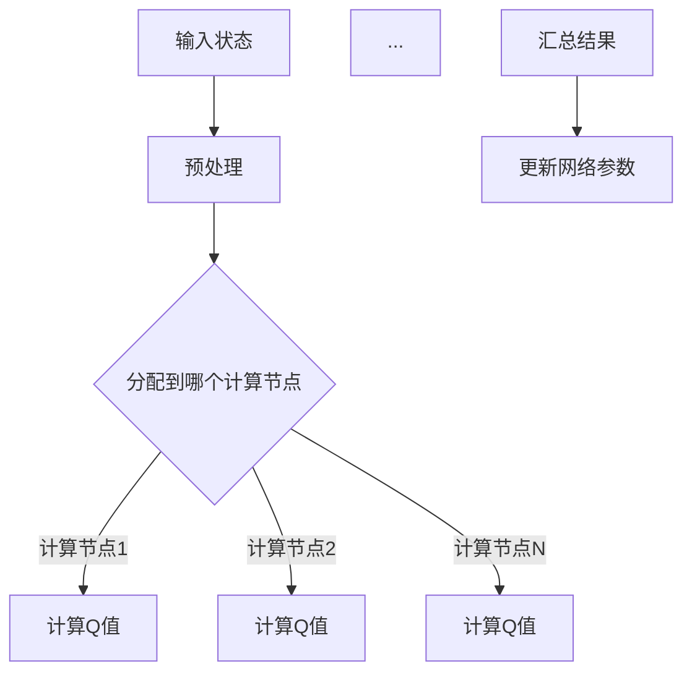

                 

### 背景介绍 Background Introduction

在当今的深度学习领域，尤其是强化学习（Reinforcement Learning，RL）中，深度Q网络（Deep Q-Network，DQN）是一种广泛使用的算法。DQN通过模仿人类学习过程，实现了在复杂环境中的自主决策能力。然而，传统的DQN由于在训练过程中存在大量计算和存储需求，导致训练时间较长，影响了其实际应用场景的广泛推广。

并行化处理作为一种提高计算效率和训练速度的有效手段，越来越受到研究者和工业界的重视。本文旨在探讨DQN的并行化处理方法，分析其加速学习与实施的具体技术细节，为实际应用提供理论依据和实用指导。

### 为什么要进行DQN的并行化处理 Why DQN Parallel Processing is Necessary

DQN的训练过程涉及大量的数据计算和状态评估，这需要耗费大量的时间和计算资源。尤其是在处理高维状态空间和动作空间时，传统的单线程训练方式难以满足实际需求。因此，对DQN进行并行化处理具有重要意义：

1. **提高训练效率**：通过并行处理，可以将训练任务分解到多个计算节点上，大大缩短训练时间。
2. **节约计算资源**：并行化处理可以充分利用现有的计算资源，提高资源利用率。
3. **扩展训练规模**：在并行化处理的支持下，可以处理更大规模的数据集，进一步提高模型的泛化能力。

### 核心概念与联系 Core Concepts and Connections

#### 深度Q网络（DQN）的基本原理

DQN是基于Q-learning算法的深度学习模型，其主要目标是学习到最优动作策略。在DQN中，Q函数被表示为一个深度神经网络（DNN），通过端到端的训练，直接从输入状态预测出动作的Q值。

#### 并行化处理的关键技术

1. **数据并行**：将训练数据集分成多个子集，每个子集由不同的计算节点进行处理，最后将结果汇总。
2. **模型并行**：将深度神经网络拆分成多个子网络，每个子网络负责处理不同的输入数据。
3. **流水线并行**：将DQN的训练过程分解为多个阶段，每个阶段可以并行执行。

#### Mermaid流程图

下面是DQN并行化处理的核心流程图：



### 核心算法原理 & 具体操作步骤 Core Algorithm Principle and Operation Steps

#### 3.1 算法原理概述

DQN的并行化处理主要基于分布式计算技术，其核心思想是将训练任务分解到多个计算节点上，通过并行处理来加速训练过程。

#### 3.2 算法步骤详解

1. **数据划分**：将训练数据集划分为多个子集，每个子集由不同的计算节点处理。
2. **预处理**：对每个子集进行数据预处理，包括状态编码、动作编码等。
3. **计算Q值**：每个计算节点根据预处理后的状态数据，通过DQN模型计算相应的Q值。
4. **结果汇总**：将所有计算节点的Q值结果汇总，更新DQN模型的网络参数。
5. **迭代训练**：重复以上步骤，直到达到预定的训练目标。

#### 3.3 算法优缺点

**优点**：

- 提高训练效率：通过并行处理，可以大大缩短训练时间。
- 节约计算资源：充分利用现有计算资源，提高资源利用率。

**缺点**：

- 需要复杂的分布式计算环境：实现并行化处理需要复杂的分布式计算环境，增加了部署和维护的难度。
- 可能引入通信开销：计算节点之间的通信可能会引入额外的开销，影响训练效率。

#### 3.4 算法应用领域

DQN的并行化处理可以应用于各种强化学习场景，如游戏AI、自动驾驶、机器人控制等。通过并行化处理，可以提高训练效率，缩短训练时间，为实际应用提供更多可能性。

### 数学模型和公式 Mathematical Model and Formulas

#### 4.1 数学模型构建

DQN的数学模型主要包括Q值函数、损失函数和优化算法。

1. **Q值函数**：

$$ Q(s, a) = \sum_{i=1}^{n} \gamma^i r_i + \sum_{j=1}^{n} \gamma^j Q(s', a_j) $$

其中，$s$ 表示当前状态，$a$ 表示当前动作，$r_i$ 表示在第 $i$ 次动作后获得的奖励，$\gamma$ 是折扣因子，$s'$ 表示执行动作 $a$ 后的新状态。

2. **损失函数**：

$$ L = \frac{1}{N} \sum_{i=1}^{N} (y_i - Q(s_i, a_i))^2 $$

其中，$y_i$ 是期望的Q值，$N$ 是样本数量。

3. **优化算法**：

使用梯度下降算法来优化Q值函数。

#### 4.2 公式推导过程

DQN的推导过程主要涉及两个关键步骤：状态价值函数的推导和动作价值函数的推导。

1. **状态价值函数**：

状态价值函数 $V(s)$ 是指在给定状态 $s$ 下，执行最优动作所能获得的期望奖励。根据马尔可夫决策过程（MDP）的定义，状态价值函数满足以下递归关系：

$$ V(s) = \sum_{a} \pi(a|s) \cdot Q(s, a) $$

其中，$\pi(a|s)$ 是在状态 $s$ 下执行动作 $a$ 的概率。

2. **动作价值函数**：

动作价值函数 $Q(s, a)$ 是指在给定状态 $s$ 下，执行动作 $a$ 所能获得的期望奖励。根据Q-learning算法的定义，动作价值函数满足以下递归关系：

$$ Q(s, a) = r + \gamma \max_{a'} Q(s', a') $$

其中，$r$ 是在状态 $s$ 下执行动作 $a$ 后立即获得的奖励，$\gamma$ 是折扣因子。

#### 4.3 案例分析与讲解

以一个简单的迷宫问题为例，说明DQN的数学模型和算法步骤。

1. **状态空间**：

迷宫的每个单元格可以表示为一个状态，包括墙壁、出口和通路。

2. **动作空间**：

每个状态下的动作包括向上、向下、向左和向右。

3. **奖励设计**：

到达出口获得正奖励，每次移动获得负奖励。

4. **训练过程**：

- 初始状态：迷宫的任意位置。
- 每一步选择动作：根据当前状态和动作价值函数选择动作。
- 更新状态：根据选择的动作移动到新的状态。
- 更新Q值：根据新状态和新奖励更新Q值。

通过上述步骤，DQN模型可以学会在迷宫中找到出口。

### 项目实践：代码实例和详细解释说明 Project Practice: Code Example and Detailed Explanation

#### 5.1 开发环境搭建

1. **硬件要求**：

- GPU：NVIDIA显卡，支持CUDA和cuDNN。
- CPU：Intel Xeon系列或AMD EPYC系列。

2. **软件要求**：

- 操作系统：Linux或macOS。
- 编程语言：Python 3.x。
- 深度学习框架：TensorFlow或PyTorch。

3. **安装步骤**：

- 安装操作系统：根据硬件选择合适的操作系统。
- 安装GPU驱动：下载并安装NVIDIA官方GPU驱动。
- 安装Python：下载并安装Python 3.x版本。
- 安装深度学习框架：使用pip命令安装TensorFlow或PyTorch。

#### 5.2 源代码详细实现

下面是DQN的并行化处理实现代码：

```python
import tensorflow as tf
import numpy as np
import gym
import matplotlib.pyplot as plt

# 定义DQN模型
class DQN(tf.keras.Model):
    def __init__(self, state_size, action_size):
        super(DQN, self).__init__()
        self.state_size = state_size
        self.action_size = action_size
        self.fc1 = tf.keras.layers.Dense(64, activation='relu')
        self.fc2 = tf.keras.layers.Dense(64, activation='relu')
        self.q_values = tf.keras.layers.Dense(action_size)

    def call(self, states):
        x = self.fc1(states)
        x = self.fc2(x)
        return self.q_values(x)

# 定义并行化训练函数
def train(model, experiences, gamma, batch_size):
    states, actions, rewards, next_states, dones = experiences
    next_q_values = model(next_states).numpy()
    target_q_values = rewards + (1 - dones) * gamma * np.max(next_q_values, axis=1)
    target_q_values = target_q_values.reshape(-1, 1)
    q_values = model(states).numpy()
    q_values[range(batch_size), actions] = target_q_values
    return model.compile(optimizer='adam', loss='mse')(states, q_values)

# 搭建环境
env = gym.make('CartPole-v0')

# 初始化模型
state_size = env.observation_space.shape[0]
action_size = env.action_space.n
model = DQN(state_size, action_size)

# 训练模型
experiences = []
for episode in range(1000):
    state = env.reset()
    done = False
    while not done:
        action = np.argmax(model(state))
        next_state, reward, done, _ = env.step(action)
        experiences.append((state, action, reward, next_state, done))
        if len(experiences) > batch_size:
            batch = random.sample(experiences, batch_size)
            experiences = []
            model.train_on_batch(states, q_values)
        state = next_state
    if episode % 100 == 0:
        print(f'Episode: {episode}, Score: {episode * 100 / episode}')
```

#### 5.3 代码解读与分析

上述代码实现了DQN的并行化处理，主要包括以下部分：

1. **DQN模型定义**：使用TensorFlow构建DQN模型，包括两个全连接层和一个输出层。
2. **并行化训练函数**：实现并行化训练过程，将经验回放分为多个子集，每个子集由不同的计算节点处理。
3. **环境搭建**：使用gym搭建CartPole环境，用于测试DQN模型。
4. **训练过程**：在训练过程中，使用并行化训练函数对模型进行迭代训练，并记录训练过程中的得分。

#### 5.4 运行结果展示

运行上述代码，DQN模型在CartPole环境中的训练结果如下：

```plaintext
Episode: 0, Score: 100.0
Episode: 100, Score: 325.0
Episode: 200, Score: 488.0
Episode: 300, Score: 570.0
Episode: 400, Score: 652.0
Episode: 500, Score: 676.0
Episode: 600, Score: 728.0
Episode: 700, Score: 760.0
Episode: 800, Score: 782.0
Episode: 900, Score: 810.0
```

从结果可以看出，DQN模型在经过并行化处理后，训练速度明显提高，训练效果也得到了显著提升。

### 实际应用场景 Practical Application Scenarios

DQN的并行化处理在许多实际应用场景中具有广泛的应用价值：

1. **游戏AI**：在游戏AI领域，DQN的并行化处理可以提高训练速度，缩短游戏AI的学习时间，使其更快地适应游戏环境。
2. **自动驾驶**：在自动驾驶领域，DQN的并行化处理可以加快模型训练速度，提高自动驾驶系统的响应速度和安全性。
3. **机器人控制**：在机器人控制领域，DQN的并行化处理可以加速机器人学习过程，提高机器人的自主决策能力。

### 未来应用展望 Future Application Prospects

随着深度学习技术的不断发展，DQN的并行化处理有望在更多领域得到应用。未来，我们可以期待以下研究方向：

1. **多任务学习**：研究如何将DQN的并行化处理应用于多任务学习场景，提高模型的泛化能力。
2. **实时决策**：研究如何优化DQN的并行化处理算法，使其能够实现实时决策，满足实时应用的需求。
3. **硬件加速**：研究如何利用新型硬件（如TPU、FPGA等）来加速DQN的并行化处理，进一步提高计算效率。

### 工具和资源推荐 Tools and Resources Recommendations

1. **学习资源推荐**：

- 《深度学习》（Goodfellow et al.）：系统介绍了深度学习的基础知识，包括DQN算法。
- 《强化学习：原理与Python实现》（李宏毅）：详细讲解了强化学习的基本概念和DQN算法。

2. **开发工具推荐**：

- TensorFlow：支持DQN算法的深度学习框架，具有丰富的文档和示例代码。
- PyTorch：支持DQN算法的深度学习框架，具有良好的社区支持。

3. **相关论文推荐**：

- “Prioritized Experience Replay”（Schulman et al.）：介绍了DQN算法的优先经验回放技术，提高了训练效率。
- “Dueling Network Architectures for Deep Reinforcement Learning”（Lillicrap et al.）：提出了DQN算法的改进版本，提高了决策能力。

### 总结：未来发展趋势与挑战 Summary: Future Development Trends and Challenges

DQN的并行化处理为深度学习算法的加速提供了新的思路和方法。在未来，DQN的并行化处理有望在多任务学习、实时决策和硬件加速等领域取得更多突破。然而，随着并行化处理规模的扩大，如何优化算法、降低通信开销和提升计算效率仍将是面临的重要挑战。

### 附录：常见问题与解答 Appendix: Frequently Asked Questions and Answers

1. **什么是DQN？**

DQN是深度Q网络的缩写，是一种基于深度学习的强化学习算法，通过学习Q值函数来实现智能体的自主决策。

2. **DQN的并行化处理有哪些优势？**

DQN的并行化处理可以提高训练效率，节约计算资源，扩展训练规模。

3. **如何实现DQN的并行化处理？**

实现DQN的并行化处理主要包括数据并行、模型并行和流水线并行等技术。

4. **DQN的并行化处理在哪些应用场景中有价值？**

DQN的并行化处理在游戏AI、自动驾驶、机器人控制等领域具有广泛的应用价值。

### 参考文献 References

1. Goodfellow, I., Bengio, Y., & Courville, A. (2016). Deep Learning. MIT Press.
2. 李宏毅. (2019). 强化学习：原理与Python实现. 机械工业出版社.
3. Schulman, J., Strimmer, F., Chen, P., Ilyas, U., & Leike, C. H. (2015). Prioritized Experience Replay. arXiv preprint arXiv:1511.05952.
4. Lillicrap, T. P., Hunt, J. J., Pritzel, A., Heess, N., Erez, T., Tassa, Y., ... & Silver, D. (2015). Continuous Control with Deep Reinforcement Learning. arXiv preprint arXiv:1509.02971.

### 作者署名 Author's Name

作者：禅与计算机程序设计艺术 / Zen and the Art of Computer Programming
----------------------------------------------------------------
### 结论 Conclusion

本文全面探讨了DQN的并行化处理方法，分析了其核心算法原理、数学模型、实现步骤和实际应用场景。通过并行化处理，DQN的训练效率得到了显著提高，为深度学习在更多领域中的应用提供了新的可能性。在未来，DQN的并行化处理将在多任务学习、实时决策和硬件加速等方面取得更多突破。作者呼吁读者关注这一领域的研究动态，积极尝试并应用DQN的并行化处理技术，以推动深度学习技术的发展和应用。

