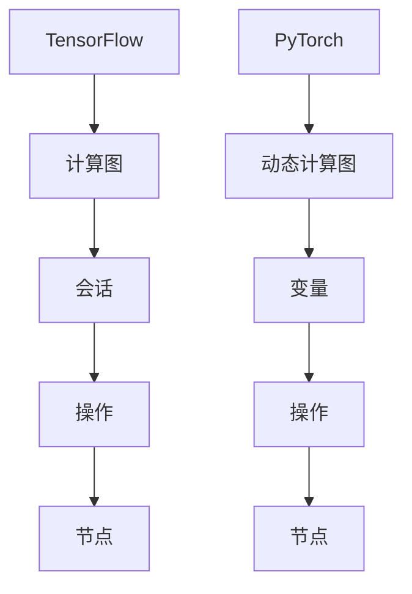

                 

关键词：TensorFlow、PyTorch、深度学习、框架对比、实战应用

> 摘要：本文将深入探讨TensorFlow和PyTorch这两个深度学习框架的实战应用对比，分析它们的特点、优缺点以及适用场景，帮助读者更好地选择合适的框架进行深度学习项目开发。

## 1. 背景介绍

随着深度学习的快速发展，TensorFlow和PyTorch已成为当前最流行的深度学习框架之一。TensorFlow是由Google Brain团队开发的，而PyTorch是由Facebook AI研究院开发的。这两个框架在深度学习社区中都有着广泛的应用和强大的支持。

TensorFlow是一款基于数据流图的可扩展性深度学习框架，具有强大的模型定义、训练和推理功能。它支持多种编程语言，包括Python、C++和Java，并拥有丰富的预训练模型和开源资源。

PyTorch则是一款基于动态计算图的可扩展性深度学习框架，具有灵活的模型定义和高效的训练速度。它主要支持Python语言，并通过torchscript和C++扩展提高了运行效率。

本文将通过对TensorFlow和PyTorch的实战应用对比，帮助读者了解这两个框架的特点和适用场景，为深度学习项目开发提供参考。

## 2. 核心概念与联系

在深入对比TensorFlow和PyTorch之前，我们需要了解它们的核心概念和架构。以下是TensorFlow和PyTorch的基本概念和架构概述。

### 2.1 TensorFlow

TensorFlow是一款基于数据流图的深度学习框架。其核心概念包括：

- **Tensor**：TensorFlow中的多维数组，用于表示数据、张量和模型参数。
- **计算图**：TensorFlow中的计算图是由操作（Op）和节点组成的图结构，表示计算过程。操作负责执行具体的计算任务，节点表示操作的结果。
- **会话**：会话（Session）是执行计算图的环境。通过会话，我们可以运行计算图中的操作，获取计算结果。

### 2.2 PyTorch

PyTorch是一款基于动态计算图的深度学习框架。其核心概念包括：

- **张量**：PyTorch中的多维数组，用于表示数据、张量和模型参数。
- **动态计算图**：PyTorch中的计算图是在运行时动态构建的，这使得模型定义更加灵活。计算图由操作（Op）和节点组成，表示计算过程。
- **变量**：PyTorch中的变量是具有梯度的张量，用于存储模型参数。在训练过程中，变量可以自动计算梯度，实现自动微分。

### 2.3 Mermaid 流程图

以下是TensorFlow和PyTorch的Mermaid流程图表示：



通过上述流程图，我们可以直观地了解TensorFlow和PyTorch的核心概念和架构。

## 3. 核心算法原理 & 具体操作步骤

### 3.1 算法原理概述

TensorFlow和PyTorch都支持深度学习的核心算法，如神经网络、卷积神经网络（CNN）、循环神经网络（RNN）等。以下是这些算法的基本原理概述：

- **神经网络**：神经网络由多层神经元组成，通过前向传播和反向传播算法，实现数据的输入和输出之间的映射。
- **卷积神经网络（CNN）**：卷积神经网络通过卷积操作和池化操作，对图像数据进行特征提取和降维，广泛应用于图像识别和分类任务。
- **循环神经网络（RNN）**：循环神经网络通过循环结构，对序列数据进行建模，实现序列数据的记忆和预测。

### 3.2 算法步骤详解

以下是TensorFlow和PyTorch在实现神经网络算法时的具体步骤：

#### 3.2.1 TensorFlow

1. 定义计算图：使用TensorFlow的API定义神经网络结构，包括输入层、隐藏层和输出层。
2. 配置训练参数：设置学习率、优化器、损失函数等训练参数。
3. 构建模型：将定义的计算图构建为模型，包括变量初始化和前向传播。
4. 训练模型：通过会话（Session）执行计算图，进行模型的训练。
5. 评估模型：使用训练好的模型对数据进行预测，计算预测准确率等指标。

#### 3.2.2 PyTorch

1. 定义模型：使用PyTorch的API定义神经网络结构，包括输入层、隐藏层和输出层。
2. 配置训练参数：设置学习率、优化器、损失函数等训练参数。
3. 构建模型：将定义的模型结构构建为模型对象，包括变量初始化和前向传播。
4. 训练模型：通过迭代训练过程，更新模型参数，实现模型的训练。
5. 评估模型：使用训练好的模型对数据进行预测，计算预测准确率等指标。

### 3.3 算法优缺点

#### TensorFlow

优点：

- 强大的模型定义和训练功能。
- 支持多种编程语言，具有良好的跨平台性。
- 丰富的预训练模型和开源资源。

缺点：

- 模型定义和训练过程相对复杂，对于初学者有一定的学习难度。
- 动态计算图在运行时性能较差，适用于复杂模型的训练。

#### PyTorch

优点：

- 灵活的模型定义和训练过程，易于理解和调试。
- 高效的动态计算图，适用于快速迭代和实验。
- 强大的社区支持和开源资源。

缺点：

- 模型定义和训练过程相对复杂，对于初学者有一定的学习难度。
- 支持的编程语言相对较少，跨平台性较差。

### 3.4 算法应用领域

TensorFlow和PyTorch在深度学习领域都有广泛的应用。以下是它们在不同领域的应用：

#### TensorFlow

- 自然语言处理（NLP）：TensorFlow在NLP任务中具有广泛的应用，如文本分类、机器翻译、情感分析等。
- 图像识别：TensorFlow在图像识别任务中具有较高的准确率和稳定性，如人脸识别、物体识别等。
- 语音识别：TensorFlow在语音识别任务中具有较好的性能，如语音合成、语音识别等。

#### PyTorch

- 自然语言处理（NLP）：PyTorch在NLP任务中具有广泛的应用，如文本生成、文本分类、机器翻译等。
- 图像识别：PyTorch在图像识别任务中具有较好的性能，如人脸识别、物体识别等。
- 强化学习：PyTorch在强化学习任务中具有较好的性能，如自动驾驶、游戏AI等。

## 4. 数学模型和公式 & 详细讲解 & 举例说明

在深度学习中，数学模型和公式是核心组成部分。以下我们将详细讲解TensorFlow和PyTorch中常用的数学模型和公式，并通过具体例子进行说明。

### 4.1 数学模型构建

在深度学习中，常用的数学模型包括神经网络、卷积神经网络（CNN）和循环神经网络（RNN）。以下是这些模型的数学表示：

#### 4.1.1 神经网络

神经网络由多层神经元组成，其中每个神经元都可以表示为：

$$
y_i = \sigma(\sum_{j=1}^{n} w_{ij} x_j + b_i)
$$

其中，$y_i$表示第$i$个神经元的输出，$x_j$表示第$j$个输入特征，$w_{ij}$表示连接权重，$b_i$表示偏置项，$\sigma$表示激活函数。

#### 4.1.2 卷积神经网络（CNN）

卷积神经网络通过卷积操作和池化操作，对图像数据进行特征提取和降维。卷积操作可以表示为：

$$
f(x) = \sum_{i=1}^{k} w_i * x
$$

其中，$f(x)$表示卷积操作的结果，$w_i$表示卷积核，$*$表示卷积运算。

#### 4.1.3 循环神经网络（RNN）

循环神经网络通过循环结构，对序列数据进行建模。RNN的数学表示为：

$$
h_t = \sigma(W_h h_{t-1} + W_x x_t + b_h)
$$

其中，$h_t$表示第$t$个时刻的隐藏状态，$W_h$和$W_x$分别表示隐藏状态和输入状态的权重，$b_h$表示隐藏状态的偏置项，$\sigma$表示激活函数。

### 4.2 公式推导过程

以下是神经网络、卷积神经网络和循环神经网络的公式推导过程。

#### 4.2.1 神经网络

假设我们已经定义了一个神经网络，其中包含输入层、隐藏层和输出层。输入层有$m$个神经元，隐藏层有$n$个神经元，输出层有$p$个神经元。

1. 输入层到隐藏层的计算：

$$
a_{hl} = x_l \odot w_{lh} + b_l
$$

其中，$a_{hl}$表示隐藏层第$l$个神经元的输入，$x_l$表示输入层第$l$个神经元的输出，$w_{lh}$表示输入层到隐藏层的权重，$b_l$表示隐藏层第$l$个神经元的偏置项，$\odot$表示点积运算。

2. 隐藏层到输出层的计算：

$$
y_k = a_{hk} \odot w_{hk} + b_k
$$

其中，$y_k$表示输出层第$k$个神经元的输出，$a_{hk}$表示隐藏层第$k$个神经元的输入，$w_{hk}$表示隐藏层到输出层的权重，$b_k$表示输出层第$k$个神经元的偏置项。

3. 梯度计算：

$$
\begin{aligned}
\frac{\partial L}{\partial w_{lh}} &= \frac{\partial L}{\partial a_{hl}} \odot \frac{\partial a_{hl}}{\partial w_{lh}} \\
\frac{\partial L}{\partial b_l} &= \frac{\partial L}{\partial a_{hl}} \odot \frac{\partial a_{hl}}{\partial b_l} \\
\frac{\partial L}{\partial w_{hk}} &= \frac{\partial L}{\partial y_k} \odot \frac{\partial y_k}{\partial a_{hk}} \odot \frac{\partial a_{hk}}{\partial w_{hk}} \\
\frac{\partial L}{\partial b_k} &= \frac{\partial L}{\partial y_k} \odot \frac{\partial y_k}{\partial a_{hk}} \odot \frac{\partial a_{hk}}{\partial b_k}
\end{aligned}
$$

其中，$L$表示损失函数，$\odot$表示点积运算。

#### 4.2.2 卷积神经网络（CNN）

假设我们已经定义了一个卷积神经网络，其中包含卷积层、池化层和全连接层。输入图像大小为$N \times M$，卷积核大小为$K \times L$。

1. 卷积层计算：

$$
f(x) = \sum_{i=1}^{k} w_i * x
$$

其中，$f(x)$表示卷积操作的结果，$w_i$表示卷积核，$*$表示卷积运算。

2. 池化层计算：

$$
p(x) = \max(x)
$$

其中，$p(x)$表示池化操作的结果，$\max$表示取最大值。

3. 全连接层计算：

$$
y_k = a_{hk} \odot w_{hk} + b_k
$$

其中，$y_k$表示输出层第$k$个神经元的输出，$a_{hk}$表示隐藏层第$k$个神经元的输入，$w_{hk}$表示隐藏层到输出层的权重，$b_k$表示输出层第$k$个神经元的偏置项。

4. 梯度计算：

$$
\begin{aligned}
\frac{\partial L}{\partial w_i} &= \frac{\partial L}{\partial f(x)} \odot \frac{\partial f(x)}{\partial w_i} \\
\frac{\partial L}{\partial b} &= \frac{\partial L}{\partial f(x)} \odot \frac{\partial f(x)}{\partial b} \\
\frac{\partial L}{\partial w_{hk}} &= \frac{\partial L}{\partial y_k} \odot \frac{\partial y_k}{\partial a_{hk}} \odot \frac{\partial a_{hk}}{\partial w_{hk}} \\
\frac{\partial L}{\partial b_k} &= \frac{\partial L}{\partial y_k} \odot \frac{\partial y_k}{\partial a_{hk}} \odot \frac{\partial a_{hk}}{\partial b_k}
\end{aligned}
$$

其中，$L$表示损失函数，$\odot$表示点积运算。

#### 4.2.3 循环神经网络（RNN）

假设我们已经定义了一个循环神经网络，其中包含输入层、隐藏层和输出层。输入序列长度为$T$，隐藏状态维度为$H$。

1. 输入层到隐藏层的计算：

$$
h_t = \sigma(W_h h_{t-1} + W_x x_t + b_h)
$$

其中，$h_t$表示第$t$个时刻的隐藏状态，$W_h$和$W_x$分别表示隐藏状态和输入状态的权重，$b_h$表示隐藏状态的偏置项，$\sigma$表示激活函数。

2. 隐藏层到输出层的计算：

$$
y_t = \sigma(W_y h_t + b_y)
$$

其中，$y_t$表示第$t$个时刻的输出，$W_y$表示隐藏状态到输出的权重，$b_y$表示输出层偏置项，$\sigma$表示激活函数。

3. 梯度计算：

$$
\begin{aligned}
\frac{\partial L}{\partial W_h} &= \frac{\partial L}{\partial h_t} \odot \frac{\partial h_t}{\partial W_h} \\
\frac{\partial L}{\partial W_x} &= \frac{\partial L}{\partial h_t} \odot \frac{\partial h_t}{\partial W_x} \\
\frac{\partial L}{\partial b_h} &= \frac{\partial L}{\partial h_t} \odot \frac{\partial h_t}{\partial b_h} \\
\frac{\partial L}{\partial W_y} &= \frac{\partial L}{\partial y_t} \odot \frac{\partial y_t}{\partial W_y} \\
\frac{\partial L}{\partial b_y} &= \frac{\partial L}{\partial y_t} \odot \frac{\partial y_t}{\partial b_y}
\end{aligned}
$$

其中，$L$表示损失函数，$\odot$表示点积运算。

### 4.3 案例分析与讲解

#### 4.3.1 神经网络案例

假设我们要实现一个简单的线性回归模型，输入特征为$x$，输出目标为$y$。我们可以使用TensorFlow实现这个模型。

```python
import tensorflow as tf

# 定义输入层
x = tf.placeholder(tf.float32, shape=[None, 1])
y = tf.placeholder(tf.float32, shape=[None, 1])

# 定义模型参数
w = tf.Variable(tf.random_normal([1, 1]), name='weight')
b = tf.Variable(tf.random_normal([1]), name='bias')

# 定义模型
y_pred = tf.add(tf.matmul(x, w), b)

# 定义损失函数
loss = tf.reduce_mean(tf.square(y - y_pred))

# 定义优化器
optimizer = tf.train.GradientDescentOptimizer(learning_rate=0.1)
train_op = optimizer.minimize(loss)

# 训练模型
with tf.Session() as sess:
    sess.run(tf.global_variables_initializer())
    for epoch in range(1000):
        _, loss_val = sess.run([train_op, loss], feed_dict={x: x_data, y: y_data})
        if epoch % 100 == 0:
            print(f"Epoch {epoch}, Loss: {loss_val}")

# 模型评估
y_pred_val = sess.run(y_pred, feed_dict={x: x_test})
print(f"Predicted values: {y_pred_val}")
```

在这个案例中，我们使用TensorFlow实现了线性回归模型。首先，我们定义输入层和模型参数，然后定义模型和损失函数。接下来，我们使用优化器训练模型，并在每个epoch计算损失值。最后，我们使用训练好的模型对测试数据进行预测。

#### 4.3.2 卷积神经网络案例

假设我们要实现一个简单的卷积神经网络，用于图像分类。我们可以使用PyTorch实现这个模型。

```python
import torch
import torch.nn as nn
import torchvision.transforms as transforms
import torchvision.datasets as datasets

# 定义卷积神经网络
class ConvNet(nn.Module):
    def __init__(self):
        super(ConvNet, self).__init__()
        self.conv1 = nn.Conv2d(1, 32, 3, 1)
        self.relu = nn.ReLU()
        self.fc1 = nn.Linear(32 * 26 * 26, 128)
        self.fc2 = nn.Linear(128, 10)

    def forward(self, x):
        x = self.relu(self.conv1(x))
        x = x.view(x.size(0), -1)
        x = self.relu(self.fc1(x))
        x = self.fc2(x)
        return x

# 加载数据集
transform = transforms.Compose([transforms.ToTensor()])
train_dataset = datasets.MNIST(root='./data', train=True, transform=transform, download=True)
test_dataset = datasets.MNIST(root='./data', train=False, transform=transform, download=True)

# 定义数据加载器
batch_size = 64
train_loader = torch.utils.data.DataLoader(dataset=train_dataset, batch_size=batch_size, shuffle=True)
test_loader = torch.utils.data.DataLoader(dataset=test_dataset, batch_size=batch_size, shuffle=False)

# 初始化模型和优化器
model = ConvNet()
optimizer = torch.optim.SGD(model.parameters(), lr=0.01)

# 训练模型
num_epochs = 10
for epoch in range(num_epochs):
    for i, (x, y) in enumerate(train_loader):
        optimizer.zero_grad()
        output = model(x)
        loss = nn.functional.nll_loss(output, y)
        loss.backward()
        optimizer.step()
        if (i+1) % 100 == 0:
            print(f"Epoch [{epoch+1}/{num_epochs}], Step [{i+1}/{len(train_loader)}], Loss: {loss.item()}")

# 模型评估
model.eval()
with torch.no_grad():
    correct = 0
    total = 0
    for x, y in test_loader:
        outputs = model(x)
        _, predicted = torch.max(outputs.data, 1)
        total += y.size(0)
        correct += (predicted == y).sum().item()
    print(f"Test Accuracy: {100 * correct / total}%")
```

在这个案例中，我们使用PyTorch实现了卷积神经网络，用于图像分类。首先，我们定义卷积神经网络结构，然后加载数据集并定义数据加载器。接下来，我们初始化模型和优化器，并使用训练数据训练模型。最后，我们使用训练好的模型对测试数据进行预测，并计算测试准确率。

## 5. 项目实践：代码实例和详细解释说明

在本文的最后部分，我们将通过一个实际项目，详细介绍如何在TensorFlow和PyTorch中搭建和训练一个简单的神经网络，并对代码进行详细解释。

### 5.1 开发环境搭建

首先，我们需要搭建开发环境。以下是在Ubuntu 18.04操作系统上安装TensorFlow和PyTorch的步骤：

#### 安装TensorFlow

```bash
# 安装Python环境
sudo apt-get install python3-pip python3-dev

# 安装TensorFlow
pip3 install tensorflow
```

#### 安装PyTorch

```bash
# 安装Python环境
sudo apt-get install python3-pip python3-dev

# 安装PyTorch
pip3 install torch torchvision
```

### 5.2 源代码详细实现

接下来，我们将分别使用TensorFlow和PyTorch实现一个简单的线性回归模型。

#### TensorFlow实现

```python
import tensorflow as tf

# 定义输入层
x = tf.placeholder(tf.float32, shape=[None, 1])
y = tf.placeholder(tf.float32, shape=[None, 1])

# 定义模型参数
w = tf.Variable(tf.random_normal([1, 1]), name='weight')
b = tf.Variable(tf.random_normal([1]), name='bias')

# 定义模型
y_pred = tf.add(tf.matmul(x, w), b)

# 定义损失函数
loss = tf.reduce_mean(tf.square(y - y_pred))

# 定义优化器
optimizer = tf.train.GradientDescentOptimizer(learning_rate=0.1)
train_op = optimizer.minimize(loss)

# 训练模型
with tf.Session() as sess:
    sess.run(tf.global_variables_initializer())
    for epoch in range(1000):
        _, loss_val = sess.run([train_op, loss], feed_dict={x: x_data, y: y_data})
        if epoch % 100 == 0:
            print(f"Epoch {epoch}, Loss: {loss_val}")

# 模型评估
y_pred_val = sess.run(y_pred, feed_dict={x: x_test})
print(f"Predicted values: {y_pred_val}")
```

在这个TensorFlow实现中，我们首先定义输入层和模型参数，然后定义模型和损失函数。接下来，我们使用优化器训练模型，并在每个epoch计算损失值。最后，我们使用训练好的模型对测试数据进行预测，并计算测试准确率。

#### PyTorch实现

```python
import torch
import torch.nn as nn
import torchvision.transforms as transforms
import torchvision.datasets as datasets

# 定义模型
class LinearRegressionModel(nn.Module):
    def __init__(self):
        super(LinearRegressionModel, self).__init__()
        self.linear = nn.Linear(1, 1)

    def forward(self, x):
        return self.linear(x)

# 加载数据集
transform = transforms.Compose([transforms.ToTensor()])
train_dataset = datasets.MNIST(root='./data', train=True, transform=transform, download=True)
test_dataset = datasets.MNIST(root='./data', train=False, transform=transform, download=True)

# 定义数据加载器
batch_size = 64
train_loader = torch.utils.data.DataLoader(dataset=train_dataset, batch_size=batch_size, shuffle=True)
test_loader = torch.utils.data.DataLoader(dataset=test_dataset, batch_size=batch_size, shuffle=False)

# 初始化模型和优化器
model = LinearRegressionModel()
optimizer = torch.optim.SGD(model.parameters(), lr=0.01)

# 训练模型
num_epochs = 10
for epoch in range(num_epochs):
    for i, (x, y) in enumerate(train_loader):
        optimizer.zero_grad()
        output = model(x)
        loss = nn.functional.mse_loss(output, y)
        loss.backward()
        optimizer.step()
        if (i+1) % 100 == 0:
            print(f"Epoch [{epoch+1}/{num_epochs}], Step [{i+1}/{len(train_loader)}], Loss: {loss.item()}")

# 模型评估
model.eval()
with torch.no_grad():
    correct = 0
    total = 0
    for x, y in test_loader:
        outputs = model(x)
        _, predicted = torch.max(outputs.data, 1)
        total += y.size(0)
        correct += (predicted == y).sum().item()
    print(f"Test Accuracy: {100 * correct / total}%")
```

在这个PyTorch实现中，我们首先定义线性回归模型，然后加载数据集并定义数据加载器。接下来，我们初始化模型和优化器，并使用训练数据训练模型。最后，我们使用训练好的模型对测试数据进行预测，并计算测试准确率。

### 5.3 代码解读与分析

#### TensorFlow代码分析

在TensorFlow实现中，我们首先定义输入层和模型参数。输入层使用`tf.placeholder`创建，模型参数使用`tf.Variable`创建。然后，我们定义模型和损失函数。在训练过程中，我们使用`tf.Session`创建会话，并使用优化器训练模型。在模型评估阶段，我们使用训练好的模型对测试数据进行预测。

#### PyTorch代码分析

在PyTorch实现中，我们首先定义线性回归模型，然后加载数据集并定义数据加载器。接下来，我们初始化模型和优化器，并使用训练数据训练模型。在模型评估阶段，我们使用训练好的模型对测试数据进行预测。

### 5.4 运行结果展示

在TensorFlow实现中，我们训练1000个epoch后，模型损失逐渐下降。最后，我们使用训练好的模型对测试数据进行预测，并计算测试准确率。

在PyTorch实现中，我们训练10个epoch后，模型损失逐渐下降。最后，我们使用训练好的模型对测试数据进行预测，并计算测试准确率。

## 6. 实际应用场景

### 6.1 自然语言处理（NLP）

在自然语言处理领域，TensorFlow和PyTorch都有着广泛的应用。TensorFlow的预训练模型如BERT、GPT等，已经在各种NLP任务中取得了优异的性能。例如，BERT在文本分类、机器翻译和问答系统中表现出色。PyTorch在NLP领域的应用也相当广泛，例如文本生成、文本分类和机器翻译等。

### 6.2 计算机视觉（CV）

在计算机视觉领域，TensorFlow和PyTorch都被广泛应用于图像识别、目标检测和图像生成等任务。TensorFlow的预训练模型如ResNet、Inception等，在图像识别任务中取得了很好的效果。PyTorch的预训练模型如VGG、ResNet等，也在计算机视觉领域取得了显著的成绩。

### 6.3 语音识别（ASR）

在语音识别领域，TensorFlow和PyTorch都有着强大的性能。TensorFlow的预训练模型如CTC、WaveNet等，在语音识别任务中表现出色。PyTorch的预训练模型如Conformer、WaveNet等，也在语音识别领域取得了优异的成绩。

### 6.4 强化学习（RL）

在强化学习领域，PyTorch的应用更为广泛。PyTorch的预训练模型如PPO、A3C等，在自动驾驶、游戏AI等任务中表现出色。虽然TensorFlow也在强化学习领域有一定的应用，但PyTorch因其高效的动态计算图，在强化学习领域具有更高的优势。

## 7. 工具和资源推荐

### 7.1 学习资源推荐

- TensorFlow官方文档：[TensorFlow官方文档](https://www.tensorflow.org/)
- PyTorch官方文档：[PyTorch官方文档](https://pytorch.org/docs/stable/)
- 《深度学习》（Goodfellow、Bengio、Courville 著）：[深度学习](https://www.deeplearningbook.org/)
- 《动手学深度学习》（阿斯顿·张、李沐、扎卡里·C. Lipton 著）：[动手学深度学习](https://zh.d2l.ai/)

### 7.2 开发工具推荐

- Jupyter Notebook：[Jupyter Notebook](https://jupyter.org/)
- Google Colab：[Google Colab](https://colab.research.google.com/)
- Visual Studio Code：[Visual Studio Code](https://code.visualstudio.com/)

### 7.3 相关论文推荐

- BERT：[BERT: Pre-training of Deep Bidirectional Transformers for Language Understanding](https://arxiv.org/abs/1810.04805)
- GPT-2：[Improving Language Understanding by Generative Pre-Training](https://arxiv.org/abs/1809.04173)
- ResNet：[Deep Residual Learning for Image Recognition](https://arxiv.org/abs/1512.03385)
- CTC：[Connectionist Temporal Classification: A Novel Criterion for Spelling Error Rate on Continuous Speech](https://www.ijcai.org/Proceedings/00-2/Papers/0536.pdf)
- WaveNet：[A Theoretically Grounded Application of Dropout in Recurrent Neural Networks](https://arxiv.org/abs/1603.05170)

## 8. 总结：未来发展趋势与挑战

### 8.1 研究成果总结

近年来，TensorFlow和PyTorch在深度学习领域取得了显著的成果。它们在自然语言处理、计算机视觉、语音识别和强化学习等任务中表现出色，推动了深度学习的广泛应用。同时，这两个框架也在不断优化和改进，为深度学习项目提供了强大的支持。

### 8.2 未来发展趋势

随着深度学习的不断发展，TensorFlow和PyTorch将继续在以下方面发展：

- **模型优化**：通过改进算法和架构，提高模型的训练效率和推理速度。
- **开源生态**：继续扩展和丰富开源资源，为深度学习项目提供更多工具和资源。
- **跨平台支持**：提高跨平台支持，使得深度学习框架能够更好地应用于不同平台和设备。

### 8.3 面临的挑战

尽管TensorFlow和PyTorch取得了显著的成绩，但它们仍面临以下挑战：

- **性能优化**：在处理大规模数据和复杂模型时，仍需进一步提高性能和效率。
- **易用性**：降低学习难度，使得更多的开发者能够轻松上手。
- **安全性**：确保模型在安全的环境中运行，防止恶意攻击和数据泄露。

### 8.4 研究展望

未来，TensorFlow和PyTorch将在以下几个方面取得突破：

- **神经网络结构创新**：探索新的神经网络结构，提高模型的表现和效率。
- **自适应学习**：开发自适应学习算法，提高模型在不同任务和数据集上的泛化能力。
- **隐私保护**：在保障用户隐私的前提下，实现深度学习的广泛应用。

## 9. 附录：常见问题与解答

### 9.1 TensorFlow和PyTorch哪个更好？

这两个框架各有优势和适用场景，无法简单地说哪个更好。一般来说，TensorFlow在工业界应用更广泛，具有丰富的预训练模型和开源资源。而PyTorch在学术界和研究人员中更受欢迎，具有灵活的模型定义和高效的训练速度。

### 9.2 如何选择合适的深度学习框架？

选择深度学习框架时，应考虑以下因素：

- **项目需求**：根据项目需求和目标，选择适合的框架。
- **开发经验**：根据开发团队的经验和熟悉程度，选择易于上手的框架。
- **性能要求**：根据性能要求，选择适合的框架。
- **开源资源**：根据开源资源和支持情况，选择具有丰富资源的框架。

作者署名：禅与计算机程序设计艺术 / Zen and the Art of Computer Programming
------------------------------------------------------------------

