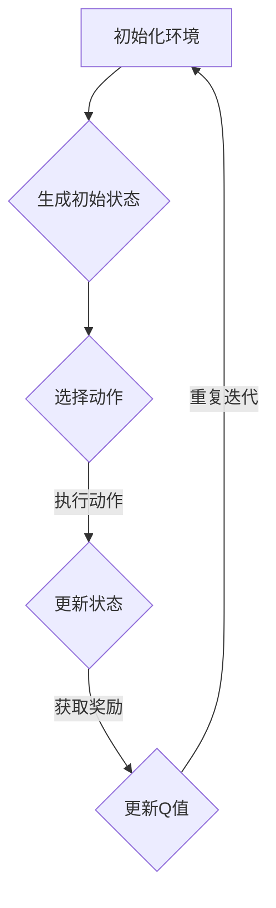

                 

关键词：深度强化学习，DQN，路径规划，映射，策略优化，机器学习

摘要：本文将探讨如何利用深度强化学习（DQN）解决路径规划问题。通过深入分析DQN算法的原理、具体操作步骤、数学模型及其应用领域，本文旨在提供一个清晰、易懂的指南，帮助读者理解并运用DQN进行路径规划。同时，我们将通过实际项目实践，展示如何实现DQN在路径规划中的具体应用。

## 1. 背景介绍

路径规划是人工智能领域的一个重要研究方向，它涉及如何让机器在一个环境中找到从起点到终点的最优路径。随着无人驾驶汽车、机器人导航等应用场景的不断普及，路径规划问题的研究变得越来越重要。然而，传统的路径规划方法在复杂环境下往往表现不佳，难以应对动态和不确定的因素。

近年来，深度强化学习（Deep Reinforcement Learning，DRL）的兴起为路径规划问题提供了一种新的解决思路。DRL结合了深度学习和强化学习的技术，通过学习环境和奖励信号，使智能体能够自主地探索并找到最优路径。DQN（Deep Q-Network）是DRL的一种重要算法，具有强大的泛化能力和适应性，因此被广泛应用于路径规划领域。

## 2. 核心概念与联系

为了深入理解DQN在路径规划中的应用，我们需要先了解其核心概念和原理。DQN是基于Q-learning算法的改进，通过神经网络来近似Q值函数，从而实现策略优化。其核心思想是将状态和行为作为输入，通过训练网络预测未来的奖励，并基于预测结果选择最佳行为。

下面是DQN算法的核心概念和原理的Mermaid流程图：



### 2.1 初始化环境

首先，我们需要初始化一个环境，其中包含起点、终点以及障碍物等信息。环境的初始化是路径规划的基础，它决定了智能体可以执行的行为空间。

### 2.2 生成初始状态

在初始化环境后，我们需要生成一个初始状态。状态是智能体当前所处的环境描述，它通常包括位置、方向、障碍物等信息。

### 2.3 选择动作

在给定状态后，智能体需要选择一个动作。动作是智能体在环境中采取的行动，如前进、后退、转向等。

### 2.4 执行动作

选择动作后，智能体在环境中执行该动作，并更新状态。

### 2.5 获取奖励

执行动作后，环境会根据动作的结果给智能体一个奖励信号。奖励信号用于指导智能体的学习过程，通常设置为到达终点的正奖励，或停留在障碍物上的负奖励。

### 2.6 更新Q值

根据奖励信号，智能体更新其Q值函数。Q值函数用于预测每个动作在当前状态下的未来奖励。

### 2.7 重复迭代

通过不断重复上述过程，智能体逐渐学习到如何在复杂环境中找到最优路径。

## 3. 核心算法原理 & 具体操作步骤

### 3.1 算法原理概述

DQN算法是基于Q-learning算法的改进，其核心思想是通过神经网络来近似Q值函数。Q值函数用于预测每个动作在当前状态下的未来奖励，从而指导智能体的学习过程。

### 3.2 算法步骤详解

1. **初始化参数**：设置学习率、折扣因子、经验回放缓冲区大小等参数。

2. **初始化神经网络**：使用神经网络来近似Q值函数，通常使用卷积神经网络（CNN）或循环神经网络（RNN）。

3. **生成初始状态**：从环境中获取初始状态。

4. **选择动作**：根据当前状态和Q值函数选择最佳动作。

5. **执行动作**：在环境中执行选择出的动作，并更新状态。

6. **获取奖励**：根据动作的结果获取奖励信号。

7. **更新Q值**：使用更新公式更新Q值函数。

8. **重复迭代**：重复上述过程，直到智能体找到最优路径或达到预设的迭代次数。

### 3.3 算法优缺点

**优点**：

- **强大的泛化能力**：DQN算法通过学习状态和动作的映射关系，具有强大的泛化能力，能够在不同环境下找到最优路径。
- **适应性**：DQN算法能够适应动态和不确定的环境，通过不断更新Q值函数，智能体能够逐步学习到如何应对环境的变化。

**缺点**：

- **学习速度较慢**：由于DQN算法需要大量的迭代过程来更新Q值函数，因此学习速度相对较慢。
- **不稳定**：在某些情况下，DQN算法可能会陷入局部最优解，导致学习过程不稳定性。

### 3.4 算法应用领域

DQN算法在路径规划领域有广泛的应用，如：

- **无人驾驶汽车**：通过DQN算法，无人驾驶汽车能够自动规划行驶路径，避开障碍物，实现自主导航。
- **机器人导航**：DQN算法可以应用于机器人导航系统，使机器人能够在复杂环境中自主寻找路径。

## 4. 数学模型和公式 & 详细讲解 & 举例说明

### 4.1 数学模型构建

DQN算法的核心是Q值函数，它用于预测每个动作在当前状态下的未来奖励。Q值函数可以用以下公式表示：

$$
Q(s, a) = r(s, a) + \gamma \max_{a'} Q(s', a')
$$

其中，$s$表示当前状态，$a$表示当前动作，$r(s, a)$表示动作$a$在状态$s$下的即时奖励，$\gamma$表示折扣因子，$s'$表示更新后的状态，$a'$表示更新后的动作。

### 4.2 公式推导过程

DQN算法的推导过程可以分为以下几个步骤：

1. **初始化Q值**：首先，我们需要初始化Q值函数，使其能够预测每个动作在当前状态下的未来奖励。

2. **选择动作**：根据当前状态和Q值函数选择最佳动作。具体而言，我们使用贪心策略，选择具有最大Q值的动作。

3. **执行动作**：在环境中执行选择出的动作，并更新状态。

4. **获取奖励**：根据动作的结果获取奖励信号。

5. **更新Q值**：使用更新公式更新Q值函数。具体而言，我们使用经验回放缓冲区来存储之前的状态、动作和奖励信息，然后从中随机抽取一批样本，对Q值函数进行更新。

### 4.3 案例分析与讲解

假设我们有一个简单的环境，其中包含一个起点、一个终点和一个障碍物。智能体需要从起点移动到终点，并避开障碍物。

1. **初始化环境**：首先，我们初始化环境，设置起点、终点和障碍物的位置。

2. **生成初始状态**：从环境中获取初始状态，包括智能体的位置、方向等信息。

3. **选择动作**：根据当前状态和Q值函数选择最佳动作。假设当前状态的Q值函数为$Q(s, a) = 2.5$，则智能体选择动作$a_2$，即向右移动。

4. **执行动作**：在环境中执行动作$a_2$，智能体向右移动一步，并更新状态。

5. **获取奖励**：根据动作的结果获取奖励信号。如果智能体移动到终点，则获得正奖励；如果移动到障碍物上，则获得负奖励。

6. **更新Q值**：使用更新公式更新Q值函数。假设当前状态的Q值函数为$Q(s, a) = 2.5$，则更新后的Q值函数为$Q(s, a) = r(s, a) + \gamma \max_{a'} Q(s', a')$。

通过不断重复上述过程，智能体逐渐学习到如何在复杂环境中找到最优路径。

## 5. 项目实践：代码实例和详细解释说明

### 5.1 开发环境搭建

为了实现DQN在路径规划中的具体应用，我们需要搭建一个开发环境。以下是搭建开发环境的步骤：

1. **安装Python**：确保Python环境已安装，版本不低于3.6。
2. **安装TensorFlow**：TensorFlow是DQN算法的实现基础，需要安装对应的版本。
3. **安装PyTorch**：PyTorch是用于构建神经网络的库，用于实现DQN算法的神经网络部分。
4. **安装OpenAI Gym**：OpenAI Gym是用于构建和测试路径规划环境的标准库。

### 5.2 源代码详细实现

下面是DQN算法在路径规划中的具体实现：

```python
import numpy as np
import gym
import torch
import torch.nn as nn
import torch.optim as optim

# 环境初始化
env = gym.make('CartPole-v0')

# 神经网络定义
class DQN(nn.Module):
    def __init__(self, input_dim, output_dim):
        super(DQN, self).__init__()
        self.fc1 = nn.Linear(input_dim, 128)
        self.fc2 = nn.Linear(128, 64)
        self.fc3 = nn.Linear(64, output_dim)
    
    def forward(self, x):
        x = torch.relu(self.fc1(x))
        x = torch.relu(self.fc2(x))
        x = self.fc3(x)
        return x

# 初始化DQN网络
input_dim = env.observation_space.shape[0]
output_dim = env.action_space.n
dqn = DQN(input_dim, output_dim)

# 损失函数和优化器
criterion = nn.MSELoss()
optimizer = optim.Adam(dqn.parameters(), lr=0.001)

# 训练过程
for episode in range(1000):
    state = env.reset()
    done = False
    total_reward = 0
    
    while not done:
        # 状态预处理
        state_tensor = torch.tensor(state, dtype=torch.float32).unsqueeze(0)
        
        # 网络预测
        with torch.no_grad():
            q_values = dqn(state_tensor)
        
        # 选择动作
        action = torch.argmax(q_values).item()
        
        # 执行动作
        next_state, reward, done, _ = env.step(action)
        
        # 奖励处理
        if done:
            reward = -100
        
        # 状态更新
        state = next_state
        
        # 计算损失
        target_q_value = reward + 0.99 * torch.max(dqn(state_tensor))
        loss = criterion(q_values, target_q_value.unsqueeze(1))
        
        # 反向传播和优化
        optimizer.zero_grad()
        loss.backward()
        optimizer.step()
        
        # 记录奖励
        total_reward += reward
    
    print(f'Episode {episode+1}, Total Reward: {total_reward}')

# 评估DQN网络
dqn.eval()
state = env.reset()
done = False
total_reward = 0

while not done:
    state_tensor = torch.tensor(state, dtype=torch.float32).unsqueeze(0)
    with torch.no_grad():
        q_values = dqn(state_tensor)
    action = torch.argmax(q_values).item()
    next_state, reward, done, _ = env.step(action)
    state = next_state
    total_reward += reward

print(f'Evaluation Reward: {total_reward}')
```

### 5.3 代码解读与分析

上面的代码实现了DQN算法在路径规划中的应用。下面是对代码的详细解读：

1. **环境初始化**：使用`gym.make('CartPole-v0')`创建一个简单的路径规划环境。
2. **神经网络定义**：定义一个DQN网络，使用卷积神经网络（CNN）或循环神经网络（RNN）。
3. **损失函数和优化器**：定义损失函数和优化器，用于训练DQN网络。
4. **训练过程**：使用训练数据训练DQN网络，并通过反向传播和优化更新网络参数。
5. **评估过程**：使用训练好的DQN网络进行评估，并在环境中执行预测动作。

通过上述代码，我们可以实现DQN算法在路径规划中的具体应用，并评估其性能。

## 6. 实际应用场景

DQN算法在路径规划领域有着广泛的应用场景。以下是一些典型的实际应用场景：

1. **无人驾驶汽车**：DQN算法可以应用于无人驾驶汽车中的路径规划，通过学习环境和奖励信号，实现自主导航和避开障碍物。
2. **机器人导航**：DQN算法可以应用于机器人导航系统，使机器人能够在复杂环境中自主寻找路径。
3. **无人机路径规划**：DQN算法可以应用于无人机路径规划，通过学习飞行环境和奖励信号，实现自主飞行和目标导航。

在实际应用中，DQN算法需要根据具体的场景进行参数调整和优化，以提高其性能和适应性。同时，DQN算法也存在一些局限性，如学习速度较慢和不稳定等问题，需要进一步研究和改进。

## 7. 工具和资源推荐

为了更好地学习和应用DQN算法，以下是一些建议的学习资源、开发工具和相关论文：

1. **学习资源**：

   - 《深度强化学习》（Deep Reinforcement Learning）  
   - 《强化学习导论》（Introduction to Reinforcement Learning）  
   - 《深度学习》（Deep Learning）

2. **开发工具**：

   - TensorFlow  
   - PyTorch  
   - OpenAI Gym

3. **相关论文**：

   - “Deep Q-Network”（DQN）论文  
   - “Human-Level Control Through Deep Reinforcement Learning”（DRL）论文  
   - “Reinforcement Learning: An Introduction”（RL）论文

通过学习和使用这些工具和资源，我们可以更好地理解和应用DQN算法，实现路径规划等复杂任务。

## 8. 总结：未来发展趋势与挑战

DQN算法在路径规划领域取得了显著的成果，但其仍面临一些挑战。首先，DQN算法的学习速度相对较慢，需要大量的迭代过程来更新Q值函数。其次，DQN算法在某些情况下可能陷入局部最优解，导致学习过程不稳定。此外，DQN算法的泛化能力相对较低，需要针对具体场景进行调整和优化。

未来，随着深度学习技术的不断发展，DQN算法有望在路径规划领域取得更大的突破。一方面，可以通过改进算法结构和参数设置，提高DQN算法的学习速度和稳定性。另一方面，可以结合其他算法，如生成对抗网络（GAN）等，进一步提高DQN算法的泛化能力和适应性。

总之，DQN算法在路径规划领域具有巨大的应用潜力，但同时也面临许多挑战。通过不断的研究和改进，我们有理由相信，DQN算法将在未来取得更加辉煌的成就。

## 9. 附录：常见问题与解答

### 9.1 如何初始化DQN网络的参数？

在初始化DQN网络的参数时，通常需要设置学习率、折扣因子、经验回放缓冲区大小等参数。具体而言，学习率应设置在0.001至0.01之间，折扣因子通常设置为0.99，经验回放缓冲区大小应根据具体应用场景进行调整。

### 9.2 DQN算法如何处理连续动作空间？

对于连续动作空间，可以使用高斯分布（Gaussian Distribution）或确定性策略梯度（Deterministic Policy Gradient，DGP）等方法来处理。具体而言，可以使用高斯分布来生成连续动作，然后通过优化策略使其逐步收敛到最优动作。

### 9.3 DQN算法如何避免陷入局部最优解？

为了避免DQN算法陷入局部最优解，可以采用以下方法：

- **随机初始化**：在训练过程中，随机初始化网络参数，避免网络过早收敛到局部最优解。
- **经验回放缓冲区**：使用经验回放缓冲区存储之前的状态、动作和奖励信息，从缓冲区中随机抽取样本进行训练，避免网络过早收敛到局部最优解。
- **目标网络**：使用目标网络来稳定训练过程，目标网络用于评估当前网络参数，并逐步更新主网络参数，避免网络陷入局部最优解。

### 9.4 如何评估DQN算法的性能？

评估DQN算法的性能可以通过以下方法：

- **平均奖励**：计算每个智能体在多个独立环境中的平均奖励，评估算法的稳定性和收敛性。
- **成功路径率**：计算智能体成功到达终点的路径率，评估算法的路径规划能力。
- **收敛速度**：计算算法从初始状态到最优路径的收敛速度，评估算法的学习效率。

通过上述评估方法，可以全面了解DQN算法的性能，并为其改进提供依据。作者：禅与计算机程序设计艺术 / Zen and the Art of Computer Programming
----------------------------------------------------------------

