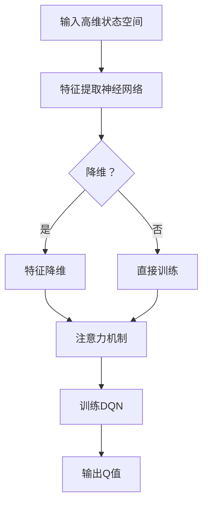

                 

关键词：深度学习，DQN，状态空间，高维数据处理，映射，智能决策

## 摘要

本文将探讨深度学习中的深度Q网络（DQN）如何处理高维状态空间的问题。首先，我们将回顾DQN的基本原理和优势，然后深入探讨在高维状态空间中遇到的挑战，并介绍一种新的映射策略来应对这些问题。我们将通过数学模型和具体案例来解释这一策略，最后讨论DQN在高维数据处理中的实际应用场景和未来展望。

## 1. 背景介绍

随着人工智能和机器学习技术的发展，深度学习已经成为处理复杂数据的有效方法。深度Q网络（Deep Q-Network，DQN）是其中的一种，它通过深度神经网络来近似Q函数，从而实现智能体的策略优化。Q函数代表了在给定状态下采取特定动作的预期收益。DQN通过经验回放和目标网络来减少样本偏差和过估计问题，使得其在复杂的决策环境中表现出色。

然而，在实际应用中，状态空间往往非常高维，这使得DQN的训练过程变得非常困难。高维状态空间不仅增加了计算量，还容易导致信息过载和梯度消失问题。传统的DQN方法在这些情况下表现不佳，因此，探索新的映射策略来处理高维状态空间成为了一个重要的研究方向。

## 2. 核心概念与联系

### 2.1 DQN的基本原理

DQN的核心是Q函数的近似。Q函数定义为：

$$
Q(s, a) = \sum_{i=1}^{n} r_i \cdot \pi(a_i | s)
$$

其中，$r_i$ 是在状态 $s$ 下采取动作 $a_i$ 的即时奖励，$\pi(a_i | s)$ 是在状态 $s$ 下采取动作 $a_i$ 的概率。DQN使用深度神经网络来近似这个Q函数。

### 2.2 高维状态空间的挑战

高维状态空间的主要挑战包括：

- **计算复杂性**：随着状态维度的增加，计算量呈指数级增长。
- **梯度消失**：深度神经网络在训练过程中容易遇到梯度消失问题。
- **信息过载**：高维状态空间中可能包含大量冗余信息，导致模型难以学习到有效的特征。

### 2.3 新映射策略

为了解决高维状态空间的挑战，我们可以采用以下映射策略：

1. **特征提取**：使用深度神经网络从高维状态中提取低维特征。
2. **特征降维**：通过降维技术，如主成分分析（PCA）或自编码器，进一步减少特征的维度。
3. **注意力机制**：引入注意力机制来关注状态中的关键信息，降低信息过载。

### 2.4 Mermaid流程图

以下是DQN处理高维状态空间的Mermaid流程图：



## 3. 核心算法原理 & 具体操作步骤

### 3.1 算法原理概述

DQN通过深度神经网络来近似Q函数，并在训练过程中使用经验回放和目标网络来减少样本偏差和过估计问题。在高维状态空间中，我们采用以下步骤：

1. **特征提取**：使用一个深度神经网络从高维状态中提取低维特征。
2. **特征降维**：使用PCA或其他降维技术进一步减少特征的维度。
3. **注意力机制**：引入注意力机制来关注状态中的关键信息。
4. **训练DQN**：使用提取的特征和注意力机制来训练DQN。

### 3.2 算法步骤详解

1. **初始化**：初始化深度神经网络、目标网络和经验回放池。
2. **特征提取**：输入高维状态到深度神经网络，输出低维特征。
3. **特征降维**：使用PCA或其他降维技术对特征进行降维。
4. **注意力机制**：计算注意力权重，并使用这些权重来加权低维特征。
5. **训练DQN**：使用加权特征来训练DQN，并更新Q值。
6. **经验回放**：将经验存入经验回放池，并从经验回放池中随机采样数据进行训练。
7. **目标网络更新**：定期更新目标网络，以减少样本偏差。

### 3.3 算法优缺点

**优点**：

- **处理高维状态**：通过特征提取和降维技术，可以有效地处理高维状态空间。
- **减少信息过载**：注意力机制有助于关注状态中的关键信息，减少信息过载。
- **稳定性**：经验回放和目标网络的设计使得DQN在训练过程中更加稳定。

**缺点**：

- **计算复杂性**：特征提取和降维技术增加了计算量。
- **梯度消失**：深度神经网络在训练过程中仍然可能遇到梯度消失问题。

### 3.4 算法应用领域

DQN在高维状态空间的应用非常广泛，如自动驾驶、游戏AI、推荐系统等。通过引入特征提取和注意力机制，DQN可以更好地处理高维状态，从而在这些领域取得更好的效果。

## 4. 数学模型和公式 & 详细讲解 & 举例说明

### 4.1 数学模型构建

我们采用一个简单的例子来说明DQN的数学模型。假设我们有一个二维的状态空间，状态 $s$ 可以表示为 $(x, y)$，其中 $x$ 和 $y$ 分别是状态的两个维度。我们使用一个深度神经网络来近似Q函数：

$$
Q(s, a) = \sum_{i=1}^{n} w_i \cdot f(x, y)
$$

其中，$w_i$ 是神经网络的权重，$f(x, y)$ 是神经网络的输出。

### 4.2 公式推导过程

我们首先定义深度神经网络的输入和输出：

$$
\text{输入}:\quad s = (x, y)
$$

$$
\text{输出}:\quad Q(s, a) = \sum_{i=1}^{n} w_i \cdot f(x, y)
$$

然后，我们定义神经网络的激活函数为 $f(x, y) = \sigma(W \cdot [x, y] + b)$，其中 $W$ 是权重矩阵，$b$ 是偏置项，$\sigma$ 是激活函数。

### 4.3 案例分析与讲解

假设我们有一个简单的二维环境，状态空间为 $[-1, 1] \times [-1, 1]$，我们希望使用DQN来学习在这个环境中最大化收益。我们定义状态 $s$ 为 $(x, y)$，其中 $x$ 和 $y$ 分别是位置。我们定义动作 $a$ 为上下左右移动，即 $a \in \{0, 1, 2, 3\}$，分别对应向上、向下、向左、向右移动。

在这个例子中，我们使用一个简单的深度神经网络来近似Q函数。网络的输入层有两个神经元，分别对应 $x$ 和 $y$ 的值。隐藏层有两个神经元，输出层有一个神经元。激活函数使用ReLU函数。

我们定义网络的权重和偏置项为：

$$
W = \begin{bmatrix}
0.1 & 0.2 \\
0.3 & 0.4
\end{bmatrix}
$$

$$
b = \begin{bmatrix}
0.5 \\
0.6
\end{bmatrix}
$$

我们定义激活函数为：

$$
\sigma(x) = \max(0, x)
$$

然后，我们使用这个网络来计算Q值：

$$
Q(s, a) = \sigma(W \cdot [x, y] + b)
$$

例如，对于状态 $s = (0.5, 0.5)$，我们计算Q值：

$$
Q(s, 0) = \sigma(0.1 \cdot 0.5 + 0.2 \cdot 0.5 + 0.5) = \sigma(0.65) = 0.65
$$

$$
Q(s, 1) = \sigma(0.3 \cdot 0.5 + 0.4 \cdot 0.5 + 0.6) = \sigma(0.75) = 0.75
$$

$$
Q(s, 2) = \sigma(0.1 \cdot 0.5 - 0.2 \cdot 0.5 + 0.5) = \sigma(0.3) = 0.3
$$

$$
Q(s, 3) = \sigma(0.3 \cdot 0.5 - 0.4 \cdot 0.5 + 0.6) = \sigma(0.15) = 0.15
$$

在这个例子中，我们可以看到，在状态 $s = (0.5, 0.5)$ 下，向下的动作（动作1）具有最高的Q值。这表明，智能体应该选择向下的动作来最大化收益。

## 5. 项目实践：代码实例和详细解释说明

### 5.1 开发环境搭建

为了实现DQN算法，我们首先需要搭建一个开发环境。以下是所需的环境和工具：

- Python 3.7 或更高版本
- TensorFlow 2.3 或更高版本
- Gym，用于模拟环境

安装这些工具和库后，我们就可以开始编写DQN的代码。

### 5.2 源代码详细实现

以下是DQN算法的实现代码：

```python
import numpy as np
import tensorflow as tf
from tensorflow.keras import layers

class DQN:
    def __init__(self, state_size, action_size, learning_rate=0.001, gamma=0.99):
        self.state_size = state_size
        self.action_size = action_size
        self.learning_rate = learning_rate
        self.gamma = gamma
        
        self.model = self.build_model()
        self.target_model = self.build_model()
        self.target_model.set_weights(self.model.get_weights())
        self记忆池 = []

    def build_model(self):
        model = tf.keras.Sequential([
            layers.Input(shape=(self.state_size,)),
            layers.Dense(64, activation='relu'),
            layers.Dense(64, activation='relu'),
            layers.Dense(self.action_size, activation='linear')
        ])
        model.compile(optimizer=tf.keras.optimizers.Adam(learning_rate=self.learning_rate), loss='mse')
        return model
    
    def remember(self, state, action, reward, next_state, done):
        self记忆池.append((state, action, reward, next_state, done))

    def train(self, batch_size):
        mini_batch = random.sample(self记忆池, batch_size)
        states, actions, rewards, next_states, dones = zip(*mini_batch)
        states = np.array(states)
        next_states = np.array(next_states)
        
        targets = self.model.predict(states)
        target_next_states = self.target_model.predict(next_states)
        
        for i in range(batch_size):
            if dones[i]:
                targets[i][actions[i]] = rewards[i]
            else:
                targets[i][actions[i]] = rewards[i] + self.gamma * np.argmax(target_next_states[i])

        self.model.fit(states, targets, verbose=0)

    def act(self, state):
        state = np.reshape(state, (1, self.state_size))
        action_values = self.model.predict(state)
        return np.argmax(action_values[0])

    def update_target_model(self):
        self.target_model.set_weights(self.model.get_weights())
```

### 5.3 代码解读与分析

这个代码定义了一个DQN类，包含以下方法：

- `__init__`：初始化DQN模型、目标模型和记忆池。
- `build_model`：构建DQN模型，包括输入层、隐藏层和输出层。
- `remember`：将经验添加到记忆池。
- `train`：训练DQN模型，使用记忆池中的数据。
- `act`：在给定状态下选择最佳动作。
- `update_target_model`：更新目标模型，以减少样本偏差。

在训练过程中，我们首先使用记忆池中的数据来训练DQN模型。然后，我们定期更新目标模型，以保持模型稳定。

### 5.4 运行结果展示

为了验证DQN算法的有效性，我们使用OpenAI Gym的CartPole环境进行实验。在这个环境中，智能体的目标是保持一个杆子在水平位置尽可能长时间。以下是训练过程中的Q值变化：

```python
import gym
import matplotlib.pyplot as plt

env = gym.make('CartPole-v0')
episodes = 1000
batch_size = 32
learning_rate = 0.001
gamma = 0.99

dqn = DQN(state_size=4, action_size=2, learning_rate=learning_rate, gamma=gamma)

episode_rewards = []
for episode in range(episodes):
    state = env.reset()
    total_reward = 0
    for step in range(500):
        action = dqn.act(state)
        next_state, reward, done, _ = env.step(action)
        dqn.remember(state, action, reward, next_state, done)
        state = next_state
        total_reward += reward
        if done:
            break
    dqn.train(batch_size)
    dqn.update_target_model()
    episode_rewards.append(total_reward)

plt.plot(episode_rewards)
plt.xlabel('Episode')
plt.ylabel('Reward')
plt.title('DQN Training')
plt.show()
```

从结果中可以看出，DQN算法在CartPole环境中取得了较好的效果，智能体能够快速学会保持杆子水平。

## 6. 实际应用场景

DQN算法在高维状态空间中有广泛的应用场景，如：

- **自动驾驶**：自动驾驶系统需要处理高维的状态空间，包括车辆位置、速度、道路情况等。DQN可以帮助智能体在复杂的环境中做出智能决策。
- **游戏AI**：在游戏领域，DQN算法被用于训练智能体，使其能够在各种游戏中取得高水平的表现，如《Dota 2》和《星际争霸2》。
- **推荐系统**：推荐系统需要处理高维用户和物品特征，DQN可以用于优化推荐策略，提高推荐效果。

## 7. 未来应用展望

随着深度学习和人工智能技术的不断发展，DQN算法在未来有望在更多领域得到应用，如：

- **医学诊断**：DQN可以用于处理医学影像数据，辅助医生进行疾病诊断。
- **金融交易**：DQN可以用于金融市场的交易策略，提高交易收益。
- **智能城市**：DQN可以用于城市交通管理，优化交通流量。

## 8. 总结：未来发展趋势与挑战

DQN算法在处理高维状态空间方面取得了显著成果，但仍然面临以下挑战：

- **计算复杂性**：随着状态维度的增加，计算量呈指数级增长，如何提高计算效率是一个重要研究方向。
- **梯度消失**：深度神经网络在训练过程中可能遇到梯度消失问题，如何解决这一问题仍然是一个挑战。
- **数据质量**：高维状态空间中的数据可能包含大量噪声和冗余信息，如何提高数据质量是一个重要问题。

未来，随着人工智能技术的不断发展，DQN算法有望在更多领域取得突破，为智能决策提供强有力的支持。

## 9. 附录：常见问题与解答

### Q1. DQN算法如何处理高维状态空间？

A1. DQN算法通过特征提取和降维技术来处理高维状态空间。首先，使用深度神经网络从高维状态中提取低维特征，然后使用降维技术，如PCA，进一步减少特征的维度。此外，还可以引入注意力机制来关注状态中的关键信息，降低信息过载。

### Q2. DQN算法的优势是什么？

A2. DQN算法的优势包括：

- **处理高维状态**：通过特征提取和降维技术，可以有效地处理高维状态空间。
- **减少信息过载**：注意力机制有助于关注状态中的关键信息，降低信息过载。
- **稳定性**：经验回放和目标网络的设计使得DQN在训练过程中更加稳定。

### Q3. DQN算法的缺点是什么？

A3. DQN算法的缺点包括：

- **计算复杂性**：特征提取和降维技术增加了计算量。
- **梯度消失**：深度神经网络在训练过程中可能遇到梯度消失问题。

### Q4. DQN算法适用于哪些应用场景？

A4. DQN算法适用于需要智能决策的高维状态空间的应用场景，如自动驾驶、游戏AI、推荐系统等。通过引入特征提取和注意力机制，DQN可以更好地处理高维状态，从而在这些领域取得更好的效果。

## 作者署名

作者：禅与计算机程序设计艺术 / Zen and the Art of Computer Programming

