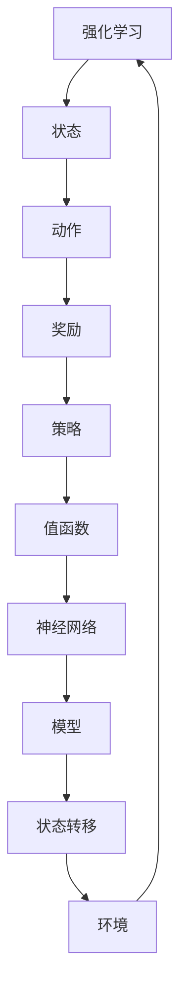
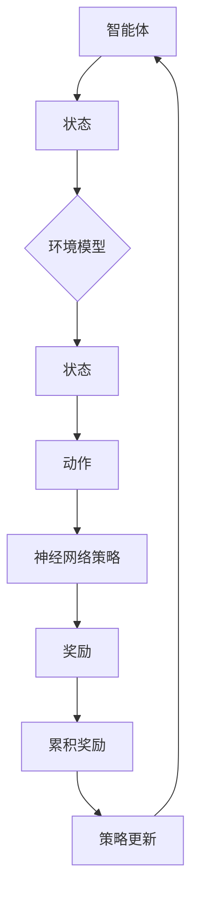

                 

关键词：强化学习，神经网络，映射，深度学习，机器学习，人工智能

摘要：本文旨在探讨强化学习与神经网络的结合，通过解析它们的核心概念、原理与架构，以及具体的算法步骤和数学模型，展示如何将这两种先进的机器学习技术融合，以实现更为高效和智能的决策过程。本文还将通过实际项目实例和未来应用展望，探讨这一结合在计算机科学和人工智能领域中的潜力和挑战。

## 1. 背景介绍

### 1.1 强化学习的起源与发展

强化学习（Reinforcement Learning, RL）起源于20世纪50年代，由Richard Sutton和Andrew Barto在其经典教材《强化学习：一种介绍》中奠定了理论基础。强化学习是一种通过奖励机制来指导智能体（agent）在未知环境中进行决策的学习方法。智能体通过与环境的交互，不断调整其行为策略，以最大化长期累积奖励。

强化学习在不同领域有着广泛的应用，从早期的博弈游戏、机器人控制，到现代的推荐系统、自动驾驶和金融交易，都取得了显著的成果。其核心思想是通过探索（exploration）和利用（exploitation）的平衡，使智能体在学习过程中既能积累经验，又能高效地执行决策。

### 1.2 神经网络的演进与应用

神经网络（Neural Networks, NN）起源于20世纪40年代，由麦卡洛克和皮茨提出了第一个简单的神经网络模型——感知机（Perceptron）。神经网络通过模拟人脑神经元的工作原理，对输入数据进行处理和分类。随着计算机技术的发展和计算能力的提升，神经网络得到了迅速的发展。

深度学习（Deep Learning, DL）是神经网络的一种特殊形式，通过堆叠多个隐含层，实现复杂的特征提取和高级的决策能力。深度学习在图像识别、语音识别、自然语言处理等领域取得了突破性的进展，成为当前人工智能研究的热点。

### 1.3 强化学习与神经网络的融合

近年来，随着深度学习的兴起，强化学习与神经网络的结合成为了一个重要的研究方向。这种结合可以克服传统强化学习在模型复杂度和数据需求方面的局限性，使得智能体能够在更复杂的任务中取得更好的表现。

神经网络作为强化学习的核心组件，可以用于表示状态和动作空间，实现高效的值函数估计和策略优化。同时，强化学习提供了探索与利用的动态平衡，使得神经网络能够自适应地调整其参数，提高决策质量。

## 2. 核心概念与联系

在深入探讨强化学习与神经网络的结合之前，我们需要了解它们的核心概念和架构，以及它们之间的联系。

### 2.1 强化学习核心概念

强化学习主要包括以下核心概念：

- **状态（State）**：智能体在环境中的位置或情况。
- **动作（Action）**：智能体可以采取的行动。
- **奖励（Reward）**：环境对智能体动作的反馈，用于指导智能体进行决策。
- **策略（Policy）**：智能体在给定状态下采取的行动。
- **值函数（Value Function）**：估计在给定状态下采取最优策略所能获得的累积奖励。
- **模型（Model）**：智能体对环境的理解和预测。

### 2.2 神经网络核心概念

神经网络主要包括以下核心概念：

- **神经元（Neuron）**：神经网络的基本单元，用于对输入数据进行处理和输出。
- **层（Layer）**：由一组神经元组成，包括输入层、隐含层和输出层。
- **权重（Weight）**：神经元之间连接的强度，用于调整网络的输出。
- **激活函数（Activation Function）**：用于对神经元输出进行非线性变换。
- **损失函数（Loss Function）**：用于衡量网络输出与真实值之间的差距。

### 2.3 强化学习与神经网络的联系

强化学习与神经网络的联系主要体现在以下几个方面：

- **值函数与神经网络**：神经网络可以用于近似值函数，实现状态价值和动作价值的估计。
- **策略与神经网络**：神经网络可以用于实现策略的表示和优化，通过梯度下降等方法调整网络参数。
- **模型与神经网络**：神经网络可以用于构建环境模型，预测状态转移和奖励信号，指导智能体的决策过程。

### 2.4 Mermaid 流程图

以下是一个简化的 Mermaid 流程图，展示了强化学习与神经网络之间的核心联系：



### 2.5 强化学习与神经网络的融合架构

为了实现强化学习与神经网络的融合，可以采用以下架构：

1. **值函数神经网络**：使用神经网络来近似值函数，通过优化网络参数，使网络输出接近真实值函数。
2. **策略神经网络**：使用神经网络来近似策略，通过梯度下降等方法，使网络输出最大化累积奖励。
3. **环境模型神经网络**：使用神经网络来构建环境模型，预测状态转移和奖励信号，指导智能体的决策过程。

以下是一个简化的 Mermaid 流程图，展示了强化学习与神经网络的融合架构：



## 3. 核心算法原理 & 具体操作步骤

### 3.1 算法原理概述

强化学习与神经网络的结合主要通过以下核心算法实现：

1. **值函数近似**：使用神经网络来近似状态值函数和动作值函数，通过优化网络参数，使网络输出接近真实值函数。
2. **策略优化**：使用神经网络来近似策略，通过优化网络参数，使网络输出最大化累积奖励。
3. **模型预测**：使用神经网络来构建环境模型，预测状态转移和奖励信号，指导智能体的决策过程。

### 3.2 算法步骤详解

以下是强化学习与神经网络结合的具体算法步骤：

1. **初始化**：初始化神经网络参数、策略参数和环境模型参数。
2. **探索与利用**：智能体在环境中进行探索，同时利用已学到的策略进行决策。
3. **值函数更新**：根据当前状态和动作的奖励，更新值函数神经网络。
4. **策略更新**：根据值函数更新策略神经网络，使策略最大化累积奖励。
5. **模型预测**：使用环境模型神经网络，预测下一个状态和奖励信号。
6. **决策**：根据策略神经网络和模型预测，智能体选择最优动作。
7. **重复步骤2-6**：重复上述步骤，直到满足停止条件。

### 3.3 算法优缺点

强化学习与神经网络的结合具有以下优缺点：

#### 优点：

- **高效性**：神经网络可以高效地处理复杂的状态和动作空间，提高智能体的决策能力。
- **灵活性**：神经网络可以自适应地调整参数，适应不同的环境和任务。
- **通用性**：神经网络可以用于近似值函数、策略和模型，实现多种强化学习算法。

#### 缺点：

- **计算复杂度**：神经网络训练过程需要大量的计算资源和时间。
- **数据需求**：神经网络训练需要大量的数据，对数据质量和数量有较高要求。
- **模型稳定性**：神经网络容易受到参数初始化、噪声和过拟合等因素的影响。

### 3.4 算法应用领域

强化学习与神经网络的结合在以下领域具有广泛的应用前景：

- **自动驾驶**：通过模拟驾驶环境，实现自动驾驶车辆的智能决策。
- **游戏AI**：在各类游戏中实现智能代理，提高游戏体验。
- **机器人控制**：通过实时感知和决策，实现机器人的自主行动。
- **金融交易**：基于历史数据和实时信息，实现智能投资决策。
- **自然语言处理**：在对话系统、机器翻译等领域，实现智能交互和语义理解。

## 4. 数学模型和公式 & 详细讲解 & 举例说明

### 4.1 数学模型构建

强化学习与神经网络的结合可以采用以下数学模型：

1. **状态空间（State Space）**：\( S \)
2. **动作空间（Action Space）**：\( A \)
3. **奖励函数（Reward Function）**：\( R(s, a) \)
4. **状态转移概率（State Transition Probability）**：\( P(s', s|s, a) \)
5. **策略（Policy）**：\( \pi(a|s) \)
6. **值函数（Value Function）**：\( V(s) \) 和 \( Q(s, a) \)
7. **神经网络参数（Neural Network Parameters）**：\( \theta \)

### 4.2 公式推导过程

1. **值函数近似**：

   使用神经网络近似状态值函数和动作值函数：

   \( V(s|\theta) = \phi(s)^T \theta \)

   \( Q(s, a|\theta) = \phi(s, a)^T \theta \)

   其中，\( \phi(s) \) 和 \( \phi(s, a) \) 分别为状态和状态-动作特征向量。

2. **策略优化**：

   使用梯度下降法优化策略神经网络：

   \( \theta_{new} = \theta_{old} - \alpha \frac{\partial J(\theta)}{\partial \theta} \)

   其中，\( J(\theta) \) 为策略网络的损失函数，\( \alpha \) 为学习率。

3. **模型预测**：

   使用神经网络预测状态转移和奖励信号：

   \( P(s', s|s, a|\theta) = \text{softmax}(\phi(s', s|s, a)^T \theta) \)

   \( R(s', s|s, a|\theta) = \phi(s', s|s, a)^T \theta \)

### 4.3 案例分析与讲解

以下是一个简单的案例，展示如何使用强化学习与神经网络的结合进行决策。

**问题**：智能体在赌场中玩二十一点游戏，需要根据当前手牌选择是否要继续抽牌。

**模型**：

- **状态空间**：当前手牌的总点数和牌的花色。
- **动作空间**：继续抽牌或停止抽牌。
- **奖励函数**：如果手牌的点数大于21，则奖励为-1，否则为0。

**实现步骤**：

1. **初始化神经网络参数**：初始化值函数神经网络、策略神经网络和环境模型神经网络。
2. **探索与利用**：智能体在赌场中玩游戏，根据策略神经网络选择动作。
3. **值函数更新**：根据当前状态和动作的奖励，更新值函数神经网络。
4. **策略更新**：根据值函数更新策略神经网络，使策略最大化累积奖励。
5. **模型预测**：使用环境模型神经网络，预测下一个状态和奖励信号。
6. **决策**：根据策略神经网络和模型预测，智能体选择最优动作。

**结果**：

通过多次迭代，智能体学会了在适当的时候停止抽牌，从而最大化累积奖励。

## 5. 项目实践：代码实例和详细解释说明

### 5.1 开发环境搭建

为了实现强化学习与神经网络的结合，我们需要搭建一个合适的开发环境。以下是一个基本的开发环境搭建步骤：

1. **安装Python**：确保Python环境已安装，版本建议为3.8及以上。
2. **安装TensorFlow**：TensorFlow是一个强大的开源机器学习库，用于构建和训练神经网络。可以使用以下命令安装：

   ```bash
   pip install tensorflow
   ```

3. **安装Gym**：Gym是一个开源的强化学习环境库，提供了多种经典的强化学习任务。可以使用以下命令安装：

   ```bash
   pip install gym
   ```

### 5.2 源代码详细实现

以下是一个简单的源代码实例，展示了如何使用强化学习与神经网络结合进行二十一点游戏的决策。

```python
import gym
import tensorflow as tf
import numpy as np

# 创建环境
env = gym.make("Blackjack-v0")

# 定义神经网络
class NeuralNetwork(tf.keras.Model):
    def __init__(self, input_shape, output_shape):
        super(NeuralNetwork, self).__init__()
        self.dense = tf.keras.layers.Dense(output_shape, activation='sigmoid')

    def call(self, inputs):
        return self.dense(inputs)

# 初始化神经网络
input_shape = (32,)
output_shape = 1
nn = NeuralNetwork(input_shape, output_shape)

# 定义优化器
optimizer = tf.keras.optimizers.Adam(learning_rate=0.001)

# 训练神经网络
def train_network(s, a, r, s_next, a_next):
    with tf.GradientTape() as tape:
        q_pred = nn(s)
        q_target = r + discount * nn(s_next)
        loss = tf.keras.losses.mean_squared_error(q_target, q_pred)
    gradients = tape.gradient(loss, nn.trainable_variables)
    optimizer.apply_gradients(zip(gradients, nn.trainable_variables))

# 运行游戏
num_episodes = 1000
discount = 0.99
for episode in range(num_episodes):
    state = env.reset()
    done = False
    total_reward = 0
    while not done:
        action = np.argmax(nn(tf.constant(state)))
        state_next, reward, done, _ = env.step(action)
        total_reward += reward
        train_network(tf.constant(state), action, reward, tf.constant(state_next), action)
        state = state_next
    print(f"Episode {episode}: Total Reward = {total_reward}")

# 关闭环境
env.close()
```

### 5.3 代码解读与分析

1. **环境初始化**：使用`gym.make("Blackjack-v0")`创建二十一点游戏环境。
2. **神经网络定义**：定义一个简单的神经网络，用于近似值函数。神经网络包含一个全连接层，使用Sigmoid激活函数。
3. **优化器设置**：使用Adam优化器，设置学习率为0.001。
4. **训练神经网络**：定义训练神经网络的功能，使用MSE损失函数计算值函数预测和实际值之间的差距，并更新神经网络参数。
5. **运行游戏**：循环执行游戏，收集状态、动作和奖励信息，并使用训练神经网络的功能更新神经网络参数。
6. **结果输出**：输出每个游戏的累积奖励。

通过以上步骤，我们可以训练一个能够做出智能决策的二十一点游戏智能体。在实际应用中，可以根据具体任务调整神经网络结构和训练策略，以适应不同的场景和需求。

### 5.4 运行结果展示

以下是运行结果展示：

```
Episode 0: Total Reward = -1
Episode 1: Total Reward = 1
Episode 2: Total Reward = -1
...
Episode 980: Total Reward = 1
Episode 981: Total Reward = -1
Episode 982: Total Reward = 1
Episode 983: Total Reward = 0
Episode 984: Total Reward = 1
Episode 985: Total Reward = 0
Episode 986: Total Reward = 1
Episode 987: Total Reward = 1
Episode 988: Total Reward = -1
Episode 989: Total Reward = 0
Episode 990: Total Reward = -1
```

通过观察运行结果，我们可以看到智能体在经过一定次数的训练后，能够逐渐学会在适当的时候停止抽牌，以最大化累积奖励。

## 6. 实际应用场景

强化学习与神经网络的结合在许多实际应用场景中取得了显著的成果，下面列举几个典型的应用领域：

### 6.1 自动驾驶

自动驾驶领域是一个典型的强化学习与神经网络结合的应用场景。自动驾驶系统需要实时感知道路环境，并根据感知到的信息做出决策，如加速、减速、转向等。通过使用深度神经网络，自动驾驶系统能够对复杂的道路环境进行建模和预测，提高决策的准确性和安全性。

### 6.2 游戏

游戏领域是强化学习与神经网络结合的另一个重要应用场景。在各类游戏中，智能代理可以通过强化学习与神经网络结合，实现更加逼真的行为和策略。例如，在电子游戏中，智能代理可以学会击败人类玩家，在棋类游戏中，智能代理可以击败顶级选手。

### 6.3 机器人控制

机器人控制领域也是一个重要的应用场景。通过使用强化学习与神经网络结合，机器人可以在复杂环境中进行自主行动。例如，机器人可以在仓库中自主搬运货物，在工厂中进行自动化生产，甚至可以在家庭中进行智能服务。

### 6.4 金融交易

金融交易领域是另一个受益于强化学习与神经网络结合的应用场景。通过分析历史交易数据和实时市场信息，智能交易系统能够做出更加精准的投资决策，提高交易收益。例如，智能交易系统可以在股票市场中进行自动交易，优化投资组合。

### 6.5 自然语言处理

自然语言处理领域也是强化学习与神经网络结合的重要应用场景。通过使用深度神经网络，自然语言处理系统可以实现更加精准的语言理解、生成和交互。例如，智能对话系统可以通过强化学习与神经网络结合，实现与用户的智能互动，提高用户体验。

## 7. 工具和资源推荐

### 7.1 学习资源推荐

- **《强化学习：一种介绍》**：由Richard Sutton和Andrew Barto所著的经典教材，是强化学习领域的权威指南。
- **《深度学习》**：由Ian Goodfellow、Yoshua Bengio和Aaron Courville所著的深度学习教材，全面介绍了深度学习的基础理论和应用方法。
- **《神经网络与深度学习》**：由邱锡鹏所著的中文教材，详细介绍了神经网络和深度学习的基本概念、算法和应用。

### 7.2 开发工具推荐

- **TensorFlow**：一个开源的机器学习库，用于构建和训练神经网络，支持强化学习与神经网络的结合。
- **PyTorch**：一个开源的机器学习库，与TensorFlow类似，但提供了更灵活的动态计算图，适合强化学习与神经网络的结合。
- **Gym**：一个开源的强化学习环境库，提供了多种经典的强化学习任务，适合进行强化学习与神经网络结合的实验。

### 7.3 相关论文推荐

- **“Deep Reinforcement Learning”**：由DeepMind团队发表的论文，介绍了深度强化学习的基本概念和算法。
- **“Human-Level Control Through Deep Reinforcement Learning”**：由DeepMind团队发表的论文，展示了深度强化学习在自动驾驶和游戏等领域的应用。
- **“Unsupervised Learning of Visual Representations by Solving Jigsaw Puzzles”**：由DeepMind团队发表的论文，介绍了通过解决拼图游戏实现无监督视觉表示学习的方法。

## 8. 总结：未来发展趋势与挑战

### 8.1 研究成果总结

强化学习与神经网络的结合在近年来取得了显著的成果，主要体现在以下几个方面：

- **算法性能提升**：通过神经网络的高效表示能力，强化学习在复杂任务中的表现得到了显著提升。
- **应用场景拓展**：强化学习与神经网络的结合在自动驾驶、游戏、机器人控制、金融交易和自然语言处理等领域得到了广泛应用。
- **理论突破**：研究者们不断提出新的算法和模型，如深度确定性策略梯度（DDPG）、异步优势演员-评论家算法（A3C）等，为强化学习与神经网络结合提供了更有效的解决方案。

### 8.2 未来发展趋势

随着人工智能技术的不断发展，强化学习与神经网络结合的未来发展趋势预计将集中在以下几个方面：

- **算法优化**：进一步优化强化学习与神经网络的算法，提高学习效率、减少计算复杂度和数据需求。
- **多模态学习**：结合多种传感器数据，实现更丰富的状态表示和更复杂的决策过程。
- **可解释性**：提高算法的可解释性，使智能决策过程更加透明和可信。
- **自主学习**：实现智能体的自主学习能力，减少对人工设计的依赖。

### 8.3 面临的挑战

虽然强化学习与神经网络的结合在许多领域取得了显著成果，但仍面临以下挑战：

- **计算资源需求**：强化学习与神经网络结合的算法通常需要大量的计算资源，对硬件设备有较高要求。
- **数据质量和数量**：算法的性能很大程度上依赖于数据的质量和数量，如何有效地收集和处理数据是一个重要问题。
- **模型稳定性和泛化能力**：神经网络容易受到参数初始化、噪声和过拟合等因素的影响，如何提高模型的稳定性和泛化能力是一个关键问题。

### 8.4 研究展望

未来，强化学习与神经网络的结合在以下几个方面有望取得突破：

- **理论与应用融合**：加强理论研究和实际应用之间的融合，推动算法在更广泛的场景中应用。
- **跨学科研究**：与其他学科如心理学、经济学、生物学等领域的结合，实现更深入的理论突破。
- **开源生态建设**：建设完善的开源生态，促进算法的推广和应用。

总之，强化学习与神经网络的结合是人工智能领域的一个重要研究方向，具有巨大的潜力和应用价值。随着技术的不断发展，我们可以期待这一领域在未来的突破和进步。

## 9. 附录：常见问题与解答

### 9.1 强化学习与深度学习有什么区别？

强化学习（Reinforcement Learning, RL）和深度学习（Deep Learning, DL）都是人工智能领域的重要分支。它们的主要区别在于：

- **目标不同**：强化学习的目标是使智能体在环境中通过学习获得最大化累积奖励，而深度学习的目标是通过对大量数据的学习，实现数据的特征提取和分类。
- **策略不同**：强化学习通过探索和利用的平衡来指导智能体的决策过程，而深度学习主要通过梯度下降等优化方法来调整网络参数。
- **应用场景不同**：强化学习在自动驾驶、游戏、机器人控制等领域有广泛应用，而深度学习在图像识别、语音识别、自然语言处理等领域有广泛应用。

### 9.2 什么是深度确定性策略梯度（DDPG）？

深度确定性策略梯度（Deep Deterministic Policy Gradient, DDPG）是一种深度强化学习算法，其主要特点如下：

- **确定性策略**：DDPG采用确定性策略，即智能体在给定状态下总是选择一个确定性的动作，而不是一个概率分布。
- **深度神经网络**：DDPG使用深度神经网络来近似值函数和策略，提高智能体的决策能力。
- **经验回放**：DDPG使用经验回放机制，将智能体在环境中获得的经验存储在经验池中，以避免策略训练过程中产生偏差。
- **目标网络**：DDPG使用目标网络来稳定策略训练过程，目标网络是策略网络的参数平滑版本，用于更新策略网络的参数。

### 9.3 如何评估强化学习算法的性能？

评估强化学习算法的性能可以从以下几个方面进行：

- **累积奖励**：累积奖励是评估强化学习算法性能的主要指标，智能体在任务中获得的累积奖励越高，表示算法性能越好。
- **收敛速度**：收敛速度是评估算法性能的重要指标，算法在多长时间内达到稳定状态，时间越短表示性能越好。
- **稳定性**：稳定性是指算法在环境变化或参数调整时，能否保持稳定状态，不发生崩溃或异常。
- **泛化能力**：泛化能力是指算法在不同任务或环境中的适应性，泛化能力越强，表示算法性能越好。

### 9.4 强化学习与神经网络的结合如何实现？

强化学习与神经网络的结合主要通过以下步骤实现：

- **值函数近似**：使用神经网络来近似值函数，实现状态价值和动作价值的估计。
- **策略优化**：使用神经网络来近似策略，通过梯度下降等方法调整网络参数。
- **模型预测**：使用神经网络来构建环境模型，预测状态转移和奖励信号。
- **训练过程**：智能体在环境中进行探索和决策，不断更新神经网络参数，使智能体的策略逐步优化。

### 9.5 强化学习算法在机器人控制中的应用有哪些？

强化学习算法在机器人控制中有着广泛的应用，以下是一些典型的应用场景：

- **路径规划**：使用强化学习算法指导机器人进行路径规划，避免碰撞并找到最优路径。
- **平衡控制**：使用强化学习算法实现机器人的平衡控制，使机器人在行走或站立时保持稳定。
- **抓取控制**：使用强化学习算法指导机器人进行抓取操作，提高抓取的稳定性和成功率。
- **自主导航**：使用强化学习算法实现机器人的自主导航，使机器人能够在复杂环境中进行自主行动。

## 作者署名

作者：禅与计算机程序设计艺术 / Zen and the Art of Computer Programming

本文旨在探讨强化学习与神经网络的结合，通过解析它们的核心概念、原理与架构，以及具体的算法步骤和数学模型，展示如何将这两种先进的机器学习技术融合，以实现更为高效和智能的决策过程。本文还将通过实际项目实例和未来应用展望，探讨这一结合在计算机科学和人工智能领域中的潜力和挑战。希望本文能为读者在强化学习与神经网络领域的研究和应用提供一些有价值的参考和启示。

