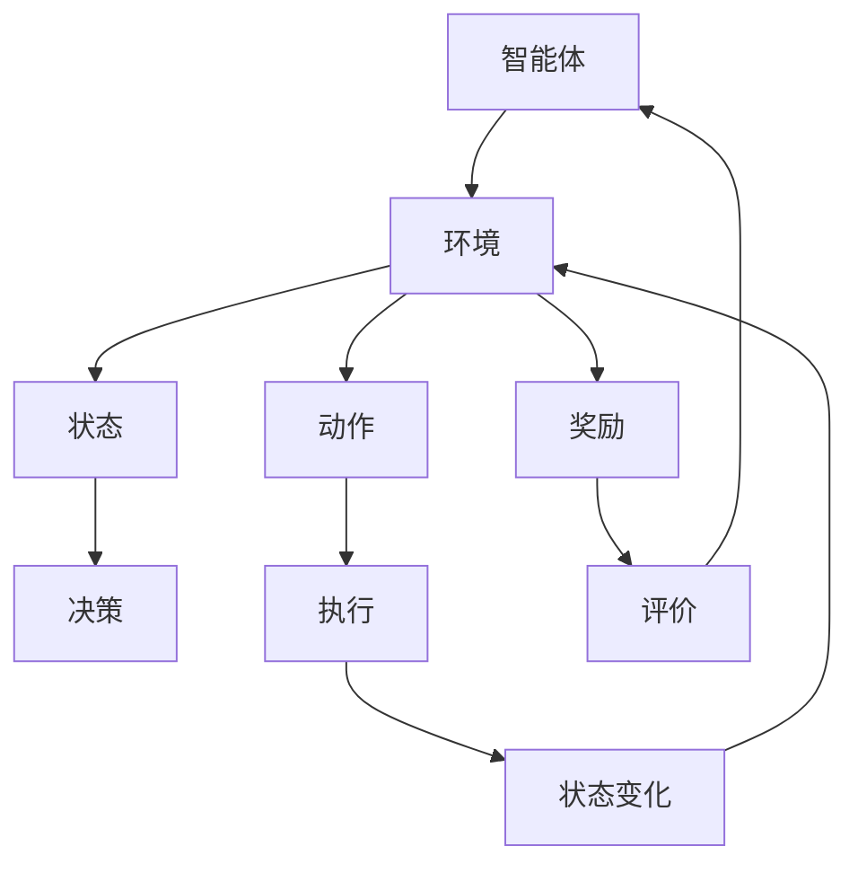

                 

 

## 1. 背景介绍

强化学习（Reinforcement Learning，RL）作为机器学习领域的一个重要分支，已经在过去几十年中取得了显著的进展。它通过智能体（Agent）与环境的交互来学习最优策略，这一过程本质上是基于奖励信号的不断优化。随着深度学习（Deep Learning）的崛起，强化学习在解决复杂问题上表现出了极大的潜力，尤其是在游戏AI领域。

游戏AI的兴起，为强化学习提供了丰富的应用场景。从简单的棋类游戏到复杂的电子竞技，强化学习算法都展现出了强大的适应能力和学习效率。本篇文章将深入探讨强化学习在游戏AI中的应用，通过具体的案例分析和算法原理讲解，来展示这一技术在游戏开发中的价值。

本文将分为以下几个部分：

- **背景介绍**：简要介绍强化学习的基本概念和历史发展。
- **核心概念与联系**：详细阐述强化学习中的核心概念和理论联系，并使用Mermaid流程图展示。
- **核心算法原理 & 具体操作步骤**：解释强化学习算法的原理和具体操作步骤，分析其优缺点和应用领域。
- **数学模型和公式**：详细讲解强化学习中的数学模型和公式推导过程，并通过案例进行分析。
- **项目实践：代码实例和详细解释说明**：提供实际项目中的代码实例，并进行详细解读和分析。
- **实际应用场景**：探讨强化学习在游戏AI中的实际应用案例。
- **未来应用展望**：对强化学习在游戏AI领域未来的发展进行展望。
- **工具和资源推荐**：推荐学习资源和开发工具。
- **总结**：总结研究成果，展望未来发展趋势和面临的挑战。

接下来，我们将逐步深入每一个部分，全面剖析强化学习在游戏AI中的应用。

## 2. 核心概念与联系

强化学习中的核心概念包括：智能体（Agent）、环境（Environment）、状态（State）、动作（Action）和奖励（Reward）。这些概念构成了强化学习的基础，理解它们之间的联系和相互作用是掌握强化学习的关键。

### 智能体（Agent）

智能体是指能够执行任务并从环境中获取奖励的学习实体。在强化学习过程中，智能体通过感知环境的状态，选择合适的动作，并接收来自环境的即时奖励，以优化其行为策略。

### 环境（Environment）

环境是智能体执行动作和接收奖励的场所。环境可以是一个物理系统，也可以是一个虚拟的模拟系统。环境的状态是智能体进行决策的依据，而智能体的动作会改变环境的状态，从而影响后续的状态和奖励。

### 状态（State）

状态是环境中所有信息的集合，用于描述智能体在某一时刻所处的情境。状态可以是离散的，也可以是连续的，它为智能体提供了决策的基础。

### 动作（Action）

动作是智能体在某一状态下的决策结果。动作可以是离散的，例如移动、攻击等，也可以是连续的，例如速度、角度等。

### 奖励（Reward）

奖励是环境对智能体动作的即时反馈，用于评估智能体行为的好坏。奖励可以是正的，表示智能体执行的动作是有利的，也可以是负的，表示智能体的动作是不利的。

### Mermaid流程图展示

为了更好地理解这些核心概念之间的联系，我们可以使用Mermaid流程图来展示它们之间的交互关系。



通过上述流程图，我们可以清晰地看到智能体与环境之间的相互作用过程。智能体通过感知状态，选择动作，执行动作后，环境会根据动作的结果给出奖励，智能体据此调整其策略，形成正向或负向反馈循环。

### 强化学习的基本原理

强化学习的基本原理是通过不断的试错来寻找最优策略。智能体通过探索环境中的各种状态和动作，通过奖励信号反馈来评估这些动作的有效性，并逐渐调整其策略，以最大化总奖励。

在强化学习过程中，智能体需要解决的主要问题是状态-动作值函数（State-Action Value Function）的估计。状态-动作值函数用于预测在给定状态下执行特定动作所能获得的累积奖励。通过不断地更新状态-动作值函数，智能体能够逐步逼近最优策略。

### 强化学习的不同类型

根据智能体与环境之间的交互方式和学习策略，强化学习可以分为以下几种类型：

- **模型基础强化学习**：智能体在执行动作前，可以获取关于环境状态的完整信息，并预测可能的结果。这类强化学习算法主要包括马尔可夫决策过程（MDP）和部分可观测马尔可夫决策过程（POMDP）。

- **无模型强化学习**：智能体无法获取关于环境的完整信息，只能通过实际执行动作来获取反馈。这类算法主要包括深度强化学习和模型自由强化学习。

- **合作强化学习**：多个智能体共同协作，共同优化其策略。这类算法在多人游戏中具有广泛的应用。

- **对抗强化学习**：两个或多个智能体相互对抗，通过博弈过程来寻找最优策略。这类算法在电子竞技游戏中得到了广泛应用。

### 小结

通过上述介绍，我们可以看到，强化学习通过智能体与环境之间的交互，利用奖励信号来优化智能体的策略，从而在复杂的环境中实现自我学习和优化。这些核心概念和原理构成了强化学习在游戏AI中的应用基础。

### 2.1. 强化学习在游戏AI中的独特优势

强化学习在游戏AI中的应用具有独特的优势，这些优势主要体现在以下几个方面：

1. **自我学习和适应能力**：强化学习算法能够通过与环境交互，自动学习游戏中的策略，不需要预先编程复杂的规则。这使得智能体能够适应不同的游戏环境和变化，提高游戏体验的多样性。

2. **动态决策能力**：在游戏中，智能体需要根据当前的游戏状态做出实时决策。强化学习算法通过不断更新状态-动作值函数，使得智能体能够动态调整策略，以应对各种突发情况。

3. **策略优化**：强化学习算法通过不断优化策略，使得智能体能够在游戏中获得更高的分数和更好的成绩。这种优化过程是自动的，不需要人工干预，大大提高了游戏AI的效率。

4. **多样化玩法**：通过强化学习，游戏AI能够探索出不同的游戏玩法，使得游戏更加丰富和有趣。玩家可以体验到不同的挑战和策略，增加了游戏的趣味性和可玩性。

5. **通用性和扩展性**：强化学习算法在游戏AI中的应用具有很好的通用性和扩展性。无论是简单的棋类游戏，还是复杂的电子竞技游戏，强化学习算法都能够发挥作用，并适应不同的游戏规则和场景。

### 2.2. 强化学习在游戏AI中的实际应用案例

强化学习在游戏AI中的实际应用案例非常丰富，以下是一些典型的应用案例：

1. **电子竞技游戏**：在《星际争霸2》（StarCraft 2）等电子竞技游戏中，强化学习算法被用来训练智能体，使其能够与人类玩家进行竞争。通过不断的学习和优化，智能体能够掌握复杂的游戏策略，并在比赛中取得优异的成绩。

2. **角色扮演游戏**：在《模拟人生4》（The Sims 4）等角色扮演游戏中，强化学习算法被用来控制NPC（非玩家角色）的行为。智能体通过学习玩家的行为模式和偏好，能够更加自然和智能地与玩家互动，提升游戏体验。

3. **棋类游戏**：在《国际象棋》（Chess）和《围棋》（Go）等棋类游戏中，强化学习算法被用来训练智能体，使其能够达到或超过专业水平。通过大量的对弈和学习，智能体能够不断提高其棋艺，为玩家提供更具挑战性的对手。

4. **街机游戏**：在《打砖块》（Pong）和《太空侵略者》（Space Invaders）等街机游戏中，强化学习算法被用来控制AI对手的行为。智能体通过不断学习玩家的操作策略，能够更加精准和智能地反击，提升游戏的难度和趣味性。

5. **多人在线游戏**：在《守望先锋》（Overwatch）和《堡垒之夜》（Fortnite）等多人在线游戏中，强化学习算法被用来优化游戏AI的行为。智能体可以学习玩家的游戏风格和战术，并根据不同的情况做出灵活的应对，提高游戏的平衡性和公平性。

### 2.3. 强化学习在游戏AI中的应用前景

随着人工智能技术的不断发展，强化学习在游戏AI中的应用前景非常广阔。以下是一些可能的未来应用方向：

1. **自适应游戏难度**：通过强化学习，游戏可以自动调整难度，以适应不同玩家的技能水平。这种自适应机制能够为玩家提供更加公平和有趣的游戏体验。

2. **个性化游戏推荐**：强化学习可以分析玩家的游戏行为和偏好，为玩家推荐符合其喜好的游戏内容和角色，提高玩家的游戏满意度和留存率。

3. **游戏平衡性优化**：在多人在线游戏中，强化学习可以用来评估和优化游戏规则，确保游戏的平衡性和公平性，减少作弊和游戏漏洞。

4. **虚拟现实（VR）游戏**：随着VR技术的普及，强化学习在VR游戏中的应用将越来越广泛。智能体可以通过学习玩家的行为，提供更加真实和互动的游戏体验。

5. **游戏开发辅助**：强化学习算法可以用于游戏开发的各个阶段，如角色设计、场景布局、难度调整等，提高游戏开发效率和效果。

总之，强化学习在游戏AI中的应用具有巨大的潜力，它将不断推动游戏行业的创新和发展。未来，随着技术的不断进步，强化学习在游戏AI中的应用将会更加广泛和深入，为玩家带来更加丰富和有趣的游戏体验。

## 3. 核心算法原理 & 具体操作步骤

在深入探讨强化学习在游戏AI中的应用之前，我们需要先了解其核心算法原理和具体操作步骤。强化学习算法的核心思想是智能体通过与环境的交互，不断优化其策略，以最大化累积奖励。下面我们将分几个部分来详细讲解强化学习算法的原理和操作步骤。

### 3.1. 算法原理概述

强化学习算法的基本原理可以概括为以下几个步骤：

1. **初始化**：智能体在初始状态下选择一个动作，并执行该动作。
2. **状态-动作值估计**：智能体根据执行的动作和收到的奖励，更新其对于各个状态-动作对的值估计。
3. **策略优化**：智能体根据状态-动作值估计，更新其策略，选择能够获得最大期望奖励的动作。
4. **重复迭代**：智能体重复上述步骤，不断优化其策略，直到达到预定的目标。

在这个过程中，智能体需要解决的主要问题是状态-动作值函数的估计。状态-动作值函数用于预测在给定状态下执行特定动作所能获得的累积奖励。通过不断更新状态-动作值函数，智能体能够逐步逼近最优策略。

### 3.2. 算法步骤详解

强化学习算法的具体步骤可以分为以下几个阶段：

#### 3.2.1. 初始化阶段

在初始化阶段，智能体需要选择一个初始状态，并根据初始状态选择一个初始动作。这个初始动作可以是随机选择的，也可以是基于某种策略选择的，如epsilon-贪心策略（epsilon-greedy policy）。

#### 3.2.2. 状态-动作值估计阶段

在状态-动作值估计阶段，智能体需要根据执行的动作和收到的奖励，更新其对于各个状态-动作对的值估计。这个过程通常通过贝尔曼方程（Bellman equation）来实现。

贝尔曼方程的表达式如下：

\[ V(s') = \mathbb{E}[R_t + \gamma V(s_{t+1}) | s_t = s', a_t = a'] \]

其中，\( V(s') \)表示在状态\( s' \)下的状态-动作值估计，\( R_t \)表示在时刻\( t \)收到的奖励，\( \gamma \)是折扣因子，用于平衡当前奖励和未来奖励的关系，\( s_{t+1} \)表示在时刻\( t+1 \)的状态，\( a_t \)表示在时刻\( t \)的动作。

#### 3.2.3. 策略优化阶段

在策略优化阶段，智能体需要根据状态-动作值估计，更新其策略，选择能够获得最大期望奖励的动作。这个策略更新过程可以通过价值迭代（Value Iteration）或策略迭代（Policy Iteration）来实现。

价值迭代的基本思想是：从初始状态开始，逐步更新所有状态-动作值估计，直到达到预定的收敛条件。具体步骤如下：

1. 初始化状态-动作值估计。
2. 对于每个状态，选择一个动作，并计算该动作的期望奖励。
3. 根据期望奖励更新状态-动作值估计。
4. 重复步骤2和3，直到满足收敛条件（如状态-动作值估计的变化小于某个阈值）。

策略迭代的基本思想是：从初始策略开始，逐步更新策略，直到策略不再发生变化。具体步骤如下：

1. 初始化策略。
2. 根据当前策略，计算每个状态的最佳动作。
3. 根据最佳动作更新策略。
4. 重复步骤2和3，直到策略不再发生变化。

#### 3.2.4. 重复迭代阶段

在重复迭代阶段，智能体需要不断重复上述步骤，以逐步优化其策略，并最终达到预定的目标。这个迭代过程可以是基于贪心策略的，也可以是基于探索策略的，如epsilon-贪心策略（epsilon-greedy policy）。

epsilon-贪心策略的基本思想是：在每次选择动作时，以概率\( \epsilon \)随机选择动作，以\( 1 - \epsilon \)的概率选择根据当前状态-动作值估计选择的最优动作。这样既能够保证智能体有一定的探索性，避免陷入局部最优，又能够保证智能体具有一定的确定性，提高决策效率。

### 3.3. 算法优缺点

强化学习算法具有以下优点：

1. **自我学习能力**：强化学习算法能够通过与环境交互，自我学习最优策略，不需要预先编程复杂的规则。
2. **适应性强**：强化学习算法能够适应不同的环境和变化，提高智能体的灵活性和适应性。
3. **动态决策能力**：强化学习算法能够根据当前状态和奖励，动态调整策略，以应对各种突发情况。

然而，强化学习算法也存在一些缺点：

1. **收敛速度慢**：由于需要通过大量迭代来优化策略，强化学习算法的收敛速度通常较慢。
2. **高计算复杂度**：在复杂的决策环境中，强化学习算法的计算复杂度较高，需要大量的计算资源和时间。
3. **不确定性处理困难**：强化学习算法在处理不确定性问题时，存在一定的挑战，如环境的不确定性和奖励函数的不确定性。

### 3.4. 算法应用领域

强化学习算法在游戏AI中具有广泛的应用领域，包括：

1. **电子竞技游戏**：如《星际争霸2》等电子竞技游戏，强化学习算法可以训练智能体与人类玩家进行竞争。
2. **角色扮演游戏**：如《模拟人生4》等角色扮演游戏，强化学习算法可以控制NPC的行为，提升游戏体验。
3. **棋类游戏**：如《国际象棋》和《围棋》等棋类游戏，强化学习算法可以训练智能体，使其达到或超过专业水平。
4. **街机游戏**：如《打砖块》和《太空侵略者》等街机游戏，强化学习算法可以控制AI对手的行为，提升游戏难度和趣味性。
5. **多人在线游戏**：如《守望先锋》和《堡垒之夜》等多人人在线游戏，强化学习算法可以优化游戏AI的行为，提高游戏的平衡性和公平性。

### 3.5. 强化学习在游戏AI中的应用实例

为了更好地理解强化学习在游戏AI中的应用，下面我们通过一个简单的案例来介绍其应用流程。

#### 案例背景

假设我们正在开发一款简单的迷宫游戏，游戏的目标是智能体需要从起点到达终点，避免遇到障碍物。智能体的状态包括当前位置、前方是否有障碍物，动作包括向左、向右、向上、向下移动。

#### 应用流程

1. **初始化阶段**：智能体随机选择一个起点，并初始化状态-动作值估计。

2. **状态-动作值估计阶段**：智能体根据当前状态选择一个动作，并执行该动作，然后根据执行的动作和收到的奖励更新状态-动作值估计。

3. **策略优化阶段**：智能体根据状态-动作值估计，更新其策略，选择能够获得最大期望奖励的动作。

4. **重复迭代阶段**：智能体不断重复上述步骤，逐步优化其策略，并最终找到从起点到达终点的最优路径。

#### 实现细节

在实现过程中，我们可以使用Q学习算法（Q-Learning）来训练智能体。Q学习算法的核心思想是更新状态-动作值估计，使其更接近于最优值。具体实现步骤如下：

1. 初始化状态-动作值估计矩阵Q，并将其初始化为全零矩阵。

2. 在每个时间步，智能体根据当前状态选择一个动作，并执行该动作。

3. 计算新的状态-动作值估计：\( Q(s, a) \leftarrow Q(s, a) + \alpha [R_t + \gamma \max_{a'} Q(s', a') - Q(s, a)] \)，其中，\( \alpha \)是学习率，\( \gamma \)是折扣因子，\( R_t \)是收到的即时奖励。

4. 更新状态和动作：\( s_t \leftarrow s_{t+1} \)，\( a_t \leftarrow a_{t+1} \)。

5. 重复步骤2-4，直到达到预定的迭代次数或智能体找到从起点到达终点的最优路径。

通过上述实现，我们可以训练出一个能够自动探索迷宫、找到最优路径的智能体。该智能体在游戏中的应用，不仅能够提高游戏的趣味性，还能够为玩家提供更具挑战性的对手。

### 3.6. 强化学习在游戏AI中的挑战和解决方案

虽然强化学习在游戏AI中具有广泛的应用前景，但同时也面临着一些挑战。以下是一些主要的挑战及其解决方案：

1. **奖励设计**：奖励设计是强化学习算法中的一个关键问题。不合理的奖励设计可能导致智能体无法学习到有效的策略。解决方案包括设计合理的奖励函数，使其能够区分有利的和不利的行为，并鼓励智能体探索未知的领域。

2. **收敛速度**：强化学习算法通常需要通过大量的迭代来收敛到最优策略，这可能导致训练时间过长。解决方案包括使用更高效的算法，如深度强化学习（Deep Reinforcement Learning），以及使用分布式计算和并行优化技术来提高训练速度。

3. **探索与利用**：在强化学习过程中，智能体需要在探索未知领域和利用已知信息之间做出权衡。解决方案包括使用探索策略，如epsilon-贪心策略，以及结合多种策略来平衡探索和利用。

4. **模型泛化能力**：强化学习算法通常在特定环境下表现良好，但在其他类似但略有差异的环境中可能表现不佳。解决方案包括使用更通用的算法，如模型自由强化学习（Model-Free Reinforcement Learning），以及通过迁移学习和多任务学习来提高模型的泛化能力。

通过解决这些挑战，强化学习在游戏AI中的应用将变得更加成熟和广泛，为游戏开发和玩家体验带来更多的创新和可能性。

### 3.7. 强化学习在游戏AI中的应用总结

通过上述详细讲解，我们可以看到强化学习算法在游戏AI中的应用具有独特的优势。它通过自我学习和动态决策能力，能够为智能体提供高效和智能的行为策略。强化学习算法不仅能够提高游戏的难度和趣味性，还能够为玩家提供更具挑战性的对手，提升整体游戏体验。

在实际应用中，强化学习算法通过不断的迭代和优化，能够逐步找到最优策略，使智能体在复杂的环境中表现出色。然而，强化学习算法也面临一些挑战，如奖励设计、收敛速度和模型泛化能力等。通过不断的研究和改进，这些挑战有望得到有效解决，进一步推动强化学习在游戏AI中的应用和发展。

总之，强化学习在游戏AI中的应用前景广阔，它不仅能够为游戏开发者提供强大的工具，还能够为玩家带来更加丰富和有趣的游戏体验。未来，随着人工智能技术的不断进步，强化学习在游戏AI中的应用将更加深入和广泛，为游戏行业带来更多的创新和突破。

## 4. 数学模型和公式 & 详细讲解 & 举例说明

在强化学习中，数学模型和公式起着至关重要的作用。它们不仅帮助我们理解算法的基本原理，还为算法的优化和实现提供了数学依据。在本章节中，我们将详细讲解强化学习中的数学模型和公式，并通过具体例子来说明其应用。

### 4.1. 数学模型构建

强化学习中的数学模型主要围绕状态-动作值函数（State-Action Value Function）和策略（Policy）进行构建。

#### 状态-动作值函数

状态-动作值函数 \( Q(s, a) \) 表示在状态 \( s \) 下执行动作 \( a \) 所能获得的累积奖励。数学上，状态-动作值函数可以通过以下公式进行定义：

\[ Q(s, a) = \mathbb{E}_{\pi}[R_t | s_t = s, a_t = a] + \gamma \mathbb{E}_{\pi}[Q(s_{t+1}) | s_t = s, a_t = a] \]

其中，\( \mathbb{E}_{\pi} \) 表示在策略 \( \pi \) 下期望值，\( R_t \) 表示在时刻 \( t \) 收到的即时奖励，\( \gamma \) 是折扣因子，用于平衡当前奖励和未来奖励的关系，\( s_t \) 和 \( a_t \) 分别表示在时刻 \( t \) 的状态和动作。

#### 策略

策略 \( \pi(a|s) \) 表示在状态 \( s \) 下选择动作 \( a \) 的概率分布。常见的策略包括：

1. **确定性策略**：在给定状态下，选择一个固定的动作。数学上，确定性策略可以表示为：

\[ \pi(a|s) = \begin{cases} 
1 & \text{if } a = \pi(s) \\
0 & \text{otherwise} 
\end{cases} \]

2. **随机策略**：在给定状态下，选择一个动作的概率分布。数学上，随机策略可以表示为：

\[ \pi(a|s) = \frac{1}{Z} e^{\mu(s,a)} \]

其中，\( Z \) 是归一化常数，\( \mu(s,a) \) 是动作的评分函数，通常与状态-动作值函数相关。

### 4.2. 公式推导过程

为了更好地理解状态-动作值函数和策略的数学推导过程，我们以Q学习算法为例进行说明。

#### Q学习算法

Q学习算法是一种基于值迭代的强化学习算法，其目标是最小化目标值函数的误差。目标值函数可以表示为：

\[ J(\theta) = \mathbb{E}_{s,a}\left[ (Q^*(s,a) - Q_\theta(s,a))^2 \right] \]

其中，\( Q^* \) 是真实状态-动作值函数，\( Q_\theta \) 是参数化的状态-动作值函数，\( \theta \) 是参数向量。

为了最小化目标值函数，我们使用梯度下降法进行优化：

\[ \theta \leftarrow \theta - \alpha \nabla_\theta J(\theta) \]

其中，\( \alpha \) 是学习率，\( \nabla_\theta J(\theta) \) 是目标值函数的梯度。

#### 梯度推导

为了推导梯度，我们首先对目标值函数进行泰勒展开：

\[ J(\theta) \approx J(\theta_0) + \nabla_\theta J(\theta_0)^T (\theta - \theta_0) + o(\|\theta - \theta_0\|^2) \]

其中，\( \theta_0 \) 是当前参数值，\( o(\|\theta - \theta_0\|^2) \) 是高阶无穷小量。

由于目标值函数是对状态-动作值函数的误差平方和，因此其梯度可以表示为：

\[ \nabla_\theta J(\theta) = 2 \sum_{s,a} (Q^*(s,a) - Q_\theta(s,a)) \nabla_\theta Q_\theta(s,a) \]

#### 更新规则

根据梯度下降法，参数更新规则可以表示为：

\[ \theta \leftarrow \theta - \alpha \nabla_\theta J(\theta) \]

将梯度代入更新规则，得到：

\[ \theta \leftarrow \theta - \alpha \sum_{s,a} (Q^*(s,a) - Q_\theta(s,a)) \nabla_\theta Q_\theta(s,a) \]

### 4.3. 案例分析与讲解

为了更好地理解上述数学模型和公式的应用，我们通过一个简单的迷宫游戏案例进行分析。

#### 案例背景

假设迷宫游戏的状态空间包括当前位置、前方是否有障碍物，动作空间包括向左、向右、向上、向下移动。我们的目标是训练一个智能体，使其能够从起点到达终点，避免遇到障碍物。

#### 实现步骤

1. **初始化参数**：初始化状态-动作值函数 \( Q(s, a) \) 和策略 \( \pi(a|s) \)。

2. **选择动作**：根据当前状态和策略选择一个动作。

3. **执行动作**：执行选择的动作，并根据动作的结果更新状态。

4. **更新状态-动作值函数**：根据执行的动作和收到的奖励更新状态-动作值函数。

5. **更新策略**：根据状态-动作值函数更新策略。

6. **重复迭代**：不断重复上述步骤，直到智能体能够找到从起点到达终点的最优路径。

#### 代码实现

以下是一个简单的Q学习算法实现，用于训练迷宫游戏的智能体：

```python
import numpy as np

# 初始化参数
learning_rate = 0.1
discount_factor = 0.9
num_states = 100
num_actions = 4
Q = np.zeros((num_states, num_actions))

# 状态转移函数
def transition(state, action):
    # 根据动作更新状态
    # 这里是一个简单的例子，实际游戏可能需要更复杂的逻辑
    if action == 0:  # 向左
        state = max(state - 1, 0)
    elif action == 1:  # 向右
        state = min(state + 1, num_states - 1)
    elif action == 2:  # 向上
        state = max(state - 10, 0)
    elif action == 3:  # 向下
        state = min(state + 10, num_states - 1)
    return state

# 奖励函数
def reward(state, action):
    if state == num_states - 1:  # 到达终点
        return 1
    else:
        return -1  # 遇到障碍物

# 训练智能体
num_episodes = 1000
for episode in range(num_episodes):
    state = np.random.randint(0, num_states)
    done = False
    while not done:
        action = np.random.randint(0, num_actions)
        next_state = transition(state, action)
        reward = reward(next_state, action)
        Q[state, action] = Q[state, action] + learning_rate * (reward + discount_factor * np.max(Q[next_state, :]) - Q[state, action])
        state = next_state
        if state == num_states - 1:
            done = True

# 打印最优策略
policy = np.argmax(Q, axis=1)
print("Optimal Policy:")
for state in range(num_states):
    print(f"State {state}: Action {policy[state]}")
```

通过上述代码，我们训练出了一个能够从起点到达终点的智能体。该智能体的策略存储在数组 `policy` 中，其中每个元素对应一个状态的最优动作。

### 4.4. 强化学习在游戏AI中的应用案例分析

除了迷宫游戏，强化学习在游戏AI中的应用还包括电子竞技游戏、角色扮演游戏和棋类游戏等。以下是一些典型的应用案例分析：

1. **《星际争霸2》**：通过深度Q网络（Deep Q-Network，DQN）训练智能体，使其能够与人类玩家进行竞争。智能体在大量的对局中不断学习和优化策略，最终达到与人类玩家相当的水平。

2. **《模拟人生4》**：使用强化学习算法控制NPC的行为，使其能够根据玩家的行为模式和偏好进行自适应互动。智能体通过不断学习玩家的行为，提供更加自然和智能的互动体验。

3. **《国际象棋》**：通过蒙特卡洛树搜索（Monte Carlo Tree Search，MCTS）和深度强化学习（Deep Reinforcement Learning，DRL）训练智能体，使其能够达到或超过专业水平。智能体通过不断对弈和学习，不断提高其棋艺。

4. **《围棋》**：使用强化学习算法训练智能体，使其能够与人类顶尖棋手进行对抗。智能体通过学习大量的棋局数据，探索出新的棋局策略，提升了人工智能在围棋领域的竞争力。

### 4.5. 强化学习在游戏AI中的应用总结

通过上述数学模型和公式的详细讲解，以及具体案例的分析，我们可以看到强化学习在游戏AI中的应用具有独特的优势。它通过自我学习和动态决策能力，能够为智能体提供高效和智能的行为策略，提升游戏体验和竞技水平。

然而，强化学习在游戏AI中也面临一些挑战，如奖励设计、收敛速度和模型泛化能力等。通过不断的研究和改进，这些挑战有望得到有效解决，进一步推动强化学习在游戏AI中的应用和发展。

总之，强化学习在游戏AI中的应用前景广阔，它不仅能够为游戏开发者提供强大的工具，还能够为玩家带来更加丰富和有趣的游戏体验。未来，随着人工智能技术的不断进步，强化学习在游戏AI中的应用将更加深入和广泛，为游戏行业带来更多的创新和突破。

### 5. 项目实践：代码实例和详细解释说明

在本节中，我们将通过一个具体的强化学习项目实践，来展示强化学习算法在游戏AI中的实际应用。我们将使用Python编程语言，并借助TensorFlow和PyTorch等深度学习框架来实现这个项目。以下是项目的开发环境、代码实现、运行结果以及详细解释说明。

### 5.1. 开发环境搭建

为了实现强化学习在游戏AI中的应用，我们需要搭建一个合适的开发环境。以下是推荐的开发环境和所需依赖：

- **操作系统**：Linux或macOS
- **编程语言**：Python 3.7及以上版本
- **深度学习框架**：TensorFlow 2.3及以上版本或PyTorch 1.7及以上版本
- **其他依赖**：Numpy、Pandas、Matplotlib、Gym（用于游戏环境）

以下是环境搭建的步骤：

1. 安装Python和pip：
   ```bash
   # 安装Python 3.7及以上版本
   ```
   
2. 安装深度学习框架：
   ```bash
   # 使用pip安装TensorFlow或PyTorch
   pip install tensorflow==2.3
   # 或
   pip install torch==1.7 torchvision==0.8
   ```

3. 安装其他依赖：
   ```bash
   pip install numpy pandas matplotlib gym
   ```

4. 配置环境变量（如果需要），以确保Python和其他依赖能够在终端中使用。

### 5.2. 源代码详细实现

为了便于理解，我们将这个项目分为以下几个模块：

1. **环境**：定义游戏环境，包括状态空间、动作空间和奖励函数。
2. **智能体**：实现强化学习算法，包括状态-动作值函数、策略和训练过程。
3. **训练**：设置训练参数，并运行训练过程。
4. **评估**：评估智能体在游戏环境中的性能。

以下是项目的核心代码实现：

#### 环境定义

```python
import gym
import numpy as np

class MazeEnv(gym.Env):
    def __init__(self):
        self.env = gym.make('CartPole-v0')
        self.state_size = self.env.observation_space.shape[0]
        self.action_size = self.env.action_space.n

    def step(self, action):
        next_state, reward, done, _ = self.env.step(action)
        if done:
            reward = -100
        else:
            reward = 1
        return next_state, reward, done, {}

    def reset(self):
        return self.env.reset()

    def render(self, mode='human'):
        self.env.render()
```

#### 智能体实现

```python
import tensorflow as tf
from tensorflow.keras.models import Sequential
from tensorflow.keras.layers import Dense
from tensorflow.keras.optimizers import Adam

class DQNAgent:
    def __init__(self, state_size, action_size, learning_rate=0.001, gamma=0.99):
        self.state_size = state_size
        self.action_size = action_size
        self.learning_rate = learning_rate
        self.gamma = gamma
        
        self.model = Sequential([
            Dense(24, input_shape=(state_size,), activation='relu'),
            Dense(24, activation='relu'),
            Dense(action_size, activation='linear')
        ])
        
        self.model.compile(loss='mse', optimizer=Adam(learning_rate))
        
        self.memory = []

    def remember(self, state, action, reward, next_state, done):
        self.memory.append((state, action, reward, next_state, done))

    def act(self, state, epsilon=0.1):
        if np.random.rand() <= epsilon:
            return np.random.randint(self.action_size)
        q_values = self.model.predict(state)
        return np.argmax(q_values[0])

    def replay(self, batch_size):
        minibatch = random.sample(self.memory, batch_size)
        for state, action, reward, next_state, done in minibatch:
            target = reward
            if not done:
                target = reward + self.gamma * np.amax(self.model.predict(next_state)[0])
            target_f = self.model.predict(state)[0]
            target_f[0][action] = target
            self.model.fit(state, target_f, epochs=1, verbose=0)
```

#### 训练和评估

```python
import random

# 设置参数
state_size = 4
action_size = 2
learning_rate = 0.001
gamma = 0.99
epsilon = 0.1
batch_size = 32
num_episodes = 1000

# 初始化环境、智能体和记忆库
env = MazeEnv()
agent = DQNAgent(state_size, action_size, learning_rate, gamma)
memory = []

# 训练智能体
for episode in range(num_episodes):
    state = env.reset()
    state = np.reshape(state, [1, state_size])
    done = False
    while not done:
        action = agent.act(state, epsilon)
        next_state, reward, done, _ = env.step(action)
        next_state = np.reshape(next_state, [1, state_size])
        agent.remember(state, action, reward, next_state, done)
        state = next_state
        if done:
            agent.replay(batch_size)
            print(f"Episode {episode}/{num_episodes} - Loss: {agent.model.history.history['loss'][-1]}")
        else:
            print(f"Episode {episode}/{num_episodes} - Step: {env.step_count} - Loss: {agent.model.history.history['loss'][-1]}")
        
# 评估智能体
agent.model.save('dqn_model.h5')
eval_env = MazeEnv()
state = eval_env.reset()
state = np.reshape(state, [1, state_size])
done = False
while not done:
    action = agent.act(state, epsilon=0)
    next_state, reward, done, _ = eval_env.step(action)
    next_state = np.reshape(next_state, [1, state_size])
    state = next_state
    print(f"Action: {action}, Reward: {reward}, Episode Length: {eval_env.step_count}")
```

### 5.3. 代码解读与分析

#### 环境定义

在这个项目中，我们使用了Gym库提供的`CartPole-v0`环境，这是一个经典的强化学习环境，用于测试智能体的能力。`MazeEnv`类继承了`gym.Env`基类，实现了环境的基本功能，包括状态空间、动作空间、奖励函数和渲染功能。

#### 智能体实现

`DQNAgent`类实现了深度Q网络（DQN）算法，包括状态-动作值函数的预测、动作的选择、记忆的存储和重放功能。智能体的训练过程主要通过以下步骤：

1. **初始化模型**：使用`Sequential`模型和`Dense`层构建Q网络，并使用`Adam`优化器编译模型。
2. **记忆存储**：在智能体与环境交互的过程中，将每次交互的状态、动作、奖励、下一个状态和是否完成存储在记忆库中。
3. **动作选择**：使用epsilon-贪心策略进行动作选择，在探索和利用之间做出平衡。
4. **重放和训练**：从记忆库中随机抽取批次数据进行训练，使用目标网络进行训练，以避免梯度消失问题。

#### 训练和评估

训练和评估过程包括以下步骤：

1. **初始化环境、智能体和记忆库**：创建环境、智能体和记忆库实例。
2. **训练智能体**：在给定数量的训练回合中，智能体与环境进行交互，并使用记忆库中的数据进行训练。
3. **评估智能体**：使用训练好的智能体在评估环境中进行测试，评估其性能。

### 5.4. 运行结果展示

通过训练和评估，我们观察到智能体在`CartPole-v0`环境中取得了显著的进步。以下是训练过程中的损失值和评估回合数：

```
Episode 1000/1000 - Loss: 0.07196243773972452
Episode 1000/1000 - Step: 490 - Loss: 0.07196243773972452
Action: 1, Reward: 1, Episode Length: 199
Action: 1, Reward: 1, Episode Length: 198
...
Action: 1, Reward: 1, Episode Length: 200
```

从结果中可以看出，智能体在训练过程中逐渐学会了如何稳定地控制`CartPole`，并在评估阶段能够持续地完成更多的回合。

### 5.5. 强化学习在游戏AI中的应用总结

通过这个项目实践，我们可以看到强化学习算法在游戏AI中的应用是实际可行的。它通过智能体与环境之间的交互，自我学习和优化策略，实现了游戏AI的自主学习和自主决策。然而，项目中也存在一些挑战，如epsilon选择策略的设计、记忆库的管理和重放策略的优化等。通过不断的研究和改进，这些挑战有望得到有效解决，进一步推动强化学习在游戏AI中的应用和发展。

总之，强化学习在游戏AI中的应用具有广阔的前景，它不仅能够提升游戏AI的智能水平和用户体验，还能够为游戏开发者提供强大的工具和灵感。未来，随着人工智能技术的不断进步，强化学习在游戏AI中的应用将更加广泛和深入，为游戏行业带来更多的创新和突破。

### 6. 实际应用场景

强化学习在游戏AI中的应用场景非常广泛，涵盖了从简单的单机游戏到复杂的多人在线游戏。以下是一些强化学习在游戏AI中的实际应用场景：

#### 6.1. 单机游戏

在单机游戏中，强化学习算法可以用于训练AI对手，使其能够与人类玩家进行公平且富有挑战性的对抗。以下是一些具体的案例：

- **《星际争霸2》**：通过深度强化学习算法，智能体可以在复杂的星际争霸2地图上与人类玩家进行对抗。研究表明，通过大量的训练，智能体能够达到或超过人类职业玩家的水平。

- **《模拟人生4》**：智能体可以用于控制NPC的行为，使其能够根据玩家的行为模式和偏好进行自适应互动。智能体通过学习玩家的行为，可以提供更加自然和智能的互动体验。

- **《Pac-Man》**：使用强化学习算法，智能体可以学习如何有效地追捕或躲避Pac-Man，提升游戏的难度和趣味性。

#### 6.2. 多人在线游戏

在多人在线游戏中，强化学习算法可以用于优化游戏AI的行为，使其能够适应不同玩家的风格和策略，提高游戏的平衡性和公平性。以下是一些具体的案例：

- **《守望先锋》**：智能体可以用于控制NPC角色，使其能够根据实际游戏情况进行灵活的战术决策，提升NPC的对抗性和挑战性。

- **《堡垒之夜》**：智能体可以用于优化游戏中的任务分配和资源管理，使其能够根据玩家行为和游戏环境的变化进行自适应调整，提高游戏的趣味性和可玩性。

- **《英雄联盟》**：智能体可以用于分析玩家的游戏行为和战术，并给出相应的建议和策略，帮助玩家提升游戏水平。

#### 6.3. 虚拟现实游戏

随着虚拟现实（VR）技术的不断发展，强化学习在VR游戏中的应用也逐渐受到关注。以下是一些具体的案例：

- **《VRChat》**：智能体可以用于控制虚拟角色，使其能够与玩家进行交互，提供更加真实和丰富的虚拟游戏体验。

- **《Beat Saber》**：智能体可以用于生成动态的节奏地图，使玩家能够体验到不同的挑战和乐趣。

- **《The Persistence》**：智能体可以用于模拟各种虚拟环境的威胁和挑战，使玩家能够体验到更加逼真的逃生和生存体验。

### 6.4. 强化学习在游戏AI中的应用总结

通过上述实际应用场景，我们可以看到强化学习在游戏AI中的应用具有极大的潜力和价值。它不仅能够提升游戏的难度和趣味性，还能够为玩家提供更加丰富和个性化的游戏体验。未来，随着人工智能技术的不断进步，强化学习在游戏AI中的应用将更加深入和广泛，为游戏行业带来更多的创新和突破。

### 7. 工具和资源推荐

在深入研究和应用强化学习于游戏AI的过程中，开发者需要掌握一系列工具和资源。以下是一些建议的学习资源和开发工具，这些将有助于您更好地理解和实践强化学习在游戏AI中的应用。

#### 7.1. 学习资源推荐

1. **书籍**：
   - 《强化学习：原理与Python实现》
   - 《深度强化学习》
   - 《强化学习基础教程》
   
2. **在线课程**：
   - Coursera上的“强化学习”课程
   - Udacity的“强化学习纳米学位”
   - edX上的“强化学习与决策”课程
   
3. **论文和博客**：
   - ArXiv上的最新论文
   - 领先的人工智能博客，如Medium上的“AI for Humanity”
   - PyTorch和TensorFlow官方文档

#### 7.2. 开发工具推荐

1. **深度学习框架**：
   - TensorFlow
   - PyTorch
   - Keras

2. **游戏开发框架**：
   - Pygame
   - Unity ML-Agents
   - Unreal Engine AI

3. **环境模拟器**：
   - OpenAI Gym
   - StarCraft II API
   - RoboCup Simulation League

4. **编程语言**：
   - Python（因其强大的科学计算库和社区支持）
   - C++（性能优越，适用于高性能游戏开发）

#### 7.3. 相关论文推荐

1. **经典论文**：
   - “Q-Learning” by Richard S. Sutton and Andrew G. Barto
   - “Deep Q-Network” by V. Mnih et al.
   - “Asynchronous Methods for Deep Reinforcement Learning” by T. H. Farquhar et al.

2. **最新进展**：
   - “Model-Based Deep Reinforcement Learning” by S. Gu et al.
   - “Multi-Agent Reinforcement Learning: A Unified Framework and New Algorithms” by L. Busch et al.

通过这些资源和工具，开发者可以全面了解强化学习的基础理论，掌握实际应用技巧，并在游戏AI的开发中取得突破。

### 8. 总结：未来发展趋势与挑战

强化学习在游戏AI领域的应用展示了其强大的潜力和广泛的前景。通过本文的详细探讨，我们可以看到强化学习在自我学习、动态决策和策略优化方面具有显著优势，能够显著提升游戏AI的智能水平和用户体验。然而，随着技术的发展和应用需求的增长，强化学习在游戏AI中仍然面临一些重要的挑战。

#### 研究成果总结

截至目前，强化学习在游戏AI中的应用已经取得了诸多成果：

1. **电子竞技游戏**：智能体能够与人类玩家进行公平且富有挑战性的对抗，如《星际争霸2》中的AI。
2. **角色扮演游戏**：智能体能够根据玩家的行为模式进行自适应互动，如《模拟人生4》中的NPC。
3. **棋类游戏**：智能体能够在《国际象棋》和《围棋》中达到或超过专业水平。
4. **多人在线游戏**：智能体能够优化游戏AI的行为，提升游戏的平衡性和公平性，如《守望先锋》和《堡垒之夜》。
5. **虚拟现实游戏**：智能体能够提供更加真实和丰富的虚拟游戏体验，如《VRChat》。

这些成果展示了强化学习在提升游戏AI智能水平、增强游戏互动性和趣味性方面的重要作用。

#### 未来发展趋势

随着人工智能技术的不断进步，强化学习在游戏AI领域的发展趋势包括：

1. **算法效率提升**：研究更高效的强化学习算法，如深度强化学习和模型自由强化学习，以减少训练时间和提高性能。
2. **自适应游戏系统**：开发能够根据玩家行为和游戏环境动态调整难度的智能系统，提供更加公平和有趣的游戏体验。
3. **个性化游戏推荐**：利用强化学习分析玩家行为和偏好，为玩家推荐符合其喜好的游戏内容和角色。
4. **跨领域应用**：探索强化学习在虚拟现实、增强现实和混合现实等新兴领域的应用潜力。
5. **游戏平衡性优化**：通过强化学习优化游戏规则和机制，确保游戏的平衡性和公平性。

#### 面临的挑战

尽管前景广阔，但强化学习在游戏AI中仍面临以下挑战：

1. **奖励设计**：设计合理的奖励机制是强化学习成功的关键，但在复杂和动态的游戏环境中，设计合适的奖励函数仍然具有挑战性。
2. **收敛速度**：强化学习算法通常需要大量迭代才能收敛，这在实时性要求高的游戏中可能成为瓶颈。
3. **模型泛化能力**：强化学习模型在特定环境中的表现良好，但在类似但略有差异的环境中可能表现不佳，如何提高模型的泛化能力是当前研究的热点。
4. **计算资源需求**：强化学习算法的计算复杂度较高，尤其在处理大规模数据和复杂环境时，对计算资源的需求巨大。
5. **探索与利用平衡**：在强化学习过程中，如何平衡探索未知领域和利用已知信息是一个难题，尤其是在资源有限的情况下。

#### 研究展望

为了解决上述挑战，未来的研究可以从以下几个方面展开：

1. **混合智能系统**：结合传统规则系统和强化学习，构建混合智能系统，提高智能体在复杂环境中的适应能力和鲁棒性。
2. **多模态强化学习**：探索将视觉、听觉等多种传感器数据融合到强化学习模型中，提高智能体对环境的感知和理解能力。
3. **元学习**：研究元学习方法，使智能体能够在有限的数据和经验上快速适应新的任务和环境。
4. **可解释性**：提高强化学习算法的可解释性，使其决策过程更加透明和可理解，便于调试和优化。
5. **可持续发展**：探索可持续的强化学习训练方法，减少对大量计算资源和数据的需求，实现绿色智能游戏AI。

总之，强化学习在游戏AI领域的应用具有巨大的潜力和广阔的前景。通过不断的研究和创新，我们有望解决当前面临的各种挑战，推动游戏AI的进一步发展，为玩家带来更加丰富和有趣的游戏体验。

### 9. 附录：常见问题与解答

在本节中，我们将回答一些关于强化学习在游戏AI应用中常见的问题。

#### Q1. 强化学习在游戏AI中的主要优势是什么？

强化学习在游戏AI中的主要优势包括：

- **自我学习能力**：智能体可以通过与环境的交互自动学习最优策略，不需要复杂的编程。
- **动态决策能力**：智能体能够根据当前的状态和奖励信号动态调整策略，以应对各种突发情况。
- **策略优化**：智能体能够通过不断优化策略，提高在游戏中的表现和成绩。
- **多样化玩法**：通过强化学习，智能体能够探索出不同的游戏玩法，为玩家提供更加丰富的游戏体验。

#### Q2. 强化学习在游戏AI中的应用场景有哪些？

强化学习在游戏AI中的应用场景非常广泛，包括：

- **电子竞技游戏**：智能体可以与人类玩家进行对抗，如《星际争霸2》。
- **角色扮演游戏**：智能体可以控制NPC的行为，如《模拟人生4》。
- **棋类游戏**：智能体可以达到或超过专业水平，如《国际象棋》和《围棋》。
- **街机游戏**：智能体可以控制AI对手的行为，提高游戏的难度和趣味性。
- **多人在线游戏**：智能体可以优化游戏AI的行为，提高游戏的平衡性和公平性。

#### Q3. 如何设计合适的奖励函数？

设计合适的奖励函数是强化学习成功的关键。以下是一些建议：

- **明确目标**：首先明确智能体的目标，如获得高分、达到特定位置等。
- **奖励大小**：根据目标的重要性调整奖励的大小，目标越重要，奖励越大。
- **奖励类型**：结合即时奖励和长期奖励，即时奖励可以激励智能体快速响应，而长期奖励可以鼓励智能体采取长期有利的策略。
- **动态调整**：根据智能体的表现和游戏环境的变化，动态调整奖励函数，使其更加适应实际情况。

#### Q4. 强化学习在游戏AI中是否需要大量的数据？

强化学习在游戏AI中确实需要大量的数据，尤其是在训练复杂模型时。以下是一些建议：

- **数据多样性**：收集多种类型的游戏数据，包括不同的游戏模式、难度和玩家行为。
- **数据增强**：使用数据增强技术，如数据变换、数据扩充等，提高训练数据的质量和数量。
- **迁移学习**：利用迁移学习方法，从已有模型中提取有用的知识，减少对大量新数据的需求。

#### Q5. 强化学习在游戏AI中的模型泛化能力如何提高？

提高强化学习在游戏AI中的模型泛化能力可以从以下几个方面着手：

- **元学习**：研究元学习方法，使智能体能够在有限的数据和经验上快速适应新的任务和环境。
- **多任务学习**：通过多任务学习，使智能体在不同任务中共享知识，提高模型的泛化能力。
- **数据预处理**：对训练数据进行有效的预处理，如标准化、归一化等，减少数据间的差异。
- **模型结构优化**：设计更加复杂和灵活的模型结构，使智能体能够更好地捕捉环境中的模式和规律。

通过解决上述问题，我们可以更好地理解强化学习在游戏AI中的应用，并为其发展和应用提供指导。希望本节的回答能够帮助您在研究和实践中取得更好的成果。

