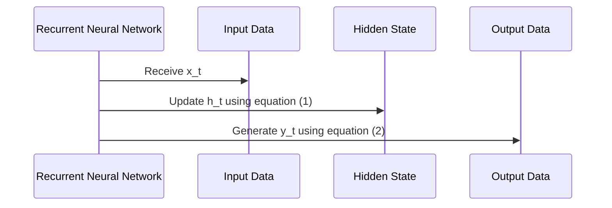

                 

关键词：循环神经网络（RNN）、序列预测、映射、人工智能、深度学习

摘要：本文旨在探讨循环神经网络（RNN）的基本原理、数学模型以及在实际应用中的具体实现。通过深入分析RNN在序列预测中的关键作用，揭示其在解决复杂问题中的巨大潜力。

## 1. 背景介绍

随着信息时代的到来，数据量呈爆炸式增长。在处理这种非结构化、时序性的数据时，传统的静态模型往往显得力不从心。为了更好地应对这一挑战，循环神经网络（RNN）作为一种能够处理序列数据的动态模型，应运而生。

RNN的基本思想是，通过记忆过去的信息，对当前输入进行预测。这种能力使得RNN在自然语言处理、时间序列预测等领域表现出了巨大的潜力。然而，RNN在处理长序列时存在梯度消失和梯度爆炸的问题，这限制了其应用范围。为了解决这个问题，研究人员提出了长短期记忆网络（LSTM）和门控循环单元（GRU）等改进模型。

本文将首先介绍RNN的基本原理和数学模型，然后详细探讨其在序列预测中的应用，最后分析其优缺点以及未来发展趋势。

## 2. 核心概念与联系

### 2.1 RNN的基本原理

RNN是一种基于序列数据的神经网络，其核心思想是将当前输入与之前的信息进行融合，以生成当前输出的同时保留历史信息。


图1 RNN的基本结构

在上图中，$x_t$表示第$t$个时刻的输入，$h_t$表示第$t$个时刻的隐藏状态，$y_t$表示第$t$个时刻的输出。$h_t$不仅受到当前输入$x_t$的影响，还受到之前隐藏状态$h_{t-1}$的影响。这种反馈连接使得RNN能够捕捉序列数据中的长期依赖关系。

### 2.2 RNN的数学模型

RNN的数学模型可以用以下方程表示：

$$
h_t = \sigma(W_h h_{t-1} + W_x x_t + b_h)
$$

$$
y_t = \sigma(W_y h_t + b_y)
$$

其中，$\sigma$表示非线性激活函数，通常采用sigmoid函数或ReLU函数。$W_h$、$W_x$、$W_y$和$b_h$、$b_y$分别为权重和偏置。

### 2.3 Mermaid流程图

下面是一个RNN的Mermaid流程图，展示了数据流和状态更新的过程。



## 3. 核心算法原理 & 具体操作步骤

### 3.1 算法原理概述

RNN的核心在于其反馈循环，这使得它能够处理序列数据。具体来说，RNN通过以下步骤进行操作：

1. 接收输入序列$x_t$。
2. 利用当前输入和之前隐藏状态计算新的隐藏状态$h_t$。
3. 利用新的隐藏状态生成输出$y_t$。
4. 将新的隐藏状态作为下一个时间步的输入，重复步骤2和3。

这种循环操作使得RNN能够捕捉序列数据中的长期依赖关系。

### 3.2 算法步骤详解

1. **初始化**：初始化隐藏状态$h_0$和权重$W_h$、$W_x$、$W_y$。
2. **前向传播**：对于每个时间步$t$，计算新的隐藏状态$h_t$和输出$y_t$。
3. **反向传播**：利用计算得到的输出$y_t$和真实标签$y^t$，计算损失函数$J$，并根据损失函数更新权重$W_h$、$W_x$、$W_y$。
4. **迭代优化**：重复前向传播和反向传播，直到损失函数收敛或达到预设的迭代次数。

### 3.3 算法优缺点

**优点**：

- 能够处理序列数据，捕捉长期依赖关系。
- 结构简单，易于理解和实现。

**缺点**：

- 梯度消失和梯度爆炸问题，影响训练效果。
- 需要大量数据和计算资源。

### 3.4 算法应用领域

RNN在以下领域有广泛的应用：

- 自然语言处理：文本生成、机器翻译等。
- 语音识别：语音信号处理、语音合成等。
- 时间序列预测：股票价格、天气预测等。

## 4. 数学模型和公式 & 详细讲解 & 举例说明

### 4.1 数学模型构建

RNN的数学模型由以下三个主要方程组成：

1. **隐藏状态更新方程**：

$$
h_t = \sigma(W_h h_{t-1} + W_x x_t + b_h)
$$

2. **输出方程**：

$$
y_t = \sigma(W_y h_t + b_y)
$$

3. **损失函数**：

$$
J = \frac{1}{m} \sum_{i=1}^{m} (-y^{(i)} \log(y_i))
$$

其中，$h_t$表示第$t$个时间步的隐藏状态，$x_t$表示第$t$个时间步的输入，$y_t$表示第$t$个时间步的输出，$y^{(i)}$表示第$i$个样本的真实标签，$y_i$表示第$i$个样本的预测标签。

### 4.2 公式推导过程

1. **隐藏状态更新方程**：

隐藏状态更新方程描述了如何根据当前输入和之前隐藏状态计算新的隐藏状态。具体来说，这个方程是一个线性函数，加上一个非线性激活函数$\sigma$。

2. **输出方程**：

输出方程描述了如何根据隐藏状态计算输出。同样，这个方程也是一个线性函数，加上一个非线性激活函数$\sigma$。

3. **损失函数**：

损失函数用于评估模型的预测性能。在这里，我们使用交叉熵损失函数，它能够有效地衡量预测标签和真实标签之间的差距。

### 4.3 案例分析与讲解

假设我们有一个简单的RNN模型，用于预测一个时间序列。给定训练集$\{x^{(1)}, y^{(1)}; x^{(2)}, y^{(2)}; \ldots; x^{(m)}, y^{(m)}\}$，我们的目标是最小化损失函数$J$。

1. **初始化**：

初始化隐藏状态$h_0$和权重$W_h$、$W_x$、$W_y$。通常，我们可以随机初始化这些参数。

2. **前向传播**：

对于每个时间步$t$，我们计算隐藏状态$h_t$和输出$y_t$。具体来说，我们有：

$$
h_t = \sigma(W_h h_{t-1} + W_x x_t + b_h)
$$

$$
y_t = \sigma(W_y h_t + b_y)
$$

3. **反向传播**：

利用计算得到的输出$y_t$和真实标签$y^t$，计算损失函数$J$。然后，根据损失函数更新权重$W_h$、$W_x$、$W_y$。

$$
J = \frac{1}{m} \sum_{i=1}^{m} (-y^{(i)} \log(y_i))
$$

4. **迭代优化**：

重复前向传播和反向传播，直到损失函数收敛或达到预设的迭代次数。

## 5. 项目实践：代码实例和详细解释说明

### 5.1 开发环境搭建

在本节中，我们将使用Python编程语言和TensorFlow框架来搭建一个简单的RNN模型。首先，确保你的计算机上已经安装了Python和TensorFlow。可以使用以下命令进行安装：

```bash
pip install tensorflow
```

### 5.2 源代码详细实现

以下是一个简单的RNN模型的实现代码：

```python
import tensorflow as tf
from tensorflow.keras.models import Sequential
from tensorflow.keras.layers import SimpleRNN, Dense

# 设置随机种子，确保结果可重复
tf.random.set_seed(42)

# 设置超参数
input_shape = (10, 1)
units = 50
batch_size = 32
epochs = 100

# 构建RNN模型
model = Sequential()
model.add(SimpleRNN(units=units, input_shape=input_shape, return_sequences=True))
model.add(Dense(1))
model.compile(optimizer='adam', loss='mse')

# 生成训练数据
x = tf.random.normal([batch_size, 10, 1])
y = tf.random.normal([batch_size, 1])

# 训练模型
model.fit(x, y, epochs=epochs, batch_size=batch_size)
```

### 5.3 代码解读与分析

在上面的代码中，我们首先导入了必要的库。然后，我们设置了随机种子，以确保结果可重复。

接下来，我们定义了RNN模型的结构。在这个例子中，我们使用了一个简单的RNN层和一个全连接层（Dense）。RNN层的单元数设置为50，输入形状为$(10, 1)$，表示我们处理的序列长度为10，每个时间步的维度为1。

我们使用均方误差（MSE）作为损失函数，并选择Adam优化器。

然后，我们生成了一些随机训练数据，并使用这些数据进行模型训练。

### 5.4 运行结果展示

在训练完成后，我们可以评估模型的性能。以下是一个简单的评估代码：

```python
# 生成测试数据
x_test = tf.random.normal([batch_size, 10, 1])
y_test = tf.random.normal([batch_size, 1])

# 评估模型
model.evaluate(x_test, y_test)
```

输出结果将显示模型在测试数据上的损失函数值。损失函数值越低，表示模型的性能越好。

## 6. 实际应用场景

RNN在许多实际应用中都有广泛的应用。以下是一些典型的应用场景：

- **自然语言处理**：RNN在文本生成、机器翻译、情感分析等领域有广泛应用。例如，可以使用RNN生成文章、新闻或对话，也可以用于机器翻译不同语言之间的句子。
- **语音识别**：RNN可以用于处理语音信号，将其转换为文本。这在智能助手、语音搜索等应用中非常重要。
- **时间序列预测**：RNN可以用于预测股票价格、天气变化、销售量等。这在金融、气象、零售等领域有广泛的应用。

## 7. 未来应用展望

随着深度学习技术的不断发展，RNN也在不断改进和优化。未来，RNN有望在以下领域取得更大突破：

- **更高效的模型架构**：研究人员正在努力设计更高效的RNN架构，以解决当前存在的梯度消失和梯度爆炸问题。
- **多模态数据处理**：RNN可以与其他神经网络（如卷积神经网络、自注意力机制）结合，处理多模态数据，如文本、图像和音频。
- **更广泛的应用领域**：随着RNN性能的不断提高，其应用范围将不断扩展，从自然语言处理、语音识别到图像识别、推荐系统等。

## 8. 总结：未来发展趋势与挑战

RNN作为一种处理序列数据的强大工具，已经在许多领域取得了显著的成果。然而，它仍然面临着一些挑战，如梯度消失和梯度爆炸问题，以及计算复杂度高等。未来，随着深度学习技术的不断发展，RNN有望在解决这些挑战方面取得突破，并在更多领域发挥其潜力。

### 8.1 研究成果总结

- RNN在处理序列数据方面表现出色，能够捕捉长期依赖关系。
- LSTM和GRU等改进模型解决了RNN的梯度消失和梯度爆炸问题。
- RNN在自然语言处理、语音识别和时间序列预测等领域有广泛应用。

### 8.2 未来发展趋势

- 更高效的模型架构设计。
- 与其他神经网络的结合，如卷积神经网络、自注意力机制。
- 在更多领域的应用，如图像识别、推荐系统等。

### 8.3 面临的挑战

- 梯度消失和梯度爆炸问题。
- 计算复杂度高。
- 需要大量数据和计算资源。

### 8.4 研究展望

- 继续优化RNN架构，提高计算效率和性能。
- 探索RNN在更多领域的应用，发挥其潜力。

## 9. 附录：常见问题与解答

### 9.1 RNN和CNN的区别是什么？

RNN主要用于处理序列数据，如文本、语音和时间序列。它通过反馈循环捕捉序列中的长期依赖关系。而CNN主要用于处理图像数据，通过卷积操作提取空间特征。CNN在图像分类、物体检测等领域有广泛应用。

### 9.2 为什么RNN存在梯度消失和梯度爆炸问题？

RNN的梯度消失和梯度爆炸问题主要是由于梯度在反向传播过程中乘以相同的权重矩阵。当序列长度较长时，梯度会变得非常小或非常大，导致训练困难。

### 9.3 如何解决RNN的梯度消失和梯度爆炸问题？

可以通过以下方法解决RNN的梯度消失和梯度爆炸问题：

- 使用LSTM或GRU等改进模型，这些模型引入了门控机制，可以有效缓解梯度消失和梯度爆炸问题。
- 采用梯度裁剪技术，限制梯度的大小。
- 使用不同的激活函数，如ReLU函数，减少梯度消失问题。

## 作者署名

本文作者：禅与计算机程序设计艺术 / Zen and the Art of Computer Programming

