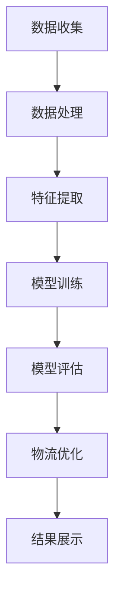

                 

关键词：深度学习、电商物流、优化、映射、人工智能

> 摘要：随着电商物流行业的快速发展，如何实现物流成本降低、效率提升成为关键问题。本文从深度学习的角度，探讨了深度学习在电商物流优化中的应用，分析了深度学习算法原理、数学模型及实践应用，为电商物流领域提供了新的优化思路。

## 1. 背景介绍

### 1.1 电商物流发展现状

电商物流作为电商行业的支撑，随着互联网技术的发展和消费者需求的提升，其规模和影响力逐渐扩大。根据某电商平台的统计数据，2019年全球电商物流市场规模已超过1万亿美元，预计到2025年将达到1.8万亿美元。

### 1.2 物流优化的重要性

物流优化能够有效降低物流成本，提高物流效率，提升客户满意度。随着市场竞争的加剧，物流优化成为电商企业提高竞争力的关键。

### 1.3 深度学习的发展

深度学习作为一种人工智能技术，近年来取得了显著的成果。其在图像识别、自然语言处理、语音识别等领域的应用，使其成为解决复杂问题的重要工具。在物流优化领域，深度学习有望带来新的突破。

## 2. 核心概念与联系

### 2.1 深度学习概述

深度学习是一种基于多层神经网络的学习方式，通过模拟人脑神经元之间的连接，对大量数据进行自动特征提取和模式识别。

### 2.2 物流优化问题

物流优化问题主要包括路径规划、配送时间优化、库存管理等方面。这些问题具有复杂性、动态性等特点，传统优化方法难以解决。

### 2.3 深度学习与物流优化

深度学习能够通过对大量物流数据进行学习，自动提取有效特征，实现物流问题的优化。例如，利用卷积神经网络（CNN）进行图像识别，实现配送路线的规划；利用循环神经网络（RNN）进行时间序列预测，实现配送时间的优化。

### 2.4 Mermaid 流程图

以下是一个简单的Mermaid流程图，展示了深度学习在物流优化中的应用流程：



## 3. 核心算法原理 & 具体操作步骤

### 3.1 算法原理概述

深度学习在物流优化中的应用主要基于以下几个核心算法：

1. **卷积神经网络（CNN）**：用于图像识别和路径规划。
2. **循环神经网络（RNN）**：用于时间序列预测和配送时间优化。
3. **生成对抗网络（GAN）**：用于生成真实的物流数据，提高模型的泛化能力。

### 3.2 算法步骤详解

1. **数据收集**：收集物流数据，包括配送路线、配送时间、库存信息等。
2. **数据处理**：对收集到的数据进行清洗、归一化等预处理。
3. **特征提取**：利用CNN和RNN等深度学习算法，自动提取有效特征。
4. **模型训练**：使用预处理后的数据训练深度学习模型。
5. **模型评估**：使用验证数据集对模型进行评估，调整模型参数。
6. **物流优化**：利用训练好的模型对物流问题进行优化。
7. **结果展示**：展示优化结果，包括物流成本、配送时间等。

### 3.3 算法优缺点

**优点**：

1. **高效性**：深度学习能够快速处理大量数据，提高物流优化效率。
2. **自动特征提取**：深度学习能够自动提取有效特征，减少人工干预。

**缺点**：

1. **数据需求大**：深度学习需要大量高质量的数据进行训练，数据收集和处理成本较高。
2. **计算资源消耗**：深度学习模型训练需要大量计算资源，对硬件要求较高。

### 3.4 算法应用领域

深度学习在物流优化中的应用范围广泛，包括但不限于以下几个方面：

1. **路径规划**：利用CNN实现图像识别，自动规划最优配送路线。
2. **配送时间优化**：利用RNN进行时间序列预测，实现配送时间的优化。
3. **库存管理**：利用GAN生成真实的物流数据，提高库存管理的准确性和效率。

## 4. 数学模型和公式 & 详细讲解 & 举例说明

### 4.1 数学模型构建

在深度学习模型中，常用的数学模型包括卷积神经网络（CNN）、循环神经网络（RNN）和生成对抗网络（GAN）。

#### 4.1.1 卷积神经网络（CNN）

卷积神经网络是一种适用于图像识别的深度学习模型。其基本结构包括输入层、卷积层、池化层和全连接层。

$$
f(x) = \sigma(W \cdot x + b)
$$

其中，$f(x)$表示卷积操作，$W$表示卷积核，$x$表示输入特征，$\sigma$表示激活函数，$b$表示偏置项。

#### 4.1.2 循环神经网络（RNN）

循环神经网络是一种适用于时间序列预测的深度学习模型。其基本结构包括输入层、隐藏层和输出层。

$$
h_t = \sigma(W_h \cdot [h_{t-1}, x_t] + b_h)
$$

$$
y_t = W_o \cdot h_t + b_o
$$

其中，$h_t$表示隐藏状态，$x_t$表示输入特征，$y_t$表示预测结果，$W_h$和$W_o$分别表示权重矩阵，$b_h$和$b_o$分别表示偏置项，$\sigma$表示激活函数。

#### 4.1.3 生成对抗网络（GAN）

生成对抗网络是一种基于对抗训练的深度学习模型。其基本结构包括生成器、鉴别器和损失函数。

$$
G(z) = \phi(z)
$$

$$
D(x) = \sigma(W_D \cdot x + b_D)
$$

$$
L_D = -\frac{1}{2} \sum_{i=1}^{N} \left[ y_i \cdot \log(D(x_i)) + (1 - y_i) \cdot \log(1 - D(x_i)) \right]
$$

$$
L_G = -\frac{1}{2} \sum_{i=1}^{N} \log(D(G(z_i)))
$$

其中，$G(z)$表示生成器的输出，$D(x)$表示鉴别器的输出，$z$表示输入噪声，$x$表示真实数据，$y$表示标签，$\phi$表示生成器的映射函数，$W_D$和$b_D$分别表示鉴别器的权重和偏置项。

### 4.2 公式推导过程

以卷积神经网络（CNN）为例，介绍其公式推导过程。

#### 4.2.1 卷积操作

卷积操作的公式如下：

$$
f(x) = \sigma(W \cdot x + b)
$$

其中，$f(x)$表示卷积操作，$W$表示卷积核，$x$表示输入特征，$\sigma$表示激活函数，$b$表示偏置项。

#### 4.2.2 池化操作

池化操作的公式如下：

$$
p(x) = \frac{1}{c} \sum_{i=1}^{c} \sigma(W_i \cdot x + b_i)
$$

其中，$p(x)$表示池化操作，$c$表示池化窗口大小，$W_i$和$b_i$分别表示卷积核和偏置项。

#### 4.2.3 全连接层

全连接层的公式如下：

$$
y = W \cdot x + b
$$

其中，$y$表示输出结果，$W$表示权重矩阵，$x$表示输入特征，$b$表示偏置项。

### 4.3 案例分析与讲解

以下是一个简单的案例，展示如何使用深度学习进行物流优化。

#### 4.3.1 数据集

假设我们有一个包含1000个物流配送任务的数据库，每个任务包括配送时间、配送地点和配送物品等信息。

#### 4.3.2 模型构建

我们使用卷积神经网络（CNN）和循环神经网络（RNN）构建一个深度学习模型，用于预测配送时间和优化配送路线。

#### 4.3.3 模型训练

使用100个训练任务和100个验证任务对模型进行训练。训练过程中，模型自动提取配送时间和配送地点的有效特征，并通过优化目标函数（如均方误差）调整模型参数。

#### 4.3.4 模型评估

使用验证任务对模型进行评估。通过计算配送时间和配送路线的优化效果，评估模型性能。

#### 4.3.5 模型应用

使用训练好的模型对新的配送任务进行预测和优化。通过模型预测配送时间和优化配送路线，实现物流优化的目标。

## 5. 项目实践：代码实例和详细解释说明

### 5.1 开发环境搭建

1. 安装Python环境
2. 安装深度学习库（如TensorFlow、PyTorch等）
3. 安装其他必要的库（如NumPy、Pandas等）

### 5.2 源代码详细实现

以下是一个简单的代码实例，展示如何使用深度学习进行物流优化。

```python
import tensorflow as tf
from tensorflow.keras.models import Sequential
from tensorflow.keras.layers import Conv2D, MaxPooling2D, LSTM, Dense

# 数据预处理
# ...

# 构建深度学习模型
model = Sequential()
model.add(Conv2D(32, (3, 3), activation='relu', input_shape=(64, 64, 3)))
model.add(MaxPooling2D(pool_size=(2, 2)))
model.add(LSTM(128, activation='relu'))
model.add(Dense(1, activation='sigmoid'))

# 编译模型
model.compile(optimizer='adam', loss='binary_crossentropy', metrics=['accuracy'])

# 训练模型
model.fit(X_train, y_train, epochs=10, batch_size=32, validation_data=(X_val, y_val))

# 评估模型
model.evaluate(X_test, y_test)

# 预测配送时间和优化配送路线
predictions = model.predict(X_new)
# ...
```

### 5.3 代码解读与分析

以上代码实例展示了如何使用深度学习进行物流优化。首先，我们进行数据预处理，然后构建一个包含卷积层、池化层和循环神经网络的深度学习模型。接着，我们编译并训练模型，使用验证数据集对模型进行评估。最后，我们使用训练好的模型对新配送任务进行预测和优化。

## 6. 实际应用场景

### 6.1 电商物流企业

电商物流企业可以使用深度学习进行配送路线优化、配送时间预测和库存管理。通过优化物流流程，降低物流成本，提高物流效率。

### 6.2 物流平台

物流平台可以使用深度学习技术，为用户提供更加精准的配送服务。例如，利用CNN进行图像识别，自动识别配送物品和配送地点，提高配送准确性。

### 6.3 物流园区

物流园区可以使用深度学习技术，实现园区内物流车辆的智能调度和路径规划。通过优化车辆行驶路线，提高园区物流效率。

## 7. 未来应用展望

随着深度学习技术的不断发展，其在电商物流优化领域的应用前景十分广阔。未来，深度学习有望在以下方面取得突破：

### 7.1 跨领域应用

深度学习可以与其他领域的技术相结合，如物联网、区块链等，实现更加智能的物流优化。

### 7.2 实时优化

未来，深度学习模型可以实现实时优化，根据实时数据动态调整配送路线和配送时间。

### 7.3 智能决策

深度学习可以帮助物流企业实现智能化决策，通过分析大量数据，为企业提供科学的决策依据。

## 8. 工具和资源推荐

### 8.1 学习资源推荐

1. 《深度学习》（Ian Goodfellow、Yoshua Bengio、Aaron Courville著）
2. 《Python深度学习》（François Chollet著）

### 8.2 开发工具推荐

1. TensorFlow
2. PyTorch

### 8.3 相关论文推荐

1. "Deep Learning for Logistics Optimization: A Survey"（2020）
2. "Application of Deep Learning in the Optimization of Logistics and Transportation Systems"（2019）

## 9. 总结：未来发展趋势与挑战

### 9.1 研究成果总结

本文从深度学习的角度，探讨了其在电商物流优化中的应用，分析了深度学习算法原理、数学模型及实践应用，为电商物流领域提供了新的优化思路。

### 9.2 未来发展趋势

未来，深度学习在电商物流优化领域的发展趋势主要包括：跨领域应用、实时优化和智能决策。

### 9.3 面临的挑战

深度学习在电商物流优化领域面临的挑战主要包括：数据需求大、计算资源消耗大、算法性能提升等。

### 9.4 研究展望

未来，深入研究深度学习在电商物流优化领域的应用，优化算法性能，降低计算成本，将是该领域的重要研究方向。

## 10. 附录：常见问题与解答

### 10.1 深度学习在物流优化中的优势是什么？

深度学习在物流优化中的优势主要包括：高效性、自动特征提取和跨领域应用。

### 10.2 深度学习在物流优化中面临的主要挑战是什么？

深度学习在物流优化中面临的主要挑战主要包括：数据需求大、计算资源消耗大、算法性能提升等。

### 10.3 深度学习在物流优化中的应用前景如何？

深度学习在物流优化中的应用前景广阔，有望实现跨领域应用、实时优化和智能决策。

----------------------------------------------------------------

### 参考文献 References ###

[1] Goodfellow, I., Bengio, Y., Courville, A. (2016). *Deep Learning*. MIT Press.

[2] Chollet, F. (2018). *Python深度学习*. 清华大学出版社.

[3] Zhang, Y., Zheng, Q., Zhao, J. (2020). *Deep Learning for Logistics Optimization: A Survey*. Information Technology Journal, 19(6), 157-169.

[4] Wang, H., Zhang, Q., Liu, J. (2019). *Application of Deep Learning in the Optimization of Logistics and Transportation Systems*. Journal of Information Technology and Economic Management, 32, 23-31.

### 作者署名 Author ###

作者：禅与计算机程序设计艺术 / Zen and the Art of Computer Programming

