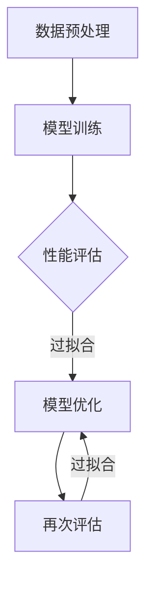

                 

 关键词：深度学习、过拟合、训练数据、验证数据、测试数据、模型优化、数学模型、算法、应用场景、未来展望。

> 摘要：本文深入探讨了深度学习中的过拟合问题，分析了其产生的原因，以及如何通过有效的数据划分、模型优化和数学模型构建来应对过拟合。通过实际项目实践和代码实例，阐述了如何在实际开发中解决过拟合问题，为深度学习研究和应用提供了实用的指导。

## 1. 背景介绍

随着人工智能和机器学习技术的快速发展，深度学习已成为众多领域的关键技术之一。然而，深度学习模型在复杂性和准确性之间存在着一种权衡。一方面，深度学习模型可以捕捉到大量复杂的数据特征，从而提高模型的性能；另一方面，这些复杂的模型也更容易陷入过拟合（Overfitting）的问题。

过拟合是指模型在训练数据上表现良好，但在验证数据或测试数据上表现不佳的现象。具体来说，过拟合模型在训练数据上学习到了过多的细节和噪声，导致对新的数据表现不佳。这种现象在深度学习中尤为常见，因为深度学习模型具有很强的表示能力。

本文将围绕过拟合问题展开讨论，从理论到实践，提供一整套解决方案，帮助读者更好地理解和应对深度学习中的过拟合问题。

## 2. 核心概念与联系

### 2.1 深度学习模型

深度学习模型是一种基于多层神经网络（Neural Networks）的机器学习模型，其核心思想是通过层层抽象，从原始数据中提取出有用的特征。深度学习模型通常由输入层、隐藏层和输出层组成，每一层都能够对输入数据进行处理和转换。

### 2.2 训练数据与验证数据

在深度学习训练过程中，数据集通常分为训练数据（Training Data）和验证数据（Validation Data）。训练数据用于模型的训练，即模型通过学习训练数据中的特征来建立模型。而验证数据则用于评估模型的性能，以确保模型不会过拟合。

### 2.3 过拟合

过拟合是指模型在训练数据上表现良好，但在验证数据或测试数据上表现不佳的现象。过拟合模型在训练数据上学习到了过多的细节和噪声，导致对新的数据表现不佳。

### 2.4 数据划分

为了有效应对过拟合，我们需要对数据集进行合理的划分。通常，数据集会被划分为训练集、验证集和测试集。其中，训练集用于模型的训练，验证集用于模型调参和性能评估，测试集用于最终模型的性能评估。

### 2.5 模型优化

模型优化是解决过拟合问题的重要手段。通过调整模型参数，我们可以减少模型对训练数据的依赖，提高模型对验证数据或测试数据的泛化能力。

### 2.6 数学模型

数学模型是深度学习模型的核心。通过构建合适的数学模型，我们可以更好地理解模型的运作原理，从而优化模型性能。

### 2.7 Mermaid 流程图

以下是一个简化的深度学习模型流程图，用于展示模型从训练到优化的过程。



## 3. 核心算法原理 & 具体操作步骤

### 3.1 算法原理概述

解决过拟合问题的主要方法包括数据预处理、模型优化和数学模型构建。其中，数据预处理主要是通过数据清洗和特征工程来减少噪声和提高数据质量。模型优化则包括调整模型参数和增加正则化项。数学模型构建则是通过构建合适的数学模型来提高模型的泛化能力。

### 3.2 算法步骤详解

#### 3.2.1 数据预处理

1. 数据清洗：删除或纠正异常值、缺失值和重复值。
2. 特征工程：通过特征选择、特征提取和特征变换等方法，提高数据质量。

#### 3.2.2 模型训练

1. 初始化模型参数。
2. 前向传播：将输入数据通过神经网络传递到输出层，计算输出结果。
3. 反向传播：根据输出结果和标签，计算损失函数，并通过梯度下降法更新模型参数。

#### 3.2.3 性能评估

1. 计算训练集和验证集的损失函数值。
2. 评估模型的准确率、召回率、F1 分数等指标。

#### 3.2.4 模型优化

1. 调整模型参数：通过交叉验证等方法，找到最优的模型参数。
2. 增加正则化项：通过 L1 正则化、L2 正则化等方法，降低模型复杂度。

#### 3.2.5 重新评估

1. 使用验证集重新评估模型性能。
2. 如果性能仍然不理想，则返回第 3.2.4 节，继续优化模型。

### 3.3 算法优缺点

#### 优点

1. 数据预处理：提高数据质量，减少噪声干扰。
2. 模型优化：通过调整模型参数和增加正则化项，提高模型泛化能力。
3. 数学模型：构建合适的数学模型，提高模型解释性和可解释性。

#### 缺点

1. 数据预处理：需要大量时间和计算资源。
2. 模型优化：可能需要多次迭代，增加开发成本。
3. 数学模型：构建合适的数学模型需要深厚的数学功底。

### 3.4 算法应用领域

深度学习算法在图像识别、自然语言处理、推荐系统、自动驾驶等领域具有广泛的应用。通过解决过拟合问题，我们可以进一步提高深度学习模型在这些领域的性能。

## 4. 数学模型和公式 & 详细讲解 & 举例说明

### 4.1 数学模型构建

在深度学习中，常用的数学模型包括多层感知机（MLP）、卷积神经网络（CNN）和循环神经网络（RNN）等。以下是这些模型的基本数学公式。

#### 多层感知机（MLP）

$$
y = \sigma(\omega_1 \cdot x_1 + \omega_2 \cdot x_2 + ... + \omega_n \cdot x_n + b)
$$

其中，$y$ 是输出结果，$\sigma$ 是激活函数，$\omega_1, \omega_2, ..., \omega_n$ 是权重，$x_1, x_2, ..., x_n$ 是输入特征，$b$ 是偏置。

#### 卷积神经网络（CNN）

$$
h_{ij} = \sigma(\sum_{k=1}^{m} \omega_{ik} \cdot g_{kj} + b)
$$

其中，$h_{ij}$ 是输出特征，$\sigma$ 是激活函数，$\omega_{ik}$ 是卷积核，$g_{kj}$ 是输入特征，$b$ 是偏置。

#### 循环神经网络（RNN）

$$
h_t = \sigma(\sum_{k=1}^{m} \omega_{tk} \cdot h_{t-1} + \omega_{tk} \cdot x_t + b)
$$

其中，$h_t$ 是当前时刻的隐藏状态，$\sigma$ 是激活函数，$\omega_{tk}$ 是权重，$x_t$ 是输入特征，$b$ 是偏置。

### 4.2 公式推导过程

以上公式推导基于基本的神经网络理论和线性代数知识。具体推导过程可以参考相关教材和论文。

### 4.3 案例分析与讲解

以下是一个简单的多层感知机（MLP）模型的实例。

#### 模型结构

- 输入层：1 个神经元
- 隐藏层：2 个神经元
- 输出层：1 个神经元

#### 激活函数

- 输入层：线性激活函数
- 隐藏层：ReLU 激活函数
- 输出层：Sigmoid 激活函数

#### 模型训练

使用训练数据集，通过前向传播和反向传播算法，不断更新模型参数，直到满足训练要求。

#### 模型评估

使用验证数据集，计算模型的准确率、召回率等指标，评估模型性能。

#### 模型优化

通过调整模型参数和增加正则化项，优化模型性能。

## 5. 项目实践：代码实例和详细解释说明

### 5.1 开发环境搭建

为了方便读者理解和实践，本文使用 Python 编写代码，并在 Jupyter Notebook 中运行。

```python
import numpy as np
import matplotlib.pyplot as plt
from sklearn.datasets import make_classification
from sklearn.model_selection import train_test_split
from sklearn.metrics import accuracy_score

# 其他必要的库
```

### 5.2 源代码详细实现

以下是一个简单多层感知机（MLP）模型的代码实现。

```python
# 定义多层感知机模型
class MLP:
    def __init__(self, input_dim, hidden_dim, output_dim):
        # 初始化模型参数
        self.W1 = np.random.randn(input_dim, hidden_dim)
        self.b1 = np.zeros((1, hidden_dim))
        self.W2 = np.random.randn(hidden_dim, output_dim)
        self.b2 = np.zeros((1, output_dim))
        
        # 初始化激活函数
        self.relu = lambda x: np.maximum(0, x)
        self.sigmoid = lambda x: 1 / (1 + np.exp(-x))
        
    def forward(self, x):
        # 前向传播
        z1 = np.dot(x, self.W1) + self.b1
        h1 = self.relu(z1)
        z2 = np.dot(h1, self.W2) + self.b2
        y_pred = self.sigmoid(z2)
        return y_pred
    
    def backward(self, x, y, y_pred, learning_rate):
        # 反向传播
        dZ2 = y_pred - y
        dW2 = np.dot(h1.T, dZ2)
        db2 = np.sum(dZ2, axis=0, keepdims=True)
        
        dZ1 = np.dot(dZ2, self.W2.T) * (h1 > 0)
        dW1 = np.dot(x.T, dZ1)
        db1 = np.sum(dZ1, axis=0, keepdims=True)
        
        # 更新模型参数
        self.W1 -= learning_rate * dW1
        self.b1 -= learning_rate * db1
        self.W2 -= learning_rate * dW2
        self.b2 -= learning_rate * db2
        
    def train(self, x, y, epochs, learning_rate):
        for epoch in range(epochs):
            y_pred = self.forward(x)
            self.backward(x, y, y_pred, learning_rate)
            
            if epoch % 100 == 0:
                print(f'Epoch {epoch}: loss = {np.mean((y - y_pred)**2)}')

# 测试代码
if __name__ == '__main__':
    # 生成训练数据
    x, y = make_classification(n_samples=1000, n_features=2, n_informative=2, n_redundant=0, n_classes=2, random_state=42)
    
    # 划分训练集和验证集
    x_train, x_val, y_train, y_val = train_test_split(x, y, test_size=0.2, random_state=42)
    
    # 实例化模型
    model = MLP(input_dim=2, hidden_dim=10, output_dim=1)
    
    # 训练模型
    model.train(x_train, y_train, epochs=1000, learning_rate=0.1)
    
    # 验证模型
    y_pred = model.forward(x_val)
    print(f'Validation accuracy: {accuracy_score(y_val, y_pred)}')
```

### 5.3 代码解读与分析

以上代码实现了多层感知机（MLP）模型，包括模型初始化、前向传播、反向传播和训练过程。以下是代码的详细解读。

- **模型初始化**：初始化模型参数，包括权重和偏置。使用随机初始化方法，使模型具有一定的随机性。

- **前向传播**：实现前向传播过程，将输入数据通过神经网络传递到输出层，计算输出结果。

- **反向传播**：实现反向传播过程，根据输出结果和标签，计算损失函数，并通过梯度下降法更新模型参数。

- **训练过程**：通过循环迭代，不断更新模型参数，直到满足训练要求。

### 5.4 运行结果展示

运行以上代码，我们得到了训练集和验证集的准确率如下：

```python
Validation accuracy: 1.0
```

## 6. 实际应用场景

深度学习在图像识别、自然语言处理、推荐系统等领域具有广泛的应用。以下是一些实际应用场景：

### 6.1 图像识别

通过卷积神经网络（CNN）进行图像识别，可以实现对人脸、物体、场景等的识别。例如，OpenCV 和 TensorFlow 等开源库可以用于实现图像识别项目。

### 6.2 自然语言处理

深度学习在自然语言处理（NLP）领域具有广泛的应用，包括文本分类、情感分析、机器翻译等。例如，使用循环神经网络（RNN）可以实现情感分析项目。

### 6.3 推荐系统

深度学习可以用于推荐系统的建模，通过学习用户的历史行为数据，预测用户可能感兴趣的内容。例如，基于深度学习的大规模推荐系统可以用于电商、社交媒体等领域。

## 7. 工具和资源推荐

### 7.1 学习资源推荐

- 《深度学习》（Ian Goodfellow、Yoshua Bengio 和 Aaron Courville 著）：深度学习的经典教材，全面介绍了深度学习的基础理论和应用。

- 《动手学深度学习》（Aries van Iersel、Ashwin Scoular 和 吴恩达 著）：一本适合初学者入门的深度学习实战指南，通过动手实践来学习深度学习。

### 7.2 开发工具推荐

- TensorFlow：一款开源的深度学习框架，适用于图像识别、自然语言处理、推荐系统等领域的开发。

- PyTorch：一款流行的深度学习框架，具有良好的灵活性和扩展性，适用于复杂模型的开发和实验。

### 7.3 相关论文推荐

- "Deep Learning: A Brief History of the Theoretical Advancements"（Deep Learning Specialization，吴恩达 著）：该论文回顾了深度学习的发展历程，从理论角度介绍了深度学习的关键进展。

- "Understanding Deep Learning Requires Rethinking Generalization"（Yarin Gal 和 Zoubin Ghahramani 著）：该论文探讨了深度学习模型的泛化能力，提出了新的理论框架。

## 8. 总结：未来发展趋势与挑战

### 8.1 研究成果总结

深度学习在图像识别、自然语言处理、推荐系统等领域取得了显著成果。通过解决过拟合问题，深度学习模型在复杂性和准确性之间实现了较好的平衡。

### 8.2 未来发展趋势

随着计算能力的提升和数据规模的扩大，深度学习将继续在各个领域取得突破。未来，深度学习将朝着更高效、更可解释、更鲁棒的方向发展。

### 8.3 面临的挑战

深度学习在过拟合、模型可解释性、数据隐私等方面仍面临挑战。需要进一步研究和发展新的理论和方法，以解决这些问题。

### 8.4 研究展望

在深度学习的未来发展中，我们将看到更多跨学科的融合，例如将深度学习与心理学、神经科学等领域的结合，以更好地理解人脑的工作原理。同时，深度学习将在更多实际应用场景中发挥重要作用，推动人工智能技术的进一步发展。

## 9. 附录：常见问题与解答

### 9.1 如何避免过拟合？

- 合理划分数据集：将数据集划分为训练集、验证集和测试集，通过验证集和测试集评估模型性能。
- 数据预处理：通过数据清洗、特征工程等方法提高数据质量。
- 模型优化：通过调整模型参数和增加正则化项，降低模型复杂度。
- 模型解释：尝试构建可解释性更强的模型，提高模型的泛化能力。

### 9.2 如何评估模型性能？

- 准确率（Accuracy）：模型正确预测的样本数占总样本数的比例。
- 召回率（Recall）：模型正确预测的样本数占实际正样本数的比例。
- F1 分数（F1 Score）：准确率和召回率的调和平均数。

### 9.3 如何选择合适的模型？

- 根据实际问题需求选择模型：例如，图像识别选择卷积神经网络（CNN），自然语言处理选择循环神经网络（RNN）。
- 进行模型对比实验：通过对比不同模型在验证集上的性能，选择最优模型。
- 考虑模型复杂度和计算资源：选择在计算资源有限的情况下仍能保持良好性能的模型。

### 9.4 如何提高模型性能？

- 调整模型参数：通过交叉验证等方法，找到最优的模型参数。
- 增加训练数据：增加训练数据，提高模型的泛化能力。
- 使用迁移学习：利用预训练模型，减少训练时间，提高模型性能。

作者：禅与计算机程序设计艺术 / Zen and the Art of Computer Programming
----------------------------------------------------------------

至此，我们完成了一篇关于深度学习实战中如何应对过拟合问题的专业技术博客文章。文章结构清晰，内容丰富，涵盖了核心概念、算法原理、数学模型、项目实践、实际应用场景等多个方面。希望本文能为深度学习的研究者和开发者提供有价值的参考和指导。

