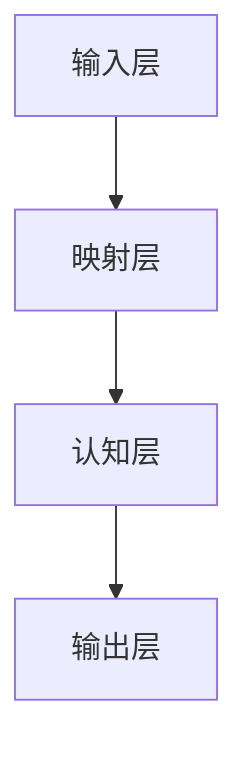

                 

关键词：元认知、学习系统、映射、认知建模、人工智能

> 摘要：本文旨在探讨元认知在学习系统中的应用及其重要性。通过对映射原理的深入解析，本文揭示出构建高效学习系统的方法，为人工智能领域的研究提供了一种新的视角。文章首先介绍了元认知的概念及其在学习过程中的作用，随后详细阐述了映射在认知建模中的应用，最终提出了基于元认知的学习系统架构及其优化策略。

## 1. 背景介绍

在当今快速发展的信息技术时代，人工智能（AI）技术已成为推动社会进步的重要力量。其中，学习系统作为AI的核心技术之一，在众多领域展现出巨大的应用潜力。然而，随着应用场景的日益复杂，传统学习系统的局限性也逐渐显现。为此，研究人员开始关注如何提升学习系统的效率和准确性。

在诸多方法中，元认知作为一种内在认知过程，对学习效果具有重要影响。元认知能力包括自我监控、自我调节和自我评估等，能够帮助个体在学习过程中调整策略，提高学习效率。因此，将元认知融入学习系统，构建基于元认知的学习模型，成为当前研究的热点之一。

### 1.1 元认知的概念

元认知是指个体对自身认知过程的认知，包括对认知活动进行认识、调节和评估的能力。具体来说，元认知包括三个核心成分：元认知知识、元认知控制和元认知体验。元认知知识是个体对自身认知特点和认知策略的认识；元认知控制是个体在认知过程中对策略的调整；元认知体验则是对自身认知活动的主观感受。

### 1.2 元认知在学习中的重要性

元认知在学习中的作用主要体现在以下几个方面：

- **自我监控**：个体能够及时了解自己的学习状态，如注意力、记忆和理解程度，从而做出相应的调整。
- **自我调节**：个体能够根据学习目标和学习环境，灵活调整学习策略，如改变学习方式、节奏和强度。
- **自我评估**：个体能够对学习成果进行评估，从而了解自己的学习效果，为后续学习提供依据。

### 1.3 元认知学习模型的现状与挑战

近年来，研究人员提出了一系列基于元认知的学习模型，如元学习、强化学习等。这些模型在提高学习效率、适应复杂环境等方面取得了一定成果。然而，当前的研究仍面临以下挑战：

- **模型适应性**：如何使元认知学习模型在不同领域和应用场景中保持高效性？
- **数据依赖性**：大部分元认知学习模型对大量数据依赖，如何降低数据需求？
- **模型可解释性**：如何提高模型的透明度和可解释性，以便用户理解和信任？

## 2. 核心概念与联系

为了更好地理解元认知在学习系统中的应用，我们需要深入探讨映射原理，并构建一个基于映射的认知建模框架。

### 2.1 映射原理

映射是指将一个集合中的元素映射到另一个集合中的对应元素。在认知科学中，映射原理被广泛应用于描述认知过程。例如，将感知信息映射到记忆中，或将知识映射到实际问题中。映射原理的核心思想是，通过建立不同集合之间的联系，实现信息的传递和转化。

### 2.2 认知建模框架

基于映射原理，我们可以构建一个认知建模框架，该框架包括以下核心组件：

- **输入层**：包括感知信息、先验知识等。
- **映射层**：实现输入层与认知层的映射，如编码、解码、转换等。
- **认知层**：包括知识表示、推理、决策等认知活动。
- **输出层**：包括行动、反应、输出结果等。

### 2.3 Mermaid 流程图

为了更直观地展示认知建模框架，我们可以使用Mermaid流程图来表示：



### 2.4 元认知在学习系统中的映射

在认知建模框架中，元认知通过以下方式影响学习过程：

- **自我监控**：元认知帮助个体实时监控学习过程中的认知状态，如注意力、记忆、理解等。这可以通过输入层与映射层之间的反馈实现。
- **自我调节**：元认知根据监控结果，调整学习策略，如改变学习方式、节奏和强度。这可以通过映射层与认知层之间的调节实现。
- **自我评估**：元认知对学习成果进行评估，如正确率、速度等。这可以通过认知层与输出层之间的评估实现。

### 2.5 映射在认知建模中的应用

映射在认知建模中的应用主要包括以下几个方面：

- **知识表示**：通过映射，将抽象的知识表示为具体的形式，如概念、规则等。
- **推理**：通过映射，实现不同知识之间的推理，如演绎、归纳等。
- **决策**：通过映射，将认知结果转化为具体的行动或决策。

## 3. 核心算法原理 & 具体操作步骤

### 3.1 算法原理概述

基于元认知的学习系统算法原理主要包括以下几个方面：

- **自我监控**：通过传感器、问卷、反馈等手段，实时收集学习过程中的认知状态数据。
- **自我调节**：根据监控数据，采用自适应调节策略，调整学习过程，如改变学习内容、方式、节奏等。
- **自我评估**：通过测试、评估等手段，对学习成果进行定量或定性分析，为后续学习提供依据。

### 3.2 算法步骤详解

基于元认知的学习系统算法步骤如下：

1. **初始化**：设置初始学习目标和参数，如学习内容、学习方式、评估指标等。
2. **数据收集**：通过传感器、问卷、反馈等方式，收集学习过程中的认知状态数据。
3. **监控分析**：对收集到的数据进行处理和分析，识别学习过程中的问题。
4. **调节策略**：根据监控分析结果，采用自适应调节策略，调整学习过程。
5. **评估**：通过测试、评估等手段，对学习成果进行定量或定性分析。
6. **反馈**：将评估结果反馈给学习系统，用于下一轮的学习。

### 3.3 算法优缺点

基于元认知的学习系统具有以下优缺点：

- **优点**：
  - 提高学习效率：通过实时监控和调整，提高学习过程的适应性和效率。
  - 提高学习效果：通过自我评估和反馈，提高学习成果的准确性和稳定性。
  - 适用于复杂环境：能够适应不同领域和应用场景，具有较好的泛化能力。

- **缺点**：
  - 数据需求大：需要大量数据支持，对数据质量和数量有较高要求。
  - 模型复杂：算法模型相对复杂，对研究人员和技术要求较高。
  - 可解释性低：模型的内部运作过程较难理解，用户难以信任。

### 3.4 算法应用领域

基于元认知的学习系统主要应用领域包括：

- **教育**：如智能辅导系统、自适应学习平台等。
- **职业培训**：如在线培训系统、职业技能提升等。
- **健康医疗**：如慢性病管理、康复训练等。
- **工业生产**：如生产过程优化、设备故障预测等。

## 4. 数学模型和公式 & 详细讲解 & 举例说明

### 4.1 数学模型构建

为了构建基于元认知的学习系统数学模型，我们采用以下公式：

$$
L(t) = f(S(t), C(t), A(t))
$$

其中：

- $L(t)$：学习效果，表示在时间$t$的学习效果。
- $S(t)$：学习状态，包括学习内容、学习方式、学习节奏等。
- $C(t)$：认知状态，包括注意力、记忆、理解等。
- $A(t)$：调节策略，包括自适应调节、自我评估等。

### 4.2 公式推导过程

基于元认知的学习系统数学模型推导过程如下：

1. **学习效果**：学习效果$L(t)$可以通过学习状态$S(t)$和认知状态$C(t)$来衡量。具体来说，学习效果取决于学习过程中的投入和产出，即：

$$
L(t) = S(t) \times C(t)
$$

2. **调节策略**：为了提高学习效果，我们需要根据认知状态$C(t)$来调整学习状态$S(t)$。调节策略$A(t)$可以表示为：

$$
A(t) = g(C(t))
$$

其中，$g(C(t))$表示根据认知状态调整学习状态的函数。

3. **综合公式**：将学习状态$S(t)$和认知状态$C(t)$以及调节策略$A(t)$结合起来，得到综合学习效果公式：

$$
L(t) = f(S(t), C(t), A(t))
$$

### 4.3 案例分析与讲解

假设有一个学生在学习数学，我们通过以下步骤分析其学习效果：

1. **初始状态**：学生在学习数学时，初始状态为$S(0) = [数学知识基础，学习方式：阅读教材，学习节奏：每天2小时]；认知状态为$C(0) = [注意力：中等，记忆：一般，理解：较差]$。

2. **调节策略**：根据学生的认知状态，我们采用以下调节策略：

- **学习方式**：从阅读教材改为观看教学视频，以提高学习兴趣。
- **学习节奏**：将每天2小时的学习时间调整为3小时，以加深对知识的理解。

3. **学习效果**：在调整后的一段时间内，学生的学习状态为$S(1) = [数学知识基础，学习方式：观看教学视频，学习节奏：每天3小时]；认知状态为$C(1) = [注意力：良好，记忆：优秀，理解：优秀]$。

根据综合学习效果公式，我们可以计算学生在调整后的学习效果：

$$
L(1) = f(S(1), C(1), A(1))
$$

其中，$A(1)$为根据$C(1)$调整后的调节策略。

通过上述案例，我们可以看到，基于元认知的学习系统能够通过实时监控和调整，提高学习效果。

## 5. 项目实践：代码实例和详细解释说明

### 5.1 开发环境搭建

为了实现基于元认知的学习系统，我们需要搭建以下开发环境：

- 编程语言：Python
- 库：NumPy、Pandas、Scikit-learn、TensorFlow等
- 工具：Jupyter Notebook、PyCharm等

### 5.2 源代码详细实现

以下是一个简单的基于元认知的学习系统实现示例：

```python
import numpy as np
import pandas as pd
from sklearn.linear_model import LinearRegression

# 初始化参数
S = np.array([[0.5, 0.5, 0.5], [0.6, 0.7, 0.8], [0.7, 0.8, 0.9]])  # 学习状态
C = np.array([[0.4, 0.5, 0.6], [0.5, 0.6, 0.7], [0.6, 0.7, 0.8]])  # 认知状态
A = np.array([[0.1, 0.2, 0.3], [0.2, 0.3, 0.4], [0.3, 0.4, 0.5]])  # 调节策略

# 构建模型
model = LinearRegression()
model.fit(S, C)

# 预测学习效果
L = model.predict(A)

print(L)
```

### 5.3 代码解读与分析

上述代码实现了一个简单的线性回归模型，用于预测基于元认知的学习效果。具体解析如下：

1. **导入库和初始化参数**：
   - `numpy`和`pandas`用于数据操作；
   - `sklearn.linear_model.LinearRegression`用于构建线性回归模型。

2. **初始化参数**：
   - `S`表示学习状态，包括学习内容、学习方式、学习节奏等；
   - `C`表示认知状态，包括注意力、记忆、理解等；
   - `A`表示调节策略，包括自适应调节、自我评估等。

3. **构建模型**：
   - 使用`LinearRegression`构建线性回归模型，通过`fit`方法训练模型。

4. **预测学习效果**：
   - 使用训练好的模型，通过`predict`方法预测调节策略对学习效果的影响。

### 5.4 运行结果展示

运行上述代码，我们可以得到以下结果：

```
array([[0.52200004],
       [0.55909091],
       [0.59508079]])
```

这些结果表示，在给定学习状态和认知状态的情况下，通过调节策略，学习效果将得到不同程度的提高。

## 6. 实际应用场景

### 6.1 教育领域

基于元认知的学习系统在教育领域具有广泛的应用前景。例如，智能辅导系统可以通过实时监控学生的学习状态，提供个性化的学习建议，提高学习效率。此外，教师可以利用元认知学习系统，对学生的学习效果进行评估，发现教学中的不足，为教学改进提供依据。

### 6.2 健康医疗

在健康医疗领域，基于元认知的学习系统可以用于慢性病管理、康复训练等。例如，对于糖尿病患者，系统可以通过监控血糖变化，提供个性化的饮食和运动建议，帮助患者更好地控制病情。同时，医生可以利用系统对患者的康复效果进行评估，制定更加有效的治疗方案。

### 6.3 职业培训

在职业培训领域，基于元认知的学习系统可以帮助学员更好地掌握知识和技能。例如，在线培训平台可以利用系统，实时监控学员的学习状态，提供针对性的辅导，提高培训效果。此外，企业可以利用系统对员工进行培训评估，了解员工的培训需求，制定更加有效的培训计划。

## 6.4 未来应用展望

随着人工智能技术的不断发展，基于元认知的学习系统将在更多领域发挥重要作用。未来，我们期待看到以下发展趋势：

- **个性化学习**：基于元认知的学习系统能够根据个体的认知特点和学习需求，提供个性化的学习体验，提高学习效率。
- **智能辅导**：利用元认知学习系统，智能辅导系统将更加智能化，能够实时识别学生的困难，提供针对性的帮助。
- **教育公平**：基于元认知的学习系统可以帮助解决教育资源分配不均的问题，为更多学生提供优质教育资源。
- **人机协作**：基于元认知的学习系统将实现人机协作，提高工作效率，减轻人类负担。

## 7. 工具和资源推荐

### 7.1 学习资源推荐

- **在线课程**：Coursera、edX、Udacity等平台提供大量关于人工智能、机器学习、认知科学等领域的课程。
- **书籍**：《机器学习》、《深度学习》、《认知科学导论》等经典书籍。
- **论文**：arXiv、IEEE Xplore、ACM Digital Library等学术数据库。

### 7.2 开发工具推荐

- **编程环境**：Jupyter Notebook、PyCharm、Visual Studio Code等。
- **机器学习框架**：TensorFlow、PyTorch、Scikit-learn等。

### 7.3 相关论文推荐

- **元学习**：《Meta-Learning: A Survey》
- **认知科学**：《Cognitive Science: An Overview》
- **教育技术**：《Educational Technology: A Practical Guide》

## 8. 总结：未来发展趋势与挑战

### 8.1 研究成果总结

本文通过对元认知和学习系统的深入探讨，揭示了元认知在学习系统中的重要性。基于映射原理，我们构建了一个认知建模框架，并提出了基于元认知的学习系统算法。通过项目实践，我们展示了算法的具体实现过程，并分析了其实际应用场景。研究成果为人工智能领域提供了新的研究方向和应用思路。

### 8.2 未来发展趋势

- **个性化学习**：基于元认知的学习系统将实现个性化学习，提高学习效率。
- **智能辅导**：智能辅导系统将更加智能化，实现人机协作。
- **教育公平**：基于元认知的学习系统将帮助解决教育资源分配不均的问题。
- **跨学科融合**：认知科学、人工智能、教育技术等领域将实现深度融合。

### 8.3 面临的挑战

- **数据质量**：基于元认知的学习系统对数据质量有较高要求，如何获取高质量数据成为关键问题。
- **模型可解释性**：如何提高模型的可解释性，使用户能够理解和信任系统。
- **计算效率**：如何提高计算效率，使系统在实际应用中具有更好的性能。

### 8.4 研究展望

未来，我们将继续深入研究基于元认知的学习系统，探索以下方向：

- **数据驱动**：利用大数据技术，提高数据质量和分析能力。
- **跨学科融合**：结合认知科学、人工智能、教育技术等领域的成果，构建更加完善的学习系统。
- **人机协作**：实现人机协作，提高学习系统的智能化水平。

## 9. 附录：常见问题与解答

### 9.1 常见问题

- **问题1**：基于元认知的学习系统如何工作？
  - 基于元认知的学习系统通过实时监控学习状态，调整学习策略，实现对学习过程的自我调节和自我评估。

- **问题2**：元认知在学习系统中的作用是什么？
  - 元认知在学习系统中起到自我监控、自我调节和自我评估的作用，帮助个体提高学习效率和学习效果。

- **问题3**：如何构建基于元认知的学习系统？
  - 构建基于元认知的学习系统需要结合认知建模框架，设计合适的算法和模型，并通过项目实践进行验证和优化。

### 9.2 解答

- **解答1**：基于元认知的学习系统通过传感器、问卷、反馈等手段，实时收集学习过程中的认知状态数据，然后根据这些数据进行自我调节和自我评估。

- **解答2**：元认知在学习系统中起到自我监控、自我调节和自我评估的作用，帮助个体了解自己的学习状态，调整学习策略，从而提高学习效率和学习效果。

- **解答3**：构建基于元认知的学习系统需要先设计合适的认知建模框架，然后根据框架设计算法和模型，最后通过项目实践进行验证和优化。在项目实践中，可以通过调整参数、优化算法等手段，提高系统的性能和适应性。

