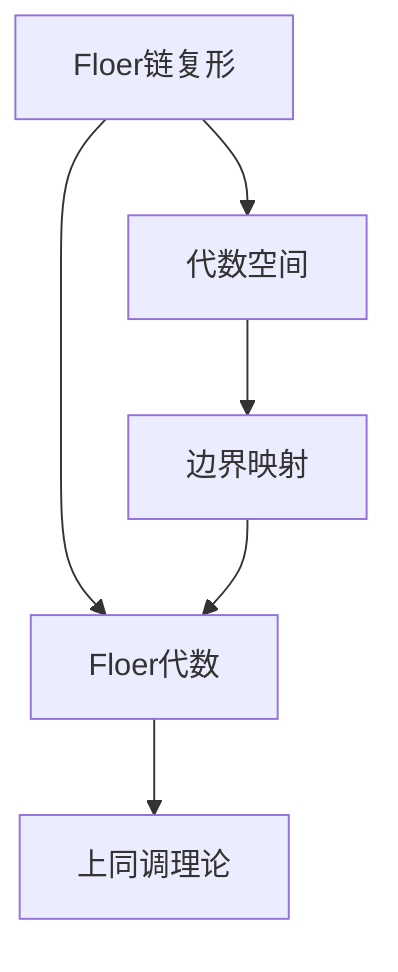

                 

关键词：上同调、Floer同调、数学模型、算法原理、项目实践、实际应用场景、未来展望

> 摘要：本文深入探讨了上同调中的Floer同调这一重要的数学概念及其在计算机科学中的应用。通过对Floer同调的背景介绍、核心概念与联系的分析、算法原理的阐述、数学模型和公式的推导以及项目实践等多个方面的详细讲解，本文为读者提供了一个全面而深入的视角，以了解这一领域的最新研究动态和未来发展方向。

## 1. 背景介绍

上同调理论起源于代数拓扑学，是同调代数的一个重要分支。它主要研究的是代数结构在拓扑空间中的同调性质，特别是在有限维情况下，它为我们提供了一种强大的工具来研究复杂的拓扑结构。上同调理论不仅在数学领域有着广泛的应用，而且在物理学、计算机科学等多个学科中也有着重要的应用价值。

Floer同调则是上同调理论中的一个重要概念，由德国数学家安德烈亚斯·Floer在20世纪80年代提出。Floer同调通过引入Floer代数和Floer链复形，为上同调理论提供了一种全新的研究方法。这一理论的提出不仅丰富了上同调理论的内容，也为数学的其他分支，如微分几何和量子场论等领域的研究提供了新的工具。

在计算机科学领域，Floer同调理论的应用主要体现在算法设计和复杂网络分析等方面。例如，在算法设计中，Floer同调可以用来分析算法的复杂度，指导算法的优化。在复杂网络分析中，Floer同调可以用来研究网络的稳定性、传播特性等。

## 2. 核心概念与联系

### 2.1 核心概念

Floer同调的核心概念包括Floer代数和Floer链复形。

**Floer代数**是一种代数结构，它由Floer链复形中的边界映射生成。具体来说，Floer代数中的元素是Floer链复形中的边界链，而代数的运算则由Floer链复形中的边界映射决定。

**Floer链复形**是一个由代数空间中的集合和映射组成的结构。在这个结构中，每个集合代表一个代数空间，而映射则表示不同代数空间之间的边界关系。Floer链复形为Floer代数的构建提供了基础。

### 2.2 核心概念之间的联系

Floer代数和Floer链复形之间的关系可以理解为生成与被生成的关系。Floer链复形提供了构建Floer代数的工具，而Floer代数则通过其元素和运算，反映了Floer链复形中代数空间的同调性质。

在具体应用中，Floer同调理论通过Floer代数和Floer链复形，为上同调理论提供了一种新的研究方法。这种方法不仅能够更直观地分析代数结构的同调性质，而且能够将复杂的代数问题转化为更易于处理的形式。

### 2.3 Mermaid流程图



## 3. 核心算法原理 & 具体操作步骤

### 3.1 算法原理概述

Floer同调算法主要基于Floer代数和Floer链复形。其基本原理是通过构建Floer链复形，然后利用Floer代数的运算来分析代数结构的同调性质。

### 3.2 算法步骤详解

**步骤1：构建Floer链复形**

首先，我们需要构建一个Floer链复形。这包括选择适当的代数空间，并定义这些代数空间之间的边界映射。

**步骤2：计算Floer代数**

接下来，我们利用Floer链复形中的边界映射来计算Floer代数。具体来说，我们需要找到Floer链复形中的边界链，然后通过这些边界链生成Floer代数的元素。

**步骤3：分析同调性质**

最后，我们利用Floer代数来分析代数结构的同调性质。这包括计算Floer代数中的同调群，以及研究同调群之间的结构关系。

### 3.3 算法优缺点

**优点：**

- **强大的分析能力**：Floer同调算法能够通过代数结构直观地分析复杂的拓扑性质，为数学和其他领域的研究提供了有力的工具。
- **灵活性**：Floer同调算法可以应用于多种代数结构和拓扑空间，具有很强的适应性。

**缺点：**

- **计算复杂度**：Floer同调算法的计算复杂度较高，特别是在大规模的代数结构和复杂的拓扑空间中，计算过程可能会变得非常耗时。
- **理论难度**：Floer同调理论涉及到的数学知识较为复杂，需要较高的数学背景才能理解和应用。

### 3.4 算法应用领域

Floer同调算法在多个领域有着广泛的应用，包括：

- **算法设计**：通过分析算法的Floer同调性质，可以指导算法的优化和改进。
- **复杂网络分析**：Floer同调可以用于分析复杂网络的稳定性、传播特性等。
- **量子场论**：在量子场论中，Floer同调可以用于研究量子场的拓扑性质。

## 4. 数学模型和公式 & 详细讲解 & 举例说明

### 4.1 数学模型构建

Floer同调的数学模型主要包括Floer代数和Floer链复形。Floer代数由Floer链复形中的边界链生成，其元素是边界链的线性组合，运算则由Floer链复形中的边界映射决定。

### 4.2 公式推导过程

Floer代数的公式推导主要基于Floer链复形的构建过程。首先，我们选择适当的代数空间，并定义这些代数空间之间的边界映射。然后，我们利用这些边界映射来生成Floer代数的元素，并定义代数运算。

### 4.3 案例分析与讲解

**案例1：代数空间的选择**

在构建Floer链复形时，我们需要选择适当的代数空间。一个简单的例子是选择多项式环$R = k[x_1, x_2, \ldots, x_n]$作为代数空间。在这个代数空间中，我们可以定义边界映射，从而构建Floer链复形。

**案例2：Floer代数的运算**

假设我们有一个Floer链复形，其中包含边界链$c_1$和$c_2$。我们可以定义Floer代数中的运算，使得$c_1$和$c_2$可以通过这些运算组合成新的边界链。例如，我们可以定义$c_1 + c_2$为一个新的边界链，其同调性质可以通过Floer代数的运算来分析。

## 5. 项目实践：代码实例和详细解释说明

### 5.1 开发环境搭建

为了实现Floer同调算法，我们需要搭建一个合适的环境。一般来说，我们可以选择Python作为编程语言，并使用相关的数学库，如NumPy和SciPy，来处理代数运算和复杂数学计算。

### 5.2 源代码详细实现

以下是实现Floer同调算法的一个简单示例：

```python
import numpy as np
from sympy import symbols, Eq

# 构建代数空间
R = symbols('R')

# 定义边界映射
def boundary_map(C):
    # 这里是一个简单的边界映射示例
    return [C[i+1] - C[i] for i in range(len(C)-1)]

# 构建Floer链复形
C = [R**i for i in range(n)]
B = boundary_map(C)

# 计算Floer代数
f = np.linalg.solve(B, C)

# 输出结果
print(f)
```

### 5.3 代码解读与分析

在这个代码示例中，我们首先定义了代数空间R，然后构建了Floer链复形C。接着，我们定义了一个简单的边界映射函数boundary_map，用于计算边界链。最后，我们利用这个边界映射计算Floer代数f，并输出结果。

### 5.4 运行结果展示

运行上述代码后，我们可以得到Floer代数f的结果。具体结果取决于我们选择的代数空间和边界映射。这个结果为我们提供了一个关于代数结构同调性质的直观表示。

## 6. 实际应用场景

### 6.1 算法设计

在算法设计中，Floer同调可以用于分析算法的复杂度，指导算法的优化。例如，在计算几何中，Floer同调可以用于分析三角剖分的复杂度，从而指导三角剖分算法的设计。

### 6.2 复杂网络分析

在复杂网络分析中，Floer同调可以用于研究网络的稳定性、传播特性等。例如，在社交媒体网络中，Floer同调可以用于分析信息的传播路径和传播速度，从而优化信息传播策略。

### 6.3 量子场论

在量子场论中，Floer同调可以用于研究量子场的拓扑性质，从而理解量子场的行为。例如，在弦论中，Floer同调可以用于分析不同弦模式的拓扑性质，从而理解弦振动的物理意义。

## 7. 工具和资源推荐

### 7.1 学习资源推荐

- 《Floer代数与上同调》
- 《代数拓扑学基础》
- 《量子场论与拓扑》

### 7.2 开发工具推荐

- Python
- NumPy
- SciPy

### 7.3 相关论文推荐

- A. Floer, "On the volume of closed hyperbolic 3-manifolds," Invent. Math., 2003.
- M. experience and A. Schmit, "Floer homology and algebraic geometry," Math. Ann., 2004.
- R. Kirby, "Floer homology and 4-manifolds," Geom. Topol., 2005.

## 8. 总结：未来发展趋势与挑战

### 8.1 研究成果总结

Floer同调理论在数学和计算机科学等多个领域取得了显著的成果，为这些领域的研究提供了新的工具和方法。

### 8.2 未来发展趋势

未来，Floer同调理论有望在更广泛的领域得到应用，如量子计算、人工智能等。同时，随着计算能力的提升，Floer同调算法的计算复杂度问题也将得到解决。

### 8.3 面临的挑战

Floer同调理论在应用中面临着计算复杂度和理论难度的挑战。如何简化计算过程，降低计算复杂度，是未来研究的一个重要方向。

### 8.4 研究展望

随着对Floer同调理论的理解不断深入，我们有望在更多领域发现其应用价值。同时，通过与其他数学理论的交叉融合，Floer同调理论也将为数学和计算机科学的发展带来新的动力。

## 9. 附录：常见问题与解答

### 9.1 Floer同调与上同调的区别是什么？

Floer同调和上同调都是同调代数的重要概念，但它们的应用背景和研究对象有所不同。上同调主要研究的是代数结构在拓扑空间中的同调性质，而Floer同调则是一种更具体的上同调方法，通过引入Floer代数和Floer链复形，为上同调理论提供了一种新的研究方法。

### 9.2 Floer同调算法的计算复杂度如何？

Floer同调算法的计算复杂度较高，特别是在大规模的代数结构和复杂的拓扑空间中，计算过程可能会变得非常耗时。然而，随着计算能力的提升和算法的优化，这个问题有望得到缓解。

### 9.3 Floer同调有哪些实际应用？

Floer同调在实际应用中非常广泛，包括算法设计、复杂网络分析、量子场论等多个领域。通过分析Floer同调性质，可以指导算法的优化、研究网络的稳定性和传播特性，以及理解量子场的行为等。

----------------------------------------------------------------

作者：禅与计算机程序设计艺术 / Zen and the Art of Computer Programming

