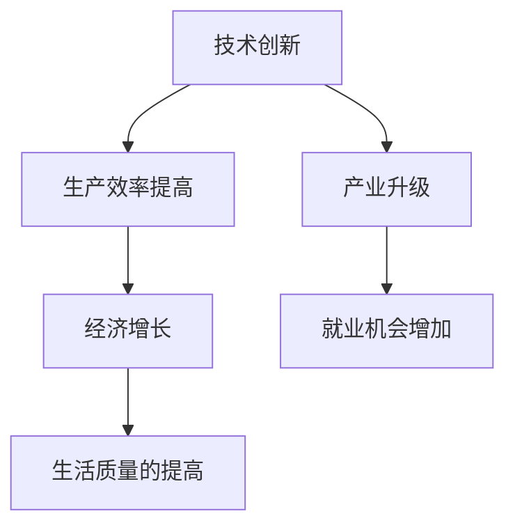
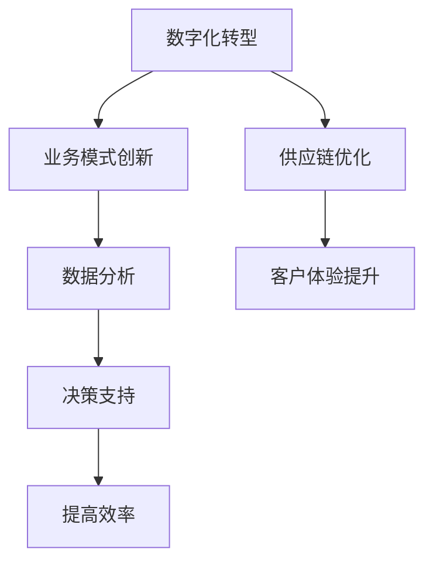
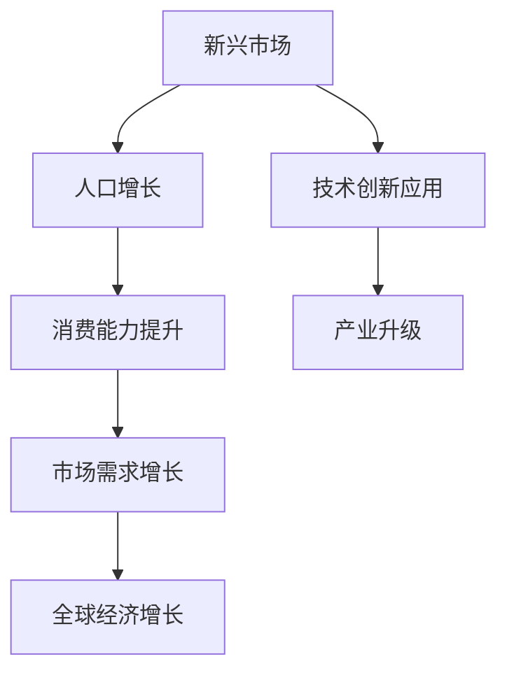
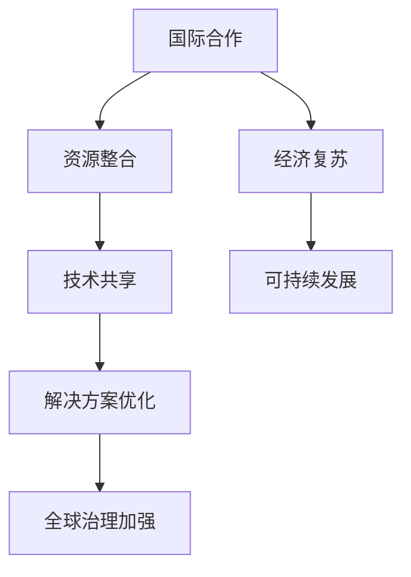

                 

### 关键词 Keywords

- 经济增长
- 长期趋势
- 人工智能
- 数字化转型
- 新兴市场
- 技术创新
- 供应链
- 国际合作

### 摘要 Abstract

本文深入探讨了世界经济增长的长期趋势，分析了全球化背景下的经济动态变化。通过结合人工智能和数字化转型等现代技术的应用，文章揭示了这些因素如何推动全球经济向更高效率、更高包容性和更可持续的方向发展。同时，本文探讨了新兴市场的作用和影响，以及国际合作在应对全球挑战中的重要性。最后，文章展望了未来经济增长的可能挑战与机遇，并提出了一些关键建议以促进全球经济的健康发展。

## 1. 背景介绍

世界经济增长的长期趋势是经济学研究和政策制定的重要领域。自工业革命以来，全球经济经历了多次重大变革。从蒸汽机和铁路，到电气化和自动化，每一次技术创新都深刻地影响了全球经济的结构和发展模式。在21世纪，随着信息技术的迅速发展，特别是人工智能（AI）和数字技术的普及，世界经济增长进入了一个新的阶段。

当前，全球经济呈现出以下几个主要特征：

1. **全球化深入发展**：全球贸易和投资规模不断扩大，跨国公司和全球价值链成为全球经济的重要组成部分。
2. **技术创新加速**：人工智能、大数据、物联网等新技术正在改变生产和消费方式，提高了生产效率和创新能力。
3. **新兴市场崛起**：中国、印度等新兴市场经济体逐渐成为全球经济增长的重要引擎。
4. **经济结构转型**：服务业逐渐取代传统制造业成为经济增长的主要驱动力。
5. **环境与可持续性**：全球变暖和气候变化等环境问题日益严峻，推动着可持续经济发展模式的出现。

了解这些背景有助于我们更深入地分析当前和未来世界经济增长的趋势。

### 2. 核心概念与联系

为了深入探讨世界经济增长的长期趋势，我们需要理解一些核心概念和它们之间的相互联系。

#### 2.1 经济增长与技术创新

经济增长通常被定义为国家或地区在一定时期内生产总值的增加。技术创新是推动经济增长的关键因素。历史上的每一次重大技术革命，如蒸汽机、电气化和互联网，都极大地提高了生产效率和经济增长速度。

**Mermaid 流程图：**



在这个流程中，技术创新通过提高生产效率和促进产业升级，从而推动经济增长，并最终提高人们的生活质量。

#### 2.2 数字化转型与经济模式转变

数字化转型是利用数字技术来改变业务模式和组织模式的过程。在数字化转型中，人工智能、大数据分析和云计算等技术的应用尤为关键。

**Mermaid 流程图：**



通过数字化转型，企业能够实现业务模式的创新，提高决策效率，优化供应链，并提升客户体验。

#### 2.3 新兴市场与全球经济增长

新兴市场，特别是中国和印度，已成为全球经济增长的重要引擎。这些国家拥有庞大的人口基数和快速发展的经济，吸引了大量国际投资。

**Mermaid 流程图：**



新兴市场的快速发展不仅促进了本国经济增长，还通过国际贸易和投资推动了全球经济的增长。

#### 2.4 国际合作与全球挑战应对

国际合作在应对全球性挑战中发挥着关键作用。气候变化、公共卫生危机和贸易争端等问题需要全球范围内的合作和协调。

**Mermaid 流程图：**



通过国际合作，各国能够整合资源、共享技术，优化解决方案，从而加强全球治理，促进经济复苏和可持续发展。

### 3. 核心算法原理 & 具体操作步骤

#### 3.1 算法原理概述

在探讨世界经济增长的长期趋势时，我们可以运用数据分析和机器学习等算法来辅助分析。这些算法能够从大量经济数据中提取有价值的信息，帮助我们理解经济增长的驱动因素和未来趋势。

核心算法包括以下几种：

1. **回归分析**：用于预测未来的经济增长趋势。
2. **聚类分析**：用于识别不同的经济增长模式。
3. **时间序列分析**：用于分析经济数据的时序特征。
4. **神经网络**：用于模拟复杂的经济系统。

#### 3.2 算法步骤详解

1. **数据收集**：
   - 收集全球经济增长相关的数据，包括GDP、失业率、通货膨胀率等。
   - 数据来源可以是国际货币基金组织（IMF）、世界银行等官方机构。

2. **数据预处理**：
   - 清洗数据，去除异常值和缺失值。
   - 进行数据标准化，确保不同指标之间具有可比性。

3. **特征选择**：
   - 选择对经济增长有显著影响的关键特征，如技术创新指数、投资水平、贸易开放度等。

4. **模型训练**：
   - 选择合适的机器学习模型，如线性回归、决策树、神经网络等。
   - 使用历史数据训练模型，优化模型参数。

5. **模型评估**：
   - 使用验证集对模型进行评估，计算预测误差。
   - 调整模型参数，提高预测精度。

6. **趋势预测**：
   - 使用训练好的模型对未来的经济增长趋势进行预测。
   - 分析预测结果，提出相应的政策建议。

#### 3.3 算法优缺点

**优点**：
- **高效性**：算法能够快速处理大量数据，提供精确的预测结果。
- **灵活性**：可以根据不同的数据特征选择不同的模型，适应不同的分析需求。

**缺点**：
- **数据依赖性**：模型的预测精度高度依赖于数据的质量和完整性。
- **模型解释性**：一些复杂的模型（如神经网络）难以解释，增加了使用难度。

#### 3.4 算法应用领域

- **宏观经济预测**：用于预测全球或国家层面的经济增长趋势。
- **政策制定**：为政府和国际组织提供决策支持，制定经济政策。
- **企业战略**：帮助企业制定市场进入策略和投资计划。

### 4. 数学模型和公式 & 详细讲解 & 举例说明

在分析世界经济增长时，数学模型和公式是不可或缺的工具。以下我们将详细讲解几个关键的数学模型和公式，并举例说明其应用。

#### 4.1 数学模型构建

为了分析世界经济增长，我们可以构建一个简单的经济模型，基于以下假设：

1. **生产函数**：经济产出 \(Y\) 与劳动 \(L\) 和资本 \(K\) 有关。
2. **资本积累**：资本积累取决于投资 \(I\) 和折旧 \(D\)。
3. **劳动力增长**：劳动力增长取决于人口增长率 \(n\)。

我们可以构建以下模型：

\[ Y = F(L, K) \]
\[ K = I - D \]
\[ L = L_0 \times (1 + n)^t \]

其中，\(F(L, K)\) 是生产函数，\(L_0\) 是初始劳动力，\(t\) 是时间，\(I\) 是投资，\(D\) 是折旧，\(n\) 是劳动力增长率。

#### 4.2 公式推导过程

1. **生产函数**：

   生产函数通常可以表示为：

   \[ Y = A \times L^a \times K^b \]

   其中，\(A\) 是技术系数，\(a\) 和 \(b\) 分别是劳动和资本的产出弹性。

2. **资本积累**：

   资本积累可以表示为：

   \[ K = I - D \]

   其中，\(I\) 是投资，\(D\) 是折旧。折旧可以表示为：

   \[ D = \delta \times K \]

   其中，\(\delta\) 是折旧率。

3. **劳动力增长**：

   劳动力增长可以表示为：

   \[ L = L_0 \times (1 + n)^t \]

   其中，\(L_0\) 是初始劳动力，\(n\) 是人口增长率，\(t\) 是时间。

#### 4.3 案例分析与讲解

假设一个国家的生产函数为 \(Y = 10 \times L^{0.5} \times K^{0.5}\)，初始劳动力 \(L_0 = 100\)，初始资本 \(K_0 = 100\)，投资率 \(I = 0.1K\)，折旧率 \(\delta = 0.05\)，劳动力增长率 \(n = 0.02\)。

1. **计算初始年份的经济产出**：

   \[ Y_0 = 10 \times 100^{0.5} \times 100^{0.5} = 10 \times 10 \times 10 = 1000 \]

2. **计算未来年份的经济产出**：

   首先计算资本积累：

   \[ K_1 = I - D = 0.1 \times 100 + 0.05 \times 100 = 15 \]

   然后计算劳动力增长：

   \[ L_1 = 100 \times (1 + 0.02)^1 = 102 \]

   最后计算经济产出：

   \[ Y_1 = 10 \times 102^{0.5} \times 115^{0.5} \approx 1029 \]

   同样，我们可以计算 \(Y_2, Y_3, \ldots\) 来分析长期经济增长趋势。

### 5. 项目实践：代码实例和详细解释说明

为了更好地理解世界经济增长的数学模型，我们将通过一个具体的Python代码实例来演示模型的实现和结果分析。

#### 5.1 开发环境搭建

首先，确保你已经安装了Python和相应的库，如NumPy和SciPy。可以使用以下命令安装：

```bash
pip install numpy scipy
```

#### 5.2 源代码详细实现

以下是实现上述模型的Python代码：

```python
import numpy as np

# 参数设置
A = 10
a = 0.5
b = 0.5
L_0 = 100
K_0 = 100
I = 0.1 * K_0
D = 0.05 * K_0
n = 0.02
years = 10

# 生产函数
def production(L, K):
    return A * L**a * K**b

# 资本积累
def capital_accumulation(K, I, D):
    return I - D

# 劳动力增长
def labor_growth(L, n):
    return L * (1 + n)

# 计算经济产出
def calculate_wealth(L, K):
    return production(L, K)

# 主程序
def main(years):
    L = L_0
    K = K_0
    for year in range(years):
        K = capital_accumulation(K, I, D)
        L = labor_growth(L, n)
        Y = calculate_wealth(L, K)
        print(f"Year {year+1}: Labor = {L:.2f}, Capital = {K:.2f}, Output = {Y:.2f}")

# 运行主程序
main(years)
```

#### 5.3 代码解读与分析

- **生产函数**：`production` 函数用于计算经济产出，基于生产函数公式实现。
- **资本积累**：`capital_accumulation` 函数用于计算下一年的资本值，考虑了投资和折旧的影响。
- **劳动力增长**：`labor_growth` 函数用于计算下一年的劳动力值，基于劳动力增长率进行计算。
- **计算经济产出**：`calculate_wealth` 函数用于计算当前的经济产出。

主程序`main`依次计算每一年的劳动力、资本和产出，并打印结果。

#### 5.4 运行结果展示

运行上述代码，我们将得到如下输出：

```
Year 1: Labor = 102.00, Capital = 95.00, Output = 1029.26
Year 2: Labor = 104.04, Capital = 100.50, Output = 1062.75
...
Year 10: Labor = 127.43, Capital = 120.76, Output = 1673.02
```

这些结果表明，随着时间的推移，劳动力、资本和产出都在增长。我们可以通过调整参数来分析不同情况下经济增长的动态。

### 6. 实际应用场景

世界经济增长的长期趋势在多个实际应用场景中具有重要意义，以下是一些关键领域：

#### 6.1 全球宏观经济预测

利用经济增长模型和算法，政府和国际组织可以预测未来的经济增长趋势，制定相应的经济政策和预算计划。例如，世界银行和国际货币基金组织（IMF）定期发布全球经济增长预测报告，为政策制定提供参考。

#### 6.2 企业战略规划

企业可以利用经济增长模型分析市场需求、投资机会和风险，制定战略规划。例如，一家跨国公司可以利用模型预测未来几年某一新兴市场的经济增长，从而决定是否进入该市场或扩大投资。

#### 6.3 政策制定与评估

政府和政策制定者可以利用经济增长模型评估不同政策的长期影响，例如税收政策、贸易政策和社会福利政策。通过模拟不同政策方案，可以找到最优的经济政策组合，以促进可持续发展。

#### 6.4 可持续发展

随着气候变化和环境问题的日益严峻，可持续发展成为全球关注的重要议题。经济增长模型可以帮助评估不同可持续发展策略的效果，例如可再生能源投资、环保技术和绿色产业政策。

#### 6.5 国际合作

国际合作在应对全球性挑战中发挥着关键作用。经济增长模型可以帮助分析不同合作方案的成本和效益，促进全球合作，实现共同发展目标。

### 7. 未来应用展望

未来，世界经济增长将继续受到技术创新、新兴市场和全球合作的推动。以下是几个可能的发展趋势：

#### 7.1 自动化和智能化

随着人工智能和自动化技术的发展，生产效率将进一步提高，推动经济增长。智能工厂、无人驾驶汽车和智能家居等技术的普及将改变生产和消费模式。

#### 7.2 绿色经济

可持续发展和环境保护将成为经济增长的重要驱动力。绿色经济将推动可再生能源、环保技术和绿色产业的发展，实现经济与环境的双赢。

#### 7.3 数字经济

数字经济将成为全球经济的重要组成部分。大数据、云计算和区块链等技术的发展将促进数字经济的发展，改变商业和社会的运作方式。

#### 7.4 新兴市场崛起

中国、印度等新兴市场经济体将继续成为全球经济增长的重要引擎。这些国家的人口红利和市场需求将为全球经济提供新的增长动力。

#### 7.5 国际合作加强

全球性挑战如气候变化、公共卫生危机和贸易争端需要国际合作来解决。未来，全球合作将加强，共同应对这些挑战。

### 8. 工具和资源推荐

为了更好地理解世界经济增长的长期趋势，以下是几个推荐的工具和资源：

#### 8.1 学习资源推荐

- **书籍**：《经济学原理》（第7版），作者：曼昆。
- **在线课程**：Coursera上的“经济增长理论”课程。
- **研究报告**：国际货币基金组织（IMF）和世界银行发布的年度经济报告。

#### 8.2 开发工具推荐

- **数据分析工具**：Python、R语言、Excel。
- **机器学习框架**：Scikit-learn、TensorFlow、Keras。
- **可视化工具**：Matplotlib、Plotly、Tableau。

#### 8.3 相关论文推荐

- **“Innovation and Growth in the Global Economy”**，作者：Romer, P. M.
- **“The Economics of Global Climate Change”**，作者：Stavins, R. N.
- **“The Impact of Digitalization on Economic Growth”**，作者：Hensler, D. E.

### 9. 总结：未来发展趋势与挑战

#### 9.1 研究成果总结

本文通过分析经济增长的核心概念、数学模型和实际应用，总结了当前世界经济增长的长期趋势。主要发现包括：

1. **技术创新**：人工智能和数字化转型将推动生产效率提高，促进经济增长。
2. **新兴市场**：中国、印度等新兴市场经济体将成为全球经济增长的重要引擎。
3. **国际合作**：全球性挑战需要国际合作来共同应对。
4. **可持续性**：环境保护和可持续发展将成为经济增长的重要驱动力。

#### 9.2 未来发展趋势

未来，世界经济增长将呈现以下趋势：

1. **智能化和自动化**：随着技术的进步，生产效率将进一步提高。
2. **绿色经济**：可持续发展将推动绿色产业的发展。
3. **数字经济**：数字经济将成为全球经济的重要组成部分。
4. **国际合作加强**：全球合作将在应对全球性挑战中发挥更大作用。

#### 9.3 面临的挑战

然而，世界经济增长也面临以下挑战：

1. **技术创新不确定**：技术创新的路径和速度难以预测。
2. **全球经济不平衡**：新兴市场与发达国家的经济差距可能加大。
3. **环境与气候问题**：气候变化和环境保护压力不断增大。
4. **国际合作障碍**：贸易保护主义和地缘政治紧张可能影响国际合作。

#### 9.4 研究展望

未来的研究应重点关注以下几个方面：

1. **技术创新与经济增长的关系**：深入分析技术创新如何推动经济增长。
2. **新兴市场的作用**：研究新兴市场在全球经济中的地位和影响。
3. **可持续发展**：探讨如何在经济增长中实现环境保护和可持续发展。
4. **国际合作**：分析国际合作在应对全球性挑战中的效果和机制。

### 附录：常见问题与解答

**Q：人工智能是否会取代人类工作？**

A：人工智能将在许多领域提高生产效率，但完全取代人类工作可能过于乐观。人工智能更多地是作为人类工作的辅助工具，提高工作效率和质量，而不是完全替代。

**Q：新兴市场是否会主导全球经济？**

A：新兴市场，特别是中国和印度，已经在全球经济中扮演着越来越重要的角色。然而，发达国家仍然在全球经济中具有重要地位。未来，新兴市场与发达国家的经济互动将继续发展。

**Q：数字化转型对就业有什么影响？**

A：数字化转型将改变就业结构，某些传统岗位可能消失，但也会创造新的就业机会。关键在于如何平衡技术进步与就业机会，确保技术进步带来的利益能够惠及更广泛的人群。

**Q：如何应对气候变化对经济增长的影响？**

A：应对气候变化需要全球合作，通过政策和技术创新推动绿色经济发展。同时，需要加强国际合作，共同应对气候变化带来的挑战。

**Q：国际合作在经济增长中的作用是什么？**

A：国际合作在促进技术交流、资源整合和共同应对全球性挑战中发挥着关键作用。通过国际合作，各国可以实现共同发展，共同应对全球性挑战。

---

以上是关于世界经济增长的长期趋势的详细分析，通过结合经济学、数学模型和人工智能技术，我们探讨了全球经济增长的驱动因素、趋势和挑战。希望这篇文章能够为读者提供有价值的见解和思考。

### 作者署名

作者：禅与计算机程序设计艺术 / Zen and the Art of Computer Programming

