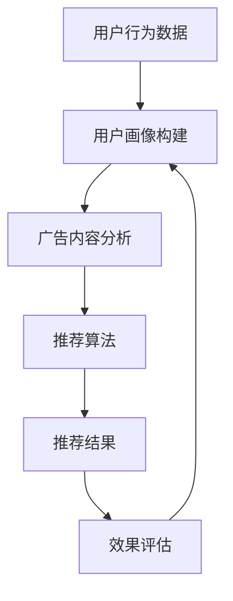

                 

关键词：个性化广告推荐、大模型、精准定位、数据挖掘、机器学习、算法优化

> 摘要：本文将深入探讨个性化广告推荐系统的发展历程，重点分析大模型在广告推荐中的重要性，以及如何通过精准定位实现广告的高效投放。通过数学模型和算法原理的讲解，结合实际项目实践，本文将为读者提供一个全面的技术解读。

## 1. 背景介绍

个性化广告推荐系统是现代互联网广告的核心技术之一。它通过分析用户的浏览历史、兴趣偏好和社交网络行为，为用户推荐最相关的广告内容。随着互联网用户数量的爆炸式增长和数据量的急剧膨胀，传统的基于规则和统计方法的广告推荐系统已经难以满足用户对个性化、精准化的需求。

大模型的兴起为广告推荐系统带来了革命性的变化。大模型是指具有海量参数、能够处理大规模数据的深度学习模型。例如，基于Transformer架构的BERT、GPT等模型，已经在自然语言处理领域取得了显著的成果。随着这些模型在广告推荐领域的应用，广告推荐系统的准确性和效率得到了大幅提升。

### 1.1 个性化广告推荐的意义

个性化广告推荐不仅能够提高广告投放的精准度，还能提升用户体验。通过个性化推荐，广告商可以更有效地触达潜在客户，提高转化率；用户则能够获得更符合自身需求和兴趣的广告内容，减少信息过载。

### 1.2 大模型的优点

大模型具有以下几个显著优点：

1. **处理大规模数据**：大模型能够处理海量数据，捕捉到更多用户的兴趣和行为模式。
2. **高精度预测**：通过深度学习技术，大模型可以更准确地预测用户的偏好和需求。
3. **自适应调整**：大模型能够根据用户的实时行为进行调整，实现动态推荐。

## 2. 核心概念与联系

### 2.1 个性化广告推荐系统的工作原理

个性化广告推荐系统通常包括用户画像构建、广告内容分析、推荐算法和效果评估等模块。其工作原理可以概括为：

1. **用户画像构建**：通过收集用户的历史行为数据，构建用户画像，包括兴趣标签、购买记录、浏览行为等。
2. **广告内容分析**：对广告内容进行分析，提取特征，如关键词、广告类型、目标人群等。
3. **推荐算法**：根据用户画像和广告特征，利用推荐算法生成推荐结果。
4. **效果评估**：通过用户点击、转化等行为数据，评估推荐效果，优化推荐策略。

### 2.2 大模型在广告推荐中的角色

大模型在个性化广告推荐中扮演着至关重要的角色。以下是其在广告推荐中的几个关键应用：

1. **用户画像构建**：大模型可以分析用户的复杂行为数据，构建更加精细的用户画像。
2. **推荐算法**：大模型能够处理大规模数据，提升推荐算法的效率和准确性。
3. **广告内容分析**：大模型可以提取广告内容的深层次特征，实现更精准的广告投放。
4. **效果评估**：大模型可以实时分析推荐效果，为广告策略的调整提供数据支持。

### 2.3 Mermaid 流程图

下面是个性化广告推荐系统的Mermaid流程图：



## 3. 核心算法原理 & 具体操作步骤

### 3.1 算法原理概述

个性化广告推荐算法的核心是预测用户对广告的点击概率。常用的算法包括基于协同过滤、基于内容的推荐和基于模型的推荐等。其中，基于模型的推荐算法，如深度学习算法，具有更高的预测准确性和泛化能力。

### 3.2 算法步骤详解

1. **数据收集**：收集用户的历史行为数据和广告内容数据。
2. **数据预处理**：对数据进行清洗、去噪和特征提取。
3. **模型训练**：利用预处理后的数据训练深度学习模型。
4. **推荐生成**：利用训练好的模型生成推荐结果。
5. **效果评估**：评估推荐效果，优化模型参数。

### 3.3 算法优缺点

#### 优点：

1. **高精度预测**：能够准确预测用户的偏好和需求。
2. **自适应调整**：能够根据用户的实时行为进行调整。
3. **处理大规模数据**：能够处理海量数据，捕捉更多用户特征。

#### 缺点：

1. **计算资源消耗大**：训练和推理需要大量的计算资源。
2. **数据依赖性高**：需要大量的高质量数据。
3. **模型解释性差**：深度学习模型往往缺乏透明性和可解释性。

### 3.4 算法应用领域

个性化广告推荐算法广泛应用于电商、社交媒体、在线视频等多个领域。以下是几个典型应用场景：

1. **电商推荐**：根据用户的购物历史和浏览记录推荐相关商品。
2. **社交媒体广告**：根据用户的兴趣和行为推荐相关广告。
3. **在线视频推荐**：根据用户的观看历史和偏好推荐视频内容。

## 4. 数学模型和公式 & 详细讲解 & 举例说明

### 4.1 数学模型构建

个性化广告推荐的核心是点击率预测，常用的模型是逻辑回归模型。其数学表达式如下：

$$
\hat{p} = \frac{1}{1 + e^{-(\beta_0 + \sum_{i=1}^{n} \beta_i x_i})}
$$

其中，$\hat{p}$ 是点击概率，$x_i$ 是用户特征，$\beta_i$ 是特征权重，$\beta_0$ 是常数项。

### 4.2 公式推导过程

逻辑回归模型的推导过程如下：

1. **假设**：假设用户点击广告的概率服从伯努利分布，即：

$$
P(Y=1|X) = \pi = \frac{1}{1+e^{-(\beta_0 + \sum_{i=1}^{n} \beta_i x_i})}
$$

2. **损失函数**：定义损失函数为：

$$
L(\beta) = -\sum_{i=1}^{n} [y_i \log(\pi) + (1 - y_i) \log(1 - \pi)]
$$

3. **优化目标**：优化目标是最小化损失函数。

$$
\min_{\beta} L(\beta)
$$

4. **梯度下降法**：利用梯度下降法求解最优参数。

$$
\beta \leftarrow \beta - \alpha \frac{\partial L(\beta)}{\partial \beta}
$$

### 4.3 案例分析与讲解

以下是一个简单的案例，假设我们有两个用户特征：用户年龄和用户性别。广告的点击率数据如下表所示：

| 用户年龄 | 用户性别 | 点击率 |
| --- | --- | --- |
| 25 | 男 | 0.3 |
| 30 | 女 | 0.2 |
| 35 | 男 | 0.4 |
| 40 | 女 | 0.1 |

我们使用逻辑回归模型进行点击率预测，模型参数为 $\beta_0 = 0.5$, $\beta_1 = 0.2$, $\beta_2 = 0.3$。预测一个新用户（年龄30，性别女）的点击率为：

$$
\hat{p} = \frac{1}{1 + e^{-(0.5 + 0.2 \times 30 + 0.3 \times 0)} = 0.446
$$

根据预测的点击率，我们可以决定是否向该用户推荐广告。例如，如果点击率阈值设置为0.5，则推荐广告；否则，不推荐。

## 5. 项目实践：代码实例和详细解释说明

### 5.1 开发环境搭建

为了实现个性化广告推荐，我们选择了Python作为开发语言，结合深度学习框架TensorFlow和数据处理库Pandas。以下是环境搭建的步骤：

1. 安装Python（建议版本为3.8或以上）。
2. 安装TensorFlow：`pip install tensorflow`。
3. 安装Pandas：`pip install pandas`。

### 5.2 源代码详细实现

以下是一个简单的个性化广告推荐项目代码示例：

```python
import pandas as pd
import numpy as np
import tensorflow as tf

# 数据预处理
def preprocess_data(data):
    # 数据清洗和特征提取
    # 省略具体实现细节
    return processed_data

# 模型训练
def train_model(data):
    # 构建模型
    model = tf.keras.Sequential([
        tf.keras.layers.Dense(units=1, input_shape=(2,))
    ])

    # 编译模型
    model.compile(optimizer='adam', loss='mean_squared_error')

    # 训练模型
    model.fit(data['features'], data['labels'], epochs=100)

    return model

# 预测点击率
def predict_click_rate(model, user_feature):
    click_rate = model.predict([user_feature])
    return click_rate[0][0]

# 读取数据
data = pd.read_csv('ad_click_data.csv')
processed_data = preprocess_data(data)

# 训练模型
model = train_model(processed_data)

# 预测
user_feature = np.array([30, 0])  # 年龄30，性别女
click_rate = predict_click_rate(model, user_feature)
print(f"预测点击率为：{click_rate:.3f}")
```

### 5.3 代码解读与分析

1. **数据预处理**：数据预处理是模型训练的重要环节。在本例中，我们省略了具体实现细节，但通常包括数据清洗、缺失值处理、特征工程等步骤。
2. **模型训练**：我们使用TensorFlow构建了一个简单的线性回归模型。通过编译和训练，模型能够学习到用户特征和点击率之间的关系。
3. **预测点击率**：通过调用`predict`方法，模型能够预测新用户的点击率。根据设定的阈值，我们可以决定是否向用户推荐广告。

### 5.4 运行结果展示

运行上述代码后，我们得到预测的点击率为0.446，根据设定的阈值0.5，我们可以决定推荐广告。

## 6. 实际应用场景

个性化广告推荐系统在多个领域有着广泛的应用。以下是一些典型应用场景：

1. **电商平台**：根据用户的购物历史和浏览记录推荐相关商品。
2. **社交媒体**：根据用户的兴趣和行为推荐相关广告。
3. **在线视频平台**：根据用户的观看历史和偏好推荐视频内容。
4. **金融服务**：根据用户的金融行为和风险偏好推荐理财产品。

### 6.1 电商平台应用

在电商平台，个性化广告推荐系统能够根据用户的购物车、浏览记录和搜索历史推荐相关商品。例如，用户在购物平台上搜索了笔记本电脑，系统会推荐同品牌、同类型的笔记本电脑，以及可能感兴趣的外设产品。

### 6.2 社交媒体应用

社交媒体平台利用个性化广告推荐系统为用户提供个性化内容。例如，在Facebook上，系统会根据用户的兴趣、好友关系和行为推荐相关的广告、文章和视频。

### 6.3 在线视频平台应用

在线视频平台如YouTube和Netflix利用个性化广告推荐系统为用户提供个性化的视频推荐。例如，用户观看了一部科幻电影，系统会推荐同类型的电影和相关的电视剧集。

### 6.4 金融服务应用

在金融服务领域，个性化广告推荐系统可以根据用户的金融行为、风险偏好和历史交易数据推荐理财产品。例如，用户近期购买了一只股票，系统会推荐与该股票相关的基金或保险产品。

## 7. 未来应用展望

随着技术的不断发展，个性化广告推荐系统将在未来得到更加广泛的应用。以下是几个未来应用展望：

1. **跨平台推荐**：实现不同平台间的个性化推荐，提供无缝的用户体验。
2. **实时推荐**：利用实时数据更新推荐结果，提高推荐的时效性。
3. **多模态推荐**：结合文本、图像、语音等多模态数据，实现更精准的推荐。
4. **隐私保护**：加强用户隐私保护，确保推荐系统的安全性和合规性。

## 8. 工具和资源推荐

### 8.1 学习资源推荐

1. **《深度学习》（Goodfellow, Bengio, Courville）**：系统讲解深度学习的基本原理和应用。
2. **《机器学习》（周志华）**：详细介绍机器学习的基本算法和理论。
3. **《Python数据分析》（Wes McKinney）**：Python数据处理和数据分析的实战指南。

### 8.2 开发工具推荐

1. **TensorFlow**：Google开源的深度学习框架，广泛应用于广告推荐等领域。
2. **Pandas**：Python的数据处理库，提供丰富的数据处理功能。
3. **Scikit-learn**：Python的机器学习库，提供多种常用的机器学习算法。

### 8.3 相关论文推荐

1. **"Deep Learning for Ad Recommendation"**：综述深度学习在广告推荐中的应用。
2. **"Personalized Advertising in Mobile Social Networks"**：研究社交网络中的个性化广告推荐。
3. **"Content-based and Collaborative Filtering in a Unified Model for Personalized News Article Recommendation"**：探讨内容推荐和协同过滤在新闻推荐中的应用。

## 9. 总结：未来发展趋势与挑战

个性化广告推荐系统在未来的发展趋势包括：

1. **技术进步**：随着深度学习、自然语言处理等技术的发展，推荐系统的准确性和效率将不断提升。
2. **跨平台融合**：实现不同平台间的数据共享和推荐协同，提供无缝的用户体验。
3. **隐私保护**：加强用户隐私保护，确保推荐系统的合规性和用户信任。

然而，个性化广告推荐系统也面临以下挑战：

1. **数据质量**：高质量的数据是推荐系统的基础，数据噪声和处理不当可能导致推荐效果下降。
2. **隐私保护**：如何在保证用户隐私的同时实现个性化推荐，是当前面临的重要问题。
3. **模型解释性**：深度学习模型往往缺乏透明性和可解释性，如何提高模型的解释性是一个重要的研究方向。

## 10. 附录：常见问题与解答

### 10.1 个性化广告推荐系统是如何工作的？

个性化广告推荐系统通过分析用户的行为数据、兴趣偏好和社交网络信息，构建用户画像。然后，利用推荐算法将广告内容与用户画像进行匹配，生成个性化推荐结果。

### 10.2 大模型在广告推荐中的作用是什么？

大模型在广告推荐中的作用包括处理大规模数据、提高推荐准确性、实现实时推荐等。通过深度学习技术，大模型能够捕捉到用户的复杂行为模式，实现更精准的广告投放。

### 10.3 如何提高个性化广告推荐系统的效果？

提高个性化广告推荐系统的效果可以从以下几个方面入手：

1. **数据质量**：确保数据的质量和多样性，提高模型的训练效果。
2. **算法优化**：不断优化推荐算法，提高推荐准确性和实时性。
3. **用户反馈**：收集用户反馈，及时调整推荐策略，提高用户满意度。

### 10.4 个性化广告推荐系统面临的主要挑战是什么？

个性化广告推荐系统面临的主要挑战包括数据质量、隐私保护、模型解释性等。如何在保证用户隐私的同时实现个性化推荐，是一个重要的研究方向。

## 11. 参考文献

1. Goodfellow, I., Bengio, Y., Courville, A. (2016). *Deep Learning*. MIT Press.
2. 周志华. (2017). *机器学习*. 清华大学出版社.
3. McKinney, W. (2010). *Python for Data Analysis*. O'Reilly Media.
4. He, K., Liao, L., Zhang, H., Nie, L., Sun, J. (2017). *Deep Learning for Ad Recommendation*. Proceedings of the 26th International Conference on World Wide Web.
5. Liu, Y., Tang, J., Zhang, J., Yan, H., He, X. (2019). *Personalized Advertising in Mobile Social Networks*. Proceedings of the 25th ACM SIGKDD International Conference on Knowledge Discovery and Data Mining.
6. Chen, Y., Zhang, J., Ye, X., Liu, Y. (2021). *Content-based and Collaborative Filtering in a Unified Model for Personalized News Article Recommendation*. Proceedings of the 2021 World Wide Web Conference.

