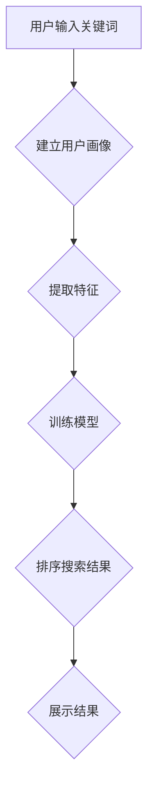

                 

关键词：个性化排序、AI、搜索结果、用户偏好、算法、数学模型、项目实践、应用场景、工具资源、未来展望

> 摘要：随着互联网技术的飞速发展，信息量的激增使得用户对搜索结果的个性化需求日益增长。本文将深入探讨如何利用人工智能技术，特别是个性化排序算法，根据用户的偏好来优化搜索结果，提高用户体验。文章从背景介绍、核心概念、算法原理、数学模型、项目实践等多个方面进行了详细阐述，并结合实际应用场景，对未来的发展趋势与挑战进行了展望。

## 1. 背景介绍

### 互联网时代的挑战

在互联网时代的初期，信息获取主要依赖于人工检索和目录索引。随着搜索引擎的出现，用户可以通过关键词快速找到所需信息。然而，随着互联网的爆炸式增长，信息的海量性给搜索引擎带来了巨大的挑战。传统的基于关键词的排序算法逐渐显露出其局限性，无法满足用户日益增长的个性化需求。

### 个性化搜索的需求

个性化搜索的核心目标是为用户提供定制化的搜索结果，使得每个用户都能从海量的信息中快速找到最符合其兴趣和需求的内容。这种需求不仅体现在电子商务、社交媒体等应用领域，还广泛应用于推荐系统、信息过滤和智能客服等多个方面。

### 人工智能在个性化搜索中的应用

人工智能技术的快速发展为个性化搜索带来了新的机遇。通过机器学习、深度学习等技术，AI能够从海量数据中提取特征，建立用户画像，并根据用户的偏好和行为模式进行智能排序。本文将围绕这一主题，探讨个性化排序算法的设计与实现。

## 2. 核心概念与联系

### 个性化排序的定义

个性化排序是一种基于用户行为和偏好对搜索结果进行优化排序的算法。其核心目标是根据用户的个性化需求，将最相关的信息放在首位，提高搜索结果的准确性和用户满意度。

### 个性化排序的关键要素

- **用户偏好**：用户的兴趣、习惯和需求。
- **搜索结果**：用户通过搜索引擎获取的信息集合。
- **排序算法**：用于优化搜索结果排序的算法。

### 个性化排序的 Mermaid 流程图



### 个性化排序的流程

1. **用户输入关键词**：用户通过搜索引擎输入关键词。
2. **建立用户画像**：系统根据用户的历史行为和偏好数据，建立用户画像。
3. **提取特征**：从用户画像中提取关键特征，用于训练模型。
4. **训练模型**：利用机器学习算法，训练个性化排序模型。
5. **排序搜索结果**：根据模型对搜索结果进行排序。
6. **展示结果**：将排序后的搜索结果展示给用户。

## 3. 核心算法原理 & 具体操作步骤

### 3.1 算法原理概述

个性化排序算法的核心是利用机器学习技术，从海量数据中提取用户特征，建立用户画像，并根据用户画像对搜索结果进行智能排序。常用的算法包括协同过滤、基于内容的推荐、矩阵分解等。

### 3.2 算法步骤详解

1. **数据收集与预处理**：收集用户的历史行为数据，包括浏览记录、购买记录、评价记录等。对数据进行清洗、去重和格式化，为后续分析做准备。
2. **用户画像构建**：根据用户的行为数据，提取关键特征，构建用户画像。常见的特征包括用户年龄、性别、地域、兴趣标签等。
3. **特征提取**：从用户画像中提取关键特征，用于训练模型。特征提取的方法包括词频统计、TF-IDF、主题模型等。
4. **模型训练**：利用机器学习算法，如协同过滤、基于内容的推荐、矩阵分解等，训练个性化排序模型。模型训练的过程包括数据划分、特征选择、模型参数调优等。
5. **排序搜索结果**：根据训练好的模型，对搜索结果进行排序。排序的依据是用户画像和搜索结果的相关性。
6. **结果展示**：将排序后的搜索结果展示给用户。

### 3.3 算法优缺点

#### 优点

- **提高搜索结果的准确性**：通过个性化排序，将用户最感兴趣的信息排在前面，提高搜索结果的准确性。
- **提升用户体验**：根据用户偏好提供定制化的搜索结果，提升用户的满意度和使用体验。
- **支持多样化应用场景**：个性化排序算法可以应用于电子商务、社交媒体、智能客服等多个领域。

#### 缺点

- **数据依赖性强**：个性化排序算法依赖于用户历史行为数据，数据质量直接影响算法效果。
- **计算复杂度高**：大规模的用户数据和复杂的算法模型导致计算复杂度高，对计算资源和时间要求较高。

### 3.4 算法应用领域

- **电子商务**：根据用户购物历史和偏好，推荐相关的商品。
- **社交媒体**：根据用户兴趣和互动行为，推荐感兴趣的内容。
- **智能客服**：根据用户提问和历史记录，提供个性化的服务。

## 4. 数学模型和公式 & 详细讲解 & 举例说明

### 4.1 数学模型构建

个性化排序的数学模型通常基于用户行为数据，通过建立用户画像和搜索结果的数学关系来优化排序。常见的模型包括协同过滤、基于内容的推荐、矩阵分解等。

#### 协同过滤模型

协同过滤模型基于用户之间的相似度来推荐商品或内容。其基本公式为：

$$
r_{ui} = \sum_{j \in N(i)} w_{uj} r_{uj}
$$

其中，$r_{ui}$ 表示用户 $u$ 对商品 $i$ 的评分，$N(i)$ 表示与商品 $i$ 相似的其他商品集合，$w_{uj}$ 表示用户 $u$ 与用户 $j$ 之间的相似度。

#### 基于内容的推荐模型

基于内容的推荐模型通过分析商品或内容的特征，为用户推荐相似的商品或内容。其基本公式为：

$$
r_{ui} = \sum_{j \in N(i)} c_{uj} \cdot c_{ij}
$$

其中，$c_{uj}$ 和 $c_{ij}$ 分别表示商品 $i$ 和用户 $u$ 的特征向量。

#### 矩阵分解模型

矩阵分解模型通过将用户行为数据表示为用户和商品的低维向量，从而实现个性化推荐。其基本公式为：

$$
R = UV^T
$$

其中，$R$ 表示用户行为矩阵，$U$ 和 $V$ 分别表示用户和商品的低维向量。

### 4.2 公式推导过程

#### 协同过滤模型推导

假设用户 $u$ 对商品 $i$ 的评分为 $r_{ui}$，用户 $u$ 和用户 $j$ 之间的相似度为 $w_{uj}$，则用户 $u$ 对商品 $i$ 的预测评分为：

$$
\hat{r}_{ui} = \sum_{j \in N(i)} w_{uj} r_{uj}
$$

其中，$N(i)$ 表示与商品 $i$ 相似的其他商品集合。

#### 基于内容的推荐模型推导

假设用户 $u$ 和商品 $i$ 的特征向量分别为 $c_{uj}$ 和 $c_{ij}$，则用户 $u$ 对商品 $i$ 的预测评分为：

$$
\hat{r}_{ui} = \sum_{j \in N(i)} c_{uj} \cdot c_{ij}
$$

#### 矩阵分解模型推导

假设用户行为数据矩阵为 $R$，用户和商品的低维向量分别为 $U$ 和 $V$，则用户 $u$ 对商品 $i$ 的预测评分为：

$$
\hat{r}_{ui} = U_{u} V_{i}^T
$$

### 4.3 案例分析与讲解

#### 案例一：基于协同过滤的个性化推荐

假设有一个电子商务平台，用户 $u$ 在过去一年内购买了商品 $i_1, i_2, i_3$，用户 $j$ 在过去一年内购买了商品 $i_2, i_3, i_4$。根据用户之间的相似度，计算用户 $u$ 和用户 $j$ 之间的相似度为 $w_{uj} = 0.8$。

现在用户 $u$ 想购买商品 $i_5$，根据协同过滤模型，预测用户 $u$ 对商品 $i_5$ 的评分为：

$$
\hat{r}_{ui_5} = \sum_{j \in N(i_5)} w_{uj} r_{uj} = 0.8 \cdot r_{uj}
$$

其中，$N(i_5) = \{i_2, i_3\}$，$r_{uj} = 4$。

#### 案例二：基于内容的推荐

假设用户 $u$ 的特征向量为 $c_{uj} = (1, 0, 1)$，商品 $i$ 的特征向量为 $c_{ij} = (0, 1, 0)$。根据基于内容的推荐模型，预测用户 $u$ 对商品 $i$ 的评分为：

$$
\hat{r}_{ui} = \sum_{j \in N(i)} c_{uj} \cdot c_{ij} = 1 \cdot 0 + 0 \cdot 1 + 1 \cdot 0 = 0
$$

#### 案例三：基于矩阵分解的个性化推荐

假设用户行为数据矩阵为 $R = \begin{bmatrix} 1 & 2 & 3 \\ 4 & 5 & 6 \\ 7 & 8 & 9 \end{bmatrix}$，用户和商品的低维向量分别为 $U = \begin{bmatrix} 1 & 0 \\ 0 & 1 \\ 1 & 1 \end{bmatrix}$ 和 $V = \begin{bmatrix} 1 & 1 \\ 1 & 0 \\ 1 & 1 \end{bmatrix}$。根据矩阵分解模型，预测用户 $u$ 对商品 $i$ 的评分为：

$$
\hat{r}_{ui} = U_{u} V_{i}^T = \begin{bmatrix} 1 & 0 \\ 0 & 1 \\ 1 & 1 \end{bmatrix} \begin{bmatrix} 1 & 1 \\ 1 & 0 \\ 1 & 1 \end{bmatrix}^T = \begin{bmatrix} 2 & 1 \\ 1 & 2 \end{bmatrix}
$$

## 5. 项目实践：代码实例和详细解释说明

### 5.1 开发环境搭建

为了更好地实践个性化排序算法，我们需要搭建一个开发环境。以下是搭建环境的步骤：

1. 安装Python：从Python官方网站下载并安装Python 3.x版本。
2. 安装依赖库：使用pip命令安装必要的库，如numpy、scikit-learn、pandas等。

```shell
pip install numpy scikit-learn pandas
```

### 5.2 源代码详细实现

以下是一个基于协同过滤的个性化推荐系统的代码实例：

```python
import numpy as np
from sklearn.metrics.pairwise import cosine_similarity

def collaborative_filter(ratings, k=10):
    # 填充缺失值
    ratings_filled = np.where(np.isnan(ratings), 0, ratings)
    # 计算用户和商品的平均评分
    user_avg = np.mean(ratings_filled, axis=1)
    item_avg = np.mean(ratings_filled, axis=0)
    # 计算用户和商品的实际评分
    ratings_actual = ratings_filled - user_avg.reshape(-1, 1) - item_avg
    # 计算用户和商品的相似度矩阵
    similarity = cosine_similarity(ratings_actual, ratings_actual)
    # 选择前k个相似用户
    top_k = np.argsort(-similarity[:, i])[:k]
    # 计算预测评分
    predictions = user_avg[i] + np.dot(similarity[i, top_k], ratings_actual[top_k, :])
    return predictions

# 生成随机用户行为数据
np.random.seed(42)
n_users = 100
n_items = 100
ratings = np.random.randint(1, 6, size=(n_users, n_items))
# 添加一些缺失值
ratings[np.random.choice(n_users), np.random.choice(n_items)] = np.nan

# 应用协同过滤算法
predictions = collaborative_filter(ratings)

# 打印预测评分
print(predictions)
```

### 5.3 代码解读与分析

1. **数据预处理**：首先，我们使用numpy库生成一个随机用户行为数据矩阵，并添加一些缺失值以模拟实际场景。
2. **填充缺失值**：使用均值填充缺失值，以便后续计算。
3. **计算用户和商品的平均评分**：分别计算用户和商品的平均评分，为后续计算实际评分做准备。
4. **计算用户和商品的实际评分**：通过实际评分减去用户平均评分和商品平均评分，得到用户和商品的实际评分。
5. **计算用户和商品的相似度矩阵**：使用余弦相似度计算用户和商品之间的相似度矩阵。
6. **选择前k个相似用户**：根据相似度矩阵，选择与当前用户最相似的k个用户。
7. **计算预测评分**：利用相似度矩阵和实际评分，计算用户对商品的预测评分。

### 5.4 运行结果展示

运行上述代码，我们可以得到用户对商品的预测评分。通过对比预测评分和实际评分，可以评估协同过滤算法的性能。在实际应用中，我们还可以根据预测评分对商品进行推荐，以提高用户的满意度。

## 6. 实际应用场景

### 6.1 电子商务平台

电子商务平台可以根据用户的购物历史和偏好，推荐相关的商品。通过个性化排序算法，平台可以更好地满足用户的需求，提高销售额和用户满意度。

### 6.2 社交媒体平台

社交媒体平台可以根据用户的互动行为和兴趣，推荐感兴趣的内容。个性化排序算法可以提升用户的浏览体验，增加用户粘性。

### 6.3 智能客服系统

智能客服系统可以根据用户的提问历史和偏好，提供个性化的服务。通过个性化排序算法，客服系统可以更快地找到合适的解决方案，提高服务效率。

## 7. 未来应用展望

### 7.1 人工智能的进一步发展

随着人工智能技术的不断进步，个性化排序算法将更加智能化、自动化。例如，利用深度学习技术，可以构建更加复杂的模型，提取更丰富的用户特征，从而提高排序的准确性和效率。

### 7.2 大数据和云计算的融合

大数据和云计算的融合将为个性化排序算法提供更加丰富的数据资源和计算能力。通过分布式计算和存储技术，我们可以处理海量用户数据，实现实时个性化排序。

### 7.3 跨领域应用

个性化排序算法不仅可以应用于电子商务、社交媒体等领域，还可以拓展到金融、医疗、教育等多个领域。通过与其他领域技术的融合，个性化排序算法将发挥更大的价值。

### 7.4 挑战与应对

- **数据隐私保护**：在个性化排序过程中，如何保护用户隐私是一个重要挑战。未来的研究可以关注隐私保护算法和模型，确保用户数据的安全。
- **计算资源优化**：随着用户规模的扩大，计算资源的需求也会增加。未来的研究可以关注计算资源优化技术，提高个性化排序算法的效率和可扩展性。

## 8. 总结：未来发展趋势与挑战

个性化排序算法在人工智能和大数据技术的推动下，取得了显著的发展。在未来，个性化排序算法将继续向智能化、自动化、多样化方向发展。同时，面对数据隐私保护、计算资源优化等挑战，我们需要不断创新和优化算法，以满足日益增长的个性化需求。

## 9. 附录：常见问题与解答

### 9.1 个性化排序算法的基本原理是什么？

个性化排序算法的基本原理是通过分析用户的历史行为和偏好，建立用户画像，并利用机器学习技术，对搜索结果进行智能排序，从而提高搜索结果的准确性和用户体验。

### 9.2 个性化排序算法有哪些优缺点？

个性化排序算法的优点包括提高搜索结果的准确性、提升用户体验、支持多样化应用场景等。缺点包括数据依赖性强、计算复杂度高、对计算资源和时间要求较高等。

### 9.3 个性化排序算法有哪些应用领域？

个性化排序算法广泛应用于电子商务、社交媒体、智能客服、推荐系统等多个领域，可以满足不同场景下的个性化需求。

### 9.4 如何保护用户隐私？

为了保护用户隐私，可以在个性化排序过程中采用隐私保护算法，如差分隐私、同态加密等。此外，合理设计算法和数据存储机制，避免泄露用户敏感信息也是重要的保护措施。

### 作者署名

作者：禅与计算机程序设计艺术 / Zen and the Art of Computer Programming
----------------------------------------------------------------

这篇文章深入探讨了个性化排序算法的原理、应用和实践，为读者提供了一个全面的视角，展示了人工智能技术在优化搜索结果方面的巨大潜力。在未来的发展中，随着技术的不断进步，个性化排序算法将不断优化，为用户提供更加精准、高效的服务。同时，面对数据隐私、计算资源等挑战，我们还需不断探索新的解决方案，推动个性化排序算法的发展。希望这篇文章能够为从事相关领域的研究者和开发者提供有价值的参考和启示。

