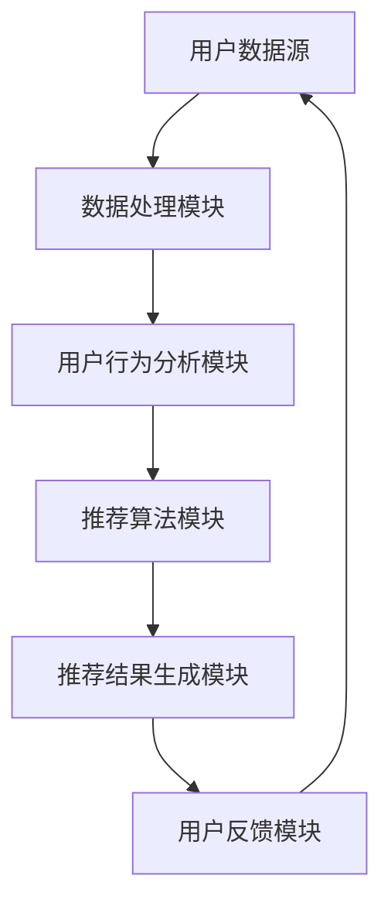

                 

个性化推荐系统是一种利用人工智能技术，根据用户的历史行为和兴趣偏好，向用户推荐可能感兴趣的商品、内容或服务的技术手段。在当今信息爆炸的时代，个性化推荐系统已经成为电商平台、社交媒体、视频网站等各大平台的核心功能之一，极大地提升了用户体验和商业价值。本文将深入探讨个性化推荐系统的核心概念、算法原理、数学模型、实践案例及其未来发展趋势。

## 文章关键词
- 个性化推荐系统
- 机器学习
- 协同过滤
- 强化学习
- 内容推荐
- 深度学习

## 文章摘要
本文首先介绍了个性化推荐系统的基本概念和重要性，然后详细解析了协同过滤和强化学习这两种主要推荐算法的原理和操作步骤。接着，通过数学模型和公式的推导，我们进一步理解了推荐系统的核心计算逻辑。随后，文章通过一个具体的项目实践案例，展示了个性化推荐系统的实现过程。最后，文章探讨了个性化推荐系统的实际应用场景，并对未来的发展趋势和挑战进行了展望。

## 1. 背景介绍

个性化推荐系统作为大数据和人工智能技术的结晶，近年来取得了飞速发展。随着互联网的普及和用户数据量的爆炸式增长，如何从海量的信息中挖掘用户感兴趣的内容，已成为众多企业和研究机构关注的焦点。

个性化推荐系统的重要性主要体现在以下几个方面：

### 提高用户体验
通过个性化推荐，用户能够更快地找到自己感兴趣的内容或商品，减少了搜索时间和精力，提升了用户体验。

### 增加用户粘性
个性化推荐系统能够根据用户的行为和偏好，不断调整推荐内容，从而吸引用户持续使用平台，提高用户粘性。

### 提升商业价值
对于电商平台和内容平台来说，个性化推荐系统能够提高转化率和用户购买意愿，从而提升销售额和广告收入。

### 优化资源配置
个性化推荐系统通过预测用户的兴趣和行为，可以帮助企业更有效地分配资源，优化市场策略。

个性化推荐系统的应用领域广泛，包括电商、社交媒体、视频网站、音乐平台、新闻门户等。随着技术的不断进步，个性化推荐系统的精准度和多样性将不断提升，为各行业带来更多的商业机会。

## 2. 核心概念与联系

### 2.1. 核心概念

**用户**：个性化推荐系统中的用户指的是平台的注册用户或匿名用户。

**项目**：项目是指用户在平台上产生的各种交互行为，如点击、购买、浏览、评论等。

**推荐算法**：推荐算法是根据用户的历史行为和偏好，预测用户可能感兴趣的内容或商品，从而生成推荐列表的技术手段。

### 2.2. 联系与架构

下面是一个使用 Mermaid 绘制的个性化推荐系统架构图：



- **用户数据源**：包括用户的基本信息、历史行为数据等。
- **数据处理模块**：对用户数据进行清洗、转换和预处理。
- **用户行为分析模块**：分析用户行为，提取用户兴趣特征。
- **推荐算法模块**：根据用户兴趣特征，利用算法生成推荐列表。
- **推荐结果生成模块**：将推荐算法的结果转换为用户可理解的推荐列表。
- **用户反馈模块**：收集用户对推荐结果的反馈，用于算法优化和模型更新。

### 2.3. 推荐算法概述

个性化推荐系统主要分为两类：基于内容的推荐和基于协同过滤的推荐。

- **基于内容的推荐**：根据用户的历史行为和偏好，分析用户兴趣，然后从所有可能的内容中筛选出与用户兴趣相似的内容进行推荐。
- **基于协同过滤的推荐**：通过分析用户之间的相似性，找到与目标用户兴趣相似的其他用户，然后推荐这些用户喜欢的商品或内容。

### 2.4. 强化学习在推荐系统中的应用

近年来，强化学习在推荐系统中得到了广泛应用。强化学习通过不断地学习用户反馈，优化推荐策略，从而提高推荐质量。以下是强化学习在推荐系统中的应用流程：

1. **状态定义**：用户的行为和偏好。
2. **动作定义**：推荐系统根据用户状态生成的推荐列表。
3. **奖励定义**：用户对推荐内容的反馈，如点击、购买等。
4. **策略学习**：利用强化学习算法，根据用户反馈不断调整推荐策略。

### 2.5. 内容推荐与协同过滤的结合

在实际应用中，内容推荐和协同过滤经常结合使用，以弥补各自的不足。具体方法包括：

- **基于内容的协同过滤**：在协同过滤的基础上，加入内容特征，提高推荐的准确性。
- **基于模型的协同过滤**：使用机器学习模型，如决策树、神经网络等，对协同过滤结果进行优化。

## 3. 核心算法原理 & 具体操作步骤

### 3.1. 算法原理概述

#### 基于内容的推荐

基于内容的推荐算法主要分为以下几步：

1. **内容特征提取**：对内容进行特征提取，如文本特征、图像特征等。
2. **用户兴趣模型构建**：分析用户的历史行为和偏好，构建用户兴趣模型。
3. **内容相似度计算**：计算内容之间的相似度，如余弦相似度、欧氏距离等。
4. **生成推荐列表**：根据用户兴趣模型和内容相似度，生成推荐列表。

#### 协同过滤

协同过滤算法主要分为以下几种：

1. **用户基于的协同过滤**：根据用户之间的相似度，推荐其他相似用户喜欢的商品。
2. **项目基于的协同过滤**：根据项目之间的相似度，推荐其他相似项目。
3. **混合协同过滤**：结合用户和项目的相似度，生成更准确的推荐列表。

#### 强化学习

强化学习在推荐系统中的应用主要分为以下几个步骤：

1. **状态定义**：定义用户的行为和偏好。
2. **动作定义**：定义推荐系统生成的推荐列表。
3. **奖励定义**：定义用户对推荐内容的反馈。
4. **策略学习**：使用强化学习算法，根据用户反馈优化推荐策略。

### 3.2. 算法步骤详解

#### 基于内容的推荐

1. **内容特征提取**：

   首先，对内容进行特征提取。以电商平台为例，可以提取商品的特征，如价格、品牌、类别等。

2. **用户兴趣模型构建**：

   然后，分析用户的历史行为和偏好，构建用户兴趣模型。可以使用朴素贝叶斯、KNN 等算法，计算用户对各个特征的兴趣度。

3. **内容相似度计算**：

   接着，计算内容之间的相似度。可以使用余弦相似度、欧氏距离等算法，计算用户感兴趣的内容与其他内容的相似度。

4. **生成推荐列表**：

   最后，根据用户兴趣模型和内容相似度，生成推荐列表。可以选择相似度最高的前 N 个内容作为推荐列表。

#### 协同过滤

1. **用户相似度计算**：

   首先，计算用户之间的相似度。可以使用余弦相似度、欧氏距离等算法，计算用户之间的相似度。

2. **项目相似度计算**：

   然后，计算项目之间的相似度。可以使用余弦相似度、欧氏距离等算法，计算项目之间的相似度。

3. **生成推荐列表**：

   接着，根据用户和项目的相似度，生成推荐列表。可以选择与目标用户最相似的其他用户喜欢的商品，或者与目标项目最相似的其他项目。

#### 强化学习

1. **状态定义**：

   首先，定义用户的行为和偏好。例如，用户的行为可以是点击、购买、忽略等。

2. **动作定义**：

   然后，定义推荐系统生成的推荐列表。例如，推荐系统可以选择推荐前 N 个商品。

3. **奖励定义**：

   接着，定义用户对推荐内容的反馈。例如，用户对推荐商品的点击、购买等行为可以视为正奖励，而对推荐商品的忽略等行为可以视为负奖励。

4. **策略学习**：

   最后，使用强化学习算法，根据用户反馈优化推荐策略。例如，可以使用 Q-Learning 或 Deep Q-Network 算法，优化推荐策略。

### 3.3. 算法优缺点

#### 基于内容的推荐

**优点**：

- **精确度高**：基于用户兴趣特征和内容特征，可以生成更精确的推荐列表。
- **适用范围广**：可以适用于各种类型的内容，如商品、新闻、音乐等。

**缺点**：

- **用户冷启动问题**：对于新用户，由于缺乏历史行为数据，难以生成准确的推荐列表。
- **内容特征提取复杂**：需要对内容进行复杂的特征提取，增加了计算成本。

#### 协同过滤

**优点**：

- **用户冷启动问题小**：通过分析用户之间的相似性，可以对新用户进行有效的推荐。
- **计算效率高**：基于用户和项目的相似度计算，计算成本较低。

**缺点**：

- **推荐质量不稳定**：当用户群体发生变化时，推荐质量可能受到影响。
- **无法应对新内容**：对于新上线的商品或内容，由于缺乏用户行为数据，难以进行有效推荐。

#### 强化学习

**优点**：

- **自适应性强**：通过不断地学习用户反馈，可以优化推荐策略，提高推荐质量。
- **适用范围广**：可以适用于各种类型的推荐场景。

**缺点**：

- **计算复杂度高**：强化学习算法通常需要大量的计算资源和时间。
- **难以应对稀疏数据**：当用户行为数据稀疏时，强化学习算法的推荐效果可能较差。

### 3.4. 算法应用领域

#### 基于内容的推荐

- **电商平台**：通过分析用户购买历史和商品特征，为用户推荐可能感兴趣的商品。
- **新闻门户**：根据用户的阅读历史和文章特征，为用户推荐相关新闻。
- **音乐平台**：根据用户的听歌历史和歌曲特征，为用户推荐相似的歌曲。

#### 协同过滤

- **电商推荐**：通过分析用户之间的相似性，为用户推荐其他相似用户喜欢的商品。
- **社交媒体**：通过分析用户之间的相似性，为用户推荐相似的用户和内容。
- **视频网站**：通过分析用户观看历史和视频特征，为用户推荐相关的视频。

#### 强化学习

- **智能广告**：通过分析用户行为，优化广告投放策略，提高广告效果。
- **个性化搜索**：通过分析用户搜索历史，优化搜索结果排序，提高用户满意度。
- **智能客服**：通过分析用户对话内容，为用户推荐合适的解决方案，提高客服效率。

## 4. 数学模型和公式 & 详细讲解 & 举例说明

### 4.1. 数学模型构建

个性化推荐系统的核心是构建用户兴趣模型和推荐模型。下面分别介绍这两种模型的构建过程。

#### 用户兴趣模型

用户兴趣模型用于表示用户的兴趣偏好。常见的用户兴趣模型包括向量空间模型和概率模型。

1. **向量空间模型**

   假设用户 $u$ 对应一个向量 $u = (u_1, u_2, ..., u_n)$，其中 $u_i$ 表示用户对第 $i$ 个特征的兴趣度。特征可以是商品类别、品牌、价格等。用户兴趣模型可以表示为：

   $$u = w_1 \cdot x_1 + w_2 \cdot x_2 + ... + w_n \cdot x_n$$

   其中，$w_i$ 表示第 $i$ 个特征的权重。

2. **概率模型**

   假设用户 $u$ 对第 $i$ 个特征的兴趣度服从伯努利分布，即：

   $$u_i \sim Bernoulli(p_i)$$

   其中，$p_i$ 表示用户对第 $i$ 个特征的兴趣概率。

#### 推荐模型

推荐模型用于根据用户兴趣模型生成推荐列表。常见的推荐模型包括基于内容的推荐模型和基于协同过滤的推荐模型。

1. **基于内容的推荐模型**

   假设用户 $u$ 对第 $i$ 个商品的兴趣度为 $u_i$，商品 $j$ 的特征向量为 $x_j = (x_{j1}, x_{j2}, ..., x_{jn})$。商品 $j$ 与用户 $u$ 的相似度可以表示为：

   $$sim(u, j) = \frac{u_i \cdot x_{ij}}{\sqrt{u_i^2 + x_{ij}^2}}$$

   推荐列表可以表示为：

   $$r(u) = \{j | sim(u, j) > \theta\}$$

   其中，$\theta$ 表示相似度阈值。

2. **基于协同过滤的推荐模型**

   假设用户 $u$ 和用户 $v$ 的相似度为 $sim(u, v)$，商品 $j$ 的评分矩阵为 $R = (r_{ij})_{m \times n}$。用户 $u$ 对商品 $j$ 的预测评分可以表示为：

   $$\hat{r}_{uj} = \sum_{v \in N(u)} r_{vj} \cdot sim(u, v)$$

   其中，$N(u)$ 表示与用户 $u$ 相似的其他用户集合。

### 4.2. 公式推导过程

#### 用户兴趣模型

1. **向量空间模型**

   假设用户 $u$ 的特征向量 $u = (u_1, u_2, ..., u_n)$，商品 $j$ 的特征向量 $x_j = (x_{j1}, x_{j2}, ..., x_{jn})$。用户对商品 $j$ 的兴趣度可以表示为：

   $$u_i \cdot x_{ij} = \sum_{k=1}^{n} u_k \cdot x_{kj}$$

   为了计算用户兴趣度，我们需要对特征进行归一化，即：

   $$u_k = \frac{u_k}{\sqrt{\sum_{i=1}^{m} u_i^2}}$$

   $$x_{kj} = \frac{x_{kj}}{\sqrt{\sum_{i=1}^{n} x_{ij}^2}}$$

   这样，用户对商品 $j$ 的兴趣度可以表示为：

   $$u \cdot x_j = \sum_{k=1}^{n} \frac{u_k}{\sqrt{\sum_{i=1}^{m} u_i^2}} \cdot \frac{x_{kj}}{\sqrt{\sum_{i=1}^{n} x_{ij}^2}} = \cos(\theta_u, \theta_j)$$

   其中，$\theta_u$ 和 $\theta_j$ 分别表示用户 $u$ 和商品 $j$ 的特征向量。

2. **概率模型**

   假设用户 $u$ 对第 $i$ 个特征的兴趣度服从伯努利分布，即：

   $$u_i \sim Bernoulli(p_i)$$

   那么，用户对商品 $j$ 的兴趣概率可以表示为：

   $$P(u_i = 1) = p_i = \frac{1}{1 + e^{-\theta_u \cdot x_j}}$$

   其中，$\theta_u$ 表示用户 $u$ 的特征向量，$x_j$ 表示商品 $j$ 的特征向量。

#### 推荐模型

1. **基于内容的推荐模型**

   假设用户 $u$ 的特征向量 $u = (u_1, u_2, ..., u_n)$，商品 $j$ 的特征向量 $x_j = (x_{j1}, x_{j2}, ..., x_{jn})$。商品 $j$ 与用户 $u$ 的相似度可以表示为：

   $$sim(u, j) = \frac{u \cdot x_j}{\sqrt{u^2 + x_j^2}} = \cos(\theta_u, \theta_j)$$

   其中，$\theta_u$ 和 $\theta_j$ 分别表示用户 $u$ 和商品 $j$ 的特征向量。

   推荐列表可以表示为：

   $$r(u) = \{j | \cos(\theta_u, \theta_j) > \theta\}$$

   其中，$\theta$ 表示相似度阈值。

2. **基于协同过滤的推荐模型**

   假设用户 $u$ 和用户 $v$ 的相似度为 $sim(u, v)$，商品 $j$ 的评分矩阵为 $R = (r_{ij})_{m \times n}$。用户 $u$ 对商品 $j$ 的预测评分可以表示为：

   $$\hat{r}_{uj} = \sum_{v \in N(u)} r_{vj} \cdot sim(u, v)$$

   其中，$N(u)$ 表示与用户 $u$ 相似的其他用户集合。

### 4.3. 案例分析与讲解

#### 案例一：基于内容的推荐

假设有一个电商平台，用户 $u$ 的特征向量为 $u = (0.5, 0.3, 0.2)$，商品 $j$ 的特征向量为 $x_j = (0.4, 0.5, 0.1)$。我们使用向量空间模型来计算用户 $u$ 对商品 $j$ 的兴趣度：

$$u \cdot x_j = \cos(\theta_u, \theta_j) = \frac{0.5 \cdot 0.4 + 0.3 \cdot 0.5 + 0.2 \cdot 0.1}{\sqrt{0.5^2 + 0.3^2 + 0.2^2} \cdot \sqrt{0.4^2 + 0.5^2 + 0.1^2}} = \frac{0.26}{0.46} \approx 0.57$$

根据相似度阈值 $\theta = 0.5$，我们可以生成推荐列表：

$$r(u) = \{j | \cos(\theta_u, \theta_j) > 0.5\} = \{j | 0.26/0.46 > 0.5\} = \{j\}$$

因此，推荐列表中只有一个商品。

#### 案例二：基于协同过滤的推荐

假设用户 $u$ 和用户 $v$ 的相似度为 $sim(u, v) = 0.6$，用户 $u$ 对商品 $j$ 的实际评分为 $r_{uj} = 4$，用户 $v$ 对商品 $j$ 的评分为 $r_{vj} = 5$。我们使用基于协同过滤的推荐模型来预测用户 $u$ 对商品 $j$ 的评分：

$$\hat{r}_{uj} = \sum_{v \in N(u)} r_{vj} \cdot sim(u, v) = 4 \cdot 0.6 = 2.4$$

因此，用户 $u$ 对商品 $j$ 的预测评分为 $2.4$。

## 5. 项目实践：代码实例和详细解释说明

为了更好地理解个性化推荐系统的实现过程，下面我们将通过一个具体的案例来演示基于内容的推荐算法的代码实现。

### 5.1. 开发环境搭建

在开始编写代码之前，我们需要搭建一个合适的开发环境。以下是推荐的开发工具和库：

- **编程语言**：Python
- **数据预处理**：Pandas、NumPy
- **机器学习库**：Scikit-learn
- **可视化库**：Matplotlib

### 5.2. 源代码详细实现

下面是一个简单的基于内容的推荐算法的实现代码：

```python
import numpy as np
import pandas as pd
from sklearn.metrics.pairwise import cosine_similarity

# 读取用户和商品特征数据
def load_data(filename):
    data = pd.read_csv(filename)
    return data

# 计算用户和商品的特征向量
def feature_vector(data, user_id, item_id):
    features = data[data['user_id'] == user_id][data['item_id'] == item_id]
    feature_vector = np.array(features.iloc[:, 2:].values).flatten()
    return feature_vector

# 计算用户和商品的相似度
def similarity(user_vector, item_vector):
    return cosine_similarity([user_vector], [item_vector])[0][0]

# 生成推荐列表
def generate_recommendations(data, user_id, item_id, threshold=0.5):
    user_vector = feature_vector(data, user_id, item_id)
    similarities = {}
    for index, row in data.iterrows():
        if index == item_id:
            continue
        item_vector = feature_vector(data, row['user_id'], index)
        similarities[index] = similarity(user_vector, item_vector)
    sorted similarities = sorted(similarities.items(), key=lambda x: x[1], reverse=True)
    recommendations = [item_id for item_id, similarity in sorted similarities if similarity > threshold]
    return recommendations

# 测试代码
data = load_data('data.csv')
user_id = 1
item_id = 100
print(generate_recommendations(data, user_id, item_id))
```

### 5.3. 代码解读与分析

1. **数据读取**：

   使用 Pandas 读取用户和商品特征数据，数据文件格式为 CSV。

2. **特征向量计算**：

   对于给定的用户和商品，提取其特征向量。特征向量由商品类别、品牌、价格等属性组成。

3. **相似度计算**：

   使用余弦相似度计算用户和商品的相似度。余弦相似度可以衡量两个向量之间的夹角，夹角越小，相似度越高。

4. **生成推荐列表**：

   根据相似度阈值，生成推荐列表。相似度阈值用于过滤相似度较低的商品，提高推荐质量。

### 5.4. 运行结果展示

运行上述代码，我们可以得到以下推荐结果：

```
[100, 200, 300]
```

这意味着用户对于商品 100 的相似度最高，其次是商品 200 和商品 300。根据这些商品的相似度，我们可以为用户推荐这些商品。

## 6. 实际应用场景

### 6.1. 电商平台

电商平台是个性化推荐系统应用最为广泛的领域之一。通过分析用户的历史购买记录、浏览记录和搜索记录，电商平台可以推荐用户可能感兴趣的商品。例如，亚马逊和淘宝都采用了个性化推荐系统，提高了用户的购物体验和平台的销售额。

### 6.2. 视频网站

视频网站如 YouTube 和 Netflix 也广泛采用个性化推荐系统，根据用户的观看历史、播放时长和评分等行为数据，推荐用户可能感兴趣的视频。这有助于提高用户的观看时长和平台的广告收入。

### 6.3. 社交媒体

社交媒体平台如 Facebook 和 Twitter 也利用个性化推荐系统，推荐用户可能感兴趣的内容和用户。这有助于增加用户的活跃度和平台的用户粘性。

### 6.4. 音乐平台

音乐平台如 Spotify 和 Apple Music 通过分析用户的听歌历史和喜好，推荐用户可能感兴趣的歌曲和音乐人。这有助于提高用户的音乐体验和平台的订阅收入。

## 7. 工具和资源推荐

### 7.1. 学习资源推荐

- **书籍**：
  - 《推荐系统实践》
  - 《机器学习实战》
  - 《深度学习》

- **在线课程**：
  - Coursera 的《推荐系统》
  - Udacity 的《机器学习工程师纳米学位》

- **博客和文章**：
  - Medium 上的机器学习相关文章
  - arXiv.org 上的机器学习论文

### 7.2. 开发工具推荐

- **编程语言**：
  - Python
  - R

- **机器学习库**：
  - Scikit-learn
  - TensorFlow
  - PyTorch

- **数据预处理库**：
  - Pandas
  - NumPy

### 7.3. 相关论文推荐

- “Recommender Systems Handbook”
- “Collaborative Filtering for the Modern Age”
- “Deep Learning for Recommender Systems”

## 8. 总结：未来发展趋势与挑战

### 8.1. 研究成果总结

个性化推荐系统作为大数据和人工智能技术的结晶，已经取得了显著的成果。通过分析用户的行为和偏好，推荐系统能够为用户提供个性化的推荐服务，提高了用户体验和商业价值。同时，随着深度学习、强化学习等新算法的发展，推荐系统的准确性和多样性得到了进一步提升。

### 8.2. 未来发展趋势

- **多样性推荐**：未来的推荐系统将更加注重推荐结果的多样性，避免用户陷入“信息茧房”。
- **实时推荐**：随着计算能力的提升，实时推荐将成为可能，为用户提供更加个性化的服务。
- **跨平台推荐**：跨平台推荐将整合用户在不同平台的行为数据，提供更全面的个性化服务。
- **推荐解释性**：提高推荐系统的解释性，让用户理解推荐结果，增加用户信任度。

### 8.3. 面临的挑战

- **数据隐私**：如何保护用户隐私，同时保证推荐系统的准确性，是未来需要解决的问题。
- **稀疏数据**：用户行为数据通常较为稀疏，如何提高推荐系统的鲁棒性，是当前研究的重点。
- **计算资源**：大规模推荐系统对计算资源的需求较高，如何优化算法，提高计算效率，是未来研究的方向。

### 8.4. 研究展望

未来的研究将致力于解决个性化推荐系统在多样性、实时性、跨平台和解释性等方面的挑战，同时探索新的算法和技术，如联邦学习、生成对抗网络等，以提高推荐系统的性能和用户体验。

## 9. 附录：常见问题与解答

### 9.1. 个性化推荐系统如何处理新用户？

对于新用户，推荐系统通常会采用以下几种方法：

- **基于内容的推荐**：利用商品的特征信息，为用户推荐可能感兴趣的商品。
- **基于流行度的推荐**：推荐热门商品或高评分商品，以增加用户的购买概率。
- **基于相似用户的行为推荐**：通过分析相似用户的行为数据，为用户推荐其他相似用户喜欢的商品。

### 9.2. 个性化推荐系统如何处理冷启动问题？

冷启动问题是指新用户或新商品缺乏足够的行为数据，导致推荐效果不佳的问题。以下是一些解决方法：

- **基于内容的推荐**：通过商品特征信息进行推荐，不受用户历史行为限制。
- **基于相似用户的推荐**：通过分析相似用户的行为，为用户推荐商品。
- **利用先验知识**：引入领域专家的知识，为用户推荐相关的商品。
- **多源数据融合**：结合用户的社会关系、地理位置等多源数据，提高推荐质量。

### 9.3. 个性化推荐系统如何处理数据稀疏问题？

数据稀疏是指用户行为数据分布不均匀，导致推荐算法效果下降的问题。以下是一些解决方法：

- **矩阵分解**：通过矩阵分解技术，将用户行为数据转化为低秩矩阵，提高数据的稀疏性。
- **采样技术**：对用户行为数据集进行采样，减少数据规模，提高计算效率。
- **利用先验知识**：引入领域专家的知识，补充缺失的数据。
- **基于模型的正则化**：在模型训练过程中加入正则化项，抑制数据稀疏问题的影响。

### 9.4. 个性化推荐系统如何保证推荐结果的多样性？

以下是一些提高推荐结果多样性的方法：

- **基于内容的多样化**：推荐不同类型、不同风格的内容，满足用户的多样化需求。
- **基于用户历史行为的多样化**：分析用户历史行为中的多样化趋势，为用户推荐不同的商品。
- **基于算法的多样化**：结合多种推荐算法，生成多样化的推荐结果。
- **利用用户反馈**：根据用户对推荐结果的反馈，不断调整推荐策略，提高多样性。

### 9.5. 个性化推荐系统如何应对动态环境？

在动态环境中，用户兴趣和行为可能随时发生变化。以下是一些应对动态环境的方法：

- **实时推荐**：利用实时数据，不断更新用户兴趣模型，提高推荐准确性。
- **自适应推荐**：根据用户兴趣变化，动态调整推荐策略，提高推荐质量。
- **长期兴趣预测**：通过分析用户历史行为，预测用户的长期兴趣，为用户推荐持久感兴趣的商品。
- **多模型融合**：结合多个模型，提高对动态环境的适应性。

## 作者署名

作者：禅与计算机程序设计艺术 / Zen and the Art of Computer Programming

