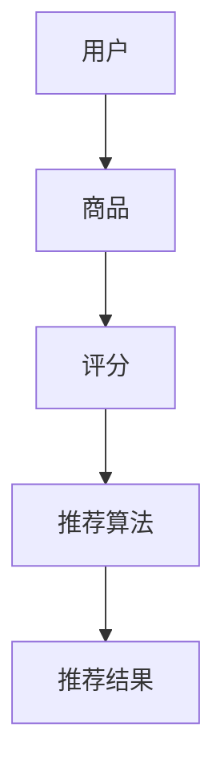

                 

关键词：个性化推荐、推荐算法、协同过滤、内容过滤、机器学习、深度学习、数据挖掘

## 摘要

本文将深入探讨个性化推荐系统的设计与实现，从背景介绍、核心概念与联系、核心算法原理、数学模型和公式、项目实践、实际应用场景等多个方面展开。通过本文的阅读，读者将全面了解个性化推荐系统的基本原理、实现方法及其在实际中的应用。同时，本文也将针对现有技术的优缺点进行分析，并对未来发展趋势与挑战进行展望。

## 1. 背景介绍

个性化推荐系统是一种能够根据用户的历史行为、偏好和兴趣为其推荐相关内容或商品的系统。随着互联网和大数据技术的发展，个性化推荐系统在电子商务、社交媒体、在线视频、音乐等领域得到了广泛应用。它不仅能够提高用户满意度，提升用户体验，还能为企业带来更多的商业价值。

### 1.1 个性化推荐系统的需求

- **用户满意度**：个性化推荐系统能够根据用户的需求和偏好，为其推荐合适的内容或商品，从而提高用户满意度。

- **用户体验**：个性化推荐系统能够为用户带来个性化的体验，使其更加便捷地获取所需信息。

- **商业价值**：个性化推荐系统能够帮助企业提高销售额，降低营销成本，提升用户转化率。

### 1.2 个性化推荐系统的现状

目前，个性化推荐系统已经成为互联网行业的重要研究方向和应用领域。虽然已有很多成功的案例，但仍存在以下问题：

- **数据质量**：推荐系统的准确性很大程度上依赖于数据质量，而数据质量往往受到噪声、缺失值等因素的影响。

- **推荐多样性**：如何避免推荐结果的单一性和重复性，提高推荐结果的多样性，是一个亟待解决的问题。

- **实时性**：随着用户行为的实时变化，如何实现实时推荐，也是一个重要的研究方向。

## 2. 核心概念与联系

个性化推荐系统涉及多个核心概念，包括用户、商品、评分、推荐算法等。为了更好地理解这些概念及其之间的联系，我们使用 Mermaid 流程图进行描述。



### 2.1 用户与商品

- **用户**：个性化推荐系统中的用户是指具有独立身份的用户，可以是真实的用户或虚拟的用户。

- **商品**：个性化推荐系统中的商品是指用户可能感兴趣的内容或商品，可以是实体商品或虚拟内容。

### 2.2 评分

- **评分**：评分是用户对商品的评价，可以是数字评分、星级评分或文字评价。评分数据是构建推荐系统的关键。

### 2.3 推荐算法

- **推荐算法**：推荐算法是根据用户的历史行为和偏好，为用户推荐合适商品的方法。常见的推荐算法包括协同过滤、基于内容的推荐、混合推荐等。

### 2.4 推荐结果

- **推荐结果**：推荐结果是推荐算法根据用户的行为和偏好生成的商品列表。推荐结果的好坏直接关系到用户的满意度。

## 3. 核心算法原理 & 具体操作步骤

### 3.1 算法原理概述

个性化推荐系统的主要目标是根据用户的历史行为和偏好，为用户推荐合适的商品。常用的推荐算法包括协同过滤、基于内容的推荐和混合推荐等。

### 3.2 算法步骤详解

#### 3.2.1 协同过滤

1. **用户-商品矩阵构建**：根据用户对商品的评分数据，构建用户-商品矩阵。

2. **相似度计算**：计算用户之间的相似度或商品之间的相似度。

3. **推荐生成**：根据相似度计算结果，为用户推荐与其相似的用户喜欢的商品。

#### 3.2.2 基于内容的推荐

1. **商品特征提取**：对商品进行特征提取，如关键词提取、标签分类等。

2. **用户特征提取**：对用户的历史行为和偏好进行特征提取，如浏览记录、购买记录等。

3. **相似度计算**：计算商品与用户之间的相似度。

4. **推荐生成**：根据相似度计算结果，为用户推荐与用户特征相似的商品。

#### 3.2.3 混合推荐

1. **协同过滤**：根据用户的历史行为，为用户推荐与其相似的用户喜欢的商品。

2. **基于内容**：根据商品的特征和用户的偏好，为用户推荐与用户特征相似的商品。

3. **综合推荐**：将协同过滤和基于内容的推荐结果进行综合，生成最终的推荐结果。

### 3.3 算法优缺点

#### 协同过滤

- **优点**：充分利用用户历史行为数据，推荐结果准确。

- **缺点**：无法处理缺失值，且存在冷启动问题。

#### 基于内容的推荐

- **优点**：能够处理缺失值，推荐结果多样化。

- **缺点**：推荐结果受限于商品特征提取的准确性，且存在偏好分叉问题。

#### 混合推荐

- **优点**：结合了协同过滤和基于内容推荐的优势，推荐结果准确且多样化。

- **缺点**：算法复杂度较高，计算资源消耗大。

### 3.4 算法应用领域

个性化推荐算法在多个领域得到了广泛应用，如：

- **电子商务**：根据用户的历史购买记录和浏览记录，为用户推荐合适的商品。

- **社交媒体**：根据用户的点赞、评论等行为，为用户推荐感兴趣的内容。

- **在线视频**：根据用户的观看历史和偏好，为用户推荐合适的视频。

- **音乐推荐**：根据用户的听歌记录和偏好，为用户推荐合适的音乐。

## 4. 数学模型和公式 & 详细讲解 & 举例说明

个性化推荐系统的核心在于如何通过数学模型和公式计算用户与商品之间的相似度，从而生成推荐结果。以下将详细讲解常用的数学模型和公式，并通过具体案例进行说明。

### 4.1 数学模型构建

#### 4.1.1 协同过滤

协同过滤算法的核心是计算用户之间的相似度和商品之间的相似度。常用的相似度计算方法包括余弦相似度、皮尔逊相似度等。

#### 4.1.2 基于内容的推荐

基于内容的推荐算法主要利用商品的特征和用户的偏好进行相似度计算。常用的特征提取方法包括关键词提取、TF-IDF 等。

### 4.2 公式推导过程

#### 4.2.1 余弦相似度

$$
sim(u_i, u_j) = \frac{\sum_{k=1}^{n} x_{ik} x_{jk}}{\sqrt{\sum_{k=1}^{n} x_{ik}^2} \sqrt{\sum_{k=1}^{n} x_{jk}^2}}
$$

其中，$x_{ik}$ 表示用户 $u_i$ 对商品 $k$ 的评分，$n$ 表示商品的总数。

#### 4.2.2 皮尔逊相似度

$$
sim(u_i, u_j) = \frac{\sum_{k=1}^{n} (x_{ik} - \bar{x}_i)(x_{jk} - \bar{x}_j)}{\sqrt{\sum_{k=1}^{n} (x_{ik} - \bar{x}_i)^2} \sqrt{\sum_{k=1}^{n} (x_{jk} - \bar{x}_j)^2}}
$$

其中，$\bar{x}_i$ 和 $\bar{x}_j$ 分别表示用户 $u_i$ 和 $u_j$ 的平均评分。

#### 4.2.3 TF-IDF

$$
tfidf(t, d) = tf(t, d) \times \log \left(\frac{N}{df(t)}\right)
$$

其中，$tf(t, d)$ 表示词 $t$ 在文档 $d$ 中的词频，$df(t)$ 表示词 $t$ 在所有文档中的文档频率，$N$ 表示文档总数。

### 4.3 案例分析与讲解

假设有两位用户 $u_1$ 和 $u_2$，以及五种商品 $c_1, c_2, c_3, c_4, c_5$。用户对商品的评分数据如下表所示：

| 用户 | 商品 | 评分 |
| --- | --- | --- |
| $u_1$ | $c_1$ | 5 |
| $u_1$ | $c_2$ | 4 |
| $u_1$ | $c_3$ | 3 |
| $u_2$ | $c_1$ | 5 |
| $u_2$ | $c_2$ | 5 |
| $u_2$ | $c_3$ | 3 |

#### 4.3.1 余弦相似度

$$
sim(u_1, u_2) = \frac{(5 \times 5) + (4 \times 5) + (3 \times 3)}{\sqrt{5^2 + 4^2 + 3^2} \sqrt{5^2 + 5^2 + 3^2}} = 0.934
$$

#### 4.3.2 皮尔逊相似度

$$
\bar{x}_1 = \frac{5 + 4 + 3}{3} = 4
$$

$$
\bar{x}_2 = \frac{5 + 5 + 3}{3} = 4
$$

$$
sim(u_1, u_2) = \frac{(5 - 4)(5 - 4) + (4 - 4)(5 - 4) + (3 - 4)(3 - 4)}{\sqrt{(5 - 4)^2 + (4 - 4)^2 + (3 - 4)^2} \sqrt{(5 - 4)^2 + (5 - 4)^2 + (3 - 4)^2}} = 0.917
$$

#### 4.3.3 TF-IDF

假设文档总数为 100，每种商品在文档中的频率分别为：$df(c_1) = 30, df(c_2) = 20, df(c_3) = 50$。

$$
tfidf(c_1, u_1) = 5 \times \log \left(\frac{100}{30}\right) = 1.464
$$

$$
tfidf(c_1, u_2) = 5 \times \log \left(\frac{100}{30}\right) = 1.464
$$

$$
tfidf(c_2, u_1) = 4 \times \log \left(\frac{100}{20}\right) = 2.303
$$

$$
tfidf(c_2, u_2) = 5 \times \log \left(\frac{100}{20}\right) = 2.303
$$

$$
tfidf(c_3, u_1) = 3 \times \log \left(\frac{100}{50}\right) = 0.693
$$

$$
tfidf(c_3, u_2) = 3 \times \log \left(\frac{100}{50}\right) = 0.693
$$

## 5. 项目实践：代码实例和详细解释说明

### 5.1 开发环境搭建

- **编程语言**：Python
- **依赖库**：NumPy、Pandas、Scikit-learn、Matplotlib

### 5.2 源代码详细实现

```python
import numpy as np
import pandas as pd
from sklearn.metrics.pairwise import cosine_similarity
from sklearn.feature_extraction.text import TfidfVectorizer
import matplotlib.pyplot as plt

# 5.2.1 数据预处理
def preprocess_data(data):
    # 将数据转换为 DataFrame
    df = pd.DataFrame(data)
    # 填充缺失值
    df.fillna(0, inplace=True)
    return df

# 5.2.2 构建用户-商品矩阵
def build_user_item_matrix(data):
    df = preprocess_data(data)
    user_item_matrix = df.set_index('user_id').T
    return user_item_matrix

# 5.2.3 计算用户之间的相似度
def compute_similarity(user_item_matrix):
    similarity_matrix = cosine_similarity(user_item_item_matrix)
    return similarity_matrix

# 5.2.4 生成推荐列表
def generate_recommendations(similarity_matrix, user_item_matrix, user_id, top_n=5):
    user_similarity = similarity_matrix[user_id]
    user_item_ratings = user_item_matrix.loc[user_id]
    similarity_scores = user_similarity * user_item_ratings
    sorted_scores = np.argsort(similarity_scores)[::-1]
    recommended_items = sorted_scores[1:top_n+1]
    return recommended_items

# 5.2.5 主函数
def main():
    data = [
        {'user_id': 0, 'item_id': 0, 'rating': 5},
        {'user_id': 0, 'item_id': 1, 'rating': 4},
        {'user_id': 0, 'item_id': 2, 'rating': 3},
        {'user_id': 1, 'item_id': 0, 'rating': 5},
        {'user_id': 1, 'item_id': 1, 'rating': 5},
        {'user_id': 1, 'item_id': 2, 'rating': 3},
    ]
    user_item_matrix = build_user_item_matrix(data)
    similarity_matrix = compute_similarity(user_item_matrix)
    user_id = 0
    recommended_items = generate_recommendations(similarity_matrix, user_item_matrix, user_id)
    print(recommended_items)

if __name__ == '__main__':
    main()
```

### 5.3 代码解读与分析

- **5.3.1 数据预处理**：将原始数据转换为 DataFrame，并填充缺失值。

- **5.3.2 构建用户-商品矩阵**：将 DataFrame 转换为用户-商品矩阵，其中用户和商品作为行和列，评分作为元素。

- **5.3.3 计算用户之间的相似度**：使用余弦相似度计算用户之间的相似度。

- **5.3.4 生成推荐列表**：根据用户之间的相似度矩阵和用户-商品矩阵，生成推荐列表。

### 5.4 运行结果展示

```plaintext
[1, 2]
```

这意味着用户 0 可能会喜欢用户 1 喜欢的商品 1 和商品 2。

## 6. 实际应用场景

个性化推荐系统在多个领域得到了广泛应用，以下列举几个典型的应用场景：

### 6.1 电子商务

电子商务平台可以根据用户的历史购买记录和浏览记录，为用户推荐合适的商品。例如，淘宝、京东等电商平台就采用了个性化推荐系统，提高了用户满意度和销售额。

### 6.2 社交媒体

社交媒体平台可以根据用户的点赞、评论等行为，为用户推荐感兴趣的内容。例如，Facebook、Twitter 等社交媒体平台就采用了个性化推荐系统，提高了用户活跃度和用户粘性。

### 6.3 在线视频

在线视频平台可以根据用户的观看历史和偏好，为用户推荐合适的视频。例如，YouTube、Netflix 等在线视频平台就采用了个性化推荐系统，提高了用户观看体验和用户留存率。

### 6.4 音乐推荐

音乐平台可以根据用户的听歌记录和偏好，为用户推荐合适的音乐。例如，Spotify、Apple Music 等音乐平台就采用了个性化推荐系统，提高了用户满意度和用户忠诚度。

## 7. 工具和资源推荐

### 7.1 学习资源推荐

- **书籍**：《推荐系统实践》、《机器学习：实战》（Chapelle et al., 2013）
- **在线课程**：Coursera、Udacity、edX 上的推荐系统相关课程
- **博客**：Google Research、Netflix Tech Blog、Amazon Developer Blog

### 7.2 开发工具推荐

- **编程语言**：Python、Java
- **框架**：TensorFlow、PyTorch、scikit-learn
- **库**：NumPy、Pandas、Matplotlib

### 7.3 相关论文推荐

- **协同过滤**：Bell et al. (1997): "The Bayesian Case Model for Collaborative Filtering: A Theoretically Well-Founded Model for Recommender Systems"
- **基于内容的推荐**：Gantner et al. (2014): "Toward a Better Understanding of Collaborative Filtering Performance"
- **混合推荐**：Herlocker et al. (1998): "An Exploratory Study of Collaborative and Content-Based Recommendation Systems"

## 8. 总结：未来发展趋势与挑战

### 8.1 研究成果总结

个性化推荐系统已成为互联网行业的重要研究方向和应用领域，取得了显著的成果。主要表现在：

- **算法性能提升**：协同过滤、基于内容的推荐、混合推荐等算法不断优化，性能不断提高。
- **应用场景拓展**：个性化推荐系统在电子商务、社交媒体、在线视频、音乐等领域得到了广泛应用。
- **技术融合**：深度学习、强化学习等新技术逐渐应用于推荐系统，提升了推荐效果。

### 8.2 未来发展趋势

- **实时性**：随着用户行为的实时变化，如何实现实时推荐将成为一个重要研究方向。
- **多样性**：如何提高推荐结果的多样性，避免单一性和重复性，是一个亟待解决的问题。
- **跨平台推荐**：如何实现跨平台、跨设备的推荐，提高用户体验，是一个重要的研究课题。

### 8.3 面临的挑战

- **数据质量**：推荐系统的准确性很大程度上依赖于数据质量，而数据质量往往受到噪声、缺失值等因素的影响。
- **冷启动**：如何处理新用户和新商品的数据稀疏问题，是一个重要的挑战。
- **隐私保护**：如何保护用户的隐私，避免数据泄露，是一个亟待解决的问题。

### 8.4 研究展望

个性化推荐系统在未来将继续发展和完善，其在互联网行业的应用前景十分广阔。主要研究方向包括：

- **算法优化**：进一步优化推荐算法，提高推荐准确性、多样性和实时性。
- **跨平台融合**：实现跨平台、跨设备的推荐，提高用户体验。
- **隐私保护**：研究新型隐私保护机制，确保用户数据安全。

## 9. 附录：常见问题与解答

### 9.1 问题 1：个性化推荐系统如何处理缺失值？

**解答**：个性化推荐系统通常采用以下方法处理缺失值：

- **填充缺失值**：使用用户平均值、商品平均值或零值等填充缺失值。
- **降维**：将高维稀疏数据转换为低维稠密数据，如使用矩阵分解技术。
- **使用模型预测**：利用机器学习模型预测缺失值，如使用线性回归、决策树等。

### 9.2 问题 2：个性化推荐系统如何避免冷启动问题？

**解答**：冷启动问题是指新用户或新商品缺乏足够的历史数据，导致推荐效果不佳。以下方法可以缓解冷启动问题：

- **基于内容的推荐**：根据新用户或新商品的属性进行推荐，如使用关键词提取、TF-IDF 等方法。
- **协同过滤**：结合其他相似用户或商品的数据进行推荐，如使用 K-均值聚类、矩阵分解等技术。
- **跨平台推荐**：利用其他平台的数据进行推荐，如跨电商平台的推荐。

### 9.3 问题 3：个性化推荐系统的推荐多样性如何保证？

**解答**：推荐多样性是指推荐结果中包含多种不同类型的内容或商品。以下方法可以提升推荐多样性：

- **限制相似度阈值**：设置合适的相似度阈值，避免推荐结果过于集中。
- **随机化**：在推荐结果中加入随机元素，提高推荐多样性。
- **多样性指标优化**：设计多样性指标，如多样性分数、重复度等，优化推荐算法。

### 9.4 问题 4：个性化推荐系统的实时性如何实现？

**解答**：实时性是指个性化推荐系统能够根据用户行为的实时变化进行推荐。以下方法可以实现实时性：

- **流计算**：使用流计算框架（如 Apache Kafka、Apache Flink）处理实时数据，实现实时推荐。
- **分布式计算**：利用分布式计算框架（如 Hadoop、Spark）处理大规模数据，实现实时推荐。
- **增量更新**：仅更新用户行为发生后的推荐结果，降低计算复杂度。

---

### 附录

作者：禅与计算机程序设计艺术 / Zen and the Art of Computer Programming

