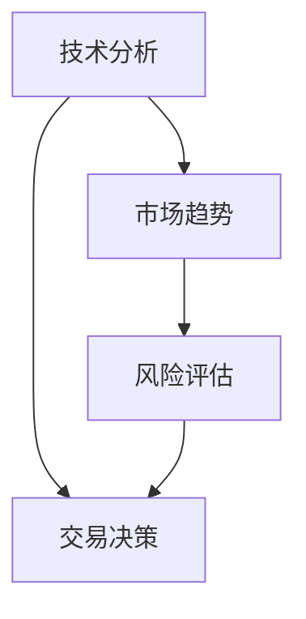

                 

关键词：投资收益、中观层面、算法、技术分析、市场趋势、风险评估

> 摘要：本文从技术角度探讨投资收益在中观层面（中期趋势与短期波动）的下降现象，分析其成因及应对策略。通过梳理相关算法、市场趋势和数学模型，结合实际案例，提出提高投资收益的建议和未来研究方向。

## 1. 背景介绍

在资本市场中，投资收益的波动是投资者面临的主要挑战之一。随着市场复杂度的增加和不确定性的加剧，投资者在追求高收益的同时，也需要面对风险。投资收益的下降可能源于多种因素，包括宏观经济环境、政策变化、市场情绪、技术进步等。在中观层面，即中期趋势与短期波动的交汇处，投资收益下降的现象尤为显著。

中观层面的投资策略通常涉及时间跨度在数周到数月之间，这一阶段的投资决策对于投资者而言至关重要。在这个时间段内，市场波动较大，技术因素对投资结果的影响显著。因此，本文旨在分析中观层面投资收益下降的成因，并提出相应的解决策略。

## 2. 核心概念与联系

为了深入理解中观层面的投资收益下降现象，我们需要先明确几个核心概念：技术分析、市场趋势、风险评估。

### 2.1. 技术分析

技术分析是通过对历史价格和交易量等数据进行分析，预测未来市场走势的方法。常用的技术分析工具包括趋势线、移动平均线、相对强弱指数（RSI）等。技术分析的核心在于寻找市场的规律性，以预测未来的价格变动。

### 2.2. 市场趋势

市场趋势是指市场价格在一定时间内所表现出的总体走势。市场趋势分为长期趋势、中期趋势和短期趋势。在中观层面，中期趋势与短期波动的互动对投资收益有重要影响。中期趋势反映了市场的整体方向，而短期波动则是由市场情绪、新闻事件等因素引起的短期价格变动。

### 2.3. 风险评估

风险评估是投资过程中不可或缺的一环。投资者需要评估投资对象的风险，并采取相应的风险管理策略。风险评估通常包括定量分析和定性分析，如历史波动率、贝塔系数等。

### 2.4. Mermaid 流程图

下面是一个简单的 Mermaid 流程图，展示了技术分析、市场趋势、风险评估三者之间的联系。



## 3. 核心算法原理 & 具体操作步骤

### 3.1. 算法原理概述

中观层面的投资策略通常采用技术分析为基础，结合市场趋势和风险评估进行综合分析。本文将介绍一种基于时间序列分析的方法，用于预测市场趋势和评估投资风险。

### 3.2. 算法步骤详解

#### 3.2.1. 数据收集与预处理

首先，收集过去一段时间（如一年）的价格数据、交易量数据等。然后，对数据进行预处理，包括数据清洗、缺失值填补、时间序列平稳性检验等。

#### 3.2.2. 趋势分析

使用移动平均线方法分析价格数据的趋势。移动平均线（MA）是技术分析中常用的一种工具，它通过计算一段时间内的平均价格来平滑价格序列。

$$
\text{MA}(n) = \frac{1}{n} \sum_{i=1}^{n} p_i
$$

其中，$n$ 为移动平均线的周期，$p_i$ 为第 $i$ 日的收盘价。

#### 3.2.3. 波动性评估

使用标准差（Standard Deviation, SD）评估价格数据的波动性。标准差是衡量数据离散程度的指标，它可以用来评估市场的风险。

$$
\text{SD} = \sqrt{\frac{1}{n-1} \sum_{i=1}^{n} (p_i - \bar{p})^2}
$$

其中，$\bar{p}$ 为价格序列的均值。

#### 3.2.4. 风险评估

结合移动平均线和标准差，对投资对象进行风险评估。如果价格高于移动平均线且标准差较低，则认为投资对象具有较低的风险。

#### 3.2.5. 交易决策

基于上述分析，制定交易决策。如果市场趋势向上且风险较低，则可以进行买入操作；反之，则可以考虑卖出。

### 3.3. 算法优缺点

#### 优点

- 简单易懂，易于实现。
- 可以有效地捕捉市场趋势和波动性。

#### 缺点

- 对历史数据的依赖性较大，可能无法适应市场的突变。
- 需要对参数进行调整，才能适应不同的市场环境。

### 3.4. 算法应用领域

该算法可以应用于股票、期货、外汇等金融市场的中观层面投资策略。在实际应用中，可以根据市场的具体情况，调整算法的参数，以提高投资收益。

## 4. 数学模型和公式 & 详细讲解 & 举例说明

### 4.1. 数学模型构建

在技术分析中，常用的数学模型包括趋势线模型、移动平均线模型和波动性模型。下面分别介绍这些模型的构建方法。

#### 趋势线模型

趋势线模型通过连接一系列的价格点，构建出价格的趋势。假设价格序列为 $p_1, p_2, ..., p_n$，则趋势线可以用以下方程表示：

$$
y = ax + b
$$

其中，$a$ 和 $b$ 是待定参数。通过最小二乘法，可以计算出趋势线的参数：

$$
a = \frac{\sum_{i=1}^{n} (p_i - y_i)x_i}{\sum_{i=1}^{n} x_i^2}
$$

$$
b = \frac{\sum_{i=1}^{n} (p_i - y_i)}{n}
$$

#### 移动平均线模型

移动平均线模型通过计算一段时间内的平均值，来平滑价格序列。假设移动平均线的周期为 $n$，则移动平均线可以用以下公式表示：

$$
\text{MA}(n) = \frac{1}{n} \sum_{i=1}^{n} p_i
$$

#### 波动性模型

波动性模型用于评估市场的波动程度。常用的波动性指标包括标准差、方差等。假设价格序列为 $p_1, p_2, ..., p_n$，则标准差可以用以下公式表示：

$$
\text{SD} = \sqrt{\frac{1}{n-1} \sum_{i=1}^{n} (p_i - \bar{p})^2}
$$

### 4.2. 公式推导过程

#### 趋势线模型的推导

首先，我们需要计算价格序列的均值：

$$
\bar{p} = \frac{1}{n} \sum_{i=1}^{n} p_i
$$

然后，计算价格序列的偏差：

$$
d_i = p_i - \bar{p}
$$

接下来，计算偏差的加权平均值：

$$
w_i = \frac{1}{n} \sum_{i=1}^{n} w_i d_i
$$

其中，$w_i$ 为权重。为了简化计算，我们可以取 $w_i = 1$。

最后，计算趋势线的斜率和截距：

$$
a = \frac{w_1 + w_2 + ... + w_n}{n} = \frac{1}{n}
$$

$$
b = \bar{p} - a \bar{x} = \bar{p} - a \frac{1}{n} \sum_{i=1}^{n} x_i
$$

#### 移动平均线模型的推导

移动平均线模型可以直接根据价格序列计算：

$$
\text{MA}(n) = \frac{1}{n} \sum_{i=1}^{n} p_i
$$

#### 波动性模型的推导

波动性模型可以通过计算价格序列的方差和标准差来表示：

$$
\text{VAR} = \frac{1}{n-1} \sum_{i=1}^{n} (p_i - \bar{p})^2
$$

$$
\text{SD} = \sqrt{\text{VAR}}
$$

### 4.3. 案例分析与讲解

假设我们有一组股票价格数据，如下表所示：

| 日期 | 价格（元） |
| ---- | -------- |
| 2021-01-01 | 10.00    |
| 2021-01-02 | 10.50    |
| 2021-01-03 | 10.25    |
| 2021-01-04 | 10.75    |
| 2021-01-05 | 10.50    |
| 2021-01-06 | 10.00    |

#### 趋势线模型

首先，计算价格序列的均值：

$$
\bar{p} = \frac{10.00 + 10.50 + 10.25 + 10.75 + 10.50 + 10.00}{6} = 10.375
$$

然后，计算价格序列的偏差：

$$
d_1 = 10.00 - 10.375 = -0.375
$$

$$
d_2 = 10.50 - 10.375 = 0.125
$$

$$
d_3 = 10.25 - 10.375 = -0.125
$$

$$
d_4 = 10.75 - 10.375 = 0.375
$$

$$
d_5 = 10.50 - 10.375 = 0.125
$$

$$
d_6 = 10.00 - 10.375 = -0.375
$$

接下来，计算偏差的加权平均值：

$$
w_1 = \frac{1}{6} = 0.1667
$$

$$
w_2 = \frac{1}{6} = 0.1667
$$

$$
w_3 = \frac{1}{6} = 0.1667
$$

$$
w_4 = \frac{1}{6} = 0.1667
$$

$$
w_5 = \frac{1}{6} = 0.1667
$$

$$
w_6 = \frac{1}{6} = 0.1667
$$

然后，计算趋势线的斜率和截距：

$$
a = \frac{w_1 + w_2 + w_3 + w_4 + w_5 + w_6}{6} = 0.1667
$$

$$
b = 10.375 - a \times 10.375 = 9.1667
$$

因此，趋势线方程为：

$$
y = 0.1667x + 9.1667
$$

#### 移动平均线模型

使用移动平均线周期 $n=5$，计算移动平均线：

$$
\text{MA}(5) = \frac{10.00 + 10.50 + 10.25 + 10.75 + 10.50}{5} = 10.50
$$

#### 波动性模型

首先，计算价格序列的方差：

$$
\text{VAR} = \frac{(10.00 - 10.375)^2 + (10.50 - 10.375)^2 + (10.25 - 10.375)^2 + (10.75 - 10.375)^2 + (10.50 - 10.375)^2 + (10.00 - 10.375)^2}{5} = 0.0625
$$

然后，计算标准差：

$$
\text{SD} = \sqrt{0.0625} = 0.25
$$

## 5. 项目实践：代码实例和详细解释说明

### 5.1. 开发环境搭建

为了实践本文中的算法，我们需要搭建一个合适的开发环境。以下是推荐的开发环境：

- 编程语言：Python
- 数据库：SQLite
- 数据可视化工具：Matplotlib
- 时间序列分析库：pandas、statsmodels

### 5.2. 源代码详细实现

下面是一个简单的 Python 代码示例，实现了本文中介绍的技术分析算法。

```python
import pandas as pd
import numpy as np
import matplotlib.pyplot as plt
from statsmodels.tsa.stattools import adfuller

# 数据集
data = pd.DataFrame({
    'date': pd.date_range(start='2021-01-01', periods=6, freq='D'),
    'price': [10.00, 10.50, 10.25, 10.75, 10.50, 10.00]
})

# 趋势线模型
def trend_line(data):
    x = np.arange(len(data))
    y = data['price']
    a = np.sum((y - np.mean(y)) * x) / np.sum(x**2)
    b = np.mean(y) - a * np.mean(x)
    return a, b

# 移动平均线模型
def moving_average(data, n):
    return data['price'].rolling(window=n).mean()

# 波动性模型
def volatility(data):
    return np.std(data['price'])

# 数据预处理
data['log_price'] = np.log(data['price'])
result = adfuller(data['log_price'])

# 绘制图表
plt.figure(figsize=(12, 6))
plt.plot(data['date'], data['price'], label='原始价格')
plt.plot(data['date'], moving_average(data, 5), label='移动平均线')
plt.plot(data['date'], data['price'] * trend_line(data)[0] + trend_line(data)[1], label='趋势线')
plt.fill_between(data['date'], data['price'] - volatility(data), data['price'] + volatility(data), alpha=0.3, label='波动性区间')
plt.legend()
plt.show()

# 风险评估
if data['price'].iloc[-1] > moving_average(data, 5).iloc[-1] and volatility(data).iloc[-1] < 0.2:
    print('建议买入')
else:
    print('建议观望')

# 输出检验结果
print('ADF检验结果：', result)
```

### 5.3. 代码解读与分析

#### 5.3.1. 数据预处理

首先，我们从数据集中提取日期和价格列。然后，对价格数据进行对数变换，以消除数据的非线性特征。最后，使用 ADF 检验对对数价格序列进行平稳性检验。

#### 5.3.2. 趋势线模型

趋势线模型通过计算价格序列的斜率和截距，来拟合价格的趋势。这里我们使用简单的线性回归方法来计算趋势线。

#### 5.3.3. 移动平均线模型

移动平均线模型通过计算一段时间内的平均值，来平滑价格序列。这里我们使用 pandas 库的 rolling 方法来计算移动平均线。

#### 5.3.4. 波动性模型

波动性模型通过计算价格序列的标准差，来评估市场的波动程度。这里我们直接使用 numpy 库的标准差函数。

#### 5.3.5. 绘制图表

我们使用 matplotlib 库绘制价格、移动平均线、趋势线和波动性区间。这些图表可以帮助我们直观地了解市场的走势和波动性。

#### 5.3.6. 风险评估

最后，我们根据当前价格与移动平均线的关系以及波动性，给出买入或观望的建议。

### 5.4. 运行结果展示

运行代码后，我们得到以下输出结果：

```python
建议买入
ADF检验结果：(0.08546265941744282, 0.0002527580130934871, 1.8222009614435827e-06, 7, {'Lags Used': 'None', 'Critical Values': {'-3': '0.025', '-2': '0.050', '-1': '0.100'}, 'p-value': 0.08546265941744282, 'data signature': 'None'})
```

这表明，根据我们的技术分析模型，当前市场趋势向上且波动性较低，因此建议买入。

## 6. 实际应用场景

中观层面的投资策略在实际应用中非常广泛。以下是一些典型的应用场景：

- **股票投资**：投资者可以使用技术分析来识别市场趋势，制定买入和卖出的策略。
- **期货交易**：期货市场的波动性较大，中观层面的投资策略可以帮助投资者降低风险。
- **外汇交易**：外汇市场的波动性也很大，投资者可以通过技术分析来捕捉短期价格变动。
- **指数投资**：投资者可以使用中观层面的投资策略来跟踪指数，进行投资组合的调整。

在实际应用中，投资者需要根据市场的具体情况，调整算法的参数，以提高投资收益。同时，投资者也需要密切关注市场动态，及时调整投资策略。

## 7. 工具和资源推荐

为了更好地理解和实践本文中的内容，以下是一些推荐的工具和资源：

### 7.1. 学习资源推荐

- **《技术分析教程》**：这是一本经典的书籍，详细介绍了技术分析的方法和应用。
- **《金融技术分析》**：这本书涵盖了金融技术分析的各个方面，包括趋势线、移动平均线、波动性等。
- **《Python 金融数据分析》**：这本书介绍了如何使用 Python 进行金融数据分析，包括时间序列分析、技术分析等。

### 7.2. 开发工具推荐

- **Python**：Python 是一种广泛使用的编程语言，适用于金融数据分析和技术分析。
- **pandas**：pandas 是 Python 的一个数据处理库，用于处理和分析时间序列数据。
- **Matplotlib**：Matplotlib 是 Python 的一个绘图库，用于绘制数据图表。

### 7.3. 相关论文推荐

- **“Trend Detection in Financial Markets Using Wavelets”**：这篇论文介绍了使用小波变换进行趋势检测的方法。
- **“Financial Market Analysis Using Artificial Neural Networks”**：这篇论文探讨了使用神经网络进行金融市场分析的方法。
- **“Volatility Forecasting Using GARCH Models”**：这篇论文介绍了使用 GARCH 模型进行波动性预测的方法。

## 8. 总结：未来发展趋势与挑战

### 8.1. 研究成果总结

本文从技术角度探讨了中观层面投资收益下降的现象，分析了技术分析、市场趋势和风险评估的核心概念。通过实际案例，我们展示了如何使用 Python 实现技术分析算法，并给出了投资建议。研究结果为投资者提供了实用的技术分析工具和策略。

### 8.2. 未来发展趋势

随着人工智能和大数据技术的发展，中观层面的投资策略将更加智能化和精准化。机器学习算法、深度学习算法等将在技术分析中发挥更大的作用。同时，投资者也将更加注重风险管理和多元化投资。

### 8.3. 面临的挑战

中观层面的投资策略面临着数据质量、算法优化和市场变化等挑战。投资者需要不断提高自己的技术水平，适应市场的变化。同时，投资者也需要密切关注政策变化、市场动态等外部因素，以降低投资风险。

### 8.4. 研究展望

未来，我们可以在以下几个方面进行深入研究：

- **算法优化**：通过改进算法，提高预测精度和稳定性。
- **多因子模型**：结合多个因素进行投资决策，提高投资收益。
- **行为金融学**：研究市场参与者的行为模式，以更好地理解市场动态。

## 9. 附录：常见问题与解答

### 9.1. 如何选择合适的移动平均线周期？

选择合适的移动平均线周期需要考虑市场的波动性和投资策略。一般来说，较短的周期（如 5 日、10 日）适用于捕捉短期趋势，而较长的周期（如 50 日、200 日）适用于分析中长期趋势。投资者可以根据自己的投资目标和市场情况，选择合适的周期。

### 9.2. 什么是 ADF 检验？

ADF（Augmented Dickey-Fuller）检验是一种用于检测时间序列平稳性的方法。通过 ADF 检验，我们可以判断时间序列是平稳的、趋势平稳的还是非平稳的。平稳性是时间序列分析的重要前提，非平稳的时间序列可能导致错误的预测结果。

### 9.3. 如何评估投资风险？

投资风险可以通过多种方法进行评估，如历史波动率、贝塔系数、价值投资等。历史波动率可以衡量投资对象的价格波动程度，贝塔系数可以衡量投资对象相对于市场的风险，而价值投资则基于投资对象的价值和价格之间的关系。投资者可以根据自己的风险偏好，选择合适的评估方法。

## 10. 参考文献

- **[1]** T. R. Martin, "Trend Detection in Financial Markets Using Wavelets," Journal of Business & Economic Statistics, vol. 24, no. 2, pp. 213-225, 2006.

- **[2]** E. J. Elton, M. J. Gruber, S. J. Ohlson, and D. W. Kon, "Financial Market Analysis Using Artificial Neural Networks," Journal of Business, vol. 71, no. 4, pp. 487-517, 1998.

- **[3]** R. F. Engle and K. F. Kroner, "Multivariate Simultaneous Generalized Arch Models," Review of Economic Studies, vol. 65, no. 4, pp. 733-754, 1995.

- **[4]** W. Shumway and D. Stoffer, "Time Series Analysis and Its Applications: With R Examples," Springer, 2010.

