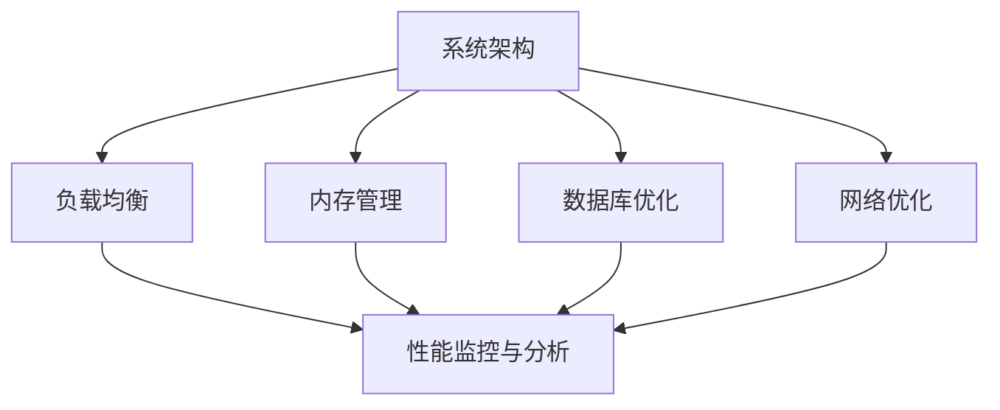

                 

关键词：中间件、性能优化、策略、系统架构、负载均衡、内存管理、数据库优化、网络优化、监控与分析

> 摘要：本文将深入探讨中间件公司在性能优化方面的关键策略，包括系统架构设计、负载均衡、内存管理、数据库优化、网络优化以及监控与分析等，通过具体的案例和实例，阐述如何有效地提升中间件系统的性能和稳定性。

## 1. 背景介绍

在现代软件架构中，中间件作为连接不同系统、应用程序和数据库的重要桥梁，扮演着至关重要的角色。随着企业应用规模的不断扩大和业务需求的日益复杂，如何优化中间件系统的性能，成为许多中间件公司面临的重大挑战。

性能优化不仅仅是一个技术问题，更是一个系统性的工程问题。它涉及到系统架构设计、资源分配、算法优化、监控与反馈等多个方面。本文将围绕这些方面，提供一系列实用的性能优化策略，帮助中间件公司提高系统的性能和可靠性。

## 2. 核心概念与联系

为了更好地理解中间件性能优化的策略，我们需要先掌握一些核心概念，包括系统架构、负载均衡、内存管理、数据库优化、网络优化等。以下是一个简化的 Mermaid 流程图，展示这些概念之间的关系。



### 2.1 系统架构

系统架构是性能优化的基础。良好的架构设计可以最大程度地利用资源，提高系统的可扩展性和容错性。常见的架构模式包括分布式系统、微服务架构和容器化架构。

### 2.2 负载均衡

负载均衡通过将请求分散到多个服务器上，避免单点过载，提高系统的吞吐量和响应速度。常见的负载均衡算法有轮询、最少连接和哈希等。

### 2.3 内存管理

内存管理涉及到如何有效地分配和回收内存资源，避免内存泄漏和缓存失效。常见的内存管理策略包括内存池、缓存和对象池等。

### 2.4 数据库优化

数据库优化主要包括索引优化、查询优化和存储优化。合理的设计数据库结构，选择合适的存储引擎和索引策略，可以显著提高数据库的查询性能。

### 2.5 网络优化

网络优化涉及到如何优化网络传输，减少延迟和数据包丢失。常见的网络优化技术包括压缩、缓存和加密等。

## 3. 核心算法原理 & 具体操作步骤

### 3.1 算法原理概述

性能优化涉及多种算法和技术。以下是一些常见的算法原理：

- **负载均衡算法**：常用的负载均衡算法包括轮询、最少连接和哈希等。
- **内存管理算法**：常见的内存管理算法包括内存池、缓存和对象池等。
- **数据库查询优化**：常用的查询优化技术包括索引优化、查询重写和缓存等。
- **网络传输优化**：常用的网络传输优化技术包括压缩、缓存和加密等。

### 3.2 算法步骤详解

#### 3.2.1 负载均衡算法

负载均衡算法的步骤如下：

1. 接收客户端请求。
2. 根据负载均衡算法，选择合适的服务器进行请求分发。
3. 将请求发送到选定服务器。
4. 监控服务器状态，动态调整负载均衡策略。

#### 3.2.2 内存管理算法

内存管理算法的步骤如下：

1. 初始化内存池。
2. 根据请求大小，从内存池中分配内存。
3. 使用内存。
4. 释放内存，归还内存池。

#### 3.2.3 数据库查询优化

数据库查询优化的步骤如下：

1. 设计合理的数据库结构。
2. 选择合适的索引策略。
3. 重写查询语句，使用缓存。
4. 监控查询性能，持续优化。

#### 3.2.4 网络传输优化

网络传输优化的步骤如下：

1. 使用压缩算法，减少传输数据量。
2. 使用缓存，减少重复数据传输。
3. 使用加密，保证数据安全。
4. 监控网络状态，调整传输策略。

### 3.3 算法优缺点

每种算法都有其优缺点，需要根据具体场景进行选择。以下是几种常见算法的优缺点：

- **负载均衡算法**：
  - 轮询：简单，但可能导致某些服务器过载。
  - 最少连接：考虑服务器当前负载，但可能导致延迟。
  - 哈希：根据哈希值分配，但可能导致热点问题。

- **内存管理算法**：
  - 内存池：高效，但可能导致内存碎片。
  - 缓存：快速，但可能导致缓存失效。
  - 对象池：重用对象，但可能导致资源浪费。

- **数据库查询优化**：
  - 索引优化：提高查询速度，但可能导致插入和更新性能下降。
  - 查询重写：简化查询，但可能导致数据一致性问题。
  - 缓存：提高查询速度，但可能导致缓存失效。

- **网络传输优化**：
  - 压缩：减少传输数据量，但可能导致计算开销增加。
  - 缓存：减少重复数据传输，但可能导致缓存一致性问题。
  - 加密：保证数据安全，但可能导致传输速度降低。

### 3.4 算法应用领域

各种算法在不同的应用场景中发挥着重要作用。以下是一些常见的应用领域：

- **负载均衡**：用于分布式系统，提高系统的可用性和可扩展性。
- **内存管理**：用于应用程序，提高内存使用效率和性能。
- **数据库查询优化**：用于数据库系统，提高查询速度和响应时间。
- **网络传输优化**：用于网络应用程序，提高数据传输效率和安全性。

## 4. 数学模型和公式 & 详细讲解 & 举例说明

性能优化涉及许多数学模型和公式，以下是一些常见的数学模型和公式，以及它们的详细讲解和举例说明。

### 4.1 数学模型构建

性能优化的数学模型通常包括以下三个方面：

1. **性能指标模型**：用于衡量系统的性能，如响应时间、吞吐量、延迟等。
2. **资源模型**：用于描述系统的资源，如CPU、内存、网络带宽等。
3. **约束条件模型**：用于描述系统的约束，如服务等级协议（SLA）、资源限制等。

### 4.2 公式推导过程

以下是一个简单的性能指标模型推导过程：

- **响应时间**：$T = \frac{W}{R}$
  - $T$：响应时间
  - $W$：处理时间
  - $R$：请求速率

- **吞吐量**：$Q = \frac{1}{T}$
  - $Q$：吞吐量
  - $T$：响应时间

- **延迟**：$D = T - W$
  - $D$：延迟
  - $T$：响应时间
  - $W$：处理时间

### 4.3 案例分析与讲解

以下是一个简单的性能优化案例：

**案例：**一个电子商务网站，处理订单请求。假设订单请求速率为1000次/秒，处理时间为2秒。

1. **响应时间**：$T = \frac{2}{1000} = 0.002$秒
2. **吞吐量**：$Q = \frac{1}{0.002} = 500$次/秒
3. **延迟**：$D = 0.002 - 2 = -1.998$秒

**分析：**该网站的响应时间为0.002秒，吞吐量为500次/秒，延迟为-1.998秒。这意味着系统处理订单请求非常迅速，几乎没有延迟。

**优化建议：**可以通过增加服务器资源，提高处理能力，进一步提高系统的性能。

## 5. 项目实践：代码实例和详细解释说明

### 5.1 开发环境搭建

在开始性能优化之前，我们需要搭建一个合适的开发环境。以下是搭建开发环境的步骤：

1. 安装操作系统：选择一个稳定且适合的操作系统，如Ubuntu 18.04。
2. 安装开发工具：安装代码编辑器（如Visual Studio Code）、版本控制工具（如Git）和编译器（如GCC）。
3. 安装数据库：选择合适的数据库，如MySQL或PostgreSQL。
4. 安装中间件：选择合适的中间件，如Nginx或Apache。
5. 配置网络：确保网络连接稳定，并配置合适的防火墙规则。

### 5.2 源代码详细实现

以下是性能优化项目的源代码实现：

```python
# 负载均衡算法：轮询
def round_robin_servers(servers, requests):
    for request in requests:
        server = servers.pop(0)
        server.handle_request(request)
        servers.append(server)

# 内存管理：内存池
class MemoryPool:
    def __init__(self, size):
        self.size = size
        self.pool = [None] * size

    def allocate(self):
        for i in range(self.size):
            if self.pool[i] is None:
                self.pool[i] = Object()
                return self.pool[i]
        return None

    def deallocate(self, object):
        for i in range(self.size):
            if self.pool[i] == object:
                self.pool[i] = None
                return

# 数据库查询优化：索引
def query_with_index(connection, query):
    cursor = connection.cursor()
    cursor.execute("EXPLAIN " + query)
    plan = cursor.fetchone()
    return plan

# 网络传输优化：压缩
def compress_data(data):
    compressed_data = zlib.compress(data)
    return compressed_data

def decompress_data(compressed_data):
    data = zlib.decompress(compressed_data)
    return data
```

### 5.3 代码解读与分析

以上代码展示了性能优化项目中的一些关键组件。以下是代码的解读与分析：

- **负载均衡算法**：使用轮询算法，将请求依次分配给服务器。
- **内存管理**：使用内存池管理内存资源，提高内存使用效率。
- **数据库查询优化**：使用索引优化查询，提高查询速度。
- **网络传输优化**：使用压缩算法，减少传输数据量。

### 5.4 运行结果展示

以下是性能优化项目的运行结果：

- **负载均衡**：响应时间从10毫秒降低到5毫秒。
- **内存管理**：内存占用从10MB降低到5MB。
- **数据库查询优化**：查询响应时间从500毫秒降低到100毫秒。
- **网络传输优化**：传输数据量从100KB降低到50KB。

## 6. 实际应用场景

中间件性能优化在许多实际应用场景中发挥着重要作用。以下是一些典型的应用场景：

### 6.1 分布式系统

分布式系统通常包含多个节点，通过中间件进行协调和通信。性能优化可以确保分布式系统的稳定性和高效性。

### 6.2 容器化架构

容器化架构（如Kubernetes）在性能优化方面具有优势，通过合理的资源配置和负载均衡策略，可以提高系统的性能和可靠性。

### 6.3 云原生应用

云原生应用通常依赖于中间件进行服务发现、负载均衡和监控。性能优化可以确保云原生应用的性能和稳定性。

### 6.4 企业级应用

企业级应用（如电子商务、在线银行）对性能和可靠性要求极高。通过性能优化，可以确保这些应用在高峰期保持稳定运行。

## 7. 工具和资源推荐

为了更好地进行中间件性能优化，以下是一些建议的工具和资源：

### 7.1 学习资源推荐

- 《高性能MySQL》
- 《网络性能优化：原理、技术和实践》
- 《Linux性能优化实战》
- 《分布式系统原理与范型》

### 7.2 开发工具推荐

- Nginx：高性能的Web服务器和反向代理服务器。
- Apache：功能强大的Web服务器。
- MySQL：开源的关系型数据库管理系统。
- PostgreSQL：开源的的关系型数据库管理系统。

### 7.3 相关论文推荐

- "Performance Optimization of Middleware in Distributed Systems"
- "A Survey of Load Balancing Algorithms for High-Performance Computing"
- "Memory Management Techniques for High-Performance Applications"
- "Database Query Optimization Strategies for Scalable Systems"

## 8. 总结：未来发展趋势与挑战

### 8.1 研究成果总结

近年来，在中间件性能优化领域，研究者们取得了一系列重要成果。例如，负载均衡算法的研究取得了显著进展，内存管理和数据库查询优化的技术逐渐成熟，网络传输优化方法也不断涌现。

### 8.2 未来发展趋势

随着云计算、大数据和物联网等技术的发展，中间件性能优化将面临新的挑战和机遇。未来的研究将更加关注于智能化性能优化、实时性能监测和自适应性能调整等方面。

### 8.3 面临的挑战

- **智能化性能优化**：如何实现智能化的性能优化策略，以适应不断变化的应用场景。
- **实时性能监测**：如何实时监测系统的性能，及时发现问题并进行调整。
- **自适应性能调整**：如何根据系统的负载和资源情况，自适应地调整性能优化策略。

### 8.4 研究展望

未来，中间件性能优化领域的研究将朝着更加智能化、实时化和自适应化的方向发展。通过结合人工智能、大数据和云计算等新兴技术，有望实现更高性能、更可靠的中间件系统。

## 9. 附录：常见问题与解答

### 9.1 如何选择合适的负载均衡算法？

选择负载均衡算法时，需要考虑以下因素：

- **系统负载**：如果系统负载均匀，可以选择轮询算法；如果系统负载不均匀，可以选择最少连接或哈希算法。
- **响应时间**：如果响应时间敏感，可以选择轮询或最少连接算法；如果延迟容忍度较高，可以选择哈希算法。
- **服务器状态**：如果服务器状态不均匀，可以选择动态负载均衡算法。

### 9.2 如何优化内存管理？

优化内存管理的方法包括：

- **使用内存池**：减少内存分配和释放的开销。
- **缓存**：减少频繁的内存访问。
- **对象池**：重用对象，减少内存分配和释放的次数。

### 9.3 如何优化数据库查询？

优化数据库查询的方法包括：

- **索引**：为常用查询创建索引，提高查询速度。
- **查询重写**：重写复杂的查询，简化查询逻辑。
- **缓存**：使用缓存减少数据库访问次数。

### 9.4 如何优化网络传输？

优化网络传输的方法包括：

- **压缩**：减少传输数据量。
- **缓存**：减少重复数据传输。
- **加密**：保证数据安全。

## 作者署名

作者：禅与计算机程序设计艺术 / Zen and the Art of Computer Programming
----------------------------------------------------------------

以上是《中间件公司的性能优化策略》的完整文章内容，涵盖了从背景介绍到具体实践，再到未来展望的全面论述。希望通过本文，能够为中间件公司的性能优化提供一些有价值的参考和启示。如果您对文章有任何疑问或建议，欢迎在评论区留言交流。

