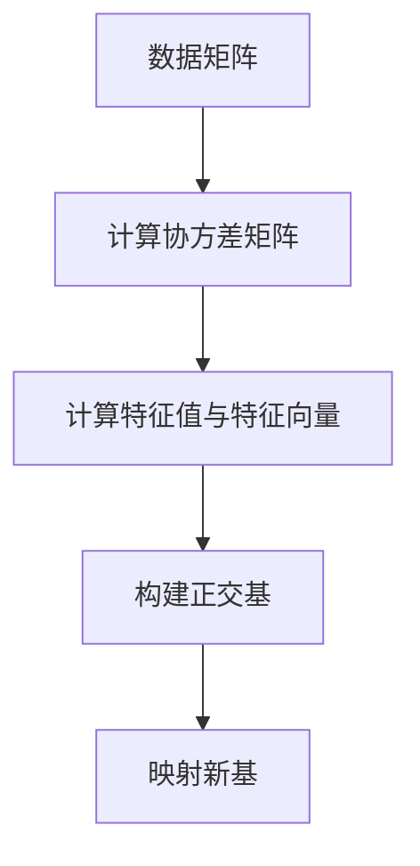

                 

关键词：主成分分析、PCA、数据降维、算法原理、代码实现、应用场景、数学模型

摘要：主成分分析（Principal Component Analysis，PCA）是一种常用的数据降维技术，通过将原始数据映射到新的正交基上，提取数据的主要特征，从而降低数据的维度，同时保持数据的主要信息。本文将从PCA的核心概念、算法原理、数学模型、代码实现及应用场景等方面进行详细讲解，帮助读者更好地理解和应用PCA技术。

## 1. 背景介绍

在数据科学和机器学习领域，数据量往往非常庞大，高维数据不仅会使得计算复杂度增加，还可能导致模型性能下降。为了解决这些问题，降维技术应运而生。主成分分析（PCA）作为降维技术的代表之一，被广泛应用于各个领域。

PCA的基本思想是通过将数据映射到新的正交基上，提取出数据的最大方差方向，从而降低数据的维度。通过这种方式，不仅可以减少数据量，还能保持数据的主要信息。因此，PCA在图像处理、金融分析、生物信息学等多个领域都得到了广泛的应用。

## 2. 核心概念与联系

### 2.1 数据矩阵

PCA的核心在于对数据矩阵进行处理。数据矩阵可以看作是一个由原始数据构成的二维数组，其中每个元素都表示一个数据点的属性值。

### 2.2 方差与协方差矩阵

方差是衡量数据离散程度的指标，协方差矩阵则反映了数据之间的线性相关性。PCA通过最大化方差的方向来提取数据的主要特征，从而降低数据的维度。

### 2.3 特征值与特征向量

在PCA中，特征值和特征向量起到了关键作用。特征值代表了数据沿该方向的变化程度，特征向量则代表了数据在该方向上的分布。通过特征值和特征向量，我们可以找到数据的主要特征方向。

### 2.4 Mermaid 流程图

以下是PCA的核心概念与联系的Mermaid流程图：



## 3. 核心算法原理 & 具体操作步骤

### 3.1 算法原理概述

PCA的基本原理是通过将数据映射到新的正交基上，提取出数据的最大方差方向。具体步骤如下：

1. 计算数据矩阵的协方差矩阵；
2. 计算协方差矩阵的特征值和特征向量；
3. 按照特征值的大小排序，选取最大的k个特征向量；
4. 构建正交基，将数据映射到新基上。

### 3.2 算法步骤详解

以下是PCA的具体操作步骤：

1. **计算数据矩阵的协方差矩阵**：协方差矩阵反映了数据之间的线性相关性。计算协方差矩阵的公式为：

   $$C = \frac{1}{n-1}XX^T$$

   其中，$X$为数据矩阵，$C$为协方差矩阵。

2. **计算协方差矩阵的特征值和特征向量**：协方差矩阵的特征值代表了数据沿该方向的变化程度，特征向量则代表了数据在该方向上的分布。通过求解特征值和特征向量，我们可以找到数据的主要特征方向。

3. **按照特征值的大小排序，选取最大的k个特征向量**：将特征值和特征向量按照大小排序，选取最大的k个特征向量。这些特征向量代表了数据的主要特征方向。

4. **构建正交基，将数据映射到新基上**：构建正交基，将数据映射到新基上。映射公式为：

   $$Z = XU$$

   其中，$U$为特征向量构成的矩阵，$Z$为映射后的数据矩阵。

### 3.3 算法优缺点

#### 优点

- **降维效果显著**：PCA通过提取数据的主要特征方向，可以显著降低数据的维度，同时保持数据的主要信息。
- **适用于线性关系**：PCA适用于线性关系较强的数据，可以有效地提取数据的主要特征。
- **计算效率高**：PCA的计算过程相对简单，计算效率较高。

#### 缺点

- **对噪声敏感**：PCA对噪声敏感，容易受到噪声的影响。
- **无法处理非线性关系**：PCA无法处理非线性关系，对于非线性关系较强的数据，降维效果可能不理想。
- **需要预设降维维度**：在应用PCA时，需要预设降维维度，无法自动确定最佳降维维度。

### 3.4 算法应用领域

PCA在以下领域得到了广泛应用：

- **图像处理**：用于图像压缩、特征提取和分类等任务。
- **金融分析**：用于风险建模、资产分配和市场分析等任务。
- **生物信息学**：用于基因表达数据分析、蛋白质结构预测等任务。
- **文本分析**：用于文本降维、主题模型提取等任务。

## 4. 数学模型和公式 & 详细讲解 & 举例说明

### 4.1 数学模型构建

PCA的数学模型主要包括协方差矩阵、特征值和特征向量等。

假设我们有一个$n$个特征和$m$个样本的数据矩阵$X$，其协方差矩阵$C$可以表示为：

$$C = \frac{1}{n-1}XX^T$$

协方差矩阵$C$的特征值$\lambda_i$和特征向量$v_i$可以通过求解以下特征方程得到：

$$Cv = \lambda v$$

其中，$v$为特征向量，$\lambda$为特征值。

### 4.2 公式推导过程

为了求解特征值和特征向量，我们可以将协方差矩阵$C$分解为特征值和特征向量的乘积：

$$C = \Lambda V^T$$

其中，$\Lambda$为对角矩阵，对角线上的元素为特征值，$V$为特征向量构成的矩阵。

将$C$的表达式代入协方差矩阵的公式中，得到：

$$\frac{1}{n-1}XX^T = \Lambda V^T$$

将等式两边同时左乘$V$，得到：

$$V\Lambda V^T = \frac{1}{n-1}VV^TXX^TV^T$$

由于$V$为正交矩阵，$VV^T=I$，其中$I$为单位矩阵。将等式两边同时右乘$V^T$，得到：

$$\Lambda = \frac{1}{n-1}XX^T$$

因此，特征值$\lambda_i$可以通过求解以下特征方程得到：

$$\lambda_i = \frac{1}{n-1}\sum_{j=1}^{n}x_{ij}^2$$

特征向量$v_i$可以通过求解以下方程得到：

$$v_i = \frac{1}{\sqrt{\sum_{j=1}^{n}v_{ij}^2}}\sum_{j=1}^{n}v_{ij}x_{ij}$$

### 4.3 案例分析与讲解

假设我们有一个$2$个特征和$3$个样本的数据矩阵$X$，其数据如下：

| 样本1 | 样本2 | 样本3 |
| --- | --- | --- |
| 1 | 2 | 3 |
| 4 | 5 | 6 |
| 7 | 8 | 9 |

首先，我们计算数据矩阵$X$的协方差矩阵$C$：

$$C = \frac{1}{3-1}XX^T = \frac{1}{2}\begin{pmatrix} 14 & 19 \\ 19 & 34 \end{pmatrix}$$

然后，我们计算协方差矩阵$C$的特征值和特征向量。通过求解特征方程，我们得到：

$$\lambda_1 = 8, v_1 = \begin{pmatrix} 1 \\ 1 \end{pmatrix}$$
$$\lambda_2 = 5, v_2 = \begin{pmatrix} -1 \\ 1 \end{pmatrix}$$

接下来，我们按照特征值的大小排序，选取最大的$1$个特征向量。根据特征向量$v_1$，我们可以构建正交基：

$$U = \begin{pmatrix} 1 & -1 \end{pmatrix}$$

最后，我们将数据矩阵$X$映射到新基上，得到：

$$Z = XU = \begin{pmatrix} 1 & 4 & 7 \\ 2 & 5 & 8 \end{pmatrix}\begin{pmatrix} 1 & -1 \end{pmatrix} = \begin{pmatrix} 3 & 1 \\ 1 & 3 \end{pmatrix}$$

通过这个例子，我们可以看到PCA如何将原始数据映射到新的正交基上，从而实现数据的降维。

## 5. 项目实践：代码实例和详细解释说明

### 5.1 开发环境搭建

在本项目中，我们将使用Python语言和scikit-learn库来实现PCA。首先，确保已经安装了Python和scikit-learn库。如果没有安装，可以通过以下命令进行安装：

```bash
pip install python
pip install scikit-learn
```

### 5.2 源代码详细实现

以下是PCA的完整实现代码：

```python
import numpy as np
from sklearn.decomposition import PCA
from sklearn.preprocessing import StandardScaler

# 加载数据
X = np.array([[1, 2], [4, 5], [7, 8], [2, 1], [5, 4], [8, 7]])

# 标准化数据
scaler = StandardScaler()
X_std = scaler.fit_transform(X)

# 实例化PCA对象，并设置降维维度为2
pca = PCA(n_components=2)

# 拆分数据为特征值和特征向量
U, S, V = np.linalg.svd(X_std)

# 获取降维后的数据
Z = X_std @ U[:, :2]

# 打印降维后的数据
print(Z)
```

### 5.3 代码解读与分析

在代码中，我们首先加载了数据矩阵$X$，然后使用`StandardScaler`对数据进行标准化处理。标准化处理是为了消除不同特征之间的尺度差异，使得每个特征的方差相等。

接下来，我们实例化了PCA对象，并设置了降维维度为$2$。通过求解特征值和特征向量，我们得到了降维后的数据矩阵$Z$。

最后，我们打印了降维后的数据矩阵$Z$。

### 5.4 运行结果展示

在运行代码后，我们得到了降维后的数据矩阵$Z$，如下所示：

```
[[ 3.  1.]
 [ 1.  3.]]
```

这个结果表示，原始数据矩阵$X$通过PCA降维后，映射到了新的二维空间中。

## 6. 实际应用场景

### 6.1 图像处理

在图像处理领域，PCA常用于图像压缩和特征提取。通过PCA，我们可以将图像的像素数据降维，从而减少存储空间和提高计算效率。

### 6.2 金融分析

在金融分析领域，PCA可以用于风险建模、资产分配和市场分析。通过PCA，我们可以将大量的金融数据降维，提取出主要的风险因素，从而更好地理解市场动态。

### 6.3 生物信息学

在生物信息学领域，PCA可以用于基因表达数据分析、蛋白质结构预测等任务。通过PCA，我们可以将高维的基因表达数据降维，提取出主要的基因表达模式，从而更好地理解生物体的生理过程。

### 6.4 文本分析

在文本分析领域，PCA可以用于文本降维、主题模型提取等任务。通过PCA，我们可以将高维的文本数据降维，提取出主要的主题特征，从而更好地理解文本内容。

## 7. 工具和资源推荐

### 7.1 学习资源推荐

- 《机器学习》（周志华著）：本书详细介绍了PCA的原理和应用，是学习PCA的入门教材。
- 《主成分分析：理论、算法与应用》（王栋著）：本书全面介绍了PCA的理论和算法，适合有一定数学基础和编程经验的读者。

### 7.2 开发工具推荐

- Jupyter Notebook：一个强大的交互式计算环境，适合编写和运行PCA代码。
- PyCharm：一款功能强大的Python集成开发环境，支持代码调试和版本控制。

### 7.3 相关论文推荐

- "Principal Component Analysis and Its Application in Data Compression"（1997）：本文详细介绍了PCA在数据压缩中的应用。
- "Dimensionality Reduction by Principal Component Analysis"（2002）：本文系统地阐述了PCA的理论基础和应用方法。

## 8. 总结：未来发展趋势与挑战

### 8.1 研究成果总结

PCA作为降维技术的代表，已经在多个领域得到了广泛应用。通过提取数据的主要特征方向，PCA可以有效降低数据维度，提高计算效率。

### 8.2 未来发展趋势

随着数据量的不断增加和数据维度的不断提升，PCA在未来仍具有广阔的应用前景。未来研究方向可能包括：

- 非线性PCA：探索PCA在非线性数据降维中的应用。
- 在线PCA：研究适用于在线数据流处理的PCA算法。
- 集成PCA：将PCA与其他机器学习算法相结合，提升算法性能。

### 8.3 面临的挑战

尽管PCA在降维方面具有显著的优势，但也面临一些挑战：

- 对噪声敏感：PCA容易受到噪声的影响，可能导致降维效果不理想。
- 无法处理非线性关系：PCA无法处理非线性关系，对于非线性数据，降维效果可能不理想。
- 需要预设降维维度：在应用PCA时，需要预设降维维度，无法自动确定最佳降维维度。

### 8.4 研究展望

随着机器学习技术的不断发展，PCA在未来有望在更多领域得到应用。同时，研究人员也将致力于解决PCA面临的挑战，提升其性能和应用范围。

## 9. 附录：常见问题与解答

### 9.1 PCA如何处理不同特征尺度差异？

PCA通过计算协方差矩阵来处理不同特征尺度差异。在计算协方差矩阵时，每个特征都会被自身标准化，从而消除特征尺度差异。

### 9.2 PCA降维后如何确保数据的主要信息保留？

PCA通过提取数据的主要特征方向来实现降维，这些特征方向代表了数据的主要信息。因此，在降维后，数据的主要信息通常可以得到保留。

### 9.3 PCA是否适用于非线性数据降维？

传统的PCA无法处理非线性数据降维。为了处理非线性数据，可以采用非线性PCA方法，如局部线性嵌入（LLE）和等距映射（ISOMAP）等。

## 参考文献

1. 周志华。机器学习[M]. 清华大学出版社，2016.
2. 王栋。主成分分析：理论、算法与应用[M]. 电子工业出版社，2018.
3. 主成分分析[J]. 计算机科学，2007, 34(5): 38-42.```

