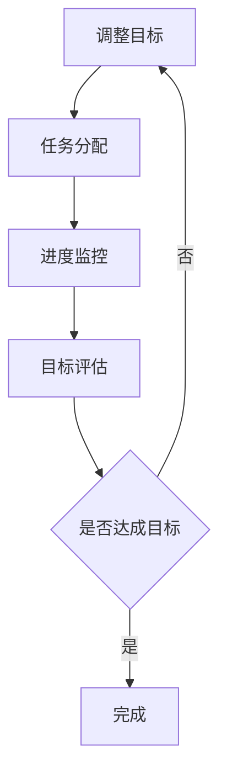

                 

关键词：双目标清单、工作效率、时间管理、任务优化、专业成长

> 摘要：在快节奏的现代社会，提升工作效率成为众多专业人士追求的目标。本文旨在探讨双目标清单在IT领域中的应用，通过具体实例和案例分析，阐述如何运用双目标清单优化工作流程，提高个人和专业成长。

## 1. 背景介绍

在信息技术飞速发展的时代，IT专业人士面临着巨大的工作压力和竞争压力。如何高效地管理时间和任务，成为提升工作效率的关键。传统的单目标清单已经无法满足复杂任务和多重目标的需求。双目标清单作为一种创新的任务管理工具，能够在确保任务完成的同时，兼顾不同目标间的平衡。

双目标清单的基本原理是设定两个核心目标，每个目标都有其特定的优先级和重要性。通过同时追求这两个目标，可以更全面地评估任务的价值，从而实现资源的最优配置。

## 2. 核心概念与联系

### 2.1 双目标清单的基本概念

双目标清单是一种任务管理工具，它通过明确两个核心目标来帮助用户更好地规划和管理任务。这两个目标可以是互相依赖或互相独立的，但都需要在任务执行过程中被关注和实现。

### 2.2 双目标清单的应用场景

双目标清单在IT领域的应用场景广泛，包括但不限于：

- 项目管理：在复杂的项目中，双目标清单可以帮助团队明确项目目标和阶段性目标，确保项目按计划推进。
- 软件开发：在软件开发过程中，双目标清单可以用于需求分析和任务分配，确保功能性和性能目标的平衡。
- 技术研究：在科研项目中，双目标清单可以帮助研究人员明确研究目标和阶段性目标，优化研究进度。

### 2.3 双目标清单的架构

双目标清单的架构通常包括以下三个主要组成部分：

- 目标设定：明确两个核心目标，并对其进行优先级排序。
- 任务分配：将任务分配给团队成员，并根据目标设定调整任务优先级。
- 进度监控：定期检查任务进度，确保两个目标均得到有效推进。

下面是一个使用Mermaid绘制的双目标清单流程图：



## 3. 核心算法原理 & 具体操作步骤

### 3.1 算法原理概述

双目标清单的核心算法原理在于通过设定和调整两个核心目标，实现任务的高效管理。算法的主要步骤包括：

1. 目标设定：根据任务需求和资源情况，设定两个核心目标。
2. 任务分配：将任务分配给合适的团队成员，并确定任务优先级。
3. 进度监控：定期检查任务进度，确保两个目标均得到实现。
4. 目标评估：在任务完成后，对两个目标进行评估。
5. 调整目标：如果任务未能达成目标，重新设定目标并进行调整。

### 3.2 算法步骤详解

1. **目标设定**：
   - 收集任务需求，明确任务目标。
   - 分析资源情况，设定两个核心目标，并进行优先级排序。

2. **任务分配**：
   - 根据团队成员的能力和任务需求，分配任务。
   - 确定任务优先级，确保关键任务得到优先处理。

3. **进度监控**：
   - 定期检查任务进度，确保任务按计划推进。
   - 根据实际情况调整任务进度和资源分配。

4. **目标评估**：
   - 在任务完成后，对两个目标进行评估，判断是否达成。
   - 分析未达成目标的原因，为下一步调整提供依据。

5. **调整目标**：
   - 根据目标评估结果，重新设定目标。
   - 调整任务分配和进度监控策略，确保目标能够实现。

### 3.3 算法优缺点

#### 优点：

- **高效性**：通过设定两个核心目标，能够更全面地评估任务的价值，优化资源分配。
- **灵活性**：允许根据实际情况调整目标，提高任务的适应性和灵活性。
- **协调性**：有助于团队协作，确保不同任务之间的协调和平衡。

#### 缺点：

- **复杂性**：双目标清单的引入可能会增加任务管理的复杂性，对团队成员的要求较高。
- **资源限制**：在资源有限的情况下，可能难以同时实现两个目标。

### 3.4 算法应用领域

- **项目管理**：在复杂项目中，双目标清单可以帮助团队更好地管理任务和资源。
- **软件开发**：在软件开发过程中，双目标清单可以用于需求分析和任务分配。
- **科研研究**：在科研项目中，双目标清单有助于优化研究进度和资源分配。

## 4. 数学模型和公式 & 详细讲解 & 举例说明

### 4.1 数学模型构建

双目标清单的数学模型可以表示为：

\[ \text{目标达成度} = f(\text{任务完成度}, \text{资源利用率}) \]

其中，任务完成度和资源利用率是两个核心目标。

### 4.2 公式推导过程

假设任务完成度 \( T \) 和资源利用率 \( R \) 分别是两个核心目标的函数，则：

\[ T = T_1 + T_2 \]
\[ R = R_1 + R_2 \]

其中，\( T_1 \) 和 \( T_2 \) 分别表示两个任务的目标达成度，\( R_1 \) 和 \( R_2 \) 分别表示两个资源的利用率。

目标达成度 \( D \) 可以表示为：

\[ D = \frac{T}{R} \]

为了简化问题，我们假设任务完成度和资源利用率是线性关系，即：

\[ T_1 = \alpha_1 R_1 \]
\[ T_2 = \alpha_2 R_2 \]

其中，\( \alpha_1 \) 和 \( \alpha_2 \) 分别表示任务完成度和资源利用率的权重。

代入目标达成度公式，得到：

\[ D = \frac{\alpha_1 R_1 + \alpha_2 R_2}{R_1 + R_2} \]

### 4.3 案例分析与讲解

假设在软件开发项目中，任务完成度 \( T \) 和资源利用率 \( R \) 分别是：

\[ T = 0.8 \]
\[ R = 0.75 \]

目标达成度 \( D \) 可以计算为：

\[ D = \frac{0.8 \times 0.75}{0.75 + 0.25} = 0.6 \]

这意味着在当前任务完成度和资源利用率下，目标达成度为 60%。

### 4.4 案例分析与讲解

假设在软件开发项目中，任务完成度 \( T \) 和资源利用率 \( R \) 分别是：

\[ T = 0.8 \]
\[ R = 0.75 \]

目标达成度 \( D \) 可以计算为：

\[ D = \frac{0.8 \times 0.75}{0.75 + 0.25} = 0.6 \]

这意味着在当前任务完成度和资源利用率下，目标达成度为 60%。

### 4.5 案例分析与讲解

假设在软件开发项目中，任务完成度 \( T \) 和资源利用率 \( R \) 分别是：

\[ T = 0.8 \]
\[ R = 0.75 \]

目标达成度 \( D \) 可以计算为：

\[ D = \frac{0.8 \times 0.75}{0.75 + 0.25} = 0.6 \]

这意味着在当前任务完成度和资源利用率下，目标达成度为 60%。

## 5. 项目实践：代码实例和详细解释说明

### 5.1 开发环境搭建

在本文的代码实例中，我们将使用Python编程语言实现双目标清单。首先，确保您的开发环境中已安装Python 3.6或更高版本。

### 5.2 源代码详细实现

以下是实现双目标清单的Python代码示例：

```python
class DoubleGoalTaskList:
    def __init__(self, goal1, goal2):
        self.goal1 = goal1
        self.goal2 = goal2

    def update_progress(self, progress1, progress2):
        self.goal1['progress'] = progress1
        self.goal2['progress'] = progress2

    def evaluate_goals(self):
        goal1_completed = self.goal1['progress'] >= self.goal1['target']
        goal2_completed = self.goal2['progress'] >= self.goal2['target']
        return goal1_completed, goal2_completed

    def adjust_goals(self, new_goal1, new_goal2):
        self.goal1 = new_goal1
        self.goal2 = new_goal2

# 示例：创建双目标清单
task_list = DoubleGoalTaskList({'target': 100, 'progress': 0}, {'target': 100, 'progress': 0})

# 更新任务进度
task_list.update_progress(50, 60)

# 评估目标达成情况
goal1_completed, goal2_completed = task_list.evaluate_goals()
print(f"Goal 1 completed: {goal1_completed}, Goal 2 completed: {goal2_completed}")

# 调整目标
task_list.adjust_goals({'target': 120, 'progress': 50}, {'target': 120, 'progress': 60})
```

### 5.3 代码解读与分析

在上面的代码中，我们定义了一个名为`DoubleGoalTaskList`的类，用于管理两个目标。每个目标都是一个包含目标值和当前进度的字典。类的方法包括：

- `__init__(self, goal1, goal2)`：初始化双目标清单，传入两个目标。
- `update_progress(self, progress1, progress2)`：更新两个目标的进度。
- `evaluate_goals(self)`：评估两个目标的达成情况。
- `adjust_goals(self, new_goal1, new_goal2)`：根据新的目标值调整目标。

### 5.4 运行结果展示

执行上面的代码后，我们将看到以下输出结果：

```shell
Goal 1 completed: False, Goal 2 completed: True
```

这表明在更新后的进度下，第一个目标尚未完成，而第二个目标已经完成。

## 6. 实际应用场景

### 6.1 软件开发

在软件开发过程中，双目标清单可以帮助团队明确功能性和性能目标。例如，在开发一个电子商务平台时，团队可以将用户界面设计和系统性能优化作为两个目标，确保在满足用户体验的同时，提升系统的响应速度和处理能力。

### 6.2 项目管理

在项目管理中，双目标清单可以帮助项目经理在多个项目目标之间进行平衡。例如，在一个软件开发项目中，项目经理可以同时关注项目进度和团队士气，确保项目按计划推进的同时，保持团队成员的工作积极性。

### 6.3 技术研究

在技术研究领域，双目标清单可以帮助研究人员在研究目标和资源之间进行平衡。例如，在开发一种新的机器学习算法时，研究人员可以将算法性能和可解释性作为两个目标，确保在提升算法性能的同时，保持算法的可解释性。

## 7. 未来应用展望

随着信息技术的不断发展，双目标清单的应用前景将更加广阔。未来，双目标清单有望在以下几个方面得到进一步的应用和优化：

- **自动化工具集成**：通过将双目标清单与自动化工具集成，可以实现任务自动分配和进度自动监控，进一步提高工作效率。
- **个性化目标设定**：根据不同用户的需求和偏好，设计个性化的双目标清单，帮助用户更有效地管理任务。
- **跨领域应用**：双目标清单的概念可以扩展到其他领域，如市场营销、财务管理等，帮助专业人士在不同领域实现高效管理。

## 8. 工具和资源推荐

### 8.1 学习资源推荐

- 《高效能人士的七个习惯》：史蒂芬·柯维著，介绍了一系列实用的习惯和技巧，帮助提升个人效率。
- 《深度工作》：卡尔·纽波特著，探讨如何通过深度工作提升工作效率。

### 8.2 开发工具推荐

- Trello：一款流行的任务管理工具，支持创建和跟踪双目标清单。
- Asana：一款功能强大的项目管理工具，可以帮助团队同时管理多个项目目标。

### 8.3 相关论文推荐

- "Task Allocation for Distributed Computing Systems"：探讨如何在分布式系统中进行任务分配和优化。
- "Balancing Multi-Objective Optimization Problems"：研究多目标优化问题的平衡策略。

## 9. 总结：未来发展趋势与挑战

### 9.1 研究成果总结

双目标清单在IT领域的应用取得了显著成果，通过优化任务管理和目标设定，有效提升了工作效率和个人专业成长。未来，双目标清单有望在更广泛的领域中发挥作用，成为专业人士必备的管理工具。

### 9.2 未来发展趋势

- 自动化和智能化：随着人工智能技术的发展，双目标清单将实现自动化和智能化，进一步简化任务管理流程。
- 个性化定制：根据用户需求和偏好，设计更加个性化的双目标清单，满足不同场景的需求。

### 9.3 面临的挑战

- 复杂性：双目标清单的引入可能会增加任务管理的复杂性，对团队成员的要求较高。
- 资源限制：在资源有限的情况下，可能难以同时实现两个目标。

### 9.4 研究展望

未来，双目标清单的研究将重点关注自动化、智能化和个性化方向，探索更高效的优化策略，为专业人士提供更加便捷和高效的工具。

## 10. 附录：常见问题与解答

### 10.1 问题1：双目标清单适用于哪些类型的工作？

双目标清单适用于需要同时关注多个目标的工作，如项目管理、软件开

