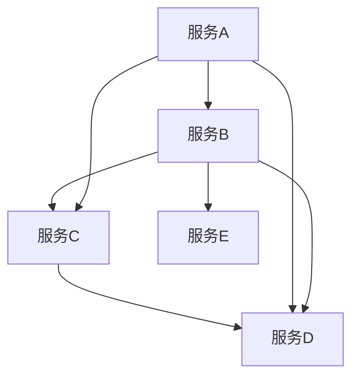

                 

关键词：云原生、微服务、单体应用、架构设计、分布式系统、容器化、服务网格、自动化运维、DevOps

> 摘要：本文将探讨云原生开发的概念、优势及其在微服务架构中的应用。从单体应用的发展历程出发，分析微服务架构的特点和实践方法，并展望云原生技术的未来趋势与挑战。

## 1. 背景介绍

在互联网和云计算的快速发展下，软件系统面临着日益增长的需求和复杂性。传统的单体应用架构已经难以满足现代企业对灵活、可扩展和快速响应的要求。为了应对这些挑战，云原生开发理念应运而生。

### 1.1 单体应用

单体应用是指应用程序的所有功能都集中在一个单一的代码库中。这种架构在早期软件开发中非常普遍，因为它简单易维护，开发周期短。然而，随着项目的规模不断扩大，单体应用逐渐暴露出以下问题：

- **系统复杂性**：单体应用随着功能的增加，代码库变得越来越庞大，难以管理和维护。
- **部署困难**：单体应用通常需要整体部署，每次更新都需要重启整个系统，影响用户体验。
- **扩展性差**：单体应用扩展困难，难以在不影响整体性能的前提下实现水平扩展。
- **技术债务**：为了满足特定需求，开发者可能会在代码库中添加大量临时解决方案，导致技术债务累积。

### 1.2 云原生开发

云原生开发是一种利用云计算环境进行软件开发的方法论，旨在构建和运行可弹性伸缩、动态管理应用。云原生技术包括容器化、服务网格、自动化运维、DevOps等关键概念。通过云原生开发，企业可以实现以下目标：

- **可伸缩性**：云原生应用能够根据需求自动调整资源，实现弹性伸缩。
- **高可用性**：通过分布式部署和自动化恢复，云原生应用具有更高的可用性。
- **快速迭代**：云原生开发鼓励持续集成和持续交付，缩短开发周期。
- **敏捷性**：云原生架构支持灵活的架构设计，能够快速响应市场变化。

## 2. 核心概念与联系

### 2.1 微服务架构

微服务架构是一种将大型应用程序拆分为一组独立、协作的服务的方法。每个服务负责完成特定的业务功能，并可以通过API进行通信。微服务架构具有以下特点：

- **独立性**：每个服务都是独立的，可以独立开发、测试和部署。
- **容器化**：微服务通常运行在容器中，如Docker，便于管理和部署。
- **自治性**：每个服务有自己的数据库和数据存储，无需全局状态。
- **分布式**：服务之间通过网络通信，构成分布式系统。

### 2.2 云原生与微服务

云原生与微服务密切相关，两者共同构成了现代软件开发的核心理念。

- **云原生是环境**：云原生提供了一种运行环境，支持微服务的部署和管理。
- **微服务是架构**：微服务架构是一种设计方法，利用云原生环境实现高效开发和运维。

### 2.3 Mermaid 流程图

为了更好地理解微服务架构，我们可以使用Mermaid流程图来展示其核心组件和交互流程。



### 2.4 核心概念与联系

通过上述流程图，我们可以看到微服务架构的核心概念和联系：

- **服务自治**：每个服务都是独立的，可以独立部署和扩展。
- **服务协作**：服务之间通过API进行通信，协同完成任务。
- **容器化**：服务运行在容器中，便于管理和部署。
- **服务网格**：通过服务网格管理服务之间的通信和安全。

## 3. 核心算法原理 & 具体操作步骤

### 3.1 算法原理概述

在云原生开发中，算法原理主要涉及以下几个方面：

- **容器化技术**：通过Docker等工具将应用打包为容器，实现快速部署和隔离。
- **服务发现**：通过服务注册和发现机制，实现服务之间的动态通信。
- **负载均衡**：通过负载均衡算法，将请求分配到不同的服务实例上，实现高效利用资源。
- **自动化运维**：通过自动化工具实现应用的部署、监控和故障恢复。

### 3.2 算法步骤详解

#### 3.2.1 容器化技术

1. **编写Dockerfile**：定义应用的构建步骤和依赖项。
2. **构建镜像**：使用Dockerfile构建应用镜像。
3. **运行容器**：启动容器，运行应用实例。
4. **容器编排**：使用Kubernetes等工具进行容器编排和管理。

#### 3.2.2 服务发现

1. **服务注册**：服务启动时，向服务注册中心注册自身信息。
2. **服务查询**：消费者通过服务注册中心查询服务地址。
3. **服务调用**：消费者通过HTTP/HTTPS等协议调用服务。

#### 3.2.3 负载均衡

1. **初始化**：负载均衡器初始化，获取服务实例列表。
2. **请求分发**：根据负载均衡算法，将请求分发到不同的服务实例。
3. **健康检查**：定期检查服务实例的健康状态，动态调整负载均衡策略。

#### 3.2.4 自动化运维

1. **自动化部署**：使用CI/CD工具，实现自动化部署。
2. **监控告警**：使用监控工具，实时监控应用性能和健康状态。
3. **故障恢复**：在故障发生时，自动进行故障恢复和恢复。

### 3.3 算法优缺点

#### 优点

- **容器化技术**：实现快速部署和隔离，提高开发和运维效率。
- **服务发现**：实现服务之间的动态通信，提高系统灵活性。
- **负载均衡**：实现资源的高效利用，提高系统性能。
- **自动化运维**：实现自动化部署、监控和故障恢复，降低运维成本。

#### 缺点

- **复杂性**：涉及多个组件和工具，需要较高的技术门槛。
- **分布式问题**：分布式系统存在网络延迟、数据一致性问题等挑战。
- **安全性**：需要确保容器和服务的安全性，防止攻击和数据泄露。

### 3.4 算法应用领域

算法在云原生开发中的应用非常广泛，主要包括：

- **Web应用**：实现高性能、高可用性的分布式Web应用。
- **物联网**：通过容器化技术实现物联网设备的快速部署和管理。
- **大数据**：利用分布式计算和存储技术，处理大规模数据。
- **人工智能**：通过微服务架构，实现人工智能模型的可扩展和高效部署。

## 4. 数学模型和公式 & 详细讲解 & 举例说明

### 4.1 数学模型构建

在云原生开发中，数学模型主要用于描述系统的性能、可靠性和可扩展性。以下是一个简单的数学模型，用于描述微服务系统的性能。

- **性能模型**：假设一个微服务系统有n个服务实例，每个实例的处理能力为p，系统的总处理能力为C。

  $$ C = n \times p $$

- **可靠性模型**：假设每个服务实例的故障率为λ，系统的平均故障时间为MTTF。

  $$ MTTF = \frac{1}{\lambda} $$

- **可扩展性模型**：假设系统的处理能力需求为R，系统的可扩展性因子为α。

  $$ \alpha = \frac{R}{C} $$

### 4.2 公式推导过程

#### 性能模型推导

系统的总处理能力C是每个服务实例处理能力p和服务实例数量n的乘积。假设每个实例的处理能力是固定的，那么总处理能力与实例数量成正比。

#### 可靠性模型推导

系统的平均故障时间MTTF是每个服务实例的故障率λ的倒数。假设服务实例的故障是独立的，那么系统的平均故障时间也是独立的。

#### 可扩展性模型推导

系统的可扩展性因子α是系统的处理能力需求R与总处理能力C的比值。如果系统的处理能力需求大于总处理能力，那么系统是不可扩展的。

### 4.3 案例分析与讲解

假设一个微服务系统有10个服务实例，每个实例的处理能力为100次请求/秒。系统的处理能力需求为1000次请求/秒。

- **性能模型**：

  $$ C = 10 \times 100 = 1000 $$

  系统的总处理能力为1000次请求/秒。

- **可靠性模型**：

  $$ MTTF = \frac{1}{\lambda} $$

  如果每个实例的故障率为0.01次/秒，那么系统的平均故障时间为：

  $$ MTTF = \frac{1}{0.01} = 100 $$

  系统的平均故障时间为100秒。

- **可扩展性模型**：

  $$ \alpha = \frac{R}{C} = \frac{1000}{1000} = 1 $$

  系统的可扩展性因子为1，说明系统的处理能力需求刚好等于总处理能力，系统是可扩展的。

通过这个案例，我们可以看到数学模型如何帮助描述和优化微服务系统的性能、可靠性和可扩展性。

## 5. 项目实践：代码实例和详细解释说明

### 5.1 开发环境搭建

为了实践云原生开发，我们首先需要搭建一个合适的开发环境。以下是环境搭建的步骤：

1. **安装Docker**：从[Docker官网](https://www.docker.com/)下载并安装Docker。
2. **安装Kubernetes**：使用Minikube或Docker Desktop创建Kubernetes集群。
3. **安装kubectl**：从[Kubernetes官网](https://kubernetes.io/)下载kubectl命令行工具。
4. **配置kubectl**：设置kubectl的集群上下文，以便进行集群操作。

### 5.2 源代码详细实现

我们以一个简单的用户管理服务为例，实现一个基于微服务架构的用户管理功能。

**用户管理服务**：

1. **需求分析**：实现用户注册、登录、信息更新等功能。
2. **功能设计**：设计RESTful API接口，包括用户注册、登录、用户信息查询等。
3. **数据库设计**：设计用户信息表，包括用户名、密码、邮箱等字段。
4. **实现代码**：使用Spring Boot框架实现用户管理服务的API接口。

**Dockerfile**：

```Dockerfile
FROM openjdk:8-jdk-alpine

ARG JAR_FILE=target/*.jar

COPY ${JAR_FILE} app.jar

EXPOSE 8080

ENTRYPOINT ["java","-Djava.security.egd=file:/dev/./urandom","-jar","/app.jar"]
```

**应用部署**：

1. **构建镜像**：使用Maven构建应用，生成可执行的JAR文件。
2. **推送镜像**：将构建好的镜像推送到Docker Hub或私有镜像仓库。
3. **部署到Kubernetes**：编写Kubernetes部署文件，将镜像部署到集群中。

```yaml
apiVersion: apps/v1
kind: Deployment
metadata:
  name: user-management
spec:
  replicas: 3
  selector:
    matchLabels:
      app: user-management
  template:
    metadata:
      labels:
        app: user-management
    spec:
      containers:
      - name: user-management
        image: <你的镜像仓库地址>/user-management:latest
        ports:
        - containerPort: 8080
```

### 5.3 代码解读与分析

**用户管理服务**的代码结构如下：

```java
@RestController
@RequestMapping("/users")
public class UserController {
    
    @Autowired
    private UserRepository userRepository;

    @PostMapping
    public ResponseEntity<User> register(@RequestBody User user) {
        // 注册用户逻辑
    }

    @PostMapping("/login")
    public ResponseEntity<String> login(@RequestBody LoginRequest request) {
        // 登录验证逻辑
    }

    @GetMapping("/{id}")
    public ResponseEntity<User> getUser(@PathVariable Long id) {
        // 获取用户信息逻辑
    }

    @PutMapping("/{id}")
    public ResponseEntity<User> updateUser(@PathVariable Long id, @RequestBody User user) {
        // 更新用户信息逻辑
    }
}
```

- **注册用户**：接收用户注册请求，验证用户信息，存储到数据库。
- **登录验证**：接收用户登录请求，验证用户名和密码，返回JWT令牌。
- **获取用户**：根据用户ID查询用户信息，返回用户数据。
- **更新用户**：根据用户ID更新用户信息。

### 5.4 运行结果展示

在Kubernetes集群中部署用户管理服务后，可以使用kubectl命令行工具查看运行状态。

```bash
$ kubectl get pods
NAME                     READY   STATUS    RESTARTS   AGE
user-management-7b9c5f   1/1     Running   0          5m
```

使用Postman等工具发送API请求，验证服务的运行结果。

```bash
POST /users
Content-Type: application/json

{
  "username": "testuser",
  "password": "password123",
  "email": "testuser@example.com"
}
```

响应结果：

```json
{
  "id": 1,
  "username": "testuser",
  "email": "testuser@example.com"
}
```

通过以上步骤，我们可以实现一个简单的用户管理服务，并利用容器化和Kubernetes进行部署和管理。

## 6. 实际应用场景

### 6.1 Web应用

云原生开发和微服务架构在Web应用中具有广泛应用。例如，电商平台可以利用云原生技术实现高并发、高可用的购物系统。通过微服务架构，可以将订单管理、商品管理、支付系统等模块拆分为独立的服务，实现灵活扩展和快速迭代。

### 6.2 物联网

物联网（IoT）设备通常具有资源有限、网络不稳定等特点。利用云原生技术，可以实现物联网设备的快速部署和管理。通过容器化和微服务架构，可以将设备监控、数据处理、远程管理等模块拆分为独立的服务，实现设备的远程管理和智能分析。

### 6.3 大数据

大数据处理通常需要高性能、可扩展的计算资源。利用云原生技术和微服务架构，可以实现分布式大数据处理平台的构建。通过容器化和微服务，可以将数据处理任务拆分为独立的服务，实现任务的高效分配和调度。

### 6.4 人工智能

人工智能（AI）应用通常需要大量的计算资源和数据支持。利用云原生技术和微服务架构，可以实现AI模型的高效部署和扩展。通过容器化和微服务，可以将AI模型训练、推理等模块拆分为独立的服务，实现模型的快速迭代和应用。

## 7. 工具和资源推荐

### 7.1 学习资源推荐

- **《云原生应用架构》**：详细介绍了云原生技术的概念、架构和实践方法。
- **《微服务设计》**：深入讲解了微服务架构的设计原则、实践方法和挑战。
- **《Docker实战》**：介绍了Docker的基本概念、安装和使用方法。
- **《Kubernetes权威指南》**：全面介绍了Kubernetes的架构、部署和使用方法。

### 7.2 开发工具推荐

- **Docker**：容器化工具，用于打包、运行和管理应用容器。
- **Kubernetes**：容器编排工具，用于部署和管理容器化应用。
- **kubectl**：Kubernetes命令行工具，用于与Kubernetes集群进行交互。
- **Postman**：API测试工具，用于验证API接口的正确性和性能。

### 7.3 相关论文推荐

- **《云原生计算：概念与架构》**：介绍了云原生计算的基本概念和架构设计。
- **《基于微服务的云原生应用设计与实现》**：探讨了微服务架构在云原生环境中的应用和实现。
- **《云原生应用性能优化技术》**：分析了云原生应用的性能优化方法和实践。

## 8. 总结：未来发展趋势与挑战

### 8.1 研究成果总结

云原生开发和微服务架构在近年来取得了显著的进展，成为现代软件开发的核心理念。通过容器化、服务网格、自动化运维等技术，企业实现了高效、可扩展、高可用的应用架构。研究成果主要包括：

- **容器化技术的普及**：Docker、Kubernetes等工具广泛应用于企业级应用。
- **微服务架构的成熟**：微服务设计原则、实践方法和工具链不断完善。
- **自动化运维的普及**：CI/CD工具链、自动化监控和故障恢复成为企业标配。
- **DevOps文化的兴起**：企业开始重视软件开发和运维的协同，提高软件交付效率。

### 8.2 未来发展趋势

未来，云原生开发将继续向以下几个方向发展：

- **服务网格的普及**：服务网格技术将进一步提升微服务的通信效率和安全性能。
- **云原生应用的多样化**：云原生技术将应用于更多领域，如人工智能、物联网等。
- **DevOps文化的深化**：企业将继续加强软件开发和运维的协同，提高软件交付效率。
- **云原生技术的标准化**：云原生技术将逐步实现标准化，降低企业使用门槛。

### 8.3 面临的挑战

尽管云原生开发取得了显著进展，但仍面临以下挑战：

- **技术复杂性**：云原生技术和微服务架构涉及多个组件和工具，需要较高的技术门槛。
- **分布式系统的复杂性**：分布式系统存在网络延迟、数据一致性问题等挑战。
- **安全性问题**：容器化和微服务架构带来了新的安全威胁，需要加强安全防护。
- **人才培养**：企业需要培养具备云原生技术和微服务架构能力的专业人才。

### 8.4 研究展望

未来，云原生开发的研究将重点关注以下几个方面：

- **服务网格的优化**：提高服务网格的性能、可扩展性和安全性。
- **分布式系统的调度和优化**：提高分布式系统的资源利用率和负载均衡能力。
- **自动化运维和监控**：实现更加智能和高效的自动化运维和监控。
- **跨云和混合云架构**：研究跨云和混合云架构的构建和优化方法。

通过不断探索和优化，云原生开发将为现代软件开发带来更加高效、灵活和可靠的解决方案。

## 9. 附录：常见问题与解答

### 9.1 如何选择合适的容器化工具？

选择容器化工具时，需要考虑以下因素：

- **应用需求**：根据应用的特点，选择适合的容器化工具。例如，Docker适用于大多数应用，而rkt适用于安全要求较高的场景。
- **社区支持**：选择社区活跃、文档丰富的工具，有助于解决开发过程中遇到的问题。
- **性能和资源消耗**：考虑容器化工具的性能和资源消耗，选择最适合当前硬件环境的工具。

### 9.2 微服务架构如何解决分布式系统的一致性问题？

分布式系统的一致性问题主要包括以下几种解决方法：

- **强一致性**：通过分布式锁、版本号等机制，确保数据的一致性。但强一致性可能导致性能下降。
- **最终一致性**：允许数据在一段时间内处于不一致状态，最终达到一致性。适用于大多数互联网应用。
- **补偿机制**：在数据不一致时，通过补偿操作恢复一致性。适用于复杂业务场景。

### 9.3 如何确保云原生应用的安全性？

确保云原生应用的安全性可以从以下几个方面入手：

- **容器镜像安全**：确保容器镜像的安全，包括镜像的来源、内容验证等。
- **网络隔离**：使用网络隔离技术，限制容器之间的通信，防止恶意攻击。
- **访问控制**：使用访问控制技术，限制用户和服务的访问权限，确保数据安全。
- **日志审计**：记录容器和服务的操作日志，便于追踪和监控安全事件。

### 9.4 如何评估云原生应用的性能？

评估云原生应用的性能可以从以下几个方面入手：

- **负载测试**：通过模拟高并发请求，评估应用的响应时间和吞吐量。
- **资源利用率**：监控应用的CPU、内存、磁盘等资源利用率，优化资源分配。
- **延迟分析**：分析应用的延迟，定位性能瓶颈，进行优化。
- **监控指标**：使用监控工具，收集和应用相关的性能指标，进行性能评估。

通过上述评估方法，可以全面了解云原生应用的性能状况，并针对性地进行优化。 

---

作者：禅与计算机程序设计艺术 / Zen and the Art of Computer Programming

