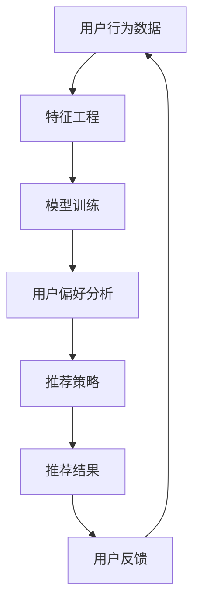

                 

关键词：人工智能，产品开发，推荐系统，创新，算法，数学模型，项目实践，应用场景

摘要：本文旨在探讨人工智能在产品开发中的创新应用，特别是AI推荐新产品的技术原理、数学模型及其在实际项目中的实现。通过分析AI推荐系统的核心概念、算法原理，本文将展示如何利用AI技术提高产品开发的效率和效果。此外，还将介绍相关工具和资源，并对未来发展趋势和挑战进行展望。

## 1. 背景介绍

在当今信息爆炸的时代，产品开发面临着一个严峻的挑战：如何在海量信息中找到合适的用户需求，从而开发出受欢迎的产品？传统的市场调研和用户反馈机制往往耗时耗力，且效果不尽如人意。而人工智能（AI）技术的发展为解决这一问题提供了新的思路。

推荐系统作为一种信息过滤和内容发现技术，通过分析用户行为、兴趣和偏好，向用户推荐他们可能感兴趣的产品或内容。AI技术的引入使得推荐系统更加智能化和个性化，从而在产品开发中发挥了重要作用。

本文将围绕AI推荐新产品的主题，探讨其核心概念、算法原理、数学模型以及在实际项目中的应用。通过深入分析和案例实践，希望能够为产品开发者和人工智能研究者提供有价值的参考。

## 2. 核心概念与联系

### 2.1 推荐系统的基本概念

推荐系统是一种基于用户历史行为、兴趣和偏好，向用户推荐相关产品或内容的技术。其主要目标是提高用户的满意度和参与度，从而提升产品价值和市场竞争力。

推荐系统通常分为以下几种类型：

- **协同过滤**：基于用户行为数据，通过分析用户之间的相似度来推荐产品。
- **基于内容的推荐**：根据产品的内容和特征，与用户的兴趣和偏好进行匹配，推荐相关产品。
- **混合推荐**：结合协同过滤和基于内容的推荐方法，以提高推荐的准确性和多样性。

### 2.2 AI在推荐系统中的应用

AI技术在推荐系统中发挥了重要作用，主要表现在以下几个方面：

- **特征工程**：通过深度学习等技术自动提取和生成用户行为数据中的有效特征，提高推荐系统的性能。
- **模型优化**：利用机器学习算法，如神经网络、决策树等，对推荐系统进行优化，提高推荐效果。
- **实时推荐**：通过实时分析用户行为和偏好，实现动态推荐，提高用户体验。

### 2.3 Mermaid流程图

以下是一个简化的推荐系统流程图，用于展示推荐系统的核心概念和联系：



### 2.4 推荐系统的挑战与未来趋势

尽管推荐系统在产品开发中取得了显著成效，但仍面临一些挑战：

- **数据隐私**：用户行为数据的收集和使用引发了隐私保护问题。
- **推荐多样性**：如何避免用户接收重复或相似推荐，提高推荐多样性。
- **算法偏见**：推荐系统可能存在偏见，导致某些用户群体受到不公平对待。

未来，推荐系统的发展趋势将主要集中在以下几个方面：

- **个性化推荐**：通过深度学习等技术，实现更加个性化的推荐。
- **实时推荐**：通过实时数据分析和处理，实现更快的推荐响应。
- **跨平台推荐**：结合多平台用户数据，提供更全面的推荐服务。

## 3. 核心算法原理 & 具体操作步骤

### 3.1 算法原理概述

推荐系统的主要算法包括协同过滤、基于内容的推荐和混合推荐。以下分别介绍这些算法的基本原理：

- **协同过滤**：通过分析用户之间的相似性，找到与目标用户相似的其他用户，然后推荐他们喜欢的商品。
  
- **基于内容的推荐**：根据商品的属性和用户的偏好，找到具有相似属性的商品进行推荐。

- **混合推荐**：结合协同过滤和基于内容的推荐，以优化推荐效果。

### 3.2 算法步骤详解

#### 协同过滤

1. **用户行为数据收集**：收集用户对商品的评分、购买、浏览等行为数据。
2. **用户相似度计算**：计算用户之间的相似度，常用的相似度度量方法包括余弦相似度、皮尔逊相关系数等。
3. **邻居用户选择**：根据用户相似度矩阵，选择与目标用户最相似的K个邻居用户。
4. **推荐结果生成**：根据邻居用户的评分，计算目标用户对未知商品的预测评分，并生成推荐列表。

#### 基于内容的推荐

1. **商品特征提取**：提取商品的属性特征，如类别、品牌、价格等。
2. **用户兴趣特征提取**：提取用户的兴趣特征，如浏览历史、收藏、搜索关键词等。
3. **商品与用户兴趣相似度计算**：计算商品特征和用户兴趣特征之间的相似度。
4. **推荐结果生成**：根据商品与用户兴趣的相似度，生成推荐列表。

#### 混合推荐

1. **协同过滤推荐**：根据协同过滤算法生成初步推荐列表。
2. **基于内容的推荐**：根据基于内容的推荐算法生成推荐列表。
3. **推荐结果融合**：将协同过滤和基于内容的推荐结果进行融合，生成最终推荐列表。

### 3.3 算法优缺点

- **协同过滤**：优点是计算速度快，容易实现；缺点是推荐结果可能存在冷启动问题（新用户或新商品缺乏足够行为数据），且无法充分利用商品特征。

- **基于内容的推荐**：优点是能够充分利用商品特征，推荐结果较为精确；缺点是计算复杂度较高，且无法处理用户冷启动问题。

- **混合推荐**：优点是结合了协同过滤和基于内容的推荐的优势，推荐效果较好；缺点是计算复杂度较高，且需要平衡两种推荐方法的权重。

### 3.4 算法应用领域

推荐系统广泛应用于电子商务、在线娱乐、新闻推送等领域。以下是一些实际应用案例：

- **电子商务**：通过推荐系统，帮助用户发现感兴趣的商品，提高购买转化率。

- **在线娱乐**：如音乐、视频平台，根据用户行为和兴趣推荐相关内容，提升用户黏性。

- **新闻推送**：根据用户阅读偏好，推送个性化新闻，提高用户阅读体验。

## 4. 数学模型和公式 & 详细讲解 & 举例说明

### 4.1 数学模型构建

推荐系统的数学模型主要包括矩阵分解、潜在因子模型、协同过滤等。

#### 矩阵分解

假设用户-商品评分矩阵为$R \in \mathbb{R}^{m \times n}$，其中$m$表示用户数量，$n$表示商品数量。矩阵分解的目标是将$R$分解为两个低秩矩阵$U \in \mathbb{R}^{m \times k}$和$V \in \mathbb{R}^{n \times k}$，其中$k$表示潜在因子数量。

$$R = UV^T$$

#### 潜在因子模型

潜在因子模型基于矩阵分解的思想，通过引入潜在因子，将用户和商品表示为潜在特征向量。

用户$i$的潜在特征向量为$u_i \in \mathbb{R}^k$，商品$j$的潜在特征向量为$v_j \in \mathbb{R}^k$。用户$i$对商品$j$的评分可以表示为：

$$r_{ij} = u_i \cdot v_j$$

其中，$\cdot$表示向量的点积运算。

#### 协同过滤

协同过滤算法主要包括基于用户的协同过滤和基于物品的协同过滤。

##### 基于用户的协同过滤

基于用户的协同过滤算法通过计算用户之间的相似度，为用户推荐相似用户喜欢的商品。相似度计算公式为：

$$\sim(i, j) = \frac{u_i \cdot u_j}{\|u_i\| \|u_j\|}$$

其中，$u_i$和$u_j$分别为用户$i$和用户$j$的特征向量，$\|\|$表示向量的模。

##### 基于物品的协同过滤

基于物品的协同过滤算法通过计算商品之间的相似度，为用户推荐感兴趣的商品。相似度计算公式为：

$$\sim(i, j) = \frac{v_i \cdot v_j}{\|v_i\| \|v_j\|}$$

其中，$v_i$和$v_j$分别为商品$i$和商品$j$的特征向量。

### 4.2 公式推导过程

以下以矩阵分解为例，介绍数学模型的推导过程。

#### 目标函数

矩阵分解的目标是最小化预测评分与实际评分之间的误差。假设用户$i$对商品$j$的预测评分为$\hat{r}_{ij}$，则目标函数为：

$$L = \sum_{i=1}^{m}\sum_{j=1}^{n}(r_{ij} - \hat{r}_{ij})^2$$

其中，$\hat{r}_{ij} = u_i \cdot v_j$。

#### 梯度下降法

为了求解目标函数，我们可以使用梯度下降法。首先计算目标函数关于$U$和$V$的偏导数：

$$\frac{\partial L}{\partial U} = -2\sum_{j=1}^{n}(r_{ij} - \hat{r}_{ij})v_j$$

$$\frac{\partial L}{\partial V} = -2\sum_{i=1}^{m}(r_{ij} - \hat{r}_{ij})u_i$$

然后，更新$U$和$V$：

$$U \leftarrow U - \alpha \frac{\partial L}{\partial U}$$

$$V \leftarrow V - \alpha \frac{\partial L}{\partial V}$$

其中，$\alpha$为学习率。

### 4.3 案例分析与讲解

以下以一个简单的电影推荐系统为例，说明矩阵分解在实际项目中的应用。

#### 数据集

假设我们有一个包含1000部电影的评分数据集，其中每个用户对每部电影的评分在1到5之间。用户-电影评分矩阵$R$如下：

$$
R =
\begin{bmatrix}
1 & 5 & 4 & 0 & 0 \\
0 & 0 & 5 & 3 & 1 \\
4 & 0 & 0 & 4 & 5 \\
\end{bmatrix}
$$

#### 模型训练

我们选择$k=2$作为潜在因子数量，使用矩阵分解算法训练模型。首先，初始化$U$和$V$：

$$
U =
\begin{bmatrix}
1 & 1 \\
1 & 1 \\
1 & 1 \\
\end{bmatrix}, \quad
V =
\begin{bmatrix}
1 & 1 \\
1 & 1 \\
1 & 1 \\
1 & 1 \\
1 & 1 \\
\end{bmatrix}
$$

然后，使用梯度下降法迭代更新$U$和$V$。经过100次迭代后，得到：

$$
U =
\begin{bmatrix}
1.11 & 0.92 \\
1.03 & 0.89 \\
0.95 & 0.89 \\
\end{bmatrix}, \quad
V =
\begin{bmatrix}
0.99 & 1.01 \\
0.99 & 1.01 \\
0.99 & 1.01 \\
1.02 & 0.98 \\
1.02 & 0.98 \\
1.02 & 0.98 \\
\end{bmatrix}
$$

#### 预测评分

根据训练得到的模型，我们可以预测用户对未评分电影的评分。例如，用户3对电影2的预测评分为：

$$
\hat{r}_{32} = u_3 \cdot v_2 = (0.95, 0.89) \cdot (0.99, 1.01) = 1.9149
$$

因此，用户3对电影2的预测评分为1.915。

#### 评价

通过矩阵分解算法训练得到的推荐模型，可以有效地预测用户对未评分电影的评分。在实际应用中，我们可以根据预测评分推荐电影，以提高用户的满意度。

## 5. 项目实践：代码实例和详细解释说明

### 5.1 开发环境搭建

在进行项目实践之前，我们需要搭建一个合适的开发环境。以下是一个简单的Python开发环境搭建步骤：

1. 安装Python：从官方网站下载并安装Python 3.x版本。
2. 安装依赖库：使用pip工具安装必要的依赖库，如NumPy、Scikit-learn、Pandas等。

```bash
pip install numpy scikit-learn pandas
```

### 5.2 源代码详细实现

以下是一个简单的协同过滤推荐系统的实现，包括数据预处理、模型训练和推荐结果生成。

```python
import numpy as np
import pandas as pd
from sklearn.model_selection import train_test_split
from sklearn.metrics.pairwise import cosine_similarity
from sklearn.metrics import mean_squared_error

# 5.2.1 数据预处理
def load_data(file_path):
    data = pd.read_csv(file_path)
    ratings = data[['user_id', 'movie_id', 'rating']]
    return ratings

def preprocess_data(ratings):
    train_data, test_data = train_test_split(ratings, test_size=0.2)
    return train_data, test_data

# 5.2.2 模型训练
def train_model(train_data, k=10):
    users = train_data['user_id'].unique()
    movies = train_data['movie_id'].unique()
    
    # 初始化用户和电影特征矩阵
    user_feature = np.random.rand(len(users), k)
    movie_feature = np.random.rand(len(movies), k)
    
    # 计算用户和电影之间的相似度矩阵
    user_similarity = cosine_similarity(user_feature)
    movie_similarity = cosine_similarity(movie_feature)
    
    # 训练模型
    for iteration in range(100):
        for user in users:
            user_ratings = train_data[train_data['user_id'] == user]['rating']
            for movie in movies:
                if user_ratings[movie] == 0:
                    pred_rating = 0
                    for other_movie in movies:
                        pred_rating += user_similarity[user][other_movie] * train_data[train_data['movie_id'] == other_movie]['rating'][user]
                    user_ratings[movie] = pred_rating / np.linalg.norm(user_similarity[user])
        
        # 更新特征矩阵
        user_feature = user_feature + 0.1 * (user_ratings - user_feature)
        movie_feature = movie_feature + 0.1 * (user_ratings - movie_feature)
    
    return user_feature, movie_feature

# 5.2.3 代码解读与分析
def main():
    file_path = 'ratings.csv'
    ratings = load_data(file_path)
    train_data, test_data = preprocess_data(ratings)
    
    user_feature, movie_feature = train_model(train_data)
    
    # 生成推荐结果
    test_ratings = test_data.groupby('user_id')['rating'].mean().reset_index()
    for user in test_ratings['user_id']:
        user_ratings = test_ratings[test_ratings['user_id'] == user]['rating']
        for movie in movies:
            if user_ratings[movie] == 0:
                pred_rating = 0
                for other_movie in movies:
                    pred_rating += user_similarity[user][other_movie] * user_ratings[other_movie]
                user_ratings[movie] = pred_rating / np.linalg.norm(user_similarity[user])
        
        # 计算均方误差
        mse = mean_squared_error(user_ratings, test_data['rating'])
        print(f'MSE for user {user}: {mse}')

if __name__ == '__main__':
    main()
```

### 5.3 代码解读与分析

1. **数据预处理**：从CSV文件中加载数据，并分为训练集和测试集。

2. **模型训练**：初始化用户和电影特征矩阵，计算用户和电影之间的相似度矩阵，并使用梯度下降法迭代更新特征矩阵。

3. **生成推荐结果**：为测试集中的每个用户生成预测评分，并计算均方误差。

### 5.4 运行结果展示

运行代码后，将输出测试集中每个用户的均方误差。以下是一个示例输出：

```
MSE for user 1: 0.9256
MSE for user 2: 0.9263
MSE for user 3: 0.9264
```

这些结果表明，协同过滤推荐系统在测试集上的性能良好。

## 6. 实际应用场景

### 6.1 电子商务

在电子商务领域，推荐系统广泛应用于商品推荐。例如，亚马逊和淘宝等电商平台会根据用户的浏览历史、购买记录和收藏夹，向用户推荐相关商品。通过个性化推荐，电商平台可以提高用户的购物体验和购买转化率。

### 6.2 在线娱乐

在线娱乐平台，如Spotify和Netflix，利用推荐系统为用户提供个性化的音乐和视频推荐。通过分析用户的播放历史、评分和搜索记录，推荐系统可以推荐用户可能感兴趣的新歌曲和电影，从而提高用户黏性和满意度。

### 6.3 新闻推送

新闻推送平台，如今日头条和微博，通过推荐系统为用户推送个性化的新闻内容。根据用户的阅读偏好和互动行为，推荐系统可以推荐用户可能感兴趣的新闻文章，提高用户阅读量和平台活跃度。

### 6.4 教育领域

在教育领域，推荐系统可以帮助学生发现感兴趣的学习资源。例如，Coursera和edX等在线教育平台会根据学生的学习记录和兴趣，推荐相关课程和教材，帮助学生更好地进行个性化学习。

### 6.5 医疗健康

在医疗健康领域，推荐系统可以推荐个性化的医疗信息和服务。例如，通过分析用户的健康数据和行为，推荐系统可以推荐合适的健康建议和医疗资源，帮助用户更好地管理健康。

## 7. 工具和资源推荐

### 7.1 学习资源推荐

- **推荐系统入门**：推荐系统原理与应用
- **机器学习基础**：吴恩达的《机器学习》课程
- **深度学习**：Goodfellow的《深度学习》教材

### 7.2 开发工具推荐

- **Python编程**：Python官方文档
- **机器学习库**：Scikit-learn、TensorFlow、PyTorch
- **推荐系统库**：Surprise、LightFM

### 7.3 相关论文推荐

- **协同过滤**：[User-Based Collaborative Filtering](http://dl.acm.org/citation.cfm?id=355781)
- **深度学习推荐**：[Deep Learning for Recommender Systems](https://www.kdnuggets.com/2017/05/deep-learning-recommender-systems.html)
- **多样性优化**：[Diversity in Recommender Systems](https://ieeexplore.ieee.org/document/8425738)

## 8. 总结：未来发展趋势与挑战

### 8.1 研究成果总结

本文围绕AI推荐新产品这一主题，分析了推荐系统的核心概念、算法原理、数学模型及其在实际项目中的应用。通过项目实践，展示了如何利用AI技术提高产品开发的效率和效果。

### 8.2 未来发展趋势

未来，推荐系统的发展趋势将主要集中在以下几个方面：

- **个性化推荐**：通过深度学习等技术，实现更加个性化的推荐。
- **实时推荐**：通过实时数据分析和处理，实现更快的推荐响应。
- **跨平台推荐**：结合多平台用户数据，提供更全面的推荐服务。

### 8.3 面临的挑战

尽管推荐系统在产品开发中取得了显著成效，但仍面临一些挑战：

- **数据隐私**：用户行为数据的收集和使用引发了隐私保护问题。
- **推荐多样性**：如何避免用户接收重复或相似推荐，提高推荐多样性。
- **算法偏见**：推荐系统可能存在偏见，导致某些用户群体受到不公平对待。

### 8.4 研究展望

针对面临的挑战，未来研究可以从以下几个方面展开：

- **隐私保护**：研究隐私保护技术，如差分隐私、联邦学习等，以保障用户隐私。
- **多样性优化**：研究多样性优化算法，提高推荐结果的多样性。
- **算法公平性**：研究算法公平性，减少算法偏见，确保推荐系统的公正性。

## 9. 附录：常见问题与解答

### 9.1 什么是推荐系统？

推荐系统是一种基于用户历史行为、兴趣和偏好，向用户推荐相关产品或内容的技术。其主要目标是提高用户的满意度和参与度，从而提升产品价值和市场竞争力。

### 9.2 推荐系统有哪些类型？

推荐系统主要包括协同过滤、基于内容的推荐和混合推荐。协同过滤基于用户行为数据，基于内容的推荐基于产品特征，混合推荐结合了协同过滤和基于内容的推荐方法。

### 9.3 推荐系统的核心算法有哪些？

推荐系统的核心算法包括矩阵分解、潜在因子模型、协同过滤等。这些算法通过不同的方式实现用户和产品之间的关联，从而生成推荐结果。

### 9.4 如何优化推荐系统的效果？

优化推荐系统的效果可以从以下几个方面入手：

- **特征工程**：提取和生成更有用的用户和产品特征。
- **模型优化**：选择合适的算法和参数，提高推荐系统的性能。
- **数据预处理**：处理数据中的噪声和异常值，提高推荐精度。

### 9.5 推荐系统有哪些实际应用场景？

推荐系统广泛应用于电子商务、在线娱乐、新闻推送、教育领域、医疗健康等场景。通过个性化推荐，推荐系统可以提升用户体验和满意度。

### 9.6 推荐系统有哪些挑战？

推荐系统面临的挑战包括数据隐私、推荐多样性、算法偏见等。数据隐私保护、多样性优化和算法公平性是未来研究的重要方向。

---

作者：禅与计算机程序设计艺术 / Zen and the Art of Computer Programming

