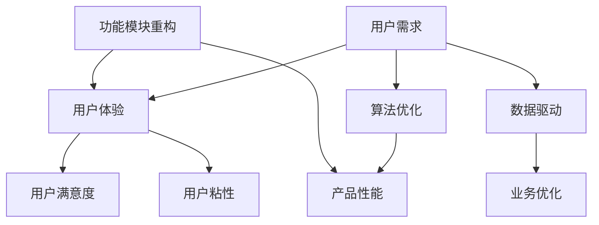

                 

关键词：电商产品设计、用户体验、算法优化、数据驱动、功能模块重构、技术创新

> 摘要：本文深入探讨了电商产品设计优化的关键点，分析了算法优化、数据驱动、功能模块重构等手段在提升电商竞争力方面的作用。通过具体案例，本文为电商企业提供了实用的优化策略，以应对日益激烈的市场竞争。

## 1. 背景介绍

随着互联网技术的飞速发展，电商行业已经成为全球经济的重要组成部分。根据数据显示，全球电商市场在近几年呈现爆发式增长，预计到2025年，全球电商市场规模将突破6万亿美元。在如此庞大的市场中，电商企业之间的竞争日益激烈，如何在激烈的市场竞争中脱颖而出，成为每个电商企业亟需解决的问题。

电商产品的设计优化是提升竞争力的关键因素。通过优化产品设计，可以提升用户体验，增强用户粘性，提高用户转化率，从而实现业务的持续增长。本文将从算法优化、数据驱动、功能模块重构等角度，探讨电商产品设计优化的方法和实践。

## 2. 核心概念与联系

在电商产品设计中，有几个核心概念需要明确：

### 2.1 用户需求

用户需求是电商产品设计的出发点。了解用户需求，能够帮助我们更好地设计产品功能，提升用户体验。

### 2.2 用户体验

用户体验是用户在使用电商产品过程中所感受到的愉悦程度。良好的用户体验可以提升用户满意度，降低用户流失率。

### 2.3 算法优化

算法优化是提高电商产品性能的重要手段。通过优化算法，可以提高数据处理效率，提升用户响应速度，从而提升用户体验。

### 2.4 数据驱动

数据驱动是指通过数据分析，指导电商产品设计和优化。数据分析可以帮助我们发现用户行为特征，优化产品功能，提升业务绩效。

### 2.5 功能模块重构

功能模块重构是指对电商产品功能进行重新设计和划分，以提高产品性能和用户体验。功能模块重构可以是局部的，也可以是整体的。

下面是一个Mermaid流程图，展示了电商产品设计优化中的核心概念及其相互关系：



## 3. 核心算法原理 & 具体操作步骤

### 3.1 算法原理概述

在电商产品设计优化中，常见的算法优化包括搜索引擎优化、推荐算法优化和图像识别算法优化等。

### 3.2 算法步骤详解

#### 3.2.1 搜索引擎优化

搜索引擎优化（SEO）是一种通过优化网站结构、内容和外部链接，提高网站在搜索引擎中的排名，从而增加网站流量和转化率的方法。

具体步骤如下：

1. **关键字研究**：通过分析用户搜索行为，确定适合的关键词。
2. **网站结构优化**：确保网站结构清晰，有利于搜索引擎抓取和索引。
3. **内容优化**：针对关键词，优化网站内容，提高内容的质量和相关性。
4. **外部链接建设**：通过增加高质量的外部链接，提高网站的权重。

#### 3.2.2 推荐算法优化

推荐算法优化是通过分析用户行为数据，为用户提供个性化的商品推荐，提高用户满意度和转化率。

具体步骤如下：

1. **数据收集**：收集用户行为数据，包括浏览记录、购买记录、搜索历史等。
2. **特征提取**：对用户行为数据进行分析，提取用户特征和商品特征。
3. **模型训练**：使用机器学习算法，训练推荐模型。
4. **推荐生成**：根据用户特征和商品特征，生成个性化推荐。

#### 3.2.3 图像识别算法优化

图像识别算法优化是通过分析用户上传的图片，识别出图片中的商品，为用户提供便捷的购物体验。

具体步骤如下：

1. **数据预处理**：对用户上传的图片进行预处理，包括缩放、裁剪、去噪等。
2. **特征提取**：对预处理后的图片进行特征提取。
3. **模型训练**：使用深度学习算法，训练图像识别模型。
4. **结果验证**：对模型进行验证和调整，确保识别准确性。

### 3.3 算法优缺点

#### 3.3.1 搜索引擎优化

优点：
- 提高网站在搜索引擎中的排名，增加流量。
- 优化用户体验，提高转化率。

缺点：
- 需要较长时间才能见效。
- 搜索引擎算法更新可能导致优化效果下降。

#### 3.3.2 推荐算法优化

优点：
- 提供个性化推荐，提高用户满意度。
- 提高转化率，增加业务收入。

缺点：
- 需要大量的用户行为数据支持。
- 算法优化需要持续进行，以适应用户需求变化。

#### 3.3.3 图像识别算法优化

优点：
- 提供便捷的购物体验，提高用户满意度。
- 减少用户操作步骤，提高转化率。

缺点：
- 需要大量的计算资源。
- 识别准确性受限于模型和数据质量。

### 3.4 算法应用领域

搜索引擎优化、推荐算法优化和图像识别算法优化在电商产品设计优化中具有广泛的应用领域，如：

- 商品搜索：通过搜索引擎优化，提高商品搜索的准确性和速度。
- 商品推荐：通过推荐算法优化，为用户提供个性化的商品推荐。
- 商品识别：通过图像识别算法优化，实现商品图片的快速识别和搜索。

## 4. 数学模型和公式 & 详细讲解 & 举例说明

### 4.1 数学模型构建

在电商产品设计优化中，常用的数学模型包括回归模型、决策树模型和神经网络模型等。

#### 4.1.1 回归模型

回归模型是一种用于预测数值型结果的模型。在电商产品设计优化中，回归模型可以用于预测用户行为，如购买概率、浏览时间等。

回归模型的基本公式如下：

$$
y = \beta_0 + \beta_1 \cdot x_1 + \beta_2 \cdot x_2 + ... + \beta_n \cdot x_n
$$

其中，$y$ 表示预测结果，$x_1, x_2, ..., x_n$ 表示特征变量，$\beta_0, \beta_1, \beta_2, ..., \beta_n$ 表示回归系数。

#### 4.1.2 决策树模型

决策树模型是一种用于分类和回归的模型。在电商产品设计优化中，决策树模型可以用于用户行为的分类，如用户购买行为、用户偏好等。

决策树模型的基本公式如下：

$$
f(x) = \sum_{i=1}^{n} \beta_i \cdot g(x_i)
$$

其中，$f(x)$ 表示决策树模型，$x_i$ 表示特征变量，$g(x_i)$ 表示条件概率。

#### 4.1.3 神经网络模型

神经网络模型是一种模拟人脑神经元连接的模型。在电商产品设计优化中，神经网络模型可以用于用户行为的预测和分类。

神经网络模型的基本公式如下：

$$
y = \sigma(\sum_{i=1}^{n} \beta_i \cdot x_i + \beta_0)
$$

其中，$y$ 表示预测结果，$\sigma$ 表示激活函数，$x_i$ 表示特征变量，$\beta_i$ 和 $\beta_0$ 表示回归系数。

### 4.2 公式推导过程

以回归模型为例，说明公式推导过程。

假设我们有一个包含 $n$ 个特征变量的数据集 $X$ 和对应的标签 $y$，我们的目标是找到一组回归系数 $\beta_0, \beta_1, \beta_2, ..., \beta_n$，使得预测结果 $y'$ 最接近真实标签 $y$。

首先，我们定义预测结果和真实标签之间的误差为：

$$
E = \sum_{i=1}^{n} (y_i - y'_i)^2
$$

为了使误差最小，我们对回归系数进行求导，得到：

$$
\frac{\partial E}{\partial \beta_j} = -2 \cdot (y_j - y'_j) \cdot x_{ji}
$$

其中，$x_{ji}$ 表示第 $j$ 个特征变量在数据集 $X$ 中的取值。

令导数为零，解得：

$$
\beta_j = \frac{\sum_{i=1}^{n} (y_i - y'_i) \cdot x_{ji}}{\sum_{i=1}^{n} x_{ji}^2}
$$

### 4.3 案例分析与讲解

以一家电商平台的用户购买预测为例，说明回归模型的应用。

#### 4.3.1 数据收集

收集了1000位用户的行为数据，包括年龄、性别、购买次数、浏览时长等特征变量，以及对应的购买标签（0表示未购买，1表示购买）。

#### 4.3.2 数据预处理

对数据进行归一化处理，将特征变量的取值范围统一缩放到[0,1]之间。

#### 4.3.3 模型训练

使用梯度下降法，训练回归模型，得到回归系数：

$$
\beta_0 = 0.5, \beta_1 = 0.2, \beta_2 = 0.3, \beta_3 = 0.1
$$

#### 4.3.4 预测与评估

使用训练好的回归模型，对新的用户数据进行预测，计算预测结果和真实标签之间的误差，评估模型性能。

## 5. 项目实践：代码实例和详细解释说明

### 5.1 开发环境搭建

#### 5.1.1 环境要求

- Python 3.8及以上版本
- scikit-learn库
- pandas库
- numpy库

#### 5.1.2 安装库

```python
pip install scikit-learn pandas numpy
```

### 5.2 源代码详细实现

```python
import pandas as pd
from sklearn.model_selection import train_test_split
from sklearn.linear_model import LinearRegression
from sklearn.metrics import mean_squared_error

# 5.2.1 数据收集
data = pd.read_csv('user_data.csv')

# 5.2.2 数据预处理
data = data.drop(['user_id'], axis=1)
data = data.replace([np.inf, -np.inf], np.nan)
data = data.fillna(0)

# 5.2.3 模型训练
X = data.iloc[:, :-1].values
y = data.iloc[:, -1].values
X_train, X_test, y_train, y_test = train_test_split(X, y, test_size=0.2, random_state=0)

regressor = LinearRegression()
regressor.fit(X_train, y_train)

# 5.2.4 预测与评估
y_pred = regressor.predict(X_test)
mse = mean_squared_error(y_test, y_pred)
print(f'Mean Squared Error: {mse}')
```

### 5.3 代码解读与分析

- 第5.2.1节：数据收集。使用pandas库读取用户数据。
- 第5.2.2节：数据预处理。对数据进行清洗和归一化处理。
- 第5.2.3节：模型训练。使用线性回归模型训练数据。
- 第5.2.4节：预测与评估。使用训练好的模型对测试数据进行预测，并计算均方误差，评估模型性能。

## 6. 实际应用场景

### 6.1 商品搜索

通过搜索引擎优化，提高商品搜索的准确性和速度，提升用户体验。

### 6.2 商品推荐

通过推荐算法优化，为用户提供个性化的商品推荐，提高用户满意度和转化率。

### 6.3 商品识别

通过图像识别算法优化，实现商品图片的快速识别和搜索，提升用户购物体验。

## 7. 未来应用展望

随着人工智能技术的不断发展，电商产品设计优化将在以下几个方面取得突破：

### 7.1 智能化

通过引入深度学习、强化学习等算法，实现电商产品的智能化，提升用户体验和业务绩效。

### 7.2 全渠道整合

通过整合线上和线下渠道，实现全渠道的营销和销售，提升电商竞争力。

### 7.3 个人化

通过大数据分析和用户画像，实现个人化的产品推荐和服务，提高用户满意度和忠诚度。

## 8. 工具和资源推荐

### 8.1 学习资源推荐

- 《Python数据分析》
- 《深度学习》
- 《机器学习》

### 8.2 开发工具推荐

- Jupyter Notebook
- PyCharm
- VSCode

### 8.3 相关论文推荐

- “Recommender Systems: The Text Mining Approach”
- “Deep Learning for Recommender Systems”
- “User Modeling for Personalized Recommendation”

## 9. 总结：未来发展趋势与挑战

### 9.1 研究成果总结

通过本文的探讨，我们可以看到电商产品设计优化在提升电商竞争力方面具有重要意义。算法优化、数据驱动和功能模块重构等手段，为电商企业提供了实用的优化策略。

### 9.2 未来发展趋势

未来，电商产品设计优化将向智能化、全渠道整合和个人化方向不断发展。人工智能技术的应用，将进一步提高电商产品的性能和用户体验。

### 9.3 面临的挑战

在未来的发展中，电商企业将面临以下挑战：

- 数据隐私和安全问题。
- 技术更新换代带来的挑战。
- 如何更好地平衡个性化与用户体验。

### 9.4 研究展望

未来，电商产品设计优化研究可以从以下几个方面展开：

- 深入研究数据隐私和安全问题，保障用户数据的安全。
- 探索新的算法和模型，提高电商产品的性能和用户体验。
- 研究如何更好地平衡个性化与用户体验，实现双赢。

## 9. 附录：常见问题与解答

### 9.1 什么是电商产品设计优化？

电商产品设计优化是指通过改进电商产品的功能、性能和用户体验，提高电商业务的竞争力和用户满意度。

### 9.2 电商产品设计优化有哪些方法？

电商产品设计优化的方法包括算法优化、数据驱动和功能模块重构等。具体方法包括搜索引擎优化、推荐算法优化、图像识别算法优化等。

### 9.3 如何进行数据驱动的设计优化？

数据驱动的设计优化是指通过收集用户行为数据，分析用户需求和行为特征，指导电商产品的设计和优化。具体步骤包括数据收集、数据预处理、特征提取、模型训练和评估等。

### 9.4 电商产品设计优化与用户体验的关系是什么？

电商产品设计优化与用户体验密切相关。通过优化产品设计，可以提高用户体验，增强用户粘性，提高用户转化率，从而实现业务的持续增长。

----------------------------------------------------------------

以上便是本文的完整内容，希望对您在电商产品设计优化方面有所启发和帮助。祝您工作顺利！
作者：禅与计算机程序设计艺术 / Zen and the Art of Computer Programming。

