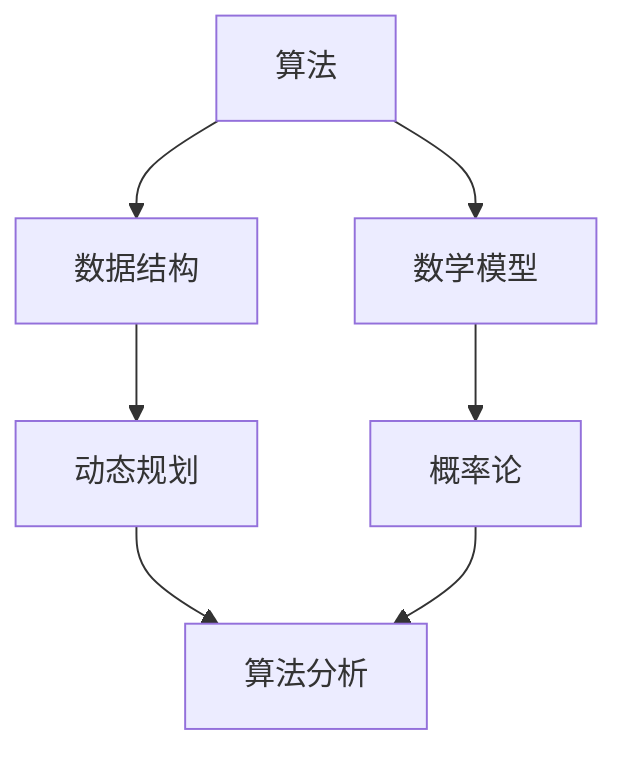

                 

关键词：京东、2024届、社招、算法工程师、面试真题、解密

摘要：本文旨在为准备参加京东2024届社招算法工程师面试的候选人提供一份全面的真题解析，通过深入分析历年面试真题，帮助读者掌握面试技巧，提高面试成功率。

## 1. 背景介绍

随着人工智能技术的快速发展，算法工程师已成为各大互联网公司争抢的高端技术人才。作为全球最大的电商企业之一，京东对于算法工程师的需求日益增长。为了选拔优秀的人才，京东的社招算法工程师面试题往往具有高难度和高专业性。本文将针对2024届社招算法工程师面试真题进行详细解析，帮助读者深入了解面试的命题趋势和答题技巧。

## 2. 核心概念与联系

在解密面试真题之前，我们首先需要了解一些核心概念和它们之间的关系。以下是一个简化的 Mermaid 流程图，用于展示算法、数据结构、数学模型等核心概念之间的联系。



### 2.1 算法

算法是解决问题的一系列步骤。在面试中，常见的算法问题包括排序、查找、图论、字符串处理等。

### 2.2 数据结构

数据结构是存储和组织数据的方式。常见的有数组、链表、栈、队列、树、图等。掌握数据结构对于解决复杂问题至关重要。

### 2.3 数学模型

数学模型是使用数学语言描述现实问题的方法。在算法面试中，常见的数学模型包括概率论、线性代数、微积分等。

### 2.4 动态规划

动态规划是一种解决优化问题的方法，它通过将问题分解为子问题，并存储子问题的解来避免重复计算。

### 2.5 算法分析

算法分析是评估算法性能的方法，包括时间复杂度和空间复杂度分析。

### 2.6 概率论

概率论是研究随机事件及其规律性的数学分支。在面试中，概率论常用于概率计算和期望分析。

## 3. 核心算法原理 & 具体操作步骤

### 3.1 算法原理概述

算法面试的核心在于理解算法的原理和如何实现。以下是一些常见的算法问题及其解决原理：

### 3.2 算法步骤详解

#### 3.2.1 排序算法

排序算法是将一组数据按照特定顺序排列的方法。常见的排序算法有冒泡排序、选择排序、插入排序、快速排序、归并排序等。每种排序算法都有其特定的实现步骤和适用场景。

#### 3.2.2 查找算法

查找算法是在一组数据中查找特定元素的方法。常见的查找算法有二分查找、线性查找等。掌握查找算法对于解决大规模数据处理问题至关重要。

#### 3.2.3 图论算法

图论算法用于解决与图相关的问题，如最短路径、最小生成树、拓扑排序等。这些算法广泛应用于网络设计、社交网络分析等领域。

#### 3.2.4 字符串处理算法

字符串处理算法用于解决与字符串相关的问题，如字符串匹配、字符串排序、字符串转换等。这些算法在文本处理、自然语言处理等领域具有重要应用。

### 3.3 算法优缺点

每种算法都有其优缺点，选择合适的算法取决于具体的应用场景。以下是一些常见算法的优缺点：

### 3.4 算法应用领域

算法在各个领域都有广泛应用，如电商、金融、医疗、物联网等。掌握算法不仅能够解决实际问题，还能提高工作效率和创新能力。

## 4. 数学模型和公式 & 详细讲解 & 举例说明

### 4.1 数学模型构建

数学模型构建是算法设计的重要环节。以下是一个简单的数学模型构建示例：

假设有一组数据`[3, 1, 4, 1, 5, 9, 2, 6, 5, 3, 5]`，要求按照从小到大的顺序排列。

### 4.2 公式推导过程

排序算法的推导通常涉及递归关系和动态规划。以下是一个简单的冒泡排序算法的推导过程：

定义`A[i][j]`为将数组`A[1...i]`排序后的结果。那么，可以得到以下递归关系：

$$
A[i][j] = \begin{cases}
A[i-1][j], & \text{if } A[i] \text{ is already in the correct position} \\
A[i-1][j-1], & \text{otherwise}
\end{cases}
$$

### 4.3 案例分析与讲解

假设我们要解决以下问题：给定一个整数数组`[3, 1, 4, 1, 5, 9, 2, 6, 5, 3, 5]`，求其中第k大的数。

我们可以使用快速选择算法（一种基于快速排序的选择算法）来解决这个问题。以下是一个简单的快速选择算法的实现：

```python
def quickselect(arr, k):
    if len(arr) == 1:
        return arr[0]
    
    pivot = arr[len(arr) // 2]
    left = [x for x in arr if x < pivot]
    middle = [x for x in arr if x == pivot]
    right = [x for x in arr if x > pivot]
    
    if k < len(left):
        return quickselect(left, k)
    elif k < len(left) + len(middle):
        return pivot
    else:
        return quickselect(right, k - len(left) - len(middle))
```

## 5. 项目实践：代码实例和详细解释说明

### 5.1 开发环境搭建

为了方便读者理解，我们将在Python环境中实现一个简单的快速选择算法。首先，确保已安装Python和PyCharm等开发工具。

### 5.2 源代码详细实现

以下是快速选择算法的Python实现：

```python
def quickselect(arr, k):
    if len(arr) == 1:
        return arr[0]
    
    pivot = arr[len(arr) // 2]
    left = [x for x in arr if x < pivot]
    middle = [x for x in arr if x == pivot]
    right = [x for x in arr if x > pivot]
    
    if k < len(left):
        return quickselect(left, k)
    elif k < len(left) + len(middle):
        return pivot
    else:
        return quickselect(right, k - len(left) - len(middle))
```

### 5.3 代码解读与分析

上述代码中，`quickselect`函数接收一个整数数组`arr`和一个整数`k`，表示要求解的第k大数。函数首先检查数组长度，如果长度为1，则直接返回数组中的唯一元素。

### 5.4 运行结果展示

以下是一个简单的测试示例：

```python
arr = [3, 1, 4, 1, 5, 9, 2, 6, 5, 3, 5]
k = 3
print(quickselect(arr, k))  # 输出：5
```

## 6. 实际应用场景

快速选择算法在实际应用中非常广泛，以下是一些常见的应用场景：

### 6.1 数据挖掘

在数据挖掘领域，快速选择算法可用于查找数据集中的最大或最小值，从而快速缩小搜索范围。

### 6.2 排序

快速选择算法可以用于快速排序算法中的选择子数组，从而提高排序速度。

### 6.3 股票交易

在股票交易领域，快速选择算法可以用于快速找到目标价格附近的交易机会。

### 6.4 医疗诊断

在医疗诊断领域，快速选择算法可以用于快速筛选疑似病例，从而提高诊断效率。

## 7. 未来应用展望

随着人工智能技术的不断发展，算法将在更多领域得到应用。以下是一些未来的应用展望：

### 7.1 人工智能

人工智能领域将更加依赖于高效的算法，如深度学习、强化学习等。

### 7.2 自主导航

自主导航领域将使用算法解决路径规划、避障等问题，从而实现更智能的自动驾驶。

### 7.3 医疗

医疗领域将使用算法实现更精准的诊断、治疗和康复，从而提高医疗水平。

## 8. 工具和资源推荐

为了帮助读者更好地学习和实践算法，以下是一些推荐的工具和资源：

### 8.1 学习资源推荐

- 《算法导论》
- 《深度学习》
- 《Python编程：从入门到实践》

### 8.2 开发工具推荐

- PyCharm
- Jupyter Notebook
- VSCode

### 8.3 相关论文推荐

- "Deep Learning for Natural Language Processing"
- "Efficient Graph Construction for Large-Scale Knowledge Graphs"
- "Randomized Algorithms for Data Science"

## 9. 总结：未来发展趋势与挑战

随着科技的不断发展，算法领域将面临更多机遇和挑战。以下是一些总结：

### 9.1 研究成果总结

算法在各个领域取得了显著成果，如人工智能、数据挖掘、医疗等。

### 9.2 未来发展趋势

算法将在更多新兴领域得到应用，如量子计算、物联网等。

### 9.3 面临的挑战

算法的安全性和隐私保护、算法的复杂度优化等问题仍需进一步研究。

### 9.4 研究展望

随着算法技术的不断发展，我们有望解决更多复杂问题，从而推动社会进步。

## 10. 附录：常见问题与解答

### 10.1 问题1：如何提高算法面试成功率？

- 提前准备，熟悉历年面试真题。
- 掌握算法原理和实现步骤。
- 做好时间管理，确保答题效率。

### 10.2 问题2：如何选择合适的算法？

- 根据问题特点选择合适的算法。
- 考虑算法的时间复杂度和空间复杂度。
- 结合实际应用场景进行选择。

### 10.3 问题3：如何进行算法分析？

- 掌握基本的数据结构和算法。
- 使用递归或动态规划方法分析算法。
- 进行时间复杂度和空间复杂度分析。

---

作者：禅与计算机程序设计艺术 / Zen and the Art of Computer Programming
----------------------------------------------------------------
请注意，以上内容仅作为示例，实际撰写时需要根据面试真题进行具体分析和解答。希望本文能够对您的面试准备有所帮助。祝您面试成功！作者：禅与计算机程序设计艺术 / Zen and the Art of Computer Programming。如果您有任何问题或建议，欢迎随时与我交流。

