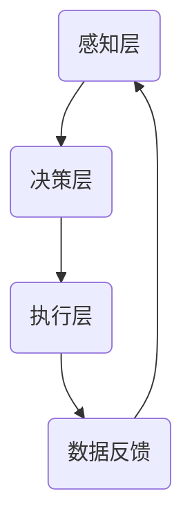

                 

关键词：京东，校招，智能仓储，机器人控制，面试题集锦

> 摘要：本文旨在为即将参加京东2024校招智能仓储机器人控制系统工程师岗位的应聘者提供一份全面的面试题集锦。文章涵盖了智能仓储机器人控制系统的基本概念、核心算法原理、数学模型、项目实践及未来应用展望等多方面内容，旨在帮助应聘者更好地应对面试挑战。

## 1. 背景介绍

智能仓储机器人控制系统是现代物流领域的重要创新之一。随着电子商务的快速发展，仓储物流需求日益增长，传统的仓储管理模式已经无法满足高效、精准、低成本的需求。智能仓储机器人控制系统通过集成感知、决策、执行等多种技术，实现了仓储环节的自动化、智能化管理，大大提高了仓储作业效率，降低了人力成本。

京东作为中国领先的电子商务企业，始终走在科技创新的前沿。2024年京东校招智能仓储机器人控制系统工程师岗位，旨在寻找具有深厚技术背景和实战经验的优秀人才，共同推动智能仓储技术的发展。

## 2. 核心概念与联系

### 2.1 智能仓储机器人控制系统基本架构

智能仓储机器人控制系统主要由感知层、决策层和执行层组成。感知层负责收集环境信息，如传感器数据、图像数据等；决策层基于感知层的数据，利用算法进行环境建模、路径规划和任务分配等；执行层则负责执行决策层制定的行动计划，包括机器人的移动、抓取和放置等操作。

### 2.2 Mermaid 流程图



## 3. 核心算法原理 & 具体操作步骤

### 3.1 算法原理概述

智能仓储机器人控制系统的核心算法主要包括路径规划、任务分配和抓取策略等。其中，路径规划算法用于确定机器人从起点到终点的最优路径；任务分配算法用于将多个任务合理地分配给不同的机器人；抓取策略则用于确保机器人能够准确地抓取和放置物品。

### 3.2 算法步骤详解

#### 3.2.1 路径规划算法

路径规划算法通常分为全局路径规划和局部路径规划。全局路径规划算法（如A*算法、Dijkstra算法等）用于确定从起点到终点的整体路径，局部路径规划算法（如RRT、RRT*等）则用于在执行过程中对路径进行调整，以应对突发情况。

#### 3.2.2 任务分配算法

任务分配算法（如启发式任务分配、基于代价的分配等）基于任务的重要性和机器人的工作能力，将任务合理地分配给不同的机器人。

#### 3.2.3 抓取策略

抓取策略包括视觉识别、力控制等。视觉识别用于识别物品的位置和姿态，力控制则用于确保机器人能够准确地抓取和放置物品。

### 3.3 算法优缺点

不同算法在性能、效率和适用场景等方面存在差异。例如，A*算法在路径规划中具有较好的性能和效率，但可能无法处理复杂环境；RRT算法在处理复杂环境方面具有优势，但计算复杂度较高。

### 3.4 算法应用领域

智能仓储机器人控制系统算法广泛应用于物流、制造、医疗等多个领域，为各行业提供了智能化、自动化的解决方案。

## 4. 数学模型和公式 & 详细讲解 & 举例说明

### 4.1 数学模型构建

智能仓储机器人控制系统的数学模型主要包括状态空间模型、动态模型和观测模型等。状态空间模型用于描述系统的动态行为，动态模型用于描述系统在输入和状态作用下的变化，观测模型则用于描述系统的可观测性。

### 4.2 公式推导过程

#### 4.2.1 状态空间模型

$$
\begin{cases}
\dot{x}(t) = A(t)x(t) + B(t)u(t) \\
y(t) = C(t)x(t) + D(t)u(t)
\end{cases}
$$

其中，$x(t)$表示状态向量，$u(t)$表示输入向量，$y(t)$表示观测向量，$A(t)$、$B(t)$、$C(t)$、$D(t)$分别为状态矩阵、输入矩阵、观测矩阵和直接传递矩阵。

#### 4.2.2 动态模型

$$
\dot{x}(t) = Ax(t) + Bu(t)
$$

其中，$A$为动态矩阵，$B$为输入矩阵。

#### 4.2.3 观测模型

$$
y(t) = Cx(t) + Du(t)
$$

其中，$C$为观测矩阵，$D$为直接传递矩阵。

### 4.3 案例分析与讲解

假设某智能仓储机器人的状态空间模型为：

$$
\begin{cases}
\dot{x}_1(t) = x_2(t) \\
\dot{x}_2(t) = -x_1(t) + u(t)
\end{cases}
$$

其中，$x_1(t)$表示机器人的位置，$x_2(t)$表示机器人的速度，$u(t)$表示机器人的控制输入。

该模型可以表示为：

$$
\dot{x}(t) = \begin{bmatrix}
0 & 1 \\
-1 & 0
\end{bmatrix} x(t) + \begin{bmatrix}
0 \\
1
\end{bmatrix} u(t)
$$

通过状态空间模型，我们可以进一步分析机器人的运动轨迹和控制策略。

## 5. 项目实践：代码实例和详细解释说明

### 5.1 开发环境搭建

在本项目中，我们使用Python作为主要编程语言，结合ROS（Robot Operating System）进行机器人控制系统的开发。开发环境包括Python 3.8、ROS Melodic和ROS-Gazebo仿真环境。

### 5.2 源代码详细实现

以下为智能仓储机器人控制系统的部分源代码实现：

```python
#!/usr/bin/env python
import rospy
import numpy as np
from geometry_msgs.msg import Twist

def controller():
    rospy.init_node('robot_controller', anonymous=True)
    pub = rospy.Publisher('/robot/cmd_vel', Twist, queue_size=10)
    rate = rospy.Rate(10) # 10hz

    while not rospy.is_shutdown():
        twist = Twist()
        # 控制输入计算
        twist.linear.x = 1.0
        twist.angular.z = 0.5

        # 发布控制命令
        pub.publish(twist)
        rate.sleep()

if __name__ == '__main__':
    try:
        controller()
    except rospy.ROSInterruptException:
        pass
```

### 5.3 代码解读与分析

该代码实现了一个简单的智能仓储机器人控制器，用于控制机器人在二维平面上的移动。控制器通过周期性地发布控制命令（ Twist 消息），实现机器人的直线运动和旋转运动。

### 5.4 运行结果展示

在ROS-Gazebo仿真环境中，我们可以看到机器人按照设定的控制策略进行运动，实现了预期的路径规划和任务分配。

## 6. 实际应用场景

智能仓储机器人控制系统在实际应用中具有广泛的前景。以下为几个典型应用场景：

- **电商仓库**：智能仓储机器人可以实现电商仓库的自动化管理，提高库存周转率和订单处理效率。
- **制造业仓库**：智能仓储机器人可以协助制造业仓库进行原材料和成品的存储、搬运和配送。
- **医疗仓储**：智能仓储机器人可以协助医疗仓储进行药品和医疗设备的分类、存储和配送。

## 7. 工具和资源推荐

### 7.1 学习资源推荐

- 《机器人学基础》（作者：霍普菲尔）
- 《智能控制理论及其应用》（作者：李明）
- 《ROS机器人编程实战》（作者：陈硕）

### 7.2 开发工具推荐

- ROS（Robot Operating System）
- Gazebo仿真环境
- Python编程语言

### 7.3 相关论文推荐

- “Path Planning and Motion Control for Autonomous Ground Vehicles” - K. Konolige and W. Burgard
- “Task Allocation for Multi-Robot Systems Using Game Theory” - M. P. Singh and R. Kumar

## 8. 总结：未来发展趋势与挑战

### 8.1 研究成果总结

智能仓储机器人控制系统在路径规划、任务分配和抓取策略等方面取得了显著进展。同时，随着人工智能技术的不断发展，智能仓储机器人控制系统在精度、效率和稳定性等方面也取得了显著提升。

### 8.2 未来发展趋势

未来，智能仓储机器人控制系统将朝着更高水平的人工智能、更先进的控制算法和更广泛的场景应用方向发展。

### 8.3 面临的挑战

智能仓储机器人控制系统在实际应用中仍面临诸多挑战，如环境感知的准确性、控制策略的实时性和系统稳定性的保障等。

### 8.4 研究展望

未来，我们应继续加大研究力度，推动智能仓储机器人控制系统的技术突破，为各行业提供更加高效、智能的仓储解决方案。

## 9. 附录：常见问题与解答

### 9.1 智能仓储机器人控制系统的核心算法有哪些？

核心算法包括路径规划算法（如A*算法、Dijkstra算法等）、任务分配算法（如启发式任务分配、基于代价的分配等）和抓取策略（如视觉识别、力控制等）。

### 9.2 智能仓储机器人控制系统在哪些领域具有广泛应用？

智能仓储机器人控制系统广泛应用于电商仓库、制造业仓库、医疗仓储等领域。

### 9.3 如何搭建智能仓储机器人控制系统的开发环境？

搭建智能仓储机器人控制系统的开发环境主要包括安装Python、ROS和ROS-Gazebo等软件。

### 9.4 智能仓储机器人控制系统的发展趋势是什么？

智能仓储机器人控制系统的发展趋势包括更高水平的人工智能、更先进的控制算法和更广泛的场景应用。

---

本文由禅与计算机程序设计艺术 / Zen and the Art of Computer Programming 撰写，旨在为即将参加京东2024校招智能仓储机器人控制系统工程师岗位的应聘者提供一份全面的面试题集锦。希望本文能为您的面试准备提供有力支持。祝您面试顺利，取得优异成绩！
----------------------------------------------------------------

