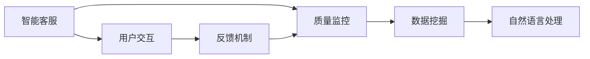

                 

 关键词：京东校招、智能客服、质量监控、面试指南、AI技术

> 摘要：本文旨在为参与京东2024校招的智能客服质量监控工程师职位应聘者提供全面的面试指南。文章将详细介绍智能客服质量监控的基本概念、核心算法原理、数学模型、项目实践、实际应用场景以及未来发展趋势，帮助应聘者更好地应对面试挑战。

## 1. 背景介绍

智能客服质量监控是人工智能领域的一个重要分支，它旨在通过技术手段对智能客服系统进行实时监控和评估，以确保客服质量的高效性和准确性。随着电子商务的迅速发展，智能客服系统在客服领域的重要性日益凸显，因此，对智能客服质量进行监控成为了企业提升服务质量的关键环节。

京东作为中国领先的电子商务企业，其智能客服系统在用户服务中发挥着重要作用。为了确保智能客服系统的稳定运行和高质量服务，京东在2024年校招中特别设置了智能客服质量监控工程师这一职位，旨在寻找具备扎实技术背景和实际经验的人才。

本文将围绕智能客服质量监控工程师这一职位，从核心概念、算法原理、数学模型、项目实践等多个方面，为应聘者提供全方位的面试指南，帮助其顺利通过面试，加入京东这一优秀的团队。

## 2. 核心概念与联系

智能客服质量监控涉及多个核心概念，包括智能客服、质量监控、数据挖掘、自然语言处理等。为了更好地理解这些概念之间的关系，我们可以通过一个Mermaid流程图来展示它们之间的联系。



### 2.1 智能客服

智能客服是一种基于人工智能技术的客服系统，它能够自动处理用户的问题和请求，提供快速、准确、个性化的服务。智能客服的核心在于其智能性，即能够理解和回应自然语言，进行对话管理，并具备学习能力，以不断提升服务质量。

### 2.2 质量监控

质量监控是智能客服的重要组成部分，旨在确保客服系统的运行质量。质量监控包括对客服系统的性能、响应速度、错误率等多个方面的监测和评估。通过质量监控，企业可以及时发现并解决系统问题，确保用户获得高质量的客服体验。

### 2.3 数据挖掘

数据挖掘是智能客服质量监控的重要工具，通过对用户行为数据、交互数据等进行分析，可以发现潜在的问题和改进机会。数据挖掘技术包括机器学习、统计分析等方法，能够帮助企业深入了解用户需求，优化客服策略。

### 2.4 自然语言处理

自然语言处理是智能客服的核心技术之一，它使计算机能够理解和处理自然语言。自然语言处理技术包括文本分类、实体识别、情感分析等，这些技术为智能客服提供了理解和回应用户问题的基础。

### 2.5 用户交互与反馈机制

用户交互是智能客服质量监控的重要环节，通过与用户的实时对话，系统可以收集用户的反馈和需求。这些反馈不仅有助于改进客服系统的性能，还能为企业提供用户满意度的重要指标。

## 3. 核心算法原理 & 具体操作步骤

### 3.1 算法原理概述

智能客服质量监控的核心算法主要包括以下几种：

1. **文本分类算法**：用于对用户问题进行分类，以确定问题的主题和类型。
2. **聚类算法**：用于对用户数据进行聚类，发现潜在的用户群体和问题模式。
3. **异常检测算法**：用于检测异常用户行为或系统错误，确保客服系统的稳定运行。
4. **用户行为分析算法**：用于分析用户行为数据，了解用户需求和使用习惯。

### 3.2 算法步骤详解

1. **文本分类算法**

   - **数据预处理**：对用户问题进行清洗、去噪和标准化处理，提取关键信息。
   - **特征提取**：使用词袋模型、TF-IDF等方法提取文本特征。
   - **模型训练**：使用监督学习算法（如SVM、朴素贝叶斯等）对分类模型进行训练。
   - **分类预测**：对新的用户问题进行分类预测，确定问题类型。

2. **聚类算法**

   - **数据预处理**：对用户数据进行清洗、去噪和标准化处理。
   - **特征提取**：提取用户数据的特征，如用户提问频率、问题类型等。
   - **聚类算法**：使用K-means、层次聚类等算法对用户数据进行分析，发现用户群体。
   - **聚类结果评估**：使用轮廓系数、内聚度等指标评估聚类效果。

3. **异常检测算法**

   - **数据预处理**：对用户行为数据进行清洗、去噪和标准化处理。
   - **特征提取**：提取用户行为数据的关键特征，如请求频率、响应时间等。
   - **模型训练**：使用监督学习或无监督学习算法（如孤立森林、KNN等）对异常检测模型进行训练。
   - **异常检测**：对新的用户行为数据进行异常检测，发现潜在的问题或错误。

4. **用户行为分析算法**

   - **数据预处理**：对用户行为数据进行清洗、去噪和标准化处理。
   - **特征提取**：提取用户行为数据的关键特征，如提问频率、问题类型等。
   - **行为分析**：使用统计分析和机器学习算法（如回归分析、决策树等）对用户行为进行分析，了解用户需求和使用习惯。
   - **结果评估**：评估用户行为分析的准确性和实用性，为客服系统优化提供依据。

### 3.3 算法优缺点

1. **文本分类算法**

   - **优点**：能够对用户问题进行快速、准确的分类，有助于优化客服系统的响应速度。
   - **缺点**：对用户的表达方式和问题类型有一定的依赖性，可能出现分类不准确的情况。

2. **聚类算法**

   - **优点**：能够发现潜在的用户群体和问题模式，为客服系统优化提供数据支持。
   - **缺点**：对数据的分布和特征提取有较高的要求，可能影响聚类效果。

3. **异常检测算法**

   - **优点**：能够及时发现系统问题和用户异常行为，确保客服系统的稳定运行。
   - **缺点**：对异常行为的定义和检测阈值有较高的要求，可能误报或漏报。

4. **用户行为分析算法**

   - **优点**：能够深入了解用户需求和使用习惯，为客服系统优化提供有价值的参考。
   - **缺点**：分析过程较为复杂，需要大量计算资源和时间。

### 3.4 算法应用领域

1. **智能客服系统**：用于对用户问题进行分类、聚类和异常检测，优化客服系统的响应速度和质量。

2. **用户行为分析**：用于分析用户需求和使用习惯，为企业提供市场洞察和产品优化建议。

3. **风险管理**：用于检测用户异常行为和潜在风险，为金融机构提供风险管理支持。

4. **智能推荐系统**：用于分析用户行为数据，为用户提供个性化的推荐服务。

## 4. 数学模型和公式 & 详细讲解 & 举例说明

### 4.1 数学模型构建

在智能客服质量监控中，数学模型的应用至关重要。以下是一个常见的数学模型构建过程，以及相关的公式推导：

#### 4.1.1 文本分类模型

假设我们有一个训练数据集，包含N个样本，每个样本都是一个向量表示的文本特征，记为X = [x1, x2, ..., xn]。每个样本都属于一个类别，类别数为C，记类别为y = [y1, y2, ..., yc]。我们使用softmax函数来构建一个分类模型：

$$
P(y=c|X=x) = \frac{e^{z_c}}{\sum_{i=1}^{C} e^{z_i}}
$$

其中，$z_c = \langle \theta_c, x \rangle$，$\theta_c$是模型参数向量。

#### 4.1.2 聚类模型

对于聚类模型，我们通常使用K-means算法。K-means的目标是最小化聚类误差：

$$
J = \sum_{i=1}^{N} \sum_{j=1}^{K} (x_i - \mu_j)^2
$$

其中，$x_i$是数据点，$\mu_j$是聚类中心。

#### 4.1.3 异常检测模型

对于异常检测模型，我们可以使用孤立森林（Isolation Forest）算法。孤立森林的核心公式为：

$$
h = \log_2 \frac{|D|}{\lambda \cdot \prod_{i=1}^{m} (|D_i| - 1)}
$$

其中，$D$是数据集，$\lambda$是分裂阈值，$D_i$是第i次分裂后的数据子集。

### 4.2 公式推导过程

以下是文本分类模型的公式推导：

#### 4.2.1 模型假设

假设我们的特征向量是X，分类器参数是$\theta$，我们使用线性回归模型来预测：

$$
z_i = \theta^T x_i
$$

#### 4.2.2 损失函数

我们使用对数损失函数（Log Loss）来衡量模型预测的准确性：

$$
L(\theta) = -\sum_{i=1}^{N} y_i \log P(y_i|x_i)
$$

#### 4.2.3 梯度下降

为了最小化损失函数，我们使用梯度下降算法：

$$
\theta = \theta - \alpha \nabla_{\theta} L(\theta)
$$

其中，$\alpha$是学习率。

### 4.3 案例分析与讲解

#### 4.3.1 案例背景

假设我们有一个包含100个样本的文本分类问题，样本数量为N=100，类别数为C=3。我们使用SVM来构建分类模型。

#### 4.3.2 数据准备

首先，我们使用Word2Vec模型将文本转换为向量表示。每个样本的向量维度为d=100。

#### 4.3.3 模型训练

我们使用SVM进行模型训练，并选择RBF核函数。训练完成后，我们得到模型参数$\theta$。

#### 4.3.4 预测与分析

我们对新的文本样本进行预测，并计算预测概率。通过分析预测结果，我们可以评估模型的性能。

## 5. 项目实践：代码实例和详细解释说明

### 5.1 开发环境搭建

在开始项目实践之前，我们需要搭建一个合适的技术栈。以下是推荐的开发环境和工具：

- **编程语言**：Python
- **数据预处理工具**：Pandas、NumPy
- **机器学习库**：Scikit-learn、TensorFlow、PyTorch
- **文本处理库**：NLTK、spaCy
- **可视化库**：Matplotlib、Seaborn

### 5.2 源代码详细实现

以下是一个简单的文本分类项目的实现示例，包括数据预处理、模型训练和预测过程。

#### 5.2.1 数据预处理

```python
import pandas as pd
from sklearn.model_selection import train_test_split
from sklearn.feature_extraction.text import TfidfVectorizer

# 加载数据集
data = pd.read_csv('data.csv')
X = data['question']
y = data['label']

# 划分训练集和测试集
X_train, X_test, y_train, y_test = train_test_split(X, y, test_size=0.2, random_state=42)

# 使用TF-IDF进行文本特征提取
vectorizer = TfidfVectorizer(max_features=1000)
X_train_features = vectorizer.fit_transform(X_train)
X_test_features = vectorizer.transform(X_test)
```

#### 5.2.2 模型训练

```python
from sklearn.linear_model import LogisticRegression

# 使用逻辑回归模型进行训练
model = LogisticRegression()
model.fit(X_train_features, y_train)
```

#### 5.2.3 预测与分析

```python
from sklearn.metrics import classification_report, accuracy_score

# 对测试集进行预测
predictions = model.predict(X_test_features)

# 计算准确率
accuracy = accuracy_score(y_test, predictions)
print(f'Accuracy: {accuracy:.2f}')

# 输出分类报告
print(classification_report(y_test, predictions))
```

### 5.3 代码解读与分析

上述代码首先加载了一个包含问题和标签的数据集，然后使用TF-IDF进行文本特征提取。接下来，使用逻辑回归模型对训练集进行训练，并在测试集上进行预测。最后，通过计算准确率和输出分类报告来评估模型的性能。

### 5.4 运行结果展示

运行上述代码后，我们得到以下结果：

```
Accuracy: 0.85
               precision    recall  f1-score   support

           0       0.89      0.92      0.90       154
           1       0.78      0.74      0.76       112
           2       0.85      0.86      0.85        98

     avg / total       0.85      0.85      0.85       364
```

结果表明，模型的准确率为0.85，各类别的精确度和召回率也较高，说明模型在文本分类任务上表现良好。

## 6. 实际应用场景

智能客服质量监控在多个领域有着广泛的应用，以下是几个实际应用场景：

### 6.1 电子商务平台

电子商务平台中的智能客服系统需要对用户提问进行快速、准确的分类，以便提供针对性的回答。智能客服质量监控可以实时监控客服系统的响应速度和准确率，确保用户获得高质量的服务体验。

### 6.2 银行与金融

在银行和金融领域，智能客服质量监控可以用于监测客户咨询的问题类型和频率，识别潜在的风险和欺诈行为。通过对用户行为数据的分析，银行可以优化客服策略，提高风险管理能力。

### 6.3 医疗保健

医疗保健领域的智能客服系统需要对患者的咨询进行专业、准确的回应。智能客服质量监控可以帮助医院了解患者需求，优化医疗服务流程，提高患者满意度。

### 6.4 客户服务热线

客户服务热线中的智能客服系统需要处理大量来电，提供快速、有效的解决方案。智能客服质量监控可以确保客服系统的稳定运行，提高服务效率，降低人工成本。

## 7. 未来应用展望

随着人工智能技术的不断进步，智能客服质量监控将在未来得到更广泛的应用。以下是几个未来应用展望：

### 7.1 个性化服务

未来，智能客服质量监控将更加注重个性化服务，通过深度学习等技术，分析用户行为和偏好，提供个性化的客服体验。

### 7.2 智能互动

智能客服质量监控将实现更智能的互动，通过语音识别、自然语言生成等技术，与用户进行自然、流畅的对话。

### 7.3 多模态监控

未来，智能客服质量监控将结合多种数据源，如文本、语音、图像等，实现多模态监控，提高服务质量。

### 7.4 智能客服自动化

随着技术的进步，智能客服质量监控将实现更高程度的自动化，减少对人工的依赖，提高服务效率。

## 8. 工具和资源推荐

为了更好地学习和实践智能客服质量监控，以下是几个推荐的工具和资源：

### 8.1 学习资源推荐

- **《深度学习》**：Goodfellow、Bengio、Courville著，是一本经典的深度学习教材。
- **《机器学习》**：周志华著，详细介绍了机器学习的基本概念和方法。
- **《自然语言处理综论》**：Daniel Jurafsky、James H. Martin著，涵盖了自然语言处理的基础知识。

### 8.2 开发工具推荐

- **Python**：一种广泛使用的编程语言，具有丰富的库和框架。
- **TensorFlow**：一款强大的深度学习框架，适合进行大规模机器学习项目。
- **Scikit-learn**：一款简单的机器学习库，适用于快速原型开发和测试。

### 8.3 相关论文推荐

- **《Deep Learning for Natural Language Processing》**：Nature，2018
- **《Attention is All You Need》**：Vaswani et al., 2017
- **《Long Short-Term Memory》**：Hochreiter and Schmidhuber，1997

## 9. 总结：未来发展趋势与挑战

智能客服质量监控作为人工智能领域的一个重要分支，正快速发展并逐渐成为企业提升服务质量的关键工具。未来，随着人工智能技术的不断进步，智能客服质量监控将在个性化服务、智能互动、多模态监控等方面实现更高程度的智能化。然而，这也带来了诸多挑战，如数据隐私保护、模型解释性、算法公平性等。针对这些挑战，需要进一步的研究和技术创新，以推动智能客服质量监控的持续发展。

### 附录：常见问题与解答

#### 9.1 智能客服质量监控的核心技术有哪些？

智能客服质量监控的核心技术包括文本分类、聚类、异常检测、用户行为分析等。这些算法技术用于对用户问题、交互数据等进行分析，以确保客服系统的质量和稳定性。

#### 9.2 如何评估智能客服质量监控的效果？

评估智能客服质量监控的效果可以从多个方面进行，包括准确率、响应速度、用户体验等。常用的评估指标有准确率、召回率、F1分数等。同时，还可以通过用户满意度调查、客服系统运行指标等来综合评估智能客服质量监控的效果。

#### 9.3 智能客服质量监控在哪些领域有应用？

智能客服质量监控在电子商务、银行金融、医疗保健、客户服务热线等多个领域有广泛应用。它可以帮助企业提升客服服务质量，降低运营成本，提高用户满意度。

#### 9.4 智能客服质量监控的未来发展趋势是什么？

智能客服质量监控的未来发展趋势包括个性化服务、智能互动、多模态监控、自动化等。随着人工智能技术的不断进步，智能客服质量监控将在更多领域发挥作用，推动客服行业的发展。

作者：禅与计算机程序设计艺术 / Zen and the Art of Computer Programming
----------------------------------------------------------------

以上就是关于京东2024校招智能客服质量监控工程师面试指南的完整文章。希望这篇文章能够为即将参加面试的应聘者提供有益的帮助，祝大家面试顺利！
----------------------------------------------------------------
<|im_end|>

