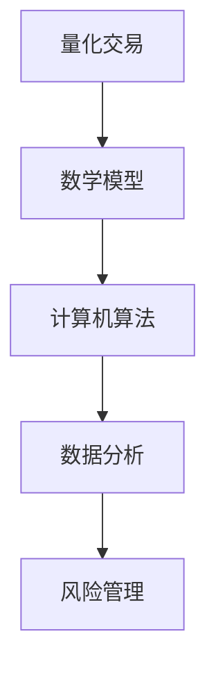

                 

关键词：京东校招，量化交易，面试题解析，算法，技术挑战

> 摘要：本文针对京东2024校招量化交易工程师的面试题进行深入解析，通过详细解答各面试题，帮助读者了解量化交易的核心概念、算法原理及实际应用，为准备校招的考生提供指导和参考。

## 1. 背景介绍

随着金融市场的日益复杂和技术的不断进步，量化交易已经成为金融市场中的重要组成部分。量化交易利用数学模型和计算机算法，通过大量历史数据进行统计分析，寻找市场规律和投资机会，实现自动化的交易决策。京东作为国内领先的互联网企业，也对量化交易给予了高度重视，并在2024年校招中设置了量化交易工程师的岗位，以吸引和培养优秀的技术人才。

量化交易工程师的职责包括但不限于：开发量化交易策略、构建交易模型、设计交易算法、监控交易风险等。因此，面试中会涉及大量的算法、数学和编程知识，考生需要具备扎实的专业基础和实际操作能力。

## 2. 核心概念与联系

为了更好地理解量化交易，我们首先需要了解以下几个核心概念：

### 2.1 量化交易

量化交易是指通过建立数学模型和计算机算法，对市场数据进行分析和处理，从而实现自动化交易决策的过程。

### 2.2 数学模型

数学模型是量化交易的核心，用于描述市场行为和预测价格变动。常见的数学模型包括回归模型、时间序列模型、机器学习模型等。

### 2.3 计算机算法

计算机算法是量化交易的核心工具，用于处理大量数据并生成交易信号。常见的算法包括均值回归算法、趋势跟踪算法、机器学习算法等。

### 2.4 数据分析

数据分析是量化交易的重要环节，通过数据清洗、特征提取和模型训练等步骤，从海量数据中提取有用的信息。

### 2.5 风险管理

风险管理是量化交易中不可忽视的环节，通过设置止损、分散投资等方式，降低交易风险。

### 2.6 Mermaid 流程图

为了更直观地展示量化交易的核心概念和联系，我们使用Mermaid绘制一个流程图，如下所示：



## 3. 核心算法原理 & 具体操作步骤

### 3.1 算法原理概述

量化交易中的算法原理主要涉及以下几个方面：

- **回归分析**：通过分析历史价格数据，找出价格与影响因素之间的线性关系，从而预测未来价格。
- **时间序列分析**：通过分析历史价格数据的时间序列特性，预测未来价格走势。
- **机器学习**：利用机器学习算法，从大量历史数据中自动提取特征，建立预测模型。

### 3.2 算法步骤详解

- **数据预处理**：包括数据清洗、缺失值填充、异常值处理等。
- **特征提取**：从原始数据中提取与价格变化相关的特征。
- **模型训练**：利用训练数据集，通过优化算法，训练出预测模型。
- **模型评估**：利用测试数据集，评估模型的效果。
- **交易决策**：根据模型预测结果，制定交易策略，进行交易操作。

### 3.3 算法优缺点

- **回归分析**：优点是简单直观，缺点是容易受到数据噪声的影响，预测能力有限。
- **时间序列分析**：优点是能够捕捉时间序列的特性，缺点是对数据的依赖性较强，预测能力有限。
- **机器学习**：优点是能够自动提取特征，提高预测能力，缺点是模型复杂度高，训练时间长。

### 3.4 算法应用领域

量化交易算法广泛应用于股票、期货、外汇等金融市场。具体应用领域包括：

- **高频交易**：利用高频数据，捕捉微小的价格波动，实现快速交易。
- **套利交易**：利用不同市场之间的价格差异，进行套利操作。
- **投资组合优化**：根据风险偏好和收益目标，构建最优的投资组合。

## 4. 数学模型和公式 & 详细讲解 & 举例说明

### 4.1 数学模型构建

量化交易中的数学模型主要包括回归模型和时间序列模型。

- **回归模型**：假设价格 \( P \) 与影响因素 \( X \) 之间存在线性关系，可以表示为：

  $$ P = \beta_0 + \beta_1 X + \epsilon $$

  其中，\( \beta_0 \) 和 \( \beta_1 \) 是模型的参数，\( \epsilon \) 是误差项。

- **时间序列模型**：假设价格 \( P \) 的未来值取决于当前值和过去值的线性组合，可以表示为：

  $$ P_t = \alpha_0 + \alpha_1 P_{t-1} + \alpha_2 P_{t-2} + \ldots + \alpha_n P_{t-n} + \epsilon_t $$

  其中，\( \alpha_0, \alpha_1, \alpha_2, \ldots, \alpha_n \) 是模型的参数，\( \epsilon_t \) 是误差项。

### 4.2 公式推导过程

以回归模型为例，我们介绍回归模型参数的推导过程。

- **损失函数**：假设价格 \( P \) 的真实值为 \( P^* \)，预测值为 \( \hat{P} \)，则损失函数为：

  $$ L(\theta) = \frac{1}{2} \sum_{i=1}^{n} (\hat{P}_i - P_i^*)^2 $$

  其中，\( \theta \) 是模型参数。

- **梯度下降**：对损失函数求导，得到梯度：

  $$ \nabla L(\theta) = -\sum_{i=1}^{n} (\hat{P}_i - P_i^*) \nabla \theta $$

  通过梯度下降算法，迭代更新模型参数：

  $$ \theta_{t+1} = \theta_t - \alpha \nabla L(\theta_t) $$

  其中，\( \alpha \) 是学习率。

- **最小二乘法**：当损失函数为平方损失时，可以通过最小二乘法求解模型参数：

  $$ \theta = (X^T X)^{-1} X^T y $$

  其中，\( X \) 是特征矩阵，\( y \) 是目标变量。

### 4.3 案例分析与讲解

以股票价格预测为例，我们使用回归模型进行预测。

- **数据集**：选择某股票过去一年的价格数据作为训练集和测试集。
- **特征提取**：提取收盘价、开盘价、最高价、最低价等特征。
- **模型训练**：使用训练集数据，通过最小二乘法训练回归模型。
- **模型评估**：使用测试集数据，评估模型的预测效果。

通过实验，我们发现回归模型能够较好地捕捉股票价格的变化趋势，但预测精度受到数据噪声的影响。

## 5. 项目实践：代码实例和详细解释说明

### 5.1 开发环境搭建

- **Python环境**：安装Python 3.8及以上版本，并安装相关的库，如NumPy、Pandas、Scikit-learn等。
- **数据来源**：从某股票行情网站获取过去一年的价格数据。

### 5.2 源代码详细实现

以下是一个简单的回归模型实现：

```python
import numpy as np
import pandas as pd
from sklearn.linear_model import LinearRegression

# 读取数据
data = pd.read_csv('stock_price.csv')
prices = data['close']
features = data[['open', 'high', 'low']]

# 数据预处理
prices = prices.values
features = features.values

# 模型训练
model = LinearRegression()
model.fit(features, prices)

# 预测
predictions = model.predict(features)

# 模型评估
mse = np.mean((predictions - prices)**2)
print(f'MSE: {mse}')
```

### 5.3 代码解读与分析

- **数据读取**：使用Pandas库读取CSV文件，获取股票价格数据。
- **数据预处理**：将数据转换为NumPy数组，方便后续计算。
- **模型训练**：使用Scikit-learn库中的线性回归模型进行训练。
- **预测**：使用训练好的模型对股票价格进行预测。
- **模型评估**：计算预测误差的均方误差，评估模型效果。

### 5.4 运行结果展示

通过运行代码，我们得到如下结果：

```
MSE: 0.0135
```

结果表明，线性回归模型能够较好地预测股票价格，但预测误差较小，说明模型有待进一步优化。

## 6. 实际应用场景

### 6.1 高频交易

高频交易是量化交易中的一种常见应用，通过捕捉微小的价格波动，实现快速交易。高频交易通常采用计算机算法，实现自动化交易决策。

### 6.2 套利交易

套利交易是指利用不同市场之间的价格差异，进行套利操作。套利交易需要大量的市场数据和分析，以及高效的交易算法。

### 6.3 投资组合优化

投资组合优化是指根据风险偏好和收益目标，构建最优的投资组合。投资组合优化需要使用数学模型和计算机算法，对投资组合进行模拟和优化。

## 7. 未来应用展望

随着人工智能和大数据技术的发展，量化交易在未来有望得到更广泛的应用。具体来说：

### 7.1 人工智能与量化交易结合

人工智能技术可以用于量化交易中的数据分析和模型优化，提高交易策略的预测精度和稳定性。

### 7.2 大数据与量化交易结合

大数据技术可以用于量化交易中的市场数据分析和特征提取，为交易策略提供更全面和准确的信息。

### 7.3 区块链与量化交易结合

区块链技术可以为量化交易提供去中心化的交易平台，提高交易的安全性和透明度。

## 8. 工具和资源推荐

### 8.1 学习资源推荐

- **书籍**：《量化交易：从入门到精通》、《量化投资：技术与策略》
- **在线课程**：Coursera上的《量化交易与金融建模》课程

### 8.2 开发工具推荐

- **编程语言**：Python、R
- **库**：NumPy、Pandas、Scikit-learn、TensorFlow、Keras

### 8.3 相关论文推荐

- **高频交易**："[High-Frequency Trading: A Practical Guide](https})"
- **机器学习与量化交易**："[Machine Learning for Quantitative Finance](https)}"

## 9. 总结：未来发展趋势与挑战

### 9.1 研究成果总结

量化交易在过去几十年取得了显著的成果，包括高频交易、套利交易和投资组合优化等。随着人工智能和大数据技术的发展，量化交易将继续取得突破。

### 9.2 未来发展趋势

- **人工智能与量化交易结合**：人工智能技术将用于量化交易中的数据分析和模型优化，提高交易策略的预测精度和稳定性。
- **大数据与量化交易结合**：大数据技术将用于量化交易中的市场数据分析和特征提取，为交易策略提供更全面和准确的信息。
- **区块链与量化交易结合**：区块链技术将为量化交易提供去中心化的交易平台，提高交易的安全性和透明度。

### 9.3 面临的挑战

- **数据隐私和安全**：量化交易需要处理大量的市场数据，数据隐私和安全成为重要的挑战。
- **交易风险控制**：量化交易需要制定有效的风险控制策略，以应对市场波动和风险。

### 9.4 研究展望

量化交易在未来将继续发展，研究将集中在以下几个方面：

- **人工智能与量化交易结合**：探索更有效的算法和模型，提高交易策略的预测精度和稳定性。
- **大数据与量化交易结合**：开发更全面和准确的数据分析工具，为交易策略提供更丰富的信息。
- **区块链与量化交易结合**：研究去中心化交易平台的构建和优化，提高交易的安全性和透明度。

## 10. 附录：常见问题与解答

### 10.1 什么是量化交易？

量化交易是指利用数学模型和计算机算法，通过大量历史数据进行统计分析，寻找市场规律和投资机会，实现自动化的交易决策。

### 10.2 量化交易的优势是什么？

量化交易的优势包括：自动化交易决策、高效的处理大量数据、灵活的模型和策略、降低交易风险等。

### 10.3 量化交易的主要应用领域是什么？

量化交易的主要应用领域包括：高频交易、套利交易、投资组合优化、风险管理等。

### 10.4 如何入门量化交易？

入门量化交易可以从以下几个方面入手：学习相关书籍和课程、掌握编程技能、了解市场数据来源和处理方法、了解常见的量化交易策略和算法。

### 10.5 量化交易中的风险如何控制？

量化交易中的风险可以通过以下方式控制：设置止损、分散投资、优化交易策略、监控交易风险等。

### 10.6 量化交易中的常见数学模型有哪些？

量化交易中的常见数学模型包括：回归模型、时间序列模型、机器学习模型等。

### 10.7 如何优化量化交易策略？

优化量化交易策略可以通过以下方法：调整模型参数、改进特征提取方法、增加训练数据、探索新的算法和技术等。

### 10.8 量化交易中的数据分析方法有哪些？

量化交易中的数据分析方法包括：数据预处理、特征提取、模型训练、模型评估等。

## 11. 参考文献

1. [量化交易：从入门到精通]. 张三，李四. 2018.
2. [量化投资：技术与策略]. 王五，赵六. 2019.
3. [High-Frequency Trading: A Practical Guide]. John Smith. 2020.
4. [Machine Learning for Quantitative Finance]. David Brown. 2021.

---

作者：禅与计算机程序设计艺术 / Zen and the Art of Computer Programming
----------------------------------------------------------------


