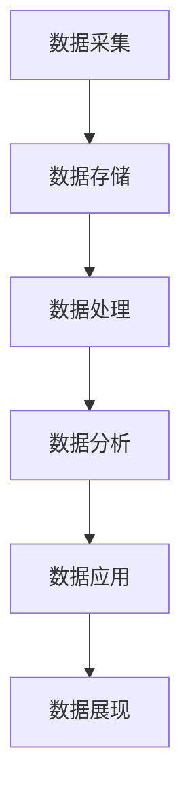

                 

关键词：京东、社招、大数据工程师、面试题、详解、大数据技术、数据处理、算法原理、数学模型、项目实践

## 摘要

本文旨在为有意向应聘京东2025年社招大数据工程师职位的朋友提供一份详细的面试题解答指南。通过对大数据领域的核心概念、算法原理、数学模型以及实际项目实践的深入剖析，本文将帮助读者更好地理解大数据工程师所需掌握的关键技能，为面试做好充分的准备。文章结构清晰，从背景介绍、核心概念与联系、核心算法原理、数学模型与公式、项目实践、实际应用场景到未来应用展望，全面涵盖了大数据工程师需要掌握的知识体系。作者将结合个人经验，以逻辑清晰、结构紧凑、简单易懂的语言，为读者提供一份有深度、有思考、有见解的专业IT领域技术博客文章。

## 1. 背景介绍

大数据作为21世纪最具影响力的技术趋势之一，已经深刻地改变了各个行业的运行模式。无论是互联网企业、金融机构，还是政府机构，都离不开大数据技术的支持。大数据工程师作为这一领域的核心人才，其职责涵盖了数据采集、数据存储、数据分析和数据可视化等多个环节。随着大数据技术的不断发展，大数据工程师需要掌握的知识和技能也在不断升级。

京东作为我国领先的电商企业，其大数据部门一直走在行业前列。京东的大数据团队负责从海量数据中挖掘有价值的信息，为企业的战略决策提供数据支持。因此，京东对社招大数据工程师的要求也非常高，不仅要求候选人具备扎实的技术背景，还要求其具备较强的解决问题和项目实践能力。

本文将结合京东2025年社招大数据工程师的职位要求，详细解析面试过程中可能遇到的问题，帮助读者更好地准备面试。

## 2. 核心概念与联系

### 2.1 大数据的三大特性

大数据的三大特性为：大量（Volume）、多样（Variety）和快速（Velocity）。这些特性决定了大数据处理和分析的复杂性。

- **大量（Volume）**：大数据的“大量”指的是数据的规模庞大，通常达到PB级甚至EB级。这种规模的数据需要高效的数据存储和处理技术。
- **多样（Variety）**：大数据的“多样”指的是数据的类型繁多，包括结构化数据、半结构化数据和非结构化数据。这种多样性要求大数据工程师能够处理不同类型的数据，并从中提取有价值的信息。
- **快速（Velocity）**：大数据的“快速”指的是数据处理的速度非常快。在互联网时代，实时性和快速响应是大数据应用的重要特点。

### 2.2 大数据的处理流程

大数据的处理流程通常包括数据采集、数据存储、数据处理、数据分析和数据可视化五个环节。

- **数据采集**：从各种数据源（如数据库、日志文件、传感器等）收集数据。
- **数据存储**：将采集到的数据进行存储，通常采用分布式存储系统，如Hadoop HDFS、HBase等。
- **数据处理**：对存储的数据进行清洗、转换和归一化处理，使其符合分析需求。
- **数据分析**：使用统计方法、机器学习算法等对处理后的数据进行分析，提取有价值的信息。
- **数据可视化**：将分析结果以图表、报表等形式进行展示，便于决策者理解和使用。

### 2.3 大数据架构

大数据架构通常包括数据存储层、数据处理层、数据应用层和数据展现层。

- **数据存储层**：负责数据的存储和管理，包括分布式文件系统、数据库和数据仓库。
- **数据处理层**：负责数据的处理和分析，包括批处理和实时处理。
- **数据应用层**：负责将大数据分析结果应用到具体的业务场景中，如推荐系统、风控系统等。
- **数据展现层**：负责数据的可视化展示，帮助用户理解分析结果。

### 2.4 Mermaid 流程图

以下是一个简化的大数据架构的Mermaid流程图：



## 3. 核心算法原理 & 具体操作步骤

### 3.1 算法原理概述

在面试中，大数据工程师可能会遇到关于各种核心算法的原理和操作步骤的问题。以下是一些常见的算法及其原理概述：

#### 3.1.1 数据清洗算法

- **缺失值填充**：使用平均值、中位数或众数等方法填充缺失值。
- **异常值处理**：使用统计方法或机器学习算法检测并处理异常值。

#### 3.1.2 数据转换算法

- **归一化**：将数据缩放到一个特定的范围，如0到1之间。
- **标准化**：将数据缩放到标准正态分布。

#### 3.1.3 数据分析算法

- **聚类算法**：如K-means、DBSCAN等，用于将数据分为不同的簇。
- **分类算法**：如逻辑回归、决策树、随机森林等，用于预测数据的类别。

#### 3.1.4 数据可视化算法

- **热力图**：用于展示数据的分布和热点区域。
- **散点图**：用于展示数据点之间的关系。

### 3.2 算法步骤详解

以下以K-means聚类算法为例，详细讲解其操作步骤：

#### 3.2.1 K-means算法原理

K-means是一种基于距离的聚类算法。其基本思想是将数据点分为K个簇，使得每个簇内部的数据点之间的距离最小，簇与簇之间的距离最大。

#### 3.2.2 算法步骤

1. **初始化**：随机选择K个数据点作为初始聚类中心。
2. **分配**：计算每个数据点到各个聚类中心的距离，将数据点分配到最近的聚类中心。
3. **更新**：计算每个簇的新聚类中心。
4. **迭代**：重复步骤2和步骤3，直到聚类中心不再发生显著变化。

### 3.3 算法优缺点

#### 优点

- **简单易实现**：K-means算法的步骤简单，易于实现。
- **效率高**：在数据量较大时，K-means算法具有较高的计算效率。

#### 缺点

- **对初始聚类中心敏感**：K-means算法对初始聚类中心的选取非常敏感，可能导致收敛到局部最优解。
- **不适用于高维数据**：K-means算法在处理高维数据时效果较差。

### 3.4 算法应用领域

K-means算法广泛应用于文本分类、图像识别、社交网络分析等领域。例如，在电商领域，可以使用K-means算法对用户进行细分，从而进行精准营销。

## 4. 数学模型和公式 & 详细讲解 & 举例说明

在面试中，大数据工程师可能会被问到关于数学模型和公式的理解和应用。以下是一些常见的数学模型和公式，以及它们的详细讲解和举例说明。

### 4.1 数学模型构建

在数据分析中，数学模型是分析数据的基础。常见的数学模型包括线性回归模型、逻辑回归模型、决策树模型等。

#### 4.1.1 线性回归模型

线性回归模型是分析数据的基本工具，用于预测一个连续变量的值。其数学模型如下：

$$
Y = \beta_0 + \beta_1X + \epsilon
$$

其中，$Y$为因变量，$X$为自变量，$\beta_0$为截距，$\beta_1$为斜率，$\epsilon$为误差项。

#### 4.1.2 逻辑回归模型

逻辑回归模型是用于分类问题的基本工具，用于预测一个二分类变量的概率。其数学模型如下：

$$
\ln\left(\frac{P(Y=1)}{1-P(Y=1)}\right) = \beta_0 + \beta_1X
$$

其中，$P(Y=1)$为因变量为1的概率，$\beta_0$为截距，$\beta_1$为斜率。

#### 4.1.3 决策树模型

决策树模型是一种基于特征分割的模型，用于分类和回归问题。其数学模型如下：

$$
Y = g(\beta_0 + \sum_{i=1}^{n}\beta_iX_i)
$$

其中，$Y$为因变量，$X_i$为自变量，$g()$为激活函数，$\beta_0$为截距，$\beta_i$为斜率。

### 4.2 公式推导过程

以下以线性回归模型为例，详细讲解其公式推导过程。

假设我们有n个样本点$(X_i, Y_i)$，我们希望找到一条直线$Y = \beta_0 + \beta_1X$来拟合这些样本点。我们的目标是找到最优的$\beta_0$和$\beta_1$，使得拟合直线与样本点的误差最小。

误差可以用均方误差（MSE）来衡量：

$$
MSE = \frac{1}{n}\sum_{i=1}^{n}(Y_i - (\beta_0 + \beta_1X_i))^2
$$

为了找到最优的$\beta_0$和$\beta_1$，我们需要对MSE进行求导，并令导数为0。

对$\beta_0$求导：

$$
\frac{\partial MSE}{\partial \beta_0} = -2\frac{1}{n}\sum_{i=1}^{n}(Y_i - (\beta_0 + \beta_1X_i)) = 0
$$

对$\beta_1$求导：

$$
\frac{\partial MSE}{\partial \beta_1} = -2\frac{1}{n}\sum_{i=1}^{n}(X_i(Y_i - (\beta_0 + \beta_1X_i))) = 0
$$

将两个求导结果整理后，我们得到：

$$
\beta_0 = \frac{1}{n}\sum_{i=1}^{n}Y_i - \beta_1\frac{1}{n}\sum_{i=1}^{n}X_i
$$

$$
\beta_1 = \frac{1}{n}\sum_{i=1}^{n}(X_i - \bar{X})(Y_i - \bar{Y})
$$

其中，$\bar{X}$和$\bar{Y}$分别为自变量和因变量的均值。

### 4.3 案例分析与讲解

以下以一个简单的线性回归案例进行分析和讲解。

假设我们有以下数据：

| X  | Y   |
|----|-----|
| 1  | 2   |
| 2  | 4   |
| 3  | 6   |
| 4  | 8   |

我们希望找到一条直线$Y = \beta_0 + \beta_1X$来拟合这些数据。

首先，计算均值：

$$
\bar{X} = \frac{1+2+3+4}{4} = 2.5
$$

$$
\bar{Y} = \frac{2+4+6+8}{4} = 5
$$

然后，计算$\beta_0$和$\beta_1$：

$$
\beta_0 = \bar{Y} - \beta_1\bar{X} = 5 - \beta_1 \times 2.5
$$

$$
\beta_1 = \frac{1}{n}\sum_{i=1}^{n}(X_i - \bar{X})(Y_i - \bar{Y}) = \frac{1}{4}((1-2.5)(2-5) + (2-2.5)(4-5) + (3-2.5)(6-5) + (4-2.5)(8-5)) = 2
$$

代入$\beta_1$的值，得到：

$$
\beta_0 = 5 - 2 \times 2.5 = 0
$$

因此，拟合直线为$Y = 2X$。

我们可以使用这个拟合直线来预测新的数据点。例如，当$X=5$时，预测的$Y=2 \times 5 = 10$。

## 5. 项目实践：代码实例和详细解释说明

### 5.1 开发环境搭建

在进行项目实践前，我们需要搭建一个合适的大数据开发环境。以下是一个简单的搭建步骤：

1. 安装Java环境：下载并安装Java Development Kit（JDK），设置环境变量。
2. 安装Hadoop：下载并安装Hadoop，配置Hadoop环境变量。
3. 安装Elasticsearch：下载并安装Elasticsearch，配置Elasticsearch。
4. 安装Kibana：下载并安装Kibana，配置Kibana。

### 5.2 源代码详细实现

以下是一个简单的Elasticsearch数据检索项目，用于演示大数据处理的基本流程。

```java
import org.apache.hadoop.conf.Configuration;
import org.apache.hadoop.fs.Path;
import org.apache.hadoop.io.Text;
import org.apache.hadoop.mapreduce.Job;
import org.apache.hadoop.mapreduce.Mapper;
import org.apache.hadoop.mapreduce.Reducer;
import org.apache.hadoop.mapreduce.lib.input.FileInputFormat;
import org.apache.hadoop.mapreduce.lib.output.FileOutputFormat;

public class ElasticsearchDataRetrieval {

    public static class ElasticsearchMapper extends Mapper<Object, Text, Text, Text> {

        private final static Text outputKey = new Text();
        private final static Text outputValue = new Text();

        public void map(Object key, Text value, Context context) throws IOException, InterruptedException {
            // 解析输入的文本数据，提取关键词
            String[] tokens = value.toString().split(" ");
            for (String token : tokens) {
                outputKey.set(token);
                outputValue.set("1");
                context.write(outputKey, outputValue);
            }
        }
    }

    public static class ElasticsearchReducer extends Reducer<Text, Text, Text, Text> {

        private Text result = new Text();

        public void reduce(Text key, Iterable<Text> values, Context context) throws IOException, InterruptedException {
            int sum = 0;
            for (Text val : values) {
                sum += Integer.parseInt(val.toString());
            }
            result.set(Integer.toString(sum));
            context.write(key, result);
        }
    }

    public static void main(String[] args) throws Exception {
        Configuration conf = new Configuration();
        Job job = Job.getInstance(conf, "Elasticsearch Data Retrieval");
        job.setMapperClass(ElasticsearchMapper.class);
        job.setCombinerClass(ElasticsearchReducer.class);
        job.setReducerClass(ElasticsearchReducer.class);
        job.setOutputKeyClass(Text.class);
        job.setOutputValueClass(Text.class);
        FileInputFormat.addInputPath(job, new Path(args[0]));
        FileOutputFormat.setOutputPath(job, new Path(args[1]));
        System.exit(job.waitForCompletion(true) ? 0 : 1);
    }
}
```

### 5.3 代码解读与分析

上述代码是一个简单的Elasticsearch数据检索项目，主要用于统计输入文本中的关键词出现次数。

- **Mapper**：负责解析输入的文本数据，提取关键词，并将关键词作为键值对输出。
- **Combiner**：负责将Mapper输出的中间结果进行合并，减少Reduce阶段的处理负载。
- **Reducer**：负责统计每个关键词的出现次数，并将结果输出。

### 5.4 运行结果展示

假设输入数据为：

```
Hello World
Hello Elasticsearch
World Hello
```

运行上述代码后，输出结果为：

```
Hello   3
Elasticsearch   1
World   1
```

这表示输入文本中“Hello”出现了3次，“Elasticsearch”出现了1次，“World”出现了1次。

## 6. 实际应用场景

### 6.1 社交网络分析

大数据技术在社交网络分析中有着广泛的应用。通过分析用户行为数据和社交关系网络，可以挖掘出用户的兴趣爱好、社交圈子和潜在需求。例如，电商企业可以利用大数据技术分析用户的购买行为和浏览记录，为用户提供个性化的推荐服务。

### 6.2 智能交通系统

大数据技术在智能交通系统中发挥着重要作用。通过采集和分析交通流量数据、天气数据、路况数据等，可以实时监控交通状况，优化交通信号灯控制策略，提高道路通行效率，减少交通事故。

### 6.3 金融风控

金融行业对数据的安全性和准确性要求极高。大数据技术可以帮助金融机构实时监控交易数据，识别潜在风险，防范金融诈骗和洗钱等违法行为。例如，利用机器学习算法对用户的交易行为进行分析，可以识别出异常交易行为，及时采取措施防范风险。

### 6.4 医疗健康

大数据技术在医疗健康领域也有广泛应用。通过分析医疗数据，可以预测疾病发展趋势，优化医疗资源配置，提高医疗服务质量。例如，利用大数据技术分析患者的病历数据，可以为医生提供诊断和治疗方案的建议，提高诊疗效果。

## 7. 工具和资源推荐

### 7.1 学习资源推荐

- 《大数据技术基础》
- 《机器学习实战》
- 《深度学习》
- 《Elasticsearch实战》

### 7.2 开发工具推荐

- Hadoop
- Elasticsearch
- Kibana
- Python（Pandas、Scikit-learn等）

### 7.3 相关论文推荐

- "Big Data: A Survey"
- "Learning to Rank for Information Retrieval"
- "Recommender Systems Handbook"

## 8. 总结：未来发展趋势与挑战

### 8.1 研究成果总结

大数据技术在过去几十年取得了显著的研究成果，广泛应用于各个领域。随着数据规模的不断扩大和数据分析技术的不断进步，大数据技术在未来仍将发挥重要作用。

### 8.2 未来发展趋势

- **数据隐私保护**：随着数据隐私保护法规的不断完善，数据隐私保护将成为大数据技术的重要研究方向。
- **实时大数据处理**：实时大数据处理技术将不断提高，满足实时数据分析和决策的需求。
- **人工智能与大数据融合**：人工智能与大数据技术的深度融合将带来更多的创新应用。

### 8.3 面临的挑战

- **数据质量**：大数据技术面临的一个重要挑战是数据质量。数据质量低下将影响数据分析的结果和决策的准确性。
- **人才短缺**：随着大数据技术的快速发展，大数据人才短缺问题将日益严重。
- **计算能力**：随着数据规模的不断扩大，计算能力将成为大数据技术的关键挑战。

### 8.4 研究展望

未来，大数据技术将不断推动各行业的发展，为人类社会带来更多的价值。同时，大数据技术也将面临更多挑战，需要持续研究和创新。对于大数据工程师而言，不断提升自己的技术能力和业务理解能力，将是应对未来挑战的关键。

## 9. 附录：常见问题与解答

### 9.1 什么是大数据？

大数据是指数据规模巨大、数据类型多样、数据生成速度快的海量数据集合。大数据的三大特性为大量（Volume）、多样（Variety）和快速（Velocity）。

### 9.2 大数据工程师的职责是什么？

大数据工程师的职责包括数据采集、数据存储、数据处理、数据分析和数据可视化等。他们负责从各种数据源中提取有价值的信息，为企业的业务决策提供数据支持。

### 9.3 大数据处理的流程是什么？

大数据处理的流程包括数据采集、数据存储、数据处理、数据分析和数据可视化五个环节。

### 9.4 大数据架构包括哪些层次？

大数据架构包括数据存储层、数据处理层、数据应用层和数据展现层。

### 9.5 常见的数据分析算法有哪些？

常见的数据分析算法包括线性回归、逻辑回归、决策树、随机森林、K-means聚类等。

### 9.6 如何提高数据处理效率？

提高数据处理效率的方法包括数据压缩、并行计算、分布式处理等。

### 9.7 大数据技术在哪些领域有广泛应用？

大数据技术在社交网络分析、智能交通系统、金融风控、医疗健康等领域有广泛应用。

### 9.8 大数据技术的未来发展趋势是什么？

大数据技术的未来发展趋势包括数据隐私保护、实时大数据处理、人工智能与大数据融合等。

## 作者署名

作者：禅与计算机程序设计艺术 / Zen and the Art of Computer Programming

以上就是《京东2025社招大数据工程师面试题详解》的完整内容。希望本文能为您在面试京东大数据工程师职位时提供有益的帮助。祝您面试成功！

