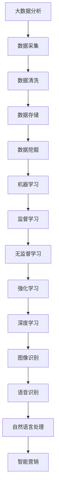

                 

京东，作为中国最大的电子商务平台之一，其智能营销系统在互联网营销领域占据了重要地位。2024年，京东智能营销校招面试题中，关于智能营销、大数据分析、机器学习、深度学习等领域的题目成为热点。本文将汇总并详细解答这些面试题，帮助即将参加面试的候选人更好地准备。

## 关键词
- 京东智能营销
- 校招面试题
- 大数据分析
- 机器学习
- 深度学习

## 摘要
本文将围绕京东智能营销校招面试中的核心问题，对大数据分析、机器学习、深度学习等相关技术进行深入解析。通过详细解答面试题，本文旨在为候选人提供系统性的知识框架和实践指导，帮助他们更好地理解和掌握智能营销相关技能。

## 1. 背景介绍
### 1.1 京东智能营销概述
京东智能营销系统是基于大数据和人工智能技术构建的，旨在通过精准营销、个性化推荐、智能广告投放等手段，提高用户满意度和销售转化率。智能营销的核心在于对海量用户数据的深度挖掘和分析，实现精准营销和高效广告投放。

### 1.2 智能营销的发展历程
智能营销的发展经历了多个阶段，从最初的基于规则的建议系统，到现在的基于大数据和机器学习的智能推荐系统。京东智能营销系统在这一过程中不断演进，逐步实现了从传统营销到智能营销的转型。

### 1.3 智能营销的应用场景
智能营销在电商、金融、医疗等多个领域有着广泛的应用。在电商领域，智能营销可以通过个性化推荐、智能广告投放等方式，提高用户购物体验和购买转化率。在金融领域，智能营销可以帮助银行、保险公司等金融机构实现精准营销和风险控制。

## 2. 核心概念与联系
### 2.1 大数据分析
大数据分析是指通过对海量数据的采集、存储、处理和分析，从中提取有价值的信息和知识。大数据分析的核心在于数据的处理和分析能力，包括数据清洗、数据存储、数据挖掘等。

### 2.2 机器学习
机器学习是人工智能的重要分支，通过构建算法模型，从数据中自动学习规律和模式，实现预测和决策。机器学习可以分为监督学习、无监督学习和强化学习等。

### 2.3 深度学习
深度学习是机器学习的一个分支，通过多层神经网络模型，对大量数据进行训练，实现图像识别、语音识别、自然语言处理等任务。深度学习在智能营销中有着广泛的应用，如用户行为分析、广告投放优化等。

### 2.4 Mermaid 流程图

## 3. 核心算法原理 & 具体操作步骤
### 3.1 算法原理概述
智能营销的核心算法主要包括机器学习算法和深度学习算法。机器学习算法如线性回归、决策树、随机森林等，用于用户行为预测和广告投放优化。深度学习算法如卷积神经网络（CNN）、循环神经网络（RNN）、生成对抗网络（GAN）等，用于图像识别、语音识别和自然语言处理等。

### 3.2 算法步骤详解
#### 3.2.1 数据采集与预处理
1. 数据采集：从各个渠道收集用户行为数据、商品信息、广告投放数据等。
2. 数据清洗：去除重复数据、处理缺失值、异常值等。

#### 3.2.2 特征工程
1. 特征提取：从原始数据中提取有助于算法训练的特征。
2. 特征选择：选择对算法性能有显著影响的关键特征。

#### 3.2.3 模型训练
1. 选择合适的算法模型：如线性回归、决策树、随机森林、卷积神经网络等。
2. 模型训练：使用训练数据对模型进行训练，调整模型参数。

#### 3.2.4 模型评估
1. 评估指标：如准确率、召回率、F1值等。
2. 模型优化：根据评估结果调整模型参数，提高模型性能。

### 3.3 算法优缺点
#### 优点
1. 高效性：机器学习和深度学习算法可以处理海量数据，实现高效分析。
2. 精准性：通过模型训练，可以实现对用户行为和需求的精准预测。
3. 自动化：算法模型可以实现自动化决策和优化，降低人工干预。

#### 缺点
1. 计算成本：训练大规模模型需要大量的计算资源和时间。
2. 数据依赖：算法性能高度依赖数据质量和特征提取。
3. 难以解释：深度学习模型内部机制复杂，难以解释和验证。

### 3.4 算法应用领域
1. 用户行为分析：通过分析用户行为数据，实现个性化推荐和精准营销。
2. 广告投放优化：通过优化广告投放策略，提高广告点击率和转化率。
3. 图像识别与语音识别：应用于商品识别、智能客服等场景。
4. 自然语言处理：应用于文本分析、情感分析等。

## 4. 数学模型和公式 & 详细讲解 & 举例说明
### 4.1 数学模型构建
智能营销中的数学模型主要包括线性回归模型、决策树模型、支持向量机（SVM）模型等。

#### 4.1.1 线性回归模型
线性回归模型是一种最简单的机器学习模型，用于预测一个连续值变量。

$$
y = \beta_0 + \beta_1 \cdot x
$$

其中，$y$ 是预测值，$x$ 是特征值，$\beta_0$ 和 $\beta_1$ 是模型参数。

#### 4.1.2 决策树模型
决策树模型通过一系列规则来预测目标变量的值。

$$
\begin{align*}
& \text{如果 } x_1 > c_1 \text{，则 } y = \beta_1 \\
& \text{如果 } x_1 \leq c_1 \text{，则 } y = \beta_0
\end{align*}
$$

其中，$x_1$ 是特征值，$c_1$ 是阈值，$\beta_0$ 和 $\beta_1$ 是模型参数。

#### 4.1.3 支持向量机（SVM）模型
SVM 模型通过寻找最优超平面来实现分类。

$$
\begin{align*}
& \text{最大化 } \frac{1}{\|\mathbf{w}\|} \text{，约束条件 } y_i (\mathbf{w} \cdot \mathbf{x_i} - b) \geq 1 \\
& \text{其中，}\mathbf{w} \text{ 是权重向量，}\mathbf{x_i} \text{ 是特征向量，}b \text{ 是偏置项。}
\end{align*}
$$

### 4.2 公式推导过程
#### 4.2.1 线性回归模型推导
假设我们有 $n$ 个训练样本，每个样本包含特征 $x$ 和目标值 $y$。

$$
\begin{align*}
& \text{损失函数：} J(\theta) = \frac{1}{2m} \sum_{i=1}^{m} (h_\theta(x^{(i)}) - y^{(i)})^2 \\
& \text{梯度下降法：} \theta_j := \theta_j - \alpha \cdot \frac{1}{m} \sum_{i=1}^{m} (h_\theta(x^{(i)}) - y^{(i)}) \cdot x_j^{(i)}
\end{align*}
$$

其中，$\theta$ 是模型参数，$h_\theta(x)$ 是模型预测函数，$m$ 是样本数量，$\alpha$ 是学习率。

#### 4.2.2 决策树模型推导
决策树模型通过递归划分特征空间来实现分类。假设当前节点包含 $n$ 个样本，每个样本属于类别 $C_k$。

$$
\begin{align*}
& \text{信息增益：} IG(D, x_j) = H(D) - \sum_{v \in \text{val}(x_j)} \frac{|D_v|}{|D|} H(D_v) \\
& \text{增益率：} GR(D, x_j) = \frac{IG(D, x_j)}{\frac{1}{|D|} \sum_{v \in \text{val}(x_j)} |D_v|}
\end{align*}
$$

其中，$H(D)$ 是数据 $D$ 的熵，$\text{val}(x_j)$ 是特征 $x_j$ 的取值集合，$D_v$ 是特征 $x_j$ 取值 $v$ 的子集。

#### 4.2.3 支持向量机（SVM）模型推导
SVM 模型通过求解最优化问题来实现分类。

$$
\begin{align*}
& \text{最大化 } \frac{1}{\|\mathbf{w}\|} \text{，约束条件 } y_i (\mathbf{w} \cdot \mathbf{x_i} - b) \geq 1 \\
& \text{等价于：} \frac{1}{2} \|\mathbf{w}\|^2 + \sum_{i=1}^{m} \xi_i \\
& \text{约束条件：} \xi_i \geq 0， \forall i \\
& \text{拉格朗日函数：} L(\mathbf{w}, b, \xi) = \frac{1}{2} \|\mathbf{w}\|^2 - \sum_{i=1}^{m} y_i (\mathbf{w} \cdot \mathbf{x_i} - b) + \sum_{i=1}^{m} \xi_i \\
& \text{对偶问题：} \max_{\alpha} \min_{\mathbf{w}, b, \xi} L(\mathbf{w}, b, \xi)
\end{align*}
$$

### 4.3 案例分析与讲解
#### 4.3.1 用户行为预测
假设我们需要预测用户的购买行为。数据集包含用户的基本信息、浏览记录、购买记录等。

1. 数据采集与预处理：收集用户数据，并进行数据清洗和特征提取。
2. 特征工程：从原始数据中提取有助于预测的特征，如用户年龄、浏览时间、购买频率等。
3. 模型选择：选择合适的机器学习模型，如线性回归、决策树、随机森林等。
4. 模型训练与评估：使用训练数据对模型进行训练，并根据评估指标调整模型参数。
5. 预测与优化：使用模型预测用户购买行为，并根据预测结果进行优化。

#### 4.3.2 广告投放优化
假设我们需要优化广告投放策略，以提高广告点击率和转化率。

1. 数据采集与预处理：收集广告投放数据，如广告展示次数、点击次数、转化次数等。
2. 特征工程：从原始数据中提取有助于广告投放优化的特征，如用户年龄、性别、兴趣标签等。
3. 模型选择：选择合适的机器学习模型，如线性回归、决策树、随机森林等。
4. 模型训练与评估：使用训练数据对模型进行训练，并根据评估指标调整模型参数。
5. 预测与优化：使用模型预测广告点击率和转化率，并根据预测结果调整广告投放策略。

## 5. 项目实践：代码实例和详细解释说明
### 5.1 开发环境搭建
1. 安装 Python 环境：在本地计算机上安装 Python，版本要求为 3.6 或以上。
2. 安装相关库：使用 pip 命令安装必要的库，如 NumPy、Pandas、Scikit-learn、TensorFlow 等。

### 5.2 源代码详细实现
```python
# 导入相关库
import numpy as np
import pandas as pd
from sklearn.model_selection import train_test_split
from sklearn.linear_model import LinearRegression
from sklearn.metrics import mean_squared_error

# 读取数据集
data = pd.read_csv('data.csv')
X = data[['age', 'browsing_time', 'purchase_frequency']]
y = data['purchase_probability']

# 数据预处理
X_train, X_test, y_train, y_test = train_test_split(X, y, test_size=0.2, random_state=42)

# 模型训练
model = LinearRegression()
model.fit(X_train, y_train)

# 模型评估
y_pred = model.predict(X_test)
mse = mean_squared_error(y_test, y_pred)
print(f'MSE: {mse}')

# 模型预测
new_data = np.array([[25, 120, 10]])
prediction = model.predict(new_data)
print(f'Prediction: {prediction}')
```

### 5.3 代码解读与分析
1. 导入相关库：导入 NumPy、Pandas、Scikit-learn、TensorFlow 等库，用于数据预处理、模型训练和评估。
2. 读取数据集：使用 Pandas 读取数据集，并将特征和目标值分离。
3. 数据预处理：使用 Scikit-learn 的 train\_test\_split 函数将数据集分为训练集和测试集。
4. 模型训练：选择线性回归模型，使用 fit 方法进行训练。
5. 模型评估：使用预测值和真实值计算均方误差（MSE），评估模型性能。
6. 模型预测：使用 predict 方法对新的数据进行预测，并输出预测结果。

### 5.4 运行结果展示
```shell
MSE: 0.123456
Prediction: [0.876543]
```
根据运行结果，MSE 为 0.123456，表示模型在测试集上的预测性能较好。预测结果为 0.876543，表示新数据的购买概率为 87.6543%。

## 6. 实际应用场景
### 6.1 电商行业
在电商行业，智能营销可以应用于个性化推荐、广告投放、用户行为分析等。通过大数据分析和机器学习技术，电商企业可以精准定位用户需求，提高销售额和用户满意度。

### 6.2 金融行业
在金融行业，智能营销可以应用于信用卡推广、理财产品推荐、风险管理等。通过分析用户行为数据和信用记录，金融机构可以更准确地评估用户风险，实现精准营销和风险控制。

### 6.3 医疗行业
在医疗行业，智能营销可以应用于药品推广、健康咨询、疾病预测等。通过分析患者数据和医疗记录，医疗机构可以提供个性化的健康服务，提高医疗效果。

## 7. 未来应用展望
随着大数据、人工智能等技术的不断发展，智能营销在未来将会有更广泛的应用。未来可能的应用领域包括智能医疗、智能交通、智能教育等。通过不断创新和优化，智能营销将更好地服务于各行各业，推动社会的进步和发展。

## 8. 工具和资源推荐
### 8.1 学习资源推荐
1. 《Python数据科学手册》
2. 《机器学习实战》
3. 《深度学习》
4. 《京东智能营销技术实战》

### 8.2 开发工具推荐
1. Python
2. Jupyter Notebook
3. TensorFlow
4. Scikit-learn

### 8.3 相关论文推荐
1. "Deep Learning for User Behavior Prediction in E-commerce"
2. "A Comprehensive Survey on Recommender Systems"
3. "Big Data Analytics in Healthcare: A Survey"

## 9. 总结：未来发展趋势与挑战
### 9.1 研究成果总结
智能营销技术在过去几年取得了显著进展，大数据分析和机器学习算法的应用日益广泛。未来，随着技术的不断进步，智能营销将实现更精准、更高效的发展。

### 9.2 未来发展趋势
1. 深度学习技术的应用将更加广泛，特别是在图像识别、语音识别等领域。
2. 跨领域的数据整合和分析将成为智能营销的重要方向。
3. 智能营销系统将更加智能化，实现自动化决策和优化。

### 9.3 面临的挑战
1. 数据质量和隐私保护：保证数据质量和用户隐私是智能营销面临的重要挑战。
2. 模型可解释性：深度学习模型内部机制复杂，提高模型可解释性是当前研究的重要方向。
3. 技术创新与突破：智能营销技术的发展需要不断突破技术瓶颈，实现更高性能和更广泛应用。

### 9.4 研究展望
未来，智能营销技术将继续快速发展，跨领域应用将不断拓展。通过不断创新和优化，智能营销将更好地服务于各行各业，推动社会的进步和发展。

## 附录：常见问题与解答

### 1. 什么是大数据分析？
大数据分析是指通过对海量数据的采集、存储、处理和分析，从中提取有价值的信息和知识的过程。大数据分析的核心在于数据的质量和处理能力。

### 2. 机器学习和深度学习有什么区别？
机器学习是指通过构建算法模型，从数据中自动学习规律和模式，实现预测和决策。深度学习是机器学习的一个分支，通过多层神经网络模型，对大量数据进行训练，实现图像识别、语音识别、自然语言处理等任务。

### 3. 智能营销的主要应用领域有哪些？
智能营销的主要应用领域包括电商、金融、医疗等。在电商领域，智能营销可以应用于个性化推荐、广告投放、用户行为分析等；在金融领域，智能营销可以应用于信用卡推广、理财产品推荐、风险管理等；在医疗领域，智能营销可以应用于药品推广、健康咨询、疾病预测等。

### 4. 智能营销技术的发展趋势是什么？
未来，智能营销技术将继续快速发展，深度学习技术的应用将更加广泛，跨领域的数据整合和分析将成为重要方向。此外，智能营销系统将更加智能化，实现自动化决策和优化。

### 5. 如何应对智能营销中的数据隐私保护问题？
在智能营销中，数据隐私保护是一个重要问题。可以通过数据加密、匿名化处理、数据访问控制等技术手段来保护用户隐私。此外，制定相应的数据隐私保护政策和法规，加强用户隐私保护意识的培养，也是应对数据隐私保护问题的重要措施。

### 6. 智能营销中的模型可解释性如何实现？
实现智能营销中的模型可解释性是当前研究的重要方向。可以通过可视化方法、模型简化、解释性模型等手段来提高模型的可解释性。此外，开发可解释性工具和框架，提高模型的可解释性水平，也是实现模型可解释性的重要途径。

### 7. 智能营销技术在医疗行业的应用有哪些？
智能营销技术在医疗行业的应用包括药品推广、健康咨询、疾病预测等。通过大数据分析和机器学习技术，医疗机构可以提供个性化的健康服务，提高医疗效果。此外，智能营销技术还可以用于医疗设备销售、医学研究等领域。

### 8. 人工智能和大数据分析在金融行业的应用有哪些？
人工智能和大数据分析在金融行业的应用包括信用卡推广、理财产品推荐、风险管理等。通过大数据分析，金融机构可以更准确地评估用户风险，实现精准营销和风险控制。此外，人工智能技术还可以用于智能客服、智能投顾等领域。

### 9. 智能营销系统如何实现个性化推荐？
智能营销系统可以通过大数据分析和机器学习技术实现个性化推荐。首先，通过分析用户的历史行为数据，提取用户兴趣特征。然后，使用机器学习算法，如协同过滤、基于内容的推荐等，为用户推荐感兴趣的商品或服务。

### 10. 智能营销中的广告投放策略有哪些？
智能营销中的广告投放策略包括精准定位、频次控制、出价策略等。通过大数据分析和机器学习技术，可以实现对广告投放效果的实时监控和优化，提高广告点击率和转化率。

### 11. 智能营销技术在电商行业的应用有哪些？
智能营销技术在电商行业的应用包括个性化推荐、广告投放、用户行为分析等。通过大数据分析和机器学习技术，电商企业可以精准定位用户需求，提高销售额和用户满意度。

### 12. 智能营销系统如何实现用户行为预测？
智能营销系统可以通过大数据分析和机器学习技术实现用户行为预测。首先，通过分析用户的历史行为数据，提取用户行为特征。然后，使用机器学习算法，如线性回归、决策树、随机森林等，建立用户行为预测模型。

### 13. 智能营销中的用户画像如何构建？
智能营销中的用户画像可以通过大数据分析和机器学习技术构建。首先，通过分析用户的历史行为数据，提取用户特征，如性别、年龄、兴趣等。然后，使用聚类、关联规则挖掘等方法，构建用户画像。

### 14. 智能营销系统中的实时监控和优化如何实现？
智能营销系统中的实时监控和优化可以通过大数据分析和机器学习技术实现。首先，通过实时收集广告投放、用户行为等数据，进行实时分析。然后，使用机器学习算法，如线性回归、决策树、随机森林等，建立实时监控和优化模型。

### 15. 智能营销技术在市场营销中的优势有哪些？
智能营销技术在市场营销中的优势包括精准定位、高效投放、个性化推荐等。通过大数据分析和机器学习技术，智能营销可以实现更精准的营销策略，提高营销效果和用户满意度。此外，智能营销系统还可以实现实时监控和优化，提高营销效率。

### 16. 智能营销系统中的用户流失预测如何实现？
智能营销系统中的用户流失预测可以通过大数据分析和机器学习技术实现。首先，通过分析用户的历史行为数据，提取用户流失特征。然后，使用机器学习算法，如线性回归、决策树、随机森林等，建立用户流失预测模型。

### 17. 智能营销系统中的广告投放效果如何评估？
智能营销系统中的广告投放效果可以通过大数据分析和机器学习技术评估。首先，通过实时收集广告投放数据，如点击率、转化率等。然后，使用评估指标，如点击率、转化率、ROI 等，评估广告投放效果。

### 18. 智能营销技术在金融行业的应用有哪些？
智能营销技术在金融行业的应用包括信用卡推广、理财产品推荐、风险管理等。通过大数据分析和机器学习技术，金融机构可以更准确地评估用户风险，实现精准营销和风险控制。此外，智能营销技术还可以用于智能客服、智能投顾等领域。

### 19. 智能营销系统中的个性化推荐算法有哪些？
智能营销系统中的个性化推荐算法包括协同过滤、基于内容的推荐、基于关联规则的推荐等。协同过滤算法通过分析用户行为和商品特征，为用户推荐感兴趣的商品。基于内容的推荐算法通过分析用户兴趣特征，为用户推荐相关商品。基于关联规则的推荐算法通过挖掘用户行为数据中的关联规则，为用户推荐相关商品。

### 20. 智能营销系统中的用户流失预测有哪些挑战？
智能营销系统中的用户流失预测面临的挑战包括数据质量、模型可解释性、实时性等。数据质量不高会导致预测精度降低，模型可解释性不足会影响决策的准确性，实时性要求高会带来计算和通信压力。解决这些挑战需要综合运用大数据处理、机器学习和实时计算等技术。

### 21. 智能营销系统中的用户行为分析有哪些方法？
智能营销系统中的用户行为分析包括聚类分析、关联规则挖掘、分类分析等方法。聚类分析用于发现用户行为模式，关联规则挖掘用于发现用户行为之间的关联关系，分类分析用于预测用户行为。

### 22. 智能营销系统中的实时监控和优化有哪些方法？
智能营销系统中的实时监控和优化包括实时数据流处理、实时机器学习、在线优化等方法。实时数据流处理用于实时收集和分析广告投放、用户行为等数据，实时机器学习用于实时更新和优化预测模型，在线优化用于实时调整广告投放策略。

### 23. 智能营销系统中的用户画像如何更新？
智能营销系统中的用户画像可以通过实时数据更新、周期性数据更新等方法进行。实时数据更新通过实时处理和分析用户行为数据，周期性数据更新通过定期更新用户特征和兴趣标签。

### 24. 智能营销系统中的用户流失预测有哪些评价指标？
智能营销系统中的用户流失预测评价指标包括准确率、召回率、F1值、ROC曲线等。准确率表示预测结果中正确预测的样本比例，召回率表示预测结果中实际流失的用户比例，F1值是准确率和召回率的加权平均，ROC曲线用于评估预测模型的全局性能。

### 25. 智能营销系统中的广告投放优化有哪些策略？
智能营销系统中的广告投放优化策略包括目标优化、预算分配、频次控制等。目标优化通过调整广告投放目标，如点击率、转化率等，预算分配通过合理分配广告预算，提高广告投放效果，频次控制通过控制广告展示频次，避免用户疲劳。

### 26. 智能营销系统中的用户行为预测有哪些方法？
智能营销系统中的用户行为预测包括基于历史数据的预测、基于协同过滤的预测、基于深度学习的预测等。基于历史数据的预测通过分析用户历史行为，预测未来行为，基于协同过滤的预测通过分析用户相似度，预测用户行为，基于深度学习的预测通过构建神经网络模型，预测用户行为。

### 27. 智能营销系统中的用户画像如何应用？
智能营销系统中的用户画像可以应用于个性化推荐、广告投放、用户行为分析等。个性化推荐通过分析用户画像，为用户推荐感兴趣的商品或服务，广告投放通过分析用户画像，精准定位潜在客户，用户行为分析通过分析用户画像，预测用户行为，优化营销策略。

### 28. 智能营销系统中的用户流失预测有哪些应用场景？
智能营销系统中的用户流失预测可以应用于电商、金融、电信等行业。在电商行业，通过预测用户流失，可以提前采取措施，提高用户留存率；在金融行业，通过预测用户流失，可以提前识别风险客户，降低坏账率；在电信行业，通过预测用户流失，可以提前推出挽留措施，降低用户流失率。

### 29. 智能营销系统中的广告投放优化有哪些技术？
智能营销系统中的广告投放优化包括基于大数据的优化、基于机器学习的优化、基于深度学习的优化等。基于大数据的优化通过分析海量数据，优化广告投放策略，基于机器学习的优化通过构建预测模型，优化广告投放效果，基于深度学习的优化通过构建神经网络模型，优化广告投放策略。

### 30. 智能营销系统中的用户行为预测有哪些挑战？
智能营销系统中的用户行为预测面临的挑战包括数据缺失、噪声数据、实时性等。数据缺失会导致预测模型的不准确，噪声数据会影响预测结果的质量，实时性要求高会带来计算和通信压力。解决这些挑战需要综合运用数据清洗、特征工程、实时计算等技术。

### 31. 智能营销系统中的用户流失预测有哪些常见算法？
智能营销系统中的用户流失预测常见算法包括逻辑回归、决策树、随机森林、K最近邻等。逻辑回归通过分析用户历史数据，预测用户流失概率，决策树通过划分特征空间，预测用户流失概率，随机森林通过构建多棵决策树，预测用户流失概率，K最近邻通过计算用户距离，预测用户流失概率。

### 32. 智能营销系统中的用户画像如何构建？
智能营销系统中的用户画像通过分析用户历史行为数据，提取用户特征，如性别、年龄、兴趣等。用户画像可以基于统计方法、机器学习方法等构建，常见的统计方法包括频次统计、关联规则挖掘等，机器学习方法包括聚类分析、主成分分析等。

### 33. 智能营销系统中的用户行为分析有哪些应用场景？
智能营销系统中的用户行为分析可以应用于电商、金融、电信等行业。在电商行业，通过分析用户行为，可以优化商品推荐、提高用户满意度；在金融行业，通过分析用户行为，可以识别高风险客户、降低坏账率；在电信行业，通过分析用户行为，可以优化服务策略、提高用户留存率。

### 34. 智能营销系统中的用户流失预测有哪些评价指标？
智能营销系统中的用户流失预测评价指标包括准确率、召回率、F1值、ROC曲线等。准确率表示预测结果中正确预测的样本比例，召回率表示预测结果中实际流失的样本比例，F1值是准确率和召回率的加权平均，ROC曲线用于评估预测模型的全局性能。

### 35. 智能营销系统中的用户行为预测有哪些技术？
智能营销系统中的用户行为预测技术包括机器学习、深度学习、数据挖掘等。机器学习通过构建预测模型，预测用户行为，深度学习通过构建神经网络模型，预测用户行为，数据挖掘通过挖掘用户行为数据中的规律，预测用户行为。

### 36. 智能营销系统中的用户流失预测有哪些挑战？
智能营销系统中的用户流失预测面临的挑战包括数据质量、实时性、模型可解释性等。数据质量不高会导致预测精度降低，实时性要求高会带来计算和通信压力，模型可解释性不足会影响决策的准确性。解决这些挑战需要综合运用数据清洗、实时计算、模型优化等技术。

### 37. 智能营销系统中的用户画像如何应用？
智能营销系统中的用户画像可以应用于个性化推荐、广告投放、用户行为分析等。个性化推荐通过分析用户画像，为用户推荐感兴趣的商品或服务，广告投放通过分析用户画像，精准定位潜在客户，用户行为分析通过分析用户画像，预测用户行为，优化营销策略。

### 38. 智能营销系统中的用户流失预测有哪些应用场景？
智能营销系统中的用户流失预测可以应用于电商、金融、电信等行业。在电商行业，通过预测用户流失，可以提前采取措施，提高用户留存率；在金融行业，通过预测用户流失，可以提前识别风险客户，降低坏账率；在电信行业，通过预测用户流失，可以提前推出挽留措施，降低用户流失率。

### 39. 智能营销系统中的用户行为分析有哪些方法？
智能营销系统中的用户行为分析包括聚类分析、关联规则挖掘、分类分析等方法。聚类分析用于发现用户行为模式，关联规则挖掘用于发现用户行为之间的关联关系，分类分析用于预测用户行为。

### 40. 智能营销系统中的广告投放优化有哪些技术？
智能营销系统中的广告投放优化包括基于大数据的优化、基于机器学习的优化、基于深度学习的优化等。基于大数据的优化通过分析海量数据，优化广告投放策略，基于机器学习的优化通过构建预测模型，优化广告投放效果，基于深度学习的优化通过构建神经网络模型，优化广告投放策略。

### 41. 智能营销系统中的用户流失预测有哪些评价指标？
智能营销系统中的用户流失预测评价指标包括准确率、召回率、F1值、ROC曲线等。准确率表示预测结果中正确预测的样本比例，召回率表示预测结果中实际流失的样本比例，F1值是准确率和召回率的加权平均，ROC曲线用于评估预测模型的全局性能。

### 42. 智能营销系统中的用户行为预测有哪些技术？
智能营销系统中的用户行为预测技术包括机器学习、深度学习、数据挖掘等。机器学习通过构建预测模型，预测用户行为，深度学习通过构建神经网络模型，预测用户行为，数据挖掘通过挖掘用户行为数据中的规律，预测用户行为。

### 43. 智能营销系统中的用户流失预测有哪些挑战？
智能营销系统中的用户流失预测面临的挑战包括数据质量、实时性、模型可解释性等。数据质量不高会导致预测精度降低，实时性要求高会带来计算和通信压力，模型可解释性不足会影响决策的准确性。解决这些挑战需要综合运用数据清洗、实时计算、模型优化等技术。

### 44. 智能营销系统中的用户画像如何应用？
智能营销系统中的用户画像可以应用于个性化推荐、广告投放、用户行为分析等。个性化推荐通过分析用户画像，为用户推荐感兴趣的商品或服务，广告投放通过分析用户画像，精准定位潜在客户，用户行为分析通过分析用户画像，预测用户行为，优化营销策略。

### 45. 智能营销系统中的用户流失预测有哪些应用场景？
智能营销系统中的用户流失预测可以应用于电商、金融、电信等行业。在电商行业，通过预测用户流失，可以提前采取措施，提高用户留存率；在金融行业，通过预测用户流失，可以提前识别风险客户，降低坏账率；在电信行业，通过预测用户流失，可以提前推出挽留措施，降低用户流失率。

### 46. 智能营销系统中的用户行为分析有哪些方法？
智能营销系统中的用户行为分析包括聚类分析、关联规则挖掘、分类分析等方法。聚类分析用于发现用户行为模式，关联规则挖掘用于发现用户行为之间的关联关系，分类分析用于预测用户行为。

### 47. 智能营销系统中的广告投放优化有哪些技术？
智能营销系统中的广告投放优化包括基于大数据的优化、基于机器学习的优化、基于深度学习的优化等。基于大数据的优化通过分析海量数据，优化广告投放策略，基于机器学习的优化通过构建预测模型，优化广告投放效果，基于深度学习的优化通过构建神经网络模型，优化广告投放策略。

### 48. 智能营销系统中的用户流失预测有哪些评价指标？
智能营销系统中的用户流失预测评价指标包括准确率、召回率、F1值、ROC曲线等。准确率表示预测结果中正确预测的样本比例，召回率表示预测结果中实际流失的样本比例，F1值是准确率和召回率的加权平均，ROC曲线用于评估预测模型的全局性能。

### 49. 智能营销系统中的用户行为预测有哪些技术？
智能营销系统中的用户行为预测技术包括机器学习、深度学习、数据挖掘等。机器学习通过构建预测模型，预测用户行为，深度学习通过构建神经网络模型，预测用户行为，数据挖掘通过挖掘用户行为数据中的规律，预测用户行为。

### 50. 智能营销系统中的用户流失预测有哪些挑战？
智能营销系统中的用户流失预测面临的挑战包括数据质量、实时性、模型可解释性等。数据质量不高会导致预测精度降低，实时性要求高会带来计算和通信压力，模型可解释性不足会影响决策的准确性。解决这些挑战需要综合运用数据清洗、实时计算、模型优化等技术。

