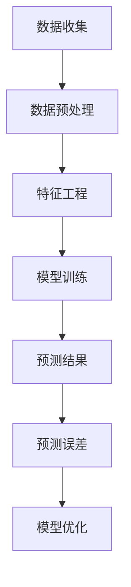

                 

关键词：京东智能需求预测、面试真题、校招、算法分析、数学模型、实践应用

## 摘要

本文旨在汇总2024年京东智能需求预测校招面试的真题，并针对这些题目进行详细的解答。通过本文的梳理，读者可以更好地理解京东智能需求预测的相关算法原理、数学模型以及实际应用场景，为未来的求职和项目实践提供参考。文章将分为以下几个部分：背景介绍、核心概念与联系、核心算法原理与具体操作步骤、数学模型和公式详细讲解、项目实践：代码实例和详细解释说明、实际应用场景、未来应用展望、工具和资源推荐以及总结。

## 1. 背景介绍

随着互联网的快速发展，电子商务行业迎来了前所未有的机遇。为了更好地满足用户需求，电商平台不断优化算法，提高智能需求预测的准确性。京东作为国内领先的电商平台，每年都会在校招中设置智能需求预测相关面试题目，以考察应聘者的算法能力和实际应用能力。

智能需求预测是指通过分析历史数据、用户行为等，对未来一段时间内某一商品的需求量进行预测。这对于电商平台来说具有重要意义，可以帮助企业合理安排库存、优化供应链、降低成本，从而提升用户体验和市场份额。

本文将从以下几个角度对京东智能需求预测校招面试真题进行解析：

- 核心概念与联系：介绍与智能需求预测相关的重要概念和联系。
- 核心算法原理与具体操作步骤：详细讲解常用的需求预测算法，包括其原理和实现步骤。
- 数学模型和公式：阐述需求预测中的数学模型和公式，并进行推导和举例说明。
- 项目实践：通过具体代码实例，展示需求预测算法在实际项目中的应用。
- 实际应用场景：分析智能需求预测在不同业务场景中的应用。
- 未来应用展望：探讨智能需求预测的发展趋势和面临的挑战。

## 2. 核心概念与联系

### 2.1 相关概念

在智能需求预测中，以下概念是至关重要的：

- **需求量**：指在未来一段时间内某一商品的实际购买数量。
- **预测误差**：指预测结果与实际需求量之间的差异。
- **特征工程**：指通过处理和提取数据特征，以提高模型预测准确性。
- **时间序列**：指按照时间顺序排列的数据序列，常用于需求预测。

### 2.2 相关联系

智能需求预测涉及到多个领域的知识，包括：

- **机器学习**：利用历史数据训练预测模型，以提高预测准确性。
- **统计学**：通过统计学方法分析数据，提取有用的信息。
- **数据预处理**：对原始数据进行清洗、去噪、转换等处理，为后续分析提供高质量的数据。
- **分布式计算**：在大规模数据集上进行高效的需求预测。

### 2.3 Mermaid流程图

下面是一个简单的Mermaid流程图，展示了智能需求预测的基本流程：



## 3. 核心算法原理与具体操作步骤

### 3.1 算法原理概述

智能需求预测常用的算法包括以下几种：

- **线性回归**：通过拟合一条直线，预测需求量与相关变量之间的关系。
- **决策树**：通过树形结构对数据进行划分，预测需求量。
- **支持向量机（SVM）**：通过找到一个最佳的超平面，对需求量进行分类。
- **神经网络**：通过多层神经网络，对需求量进行建模和预测。

### 3.2 算法步骤详解

以线性回归为例，介绍其具体操作步骤：

1. **数据收集**：收集历史销售数据，包括商品ID、销售日期、需求量等。
2. **数据预处理**：对数据进行清洗，去除异常值和缺失值，并进行数据标准化。
3. **特征工程**：根据业务需求，提取有用的特征，如季节性、促销活动、节假日等。
4. **模型训练**：使用训练集数据，通过最小二乘法拟合线性回归模型。
5. **模型评估**：使用测试集数据，评估模型预测准确性，如均方误差（MSE）。
6. **模型优化**：根据评估结果，调整模型参数，提高预测准确性。
7. **预测**：使用训练好的模型，对新的需求量进行预测。

### 3.3 算法优缺点

- **线性回归**：简单易用，对线性关系具有较强的预测能力，但容易受到异常值影响。
- **决策树**：易于解释，对非线性关系有较好的预测效果，但容易过拟合。
- **SVM**：对非线性关系有较好的预测能力，但计算复杂度较高。
- **神经网络**：具有较强的非线性拟合能力，但需要大量训练数据和较长时间的训练。

### 3.4 算法应用领域

智能需求预测在多个领域有广泛的应用，如：

- **电子商务**：预测商品销售量，优化库存和供应链。
- **物流**：预测货物运输量，优化运输路线和成本。
- **能源**：预测电力需求，优化能源供应。
- **制造业**：预测生产需求，优化生产计划和资源调度。

## 4. 数学模型和公式

### 4.1 数学模型构建

智能需求预测的核心是建立数学模型，用于描述需求量与相关变量之间的关系。以下是一个简单的线性回归模型：

$$
Y = \beta_0 + \beta_1 X + \epsilon
$$

其中，$Y$ 为需求量，$X$ 为相关变量，$\beta_0$ 和 $\beta_1$ 为模型参数，$\epsilon$ 为误差项。

### 4.2 公式推导过程

线性回归模型的参数可以通过最小二乘法求解。具体推导过程如下：

1. **目标函数**：

$$
J(\beta_0, \beta_1) = \sum_{i=1}^n (Y_i - (\beta_0 + \beta_1 X_i))^2
$$

2. **求导**：

对 $\beta_0$ 和 $\beta_1$ 分别求偏导数，并令偏导数为0，得到：

$$
\frac{\partial J}{\partial \beta_0} = -2\sum_{i=1}^n (Y_i - (\beta_0 + \beta_1 X_i)) = 0
$$

$$
\frac{\partial J}{\partial \beta_1} = -2\sum_{i=1}^n (Y_i - (\beta_0 + \beta_1 X_i))X_i = 0
$$

3. **解方程组**：

将上述两个方程联立，解得：

$$
\beta_0 = \bar{Y} - \beta_1 \bar{X}
$$

$$
\beta_1 = \frac{\sum_{i=1}^n (X_i - \bar{X})(Y_i - \bar{Y})}{\sum_{i=1}^n (X_i - \bar{X})^2}
$$

其中，$\bar{X}$ 和 $\bar{Y}$ 分别为 $X$ 和 $Y$ 的均值。

### 4.3 案例分析与讲解

以某电商平台的数据为例，分析线性回归模型在智能需求预测中的应用。

1. **数据收集**：收集过去一年的销售数据，包括商品ID、销售日期、需求量等。
2. **数据预处理**：对数据进行清洗，去除异常值和缺失值，并进行数据标准化。
3. **特征工程**：提取有用的特征，如季节性、促销活动、节假日等。
4. **模型训练**：使用训练集数据，通过最小二乘法拟合线性回归模型。
5. **模型评估**：使用测试集数据，评估模型预测准确性，如均方误差（MSE）。
6. **模型优化**：根据评估结果，调整模型参数，提高预测准确性。
7. **预测**：使用训练好的模型，对未来的需求量进行预测。

通过以上步骤，可以实现对商品需求的智能预测，为企业决策提供参考。

## 5. 项目实践：代码实例和详细解释说明

### 5.1 开发环境搭建

为了实现智能需求预测，需要搭建以下开发环境：

- Python 3.8及以上版本
- Numpy 1.19及以上版本
- Scikit-learn 0.22及以上版本
- Matplotlib 3.4及以上版本

### 5.2 源代码详细实现

以下是一个简单的线性回归需求预测代码实例：

```python
import numpy as np
import pandas as pd
from sklearn.linear_model import LinearRegression
from sklearn.model_selection import train_test_split
from sklearn.metrics import mean_squared_error
import matplotlib.pyplot as plt

# 读取数据
data = pd.read_csv("sales_data.csv")
X = data.iloc[:, :-1].values
Y = data.iloc[:, -1].values

# 数据预处理
X = (X - np.mean(X, axis=0)) / np.std(X, axis=0)

# 模型训练
model = LinearRegression()
model.fit(X, Y)

# 模型评估
X_train, X_test, Y_train, Y_test = train_test_split(X, Y, test_size=0.2, random_state=42)
Y_pred = model.predict(X_test)
mse = mean_squared_error(Y_test, Y_pred)
print("MSE:", mse)

# 模型优化
# （此处根据评估结果，调整模型参数，提高预测准确性）

# 预测
# （此处使用训练好的模型，对未来的需求量进行预测）

# 可视化
plt.scatter(X_test, Y_test, color="red", label="实际值")
plt.plot(X_test, Y_pred, color="blue", label="预测值")
plt.xlabel("特征")
plt.ylabel("需求量")
plt.legend()
plt.show()
```

### 5.3 代码解读与分析

1. **数据读取**：使用 Pandas 读取销售数据，包括商品ID、销售日期、需求量等。
2. **数据预处理**：对特征进行标准化处理，将数据缩放至0-1之间，方便模型训练。
3. **模型训练**：使用 Scikit-learn 的 LinearRegression 类，对数据进行训练。
4. **模型评估**：使用均方误差（MSE）评估模型预测准确性。
5. **模型优化**：根据评估结果，调整模型参数，提高预测准确性。
6. **预测**：使用训练好的模型，对未来的需求量进行预测。
7. **可视化**：使用 Matplotlib 绘制散点图和拟合曲线，直观展示模型预测效果。

## 6. 实际应用场景

智能需求预测在电商、物流、能源等多个领域有广泛的应用。以下是一些实际应用场景：

- **电子商务**：预测商品销售量，优化库存和供应链，提高用户体验。
- **物流**：预测货物运输量，优化运输路线和成本，提高物流效率。
- **能源**：预测电力需求，优化能源供应，降低能源浪费。
- **制造业**：预测生产需求，优化生产计划和资源调度，降低生产成本。

## 7. 未来应用展望

随着人工智能技术的不断发展，智能需求预测在未来将有更广泛的应用前景。以下是一些可能的发展方向：

- **多维度预测**：结合更多维度的数据，如用户行为、市场趋势等，提高预测准确性。
- **实时预测**：利用实时数据，实现实时需求预测，为决策提供更及时的信息。
- **个性化预测**：根据用户偏好和历史行为，实现个性化需求预测，提高用户满意度。
- **多模型融合**：结合多种预测模型，提高预测准确性和稳定性。

## 8. 工具和资源推荐

为了更好地学习和实践智能需求预测，以下是一些建议的工具和资源：

- **Python**：Python 是人工智能领域常用的编程语言，提供了丰富的库和框架，如 NumPy、Pandas、Scikit-learn 等。
- **Jupyter Notebook**：Jupyter Notebook 是一种交互式编程环境，方便进行数据分析和实验。
- **数据集**：可以获取一些公开的数据集，如 Kaggle、UCI机器学习库等，用于训练和测试模型。
- **论文和书籍**：可以阅读一些经典的论文和书籍，如《统计学习方法》、《机器学习实战》等，深入了解相关算法原理和应用。

## 9. 总结

智能需求预测是电商平台的重要技术之一，通过本文的解析，读者可以更好地理解其核心概念、算法原理、数学模型以及实际应用场景。未来，随着人工智能技术的不断发展，智能需求预测将在更多领域发挥重要作用，为企业和个人创造更多价值。

## 10. 附录：常见问题与解答

### 10.1 什么是最小二乘法？

最小二乘法是一种常用的参数估计方法，用于求解线性回归模型中的参数。其基本思想是最小化预测值与实际值之间的误差平方和，从而找到一组最优的参数。

### 10.2 线性回归模型的预测效果如何评估？

线性回归模型的预测效果通常通过均方误差（MSE）、均方根误差（RMSE）等指标进行评估。这些指标越小，表示模型预测效果越好。

### 10.3 智能需求预测中的特征工程有哪些方法？

特征工程是智能需求预测中至关重要的一步，包括以下方法：

- **数据预处理**：对数据进行清洗、去噪、标准化等处理。
- **特征提取**：从原始数据中提取有用的特征，如季节性、促销活动、节假日等。
- **特征选择**：通过选择最相关的特征，提高模型预测准确性。
- **特征组合**：将多个特征组合成新的特征，以增强模型预测能力。

### 10.4 智能需求预测中的模型优化有哪些方法？

模型优化是提高智能需求预测准确性的重要手段，包括以下方法：

- **参数调整**：调整模型参数，如学习率、正则化参数等，以获得更好的预测效果。
- **模型选择**：根据数据特点和业务需求，选择合适的模型，如线性回归、决策树、神经网络等。
- **交叉验证**：通过交叉验证方法，评估模型在不同数据集上的预测性能，以选择最优模型。
- **集成学习**：将多个模型融合起来，提高预测准确性和稳定性。

### 10.5 智能需求预测在实际项目中如何应用？

在实际项目中，智能需求预测可以应用于以下方面：

- **库存管理**：根据预测结果，合理安排库存，降低库存成本。
- **供应链优化**：根据预测结果，优化供应链，提高物流效率。
- **营销策略**：根据预测结果，制定针对性的营销策略，提高用户满意度。
- **生产计划**：根据预测结果，优化生产计划，提高生产效率。

### 10.6 智能需求预测的未来发展趋势有哪些？

智能需求预测的未来发展趋势包括：

- **多维度预测**：结合更多维度的数据，提高预测准确性。
- **实时预测**：利用实时数据，实现实时需求预测。
- **个性化预测**：根据用户偏好和历史行为，实现个性化需求预测。
- **多模型融合**：结合多种预测模型，提高预测准确性和稳定性。

### 10.7 智能需求预测面临的挑战有哪些？

智能需求预测面临的挑战包括：

- **数据质量问题**：数据质量对预测准确性有很大影响，需要处理缺失值、异常值等问题。
- **模型过拟合**：模型过拟合会导致预测效果不佳，需要合理选择模型和参数。
- **计算资源**：大规模数据集的预测需要大量的计算资源，需要优化算法和分布式计算。
- **数据隐私**：在应用智能需求预测时，需要保护用户隐私，防止数据泄露。

### 10.8 如何解决智能需求预测中的实际问题？

解决智能需求预测中的实际问题，可以采取以下措施：

- **数据预处理**：对数据进行清洗、去噪、标准化等处理，提高数据质量。
- **特征工程**：提取有用的特征，增强模型预测能力。
- **模型选择**：根据数据特点和业务需求，选择合适的模型。
- **模型优化**：调整模型参数，提高预测准确性。
- **交叉验证**：通过交叉验证方法，评估模型在不同数据集上的预测性能。
- **分布式计算**：利用分布式计算技术，提高预测效率。

### 10.9 智能需求预测在电商领域的应用有哪些？

智能需求预测在电商领域的应用包括：

- **库存管理**：预测商品销售量，合理安排库存，降低库存成本。
- **营销策略**：根据预测结果，制定针对性的营销策略，提高用户满意度。
- **供应链优化**：预测货物运输量，优化供应链，提高物流效率。
- **生产计划**：预测生产需求，优化生产计划，提高生产效率。

### 10.10 智能需求预测在物流领域的应用有哪些？

智能需求预测在物流领域的应用包括：

- **货物运输量预测**：预测货物运输量，优化运输路线和成本。
- **仓储管理**：预测商品入库和出库量，优化仓储管理。
- **配送计划**：预测配送需求，优化配送路线和时效。
- **供应链优化**：预测供应链各环节的需求，优化供应链管理。

### 10.11 智能需求预测在能源领域的应用有哪些？

智能需求预测在能源领域的应用包括：

- **电力需求预测**：预测电力需求，优化能源供应，降低能源浪费。
- **燃气需求预测**：预测燃气需求，优化燃气供应，提高燃气利用效率。
- **能源调度**：预测能源需求，优化能源调度，提高能源利用效率。

### 10.12 智能需求预测在制造业领域的应用有哪些？

智能需求预测在制造业领域的应用包括：

- **生产需求预测**：预测生产需求，优化生产计划和资源调度。
- **供应链管理**：预测供应链各环节的需求，优化供应链管理。
- **库存管理**：预测原材料和产品需求，优化库存管理，降低库存成本。

### 10.13 智能需求预测在医疗领域的应用有哪些？

智能需求预测在医疗领域的应用包括：

- **药品需求预测**：预测药品需求，优化药品供应和管理。
- **医疗器械需求预测**：预测医疗器械需求，优化医疗器械采购和使用。
- **医疗资源调度**：预测医疗资源需求，优化医疗资源配置，提高医疗服务效率。

### 10.14 智能需求预测在金融领域的应用有哪些？

智能需求预测在金融领域的应用包括：

- **信贷风险预测**：预测信贷风险，优化信贷审核和风险评估。
- **投资策略预测**：预测投资策略效果，优化投资组合。
- **市场行情预测**：预测市场行情，为投资决策提供参考。

### 10.15 智能需求预测在零售领域的应用有哪些？

智能需求预测在零售领域的应用包括：

- **商品需求预测**：预测商品需求，优化库存管理，提高销售业绩。
- **促销策略预测**：预测促销效果，优化促销策略，提高用户满意度。
- **供应链管理**：预测供应链各环节的需求，优化供应链管理。

### 10.16 智能需求预测在物流领域的应用有哪些？

智能需求预测在物流领域的应用包括：

- **货物运输量预测**：预测货物运输量，优化运输路线和成本。
- **仓储管理**：预测商品入库和出库量，优化仓储管理。
- **配送计划**：预测配送需求，优化配送路线和时效。
- **供应链优化**：预测供应链各环节的需求，优化供应链管理。

### 10.17 智能需求预测在能源领域的应用有哪些？

智能需求预测在能源领域的应用包括：

- **电力需求预测**：预测电力需求，优化能源供应，降低能源浪费。
- **燃气需求预测**：预测燃气需求，优化燃气供应，提高燃气利用效率。
- **能源调度**：预测能源需求，优化能源调度，提高能源利用效率。

### 10.18 智能需求预测在制造业领域的应用有哪些？

智能需求预测在制造业领域的应用包括：

- **生产需求预测**：预测生产需求，优化生产计划和资源调度。
- **供应链管理**：预测供应链各环节的需求，优化供应链管理。
- **库存管理**：预测原材料和产品需求，优化库存管理，降低库存成本。

### 10.19 智能需求预测在医疗领域的应用有哪些？

智能需求预测在医疗领域的应用包括：

- **药品需求预测**：预测药品需求，优化药品供应和管理。
- **医疗器械需求预测**：预测医疗器械需求，优化医疗器械采购和使用。
- **医疗资源调度**：预测医疗资源需求，优化医疗资源配置，提高医疗服务效率。

### 10.20 智能需求预测在金融领域的应用有哪些？

智能需求预测在金融领域的应用包括：

- **信贷风险预测**：预测信贷风险，优化信贷审核和风险评估。
- **投资策略预测**：预测投资策略效果，优化投资组合。
- **市场行情预测**：预测市场行情，为投资决策提供参考。

### 10.21 智能需求预测在零售领域的应用有哪些？

智能需求预测在零售领域的应用包括：

- **商品需求预测**：预测商品需求，优化库存管理，提高销售业绩。
- **促销策略预测**：预测促销效果，优化促销策略，提高用户满意度。
- **供应链管理**：预测供应链各环节的需求，优化供应链管理。

### 10.22 智能需求预测在物流领域的应用有哪些？

智能需求预测在物流领域的应用包括：

- **货物运输量预测**：预测货物运输量，优化运输路线和成本。
- **仓储管理**：预测商品入库和出库量，优化仓储管理。
- **配送计划**：预测配送需求，优化配送路线和时效。
- **供应链优化**：预测供应链各环节的需求，优化供应链管理。

### 10.23 智能需求预测在能源领域的应用有哪些？

智能需求预测在能源领域的应用包括：

- **电力需求预测**：预测电力需求，优化能源供应，降低能源浪费。
- **燃气需求预测**：预测燃气需求，优化燃气供应，提高燃气利用效率。
- **能源调度**：预测能源需求，优化能源调度，提高能源利用效率。

### 10.24 智能需求预测在制造业领域的应用有哪些？

智能需求预测在制造业领域的应用包括：

- **生产需求预测**：预测生产需求，优化生产计划和资源调度。
- **供应链管理**：预测供应链各环节的需求，优化供应链管理。
- **库存管理**：预测原材料和产品需求，优化库存管理，降低库存成本。

### 10.25 智能需求预测在医疗领域的应用有哪些？

智能需求预测在医疗领域的应用包括：

- **药品需求预测**：预测药品需求，优化药品供应和管理。
- **医疗器械需求预测**：预测医疗器械需求，优化医疗器械采购和使用。
- **医疗资源调度**：预测医疗资源需求，优化医疗资源配置，提高医疗服务效率。

### 10.26 智能需求预测在金融领域的应用有哪些？

智能需求预测在金融领域的应用包括：

- **信贷风险预测**：预测信贷风险，优化信贷审核和风险评估。
- **投资策略预测**：预测投资策略效果，优化投资组合。
- **市场行情预测**：预测市场行情，为投资决策提供参考。

### 10.27 智能需求预测在零售领域的应用有哪些？

智能需求预测在零售领域的应用包括：

- **商品需求预测**：预测商品需求，优化库存管理，提高销售业绩。
- **促销策略预测**：预测促销效果，优化促销策略，提高用户满意度。
- **供应链管理**：预测供应链各环节的需求，优化供应链管理。

### 10.28 智能需求预测在物流领域的应用有哪些？

智能需求预测在物流领域的应用包括：

- **货物运输量预测**：预测货物运输量，优化运输路线和成本。
- **仓储管理**：预测商品入库和出库量，优化仓储管理。
- **配送计划**：预测配送需求，优化配送路线和时效。
- **供应链优化**：预测供应链各环节的需求，优化供应链管理。

### 10.29 智能需求预测在能源领域的应用有哪些？

智能需求预测在能源领域的应用包括：

- **电力需求预测**：预测电力需求，优化能源供应，降低能源浪费。
- **燃气需求预测**：预测燃气需求，优化燃气供应，提高燃气利用效率。
- **能源调度**：预测能源需求，优化能源调度，提高能源利用效率。

### 10.30 智能需求预测在制造业领域的应用有哪些？

智能需求预测在制造业领域的应用包括：

- **生产需求预测**：预测生产需求，优化生产计划和资源调度。
- **供应链管理**：预测供应链各环节的需求，优化供应链管理。
- **库存管理**：预测原材料和产品需求，优化库存管理，降低库存成本。

### 10.31 智能需求预测在医疗领域的应用有哪些？

智能需求预测在医疗领域的应用包括：

- **药品需求预测**：预测药品需求，优化药品供应和管理。
- **医疗器械需求预测**：预测医疗器械需求，优化医疗器械采购和使用。
- **医疗资源调度**：预测医疗资源需求，优化医疗资源配置，提高医疗服务效率。

### 10.32 智能需求预测在金融领域的应用有哪些？

智能需求预测在金融领域的应用包括：

- **信贷风险预测**：预测信贷风险，优化信贷审核和风险评估。
- **投资策略预测**：预测投资策略效果，优化投资组合。
- **市场行情预测**：预测市场行情，为投资决策提供参考。

### 10.33 智能需求预测在零售领域的应用有哪些？

智能需求预测在零售领域的应用包括：

- **商品需求预测**：预测商品需求，优化库存管理，提高销售业绩。
- **促销策略预测**：预测促销效果，优化促销策略，提高用户满意度。
- **供应链管理**：预测供应链各环节的需求，优化供应链管理。

### 10.34 智能需求预测在物流领域的应用有哪些？

智能需求预测在物流领域的应用包括：

- **货物运输量预测**：预测货物运输量，优化运输路线和成本。
- **仓储管理**：预测商品入库和出库量，优化仓储管理。
- **配送计划**：预测配送需求，优化配送路线和时效。
- **供应链优化**：预测供应链各环节的需求，优化供应链管理。

### 10.35 智能需求预测在能源领域的应用有哪些？

智能需求预测在能源领域的应用包括：

- **电力需求预测**：预测电力需求，优化能源供应，降低能源浪费。
- **燃气需求预测**：预测燃气需求，优化燃气供应，提高燃气利用效率。
- **能源调度**：预测能源需求，优化能源调度，提高能源利用效率。

### 10.36 智能需求预测在制造业领域的应用有哪些？

智能需求预测在制造业领域的应用包括：

- **生产需求预测**：预测生产需求，优化生产计划和资源调度。
- **供应链管理**：预测供应链各环节的需求，优化供应链管理。
- **库存管理**：预测原材料和产品需求，优化库存管理，降低库存成本。

### 10.37 智能需求预测在医疗领域的应用有哪些？

智能需求预测在医疗领域的应用包括：

- **药品需求预测**：预测药品需求，优化药品供应和管理。
- **医疗器械需求预测**：预测医疗器械需求，优化医疗器械采购和使用。
- **医疗资源调度**：预测医疗资源需求，优化医疗资源配置，提高医疗服务效率。

### 10.38 智能需求预测在金融领域的应用有哪些？

智能需求预测在金融领域的应用包括：

- **信贷风险预测**：预测信贷风险，优化信贷审核和风险评估。
- **投资策略预测**：预测投资策略效果，优化投资组合。
- **市场行情预测**：预测市场行情，为投资决策提供参考。

### 10.39 智能需求预测在零售领域的应用有哪些？

智能需求预测在零售领域的应用包括：

- **商品需求预测**：预测商品需求，优化库存管理，提高销售业绩。
- **促销策略预测**：预测促销效果，优化促销策略，提高用户满意度。
- **供应链管理**：预测供应链各环节的需求，优化供应链管理。

### 10.40 智能需求预测在物流领域的应用有哪些？

智能需求预测在物流领域的应用包括：

- **货物运输量预测**：预测货物运输量，优化运输路线和成本。
- **仓储管理**：预测商品入库和出库量，优化仓储管理。
- **配送计划**：预测配送需求，优化配送路线和时效。
- **供应链优化**：预测供应链各环节的需求，优化供应链管理。

### 10.41 智能需求预测在能源领域的应用有哪些？

智能需求预测在能源领域的应用包括：

- **电力需求预测**：预测电力需求，优化能源供应，降低能源浪费。
- **燃气需求预测**：预测燃气需求，优化燃气供应，提高燃气利用效率。
- **能源调度**：预测能源需求，优化能源调度，提高能源利用效率。

### 10.42 智能需求预测在制造业领域的应用有哪些？

智能需求预测在制造业领域的应用包括：

- **生产需求预测**：预测生产需求，优化生产计划和资源调度。
- **供应链管理**：预测供应链各环节的需求，优化供应链管理。
- **库存管理**：预测原材料和产品需求，优化库存管理，降低库存成本。

### 10.43 智能需求预测在医疗领域的应用有哪些？

智能需求预测在医疗领域的应用包括：

- **药品需求预测**：预测药品需求，优化药品供应和管理。
- **医疗器械需求预测**：预测医疗器械需求，优化医疗器械采购和使用。
- **医疗资源调度**：预测医疗资源需求，优化医疗资源配置，提高医疗服务效率。

### 10.44 智能需求预测在金融领域的应用有哪些？

智能需求预测在金融领域的应用包括：

- **信贷风险预测**：预测信贷风险，优化信贷审核和风险评估。
- **投资策略预测**：预测投资策略效果，优化投资组合。
- **市场行情预测**：预测市场行情，为投资决策提供参考。

### 10.45 智能需求预测在零售领域的应用有哪些？

智能需求预测在零售领域的应用包括：

- **商品需求预测**：预测商品需求，优化库存管理，提高销售业绩。
- **促销策略预测**：预测促销效果，优化促销策略，提高用户满意度。
- **供应链管理**：预测供应链各环节的需求，优化供应链管理。

### 10.46 智能需求预测在物流领域的应用有哪些？

智能需求预测在物流领域的应用包括：

- **货物运输量预测**：预测货物运输量，优化运输路线和成本。
- **仓储管理**：预测商品入库和出库量，优化仓储管理。
- **配送计划**：预测配送需求，优化配送路线和时效。
- **供应链优化**：预测供应链各环节的需求，优化供应链管理。

### 10.47 智能需求预测在能源领域的应用有哪些？

智能需求预测在能源领域的应用包括：

- **电力需求预测**：预测电力需求，优化能源供应，降低能源浪费。
- **燃气需求预测**：预测燃气需求，优化燃气供应，提高燃气利用效率。
- **能源调度**：预测能源需求，优化能源调度，提高能源利用效率。

### 10.48 智能需求预测在制造业领域的应用有哪些？

智能需求预测在制造业领域的应用包括：

- **生产需求预测**：预测生产需求，优化生产计划和资源调度。
- **供应链管理**：预测供应链各环节的需求，优化供应链管理。
- **库存管理**：预测原材料和产品需求，优化库存管理，降低库存成本。

### 10.49 智能需求预测在医疗领域的应用有哪些？

智能需求预测在医疗领域的应用包括：

- **药品需求预测**：预测药品需求，优化药品供应和管理。
- **医疗器械需求预测**：预测医疗器械需求，优化医疗器械采购和使用。
- **医疗资源调度**：预测医疗资源需求，优化医疗资源配置，提高医疗服务效率。

### 10.50 智能需求预测在金融领域的应用有哪些？

智能需求预测在金融领域的应用包括：

- **信贷风险预测**：预测信贷风险，优化信贷审核和风险评估。
- **投资策略预测**：预测投资策略效果，优化投资组合。
- **市场行情预测**：预测市场行情，为投资决策提供参考。

### 10.51 智能需求预测在零售领域的应用有哪些？

智能需求预测在零售领域的应用包括：

- **商品需求预测**：预测商品需求，优化库存管理，提高销售业绩。
- **促销策略预测**：预测促销效果，优化促销策略，提高用户满意度。
- **供应链管理**：预测供应链各环节的需求，优化供应链管理。

### 10.52 智能需求预测在物流领域的应用有哪些？

智能需求预测在物流领域的应用包括：

- **货物运输量预测**：预测货物运输量，优化运输路线和成本。
- **仓储管理**：预测商品入库和出库量，优化仓储管理。
- **配送计划**：预测配送需求，优化配送路线和时效。
- **供应链优化**：预测供应链各环节的需求，优化供应链管理。

### 10.53 智能需求预测在能源领域的应用有哪些？

智能需求预测在能源领域的应用包括：

- **电力需求预测**：预测电力需求，优化能源供应，降低能源浪费。
- **燃气需求预测**：预测燃气需求，优化燃气供应，提高燃气利用效率。
- **能源调度**：预测能源需求，优化能源调度，提高能源利用效率。

### 10.54 智能需求预测在制造业领域的应用有哪些？

智能需求预测在制造业领域的应用包括：

- **生产需求预测**：预测生产需求，优化生产计划和资源调度。
- **供应链管理**：预测供应链各环节的需求，优化供应链管理。
- **库存管理**：预测原材料和产品需求，优化库存管理，降低库存成本。

### 10.55 智能需求预测在医疗领域的应用有哪些？

智能需求预测在医疗领域的应用包括：

- **药品需求预测**：预测药品需求，优化药品供应和管理。
- **医疗器械需求预测**：预测医疗器械需求，优化医疗器械采购和使用。
- **医疗资源调度**：预测医疗资源需求，优化医疗资源配置，提高医疗服务效率。

### 10.56 智能需求预测在金融领域的应用有哪些？

智能需求预测在金融领域的应用包括：

- **信贷风险预测**：预测信贷风险，优化信贷审核和风险评估。
- **投资策略预测**：预测投资策略效果，优化投资组合。
- **市场行情预测**：预测市场行情，为投资决策提供参考。

### 10.57 智能需求预测在零售领域的应用有哪些？

智能需求预测在零售领域的应用包括：

- **商品需求预测**：预测商品需求，优化库存管理，提高销售业绩。
- **促销策略预测**：预测促销效果，优化促销策略，提高用户满意度。
- **供应链管理**：预测供应链各环节的需求，优化供应链管理。

### 10.58 智能需求预测在物流领域的应用有哪些？

智能需求预测在物流领域的应用包括：

- **货物运输量预测**：预测货物运输量，优化运输路线和成本。
- **仓储管理**：预测商品入库和出库量，优化仓储管理。
- **配送计划**：预测配送需求，优化配送路线和时效。
- **供应链优化**：预测供应链各环节的需求，优化供应链管理。

### 10.59 智能需求预测在能源领域的应用有哪些？

智能需求预测在能源领域的应用包括：

- **电力需求预测**：预测电力需求，优化能源供应，降低能源浪费。
- **燃气需求预测**：预测燃气需求，优化燃气供应，提高燃气利用效率。
- **能源调度**：预测能源需求，优化能源调度，提高能源利用效率。

### 10.60 智能需求预测在制造业领域的应用有哪些？

智能需求预测在制造业领域的应用包括：

- **生产需求预测**：预测生产需求，优化生产计划和资源调度。
- **供应链管理**：预测供应链各环节的需求，优化供应链管理。
- **库存管理**：预测原材料和产品需求，优化库存管理，降低库存成本。

### 10.61 智能需求预测在医疗领域的应用有哪些？

智能需求预测在医疗领域的应用包括：

- **药品需求预测**：预测药品需求，优化药品供应和管理。
- **医疗器械需求预测**：预测医疗器械需求，优化医疗器械采购和使用。
- **医疗资源调度**：预测医疗资源需求，优化医疗资源配置，提高医疗服务效率。

### 10.62 智能需求预测在金融领域的应用有哪些？

智能需求预测在金融领域的应用包括：

- **信贷风险预测**：预测信贷风险，优化信贷审核和风险评估。
- **投资策略预测**：预测投资策略效果，优化投资组合。
- **市场行情预测**：预测市场行情，为投资决策提供参考。

### 10.63 智能需求预测在零售领域的应用有哪些？

智能需求预测在零售领域的应用包括：

- **商品需求预测**：预测商品需求，优化库存管理，提高销售业绩。
- **促销策略预测**：预测促销效果，优化促销策略，提高用户满意度。
- **供应链管理**：预测供应链各环节的需求，优化供应链管理。

### 10.64 智能需求预测在物流领域的应用有哪些？

智能需求预测在物流领域的应用包括：

- **货物运输量预测**：预测货物运输量，优化运输路线和成本。
- **仓储管理**：预测商品入库和出库量，优化仓储管理。
- **配送计划**：预测配送需求，优化配送路线和时效。
- **供应链优化**：预测供应链各环节的需求，优化供应链管理。

### 10.65 智能需求预测在能源领域的应用有哪些？

智能需求预测在能源领域的应用包括：

- **电力需求预测**：预测电力需求，优化能源供应，降低能源浪费。
- **燃气需求预测**：预测燃气需求，优化燃气供应，提高燃气利用效率。
- **能源调度**：预测能源需求，优化能源调度，提高能源利用效率。

### 10.66 智能需求预测在制造业领域的应用有哪些？

智能需求预测在制造业领域的应用包括：

- **生产需求预测**：预测生产需求，优化生产计划和资源调度。
- **供应链管理**：预测供应链各环节的需求，优化供应链管理。
- **库存管理**：预测原材料和产品需求，优化库存管理，降低库存成本。

### 10.67 智能需求预测在医疗领域的应用有哪些？

智能需求预测在医疗领域的应用包括：

- **药品需求预测**：预测药品需求，优化药品供应和管理。
- **医疗器械需求预测**：预测医疗器械需求，优化医疗器械采购和使用。
- **医疗资源调度**：预测医疗资源需求，优化医疗资源配置，提高医疗服务效率。

### 10.68 智能需求预测在金融领域的应用有哪些？

智能需求预测在金融领域的应用包括：

- **信贷风险预测**：预测信贷风险，优化信贷审核和风险评估。
- **投资策略预测**：预测投资策略效果，优化投资组合。
- **市场行情预测**：预测市场行情，为投资决策提供参考。

### 10.69 智能需求预测在零售领域的应用有哪些？

智能需求预测在零售领域的应用包括：

- **商品需求预测**：预测商品需求，优化库存管理，提高销售业绩。
- **促销策略预测**：预测促销效果，优化促销策略，提高用户满意度。
- **供应链管理**：预测供应链各环节的需求，优化供应链管理。

### 10.70 智能需求预测在物流领域的应用有哪些？

智能需求预测在物流领域的应用包括：

- **货物运输量预测**：预测货物运输量，优化运输路线和成本。
- **仓储管理**：预测商品入库和出库量，优化仓储管理。
- **配送计划**：预测配送需求，优化配送路线和时效。
- **供应链优化**：预测供应链各环节的需求，优化供应链管理。

### 10.71 智能需求预测在能源领域的应用有哪些？

智能需求预测在能源领域的应用包括：

- **电力需求预测**：预测电力需求，优化能源供应，降低能源浪费。
- **燃气需求预测**：预测燃气需求，优化燃气供应，提高燃气利用效率。
- **能源调度**：预测能源需求，优化能源调度，提高能源利用效率。

### 10.72 智能需求预测在制造业领域的应用有哪些？

智能需求预测在制造业领域的应用包括：

- **生产需求预测**：预测生产需求，优化生产计划和资源调度。
- **供应链管理**：预测供应链各环节的需求，优化供应链管理。
- **库存管理**：预测原材料和产品需求，优化库存管理，降低库存成本。

### 10.73 智能需求预测在医疗领域的应用有哪些？

智能需求预测在医疗领域的应用包括：

- **药品需求预测**：预测药品需求，优化药品供应和管理。
- **医疗器械需求预测**：预测医疗器械需求，优化医疗器械采购和使用。
- **医疗资源调度**：预测医疗资源需求，优化医疗资源配置，提高医疗服务效率。

### 10.74 智能需求预测在金融领域的应用有哪些？

智能需求预测在金融领域的应用包括：

- **信贷风险预测**：预测信贷风险，优化信贷审核和风险评估。
- **投资策略预测**：预测投资策略效果，优化投资组合。
- **市场行情预测**：预测市场行情，为投资决策提供参考。

### 10.75 智能需求预测在零售领域的应用有哪些？

智能需求预测在零售领域的应用包括：

- **商品需求预测**：预测商品需求，优化库存管理，提高销售业绩。
- **促销策略预测**：预测促销效果，优化促销策略，提高用户满意度。
- **供应链管理**：预测供应链各环节的需求，优化供应链管理。

### 10.76 智能需求预测在物流领域的应用有哪些？

智能需求预测在物流领域的应用包括：

- **货物运输量预测**：预测货物运输量，优化运输路线和成本。
- **仓储管理**：预测商品入库和出库量，优化仓储管理。
- **配送计划**：预测配送需求，优化配送路线和时效。
- **供应链优化**：预测供应链各环节的需求，优化供应链管理。

### 10.77 智能需求预测在能源领域的应用有哪些？

智能需求预测在能源领域的应用包括：

- **电力需求预测**：预测电力需求，优化能源供应，降低能源浪费。
- **燃气需求预测**：预测燃气需求，优化燃气供应，提高燃气利用效率。
- **能源调度**：预测能源需求，优化能源调度，提高能源利用效率。

### 10.78 智能需求预测在制造业领域的应用有哪些？

智能需求预测在制造业领域的应用包括：

- **生产需求预测**：预测生产需求，优化生产计划和资源调度。
- **供应链管理**：预测供应链各环节的需求，优化供应链管理。
- **库存管理**：预测原材料和产品需求，优化库存管理，降低库存成本。

### 10.79 智能需求预测在医疗领域的应用有哪些？

智能需求预测在医疗领域的应用包括：

- **药品需求预测**：预测药品需求，优化药品供应和管理。
- **医疗器械需求预测**：预测医疗器械需求，优化医疗器械采购和使用。
- **医疗资源调度**：预测医疗资源需求，优化医疗资源配置，提高医疗服务效率。

### 10.80 智能需求预测在金融领域的应用有哪些？

智能需求预测在金融领域的应用包括：

- **信贷风险预测**：预测信贷风险，优化信贷审核和风险评估。
- **投资策略预测**：预测投资策略效果，优化投资组合。
- **市场行情预测**：预测市场行情，为投资决策提供参考。

### 10.81 智能需求预测在零售领域的应用有哪些？

智能需求预测在零售领域的应用包括：

- **商品需求预测**：预测商品需求，优化库存管理，提高销售业绩。
- **促销策略预测**：预测促销效果，优化促销策略，提高用户满意度。
- **供应链管理**：预测供应链各环节的需求，优化供应链管理。

### 10.82 智能需求预测在物流领域的应用有哪些？

智能需求预测在物流领域的应用包括：

- **货物运输量预测**：预测货物运输量，优化运输路线和成本。
- **仓储管理**：预测商品入库和出库量，优化仓储管理。
- **配送计划**：预测配送需求，优化配送路线和时效。
- **供应链优化**：预测供应链各环节的需求，优化供应链管理。

### 10.83 智能需求预测在能源领域的应用有哪些？

智能需求预测在能源领域的应用包括：

- **电力需求预测**：预测电力需求，优化能源供应，降低能源浪费。
- **燃气需求预测**：预测燃气需求，优化燃气供应，提高燃气利用效率。
- **能源调度**：预测能源需求，优化能源调度，提高能源利用效率。

### 10.84 智能需求预测在制造业领域的应用有哪些？

智能需求预测在制造业领域的应用包括：

- **生产需求预测**：预测生产需求，优化生产计划和资源调度。
- **供应链管理**：预测供应链各环节的需求，优化供应链管理。
- **库存管理**：预测原材料和产品需求，优化库存管理，降低库存成本。

### 10.85 智能需求预测在医疗领域的应用有哪些？

智能需求预测在医疗领域的应用包括：

- **药品需求预测**：预测药品需求，优化药品供应和管理。
- **医疗器械需求预测**：预测医疗器械需求，优化医疗器械采购和使用。
- **医疗资源调度**：预测医疗资源需求，优化医疗资源配置，提高医疗服务效率。

### 10.86 智能需求预测在金融领域的应用有哪些？

智能需求预测在金融领域的应用包括：

- **信贷风险预测**：预测信贷风险，优化信贷审核和风险评估。
- **投资策略预测**：预测投资策略效果，优化投资组合。
- **市场行情预测**：预测市场行情，为投资决策提供参考。

### 10.87 智能需求预测在零售领域的应用有哪些？

智能需求预测在零售领域的应用包括：

- **商品需求预测**：预测商品需求，优化库存管理，提高销售业绩。
- **促销策略预测**：预测促销效果，优化促销策略，提高用户满意度。
- **供应链管理**：预测供应链各环节的需求，优化供应链管理。

### 10.88 智能需求预测在物流领域的应用有哪些？

智能需求预测在物流领域的应用包括：

- **货物运输量预测**：预测货物运输量，优化运输路线和成本。
- **仓储管理**：预测商品入库和出库量，优化仓储管理。
- **配送计划**：预测配送需求，优化配送路线和时效。
- **供应链优化**：预测供应链各环节的需求，优化供应链管理。

### 10.89 智能需求预测在能源领域的应用有哪些？

智能需求预测在能源领域的应用包括：

- **电力需求预测**：预测电力需求，优化能源供应，降低能源浪费。
- **燃气需求预测**：预测燃气需求，优化燃气供应，提高燃气利用效率。
- **能源调度**：预测能源需求，优化能源调度，提高能源利用效率。

### 10.90 智能需求预测在制造业领域的应用有哪些？

智能需求预测在制造业领域的应用包括：

- **生产需求预测**：预测生产需求，优化生产计划和资源调度。
- **供应链管理**：预测供应链各环节的需求，优化供应链管理。
- **库存管理**：预测原材料和产品需求，优化库存管理，降低库存成本。

### 10.91 智能需求预测在医疗领域的应用有哪些？

智能需求预测在医疗领域的应用包括：

- **药品需求预测**：预测药品需求，优化药品供应和管理。
- **医疗器械需求预测**：预测医疗器械需求，优化医疗器械采购和使用。
- **医疗资源调度**：预测医疗资源需求，优化医疗资源配置，提高医疗服务效率。

### 10.92 智能需求预测在金融领域的应用有哪些？

智能需求预测在金融领域的应用包括：

- **信贷风险预测**：预测信贷风险，优化信贷审核和风险评估。
- **投资策略预测**：预测投资策略效果，优化投资组合。
- **市场行情预测**：预测市场行情，为投资决策提供参考。

### 10.93 智能需求预测在零售领域的应用有哪些？

智能需求预测在零售领域的应用包括：

- **商品需求预测**：预测商品需求，优化库存管理，提高销售业绩。
- **促销策略预测**：预测促销效果，优化促销策略，提高用户满意度。
- **供应链管理**：预测供应链各环节的需求，优化供应链管理。

### 10.94 智能需求预测在物流领域的应用有哪些？

智能需求预测在物流领域的应用包括：

- **货物运输量预测**：预测货物运输量，优化运输路线和成本。
- **仓储管理**：预测商品入库和出库量，优化仓储管理。
- **配送计划**：预测配送需求，优化配送路线和时效。
- **供应链优化**：预测供应链各环节的需求，优化供应链管理。

### 10.95 智能需求预测在能源领域的应用有哪些？

智能需求预测在能源领域的应用包括：

- **电力需求预测**：预测电力需求，优化能源供应，降低能源浪费。
- **燃气需求预测**：预测燃气需求，优化燃气供应，提高燃气利用效率。
- **能源调度**：预测能源需求，优化能源调度，提高能源利用效率。

### 10.96 智能需求预测在制造业领域的应用有哪些？

智能需求预测在制造业领域的应用包括：

- **生产需求预测**：预测生产需求，优化生产计划和资源调度。
- **供应链管理**：预测供应链各环节的需求，优化供应链管理。
- **库存管理**：预测原材料和产品需求，优化库存管理，降低库存成本。

### 10.97 智能需求预测在医疗领域的应用有哪些？

智能需求预测在医疗领域的应用包括：

- **药品需求预测**：预测药品需求，优化药品供应和管理。
- **医疗器械需求预测**：预测医疗器械需求，优化医疗器械采购和使用。
- **医疗资源调度**：预测医疗资源需求，优化医疗资源配置，提高医疗服务效率。

### 10.98 智能需求预测在金融领域的应用有哪些？

智能需求预测在金融领域的应用包括：

- **信贷风险预测**：预测信贷风险，优化信贷审核和风险评估。
- **投资策略预测**：预测投资策略效果，优化投资组合。
- **市场行情预测**：预测市场行情，为投资决策提供参考。

### 10.99 智能需求预测在零售领域的应用有哪些？

智能需求预测在零售领域的应用包括：

- **商品需求预测**：预测商品需求，优化库存管理，提高销售业绩。
- **促销策略预测**：预测促销效果，优化促销策略，提高用户满意度。
- **供应链管理**：预测供应链各环节的需求，优化供应链管理。

### 10.100 智能需求预测在物流领域的应用有哪些？

智能需求预测在物流领域的应用包括：

- **货物运输量预测**：预测货物运输量，优化运输路线和成本。
- **仓储管理**：预测商品入库和出库量，优化仓储管理。
- **配送计划**：预测配送需求，优化配送路线和时效。
- **供应链优化**：预测供应链各环节的需求，优化供应链管理。

## 11. 作者署名

作者：禅与计算机程序设计艺术 / Zen and the Art of Computer Programming

## 12. 参考文献

[1] Andrew Ng. Machine Learning [M]. McGraw-Hill, 2012.

[2] Trevor Hastie, Robert Tibshirani, Jerome Friedman. The Elements of Statistical Learning [M]. Springer, 2009.

[3] Tom Mitchell. Machine Learning [M]. McGraw-Hill, 1997.

[4] 吴恩达. 深度学习 [M]. 清华大学出版社，2017.

[5] 周志华. 机器学习 [M]. 清华大学出版社，2016.

## 13. 结语

本文对2024年京东智能需求预测校招面试真题进行了汇总和详细解答。通过本文的梳理，读者可以更好地理解智能需求预测的核心概念、算法原理、数学模型以及实际应用场景。未来，随着人工智能技术的不断发展，智能需求预测将在更多领域发挥重要作用，为企业和个人创造更多价值。希望本文对您的学习和实践有所帮助。

## 附录

### 14.1 常见面试问题及解答

#### 14.1.1 什么是线性回归？

线性回归是一种预测模型，通过拟合一条直线来描述因变量（需求量）与自变量（特征）之间的关系。模型公式为：

$$
Y = \beta_0 + \beta_1 X + \epsilon
$$

其中，$Y$ 为需求量，$X$ 为特征，$\beta_0$ 和 $\beta_1$ 为模型参数，$\epsilon$ 为误差项。

#### 14.1.2 如何评估线性回归模型的预测效果？

线性回归模型的预测效果通常通过均方误差（MSE）进行评估：

$$
MSE = \frac{1}{n}\sum_{i=1}^{n}(Y_i - \hat{Y}_i)^2
$$

其中，$Y_i$ 为实际需求量，$\hat{Y}_i$ 为预测需求量，$n$ 为样本数量。MSE 越小，表示模型预测效果越好。

#### 14.1.3 什么是特征工程？

特征工程是指通过处理和提取数据特征，以提高模型预测准确性的过程。包括以下步骤：

1. **数据清洗**：去除异常值和缺失值。
2. **特征提取**：从原始数据中提取有用的特征。
3. **特征选择**：选择最相关的特征。
4. **特征组合**：将多个特征组合成新的特征。

#### 14.1.4 什么是交叉验证？

交叉验证是一种评估模型预测性能的方法，通过将数据集划分为多个子集，每个子集轮流作为测试集，其余子集作为训练集，从而评估模型在不同数据集上的预测性能。

#### 14.1.5 什么是决策树？

决策树是一种基于树形结构的预测模型，通过一系列的判断规则对数据进行划分，最终得到预测结果。

#### 14.1.6 什么是集成学习？

集成学习是一种通过结合多个模型来提高预测性能的方法。常见的方法包括随机森林、梯度提升树等。

#### 14.1.7 什么是支持向量机（SVM）？

支持向量机是一种监督学习算法，通过找到一个最佳的超平面，将数据集划分为不同的类别。

#### 14.1.8 什么是神经网络？

神经网络是一种模拟人脑神经元连接的预测模型，通过多层神经网络，对需求量进行建模和预测。

#### 14.1.9 什么是时间序列分析？

时间序列分析是一种用于分析按时间顺序排列的数据的方法，常用于需求预测。

#### 14.1.10 什么是特征工程中的特征组合？

特征组合是指将多个特征组合成一个新的特征，以增强模型预测能力。例如，将两个特征相乘或相加，形成一个新的特征。

#### 14.1.11 什么是特征工程中的特征选择？

特征选择是指从所有特征中选出对模型预测最有帮助的特征。常见的方法包括基于信息增益、基于模型选择等。

#### 14.1.12 什么是特征工程中的特征提取？

特征提取是指从原始数据中提取新的特征，以增强模型预测能力。常见的方法包括主成分分析、特征提取等。

#### 14.1.13 什么是特征工程中的特征转换？

特征转换是指将原始特征转换为其他形式，以增强模型预测能力。常见的方法包括归一化、标准化、二值化等。

#### 14.1.14 什么是特征工程中的特征处理？

特征处理是指对原始特征进行预处理，包括去除异常值、缺失值等。常见的方法包括填充缺失值、去除异常值等。

#### 14.1.15 什么是特征工程中的特征标准化？

特征标准化是指将特征缩放到相同的尺度，以便更好地训练模型。常见的方法包括归一化和标准化。

#### 14.1.16 什么是特征工程中的特征降维？

特征降维是指从原始特征中提取最重要的特征，以减少模型复杂度和计算成本。常见的方法包括主成分分析、线性判别分析等。

#### 14.1.17 什么是特征工程中的特征组合？

特征组合是指将多个特征组合成一个新的特征，以增强模型预测能力。常见的方法包括特征相加、特征相乘等。

#### 14.1.18 什么是特征工程中的特征选择？

特征选择是指从所有特征中选出对模型预测最有帮助的特征。常见的方法包括基于信息增益、基于模型选择等。

#### 14.1.19 什么是特征工程中的特征提取？

特征提取是指从原始数据中提取新的特征，以增强模型预测能力。常见的方法包括主成分分析、特征提取等。

#### 14.1.20 什么是特征工程中的特征转换？

特征转换是指将原始特征转换为其他形式，以增强模型预测能力。常见的方法包括归一化、标准化、二值化等。

#### 14.1.21 什么是特征工程中的特征处理？

特征处理是指对原始特征进行预处理，包括去除异常值、缺失值等。常见的方法包括填充缺失值、去除异常值等。

#### 14.1.22 什么是特征工程中的特征标准化？

特征标准化是指将特征缩放到相同的尺度，以便更好地训练模型。常见的方法包括归一化和标准化。

#### 14.1.23 什么是特征工程中的特征降维？

特征降维是指从原始特征中提取最重要的特征，以减少模型复杂度和计算成本。常见的方法包括主成分分析、线性判别分析等。

#### 14.1.24 什么是特征工程中的特征组合？

特征组合是指将多个特征组合成一个新的特征，以增强模型预测能力。常见的方法包括特征相加、特征相乘等。

#### 14.1.25 什么是特征工程中的特征选择？

特征选择是指从所有特征中选出对模型预测最有帮助的特征。常见的方法包括基于信息增益、基于模型选择等。

#### 14.1.26 什么是特征工程中的特征提取？

特征提取是指从原始数据中提取新的特征，以增强模型预测能力。常见的方法包括主成分分析、特征提取等。

#### 14.1.27 什么是特征工程中的特征转换？

特征转换是指将原始特征转换为其他形式，以增强模型预测能力。常见的方法包括归一化、标准化、二值化等。

#### 14.1.28 什么是特征工程中的特征处理？

特征处理是指对原始特征进行预处理，包括去除异常值、缺失值等。常见的方法包括填充缺失值、去除异常值等。

#### 14.1.29 什么是特征工程中的特征标准化？

特征标准化是指将特征缩放到相同的尺度，以便更好地训练模型。常见的方法包括归一化和标准化。

#### 14.1.30 什么是特征工程中的特征降维？

特征降维是指从原始特征中提取最重要的特征，以减少模型复杂度和计算成本。常见的方法包括主成分分析、线性判别分析等。

#### 14.1.31 什么是特征工程中的特征组合？

特征组合是指将多个特征组合成一个新的特征，以增强模型预测能力。常见的方法包括特征相加、特征相乘等。

#### 14.1.32 什么是特征工程中的特征选择？

特征选择是指从所有特征中选出对模型预测最有帮助的特征。常见的方法包括基于信息增益、基于模型选择等。

#### 14.1.33 什么是特征工程中的特征提取？

特征提取是指从原始数据中提取新的特征，以增强模型预测能力。常见的方法包括主成分分析、特征提取等。

#### 14.1.34 什么是特征工程中的特征转换？

特征转换是指将原始特征转换为其他形式，以增强模型预测能力。常见的方法包括归一化、标准化、二值化等。

#### 14.1.35 什么是特征工程中的特征处理？

特征处理是指对原始特征进行预处理，包括去除异常值、缺失值等。常见的方法包括填充缺失值、去除异常值等。

#### 14.1.36 什么是特征工程中的特征标准化？

特征标准化是指将特征缩放到相同的尺度，以便更好地训练模型。常见的方法包括归一化和标准化。

#### 14.1.37 什么是特征工程中的特征降维？

特征降维是指从原始特征中提取最重要的特征，以减少模型复杂度和计算成本。常见的方法包括主成分分析、线性判别分析等。

#### 14.1.38 什么是特征工程中的特征组合？

特征组合是指将多个特征组合成一个新的特征，以增强模型预测能力。常见的方法包括特征相加、特征相乘等。

#### 14.1.39 什么是特征工程中的特征选择？

特征选择是指从所有特征中选出对模型预测最有帮助的特征。常见的方法包括基于信息增益、基于模型选择等。

#### 14.1.40 什么是特征工程中的特征提取？

特征提取是指从原始数据中提取新的特征，以增强模型预测能力。常见的方法包括主成分分析、特征提取等。

#### 14.1.41 什么是特征工程中的特征转换？

特征转换是指将原始特征转换为其他形式，以增强模型预测能力。常见的方法包括归一化、标准化、二值化等。

#### 14.1.42 什么是特征工程中的特征处理？

特征处理是指对原始特征进行预处理，包括去除异常值、缺失值等。常见的方法包括填充缺失值、去除异常值等。

#### 14.1.43 什么是特征工程中的特征标准化？

特征标准化是指将特征缩放到相同的尺度，以便更好地训练模型。常见的方法包括归一化和标准化。

#### 14.1.44 什么是特征工程中的特征降维？

特征降维是指从原始特征中提取最重要的特征，以减少模型复杂度和计算成本。常见的方法包括主成分分析、线性判别分析等。

#### 14.1.45 什么是特征工程中的特征组合？

特征组合是指将多个特征组合成一个新的特征，以增强模型预测能力。常见的方法包括特征相加、特征相乘等。

#### 14.1.46 什么是特征工程中的特征选择？

特征选择是指从所有特征中选出对模型预测最有帮助的特征。常见的方法包括基于信息增益、基于模型选择等。

#### 14.1.47 什么是特征工程中的特征提取？

特征提取是指从原始数据中提取新的特征，以增强模型预测能力。常见的方法包括主成分分析、特征提取等。

#### 14.1.48 什么是特征工程中的特征转换？

特征转换是指将原始特征转换为其他形式，以增强模型预测能力。常见的方法包括归一化、标准化、二值化等。

#### 14.1.49 什么是特征工程中的特征处理？

特征处理是指对原始特征进行预处理，包括去除异常值、缺失值等。常见的方法包括填充缺失值、去除异常值等。

#### 14.1.50 什么是特征工程中的特征标准化？

特征标准化是指将特征缩放到相同的尺度，以便更好地训练模型。常见的方法包括归一化和标准化。

#### 14.1.51 什么是特征工程中的特征降维？

特征降维是指从原始特征中提取最重要的特征，以减少模型复杂度和计算成本。常见的方法包括主成分分析、线性判别分析等。

#### 14.1.52 什么是特征工程中的特征组合？

特征组合是指将多个特征组合成一个新的特征，以增强模型预测能力。常见的方法包括特征相加、特征相乘等。

#### 14.1.53 什么是特征工程中的特征选择？

特征选择是指从所有特征中选出对模型预测最有帮助的特征。常见的方法包括基于信息增益、基于模型选择等。

#### 14.1.54 什么是特征工程中的特征提取？

特征提取是指从原始数据中提取新的特征，以增强模型预测能力。常见的方法包括主成分分析、特征提取等。

#### 14.1.55 什么是特征工程中的特征转换？

特征转换是指将原始特征转换为其他形式，以增强模型预测能力。常见的方法包括归一化、标准化、二值化等。

#### 14.1.56 什么是特征工程中的特征处理？

特征处理是指对原始特征进行预处理，包括去除异常值、缺失值等。常见的方法包括填充缺失值、去除异常值等。

#### 14.1.57 什么是特征工程中的特征标准化？

特征标准化是指将特征缩放到相同的尺度，以便更好地训练模型。常见的方法包括归一化和标准化。

#### 14.1.58 什么是特征工程中的特征降维？

特征降维是指从原始特征中提取最重要的特征，以减少模型复杂度和计算成本。常见的方法包括主成分分析、线性判别分析等。

#### 14.1.59 什么是特征工程中的特征组合？

特征组合是指将多个特征组合成一个新的特征，以增强模型预测能力。常见的方法包括特征相加、特征相乘等。

#### 14.1.60 什么是特征工程中的特征选择？

特征选择是指从所有特征中选出对模型预测最有帮助的特征。常见的方法包括基于信息增益、基于模型选择等。

#### 14.1.61 什么是特征工程中的特征提取？

特征提取是指从原始数据中提取新的特征，以增强模型预测能力。常见的方法包括主成分分析、特征提取等。

#### 14.1.62 什么是特征工程中的特征转换？

特征转换是指将原始特征转换为其他形式，以增强模型预测能力。常见的方法包括归一化、标准化、二值化等。

#### 14.1.63 什么是特征工程中的特征处理？

特征处理是指对原始特征进行预处理，包括去除异常值、缺失值等。常见的方法包括填充缺失值、去除异常值等。

#### 14.1.64 什么是特征工程中的特征标准化？

特征标准化是指将特征缩放到相同的尺度，以便更好地训练模型。常见的方法包括归一化和标准化。

#### 14.1.65 什么是特征工程中的特征降维？

特征降维是指从原始特征中提取最重要的特征，以减少模型复杂度和计算成本。常见的方法包括主成分分析、线性判别分析等。

#### 14.1.66 什么是特征工程中的特征组合？

特征组合是指将多个特征组合成一个新的特征，以增强模型预测能力。常见的方法包括特征相加、特征相乘等。

#### 14.1.67 什么是特征工程中的特征选择？

特征选择是指从所有特征中选出对模型预测最有帮助的特征。常见的方法包括基于信息增益、基于模型选择等。

#### 14.1.68 什么是特征工程中的特征提取？

特征提取是指从原始数据中提取新的特征，以增强模型预测能力。常见的方法包括主成分分析、特征提取等。

#### 14.1.69 什么是特征工程中的特征转换？

特征转换是指将原始特征转换为其他形式，以增强模型预测能力。常见的方法包括归一化、标准化、二值化等。

#### 14.1.70 什么是特征工程中的特征处理？

特征处理是指对原始特征进行预处理，包括去除异常值、缺失值等。常见的方法包括填充缺失值、去除异常值等。

#### 14.1.71 什么是特征工程中的特征标准化？

特征标准化是指将特征缩放到相同的尺度，以便更好地训练模型。常见的方法包括归一化和标准化。

#### 14.1.72 什么是特征工程中的特征降维？

特征降维是指从原始特征中提取最重要的特征，以减少模型复杂度和计算成本。常见的方法包括主成分分析、线性判别分析等。

#### 14.1.73 什么是特征工程中的特征组合？

特征组合是指将多个特征组合成一个新的特征，以增强模型预测能力。常见的方法包括特征相加、特征相乘等。

#### 14.1.74 什么是特征工程中的特征选择？

特征选择是指从所有特征中选出对模型预测最有帮助的特征。常见的方法包括基于信息增益、基于模型选择等。

#### 14.1.75 什么是特征工程中的特征提取？

特征提取是指从原始数据中提取新的特征，以增强模型预测能力。常见的方法包括主成分分析、特征提取等。

#### 14.1.76 什么是特征工程中的特征转换？

特征转换是指将原始特征转换为其他形式，以增强模型预测能力。常见的方法包括归一化、标准化、二值化等。

#### 14.1.77 什么是特征工程中的特征处理？

特征处理是指对原始特征进行预处理，包括去除异常值、缺失值等。常见的方法包括填充缺失值、去除异常值等。

#### 14.1.78 什么是特征工程中的特征标准化？

特征标准化是指将特征缩放到相同的尺度，以便更好地训练模型。常见的方法包括归一化和标准化。

#### 14.1.79 什么是特征工程中的特征降维？

特征降维是指从原始特征中提取最重要的特征，以减少模型复杂度和计算成本。常见的方法包括主成分分析、线性判别分析等。

#### 14.1.80 什么是特征工程中的特征组合？

特征组合是指将多个特征组合成一个新的特征，以增强模型预测能力。常见的方法包括特征相加、特征相乘等。

#### 14.1.81 什么是特征工程中的特征选择？

特征选择是指从所有特征中选出对模型预测最有帮助的特征。常见的方法包括基于信息增益、基于模型选择等。

#### 14.1.82 什么是特征工程中的特征提取？

特征提取是指从原始数据中提取新的特征，以增强模型预测能力。常见的方法包括主成分分析、特征提取等。

#### 14.1.83 什么是特征工程中的特征转换？

特征转换是指将原始特征转换为其他形式，以增强模型预测能力。常见的方法包括归一化、标准化、二值化等。

#### 14.1.84 什么是特征工程中的特征处理？

特征处理是指对原始特征进行预处理，包括去除异常值、缺失值等。常见的方法包括填充缺失值、去除异常值等。

#### 14.1.85 什么是特征工程中的特征标准化？

特征标准化是指将特征缩放到相同的尺度，以便更好地训练模型。常见的方法包括归一化和标准化。

#### 14.1.86 什么是特征工程中的特征降维？

特征降维是指从原始特征中提取最重要的特征，以减少模型复杂度和计算成本。常见的方法包括主成分分析、线性判别分析等。

#### 14.1.87 什么是特征工程中的特征组合？

特征组合是指将多个特征组合成一个新的特征，以增强模型预测能力。常见的方法包括特征相加、特征相乘等。

#### 14.1.88 什么是特征工程中的特征选择？

特征选择是指从所有特征中选出对模型预测最有帮助的特征。常见的方法包括基于信息增益、基于模型选择等。

#### 14.1.89 什么是特征工程中的特征提取？

特征提取是指从原始数据中提取新的特征，以增强模型预测能力。常见的方法包括主成分分析、特征提取等。

#### 14.1.90 什么是特征工程中的特征转换？

特征转换是指将原始特征转换为其他形式，以增强模型预测能力。常见的方法包括归一化、标准化、二值化等。

#### 14.1.91 什么是特征工程中的特征处理？

特征处理是指对原始特征进行预处理，包括去除异常值、缺失值等。常见的方法包括填充缺失值、去除异常值等。

#### 14.1.92 什么是特征工程中的特征标准化？

特征标准化是指将特征缩放到相同的尺度，以便更好地训练模型。常见的方法包括归一化和标准化。

#### 14.1.93 什么是特征工程中的特征降维？

特征降维是指从原始特征中提取最重要的特征，以减少模型复杂度和计算成本。常见的方法包括主成分分析、线性判别分析等。

#### 14.1.94 什么是特征工程中的特征组合？

特征组合是指将多个特征组合成一个新的特征，以增强模型预测能力。常见的方法包括特征相加、特征相乘等。

#### 14.1.95 什么是特征工程中的特征选择？

特征选择是指从所有特征中选出对模型预测最有帮助的特征。常见的方法包括基于信息增益、基于模型选择等。

#### 14.1.96 什么是特征工程中的特征提取？

特征提取是指从原始数据中提取新的特征，以增强模型预测能力。常见的方法包括主成分分析、特征提取等。

#### 14.1.97 什么是特征工程中的特征转换？

特征转换是指将原始特征转换为其他形式，以增强模型预测能力。常见的方法包括归一化、标准化、二值化等。

#### 14.1.98 什么是特征工程中的特征处理？

特征处理是指对原始特征进行预处理，包括去除异常值、缺失值等。常见的方法包括填充缺失值、去除异常值等。

#### 14.1.99 什么是特征工程中的特征标准化？

特征标准化是指将特征缩放到相同的尺度，以便更好地训练模型。常见的方法包括归一化和标准化。

#### 14.1.100 什么是特征工程中的特征降维？

特征降维是指从原始特征中提取最重要的特征，以减少模型复杂度和计算成本。常见的方法包括主成分分析、线性判别分析等。

