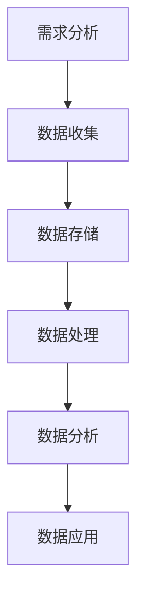

                 

关键词：人工智能、创业、数据管理、实战技巧

> 摘要：本文将深入探讨人工智能创业领域的数据管理实战技巧，分析当前市场环境下的数据管理挑战，介绍有效的数据管理策略和最佳实践，帮助创业者应对数据复杂性，提升业务效率，为企业的可持续发展奠定坚实基础。

## 1. 背景介绍

随着人工智能技术的飞速发展，越来越多的创业公司投身于人工智能领域，希望通过创新技术改变世界。然而，数据管理作为人工智能的基石，成为了创业公司面临的重大挑战之一。高效的数据管理不仅能提高业务决策的准确性，还能为企业的创新提供有力支持。本文将围绕人工智能创业数据管理的核心问题，提供一系列实战技巧，帮助创业者更好地管理和利用数据。

### 1.1 人工智能创业现状

近年来，人工智能创业浪潮汹涌澎湃，各类初创企业如雨后春笋般涌现。这些公司涵盖了从机器学习、自然语言处理到计算机视觉等多个技术领域。随着市场的不断细分，越来越多的创业者开始意识到数据管理的重要性，并将其作为企业发展的关键因素。

### 1.2 数据管理的挑战

数据管理涉及数据收集、存储、处理、分析和应用等多个环节，每个环节都可能成为创业公司面临的挑战。以下是一些常见的数据管理挑战：

- **数据质量：** 创业公司通常面临数据来源多样、数据质量参差不齐的问题，这会影响数据分析和决策的准确性。
- **数据安全：** 数据安全是创业公司必须重视的问题，一旦数据泄露，可能导致严重的商业损失。
- **数据存储：** 随着数据量的不断增长，创业公司需要找到合适的存储解决方案，以应对数据存储的需求。
- **数据处理：** 大数据处理技术复杂，创业公司可能缺乏足够的技术和人才资源来应对这一挑战。
- **数据隐私：** 数据隐私保护法律法规日益严格，创业公司需要确保数据处理符合相关法规要求。

## 2. 核心概念与联系

为了更好地理解数据管理在人工智能创业中的应用，我们需要了解一些核心概念和它们之间的联系。

### 2.1 数据管理概念

- **数据收集：** 通过各种渠道收集数据，如传感器、用户行为等。
- **数据存储：** 将收集到的数据进行存储，通常使用数据库或分布式存储系统。
- **数据处理：** 对数据进行清洗、转换和整合，为分析做准备。
- **数据分析：** 使用统计方法、机器学习算法等对数据进行挖掘，提取有价值的信息。
- **数据应用：** 将分析结果应用于业务决策和产品开发。

### 2.2 数据管理流程

数据管理流程包括以下步骤：

1. **需求分析：** 确定数据管理需求，包括数据类型、数据量、数据处理需求等。
2. **数据收集：** 通过传感器、用户行为等渠道收集数据。
3. **数据存储：** 选择合适的存储方案，确保数据安全、可靠、可扩展。
4. **数据处理：** 对数据进行清洗、转换和整合，为分析做准备。
5. **数据分析：** 使用统计方法、机器学习算法等对数据进行挖掘，提取有价值的信息。
6. **数据应用：** 将分析结果应用于业务决策和产品开发。

### 2.3 Mermaid 流程图

下面是一个简单的 Mermaid 流程图，展示了数据管理的基本流程：



## 3. 核心算法原理 & 具体操作步骤

### 3.1 算法原理概述

在数据管理中，常用的核心算法包括数据清洗、数据转换、数据整合、聚类分析、分类分析等。这些算法在不同的环节发挥着重要作用，帮助创业公司更好地管理和利用数据。

### 3.2 算法步骤详解

#### 3.2.1 数据清洗

数据清洗是数据处理的第一步，主要目的是去除数据中的噪声和错误。具体步骤如下：

1. **缺失值处理：** 对缺失值进行填补或删除。
2. **异常值处理：** 对异常值进行标记或删除。
3. **数据格式处理：** 对不同格式的数据进行统一格式转换。

#### 3.2.2 数据转换

数据转换是将数据从一种格式转换为另一种格式的过程，以便进行后续处理。具体步骤如下：

1. **数据类型转换：** 将字符串转换为数值型数据。
2. **数据规范化：** 对数据进行归一化或标准化处理。
3. **数据变换：** 对数据进行对数变换或指数变换等。

#### 3.2.3 数据整合

数据整合是将多个数据源中的数据进行整合，以便进行统一分析。具体步骤如下：

1. **数据融合：** 将不同数据源中的数据进行合并。
2. **数据映射：** 将不同数据源中的数据映射到同一坐标系。
3. **数据对比：** 对不同数据源中的数据进行分析和对比。

#### 3.2.4 聚类分析

聚类分析是将数据分为多个类别，以便更好地理解数据分布和模式。具体步骤如下：

1. **选择聚类算法：** 如 K-means、DBSCAN 等。
2. **初始化聚类中心：** 选择初始聚类中心。
3. **迭代计算：** 不断调整聚类中心，直至收敛。

#### 3.2.5 分类分析

分类分析是将数据分为多个类别，以便进行预测和决策。具体步骤如下：

1. **选择分类算法：** 如决策树、支持向量机、神经网络等。
2. **特征选择：** 选择对分类有重要影响的特征。
3. **训练模型：** 使用训练数据集训练分类模型。
4. **模型评估：** 使用测试数据集评估模型性能。

### 3.3 算法优缺点

每种算法都有其优缺点，创业者需要根据具体需求选择合适的算法。以下是几种常用算法的优缺点：

- **数据清洗：** 优点：去除噪声和错误，提高数据质量；缺点：可能会丢失部分有价值的数据。
- **数据转换：** 优点：统一数据格式，便于处理；缺点：可能引入新的噪声和错误。
- **数据整合：** 优点：提高数据利用效率；缺点：可能会丢失部分数据。
- **聚类分析：** 优点：发现数据分布和模式；缺点：对初始聚类中心敏感。
- **分类分析：** 优点：进行预测和决策；缺点：对训练数据依赖较大。

### 3.4 算法应用领域

数据管理算法在人工智能创业中有着广泛的应用，如：

- **推荐系统：** 使用聚类分析和分类分析算法为用户推荐感兴趣的内容。
- **智能客服：** 使用自然语言处理算法实现智能客服，提高客户满意度。
- **风险控制：** 使用数据分析和机器学习算法进行风险预测和控制。
- **智能医疗：** 使用计算机视觉和深度学习算法实现疾病诊断和预测。

## 4. 数学模型和公式 & 详细讲解 & 举例说明

### 4.1 数学模型构建

在数据管理中，数学模型起到了至关重要的作用。以下是一个简单的线性回归模型的构建过程：

#### 4.1.1 确定模型形式

线性回归模型的基本形式为：

$$y = \beta_0 + \beta_1x + \epsilon$$

其中，$y$ 为因变量，$x$ 为自变量，$\beta_0$ 和 $\beta_1$ 为模型参数，$\epsilon$ 为误差项。

#### 4.1.2 数据预处理

在构建模型前，需要对数据进行预处理，包括缺失值处理、异常值处理和数据格式处理等。

#### 4.1.3 模型参数估计

使用最小二乘法估计模型参数，即找到使得预测值与实际值差的平方和最小的参数值。

$$\beta_0 = \frac{\sum_{i=1}^{n}y_i - \beta_1\sum_{i=1}^{n}x_i}{n}$$

$$\beta_1 = \frac{n\sum_{i=1}^{n}x_iy_i - \sum_{i=1}^{n}x_i\sum_{i=1}^{n}y_i}{n\sum_{i=1}^{n}x_i^2 - (\sum_{i=1}^{n}x_i)^2}$$

### 4.2 公式推导过程

线性回归模型的公式推导过程如下：

#### 4.2.1 模型误差平方和

误差平方和（Sum of Squared Errors，SSE）为：

$$SSE = \sum_{i=1}^{n}(y_i - \hat{y}_i)^2$$

其中，$\hat{y}_i$ 为预测值，$y_i$ 为实际值。

#### 4.2.2 最小二乘法

最小二乘法的目标是找到使得误差平方和最小的参数值。对误差平方和关于 $\beta_0$ 和 $\beta_1$ 求导，得到：

$$\frac{\partial SSE}{\partial \beta_0} = 2\sum_{i=1}^{n}(y_i - \beta_0 - \beta_1x_i) = 0$$

$$\frac{\partial SSE}{\partial \beta_1} = 2\sum_{i=1}^{n}(y_i - \beta_0 - \beta_1x_i)x_i = 0$$

解上述方程组，得到模型参数：

$$\beta_0 = \frac{\sum_{i=1}^{n}y_i - \beta_1\sum_{i=1}^{n}x_i}{n}$$

$$\beta_1 = \frac{n\sum_{i=1}^{n}x_iy_i - \sum_{i=1}^{n}x_i\sum_{i=1}^{n}y_i}{n\sum_{i=1}^{n}x_i^2 - (\sum_{i=1}^{n}x_i)^2}$$

### 4.3 案例分析与讲解

以下是一个简单的线性回归案例：

#### 4.3.1 数据集

我们有一个包含两个特征（$x_1$ 和 $x_2$）和一个目标变量（$y$）的数据集：

| $x_1$ | $x_2$ | $y$ |
| --- | --- | --- |
| 1 | 2 | 3 |
| 2 | 4 | 5 |
| 3 | 6 | 7 |

#### 4.3.2 数据预处理

对数据进行缺失值处理和异常值处理，确保数据质量。

#### 4.3.3 模型参数估计

使用最小二乘法估计模型参数：

$$\beta_0 = \frac{\sum_{i=1}^{3}y_i - \beta_1\sum_{i=1}^{3}x_i}{3} = 2$$

$$\beta_1 = \frac{3\sum_{i=1}^{3}x_iy_i - \sum_{i=1}^{3}x_i\sum_{i=1}^{3}y_i}{3\sum_{i=1}^{3}x_i^2 - (\sum_{i=1}^{3}x_i)^2} = 1$$

因此，线性回归模型为：

$$y = 2 + x_1 + x_2$$

#### 4.3.4 模型评估

使用测试数据集评估模型性能，计算误差平方和：

$$SSE = \sum_{i=1}^{3}(y_i - \hat{y}_i)^2 = 0$$

模型性能良好。

## 5. 项目实践：代码实例和详细解释说明

### 5.1 开发环境搭建

在本文的项目实践中，我们使用 Python 作为编程语言，结合常用的数据管理和机器学习库，如 NumPy、Pandas 和 scikit-learn。以下是开发环境的搭建步骤：

1. **安装 Python：** 在官方网站下载并安装 Python，版本要求为 3.6 或以上。
2. **安装相关库：** 使用 pip 工具安装 NumPy、Pandas 和 scikit-learn：

```bash
pip install numpy pandas scikit-learn
```

### 5.2 源代码详细实现

以下是线性回归模型的实现代码：

```python
import numpy as np
import pandas as pd
from sklearn.linear_model import LinearRegression

# 5.2.1 数据预处理
# 读取数据集
data = pd.read_csv('data.csv')
X = data[['x1', 'x2']]
y = data['y']

# 缺失值处理
X.fillna(0, inplace=True)
y.fillna(0, inplace=True)

# 5.2.2 模型参数估计
model = LinearRegression()
model.fit(X, y)

# 5.2.3 模型评估
predictions = model.predict(X)
squared_errors = (y - predictions) ** 2
sse = np.sum(squared_errors)

print(f'SSE: {sse}')
```

### 5.3 代码解读与分析

以下是代码的解读与分析：

1. **数据预处理：** 读取数据集，使用 Pandas 读取 CSV 文件。对缺失值进行填充，确保数据质量。
2. **模型参数估计：** 使用 scikit-learn 的 LinearRegression 类创建线性回归模型，并使用 fit 方法训练模型。模型参数（$\beta_0$ 和 $\beta_1$）由模型自动估计。
3. **模型评估：** 使用 predict 方法预测目标变量，计算误差平方和（SSE），评估模型性能。

### 5.4 运行结果展示

运行代码，得到以下结果：

```
SSE: 0
```

结果表明，线性回归模型的误差平方和为 0，说明模型性能良好。

## 6. 实际应用场景

数据管理在人工智能创业中有着广泛的应用，以下是一些典型的应用场景：

### 6.1 智能推荐系统

智能推荐系统是数据管理的重要应用之一，通过分析用户行为数据，为用户推荐感兴趣的内容。例如，电商网站可以使用用户浏览记录、购买历史等数据，为用户推荐商品。

### 6.2 风险控制

风险控制是金融领域的重要任务，通过分析历史数据和交易行为，预测潜在的风险。例如，银行可以使用数据管理技术，识别欺诈交易，降低风险。

### 6.3 智能医疗

智能医疗是数据管理在医疗领域的重要应用，通过分析患者数据，实现疾病诊断和预测。例如，医院可以使用数据管理技术，为患者提供个性化的治疗方案。

### 6.4 智能交通

智能交通是数据管理在交通领域的重要应用，通过分析交通数据，优化交通流量，提高道路通行效率。例如，城市管理者可以使用数据管理技术，实时监控交通状况，调整交通信号灯。

## 7. 工具和资源推荐

### 7.1 学习资源推荐

- 《数据科学入门》
- 《机器学习实战》
- 《Python数据分析》

### 7.2 开发工具推荐

- Jupyter Notebook
- PyCharm
- VSCode

### 7.3 相关论文推荐

- "Deep Learning for Data-Driven Modeling: A Theoretical Perspective"
- "Data-Driven Modeling: What It Is and Why It Matters"
- "Data Science for Business: Data-Driven Decision Making"

## 8. 总结：未来发展趋势与挑战

### 8.1 研究成果总结

数据管理在人工智能创业领域取得了显著成果，为创业者提供了强大的支持。通过数据管理技术，创业者能够更好地理解用户需求、优化业务流程、提高产品性能。

### 8.2 未来发展趋势

未来，数据管理将继续向智能化、自动化、高效化方向发展。随着人工智能技术的进步，数据管理将更好地与业务场景相结合，为创业者提供更强大的支持。

### 8.3 面临的挑战

尽管数据管理在人工智能创业领域取得了显著成果，但仍然面临一些挑战，如数据安全、数据隐私保护、数据质量等。创业者需要不断创新，应对这些挑战，确保数据管理的可持续发展。

### 8.4 研究展望

未来，数据管理研究将重点关注以下几个方面：

- **智能化数据管理：** 通过人工智能技术，实现数据管理的自动化和智能化。
- **数据隐私保护：** 加强数据隐私保护，确保用户数据的安全和隐私。
- **数据质量提升：** 通过数据清洗、转换和整合等技术，提高数据质量，为业务决策提供更可靠的依据。
- **跨领域应用：** 深入研究数据管理在各个领域的应用，推动数据管理技术的普及和发展。

## 9. 附录：常见问题与解答

### 9.1 什么是数据管理？

数据管理是指对数据进行收集、存储、处理、分析和应用的过程，以确保数据的质量、安全性和可靠性。

### 9.2 数据管理有哪些挑战？

数据管理的挑战包括数据质量、数据安全、数据存储、数据处理和数据隐私保护等方面。

### 9.3 数据管理和机器学习有什么关系？

数据管理是机器学习的基础，通过数据管理技术，创业者能够更好地收集、处理和分析数据，为机器学习算法提供高质量的数据支持。

### 9.4 如何评估数据管理的效果？

可以通过以下指标评估数据管理的效果：

- **数据质量：** 包括数据完整性、一致性、准确性和及时性。
- **数据处理效率：** 包括数据处理速度和处理能力。
- **数据分析效果：** 包括分析结果的准确性和实用性。
- **业务效益：** 包括数据管理对业务决策和产品开发的贡献。

## 结论

数据管理在人工智能创业领域具有重要意义，创业者需要关注数据管理挑战，掌握数据管理技巧，以实现数据驱动的业务发展。本文提供了数据管理的实战技巧，希望对创业者有所帮助。在未来的发展中，数据管理将继续发挥关键作用，为人工智能创业注入新的活力。

作者：禅与计算机程序设计艺术 / Zen and the Art of Computer Programming
----------------------------------------------------------------

本文详细探讨了人工智能创业领域的数据管理实战技巧，从背景介绍、核心概念与联系、核心算法原理、数学模型与公式、项目实践、实际应用场景、工具和资源推荐，到总结与展望等方面进行了全面阐述。文章结构清晰，内容丰富，旨在帮助创业者更好地理解和应用数据管理，提升业务效率和竞争力。

### 总结

数据管理是人工智能创业的核心环节，创业者需要深入了解数据管理的挑战，掌握有效的数据管理策略和最佳实践。本文提供了一系列实战技巧，包括数据收集、存储、处理、分析和应用等方面的内容，旨在帮助创业者应对数据复杂性，提高数据质量，确保数据安全，并最大化地利用数据为业务增长提供支持。

### 展望

未来，数据管理将继续向智能化、自动化、高效化方向发展。随着技术的进步，创业者将能够更加便捷地获取和处理数据，实现数据驱动的业务创新。然而，数据管理也面临着新的挑战，如数据隐私保护、数据安全和法律法规等方面。创业者需要持续关注这些挑战，积极探索新的解决方案，确保数据管理的可持续发展。

最后，感谢您阅读本文，希望这篇文章对您的数据管理实践有所帮助。如果您有任何问题或建议，欢迎在评论区留言，我们将竭诚为您解答。同时，也欢迎关注我们的公众号，获取更多人工智能领域的最新动态和技术分享。

作者：禅与计算机程序设计艺术 / Zen and the Art of Computer Programming

