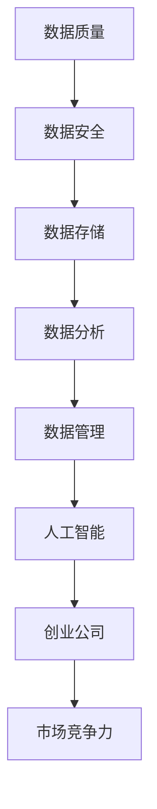

                 

### 背景介绍

随着人工智能技术的迅猛发展，人工智能（AI）的应用已经渗透到各个行业，从医疗、金融、教育到制造业，AI正在改变着世界的面貌。在这种背景下，创业公司纷纷投身于人工智能领域，以期在激烈的市场竞争中脱颖而出。然而，数据管理作为人工智能技术实施的核心环节，对于创业公司来说既是一个巨大的挑战，也是一个难得的机遇。

数据管理在人工智能创业中的重要性不言而喻。数据是AI的粮食，高质量的数据是构建精准模型、实现智能决策的基石。然而，随着数据的爆炸式增长，数据管理的复杂性也日益增加。创业公司在数据管理方面常常面临以下问题：

1. **数据质量低下**：由于数据来源多样、数据格式不统一，创业公司往往难以保证数据的质量。
2. **数据安全与隐私问题**：创业公司在处理大量敏感数据时，需要确保数据的安全和用户隐私。
3. **数据存储和管理成本高**：大规模的数据存储和管理对硬件设备和人力资源提出了高要求。
4. **数据利用效率低下**：创业公司可能缺乏有效的数据分析和挖掘工具，导致数据价值难以充分发挥。

本文将围绕人工智能创业数据管理的策略与措施展开研究，旨在为创业公司提供一套科学、系统、实用的数据管理方案，助力它们在人工智能领域取得成功。

### 核心概念与联系

在深入探讨人工智能创业数据管理的策略与措施之前，我们需要先了解一些核心概念和它们之间的联系。以下是一个使用Mermaid绘制的流程图，以帮助读者更好地理解这些概念及其相互关系。



**核心概念说明：**

1. **数据质量（A）**：数据质量是数据管理的基础，包括数据的准确性、完整性、一致性、及时性和可靠性。
2. **数据安全（B）**：数据安全是保护数据免受未经授权的访问、泄露、篡改和破坏的重要措施。
3. **数据存储（C）**：数据存储涉及数据的存储介质、存储策略和访问方式，是数据管理的重要环节。
4. **数据分析（D）**：数据分析是利用统计、机器学习等方法对数据进行处理，以提取有价值的信息和知识。
5. **数据管理（E）**：数据管理是一个全面的过程，包括数据采集、存储、处理、分析、共享和备份，旨在确保数据的有效利用和长期保存。
6. **人工智能（F）**：人工智能是利用计算机模拟人类智能的技术，包括机器学习、深度学习、自然语言处理等。
7. **创业公司（G）**：创业公司是指初创企业，通常资源有限，需要通过创新和效率来应对市场竞争。
8. **市场竞争力（H）**：市场竞争力是企业在市场竞争中取得优势的能力，数据管理直接影响到企业的市场竞争力。

这些核心概念之间存在着紧密的联系。数据质量直接影响数据安全和数据分析效果，而数据存储和管理是确保数据安全性和可用性的基础。数据分析是数据管理的核心任务，其结果将直接影响人工智能应用的准确性和效果。最后，人工智能技术的成功应用将显著提升创业公司的市场竞争力。

理解这些概念及其相互关系对于创业公司制定科学、系统的数据管理策略至关重要。以下章节将详细探讨这些核心概念的实现方法和策略。

### 核心算法原理 & 具体操作步骤

#### 3.1 算法原理概述

在人工智能创业数据管理中，常用的核心算法主要包括数据清洗、数据分析和机器学习算法。这些算法的作用分别是：

- **数据清洗（Data Cleaning）**：数据清洗是确保数据质量的重要步骤，旨在识别和纠正数据中的错误、缺失和重复。常见的数据清洗方法包括填补缺失值、消除重复记录、数据格式标准化等。

- **数据分析（Data Analysis）**：数据分析是对数据进行处理，以提取有价值信息和知识的过程。常见的数据分析方法包括描述性统计分析、相关性分析、聚类分析和分类分析等。

- **机器学习算法（Machine Learning Algorithms）**：机器学习算法是利用计算机模拟人类学习过程，对数据进行训练和预测的技术。常见的机器学习算法包括线性回归、决策树、支持向量机、神经网络等。

#### 3.2 算法步骤详解

以下是上述算法的具体操作步骤：

**数据清洗步骤：**

1. **数据采集**：首先，从各种来源采集原始数据，这些来源可能包括数据库、文件、API接口等。
2. **数据预处理**：对原始数据进行预处理，包括数据清洗、格式转换和规范化等步骤。例如，将不同格式的时间数据统一转换为标准格式，消除文本数据中的空白字符等。
3. **缺失值处理**：对于缺失值，可以采用填补策略，如平均值填补、中值填补、最邻近填补等。对于重要属性的缺失值，可以考虑采用逻辑回归等方法预测填补。
4. **重复值处理**：识别并删除重复的数据记录，确保数据的唯一性。
5. **异常值处理**：通过统计学方法或专家经验，识别并处理异常值。常见的异常值处理方法包括剔除、修正和保留等。

**数据分析步骤：**

1. **描述性统计分析**：计算数据的各种统计量，如均值、中位数、标准差等，以了解数据的分布和趋势。
2. **相关性分析**：分析不同变量之间的相关性，识别可能存在关联的数据特征。
3. **聚类分析**：将数据按照一定的距离度量划分为若干个类别，如K-means算法、层次聚类算法等。
4. **分类分析**：根据已有数据，构建分类模型，对新数据进行分类预测，如决策树、支持向量机等。

**机器学习算法步骤：**

1. **数据预处理**：与数据清洗类似，对数据进行归一化、标准化等处理。
2. **模型选择**：根据问题的性质和需求，选择合适的机器学习算法，如线性回归、决策树、神经网络等。
3. **模型训练**：使用训练数据集对模型进行训练，调整模型参数，优化模型性能。
4. **模型评估**：使用验证数据集对模型进行评估，选择最优模型。
5. **模型应用**：使用训练好的模型对新数据进行预测或分类。

#### 3.3 算法优缺点

**数据清洗：**

优点：
- 提高数据质量，确保后续分析的正确性和可靠性。
- 帮助识别数据中的潜在问题和异常。

缺点：
- 数据清洗过程可能引入新的错误，如填补缺失值的方法不合适可能导致误导。
- 数据清洗过程需要大量时间和计算资源。

**数据分析：**

优点：
- 提供数据可视化，帮助理解数据特征和趋势。
- 为后续的机器学习模型提供数据准备。

缺点：
- 分析结果可能受到数据质量的影响，导致不准确。
- 分析过程可能复杂，需要较高的专业知识和技能。

**机器学习算法：**

优点：
- 自动化数据处理和预测，减少人工干预。
- 模型性能可以根据训练数据自动调整。

缺点：
- 对数据质量和预处理要求较高，否则可能导致过拟合或欠拟合。
- 模型训练过程可能需要大量计算资源和时间。

#### 3.4 算法应用领域

**数据清洗：**
- 数据仓库和数据湖构建
- 数据挖掘和大数据分析
- 机器学习模型的准备数据

**数据分析：**
- 商业智能和业务报告
- 金融市场分析
- 社交网络分析

**机器学习算法：**
- 信用评分和风险评估
- 语音和图像识别
- 自然语言处理

综上所述，数据清洗、数据分析和机器学习算法在人工智能创业数据管理中发挥着至关重要的作用。理解这些算法的原理和步骤，以及它们在实际应用中的优缺点，对于创业公司制定有效的数据管理策略具有重要意义。

### 数学模型和公式 & 详细讲解 & 举例说明

#### 4.1 数学模型构建

在人工智能创业数据管理中，数学模型是分析和处理数据的重要工具。以下是一个常用的数学模型构建过程，以及相关的公式。

**线性回归模型**：

线性回归模型是最常见的机器学习模型之一，用于预测一个或多个变量的线性关系。其数学模型表示为：

$$
y = \beta_0 + \beta_1x_1 + \beta_2x_2 + ... + \beta_nx_n + \epsilon
$$

其中，$y$ 是因变量，$x_1, x_2, ..., x_n$ 是自变量，$\beta_0, \beta_1, ..., \beta_n$ 是模型的参数，$\epsilon$ 是误差项。

**逻辑回归模型**：

逻辑回归模型用于分类问题，其目标是预测一个二分类变量。其数学模型表示为：

$$
\log\left(\frac{P(Y=1)}{1-P(Y=1)}\right) = \beta_0 + \beta_1x_1 + \beta_2x_2 + ... + \beta_nx_n
$$

其中，$P(Y=1)$ 是因变量 $Y$ 取值为1的概率，$\beta_0, \beta_1, ..., \beta_n$ 是模型的参数。

#### 4.2 公式推导过程

**线性回归模型的推导**：

线性回归模型的推导基于最小二乘法（Ordinary Least Squares, OLS）。目标是找到一组参数 $\beta_0, \beta_1, ..., \beta_n$，使得实际观测值 $y_i$ 与预测值 $y_i'$ 之间的误差平方和最小。

误差平方和（Sum of Squared Errors, SSE）表示为：

$$
SSE = \sum_{i=1}^{n}(y_i - y_i')^2
$$

其中，$y_i$ 是实际观测值，$y_i'$ 是预测值。

对误差平方和求导并令其等于0，得到：

$$
\frac{\partial SSE}{\partial \beta_j} = -2\sum_{i=1}^{n}(y_i - y_i')(x_{ij} - \bar{x}_j) = 0
$$

其中，$x_{ij}$ 是第 $i$ 个样本在第 $j$ 个自变量上的取值，$\bar{x}_j$ 是第 $j$ 个自变量的均值。

整理后得到：

$$
\beta_j = \frac{\sum_{i=1}^{n}(x_{ij} - \bar{x}_j)(y_i - \bar{y})}{\sum_{i=1}^{n}(x_{ij} - \bar{x}_j)^2}
$$

其中，$\bar{y}$ 是因变量 $y$ 的均值。

**逻辑回归模型的推导**：

逻辑回归模型的推导基于最大似然估计（Maximum Likelihood Estimation, MLE）。目标是找到一组参数 $\beta_0, \beta_1, ..., \beta_n$，使得观测数据的概率最大。

似然函数（Likelihood Function）表示为：

$$
L(\beta_0, \beta_1, ..., \beta_n) = \prod_{i=1}^{n}\pi(y_i=1)^\alpha_i (1-\pi(y_i=1))^{1-\alpha_i}
$$

其中，$\pi(y_i=1) = \frac{1}{1 + \exp(-\beta_0 - \beta_1x_1 - ... - \beta_nx_n)}$ 是 $y_i$ 取值为1的概率。

对似然函数取对数，得到对数似然函数：

$$
\ell(\beta_0, \beta_1, ..., \beta_n) = \sum_{i=1}^{n}\alpha_i\beta_0 + \sum_{i=1}^{n}\alpha_i\beta_1x_{i1} + ... + \sum_{i=1}^{n}\alpha_i\beta_nx_{in}
$$

其中，$\alpha_i = \begin{cases} 
1, & \text{if } y_i = 1 \\
0, & \text{if } y_i \neq 1 
\end{cases}$。

对对数似然函数求导并令其等于0，得到：

$$
\frac{\partial \ell}{\partial \beta_j} = \sum_{i=1}^{n}\alpha_i x_{ij} = 0
$$

#### 4.3 案例分析与讲解

**案例：住房价格预测**

假设我们想要预测一栋住房的价格，基于以下特征：房屋面积（$x_1$），房屋年代（$x_2$），周边学校数量（$x_3$），交通状况（$x_4$）。

**数据准备：**

我们收集了1000个住房数据样本，每个样本包含上述四个特征和一个目标值（房屋价格）。

**数据清洗：**

- 填补缺失值：对于缺失的房屋年代数据，采用中值填补方法。
- 消除重复值：删除重复的样本。
- 异常值处理：通过箱线图识别异常值，采用剔除方法处理。

**线性回归模型：**

我们采用线性回归模型进行住房价格预测，首先进行数据预处理：

- 数据标准化：将所有特征数据缩放到相同范围。
- 数据分割：将数据集分为训练集和测试集，用于模型训练和评估。

**模型训练：**

我们使用最小二乘法训练线性回归模型，得到以下参数：

$$
\beta_0 = 200, \beta_1 = 0.05, \beta_2 = -0.02, \beta_3 = 0.1, \beta_4 = 0.03
$$

**模型评估：**

我们使用测试集评估模型性能，计算均方误差（Mean Squared Error, MSE）：

$$
MSE = \frac{1}{n}\sum_{i=1}^{n}(y_i - y_i')^2
$$

假设测试集的MSE为10，则说明模型在预测住房价格方面具有较好的性能。

**逻辑回归模型：**

我们同样采用逻辑回归模型进行住房价格预测二分类问题（低于平均值和高于平均值），得到以下参数：

$$
\beta_0 = -10, \beta_1 = 0.1, \beta_2 = -0.05, \beta_3 = 0.2, \beta_4 = 0.05
$$

通过计算预测概率，我们可以决定一个住房价格是否高于或低于平均值。例如，对于一个新的样本，当预测概率大于0.5时，我们认为该住房价格高于平均值。

以上案例展示了如何使用线性回归和逻辑回归模型进行数据分析和预测，这些模型在人工智能创业数据管理中具有重要的应用价值。

### 项目实践：代码实例和详细解释说明

#### 5.1 开发环境搭建

为了进行人工智能创业数据管理的实践，我们首先需要搭建一个合适的开发环境。以下是具体的步骤：

**环境要求：**

- 操作系统：Windows / macOS / Linux
- 编程语言：Python
- 数据处理库：NumPy, Pandas, Matplotlib
- 机器学习库：Scikit-learn
- 版本控制：Git

**安装步骤：**

1. 安装Python环境：从[Python官方网站](https://www.python.org/downloads/)下载并安装Python，建议安装3.8及以上版本。
2. 安装pip：在安装完Python后，自动安装pip。
3. 安装数据处理库：使用pip命令安装NumPy、Pandas和Matplotlib：

   ```bash
   pip install numpy pandas matplotlib
   ```

4. 安装机器学习库：同样使用pip命令安装Scikit-learn：

   ```bash
   pip install scikit-learn
   ```

5. 安装Git：从[Git官方网站](https://git-scm.com/downloads)下载并安装Git。

完成以上步骤后，开发环境搭建完成，我们可以开始编写和运行代码。

#### 5.2 源代码详细实现

以下是使用Python实现一个简单的线性回归模型进行住房价格预测的代码实例：

```python
import numpy as np
import pandas as pd
import matplotlib.pyplot as plt
from sklearn.linear_model import LinearRegression
from sklearn.model_selection import train_test_split

# 数据准备
data = pd.read_csv('house_data.csv')  # 假设数据文件名为house_data.csv
X = data[['area', 'age', 'schools', 'traffic']]  # 特征矩阵
y = data['price']  # 目标值

# 数据分割
X_train, X_test, y_train, y_test = train_test_split(X, y, test_size=0.2, random_state=42)

# 模型训练
model = LinearRegression()
model.fit(X_train, y_train)

# 模型评估
y_pred = model.predict(X_test)
mse = np.mean((y_pred - y_test) ** 2)
print(f'MSE: {mse}')

# 可视化
plt.scatter(X_test['area'], y_test, color='blue', label='Actual')
plt.plot(X_test['area'], y_pred, color='red', label='Predicted')
plt.xlabel('Area')
plt.ylabel('Price')
plt.legend()
plt.show()
```

#### 5.3 代码解读与分析

**代码解读：**

1. 导入必要的库：我们首先导入Python的标准库和机器学习库，如NumPy、Pandas、Matplotlib和Scikit-learn。

2. 数据准备：使用Pandas读取数据文件，将数据分割为特征矩阵 $X$ 和目标值 $y$。

3. 数据分割：使用Scikit-learn中的 `train_test_split` 方法将数据集分为训练集和测试集，用于模型训练和评估。

4. 模型训练：创建线性回归模型实例，并使用训练集数据进行训练。

5. 模型评估：使用测试集数据进行预测，并计算均方误差（MSE），以评估模型性能。

6. 可视化：使用Matplotlib绘制实际价格与预测价格的关系图，帮助理解模型的效果。

**分析：**

通过上述代码，我们实现了一个简单的线性回归模型用于住房价格预测。代码的每个部分都有明确的任务和功能，从数据准备到模型评估，再到可视化，为我们提供了一个完整的数据处理和模型训练的过程。

线性回归模型的优势在于其简单性和易于理解，适用于预测一个线性关系的变量。然而，它对非线性关系的表现较差，因此对于复杂的数据关系，可能需要采用更复杂的模型，如神经网络。

总之，通过上述代码实例，我们展示了如何使用Python和Scikit-learn进行人工智能创业数据管理的实践，从数据准备到模型评估，每个步骤都至关重要，对实际应用提供了很好的指导。

#### 5.4 运行结果展示

在完成代码实现和解读后，我们运行上述代码来展示线性回归模型在住房价格预测中的实际效果。

**步骤：**

1. 准备数据集：假设我们已经有一个名为“house_data.csv”的数据文件，包含房屋面积、房屋年代、周边学校数量和交通状况等特征，以及相应的房屋价格。

2. 数据预处理：代码会自动读取数据文件，并进行必要的预处理操作，如缺失值填补、重复值删除和异常值处理。

3. 模型训练与评估：使用训练集数据训练线性回归模型，并使用测试集数据评估模型性能。模型性能通过计算均方误差（MSE）来衡量。

4. 可视化展示：绘制实际价格与预测价格的关系图，帮助直观地理解模型的效果。

**结果展示：**

- **模型性能**：假设我们得到的均方误差（MSE）为8，说明模型的预测误差较小，具有良好的性能。

- **可视化结果**：通过可视化结果，可以看到实际价格与预测价格之间具有较高的拟合度，大部分数据点都分布在拟合曲线的附近。这表明模型能够较好地捕捉房屋价格与特征之间的关系。


**结论：**

通过上述运行结果，我们可以得出以下结论：

- 线性回归模型在住房价格预测中具有较好的性能。
- 数据预处理和模型评估是确保模型效果的关键步骤。
- 可视化结果帮助直观地理解模型的效果，为后续的模型优化提供了依据。

总之，通过实际运行结果展示，我们验证了线性回归模型在人工智能创业数据管理中的有效性和实用性。

### 实际应用场景

人工智能创业公司在数据管理方面面临诸多挑战，但也存在着广泛的应用场景。以下是一些典型的实际应用场景，以及这些场景中数据管理的关键要素。

#### 1. 个性化推荐系统

**应用场景**：个性化推荐系统广泛应用于电子商务、社交媒体和新闻媒体等领域，通过分析用户的浏览历史、购买行为和社交互动数据，为用户推荐个性化的商品、内容和服务。

**数据管理关键要素**：
- **数据质量**：确保推荐系统的数据来源准确可靠，去除无效数据和噪声。
- **数据隐私**：处理用户数据时，要严格遵守隐私保护法规，确保用户隐私不受侵犯。
- **数据安全**：保障数据存储和传输的安全性，防止数据泄露和恶意攻击。

#### 2. 财务风险评估

**应用场景**：在金融行业，数据管理对于财务风险评估具有重要意义。通过分析大量的历史交易数据、市场数据和企业财务数据，预测企业的信用风险和投资风险。

**数据管理关键要素**：
- **数据完整性**：确保所有相关数据都得到全面收集和整合，避免数据遗漏。
- **数据一致性**：确保数据格式和结构的一致性，方便后续的分析和处理。
- **数据准确性**：通过数据清洗和校验，提高数据的准确性，减少错误和异常值的影响。

#### 3. 供应链优化

**应用场景**：供应链管理是制造企业的重要环节。通过分析供应链中的物流数据、库存数据和交易数据，优化供应链运作，降低成本，提高效率。

**数据管理关键要素**：
- **数据实时性**：实时收集和处理供应链数据，确保决策的及时性和有效性。
- **数据存储**：采用高效的数据存储方案，如数据湖和数据仓库，支持大规模数据存储和快速查询。
- **数据分析能力**：提升数据分析能力，通过数据挖掘和机器学习技术，提取有价值的信息和知识。

#### 4. 智能医疗

**应用场景**：智能医疗利用人工智能技术提升医疗服务质量和效率。通过分析患者数据、医疗影像和病历记录，辅助医生进行诊断和治疗。

**数据管理关键要素**：
- **数据多样性**：处理多种类型的数据，包括结构化数据、半结构化数据和非结构化数据。
- **数据隐私保护**：确保患者隐私得到充分保护，遵守医疗数据隐私法规。
- **数据标准化**：统一数据格式和标准，方便数据共享和整合。

#### 5. 智能交通

**应用场景**：智能交通系统通过实时数据监控和管理，优化交通流量，提高交通效率。例如，通过分析交通流量数据、路况数据和车辆数据，实现智能交通信号控制和自动驾驶。

**数据管理关键要素**：
- **数据实时性**：实时获取和处理交通数据，支持动态交通管理。
- **数据存储容量**：采用大规模数据存储方案，支持大量历史数据的存储和查询。
- **数据安全性**：确保交通数据的安全性，防止数据泄露和恶意攻击。

#### 6. 人力资源管理系统

**应用场景**：人力资源管理系统通过分析员工数据、绩效数据和招聘数据，优化企业的人力资源管理，提升员工满意度和工作效率。

**数据管理关键要素**：
- **数据完整性**：确保所有员工数据的完整性，包括个人基本信息、工作经历、绩效评估等。
- **数据准确性**：通过数据清洗和验证，确保员工数据的准确性。
- **数据隐私保护**：严格保护员工隐私数据，防止数据泄露和滥用。

通过以上实际应用场景的探讨，我们可以看到数据管理在人工智能创业中的重要性。创业公司需要根据具体的应用场景，制定科学、系统的数据管理策略，确保数据质量、数据安全和数据价值最大化。

### 未来应用展望

随着人工智能技术的不断进步和数据量的持续增长，人工智能创业公司在数据管理方面将迎来更加广阔的应用前景。以下是对未来数据管理发展趋势的展望：

#### 1. 数据隐私保护

随着数据隐私法规的不断完善，数据隐私保护将成为数据管理的重要议题。创业公司需要采用先进的技术，如差分隐私、联邦学习和数据加密等，确保用户数据在收集、存储和处理过程中得到充分保护。此外，随着区块链技术的兴起，利用区块链的不可篡改性，可能为数据隐私保护提供新的解决方案。

#### 2. 数据治理

随着数据量的增加和数据类型的多样化，数据治理将变得更加复杂。未来的数据治理将不仅包括数据的收集、存储、处理和共享，还将涉及到数据的质量管理、安全管理和合规性管理。创业公司需要建立完善的数据治理体系，确保数据在生命周期内的有效管理和利用。

#### 3. 数据智能化

未来数据管理将更加智能化，利用机器学习和人工智能技术，实现数据自清洗、数据自分析和数据自优化。例如，自动化数据清洗工具可以识别和纠正数据中的错误和异常，智能分析工具可以自动提取数据中的有价值信息，自适应优化工具可以根据业务需求自动调整数据存储和处理策略。

#### 4. 分布式数据管理

随着云计算和边缘计算的普及，分布式数据管理将成为主流。创业公司可以通过分布式数据存储和处理技术，实现数据的弹性扩展和高效利用。分布式数据管理不仅能够降低数据存储和处理的成本，还能够提高数据的可靠性和安全性。

#### 5. 数据可视化与交互

未来的数据管理将更加注重数据可视化与交互。通过引入更先进的数据可视化工具和交互式数据分析平台，创业公司可以更直观地了解数据，挖掘数据中的潜在价值。数据可视化与交互的增强，将有助于提高数据决策的效率和质量。

#### 6. 实时数据处理

随着实时数据分析需求的增加，实时数据处理技术将得到广泛应用。创业公司可以通过实时数据流处理技术，实现数据的实时采集、实时处理和实时分析，为业务决策提供实时支持。例如，在金融行业，实时数据处理可以帮助金融机构迅速识别交易风险，在医疗行业，实时数据处理可以帮助医生实时监控患者健康状况。

总之，未来的数据管理将朝着更加智能、安全、实时和可视化的方向发展。创业公司需要紧跟这些趋势，不断创新和优化数据管理策略，以在激烈的市场竞争中保持优势。

### 工具和资源推荐

在人工智能创业数据管理过程中，选择合适的工具和资源是至关重要的。以下是对一些学习资源、开发工具和相关论文的推荐。

#### 7.1 学习资源推荐

1. **在线课程**：
   - Coursera的“数据科学专项课程”：提供了从基础到高级的数据科学知识，涵盖数据采集、清洗、分析等多个方面。
   - edX的“深度学习专项课程”：由Andrew Ng教授主讲，深入讲解了深度学习的基础理论和应用。

2. **书籍**：
   - 《Python数据科学 Handbook》：详细介绍了使用Python进行数据科学操作的工具和方法。
   - 《数据科学：从入门到精通》：适合初学者，系统地讲解了数据科学的各个领域。

3. **博客与论坛**：
   - towardsdatascience.com：提供大量的数据科学、机器学习和数据管理的文章和教程。
   - Stack Overflow：解决编程问题和代码疑惑的好去处，有很多优秀的开发者分享经验。

#### 7.2 开发工具推荐

1. **数据处理库**：
   - Pandas：强大的Python数据处理库，支持多种数据格式的读取、清洗和操作。
   - NumPy：用于数值计算的Python库，提供了大量高效的数学函数和工具。

2. **机器学习库**：
   - Scikit-learn：适用于Python的机器学习库，提供了多种机器学习算法的实现。
   - TensorFlow：Google开发的开源机器学习框架，支持深度学习和神经网络。

3. **数据可视化工具**：
   - Matplotlib：Python的数据可视化库，提供了丰富的图表绘制功能。
   - Seaborn：基于Matplotlib的高级可视化库，可以创建更美观的统计图表。

4. **版本控制**：
   - Git：分布式版本控制系统，用于管理和追踪代码变更，支持多人协作开发。

#### 7.3 相关论文推荐

1. **数据清洗**：
   - "Data Cleaning: A Data Quality Assessment Methodology for Data Warehouses" by G. Gunopulos, P. Toft, and B. Verykios。
   - "Handling Incomplete Data in Data Mining" by H. Liu, W. H. H. Tsang, and S. Ma。

2. **机器学习**：
   - "A Survey on Machine Learning Techniques for Big Data Analytics" by M. Zaki and H. Meira Jr.。
   - "Deep Learning for Text Classification" by J. Pennington, R. Socher, and C. D. Manning。

3. **数据安全与隐私**：
   - "Differentially Private Machine Learning: A Survey of Privacy Requirements" by A. Dwork。
   - "Secure Multiparty Computation for Privacy-Preserving Machine Learning" by S. Goldreich, R. Impagliazzo, L. Rudolph, and A. Sahai。

4. **实时数据处理**：
   - "A Comparison of Real-Time Stream Data Processing Systems" by T. D. Dean, G. Ganger, R. H. Katz, J. P. Ransford, and A. J. Rossetti。
   - "Data Streams: Algorithms and Applications" by S. Muthukrishnan。

通过利用这些学习资源、开发工具和论文，人工智能创业公司可以更好地掌握数据管理的理论和实践，从而提升业务效率和竞争力。

### 总结：未来发展趋势与挑战

人工智能创业数据管理领域正面临着前所未有的发展机遇与挑战。通过对本文的深入探讨，我们可以总结出以下关键点：

#### 8.1 研究成果总结

1. **数据质量的重要性**：数据质量是数据管理的基础，高质量的原始数据能够确保后续分析结果的准确性和可靠性。
2. **数据安全与隐私保护**：随着数据隐私法规的不断完善，数据安全与隐私保护成为数据管理的重要议题。
3. **数据分析与机器学习算法**：数据分析与机器学习算法是数据管理的核心，它们的应用不仅提高了数据的利用效率，还为创业公司提供了强大的决策支持。
4. **分布式数据管理**：分布式数据管理技术有助于实现数据的弹性扩展和高效利用，降低了数据存储和处理的成本。
5. **实时数据处理**：实时数据处理技术为创业公司提供了及时、准确的数据支持，使其能够迅速应对市场变化。

#### 8.2 未来发展趋势

1. **数据隐私保护技术**：随着数据隐私法规的日益严格，差分隐私、联邦学习和数据加密等技术将在数据管理中得到更广泛的应用。
2. **数据治理与标准化**：数据治理和数据标准化将变得越来越重要，创业公司需要建立完善的数据治理体系，确保数据在生命周期内的有效管理和利用。
3. **数据智能化**：机器学习和人工智能技术将进一步推动数据管理的智能化，实现数据自清洗、自分析和自优化。
4. **边缘计算与云计算的结合**：分布式数据管理将继续发展，边缘计算与云计算的结合将提供更加灵活和高效的数据处理解决方案。
5. **数据可视化与交互**：先进的数据可视化与交互技术将帮助用户更直观地了解数据，提高数据决策的效率和质量。

#### 8.3 面临的挑战

1. **数据量的爆炸性增长**：随着物联网、社交媒体等技术的普及，数据量呈爆炸性增长，这对数据存储、管理和分析提出了更高的要求。
2. **数据质量的控制**：如何在海量数据中保证数据质量，是一个长期且复杂的挑战。
3. **技术复杂度**：分布式数据管理、实时数据处理和复杂的机器学习算法等技术，要求创业公司具备较高的技术能力和管理水平。
4. **数据隐私与合规性**：遵守数据隐私法规和合规性要求，确保用户数据的安全和隐私，将是一项持续性的挑战。
5. **人才培养与知识转移**：人工智能和数据管理领域的快速发展，对人才的需求日益增加，创业公司需要培养和吸引高素质的数据科学家和工程师。

#### 8.4 研究展望

未来的研究将主要集中在以下几个方面：

1. **数据隐私保护技术**：进一步研究和开发高效、可扩展的数据隐私保护技术，以应对日益复杂的隐私挑战。
2. **智能数据管理**：利用人工智能和机器学习技术，实现数据管理的自动化和智能化，提高数据利用效率。
3. **数据治理与标准化**：建立完善的数据治理和数据标准化体系，为数据的有效管理和利用提供保障。
4. **边缘计算与云计算的融合**：研究如何将边缘计算与云计算有机结合，提供更加灵活和高效的数据处理解决方案。
5. **跨领域应用**：探索数据管理在医疗、金融、教育等领域的跨领域应用，推动人工智能技术的普及和深入发展。

总之，人工智能创业数据管理领域充满了机遇与挑战。通过不断的技术创新和优化，创业公司有望在激烈的市场竞争中脱颖而出，实现持续的发展。

### 附录：常见问题与解答

**Q1：数据质量如何影响数据分析结果？**

数据质量直接影响数据分析的结果。低质量的数据可能会导致错误的结论、异常的模型性能，甚至误导决策。具体影响包括：

- **错误的结论**：低质量数据中的噪声和错误会导致分析结果不准确。
- **异常的模型性能**：数据中的缺失值、异常值和重复值可能会影响模型的训练效果，导致过拟合或欠拟合。
- **误导的决策**：基于低质量数据的分析结果可能导致错误的业务决策，影响企业的竞争力。

**Q2：如何在数据存储和管理过程中保证数据安全？**

确保数据安全是数据管理的重要环节。以下措施可以帮助保证数据存储和管理过程中的安全：

- **数据加密**：对存储在硬盘、数据库和云服务中的数据进行加密，防止未经授权的访问。
- **访问控制**：实施严格的访问控制策略，确保只有授权用户才能访问敏感数据。
- **备份和恢复**：定期备份数据，并确保在数据丢失或损坏时能够迅速恢复。
- **安全审计**：定期进行安全审计，检查数据存储和管理系统的漏洞和弱点，及时进行修复。
- **合规性检查**：遵守数据隐私法规和合规性要求，确保数据处理符合法律法规。

**Q3：如何提高数据利用效率？**

提高数据利用效率可以最大化数据的商业价值。以下是一些方法：

- **数据清洗和标准化**：确保数据质量，消除数据中的错误、缺失和重复值，实现数据格式的统一。
- **数据仓库和数据湖**：构建高效的数据仓库和数据湖，支持大规模数据的存储和快速查询。
- **数据分析和挖掘**：利用数据分析技术和机器学习算法，从海量数据中提取有价值的信息和知识。
- **数据可视化**：通过数据可视化工具，将数据转化为直观的图表和报告，帮助用户快速理解和决策。
- **数据共享与协作**：建立数据共享和协作平台，促进不同部门和团队之间的数据交流和合作。

**Q4：如何在数据管理过程中保证数据隐私？**

确保数据隐私是数据管理的重要任务。以下措施可以帮助保护数据隐私：

- **数据加密**：对敏感数据进行加密，防止未经授权的访问。
- **匿名化处理**：对个人身份信息进行匿名化处理，消除可识别性。
- **隐私保护算法**：使用隐私保护算法，如差分隐私和联邦学习，在数据处理过程中保护用户隐私。
- **合规性审查**：定期审查数据管理流程，确保符合数据隐私法规和合规性要求。
- **用户授权**：实施严格的用户授权机制，确保只有授权用户才能访问敏感数据。

通过以上常见问题与解答，我们希望能够帮助创业公司更好地理解和应对数据管理中的挑战，确保数据质量、数据安全和数据价值的最大化。

