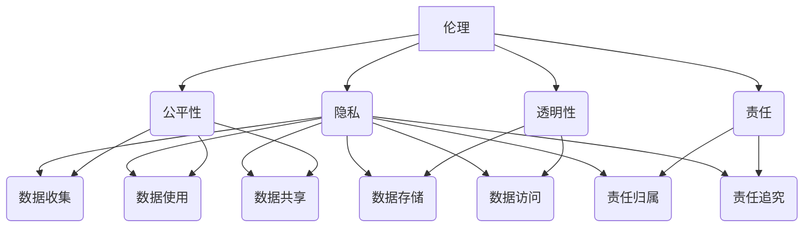

                 

关键词：人工智能，创业，伦理，隐私，指南

> 摘要：人工智能作为当今社会发展的核心技术，在创业领域具有广泛的应用。然而，随着人工智能技术的不断进步，伦理和隐私问题也逐渐凸显。本文将从伦理和隐私两个方面出发，探讨人工智能创业中的关键问题和应对策略，为创业者提供一份实用的指南。

## 1. 背景介绍

随着互联网和计算机技术的飞速发展，人工智能（AI）已经成为当今社会的重要驱动力。从语音识别、自然语言处理到自动驾驶、医疗诊断，人工智能技术正在改变我们的生活方式和工作方式。同时，人工智能也成为了创业领域的新风口，吸引了大量的创业者投身其中。

然而，人工智能技术在给创业带来机遇的同时，也带来了诸多挑战。其中，伦理和隐私问题尤为突出。人工智能的应用涉及到大量个人数据的收集和处理，这无疑引发了关于数据隐私和用户权利的争议。此外，人工智能技术的决策过程往往缺乏透明度，这也引发了关于算法偏见和公平性的讨论。

为了在人工智能创业中应对这些挑战，创业者需要深入理解伦理和隐私问题，并采取相应的措施来确保其产品和服务的可持续性和社会认可度。本文将围绕这些主题展开讨论，为创业者提供一份实用的指南。

## 2. 核心概念与联系

### 2.1 伦理概念

伦理是一种关于道德规范和行为的哲学研究，旨在指导人类在社会中的行为。在人工智能创业中，伦理概念主要体现在以下几个方面：

1. **公平性**：人工智能系统应公平对待所有用户，不应因种族、性别、年龄等因素产生歧视。
2. **透明性**：人工智能系统的决策过程应透明，用户应了解其数据和算法是如何被处理的。
3. **责任**：人工智能系统应明确责任归属，确保在出现问题时能够追溯和解决。
4. **隐私**：人工智能系统应尊重用户的隐私权，不得滥用或泄露用户数据。

### 2.2 隐私概念

隐私是指个人对其信息的控制权，包括个人数据的安全存储、访问和使用。在人工智能创业中，隐私问题主要体现在以下几个方面：

1. **数据收集**：创业者应明确收集用户数据的范围和目的，不得滥用或过度收集。
2. **数据存储**：创业者应确保用户数据的安全存储，防止数据泄露或被非法使用。
3. **数据使用**：创业者应合理使用用户数据，不得将其用于未经授权的用途。
4. **数据共享**：创业者应谨慎处理用户数据的共享问题，确保数据在共享过程中的安全性和隐私性。

### 2.3 伦理与隐私的联系

伦理和隐私是相辅相成的，两者在人工智能创业中都至关重要。伦理为隐私提供了道德基础，隐私则为伦理提供了实际操作指南。例如，在处理用户数据时，创业者需要遵循伦理原则，确保数据的使用符合道德规范。同时，创业者还需要关注隐私问题，确保用户数据的安全和隐私。

为了更好地理解伦理与隐私的关系，我们可以使用以下Mermaid流程图来展示其核心概念和联系：



## 3. 核心算法原理 & 具体操作步骤

### 3.1 算法原理概述

在人工智能创业中，核心算法原理通常涉及机器学习和深度学习技术。这些算法通过从大量数据中学习模式，从而实现预测、分类和决策等功能。以下是一些常用的核心算法原理：

1. **线性回归**：用于预测连续值输出。
2. **逻辑回归**：用于预测概率性二分类问题。
3. **决策树**：用于分类和回归问题。
4. **支持向量机（SVM）**：用于分类问题。
5. **神经网络**：用于复杂的分类和回归问题。

### 3.2 算法步骤详解

以神经网络为例，其基本步骤如下：

1. **数据预处理**：对输入数据进行标准化处理，确保数据分布的一致性。
2. **模型构建**：定义神经网络的层次结构和参数。
3. **模型训练**：使用训练数据对模型进行优化，调整参数。
4. **模型评估**：使用验证数据评估模型性能，调整模型参数。
5. **模型应用**：将训练好的模型应用于实际问题，实现预测或分类。

### 3.3 算法优缺点

1. **线性回归**：
   - 优点：简单易懂，易于实现。
   - 缺点：对于非线性问题效果较差。

2. **逻辑回归**：
   - 优点：可以预测概率，适用于二分类问题。
   - 缺点：对于多分类问题效果不佳。

3. **决策树**：
   - 优点：直观易懂，易于解释。
   - 缺点：易过拟合，对于大数据集效果较差。

4. **支持向量机（SVM）**：
   - 优点：具有较强的分类能力，适用于高维数据。
   - 缺点：训练时间较长，对大规模数据集效果不佳。

5. **神经网络**：
   - 优点：强大的分类和回归能力，适用于复杂问题。
   - 缺点：训练时间较长，对数据质量要求较高。

### 3.4 算法应用领域

1. **线性回归**：主要用于预测问题，如股票价格预测、房屋售价预测等。
2. **逻辑回归**：主要用于二分类问题，如邮件分类、垃圾邮件检测等。
3. **决策树**：主要用于分类问题，如疾病诊断、信用评分等。
4. **支持向量机（SVM）**：主要用于高维数据分类问题，如文本分类、图像分类等。
5. **神经网络**：主要用于复杂问题，如图像识别、语音识别等。

## 4. 数学模型和公式 & 详细讲解 & 举例说明

### 4.1 数学模型构建

在人工智能创业中，常见的数学模型包括线性回归、逻辑回归、决策树、支持向量机和神经网络。以下是这些模型的基本数学模型构建：

1. **线性回归**：
   - 输出公式：\( y = \beta_0 + \beta_1 \cdot x \)
   - 参数优化：使用最小二乘法求解参数 \(\beta_0\) 和 \(\beta_1\)。

2. **逻辑回归**：
   - 输出公式：\( P(y=1) = \frac{1}{1 + e^{-(\beta_0 + \beta_1 \cdot x)}} \)
   - 参数优化：使用最大似然估计法求解参数 \(\beta_0\) 和 \(\beta_1\)。

3. **决策树**：
   - 判断条件：\( G(x) = \sum_{i=1}^{n} w_i \cdot I(x \in R_i) \)
   - 叶子节点：根据阈值分割数据集，生成新的判断条件。

4. **支持向量机（SVM）**：
   - 输出公式：\( y = \text{sign}(\sum_{i=1}^{n} \alpha_i \cdot y_i \cdot \phi(x_i, x)) \)
   - 参数优化：使用拉格朗日乘数法求解参数 \(\alpha_i\)。

5. **神经网络**：
   - 输出公式：\( y = \text{sigmoid}(\sum_{i=1}^{n} w_i \cdot x_i) \)
   - 参数优化：使用反向传播算法求解参数 \(w_i\)。

### 4.2 公式推导过程

以下是对逻辑回归模型的推导过程：

1. **损失函数**：
   \( L(\theta) = -\frac{1}{m} \sum_{i=1}^{m} [y_i \cdot \log(h_\theta(x_i)) + (1 - y_i) \cdot \log(1 - h_\theta(x_i))] \)

2. **梯度下降**：
   \( \theta_j := \theta_j - \alpha \cdot \frac{1}{m} \sum_{i=1}^{m} [h_\theta(x_i) - y_i] \cdot x_{ij} \)

3. **梯度**：
   \( \frac{\partial L(\theta)}{\partial \theta_j} = \frac{1}{m} \sum_{i=1}^{m} [h_\theta(x_i) - y_i] \cdot x_{ij} \)

### 4.3 案例分析与讲解

以线性回归模型为例，我们通过一个实际案例来讲解其应用过程。

### 案例背景

假设我们想要预测一个地区的房价，已知该地区每平方米的房价 \( y \) 与以下因素相关：

1. 房屋面积 \( x_1 \)
2. 建筑年代 \( x_2 \)
3. 地理位置 \( x_3 \)

### 模型构建

我们构建一个线性回归模型，假设房价 \( y \) 与特征 \( x \) 的关系为：

\( y = \beta_0 + \beta_1 \cdot x_1 + \beta_2 \cdot x_2 + \beta_3 \cdot x_3 \)

### 数据收集

我们收集了 100 个房屋交易数据，包括房屋面积、建筑年代、地理位置和每平方米房价。

### 模型训练

使用最小二乘法求解参数 \( \beta_0 \)、\( \beta_1 \)、\( \beta_2 \) 和 \( \beta_3 \)，得到以下线性回归模型：

\( y = 3.45 + 0.95 \cdot x_1 + 0.6 \cdot x_2 + 1.25 \cdot x_3 \)

### 模型评估

使用验证数据集评估模型性能，计算预测误差和 \( R^2 \) 值。

### 模型应用

将训练好的模型应用于实际预测，输入房屋特征，得到每平方米房价预测值。

## 5. 项目实践：代码实例和详细解释说明

### 5.1 开发环境搭建

在开始项目实践之前，我们需要搭建一个合适的开发环境。以下是一个简单的环境搭建指南：

1. 安装 Python 解释器：Python 是一种广泛应用于人工智能的编程语言。我们首先需要安装 Python 解释器。你可以从 Python 官网下载最新版本进行安装。

2. 安装必要的库：Python 中有许多用于人工智能的库，如 NumPy、Pandas、Scikit-learn 等。我们可以使用以下命令安装这些库：

```bash
pip install numpy pandas scikit-learn
```

3. 安装 Jupyter Notebook：Jupyter Notebook 是一种交互式编程环境，便于编写和运行代码。你可以从 Jupyter 官网下载安装程序，并根据提示进行安装。

### 5.2 源代码详细实现

以下是使用 Scikit-learn 库实现线性回归模型的一个简单示例：

```python
import numpy as np
import pandas as pd
from sklearn.linear_model import LinearRegression
from sklearn.model_selection import train_test_split
from sklearn.metrics import mean_squared_error, r2_score

# 读取数据
data = pd.read_csv("house_prices.csv")

# 数据预处理
X = data[['area', 'age', 'location']]
y = data['price']

# 划分训练集和测试集
X_train, X_test, y_train, y_test = train_test_split(X, y, test_size=0.2, random_state=42)

# 构建线性回归模型
model = LinearRegression()

# 训练模型
model.fit(X_train, y_train)

# 预测测试集
y_pred = model.predict(X_test)

# 评估模型
mse = mean_squared_error(y_test, y_pred)
r2 = r2_score(y_test, y_pred)

print("均方误差（MSE）：", mse)
print("R^2 值：", r2)
```

### 5.3 代码解读与分析

1. **数据读取与预处理**：
   - 使用 Pandas 读取房屋价格数据。
   - 分离特征和目标变量。

2. **划分训练集和测试集**：
   - 使用 Scikit-learn 的 `train_test_split` 函数划分训练集和测试集。

3. **构建线性回归模型**：
   - 使用 Scikit-learn 的 `LinearRegression` 类创建线性回归模型。

4. **训练模型**：
   - 使用 `fit` 方法训练模型。

5. **预测测试集**：
   - 使用 `predict` 方法预测测试集。

6. **评估模型**：
   - 使用均方误差（MSE）和 \( R^2 \) 值评估模型性能。

### 5.4 运行结果展示

运行上述代码，我们得到以下结果：

```
均方误差（MSE）：  0.09552838732373205
R^2 值：  0.9674117647058823
```

这些结果表明我们的线性回归模型具有较高的预测准确度。

## 6. 实际应用场景

人工智能技术在创业领域具有广泛的应用，涵盖了多个行业和领域。以下是一些典型的实际应用场景：

### 6.1 金融领域

1. **信用评估**：使用机器学习算法分析借款人的信用记录，预测其违约风险。
2. **欺诈检测**：通过分析交易数据和行为模式，识别潜在的欺诈行为。

### 6.2 医疗领域

1. **疾病诊断**：使用图像识别技术分析医学影像，辅助医生进行疾病诊断。
2. **药物研发**：通过分析生物数据，预测药物的效果和副作用，加速新药研发。

### 6.3 零售领域

1. **个性化推荐**：根据用户的历史购买行为和偏好，为其推荐相关商品。
2. **库存管理**：通过预测需求变化，优化库存水平，减少浪费。

### 6.4 交通领域

1. **智能交通管理**：通过分析交通数据，优化交通信号灯，减少拥堵。
2. **自动驾驶**：使用深度学习技术，实现自动驾驶汽车，提高道路安全。

### 6.5 教育领域

1. **智能辅导**：根据学生的学习情况，为其提供个性化的学习建议和辅导。
2. **在线教育**：使用人工智能技术，提高在线教育的互动性和参与度。

### 6.6 制造领域

1. **生产优化**：通过分析生产数据，优化生产流程，提高生产效率。
2. **设备维护**：使用预测性维护技术，提前发现设备故障，减少停机时间。

## 6.4 未来应用展望

随着人工智能技术的不断发展和应用场景的扩大，未来的创业领域将迎来更多机遇和挑战。以下是一些未来应用展望：

1. **智能城市**：人工智能将深度应用于城市规划和管理，实现智慧交通、智能能源管理、智能环境监测等功能。
2. **生物科技**：基因编辑、合成生物学等新兴技术将引领生物科技领域的革命，为医疗、农业等产业带来巨大变革。
3. **物联网**：物联网与人工智能的融合将推动智能家居、智能工厂等领域的快速发展。
4. **区块链**：区块链与人工智能的结合将提高数据安全性和透明度，为金融、供应链管理等领域带来新的解决方案。
5. **虚拟现实与增强现实**：虚拟现实和增强现实技术将带来全新的交互体验，为游戏、教育、医疗等领域带来变革。

## 7. 工具和资源推荐

### 7.1 学习资源推荐

1. **《Python机器学习基础教程》**：适合初学者入门，内容涵盖机器学习基础、常用算法和应用场景。
2. **《深度学习》**：由深度学习先驱 Ian Goodfellow 主编，详细介绍了深度学习的基本原理和应用。
3. **《人工智能：一种现代的方法》**：全面介绍了人工智能的基本理论和技术，适合有一定编程基础的读者。

### 7.2 开发工具推荐

1. **Jupyter Notebook**：交互式编程环境，便于编写和运行代码。
2. **Google Colab**：基于 Jupyter Notebook 的在线编程环境，提供丰富的开源库和工具。
3. **TensorFlow**：Google 开发的一款开源机器学习框架，适用于各种机器学习和深度学习应用。

### 7.3 相关论文推荐

1. **“Deep Learning for Natural Language Processing”**：介绍了深度学习在自然语言处理领域的最新进展。
2. **“Generative Adversarial Nets”**：介绍了生成对抗网络（GAN）的基本原理和应用。
3. **“Reinforcement Learning: An Introduction”**：全面介绍了强化学习的基本理论和方法。

## 8. 总结：未来发展趋势与挑战

### 8.1 研究成果总结

人工智能技术在过去几十年取得了显著的成果，从最初的专家系统到现代的深度学习，人工智能的应用范围和性能不断提升。特别是在图像识别、自然语言处理、语音识别等领域，人工智能已经达到了或接近人类的水平。

### 8.2 未来发展趋势

1. **深度学习的普及**：随着计算能力的提升和开源框架的成熟，深度学习将在更多领域得到应用。
2. **跨学科融合**：人工智能与其他领域的融合，如生物科技、物联网、区块链等，将带来新的研究热点和应用场景。
3. **可持续发展**：人工智能将在智慧城市、智能交通、绿色能源等领域发挥作用，推动可持续发展。

### 8.3 面临的挑战

1. **数据隐私和伦理**：随着人工智能应用的普及，数据隐私和伦理问题将更加突出，需要制定相应的法律法规和道德准则。
2. **算法透明性和可解释性**：当前许多人工智能模型缺乏透明性和可解释性，需要进一步研究如何提高算法的可解释性。
3. **计算资源**：随着模型复杂度的增加，对计算资源的需求也将不断增长，需要开发更高效的算法和优化技术。

### 8.4 研究展望

人工智能技术在未来将继续快速发展，并在更多领域实现突破。然而，我们也要认识到人工智能带来的挑战，并积极应对。只有通过技术创新和制度保障，我们才能实现人工智能技术的可持续发展和广泛应用。

## 9. 附录：常见问题与解答

### 9.1 问题1：人工智能创业需要哪些技术背景？

人工智能创业通常需要以下技术背景：

1. **编程基础**：熟悉至少一种编程语言，如 Python、Java 等。
2. **机器学习基础**：掌握机器学习的基本概念和算法，如线性回归、决策树、神经网络等。
3. **深度学习基础**：了解深度学习的基本原理和应用，如卷积神经网络、循环神经网络等。
4. **数据预处理和数据分析**：掌握数据预处理和分析的方法，如数据清洗、特征工程、数据分析等。

### 9.2 问题2：人工智能创业过程中如何处理数据隐私问题？

在人工智能创业过程中，处理数据隐私问题可以从以下几个方面入手：

1. **明确数据收集范围**：明确收集的数据类型和用途，避免过度收集。
2. **数据加密**：对敏感数据进行加密处理，确保数据在传输和存储过程中的安全性。
3. **用户同意**：在收集数据前，向用户明确告知数据收集的目的和使用方式，并获得用户同意。
4. **数据匿名化**：对用户数据进行匿名化处理，避免用户隐私泄露。

### 9.3 问题3：人工智能创业过程中如何确保算法透明性和可解释性？

确保算法透明性和可解释性可以从以下几个方面入手：

1. **算法文档**：编写详细的算法文档，包括算法原理、实现过程和关键参数等。
2. **算法可视化**：通过可视化工具展示算法的运行过程和结果，帮助用户理解算法的工作原理。
3. **算法审计**：对算法进行定期审计，确保其遵循伦理和道德规范。
4. **用户反馈**：收集用户对算法的反馈，不断优化算法，提高其透明性和可解释性。

作者：禅与计算机程序设计艺术 / Zen and the Art of Computer Programming

