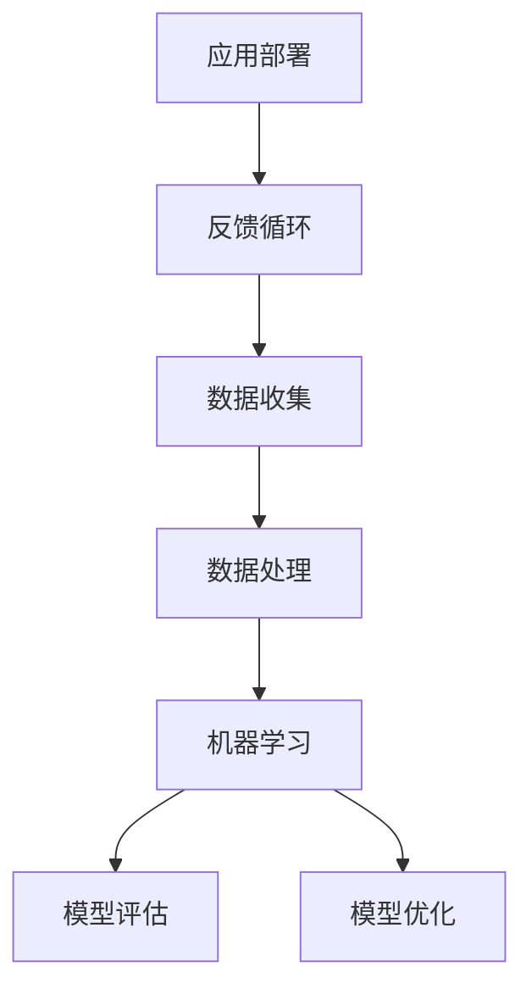

                 

关键词：人工智能创业、技术前沿、创新策略、持续学习、商业模式、技术优势

人工智能（AI）正迅速改变着全球各行各业，其潜力和影响力不容小觑。在这个背景下，许多创业者纷纷投身于人工智能领域，试图抓住这场科技革命的机遇。然而，要想在这个充满竞争的市场中脱颖而出，保持技术前沿成为了一项关键任务。本文将探讨人工智能创业者如何在不断变化的技术环境中保持领先地位，实现可持续发展的策略。

## 1. 背景介绍

人工智能领域的发展经历了多个阶段，从最初的规则基础方法，到基于统计学和机器学习的模型，再到如今的深度学习和神经网络。随着计算能力的提升和大数据的普及，人工智能的应用范围不断扩大，从简单的自动化任务到复杂的决策支持系统，无所不能。

在这个快速发展的领域，技术更新换代的速度非常快，新的算法、框架和工具层出不穷。创业者如果不紧跟技术潮流，很快就会被市场淘汰。因此，保持技术前沿成为人工智能创业的核心目标之一。

## 2. 核心概念与联系

在人工智能创业中，核心概念和联系是理解技术前沿的基础。以下是一个简化的 Mermaid 流程图，用于描述这些核心概念和它们之间的联系：



### 2.1 数据收集

数据是人工智能的基石。有效的数据收集是确保模型性能的关键。创业者需要关注数据的质量、多样性和实时性，以确保模型能够适应不断变化的环境。

### 2.2 数据处理

数据处理包括数据清洗、归一化和特征提取等步骤。这一阶段的质量直接影响机器学习模型的训练效果。

### 2.3 机器学习

机器学习是人工智能的核心技术。创业者需要了解不同的机器学习算法，如监督学习、无监督学习和强化学习，并选择最适合其应用场景的方法。

### 2.4 模型评估

模型评估是确保模型性能的重要步骤。创业者需要使用交叉验证、A/B 测试等方法来评估模型的泛化能力。

### 2.5 模型优化

模型优化包括超参数调整、模型剪枝和迁移学习等。创业者需要持续优化模型，以适应不同的应用场景。

### 2.6 应用部署

应用部署是将模型转化为实际应用的关键步骤。创业者需要考虑模型的可扩展性、可靠性和安全性。

### 2.7 反馈循环

反馈循环是人工智能系统持续改进的关键。创业者需要建立反馈机制，收集用户反馈，以不断优化产品。

## 3. 核心算法原理 & 具体操作步骤

### 3.1 算法原理概述

人工智能创业中常用的核心算法包括深度学习、强化学习和生成对抗网络（GAN）等。以下是一个简要的概述：

- **深度学习**：通过多层神经网络进行特征学习和模式识别。
- **强化学习**：通过试错和奖励机制来学习最优策略。
- **GAN**：通过生成器和判别器的对抗训练来生成逼真的数据。

### 3.2 算法步骤详解

- **深度学习**：

  1. 数据预处理
  2. 构建神经网络模型
  3. 训练模型
  4. 模型评估
  5. 模型优化

- **强化学习**：

  1. 确定环境
  2. 构建代理模型
  3. 进行策略迭代
  4. 收集数据
  5. 更新模型

- **GAN**：

  1. 构建生成器和判别器
  2. 定义损失函数
  3. 训练生成器和判别器
  4. 生成数据
  5. 评估生成质量

### 3.3 算法优缺点

- **深度学习**：

  - 优点：强大的特征学习和模式识别能力。

  - 缺点：需要大量的数据和计算资源，模型复杂度高。

- **强化学习**：

  - 优点：适用于复杂环境，能够自适应学习。

  - 缺点：训练过程可能非常耗时，对环境有较强的依赖。

- **GAN**：

  - 优点：能够生成高质量的图像和语音。

  - 缺点：训练过程不稳定，模型难以理解。

### 3.4 算法应用领域

- **深度学习**：计算机视觉、自然语言处理、语音识别等。

- **强化学习**：游戏AI、自动驾驶、推荐系统等。

- **GAN**：图像生成、数据增强、风格迁移等。

## 4. 数学模型和公式 & 详细讲解 & 举例说明

### 4.1 数学模型构建

在人工智能创业中，常见的数学模型包括线性回归、逻辑回归、神经网络等。以下是一个简单的线性回归模型：

$$
y = \beta_0 + \beta_1 x
$$

### 4.2 公式推导过程

线性回归模型的推导基于最小二乘法，目标是找到最佳的拟合直线。具体步骤如下：

1. 构建损失函数：
$$
J(\theta) = \frac{1}{2m} \sum_{i=1}^{m} (h_\theta(x^{(i)}) - y^{(i)})^2
$$
其中，$h_\theta(x) = \theta_0 + \theta_1 x$。

2. 求导并设置导数为0：
$$
\frac{\partial J(\theta)}{\partial \theta_0} = 0, \quad \frac{\partial J(\theta)}{\partial \theta_1} = 0
$$

3. 解方程得到最优参数：
$$
\theta_0 = \frac{1}{m} \sum_{i=1}^{m} (y^{(i)} - \theta_1 x^{(i)}), \quad \theta_1 = \frac{1}{m} \sum_{i=1}^{m} (x^{(i)} (y^{(i)} - \theta_1 x^{(i)})
$$

### 4.3 案例分析与讲解

假设我们有一个简单的线性回归问题，预测房价。给定一组数据，我们可以使用上述线性回归模型进行拟合。以下是一个简单的 Python 实现：

```python
import numpy as np

# 数据集
X = np.array([[1, 2], [2, 3], [3, 4]])
y = np.array([3, 4, 5])

# 最小二乘法求解
theta = np.linalg.inv(X.T @ X) @ X.T @ y

# 模型预测
y_pred = theta[0] + theta[1] * X

print("Predicted values:", y_pred)
```

运行上述代码，我们可以得到预测的房价。通过对比预测值和实际值，我们可以评估模型的性能。

## 5. 项目实践：代码实例和详细解释说明

### 5.1 开发环境搭建

在开始项目实践之前，我们需要搭建一个适合人工智能开发的Python环境。以下是一个基本的步骤：

1. 安装Python（建议使用Python 3.8以上版本）。
2. 安装必要的库，如NumPy、Pandas、Scikit-learn等。
3. 设置Jupyter Notebook，以便进行交互式编程。

### 5.2 源代码详细实现

以下是一个简单的线性回归项目的代码实现：

```python
import numpy as np
from sklearn.model_selection import train_test_split
from sklearn.metrics import mean_squared_error

# 数据集
X = np.array([[1, 2], [2, 3], [3, 4]])
y = np.array([3, 4, 5])

# 数据预处理
X = np.hstack((np.ones((X.shape[0], 1)), X))
X_train, X_test, y_train, y_test = train_test_split(X, y, test_size=0.2, random_state=42)

# 最小二乘法求解
theta = np.linalg.inv(X_train.T @ X_train) @ X_train.T @ y_train

# 模型预测
y_pred = X_test @ theta

# 模型评估
mse = mean_squared_error(y_test, y_pred)
print("MSE:", mse)

# 可视化
import matplotlib.pyplot as plt

plt.scatter(X_train[:, 1], y_train)
plt.plot(X_train[:, 1], X_train @ theta, color='red')
plt.xlabel("x")
plt.ylabel("y")
plt.show()
```

### 5.3 代码解读与分析

上述代码实现了线性回归的基本流程：

1. **数据集**：使用一个简单的二维数据集。
2. **数据预处理**：将输入特征添加偏置项，并将数据集分为训练集和测试集。
3. **最小二乘法求解**：使用 NumPy 库中的 linalg.inv 方法求解最佳参数。
4. **模型预测**：使用训练好的模型对测试集进行预测。
5. **模型评估**：计算均方误差（MSE）来评估模型性能。
6. **可视化**：绘制训练数据和拟合直线。

通过上述代码，我们可以直观地看到线性回归模型的训练过程和效果。

## 6. 实际应用场景

### 6.1 在金融领域的应用

人工智能在金融领域有着广泛的应用，包括风险控制、量化交易、信用评分等。例如，通过深度学习技术，可以对大量历史交易数据进行分析，预测市场走势，从而制定更有效的投资策略。

### 6.2 在医疗健康领域的应用

人工智能在医疗健康领域具有巨大的潜力，如疾病预测、药物研发、医疗图像分析等。通过应用机器学习算法，可以对患者数据进行深入分析，提高诊断准确率，缩短治疗周期。

### 6.3 在智能制造领域的应用

人工智能在智能制造领域可以优化生产流程、提高设备运行效率、降低维护成本。例如，通过应用强化学习算法，可以对生产设备进行智能调度，实现最优生产计划。

## 7. 工具和资源推荐

### 7.1 学习资源推荐

- 《深度学习》（Ian Goodfellow、Yoshua Bengio 和 Aaron Courville 著）
- 《Python机器学习》（Sebastian Raschka 著）
- 《强化学习：原理与Python应用》（艾瑞克·西蒙著）

### 7.2 开发工具推荐

- Jupyter Notebook：用于交互式编程和数据可视化。
- TensorFlow：用于构建和训练深度学习模型。
- PyTorch：用于构建和训练深度学习模型。

### 7.3 相关论文推荐

- "Deep Learning" (Ian Goodfellow)
- "Reinforcement Learning: An Introduction" (Richard S. Sutton and Andrew G. Barto)
- "Generative Adversarial Nets" (Ian J. Goodfellow et al.)

## 8. 总结：未来发展趋势与挑战

### 8.1 研究成果总结

人工智能领域的研究成果显著，包括深度学习、强化学习和生成对抗网络等技术的突破。这些研究成果为人工智能创业提供了丰富的技术基础。

### 8.2 未来发展趋势

随着计算能力的提升和数据的不断积累，人工智能技术将在更多领域得到应用，如自动驾驶、智能医疗、智能家居等。同时，跨学科融合将推动人工智能技术的进一步发展。

### 8.3 面临的挑战

人工智能创业面临诸多挑战，包括数据隐私、算法透明性、模型可解释性等。此外，技术更新换代速度快，创业者需要不断学习和适应新技术。

### 8.4 研究展望

未来，人工智能创业将朝着更智能化、更高效、更安全的方向发展。通过深入研究，创业者将能够开发出更具竞争力的产品和服务，推动人工智能技术的广泛应用。

## 9. 附录：常见问题与解答

### Q：如何快速入门人工智能？

A：建议从基础算法开始学习，如线性回归、决策树、神经网络等。同时，实践是检验学习成果的重要手段，可以通过在线课程、开源项目等方式进行实践。

### Q：如何评估人工智能项目的风险？

A：可以从技术风险、市场风险、法律风险等多个方面进行评估。技术风险主要关注算法的有效性和可靠性，市场风险主要关注市场需求和竞争状况，法律风险主要关注数据隐私和知识产权等问题。

### Q：如何构建可持续的人工智能商业模式？

A：可以从产品定位、用户需求、盈利模式等多个方面进行思考。例如，通过提供定制化解决方案、数据分析服务等方式实现盈利，同时关注用户隐私和数据安全，建立长期信任关系。

---

作者：禅与计算机程序设计艺术 / Zen and the Art of Computer Programming

