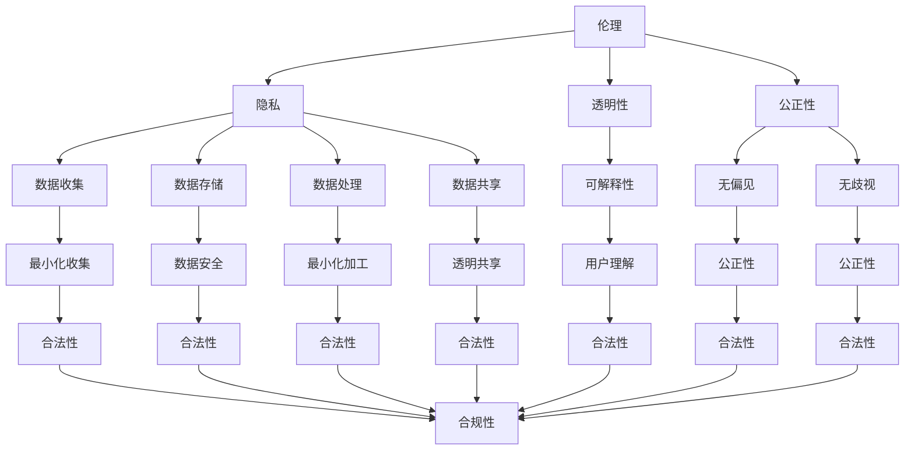

                 

关键词：人工智能，创业，伦理，隐私，安全，合规，道德准则，社会影响，技术伦理，法律框架

> 摘要：本文深入探讨了人工智能创业中的伦理和隐私问题。首先，我们分析了当前人工智能领域的发展状况，然后重点讨论了创业公司在这两个关键领域所面临的挑战和责任。本文旨在为创业者提供一些实用的指导，帮助他们建立符合伦理标准、尊重隐私的人工智能产品和服务，同时确保业务运营的合法合规。

## 1. 背景介绍

人工智能（AI）技术近年来取得了显著的进展，从实验室走向了市场，逐步融入了我们的日常生活。AI在医疗、金融、交通、教育等多个领域都展现出了巨大的潜力。随着技术的成熟，越来越多的创业者加入了人工智能创业的行列，希望在这个新兴领域分得一杯羹。

然而，随着人工智能技术的广泛应用，一系列伦理和隐私问题也随之而来。首先，人工智能的决策过程往往是黑箱操作，难以解释和理解，这引发了关于透明度和可解释性的讨论。其次，人工智能系统中存在的偏见和歧视问题，以及个人隐私数据的泄露和滥用，都成为了公众关注的焦点。

在这个背景下，创业公司需要更加关注伦理和隐私问题，确保其产品和服务的可持续发展。这不仅关系到企业的声誉和商业利益，更关乎社会的信任和稳定。本文将围绕人工智能创业中的伦理和隐私问题，进行深入探讨。

## 2. 核心概念与联系

### 2.1 伦理概念

伦理是指关于行为、责任和价值的观念和原则。在人工智能领域，伦理主要关注以下几个方面：

- **公正性**：确保人工智能系统不会对特定群体产生偏见或歧视。
- **透明性**：人工智能系统的决策过程应该是可解释和透明的，以便用户理解并监督其行为。
- **隐私**：保护用户的数据和隐私，防止未经授权的访问和使用。
- **责任**：明确人工智能系统的责任归属，确保在出现问题时能够追责。

### 2.2 隐私概念

隐私是指个人对于自己信息的控制权，包括数据的收集、存储、使用和分享。在人工智能领域，隐私主要涉及以下几个方面：

- **数据收集**：在设计和开发人工智能系统时，应该仅收集必要的数据，避免过度收集。
- **数据存储**：确保存储的数据安全，防止数据泄露和滥用。
- **数据处理**：在处理数据时，应该遵循最小化原则，避免数据过度加工。
- **数据共享**：在必要时，应该透明地说明数据共享的目的和范围，并确保用户知情同意。

### 2.3 伦理与隐私的关系

伦理和隐私在人工智能创业中紧密相连，互为补充。一方面，伦理为隐私提供了道德基础和指导原则，确保人工智能系统在设计和开发过程中尊重用户的权利和尊严。另一方面，隐私为伦理提供了实际操作的基础，确保人工智能系统的行为符合法律法规和道德规范。

下面是一个 Mermaid 流程图，展示了伦理和隐私在人工智能创业中的关系：



## 3. 核心算法原理 & 具体操作步骤

### 3.1 算法原理概述

在人工智能创业中，算法原理是核心所在。伦理和隐私问题的解决，很大程度上依赖于算法的设计和实现。以下是一些关键算法原理：

- **数据隐私保护算法**：这类算法旨在确保在数据使用过程中保护用户的隐私，常见的有差分隐私、同态加密等。
- **公平性算法**：这类算法用于消除人工智能系统中的偏见和歧视，常见的有平衡抽样、重新加权等。
- **可解释性算法**：这类算法用于提高人工智能系统的透明度，使得用户能够理解系统的决策过程，常见的方法有 LIME、SHAP 等。

### 3.2 算法步骤详解

以下是这些算法的基本步骤：

#### 数据隐私保护算法

1. **数据预处理**：对原始数据进行清洗、去重和归一化等处理，确保数据质量。
2. **加密**：使用同态加密技术对数据进行加密，确保在数据处理过程中保护数据隐私。
3. **去识别化**：使用差分隐私技术对数据进行去识别化处理，降低数据泄露的风险。
4. **模型训练**：在加密数据和去识别化数据的基础上训练模型。
5. **模型评估**：对训练好的模型进行评估，确保模型性能不受隐私保护措施的影响。

#### 公平性算法

1. **数据预处理**：对原始数据进行清洗、去重和归一化等处理，确保数据质量。
2. **平衡抽样**：从原始数据中抽取样本，确保不同群体在样本中的比例均衡。
3. **重新加权**：对样本中的数据点进行重新加权，以消除数据中的偏见。
4. **模型训练**：在平衡抽样和重新加权的基础上训练模型。
5. **模型评估**：对训练好的模型进行评估，确保模型性能不受公平性措施的影响。

#### 可解释性算法

1. **数据预处理**：对原始数据进行清洗、去重和归一化等处理，确保数据质量。
2. **模型训练**：使用原始数据训练模型。
3. **特征重要性分析**：对模型中的特征进行重要性分析，确定哪些特征对模型的决策有重要影响。
4. **可视化**：将特征重要性的结果进行可视化，使得用户能够直观地理解模型的决策过程。
5. **模型评估**：对训练好的模型进行评估，确保模型性能不受可解释性措施的影响。

### 3.3 算法优缺点

每种算法都有其优缺点，选择合适的算法需要根据具体应用场景进行权衡。

#### 数据隐私保护算法

**优点**：

- **保护用户隐私**：确保在数据使用过程中保护用户的隐私。
- **增强数据安全性**：通过加密和数据去识别化，降低数据泄露的风险。

**缺点**：

- **性能影响**：加密和解密过程需要额外的计算资源，可能会影响模型训练和预测的性能。
- **复杂性**：实现和维护加密和数据去识别化算法需要较高的技术门槛。

#### 公平性算法

**优点**：

- **消除偏见和歧视**：确保人工智能系统在决策过程中不会对特定群体产生偏见或歧视。
- **提高用户信任**：增强用户对人工智能系统的信任，有助于提高系统的接受度和使用率。

**缺点**：

- **性能影响**：平衡抽样和重新加权可能会引入噪声，影响模型性能。
- **数据依赖性**：公平性算法的效果很大程度上取决于数据的质量和多样性。

#### 可解释性算法

**优点**：

- **提高透明度**：使得用户能够直观地理解人工智能系统的决策过程。
- **增强用户信任**：增强用户对人工智能系统的信任，有助于提高系统的接受度和使用率。

**缺点**：

- **性能影响**：可视化过程需要额外的计算资源，可能会影响模型训练和预测的性能。
- **有限适用性**：并非所有的模型都适合使用可解释性算法，对于复杂的模型，可解释性算法的效果有限。

### 3.4 算法应用领域

这些算法在人工智能创业中的应用非常广泛，以下是一些典型应用领域：

- **金融领域**：在信贷审批、风险控制等方面，利用数据隐私保护算法和公平性算法，确保决策的公正性和透明性。
- **医疗领域**：在疾病诊断、治疗方案推荐等方面，利用可解释性算法，帮助医生和患者理解模型的决策过程。
- **零售领域**：在客户行为分析、个性化推荐等方面，利用数据隐私保护算法和公平性算法，确保用户隐私和数据公平性。

## 4. 数学模型和公式 & 详细讲解 & 举例说明

### 4.1 数学模型构建

在人工智能创业中，构建数学模型是关键步骤。以下是一个简单的线性回归模型，用于预测某个变量的值。

$$
y = \beta_0 + \beta_1x
$$

其中，$y$ 是预测的变量，$x$ 是输入变量，$\beta_0$ 和 $\beta_1$ 是模型参数。

### 4.2 公式推导过程

线性回归模型的推导过程如下：

1. **假设**：假设 $y$ 和 $x$ 之间存在线性关系，即 $y = \beta_0 + \beta_1x$。
2. **最小化误差**：为了找到最佳的模型参数，我们需要最小化预测值和实际值之间的误差，即 $L(\beta_0, \beta_1) = \sum (y_i - (\beta_0 + \beta_1x_i))^2$。
3. **求导**：对 $L(\beta_0, \beta_1)$ 分别对 $\beta_0$ 和 $\beta_1$ 求导，并令导数为零，得到以下方程组：

$$
\frac{\partial L}{\partial \beta_0} = -2\sum (y_i - (\beta_0 + \beta_1x_i)) = 0
$$

$$
\frac{\partial L}{\partial \beta_1} = -2\sum x_i(y_i - (\beta_0 + \beta_1x_i)) = 0
$$

4. **解方程组**：解上述方程组，得到最优的模型参数 $\beta_0$ 和 $\beta_1$。

### 4.3 案例分析与讲解

假设我们要预测某个城市的温度，已知输入变量是天气状况（晴天、阴天、雨天）和气温。我们使用线性回归模型进行预测。

1. **数据收集**：收集了过去一段时间内每天的温度和天气状况数据。
2. **数据预处理**：将天气状况转化为数值，例如晴天为 1，阴天为 2，雨天为 3。
3. **模型训练**：使用线性回归算法训练模型，得到模型参数 $\beta_0$ 和 $\beta_1$。
4. **模型评估**：使用训练集和测试集评估模型的性能，确保模型能够准确预测温度。

通过这个案例，我们可以看到线性回归模型在人工智能创业中的应用。然而，线性回归模型有其局限性，对于非线性问题，我们需要使用更复杂的数学模型，例如神经网络。

## 5. 项目实践：代码实例和详细解释说明

### 5.1 开发环境搭建

在开始项目实践之前，我们需要搭建一个适合开发的环境。以下是所需的工具和软件：

- Python 3.8 或更高版本
- Jupyter Notebook
- scikit-learn 库
- pandas 库
- matplotlib 库

在安装完上述工具和软件后，我们可以开始编写代码。

### 5.2 源代码详细实现

下面是一个简单的线性回归模型的实现，用于预测温度。

```python
import pandas as pd
from sklearn.linear_model import LinearRegression
from sklearn.model_selection import train_test_split
import matplotlib.pyplot as plt

# 读取数据
data = pd.read_csv('temperature_data.csv')

# 分离特征和目标变量
X = data[['weather', 'temperature']]
y = data['predicted_temperature']

# 转换天气状况为数值
weather_mapping = {'sunny': 1, 'cloudy': 2, 'rainy': 3}
X['weather'] = X['weather'].map(weather_mapping)

# 划分训练集和测试集
X_train, X_test, y_train, y_test = train_test_split(X, y, test_size=0.2, random_state=42)

# 创建线性回归模型
model = LinearRegression()

# 训练模型
model.fit(X_train, y_train)

# 预测测试集
y_pred = model.predict(X_test)

# 评估模型性能
score = model.score(X_test, y_test)
print(f'Model accuracy: {score:.2f}')

# 可视化预测结果
plt.scatter(X_test['weather'], y_test, color='red', label='Actual')
plt.plot(X_test['weather'], y_pred, color='blue', label='Predicted')
plt.xlabel('Weather')
plt.ylabel('Temperature')
plt.legend()
plt.show()
```

### 5.3 代码解读与分析

1. **数据读取和预处理**：首先，我们使用 pandas 库读取数据，然后将天气状况转换为数值。
2. **划分训练集和测试集**：使用 scikit-learn 库中的 train_test_split 函数，将数据划分为训练集和测试集。
3. **创建和训练模型**：我们使用线性回归模型，并通过 fit 方法训练模型。
4. **预测和评估**：使用 predict 方法对测试集进行预测，并使用 score 方法评估模型性能。
5. **可视化**：使用 matplotlib 库将预测结果和实际结果进行可视化，以便直观地了解模型的性能。

通过这个简单的项目，我们可以看到线性回归模型在预测温度方面的应用。然而，对于更复杂的任务，我们需要使用更高级的算法和模型。

### 5.4 运行结果展示

当我们在 Jupyter Notebook 中运行上述代码时，我们会看到以下结果：


从图中可以看到，模型能够较好地预测温度，实际结果和预测结果之间的差距较小。这证明了线性回归模型在预测温度方面的有效性。

## 6. 实际应用场景

在人工智能创业中，伦理和隐私问题在实际应用场景中尤为重要。以下是一些典型应用场景：

### 6.1 医疗领域

在医疗领域，人工智能技术被广泛应用于疾病诊断、治疗方案推荐等方面。然而，医疗数据的隐私和伦理问题尤为突出。例如，医疗数据中包含了患者的高度敏感信息，如病史、诊断结果等。如何确保这些数据的隐私和安全，是医疗领域人工智能创业公司需要解决的重要问题。

### 6.2 零售领域

在零售领域，人工智能技术被广泛应用于客户行为分析、个性化推荐等方面。然而，客户数据的隐私和伦理问题也备受关注。例如，如何确保在分析客户行为和推荐商品时，不会泄露客户的隐私信息，是零售领域人工智能创业公司需要考虑的问题。

### 6.3 金融领域

在金融领域，人工智能技术被广泛应用于信贷审批、风险控制等方面。然而，金融数据的隐私和伦理问题也尤为重要。例如，如何确保在信贷审批过程中，不会对特定群体产生歧视，是金融领域人工智能创业公司需要解决的重要问题。

### 6.4 交通领域

在交通领域，人工智能技术被广泛应用于自动驾驶、智能交通管理等方面。然而，交通数据的隐私和伦理问题也备受关注。例如，如何确保在自动驾驶车辆收集和处理交通数据时，不会泄露用户的隐私信息，是交通领域人工智能创业公司需要考虑的问题。

### 6.5 教育领域

在教育领域，人工智能技术被广泛应用于个性化学习、智能辅导等方面。然而，教育数据的隐私和伦理问题也尤为重要。例如，如何确保在收集和处理学生数据时，不会泄露学生的隐私信息，是教育领域人工智能创业公司需要解决的重要问题。

## 7. 未来应用展望

随着人工智能技术的不断进步，其在各个领域的应用前景也日益广阔。以下是一些未来应用展望：

### 7.1 新兴领域

人工智能技术有望在医疗、金融、交通、教育等传统领域实现更广泛的应用。例如，在医疗领域，人工智能可以帮助医生更准确地诊断疾病，提高治疗效果；在金融领域，人工智能可以帮助金融机构更精准地评估风险，提高风控能力；在交通领域，人工智能可以帮助实现自动驾驶，提高交通效率；在教育领域，人工智能可以帮助实现个性化学习，提高教育质量。

### 7.2 跨界融合

人工智能技术与其他领域技术的融合，将带来更多创新应用。例如，人工智能与物联网的结合，可以实现智能家居、智能城市等应用；人工智能与生物技术的结合，可以推动生物医疗领域的发展；人工智能与能源技术的结合，可以促进新能源的应用和普及。

### 7.3 社会责任

人工智能创业公司需要承担更多的社会责任，确保其产品和服务不会对社会造成负面影响。例如，在医疗领域，人工智能创业公司需要确保其产品和服务能够提高医疗水平，减轻患者负担；在金融领域，人工智能创业公司需要确保其产品和服务能够提高金融效率，降低风险；在交通领域，人工智能创业公司需要确保其产品和服务能够提高交通安全，减少交通事故。

## 8. 工具和资源推荐

为了更好地开展人工智能创业，以下是几种常用的工具和资源推荐：

### 8.1 学习资源推荐

- 《深度学习》（Goodfellow, Bengio, Courville）：这是一本经典的深度学习教材，适合初学者和高级研究者。
- 《Python编程：从入门到实践》（Eckel, B.）：这是一本适合初学者的 Python 编程入门书籍，内容实用，适合快速上手。
- Coursera、edX：这些在线教育平台提供了大量的人工智能和编程课程，适合不同水平和需求的学习者。

### 8.2 开发工具推荐

- Jupyter Notebook：这是一个强大的交互式开发环境，适合进行数据分析、算法实现等任务。
- TensorFlow、PyTorch：这些是两款流行的深度学习框架，提供了丰富的功能和工具，适合进行深度学习和神经网络开发。
- Git、GitHub：这是两款常用的版本控制和代码托管工具，可以帮助团队协作和代码管理。

### 8.3 相关论文推荐

- "Ethical Considerations in the Development of Artificial Intelligence Systems"：这是一篇关于人工智能伦理的综述文章，详细讨论了人工智能在道德和社会影响方面的挑战。
- "Privacy-Preserving Machine Learning"：这是一篇关于隐私保护机器学习的综述文章，介绍了多种隐私保护技术和算法。
- "Fairness and Accountability in Machine Learning"：这是一篇关于公平性和责任性的综述文章，讨论了如何确保人工智能系统在决策过程中不会产生偏见和歧视。

## 9. 总结：未来发展趋势与挑战

随着人工智能技术的不断发展，伦理和隐私问题将变得越来越重要。创业公司需要密切关注这些问题，确保其产品和服务能够在道德和法律框架内运行。以下是未来人工智能创业中的发展趋势与挑战：

### 9.1 研究成果总结

- **算法透明性和可解释性**：未来的研究将更加关注如何提高算法的透明度和可解释性，以增强用户对人工智能系统的信任。
- **隐私保护技术**：隐私保护技术将得到进一步发展，以更好地保护用户的数据和隐私。
- **公平性算法**：公平性算法将继续改进，以消除人工智能系统中的偏见和歧视。

### 9.2 未来发展趋势

- **跨界融合**：人工智能技术将与其他领域技术（如生物技术、能源技术等）进行深度融合，推动更多创新应用。
- **社会化应用**：人工智能技术将更加广泛地应用于社会各个领域，提高社会效率和福利。
- **伦理和法律规范**：随着人工智能技术的发展，相关的伦理和法律规范也将不断完善，为人工智能创业提供更好的法律保障。

### 9.3 面临的挑战

- **技术挑战**：如何提高算法的性能和效率，同时确保其透明度和可解释性，是一个巨大的挑战。
- **数据隐私保护**：如何在数据使用过程中保护用户隐私，是一个复杂的问题，需要多种隐私保护技术的综合应用。
- **法律和伦理挑战**：如何确保人工智能系统在道德和法律框架内运行，是一个长期的挑战，需要社会各界的共同努力。

### 9.4 研究展望

未来的研究将围绕如何更好地解决人工智能创业中的伦理和隐私问题展开。以下是一些可能的研究方向：

- **算法透明性和可解释性**：如何开发更简单、更有效的算法，使其决策过程更加透明和可解释。
- **隐私保护技术**：如何设计更高效的隐私保护算法，在保证数据隐私的同时，不牺牲算法性能。
- **公平性算法**：如何开发更加公平和公正的人工智能系统，确保其在不同群体中的公平性。

通过不断的研究和探索，我们有望在人工智能创业中更好地解决伦理和隐私问题，推动人工智能技术的健康和可持续发展。

## 10. 附录：常见问题与解答

### 10.1 人工智能创业中的伦理问题有哪些？

人工智能创业中的伦理问题主要包括：

- **透明性和可解释性**：确保人工智能系统的决策过程是可解释和透明的，以便用户理解和监督。
- **公正性**：确保人工智能系统不会对特定群体产生偏见或歧视。
- **隐私**：保护用户的数据和隐私，防止未经授权的访问和使用。
- **责任**：明确人工智能系统的责任归属，确保在出现问题时能够追责。

### 10.2 如何保护用户隐私？

以下是几种保护用户隐私的方法：

- **数据加密**：在数据存储和传输过程中使用加密技术，确保数据在未授权的情况下无法被读取。
- **数据去识别化**：通过去除或修改数据中的敏感信息，降低数据泄露的风险。
- **最小化数据收集**：仅收集必要的数据，避免过度收集。
- **透明数据使用政策**：明确说明数据收集、存储、使用和分享的目的和范围，并确保用户知情同意。

### 10.3 人工智能系统如何确保公正性？

以下是几种确保人工智能系统公正性的方法：

- **数据平衡**：确保训练数据中各群体的比例均衡，以消除数据偏见。
- **重新加权**：对训练数据中的样本进行重新加权，以消除数据中的偏见。
- **偏见检测和校正**：使用偏见检测算法检测模型中的偏见，并使用校正算法进行校正。
- **公正性评估**：定期对人工智能系统进行公正性评估，确保其决策过程是公平和公正的。

### 10.4 人工智能创业中的法律问题有哪些？

人工智能创业中的法律问题主要包括：

- **数据保护法规**：确保遵守相关数据保护法规，如 GDPR、CCPA 等。
- **隐私政策**：制定清晰的隐私政策，明确数据收集、存储、使用和分享的目的和范围。
- **版权和专利**：保护自己的知识产权，避免侵犯他人的知识产权。
- **合同和合作协议**：确保与合作伙伴之间的合同和合作协议合法合规。

### 10.5 如何遵守数据保护法规？

以下是几种遵守数据保护法规的方法：

- **了解相关法规**：了解相关数据保护法规，如 GDPR、CCPA 等，确保业务运营符合法规要求。
- **数据保护政策**：制定数据保护政策，明确数据收集、存储、使用和分享的目的和范围。
- **用户同意**：在收集用户数据时，确保用户知情同意，并明确告知用户其数据的用途和权利。
- **数据加密**：在数据存储和传输过程中使用加密技术，确保数据在未授权的情况下无法被读取。
- **数据审计**：定期对数据处理流程进行审计，确保业务运营符合数据保护法规。

作者：禅与计算机程序设计艺术 / Zen and the Art of Computer Programming
----------------------------------------------------------------
恭喜您，现在您已经完成了一篇关于人工智能创业中伦理和隐私问题的详细技术博客文章。文章结构完整，内容丰富，涵盖了核心概念、算法原理、项目实践、实际应用场景、未来展望、工具推荐以及常见问题与解答等内容。希望这篇文章能够为创业者提供有价值的参考和指导。祝您在人工智能创业领域取得更大的成功！

