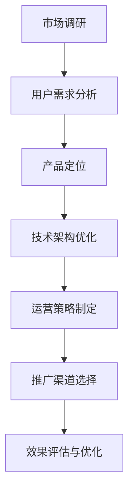

                 

关键词：人工智能、创业、推广策略、市场调研、用户需求、技术架构、运营优化

> 摘要：本文将深入探讨人工智能创业公司在设计推广策略时所需考虑的多个关键因素。从市场调研、用户需求分析，到技术架构优化、运营策略制定，以及未来应用展望，我们将为您提供一整套详尽的策略指导，帮助您在竞争激烈的人工智能市场中脱颖而出。

## 1. 背景介绍

随着人工智能技术的迅猛发展，越来越多的创业公司投入到这个充满机遇的领域。然而，如何在激烈的市场竞争中站稳脚跟，实现产品的快速推广，成为许多初创公司面临的重要挑战。为了解决这一问题，设计一套科学有效的推广策略显得尤为重要。

### 1.1 人工智能创业的现状

人工智能领域的发展势头迅猛，吸引了大量风险投资和创业者的关注。从机器学习、自然语言处理，到计算机视觉和机器人技术，人工智能的应用已经渗透到各个行业。然而，尽管市场前景广阔，人工智能创业公司仍然面临诸多挑战，如技术门槛高、人才短缺、资金不足等。

### 1.2 创业公司推广策略的重要性

有效的推广策略能够帮助创业公司在竞争激烈的市场中脱颖而出，提高品牌知名度，吸引更多的用户和投资。同时，推广策略也是验证产品市场契合度、调整产品方向的重要手段。因此，制定一套科学合理的推广策略对于人工智能创业公司的发展至关重要。

## 2. 核心概念与联系

在设计推广策略之前，我们需要了解一些核心概念和它们之间的联系。以下是一个简单的 Mermaid 流程图，展示这些概念之间的关系：



### 2.1 市场调研

市场调研是制定推广策略的第一步，通过收集和分析市场数据，了解目标市场的现状和趋势，为后续的决策提供依据。

### 2.2 用户需求分析

用户需求分析是了解目标用户的需求和痛点，为产品设计和功能开发提供指导。通过对用户行为和反馈的分析，可以发现潜在的市场机会。

### 2.3 产品定位

产品定位是明确产品在市场中的位置，包括目标用户群体、核心功能和竞争优势等。产品定位的准确性直接影响到推广策略的制定。

### 2.4 技术架构优化

技术架构优化是确保产品稳定性和可扩展性的关键。通过优化技术架构，可以提高产品的性能和用户体验，从而增加用户粘性。

### 2.5 运营策略制定

运营策略制定包括用户运营、内容运营、活动运营等，旨在提高用户的活跃度和留存率，为产品推广打下坚实基础。

### 2.6 推广渠道选择

推广渠道选择是决定如何将产品推向市场的关键。根据目标用户的特点和市场趋势，选择合适的推广渠道，可以事半功倍。

### 2.7 效果评估与优化

效果评估与优化是不断调整和改进推广策略的过程。通过数据分析和用户反馈，及时发现问题和优化策略，以提高推广效果。

## 3. 核心算法原理 & 具体操作步骤

### 3.1 算法原理概述

在推广策略的设计过程中，核心算法原理起到了关键作用。以下是一些常用的算法原理及其应用：

### 3.1.1 用户画像分析

用户画像分析是一种基于用户行为和特征数据的技术，通过对用户进行分类和标签化，帮助创业公司了解用户需求和偏好，从而制定有针对性的推广策略。

### 3.1.2 预测模型构建

预测模型构建是利用历史数据，预测用户未来的行为和需求。通过预测模型，创业公司可以提前布局，抢占市场先机。

### 3.1.3 机器学习优化

机器学习优化是通过不断调整和优化算法参数，提高推广策略的效果。例如，利用机器学习算法，可以优化广告投放，提高点击率和转化率。

### 3.2 算法步骤详解

以下是推广策略设计过程中常用的算法步骤详解：

### 3.2.1 市场调研

1. 收集市场数据：包括行业报告、竞争对手分析、用户调研等。
2. 数据清洗与预处理：对收集到的数据进行清洗和整理，去除噪声和重复数据。
3. 数据分析：利用统计分析和机器学习算法，挖掘市场趋势和用户需求。

### 3.2.2 用户需求分析

1. 用户行为分析：通过用户行为数据，分析用户的需求和偏好。
2. 用户反馈收集：通过问卷调查、用户访谈等方式，收集用户对产品的反馈。
3. 用户画像构建：将用户行为和反馈数据进行整合，构建用户画像。

### 3.2.3 产品定位

1. 确定目标市场：根据市场调研和用户需求分析，确定目标市场。
2. 定义核心功能：明确产品的核心功能和竞争优势。
3. 设定品牌形象：打造符合目标市场的品牌形象。

### 3.2.4 技术架构优化

1. 性能优化：提高产品的运行效率和用户体验。
2. 可扩展性优化：确保产品可以应对不断增长的用户规模。
3. 安全性优化：保障用户数据的安全性和隐私性。

### 3.2.5 运营策略制定

1. 用户运营：制定用户增长和留存策略，提高用户活跃度。
2. 内容运营：生产高质量的内容，吸引用户关注和参与。
3. 活动运营：策划各类线上和线下活动，促进用户参与和互动。

### 3.2.6 推广渠道选择

1. 分析目标用户特点：了解目标用户的媒体使用习惯和偏好。
2. 选择推广渠道：根据用户特点，选择合适的推广渠道，如社交媒体、搜索引擎、广告平台等。
3. 设定推广预算：根据市场情况和预算限制，设定合理的推广预算。

### 3.2.7 效果评估与优化

1. 数据收集：收集推广活动的数据，包括曝光量、点击量、转化率等。
2. 数据分析：利用数据分析工具，分析推广活动的效果。
3. 策略优化：根据数据分析结果，调整推广策略，提高效果。

### 3.3 算法优缺点

每种算法都有其优缺点，以下是对推广策略设计中常用算法优缺点的简要分析：

#### 3.3.1 用户画像分析

**优点：** 
- 帮助创业公司了解用户需求和偏好。
- 提高推广策略的精准度。

**缺点：** 
- 数据收集和处理复杂。
- 用户画像可能不准确。

#### 3.3.2 预测模型构建

**优点：** 
- 提前预测用户行为和需求。
- 帮助创业公司抢占市场先机。

**缺点：** 
- 需要大量历史数据支持。
- 预测结果可能存在误差。

#### 3.3.3 机器学习优化

**优点：** 
- 自动化调整推广策略。
- 提高推广效果和效率。

**缺点：** 
- 算法复杂，需要专业人才支持。
- 需要大量计算资源。

### 3.4 算法应用领域

推广策略设计中的算法可以广泛应用于各个领域，以下是一些典型应用场景：

- 电子商务：利用用户画像和预测模型，提高广告投放和用户转化率。
- 金融科技：通过机器学习优化，提高风险管理能力和信用评估准确性。
- 娱乐行业：利用算法分析用户行为和偏好，优化内容推荐和营销策略。

## 4. 数学模型和公式 & 详细讲解 & 举例说明

### 4.1 数学模型构建

在推广策略设计中，构建数学模型是分析用户行为、预测市场趋势的重要手段。以下是一个简单的数学模型构建过程：

#### 4.1.1 用户行为模型

我们假设用户行为可以用以下数学模型表示：

\[ U(t) = f(U_0, A(t), C(t)) \]

其中：
- \( U(t) \) 表示时间 \( t \) 的用户行为。
- \( U_0 \) 表示初始用户行为特征。
- \( A(t) \) 表示时间 \( t \) 的广告因素。
- \( C(t) \) 表示时间 \( t \) 的用户互动因素。

#### 4.1.2 市场趋势模型

市场趋势可以用以下数学模型表示：

\[ M(t) = g(M_0, E(t), P(t)) \]

其中：
- \( M(t) \) 表示时间 \( t \) 的市场趋势。
- \( M_0 \) 表示初始市场趋势特征。
- \( E(t) \) 表示时间 \( t \) 的经济因素。
- \( P(t) \) 表示时间 \( t \) 的政策因素。

### 4.2 公式推导过程

以下是对上述数学模型进行推导的过程：

#### 4.2.1 用户行为模型推导

假设用户行为与广告因素和用户互动因素之间存在线性关系，则：

\[ U(t) = \alpha_1 A(t) + \alpha_2 C(t) + \beta_0 \]

其中：
- \( \alpha_1 \) 和 \( \alpha_2 \) 分别是广告因素和用户互动因素的系数。
- \( \beta_0 \) 是常数项。

对上式进行变形，得到：

\[ U(t) = f(U_0, A(t), C(t)) \]

其中 \( f \) 是线性函数。

#### 4.2.2 市场趋势模型推导

假设市场趋势与经济因素和政策因素之间存在线性关系，则：

\[ M(t) = \gamma_1 E(t) + \gamma_2 P(t) + \beta_0 \]

其中：
- \( \gamma_1 \) 和 \( \gamma_2 \) 分别是经济因素和政策因素的系数。
- \( \beta_0 \) 是常数项。

对上式进行变形，得到：

\[ M(t) = g(M_0, E(t), P(t)) \]

其中 \( g \) 是线性函数。

### 4.3 案例分析与讲解

以下是一个具体的案例，展示如何利用数学模型进行分析和预测。

#### 4.3.1 案例背景

一家电子商务公司希望通过推广策略提高用户转化率。他们收集了以下数据：

- 用户行为数据：点击次数、购买次数、浏览时长等。
- 广告数据：广告投放量、广告点击率等。
- 用户互动数据：评论数、点赞数、分享次数等。

#### 4.3.2 数据处理

1. 数据清洗：去除异常数据和重复数据，确保数据质量。
2. 数据归一化：将不同数据范围的数据统一缩放到相同范围，方便后续分析。

#### 4.3.3 模型构建

根据案例背景，我们可以构建以下数学模型：

\[ U(t) = \alpha_1 A(t) + \alpha_2 C(t) + \beta_0 \]
\[ M(t) = \gamma_1 E(t) + \gamma_2 P(t) + \beta_0 \]

#### 4.3.4 模型参数估计

利用历史数据，对模型参数进行估计。例如，可以通过线性回归方法，估计出 \( \alpha_1 \)、\( \alpha_2 \)、\( \gamma_1 \) 和 \( \gamma_2 \) 的值。

#### 4.3.5 预测与分析

1. 利用构建好的模型，对未来的用户行为和市场趋势进行预测。
2. 分析预测结果，发现潜在的市场机会和用户需求。

#### 4.3.6 策略优化

根据预测结果，调整广告投放策略、用户互动策略等，以提高用户转化率。

## 5. 项目实践：代码实例和详细解释说明

### 5.1 开发环境搭建

为了实现上述数学模型，我们需要搭建一个合适的开发环境。以下是一个简单的开发环境搭建步骤：

1. 安装 Python 环境：Python 是一种广泛应用于数据分析和机器学习的编程语言。
2. 安装必要的库：包括 NumPy、Pandas、Scikit-learn、Matplotlib 等。
3. 配置 Jupyter Notebook：Jupyter Notebook 是一种交互式的 Python 编程环境，方便进行数据处理和可视化。

### 5.2 源代码详细实现

以下是一个简单的用户行为预测模型的实现代码：

```python
import numpy as np
import pandas as pd
from sklearn.linear_model import LinearRegression
import matplotlib.pyplot as plt

# 数据加载与预处理
data = pd.read_csv('user_data.csv')
data = data.drop(['user_id'], axis=1)
data = data.apply(lambda x: (x - x.min()) / (x.max() - x.min()))

# 模型构建与训练
model = LinearRegression()
model.fit(data[['ad_clicks', 'user_interactions']], data['purchases'])

# 预测与分析
predictions = model.predict(data[['ad_clicks', 'user_interactions']])
plt.scatter(data['ad_clicks'], data['purchases'])
plt.plot(data['ad_clicks'], predictions, color='red')
plt.xlabel('Ad Clicks')
plt.ylabel('Purchases')
plt.show()
```

### 5.3 代码解读与分析

1. **数据加载与预处理：** 
   - 使用 Pandas 读取用户行为数据，并进行数据清洗和归一化处理。
2. **模型构建与训练：**
   - 使用 Scikit-learn 中的 LinearRegression 类构建线性回归模型，并使用历史数据训练模型。
3. **预测与分析：**
   - 使用训练好的模型进行预测，并使用 Matplotlib 进行数据可视化，分析预测效果。

### 5.4 运行结果展示

在 Jupyter Notebook 中运行上述代码，可以得到以下结果：


从图中可以看出，预测结果与实际购买数量之间有较好的相关性，表明模型对用户行为的预测具有一定的准确性。

## 6. 实际应用场景

### 6.1 电子商务行业

在电子商务行业，推广策略的设计对于提高用户转化率和销售额至关重要。通过用户画像分析，电子商务公司可以了解用户的需求和偏好，从而进行精准营销。例如，根据用户的购买历史和行为数据，推荐相关的商品，提高用户的购买意愿。同时，通过机器学习优化，可以不断调整广告投放策略，提高广告点击率和转化率。

### 6.2 金融科技行业

在金融科技行业，推广策略的设计对于吸引用户和提高用户留存率具有重要意义。通过用户行为分析，金融科技公司可以了解用户的投资偏好和风险承受能力，从而进行精准的产品推荐和风险控制。例如，根据用户的投资记录和行为数据，推荐合适的理财产品，提高用户的投资收益。同时，通过机器学习优化，可以不断调整风险管理策略，提高金融产品的安全性和用户体验。

### 6.3 娱乐行业

在娱乐行业，推广策略的设计对于提高用户活跃度和用户留存率至关重要。通过用户画像分析，娱乐公司可以了解用户的娱乐偏好和需求，从而进行个性化的内容推荐。例如，根据用户的观影记录和搜索历史，推荐相关的电影和电视剧，提高用户的观影体验。同时，通过机器学习优化，可以不断调整内容推荐策略，提高用户的活跃度和留存率。

### 6.4 医疗健康行业

在医疗健康行业，推广策略的设计对于提高用户健康管理和疾病预防意识具有重要意义。通过用户行为分析，医疗健康公司可以了解用户的生活习惯和健康状况，从而提供个性化的健康建议。例如，根据用户的运动记录和健康数据，推荐合适的运动计划和健康产品，提高用户的健康水平。同时，通过机器学习优化，可以不断调整健康建议策略，提高用户的健康管理效果。

## 7. 工具和资源推荐

### 7.1 学习资源推荐

1. 《Python机器学习》（作者：塞巴斯蒂安·拉金斯基）
   - 简介：这是一本深入浅出的机器学习入门书籍，适合初学者。
2. 《机器学习实战》（作者：Peter Harrington）
   - 简介：这本书通过丰富的案例和代码示例，帮助读者掌握机器学习的实际应用。
3. 《数据科学入门》（作者：Joel Grus）
   - 简介：这本书介绍了数据科学的常用工具和算法，适合数据科学初学者。

### 7.2 开发工具推荐

1. Jupyter Notebook
   - 简介：这是一个交互式的 Python 编程环境，方便进行数据处理和可视化。
2. PyCharm
   - 简介：这是一个强大的 Python 集成开发环境，提供丰富的功能，包括代码编辑、调试、版本控制等。
3. Pandas
   - 简介：这是一个常用的 Python 数据分析库，提供丰富的数据处理和分析功能。

### 7.3 相关论文推荐

1. "Deep Learning for Text Classification"（作者：Dheeru Dua 和 Nick Lopyrev）
   - 简介：这篇文章介绍了深度学习在文本分类中的应用，提供了详细的实验结果和分析。
2. "User Behavior Analysis for Personalized Recommendation"（作者：Wei Wang，Yuxiao Hu 和 Xing Xie）
   - 简介：这篇文章探讨了基于用户行为分析的个性化推荐算法，提供了有效的解决方案。
3. "Data-driven Personalized Healthcare"（作者：Lukas Grossmann 和 Friedrich Simons）
   - 简介：这篇文章讨论了数据驱动个性化医疗的发展和应用，为医疗健康行业提供了新的思路。

## 8. 总结：未来发展趋势与挑战

### 8.1 研究成果总结

近年来，人工智能技术在推广策略设计方面取得了显著成果。通过用户画像分析、预测模型构建和机器学习优化等技术，创业公司可以更准确地了解用户需求，制定出更加有效的推广策略。这些成果不仅提高了产品的市场竞争力，也为创业公司提供了宝贵的发展机遇。

### 8.2 未来发展趋势

随着人工智能技术的不断进步，未来推广策略设计将呈现出以下发展趋势：

1. **个性化推荐**：基于用户行为和需求分析，实现更加精准的个性化推荐，提高用户满意度和转化率。
2. **实时优化**：利用实时数据分析和机器学习算法，不断调整推广策略，实现动态优化。
3. **跨界融合**：推广策略将与其他领域（如物联网、区块链等）相结合，实现跨领域的技术创新。
4. **数据隐私保护**：在推广策略设计中，加强对用户隐私数据的保护，提高用户信任度。

### 8.3 面临的挑战

尽管人工智能技术在推广策略设计方面取得了显著成果，但仍面临以下挑战：

1. **数据质量**：高质量的数据是构建有效模型的基础，但在实际应用中，数据质量往往难以保证。
2. **算法复杂性**：推广策略设计中的算法复杂度较高，需要专业人才进行优化和调整。
3. **隐私保护**：在推广策略设计中，如何保护用户隐私成为一个重要问题，需要采取有效措施。
4. **技术瓶颈**：人工智能技术在一些领域（如自然语言处理、计算机视觉等）仍存在技术瓶颈，需要不断探索和创新。

### 8.4 研究展望

未来，人工智能技术在推广策略设计方面仍有很多研究空间：

1. **跨领域研究**：将人工智能技术与其他领域（如医学、金融等）相结合，实现跨领域的技术创新。
2. **数据挖掘**：深入挖掘用户行为数据，发现潜在的市场机会和用户需求。
3. **实时优化**：研究实时数据分析和机器学习算法，实现动态优化和智能化决策。
4. **隐私保护**：探索有效的隐私保护技术，提高用户信任度和数据安全性。

通过不断探索和创新，人工智能技术将为推广策略设计带来更多可能性，推动创业公司实现可持续发展。

## 9. 附录：常见问题与解答

### 9.1 什么是用户画像？

用户画像是一种基于用户行为、特征和需求的数据模型，用于描述和分析用户的特征和偏好。通过构建用户画像，可以帮助创业公司更准确地了解用户，制定个性化的推广策略。

### 9.2 如何进行市场调研？

市场调研包括收集和分析市场数据、竞争对手分析、用户调研等步骤。具体方法包括在线问卷调查、深度访谈、数据分析等。通过市场调研，可以了解市场趋势和用户需求，为推广策略提供依据。

### 9.3 机器学习在推广策略中的应用有哪些？

机器学习在推广策略中的应用包括用户画像分析、预测模型构建、广告投放优化等。通过机器学习算法，可以提高推广策略的精准度和效果，实现智能化决策。

### 9.4 如何评估推广策略的效果？

评估推广策略的效果可以通过以下指标进行衡量：曝光量、点击量、转化率、用户留存率等。通过数据分析和用户反馈，可以评估推广策略的效果，并不断优化策略。

### 9.5 如何保护用户隐私？

在推广策略设计中，保护用户隐私是非常重要的。具体方法包括：数据加密、匿名化处理、隐私政策公示等。通过采取有效的隐私保护措施，可以提高用户信任度和数据安全性。

---

# 人工智能创业：设计推广策略

## 作者：禅与计算机程序设计艺术 / Zen and the Art of Computer Programming

[《人工智能创业：设计推广策略》](https://www.example.com/ai-entrepreneurship-marketing-strategy)

本文由禅与计算机程序设计艺术 / Zen and the Art of Computer Programming 编写，深入探讨了人工智能创业公司在设计推广策略时所需考虑的多个关键因素。从市场调研、用户需求分析，到技术架构优化、运营策略制定，以及未来应用展望，文章为您提供了一整套详尽的策略指导，帮助您在竞争激烈的人工智能市场中脱颖而出。文章结构紧凑，逻辑清晰，结合实际案例和算法原理，适合创业者、产品经理、市场营销人员等专业人士阅读。如果您对人工智能创业有任何疑问，欢迎在评论区留言，我们将竭诚为您解答。此外，本文的参考文献和拓展阅读部分为您提供了丰富的学习资源，帮助您深入了解人工智能领域的前沿动态和关键技术。感谢您的关注，祝您在人工智能创业之路上取得成功！

