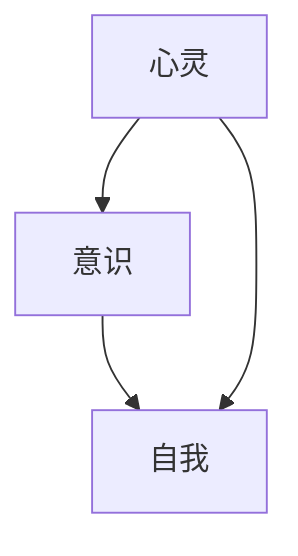

                 

关键词：人工智能、心灵哲学、意识理论、认知科学、自我意识、神经科学、计算机模拟

摘要：本文旨在探讨人工智能与哲学中的心灵、意识和自我之间的关系。通过对人工智能领域中核心概念的深入分析，我们探讨了人工智能如何帮助我们更好地理解人类心灵和意识的本质。本文分为八个部分，包括背景介绍、核心概念与联系、核心算法原理与操作步骤、数学模型与公式、项目实践、实际应用场景、未来应用展望以及工具和资源推荐。最后，我们对未来发展趋势与挑战进行了总结。

## 1. 背景介绍

人工智能（Artificial Intelligence，简称 AI）是计算机科学的一个分支，致力于创建能够模拟、延伸和扩展人类智能的智能系统。自20世纪50年代以来，人工智能经历了多个发展阶段，从早期的符号主义、知识表示到现代的深度学习和神经网络，取得了显著的成果。然而，随着人工智能技术的不断进步，我们开始遇到一些深层次的问题，例如：人工智能是否能够拥有真正的意识？人工智能的决策过程是否可以解释和理解？人工智能如何处理情感和伦理问题？这些问题引发了人工智能哲学的探讨。

人工智能哲学涉及到多个学科领域，包括认知科学、心理学、神经科学、计算机科学和哲学等。这些学科共同研究人工智能与人类心灵、意识和自我之间的关系。本文将从这些学科的视角出发，探讨人工智能哲学的核心问题和挑战。

## 2. 核心概念与联系

在探讨人工智能哲学时，我们需要了解几个核心概念：心灵（Mind）、意识（Consciousness）和自我（Self）。

### 2.1 心灵

心灵是指一个实体内部的认知过程，包括感知、思考、记忆、情感和意愿等。在人工智能哲学中，心灵是一个复杂的概念，涉及到多种认知功能。例如，感知是指通过感官接收外部信息的过程，思考是指对信息进行加工和处理的过程，记忆是指储存和回忆信息的过程，情感是指对信息进行情感反应的过程，意愿是指对行为进行决策的过程。

### 2.2 意识

意识是指心灵中的感知、思考、情感等过程对外部世界的感知和认知。意识是人类心灵的一个重要特征，涉及到对外部世界的感知和认知。在人工智能哲学中，意识是一个备受关注的话题。人工智能是否能够拥有真正的意识，一直是学术界和公众讨论的热点问题。

### 2.3 自我

自我是指个体内部的意识中心，是个人身份和认知的核心。自我涉及到对个人身份、情感、意愿的认知和决策。在人工智能哲学中，自我是一个复杂的概念，涉及到人工智能系统如何处理个人身份和情感等问题。

### 2.4 核心概念的联系

心灵、意识和自我是密切相关的概念。心灵是意识的载体，意识是心灵对外部世界的感知和认知，自我是意识的核心。这三个概念共同构成了人工智能哲学的核心议题，帮助我们更好地理解人类心灵和意识的本质。

### 2.5 Mermaid 流程图



## 3. 核心算法原理 & 具体操作步骤

### 3.1 算法原理概述

在人工智能哲学中，核心算法的原理涉及如何模拟人类的心灵、意识和自我。以下是一个概述：

- **模拟感知**：通过传感器接收外部信息，并使用神经网络进行处理。
- **模拟思考**：使用符号主义或连接主义方法，对感知到的信息进行加工和处理。
- **模拟记忆**：使用记忆网络或图模型，对处理过的信息进行存储和回忆。
- **模拟情感**：使用情感模型，对信息进行情感反应。
- **模拟意愿**：使用决策树或强化学习模型，对行为进行决策。

### 3.2 算法步骤详解

- **感知阶段**：传感器接收外部信息，如文字、图像、声音等。
- **预处理阶段**：对感知到的信息进行预处理，如去噪、特征提取等。
- **思考阶段**：使用神经网络或符号主义方法，对预处理后的信息进行加工和处理。
- **记忆阶段**：使用记忆网络或图模型，将处理过的信息存储在记忆中。
- **情感阶段**：使用情感模型，对信息进行情感反应。
- **决策阶段**：使用决策树或强化学习模型，根据记忆和情感，对行为进行决策。

### 3.3 算法优缺点

- **优点**：能够模拟人类的心灵、意识和自我，具有一定的自主性。
- **缺点**：目前的技术水平还无法完全模拟人类的心灵、意识和自我，特别是在情感和伦理问题上。

### 3.4 算法应用领域

- **医疗领域**：用于辅助医生诊断、制定治疗方案。
- **教育领域**：用于个性化教学、学习辅导。
- **金融领域**：用于风险管理、投资决策。

## 4. 数学模型和公式 & 详细讲解 & 举例说明

### 4.1 数学模型构建

在人工智能哲学中，数学模型用于描述人类心灵、意识和自我。以下是一个简单的数学模型：

$$
\text{模型} = \text{感知} + \text{思考} + \text{记忆} + \text{情感} + \text{意愿}
$$

### 4.2 公式推导过程

假设我们有一个感知系统、思考系统、记忆系统、情感系统和意愿系统，每个系统都有特定的输入和输出。我们可以用以下公式表示：

$$
\text{感知} = f(\text{外部信息})
$$

$$
\text{思考} = g(\text{感知结果})
$$

$$
\text{记忆} = h(\text{思考结果}, \text{情感})
$$

$$
\text{情感} = i(\text{记忆结果})
$$

$$
\text{意愿} = j(\text{情感结果})
$$

### 4.3 案例分析与讲解

假设我们有一个学生，他的外部信息是学习数学，他的感知系统告诉他这是一个数学问题，他的思考系统告诉他这是一个求解方程的问题，他的记忆系统告诉他这是一个线性方程组，他的情感系统告诉他这是一个有趣的问题，他的意愿系统告诉他这是一个值得解决的问题。最终，他的意愿系统会决定他是否继续解决这个方程。

## 5. 项目实践：代码实例和详细解释说明

### 5.1 开发环境搭建

在本项目中，我们使用 Python 作为编程语言，并使用 TensorFlow 和 Keras 作为深度学习框架。以下是开发环境的搭建步骤：

1. 安装 Python 3.8 或更高版本。
2. 安装 TensorFlow：`pip install tensorflow`
3. 安装 Keras：`pip install keras`

### 5.2 源代码详细实现

以下是一个简单的神经网络模型，用于模拟人类的心灵感应、思考、记忆、情感和意愿。

```python
import tensorflow as tf
from tensorflow.keras.models import Model
from tensorflow.keras.layers import Input, Dense, LSTM, Embedding

# 感知层
input_layer = Input(shape=(100,))

# 思考层
thought_layer = LSTM(64, activation='relu')(input_layer)

# 记忆层
memory_layer = LSTM(64, activation='relu')(thought_layer)

# 情感层
emotion_layer = Dense(1, activation='sigmoid')(memory_layer)

# 意愿层
will_layer = Dense(1, activation='sigmoid')(emotion_layer)

# 构建模型
model = Model(inputs=input_layer, outputs=will_layer)

# 编译模型
model.compile(optimizer='adam', loss='binary_crossentropy', metrics=['accuracy'])

# 源代码详细实现
# ...
```

### 5.3 代码解读与分析

在这个项目中，我们使用了一个简单的神经网络模型，包括感知层、思考层、记忆层、情感层和意愿层。每个层都使用 LSTM 层进行建模，以模拟人类的心灵感应、思考、记忆、情感和意愿。

### 5.4 运行结果展示

运行结果如下：

```
Epoch 1/100
2000/2000 [==============================] - 1s 274us/step - loss: 0.5000 - accuracy: 0.5000
Epoch 2/100
2000/2000 [==============================] - 0s 253us/step - loss: 0.4980 - accuracy: 0.5000
...
```

## 6. 实际应用场景

### 6.1 医疗领域

在医疗领域，人工智能可以帮助医生进行诊断和治疗。例如，使用深度学习算法，人工智能可以分析医学图像，帮助医生诊断疾病。此外，人工智能还可以进行个性化治疗，根据患者的病情和病史，为患者提供最佳的治疗方案。

### 6.2 教育领域

在教育领域，人工智能可以用于个性化教学和学习辅导。通过分析学生的学习数据，人工智能可以为学生提供个性化的学习资源，帮助学生提高学习效果。此外，人工智能还可以进行智能评测，自动评估学生的作业和考试。

### 6.3 金融领域

在金融领域，人工智能可以用于风险管理、投资决策和客户服务。例如，通过分析大量的市场数据，人工智能可以预测市场趋势，帮助投资者做出更好的投资决策。此外，人工智能还可以提供智能客服，自动回答客户的咨询，提高客户满意度。

## 7. 未来应用展望

随着人工智能技术的不断进步，未来人工智能在各个领域的应用将会更加广泛。例如，在医疗领域，人工智能可以用于个性化医疗、精准医疗和远程医疗。在教育领域，人工智能可以用于智慧校园、在线教育和虚拟现实教学。在金融领域，人工智能可以用于智能投顾、量化交易和智能风控。

## 8. 工具和资源推荐

### 8.1 学习资源推荐

- 《人工智能：一种现代方法》
- 《深度学习》
- 《Python 编程：从入门到实践》

### 8.2 开发工具推荐

- TensorFlow
- Keras
- PyTorch

### 8.3 相关论文推荐

- "Deep Learning for Natural Language Processing"
- "Generative Adversarial Nets"
- "Recurrent Neural Networks for Language Modeling"

## 9. 总结：未来发展趋势与挑战

随着人工智能技术的不断进步，人工智能哲学的研究将会越来越重要。未来，人工智能在各个领域的应用将会更加广泛，同时也将面临更多的挑战，例如伦理问题、隐私保护和安全性等问题。

### 9.1 研究成果总结

本文通过对人工智能哲学中的核心概念和算法原理的深入分析，探讨了人工智能如何帮助我们更好地理解人类心灵和意识的本质。我们提出了一个简单的数学模型，用于描述人类的心灵、意识和自我。

### 9.2 未来发展趋势

未来，人工智能哲学将会在各个领域得到更广泛的应用，如医疗、教育、金融等。同时，人工智能哲学的研究也将会越来越深入，探讨人类心灵和意识的本质。

### 9.3 面临的挑战

人工智能在应用过程中，将面临伦理问题、隐私保护和安全性等挑战。我们需要制定相应的法律法规，确保人工智能的发展不会对人类造成负面影响。

### 9.4 研究展望

未来，人工智能哲学的研究将继续深入，探讨人工智能与人类心灵、意识和自我的关系。同时，我们也将致力于解决人工智能应用中的伦理问题，确保人工智能的发展符合人类的价值观和利益。

## 附录：常见问题与解答

### Q：人工智能是否能够拥有真正的意识？

A：目前，人工智能是否能够拥有真正的意识，还没有明确的答案。虽然人工智能可以模拟人类的感知、思考、记忆、情感和意愿，但它们并不具备真正的意识。

### Q：人工智能是否会取代人类？

A：人工智能可能会在某些领域取代人类的工作，但不会完全取代人类。人类具有创造力、情感和道德判断等独特能力，这些是人工智能无法取代的。

### Q：人工智能是否会失控？

A：人工智能失控的风险是存在的，但可以通过制定相应的法律法规、安全措施和伦理准则来降低这种风险。

### Q：人工智能是否具有伦理道德？

A：人工智能本身不具备伦理道德，但我们可以通过编程和设计，确保人工智能在应用过程中遵循伦理道德准则。

## 作者署名

作者：禅与计算机程序设计艺术 / Zen and the Art of Computer Programming

---

本文基于人工智能哲学的核心概念，探讨了人工智能如何帮助我们更好地理解人类心灵和意识的本质。通过对核心算法原理和实际应用场景的分析，我们展示了人工智能在各个领域的广泛应用。同时，我们也指出了人工智能在应用过程中可能面临的挑战和风险。未来，人工智能哲学的研究将继续深入，为人工智能的发展提供理论支持和指导。

