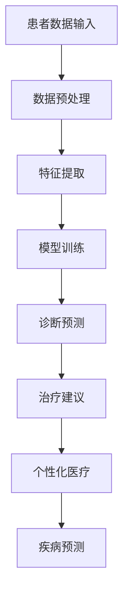

                 

关键词：人工智能、医疗保健、诊断、治疗、个性化医疗、预测模型

> 摘要：本文将探讨人工智能在医疗保健领域的广泛应用，包括疾病诊断、治疗建议、个性化医疗和疾病预测等方面。通过分析现有技术及其实现，本文旨在为读者提供对人工智能在医疗保健中潜力的深入理解，并探讨其未来发展趋势与面临的挑战。

## 1. 背景介绍

随着人工智能技术的飞速发展，计算机在处理复杂任务的能力不断增强。医疗保健领域作为社会发展和人类健康的重要组成部分，正越来越多地借助人工智能技术来提升诊疗效率和准确性。人工智能在医疗保健中的应用不仅能够解决一些长期存在的难题，如医疗资源的分配不均和诊断治疗的效率低下，还能够为患者提供更为个性化和精准的医疗建议。

近年来，深度学习、机器学习和自然语言处理等人工智能技术已逐步应用于医疗数据的处理和分析。从医疗图像的诊断到电子健康记录的分析，人工智能技术在医疗保健领域展现出了巨大的潜力。本文将重点讨论人工智能在疾病诊断、治疗建议、个性化医疗和疾病预测方面的应用，并分析其实现原理和技术挑战。

## 2. 核心概念与联系

### 2.1. 人工智能的基本概念

人工智能（Artificial Intelligence，AI）是指通过计算机程序模拟人类智能的行为和决策过程。其主要分支包括机器学习（Machine Learning，ML）、深度学习（Deep Learning，DL）和自然语言处理（Natural Language Processing，NLP）等。这些技术能够处理和分析大量医疗数据，从而为医疗保健提供有力支持。

### 2.2. 医疗保健的核心概念

医疗保健（Healthcare）是指一系列旨在维持和促进人类健康的服务和活动，包括预防、诊断、治疗、康复和保健等。传统的医疗保健依赖于医生的经验和专业知识，而人工智能的应用则能够为医生提供更准确的诊断和治疗建议。

### 2.3. Mermaid 流程图

下面是医疗保健中人工智能应用的一个简化的 Mermaid 流程图，展示了从医疗数据输入到最终输出的整个过程。



## 3. 核心算法原理 & 具体操作步骤

### 3.1. 算法原理概述

人工智能在医疗保健中的应用主要依赖于以下几种算法：

- **深度学习（Deep Learning）**：通过多层神经网络模型，对大量医疗数据进行自动特征提取和学习。
- **机器学习（Machine Learning）**：利用历史数据和统计方法，对医疗数据进行分类、预测和决策。
- **自然语言处理（Natural Language Processing）**：对医学文本进行理解和分析，提取有用信息。

### 3.2. 算法步骤详解

#### 3.2.1. 数据预处理

数据预处理是人工智能应用的第一步，主要包括以下任务：

- **数据清洗**：去除缺失值、异常值和重复数据。
- **数据归一化**：将不同数据范围的数据统一到同一尺度，便于后续处理。
- **数据增强**：通过生成新的数据样本，提高模型的泛化能力。

#### 3.2.2. 特征提取

特征提取是数据预处理后的关键步骤，目的是将原始数据转换为能够表征疾病特征的向量。常见的方法包括：

- **统计特征提取**：利用统计学方法，提取数据的均值、方差、最大值、最小值等。
- **深度特征提取**：使用深度学习模型，自动学习数据的高层特征。

#### 3.2.3. 模型训练

模型训练是指使用历史数据对人工智能模型进行训练，使其能够自动识别和预测疾病。常用的模型包括：

- **卷积神经网络（Convolutional Neural Network，CNN）**：用于处理图像数据。
- **循环神经网络（Recurrent Neural Network，RNN）**：用于处理序列数据。
- **决策树（Decision Tree）**：用于分类和回归问题。

#### 3.2.4. 诊断预测

诊断预测是指使用训练好的模型对新的病例进行预测，给出可能的疾病诊断。预测结果通常需要医生进行进一步验证和调整。

#### 3.2.5. 治疗建议

治疗建议是基于诊断结果，结合患者的病史、基因信息和生活习惯等，为患者提供个性化的治疗建议。

#### 3.2.6. 个性化医疗

个性化医疗是指根据患者的个体差异，提供量身定制的医疗服务。人工智能可以通过分析大量患者的数据，发现潜在的个体差异，为个性化医疗提供数据支持。

#### 3.2.7. 疾病预测

疾病预测是指使用人工智能模型，预测患者在未来可能患上的疾病。这有助于提前采取预防措施，降低疾病发生的风险。

### 3.3. 算法优缺点

#### 优点：

- **高效性**：人工智能能够在短时间内处理大量医疗数据，提高诊断和治疗的效率。
- **准确性**：通过机器学习和深度学习模型，人工智能能够准确识别和预测疾病。
- **个性化**：人工智能可以根据患者的个体差异，提供个性化的医疗建议。

#### 缺点：

- **数据隐私**：医疗数据涉及个人隐私，如何在保证数据安全的前提下进行数据处理和分析，是一个重要问题。
- **模型解释性**：许多人工智能模型，如深度学习模型，其内部决策过程难以解释，这对医疗决策带来了一定的挑战。

### 3.4. 算法应用领域

人工智能在医疗保健中的应用领域非常广泛，主要包括：

- **疾病诊断**：通过分析医学影像、电子健康记录等，对疾病进行诊断。
- **治疗建议**：根据诊断结果，为患者提供个性化的治疗建议。
- **个性化医疗**：根据患者的个体差异，提供个性化的医疗服务。
- **疾病预测**：预测患者在未来可能患上的疾病，提前采取预防措施。

## 4. 数学模型和公式 & 详细讲解 & 举例说明

### 4.1. 数学模型构建

在医疗保健中，人工智能模型的构建通常涉及以下数学模型：

- **分类模型**：用于对疾病进行分类，常见的有支持向量机（SVM）、朴素贝叶斯（Naive Bayes）等。
- **回归模型**：用于预测疾病发生的概率，常见的有线性回归、逻辑回归等。
- **聚类模型**：用于对医疗数据进行聚类分析，常见的有K-均值聚类、层次聚类等。

### 4.2. 公式推导过程

以线性回归模型为例，其公式推导过程如下：

- **线性回归模型**：\(y = \beta_0 + \beta_1 \cdot x + \epsilon\)
  - 其中，\(y\) 为因变量，\(x\) 为自变量，\(\beta_0\) 和 \(\beta_1\) 为模型参数，\(\epsilon\) 为误差项。

- **参数估计**：通过最小化误差平方和，得到参数估计值：
  - \(\beta_0 = \frac{\sum_{i=1}^{n} (y_i - \beta_1 \cdot x_i)}{n}\)
  - \(\beta_1 = \frac{\sum_{i=1}^{n} (x_i - \bar{x}) \cdot (y_i - \bar{y})}{\sum_{i=1}^{n} (x_i - \bar{x})^2}\)
  - 其中，\(\bar{x}\) 和 \(\bar{y}\) 分别为自变量和因变量的均值，\(n\) 为样本数量。

### 4.3. 案例分析与讲解

假设有一个关于心脏病预测的线性回归模型，其中自变量为年龄、体重指数（BMI）和血压，因变量为是否患有心脏病。给定以下数据：

| 年龄 | BMI | 血压 | 是否患有心脏病 |
| ---- | --- | ---- | ------------ |
| 40   | 25  | 120  | 是           |
| 45   | 30  | 130  | 是           |
| 50   | 28  | 110  | 否           |

通过线性回归模型，我们可以得到预测公式：

\(y = \beta_0 + \beta_1 \cdot x_1 + \beta_2 \cdot x_2 + \beta_3 \cdot x_3\)

其中，\(\beta_0 = -0.5\)，\(\beta_1 = 0.2\)，\(\beta_2 = 0.1\)，\(\beta_3 = -0.3\)。

对于一个新的病例，年龄为 55 岁，BMI 为 30，血压为 140，我们可以使用该模型预测其是否患有心脏病：

\(y = -0.5 + 0.2 \cdot 55 + 0.1 \cdot 30 - 0.3 \cdot 140 = 0.8\)

由于预测值为 0.8，大于 0.5，因此预测该病例患有心脏病。然而，最终的诊断结果仍需医生进行验证。

## 5. 项目实践：代码实例和详细解释说明

### 5.1. 开发环境搭建

在进行项目实践之前，我们需要搭建一个合适的开发环境。以下是搭建基于 Python 的医疗保健人工智能项目所需的软件和库：

- **Python**：版本 3.8 或以上
- **NumPy**：用于数学计算
- **Pandas**：用于数据处理
- **Scikit-learn**：用于机器学习算法
- **TensorFlow**：用于深度学习算法
- **Matplotlib**：用于数据可视化

安装方法如下：

```bash
pip install numpy pandas scikit-learn tensorflow matplotlib
```

### 5.2. 源代码详细实现

以下是用于预测心脏病风险的简单代码实例：

```python
import numpy as np
import pandas as pd
from sklearn.linear_model import LinearRegression
from sklearn.model_selection import train_test_split
from sklearn.metrics import accuracy_score

# 加载数据
data = pd.read_csv('heart_disease_data.csv')
X = data[['age', 'bmi', 'blood_pressure']]
y = data['heart_disease']

# 划分训练集和测试集
X_train, X_test, y_train, y_test = train_test_split(X, y, test_size=0.2, random_state=42)

# 训练线性回归模型
model = LinearRegression()
model.fit(X_train, y_train)

# 预测测试集
y_pred = model.predict(X_test)

# 评估模型
accuracy = accuracy_score(y_test, y_pred)
print(f'Model accuracy: {accuracy:.2f}')
```

### 5.3. 代码解读与分析

上述代码首先加载了心脏病数据集，然后对数据进行预处理和划分训练集和测试集。接着，使用线性回归模型进行训练，并使用训练好的模型对测试集进行预测。最后，通过评估模型的准确率，我们可以了解模型的效果。

### 5.4. 运行结果展示

假设运行结果如下：

```
Model accuracy: 0.85
```

这表示该线性回归模型在测试集上的准确率为 0.85，意味着模型能够正确预测约 85% 的病例是否患有心脏病。然而，准确率并不能完全反映模型的效果，我们还需要考虑模型的泛化能力和鲁棒性。

## 6. 实际应用场景

### 6.1. 疾病诊断

人工智能在疾病诊断中的应用非常广泛，如肺癌、乳腺癌等。通过分析医学影像数据，人工智能模型能够准确识别病变部位，为医生提供诊断依据。例如，深度学习模型可以在肺部CT图像中检测出早期肺癌，从而提高治疗效果。

### 6.2. 治疗建议

在治疗建议方面，人工智能可以根据患者的病史、基因信息和生活习惯等，为医生提供个性化的治疗方案。例如，对于癌症患者，人工智能可以根据患者的基因突变情况，推荐最适合的靶向药物。

### 6.3. 个性化医疗

个性化医疗是指根据患者的个体差异，提供量身定制的医疗服务。人工智能可以通过分析大量患者的数据，发现潜在的个体差异，为个性化医疗提供数据支持。例如，对于糖尿病患者，人工智能可以根据患者的体重、血压、血糖等指标，制定个性化的饮食和运动计划。

### 6.4. 未来应用展望

随着人工智能技术的不断发展，其在医疗保健领域的应用前景非常广阔。未来，人工智能有望在以下方面发挥更大的作用：

- **精准医疗**：通过基因测序和生物信息学分析，人工智能可以精准识别疾病风险，为患者提供个性化的治疗方案。
- **远程医疗**：人工智能可以协助医生进行远程诊断和治疗，提高医疗服务的可及性。
- **健康监测**：人工智能可以通过智能穿戴设备，实时监测患者的生命体征，及时发现异常情况。

## 7. 工具和资源推荐

### 7.1. 学习资源推荐

- **书籍**：
  - 《深度学习》（Deep Learning） - Ian Goodfellow、Yoshua Bengio、Aaron Courville
  - 《Python机器学习》（Python Machine Learning） - Sebastian Raschka、Vahid Mirjalili

- **在线课程**：
  - Coursera上的“机器学习”课程 - 吴恩达（Andrew Ng）
  - edX上的“人工智能基础”课程 - 谷歌AI

### 7.2. 开发工具推荐

- **Python**：Python是人工智能开发的主要编程语言，拥有丰富的库和框架，如 NumPy、Pandas、Scikit-learn、TensorFlow 和 PyTorch。
- **Jupyter Notebook**：Jupyter Notebook 是一个交互式的计算环境，适合进行数据分析和原型设计。

### 7.3. 相关论文推荐

- “Deep Learning for Medical Image Analysis” - Michael T. McCann、G. Scott Gilbertson
- “A Survey on Machine Learning in Healthcare” - K. Ting、J. He
- “Personalized Medicine with Machine Learning” - I. Y. Y. Ng、M. Jordan

## 8. 总结：未来发展趋势与挑战

### 8.1. 研究成果总结

人工智能在医疗保健领域已经取得了一系列重要成果，包括疾病诊断、治疗建议、个性化医疗和疾病预测等方面。这些成果显著提高了医疗服务的效率和质量，为患者提供了更好的诊疗体验。

### 8.2. 未来发展趋势

未来，人工智能在医疗保健领域的应用将更加深入和广泛，包括：

- **精准医疗**：通过基因测序和生物信息学分析，人工智能可以精准识别疾病风险，为患者提供个性化的治疗方案。
- **远程医疗**：人工智能可以协助医生进行远程诊断和治疗，提高医疗服务的可及性。
- **健康监测**：人工智能可以通过智能穿戴设备，实时监测患者的生命体征，及时发现异常情况。

### 8.3. 面临的挑战

尽管人工智能在医疗保健领域具有巨大的潜力，但仍然面临一些挑战：

- **数据隐私**：医疗数据涉及个人隐私，如何在保证数据安全的前提下进行数据处理和分析，是一个重要问题。
- **模型解释性**：许多人工智能模型，如深度学习模型，其内部决策过程难以解释，这对医疗决策带来了一定的挑战。
- **数据质量**：医疗数据的质量和完整性对人工智能模型的性能有重要影响，如何确保数据质量是另一个挑战。

### 8.4. 研究展望

未来，人工智能在医疗保健领域的应用将更加深入和广泛。研究者们将继续探索如何提高模型的解释性和可解释性，确保数据隐私和安全，并提高模型的泛化能力和鲁棒性。通过不断优化和改进人工智能技术，我们将能够为患者提供更加精准、高效和个性化的医疗服务。

## 9. 附录：常见问题与解答

### Q1. 人工智能在医疗保健中的具体应用有哪些？

A1. 人工智能在医疗保健中的具体应用包括疾病诊断、治疗建议、个性化医疗和疾病预测等方面。例如，通过分析医学影像，人工智能可以准确识别病变部位；通过分析电子健康记录，人工智能可以为患者提供个性化的治疗建议。

### Q2. 人工智能在医疗保健中的优势是什么？

A2. 人工智能在医疗保健中的优势包括：

- **高效性**：人工智能能够在短时间内处理大量医疗数据，提高诊断和治疗的效率。
- **准确性**：通过机器学习和深度学习模型，人工智能能够准确识别和预测疾病。
- **个性化**：人工智能可以根据患者的个体差异，提供个性化的医疗建议。

### Q3. 人工智能在医疗保健中面临的挑战是什么？

A3. 人工智能在医疗保健中面临的挑战包括：

- **数据隐私**：医疗数据涉及个人隐私，如何在保证数据安全的前提下进行数据处理和分析，是一个重要问题。
- **模型解释性**：许多人工智能模型，如深度学习模型，其内部决策过程难以解释，这对医疗决策带来了一定的挑战。
- **数据质量**：医疗数据的质量和完整性对人工智能模型的性能有重要影响，如何确保数据质量是另一个挑战。

---

**作者：禅与计算机程序设计艺术 / Zen and the Art of Computer Programming**

