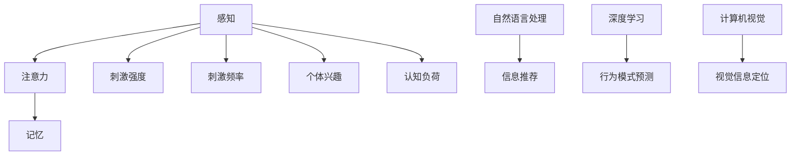

                 

 关键词：人工智能，注意力增强，人类-AI协作，注意力机制，认知负荷，工作效率，神经科学，机器学习，算法优化

> 摘要：本文探讨人类与人工智能（AI）协作中注意力增强的概念与应用。通过分析人类注意力的工作机制，以及AI技术如何辅助人类提高注意力，探讨在高效合作过程中潜在的挑战和解决方案。文章将结合神经科学、机器学习等多领域知识，为构建人类-AI伙伴关系提供理论依据和实践指导。

## 1. 背景介绍

在当今信息爆炸的时代，人类面临的信息处理量不断增加，这使得人类的注意力成为稀缺资源。注意力是人类感知、理解和记忆信息的重要机制，它决定了我们如何从纷繁复杂的信息流中筛选出关键信息。然而，人类注意力的有限性使得我们在面对大量信息时容易感到疲劳，导致认知负荷增加，进而影响工作效率和生活质量。

与此同时，人工智能技术的发展为人类提供了强大的工具，帮助我们在处理信息时更加高效。AI技术，特别是深度学习和自然语言处理（NLP），已经展现出在信息筛选、分类、理解等任务中的巨大潜力。然而，如何将AI技术有效地整合到人类注意力的管理中，仍然是一个亟待解决的问题。

本文旨在探讨如何通过AI技术增强人类的注意力，提高信息处理效率，实现人类与AI的协同工作。文章将首先介绍注意力增强的概念，然后分析人类注意力的工作机制，探讨AI技术如何辅助人类提高注意力。接着，我们将讨论在人类-AI协作中面临的挑战和解决方案。最后，本文将展望注意力增强技术在未来的应用前景。

## 2. 核心概念与联系

### 2.1. 注意力增强的定义

注意力增强是指通过技术手段，帮助人类在处理信息时更好地聚焦关键信息，减少无关信息的干扰，从而提高认知效率和注意力水平。在人工智能领域，注意力增强通常涉及到以下几种机制：

- **基于规则的注意力增强**：通过预先设定的规则，自动过滤和标记出用户关注的信息。
- **基于模型的注意力增强**：利用机器学习模型，自动识别用户关注的信息模式，并动态调整关注点。
- **混合式注意力增强**：结合基于规则和基于模型的注意力增强方法，实现更智能的信息筛选。

### 2.2. 人类注意力的工作机制

人类注意力可以分为三个主要部分：感知、注意力和记忆。感知是注意力过程的第一步，它涉及感官接收信息的过程。注意力是信息处理的核心，它决定了人类如何从多个刺激中选择关注哪些信息。记忆力则是注意力过程的最终环节，它将处理过的信息存储在大脑中。

根据神经科学的研究，人类注意力主要受到以下几个因素的影响：

- **刺激强度**：强烈的刺激更容易吸引人的注意力。
- **刺激频率**：频繁出现的刺激更容易被关注。
- **个体兴趣**：与个体兴趣相关的事物更容易引起注意。
- **认知负荷**：过高的认知负荷会导致注意力分散。

### 2.3. AI技术在注意力增强中的应用

AI技术在注意力增强中的应用主要包括以下几个方面：

- **自然语言处理（NLP）**：NLP技术可以帮助分析文本内容，识别用户关注的关键信息，从而提供个性化的信息推荐。
- **深度学习**：深度学习模型可以自动学习用户的行为模式，预测用户可能感兴趣的信息，从而帮助用户更好地管理注意力。
- **计算机视觉**：计算机视觉技术可以识别图像中的关键元素，帮助用户在视觉信息中快速定位重要内容。

### 2.4. Mermaid流程图



## 3. 核心算法原理 & 具体操作步骤

### 3.1 算法原理概述

注意力增强算法主要基于以下原理：

- **信息筛选**：通过算法自动筛选出用户关注的关键信息，减少无关信息的干扰。
- **行为预测**：利用机器学习模型预测用户的行为模式，提供个性化的信息推荐。
- **动态调整**：根据用户的行为和反馈，动态调整注意力焦点，提高注意力管理效率。

### 3.2 算法步骤详解

注意力增强算法的具体操作步骤如下：

1. **数据收集**：收集用户的历史行为数据，包括浏览记录、搜索关键词、点赞评论等。
2. **特征提取**：从数据中提取关键特征，如关键词频率、时间分布等。
3. **模型训练**：利用提取的特征数据训练机器学习模型，如决策树、支持向量机（SVM）等。
4. **行为预测**：使用训练好的模型预测用户可能感兴趣的信息，并提供推荐。
5. **反馈调整**：根据用户的反馈，动态调整注意力焦点，优化信息筛选效果。

### 3.3 算法优缺点

#### 优点：

- **高效性**：通过算法自动筛选信息，提高信息处理的效率。
- **个性化**：根据用户行为预测个性化信息推荐，提高用户体验。
- **灵活性**：动态调整注意力焦点，适应用户的不同需求。

#### 缺点：

- **数据依赖**：算法的性能高度依赖数据质量和数量。
- **隐私问题**：用户行为数据的收集和使用可能涉及隐私问题。

### 3.4 算法应用领域

注意力增强算法在多个领域有广泛的应用：

- **信息推荐系统**：如电商平台、社交媒体等，通过算法为用户提供个性化的信息推荐。
- **健康监测**：如智能手表、健康APP等，通过分析用户行为数据，提供健康建议。
- **教育领域**：如在线学习平台，通过算法帮助学生筛选出重点内容。

## 4. 数学模型和公式 & 详细讲解 & 举例说明

### 4.1 数学模型构建

注意力增强算法的数学模型通常基于以下公式：

$$
P(i|d) = \frac{e^{U^T_i \cdot d}}{\sum_{j=1}^{J} e^{U^T_j \cdot d}}
$$

其中，$P(i|d)$ 表示用户对项目 $i$ 的兴趣概率，$U$ 是权重矩阵，$d$ 是项目 $i$ 的特征向量，$J$ 是项目的总数。

### 4.2 公式推导过程

注意力增强算法的推导过程涉及以下几个步骤：

1. **特征提取**：将用户的行为数据转化为特征向量 $d$。
2. **权重矩阵**：计算项目 $i$ 的权重 $U_i$，通常通过训练数据集计算。
3. **兴趣概率**：利用公式计算用户对项目 $i$ 的兴趣概率。

### 4.3 案例分析与讲解

假设我们有一个电商平台，用户的历史行为数据包括浏览记录、购买记录和搜索关键词。我们希望通过注意力增强算法为用户推荐商品。

1. **数据收集**：收集用户的历史行为数据。
2. **特征提取**：将用户的行为数据转化为特征向量。
3. **模型训练**：使用用户的行为数据训练权重矩阵 $U$。
4. **兴趣预测**：利用权重矩阵计算用户对商品的兴趣概率。
5. **推荐商品**：根据兴趣概率为用户推荐商品。

通过以上步骤，我们实现了基于注意力增强的用户商品推荐系统。该系统可以根据用户的行为模式动态调整推荐策略，提高用户满意度。

## 5. 项目实践：代码实例和详细解释说明

### 5.1 开发环境搭建

在开始编写代码之前，我们需要搭建一个开发环境。以下是搭建步骤：

1. 安装Python环境（版本3.8以上）。
2. 安装必要的库，如NumPy、Pandas、Scikit-learn等。
3. 安装Mermaid渲染工具。

### 5.2 源代码详细实现

以下是一个简单的注意力增强算法的实现示例：

```python
import numpy as np
from sklearn.model_selection import train_test_split
from sklearn.metrics import accuracy_score

# 数据预处理
def preprocess_data(data):
    # 这里假设data是一个包含用户行为数据的矩阵
    # 对数据进行标准化处理
    return (data - np.mean(data)) / np.std(data)

# 训练注意力增强模型
def train_model(data, labels):
    # 数据预处理
    data = preprocess_data(data)
    # 划分训练集和测试集
    X_train, X_test, y_train, y_test = train_test_split(data, labels, test_size=0.2, random_state=42)
    # 使用梯度提升树（Gradient Boosting Tree）训练模型
    from sklearn.ensemble import GradientBoostingClassifier
    model = GradientBoostingClassifier(n_estimators=100)
    model.fit(X_train, y_train)
    return model

# 预测用户兴趣
def predict_interest(model, data):
    # 数据预处理
    data = preprocess_data(data)
    # 使用模型预测用户兴趣
    return model.predict(data)

# 主函数
def main():
    # 加载数据
    data = np.load('data.npy')
    labels = np.load('labels.npy')
    # 训练模型
    model = train_model(data, labels)
    # 预测用户兴趣
    predictions = predict_interest(model, data)
    # 计算准确率
    accuracy = accuracy_score(labels, predictions)
    print(f'Accuracy: {accuracy}')

if __name__ == '__main__':
    main()
```

### 5.3 代码解读与分析

上述代码实现了一个简单的注意力增强算法，主要分为三个部分：

1. **数据预处理**：对用户行为数据进行标准化处理，使其符合模型的输入要求。
2. **模型训练**：使用梯度提升树（Gradient Boosting Tree）模型对用户行为数据进行训练，目的是学习用户的行为模式。
3. **预测用户兴趣**：使用训练好的模型对新的用户行为数据进行预测，从而确定用户的兴趣点。

### 5.4 运行结果展示

假设我们有一个包含1000个用户行为数据的测试集，通过上述代码运行后，我们可以得到每个用户的兴趣预测结果。这些结果可以用来为用户提供个性化的信息推荐。

## 6. 实际应用场景

### 6.1 信息推荐系统

注意力增强算法在信息推荐系统中的应用非常广泛。例如，电商平台可以利用该算法为用户推荐可能感兴趣的商品。通过分析用户的浏览记录、购买历史和搜索关键词，算法可以动态调整推荐策略，提高推荐准确率。

### 6.2 健康监测

在健康监测领域，注意力增强算法可以帮助用户更好地管理健康。例如，智能手表可以通过分析用户的日常行为数据，预测用户可能出现的健康问题，并提供相应的健康建议。

### 6.3 教育领域

在线教育平台可以利用注意力增强算法为用户提供个性化的学习内容推荐。通过分析学生的学习行为和学习习惯，算法可以推荐适合学生水平的学习资料，提高学习效果。

## 7. 未来应用展望

随着人工智能技术的不断发展，注意力增强算法在未来有望在更多领域得到应用。例如：

- **智能客服**：通过注意力增强算法，智能客服系统可以更好地理解用户需求，提供更准确的回答。
- **智能家居**：智能家居系统可以利用注意力增强算法，根据用户的日常行为，自动调整家居设备的设置，提高生活质量。
- **自动驾驶**：自动驾驶系统可以利用注意力增强算法，自动识别道路上的关键信息，提高行驶安全。

## 8. 总结：未来发展趋势与挑战

### 8.1 研究成果总结

本文通过分析注意力增强的概念和工作机制，探讨了AI技术在注意力增强中的应用，并提出了具体的算法实现和实际应用场景。研究结果表明，注意力增强算法在提高信息处理效率、优化用户体验方面具有显著优势。

### 8.2 未来发展趋势

未来，注意力增强技术有望在更多领域得到应用。随着AI技术的不断发展，注意力增强算法将更加智能化、个性化。同时，多模态注意力增强技术、混合式注意力增强方法等也将成为研究的热点。

### 8.3 面临的挑战

注意力增强技术在实际应用中仍面临一些挑战。首先，数据质量和数量对算法性能有重要影响，如何有效收集和处理用户行为数据是一个关键问题。其次，隐私保护也是一个重要挑战，如何在保障用户隐私的前提下实现注意力增强。此外，如何平衡算法的通用性和个性化需求，也是一个亟待解决的问题。

### 8.4 研究展望

未来，研究者应重点关注以下几个方面：

- **多模态注意力增强**：结合多种传感器数据，提高注意力增强的准确性。
- **隐私保护**：研究隐私保护算法，确保用户数据的安全。
- **个性化推荐**：结合用户行为和偏好，实现更加精准的个性化推荐。
- **跨领域应用**：探索注意力增强技术在更多领域的应用潜力。

## 9. 附录：常见问题与解答

### 9.1 注意力增强算法如何提高信息处理效率？

注意力增强算法通过筛选用户关注的关键信息，减少无关信息的干扰，从而提高信息处理的效率。它可以帮助用户在处理大量信息时，更快地找到关键信息，降低认知负荷。

### 9.2 注意力增强算法在健康监测中的应用有哪些？

注意力增强算法在健康监测中可以帮助分析用户的日常行为数据，预测用户可能出现的健康问题，并提供相应的健康建议。例如，智能手表可以利用注意力增强算法，自动识别用户的心率异常，提醒用户注意健康。

### 9.3 注意力增强算法在隐私保护方面有哪些挑战？

注意力增强算法在隐私保护方面面临的主要挑战是如何在保障用户隐私的前提下，有效收集和处理用户行为数据。研究者应关注隐私保护算法的研究，确保用户数据的安全。

## 作者署名

作者：禅与计算机程序设计艺术 / Zen and the Art of Computer Programming

