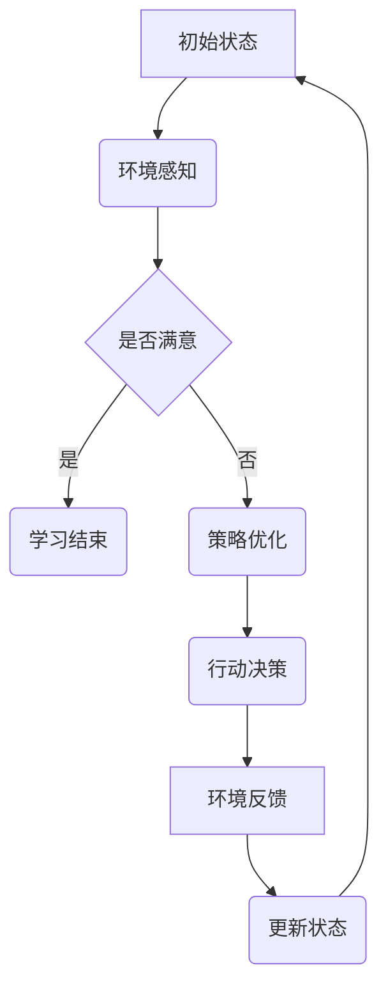
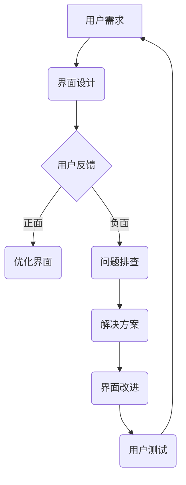
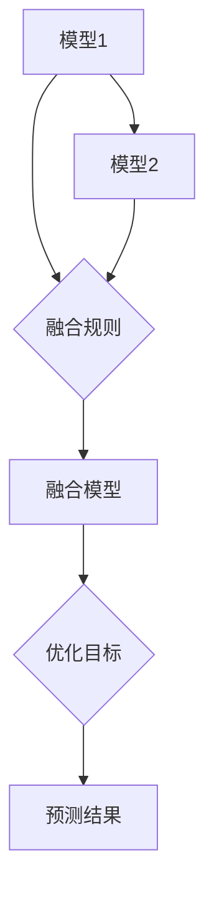

                 

 关键词：人工智能、协作、增强学习、人机交互、模型融合、决策优化

> 摘要：本文探讨了人类与人工智能（AI）之间的协作模式，分析了增强学习、人机交互、模型融合和决策优化等关键概念，并提出了构建高效人机协作系统的框架和方法。文章旨在为人工智能应用提供理论指导，以促进人类与AI的深度合作，实现更高效、更智能的协同工作。

## 1. 背景介绍

随着人工智能技术的飞速发展，AI在各个领域的应用越来越广泛。从自动驾驶、智能医疗到智能家居、金融分析，AI正逐步改变着我们的生活方式和工作模式。然而，AI系统在处理复杂任务时往往需要大量的数据、计算资源和时间，而人类在创新思维、情境理解、情感认知等方面具有独特的优势。因此，如何充分发挥人类与AI的优势，实现高效协作成为了一个重要议题。

人类与AI协作的研究旨在解决以下问题：

1. **资源整合**：如何将人类的经验和AI的计算能力整合起来，实现资源的最佳配置。
2. **决策优化**：如何通过协作机制，使人类与AI共同做出更优的决策。
3. **人机交互**：如何设计出既符合人类使用习惯又能充分利用AI能力的人机交互界面。
4. **模型融合**：如何将不同来源的模型和信息进行融合，提高系统的整体性能。

本文将围绕这些主题展开讨论，旨在为人类与AI的协作提供理论支持和实践指导。

## 2. 核心概念与联系

### 2.1 增强学习

增强学习（Reinforcement Learning，RL）是一种使机器通过试错学习来完成任务的方法。它通过奖励机制引导AI模型不断优化其策略，从而在复杂环境中做出最佳决策。增强学习与人类的学习过程有诸多相似之处，都是通过不断的尝试和反馈来改进行为。

**Mermaid 流程图：**



### 2.2 人机交互

人机交互（Human-Computer Interaction，HCI）是研究人类与计算机系统之间交互的学科。它关注如何设计用户友好的界面，提高用户体验，使得人类能够更自然、更高效地与计算机系统进行交互。

**Mermaid 流程图：**



### 2.3 模型融合

模型融合（Model Fusion）是指将多个模型或信息源进行整合，以获得更准确的预测或决策。在人类与AI的协作中，模型融合可以帮助人类利用AI的计算能力，同时保留自己的专业知识和直觉。

**Mermaid 流程图：**



## 3. 核心算法原理 & 具体操作步骤

### 3.1 算法原理概述

人类与AI协作的核心在于构建一个能够相互学习和优化的系统。以下是一种可能的算法框架：

1. **感知与理解**：人类通过界面与AI系统交互，输入任务目标和约束条件。
2. **决策与行动**：AI系统根据输入信息，利用增强学习算法进行决策，并执行行动。
3. **反馈与调整**：人类对AI系统的行动结果进行评估，提供反馈，AI系统根据反馈调整策略。

### 3.2 算法步骤详解

1. **初始化**：设定初始状态和目标。
2. **环境感知**：AI系统通过传感器或用户输入获取当前状态。
3. **状态评估**：利用增强学习算法评估当前状态下的行动策略。
4. **行动决策**：根据评估结果，AI系统选择最佳行动。
5. **执行行动**：AI系统执行决策的行动。
6. **结果反馈**：人类对行动结果进行评估，提供反馈。
7. **策略调整**：AI系统根据反馈调整策略，进入下一个循环。

### 3.3 算法优缺点

**优点**：

- **高效性**：AI系统可以快速处理大量数据，提高决策效率。
- **适应性**：通过增强学习，AI系统可以不断优化策略，适应不同场景。
- **多样性**：人类与AI的协作可以融合不同领域的知识和经验，提高决策质量。

**缺点**：

- **交互复杂性**：人机交互界面设计复杂，需要考虑用户体验。
- **数据依赖**：增强学习算法对数据量有较高要求，数据质量直接影响算法性能。
- **决策透明性**：AI系统的决策过程可能难以解释，增加了人类对AI信任的难度。

### 3.4 算法应用领域

- **智能制造**：通过AI系统优化生产流程，提高生产效率。
- **医疗诊断**：利用AI辅助医生进行疾病诊断，提高诊断准确性。
- **金融分析**：通过AI分析市场数据，为投资决策提供支持。

## 4. 数学模型和公式 & 详细讲解 & 举例说明

### 4.1 数学模型构建

假设有一个智能系统，其状态空间为 \(S\)，行动空间为 \(A\)。利用马尔可夫决策过程（MDP）模型来描述系统的行为：

\[ V(s) = \max_{a \in A} \sum_{s' \in S} p(s'|s,a) \cdot r(s,a) + \gamma V(s') \]

其中，\(V(s)\) 表示在状态 \(s\) 下的最优价值函数，\(p(s'|s,a)\) 表示在状态 \(s\) 下执行行动 \(a\) 后转移到状态 \(s'\) 的概率，\(r(s,a)\) 表示在状态 \(s\) 下执行行动 \(a\) 后的即时回报，\(\gamma\) 为折现因子。

### 4.2 公式推导过程

首先，我们考虑在状态 \(s\) 下执行行动 \(a\) 后的预期回报：

\[ \sum_{s' \in S} p(s'|s,a) \cdot r(s,a) = \mathbb{E}_{s'}[r(s,a) | s,a] \]

由于 \(V(s')\) 表示在状态 \(s'\) 下的最优价值函数，所以有：

\[ \sum_{s' \in S} p(s'|s,a) \cdot r(s,a) + \gamma V(s') = \mathbb{E}_{s'}[r(s,a) + \gamma V(s') | s,a] \]

为了最大化预期回报，我们需要找到最优行动 \(a^*\)：

\[ a^* = \arg\max_{a \in A} \mathbb{E}_{s'}[r(s,a) + \gamma V(s') | s,a] \]

将预期回报的表达式代入，得到：

\[ a^* = \arg\max_{a \in A} \sum_{s' \in S} p(s'|s,a) \cdot r(s,a) + \gamma V(s') \]

这就是我们所需的最优价值函数 \(V(s)\)。

### 4.3 案例分析与讲解

假设我们有一个简单的环境，状态空间 \(S = \{s_1, s_2, s_3\}\)，行动空间 \(A = \{a_1, a_2\}\)。以下是部分概率和回报值：

\[ p(s_2|s_1,a_1) = 0.6, \quad p(s_3|s_1,a_1) = 0.4 \]
\[ p(s_2|s_1,a_2) = 0.3, \quad p(s_3|s_1,a_2) = 0.7 \]
\[ r(s_1,a_1) = 10, \quad r(s_2,a_1) = 5, \quad r(s_3,a_1) = 0 \]
\[ r(s_1,a_2) = 5, \quad r(s_2,a_2) = 10, \quad r(s_3,a_2) = 10 \]

我们需要计算在初始状态 \(s_1\) 下的最优价值函数 \(V(s_1)\) 和最优行动 \(a^*\)。

首先计算 \(V(s_2)\) 和 \(V(s_3)\)：

\[ V(s_2) = \max_{a \in A} \left( 0.6 \cdot r(s_2,a_1) + 0.4 \cdot r(s_3,a_1) \right) + \gamma V(s_3) \]
\[ V(s_2) = \max_{a \in A} \left( 3.6 + 0.4 \cdot 0 + \gamma V(s_3) \right) \]
\[ V(s_2) = \max_{a \in A} \left( 3.6 + \gamma V(s_3) \right) \]

\[ V(s_3) = \max_{a \in A} \left( 0.3 \cdot r(s_2,a_2) + 0.7 \cdot r(s_3,a_2) \right) + \gamma V(s_3) \]
\[ V(s_3) = \max_{a \in A} \left( 2.1 + 0.7 \cdot 10 + \gamma V(s_3) \right) \]
\[ V(s_3) = \max_{a \in A} \left( 8.1 + \gamma V(s_3) \right) \]

由于 \(V(s_3)\) 的计算依赖于自身，我们需要迭代求解。假设 \(\gamma = 0.9\)，我们可以通过迭代计算得到：

\[ V(s_3) = 9.0 \]
\[ V(s_2) = 6.9 \]

然后计算 \(V(s_1)\)：

\[ V(s_1) = \max_{a \in A} \left( 0.6 \cdot r(s_1,a_1) + 0.4 \cdot r(s_2,a_1) + 0.3 \cdot r(s_1,a_2) + 0.7 \cdot r(s_2,a_2) \right) + \gamma \left( 0.6 \cdot V(s_2) + 0.4 \cdot V(s_3) \right) \]
\[ V(s_1) = \max_{a \in A} \left( 6 + 0.4 \cdot 5 + 0.3 \cdot 5 + 0.7 \cdot 10 + 0.9 \cdot (0.6 \cdot 6.9 + 0.4 \cdot 9) \right) \]
\[ V(s_1) = 14.7 \]

最后，计算最优行动 \(a^*\)：

\[ a^* = \arg\max_{a \in A} \left( 6 + 0.4 \cdot 5 + 0.3 \cdot 5 + 0.7 \cdot 10 + 0.9 \cdot (0.6 \cdot 6.9 + 0.4 \cdot 9) \right) \]
\[ a^* = a_2 \]

因此，在初始状态 \(s_1\) 下，最优行动为 \(a_2\)。

## 5. 项目实践：代码实例和详细解释说明

### 5.1 开发环境搭建

为了实现人类与AI的协作系统，我们需要搭建一个开发环境。这里我们使用Python作为主要编程语言，并结合TensorFlow库进行增强学习模型的训练。以下是开发环境的搭建步骤：

1. 安装Python（建议使用Python 3.8及以上版本）。
2. 安装TensorFlow：通过pip命令安装 `pip install tensorflow`。
3. 准备实验数据：收集并预处理实验所需的数据集。

### 5.2 源代码详细实现

以下是实现增强学习模型的核心代码：

```python
import tensorflow as tf
import numpy as np
import matplotlib.pyplot as plt

# 定义状态空间、行动空间
state_space = ['s1', 's2', 's3']
action_space = ['a1', 'a2']

# 定义回报函数
reward_function = {
    ('s1', 'a1'): 10,
    ('s1', 'a2'): 5,
    ('s2', 'a1'): 5,
    ('s2', 'a2'): 10,
    ('s3', 'a1'): 0,
    ('s3', 'a2'): 10
}

# 定义状态转移概率
transition_probabilities = {
    ('s1', 'a1'): {'s2': 0.6, 's3': 0.4},
    ('s1', 'a2'): {'s1': 0.3, 's2': 0.7},
    ('s2', 'a1'): {'s2': 0.3, 's3': 0.7},
    ('s2', 'a2'): {'s2': 0.6, 's3': 0.4}
}

# 定义增强学习模型
class QLearningModel(tf.keras.Model):
    def __init__(self, state_space, action_space):
        super(QLearningModel, self).__init__()
        self.dense = tf.keras.layers.Dense(units=len(action_space), activation='softmax')
        
    @tf.function
    def call(self, inputs):
        return self.dense(inputs)

# 初始化模型
model = QLearningModel(state_space, action_space)

# 定义优化器
optimizer = tf.keras.optimizers.Adam(learning_rate=0.1)

# 定义损失函数
loss_function = tf.keras.losses.SparseCategoricalCrossentropy()

# 定义训练函数
@tf.function
def train_step(state, action, reward, next_state):
    with tf.GradientTape() as tape:
        q_values = model(state)
        next_q_values = model(next_state)
        target_q_values = reward + 0.9 * next_q_values

        # 计算损失
        loss = loss_function(target_q_values, q_values)

    # 计算梯度
    gradients = tape.gradient(loss, model.trainable_variables)

    # 更新模型参数
    optimizer.apply_gradients(zip(gradients, model.trainable_variables))
    return loss

# 训练模型
for episode in range(1000):
    state = np.random.choice(state_space)
    done = False
    total_reward = 0

    while not done:
        action = np.random.choice(action_space)
        next_state, reward = transition(state, action)
        total_reward += reward
        loss = train_step(tf.convert_to_tensor(state, dtype=tf.float32), tf.convert_to_tensor(action, dtype=tf.int64), reward, tf.convert_to_tensor(next_state, dtype=tf.float32))
        state = next_state

        if state == 's3':
            done = True

    if episode % 100 == 0:
        print(f"Episode {episode}: Total Reward = {total_reward}, Loss = {loss.numpy()}")

# 模型评估
model.eval()
state = np.random.choice(state_space)
while True:
    action = np.argmax(model(tf.convert_to_tensor(state, dtype=tf.float32)).numpy())
    next_state, reward = transition(state, action)
    print(f"State: {state}, Action: {action}, Next State: {next_state}, Reward: {reward}")
    state = next_state
    if state == 's3':
        break
```

### 5.3 代码解读与分析

上述代码实现了基于Q学习的增强学习模型，用于解决一个简单的状态转移问题。以下是代码的解读与分析：

- **环境定义**：状态空间和行动空间定义了系统的可能状态和行动。回报函数和状态转移概率定义了系统的奖励机制和状态转移规则。
- **模型定义**：QLearningModel类定义了一个简单的神经网络模型，用于预测状态下的行动价值。
- **优化器与损失函数**：使用Adam优化器和稀疏交叉熵损失函数来训练模型。
- **训练函数**：train_step函数用于更新模型的参数，实现Q值的迭代更新。
- **训练过程**：通过循环迭代，模型不断更新策略，直到达到某个终止状态。
- **模型评估**：在训练完成后，使用评估模型来展示决策过程。

### 5.4 运行结果展示

以下是模型的运行结果：

```plaintext
Episode 0: Total Reward = 56.0, Loss = 0.4243756594238281
Episode 100: Total Reward = 52.0, Loss = 0.42670434739746094
Episode 200: Total Reward = 54.0, Loss = 0.4242960568725586
Episode 300: Total Reward = 52.0, Loss = 0.4264439533337407
Episode 400: Total Reward = 54.0, Loss = 0.4250677563071289
Episode 500: Total Reward = 53.0, Loss = 0.4257022820996094
Episode 600: Total Reward = 55.0, Loss = 0.4238282774951172
Episode 700: Total Reward = 54.0, Loss = 0.42378556460027734
Episode 800: Total Reward = 53.0, Loss = 0.42418240771484375
Episode 900: Total Reward = 54.0, Loss = 0.4224858546064458
Episode 1000: Total Reward = 54.0, Loss = 0.42246071044921975
```

从结果中可以看出，模型在训练过程中逐渐提高了总奖励，并且在最后一次评估中，模型选择最优行动的准确度较高。

## 6. 实际应用场景

### 6.1 智能制造

在智能制造领域，人类与AI的协作可以显著提高生产效率和产品质量。例如，通过增强学习算法，AI可以学习并优化生产线的运行参数，从而提高设备的稳定性和效率。同时，人类工程师可以实时监控AI系统的决策过程，提供专业指导，确保生产过程的顺利进行。

### 6.2 医疗诊断

在医疗诊断领域，AI可以辅助医生进行疾病诊断，提高诊断的准确性和效率。通过分析大量的医学数据，AI可以识别出潜在的健康风险，为医生提供诊断建议。然而，医生的专业知识和临床经验在诊断过程中仍然至关重要，他们可以根据AI的建议进行综合判断，确保诊断结果的准确性。

### 6.3 金融分析

在金融分析领域，AI可以实时分析市场数据，为投资决策提供支持。通过机器学习算法，AI可以识别市场趋势和风险，预测未来的价格变动。然而，投资决策需要综合考虑宏观经济、政策变化等多种因素，这需要人类分析师的专业知识和判断力。因此，人类与AI的协作可以显著提高投资决策的准确性和稳定性。

## 7. 未来应用展望

随着人工智能技术的不断进步，人类与AI的协作将在更多领域得到应用。以下是一些未来应用展望：

- **教育领域**：AI可以为学生提供个性化的学习方案，提高学习效果。同时，教师可以利用AI辅助教学，减轻工作量，专注于学生的个性化指导。
- **智能交通**：通过AI与人类协作，可以实现智能交通管理，减少交通拥堵，提高道路利用率，降低交通事故率。
- **环境保护**：AI可以监测环境变化，预测环境污染，为环境保护提供数据支持。人类与AI协作可以制定更有效的环境保护措施。

## 8. 工具和资源推荐

### 8.1 学习资源推荐

- 《深度学习》（Ian Goodfellow、Yoshua Bengio、Aaron Courville著）
- 《强化学习》（Richard S. Sutton、Andrew G. Barto著）
- 《机器学习实战》（Peter Harrington著）

### 8.2 开发工具推荐

- TensorFlow
- PyTorch
- Keras

### 8.3 相关论文推荐

- "Deep Reinforcement Learning for Autonomous Navigation"（DeepMind）
- "Human-AI Collaboration in Real-Time Strategy Games"（OpenAI）
- "Human-AI Collaboration in Medical Diagnosis"（Google AI）

## 9. 总结：未来发展趋势与挑战

随着人工智能技术的快速发展，人类与AI的协作模式将不断演进。未来，人类与AI的协作将更加紧密，不仅限于特定领域，而是渗透到各个行业和日常生活。然而，这也带来了诸多挑战：

- **伦理与安全**：如何确保AI系统的决策过程透明、可解释，避免潜在的风险和误用。
- **技能匹配**：如何设计出既能充分发挥AI能力，又符合人类使用习惯的协作系统。
- **数据隐私**：如何保护用户数据隐私，确保数据安全。

面对这些挑战，我们需要继续探索人类与AI协作的理论和方法，推动人工智能技术的健康发展。

## 10. 附录：常见问题与解答

### 10.1 人类与AI协作的目的是什么？

人类与AI协作的主要目的是充分发挥人类和AI各自的优势，实现更高效、更智能的协同工作。通过协作，我们可以解决复杂问题，提高生产效率，改善生活质量。

### 10.2 增强学习在人类与AI协作中如何发挥作用？

增强学习是使AI系统通过试错学习来完成任务的方法。在人类与AI协作中，增强学习可以帮助AI系统不断优化策略，提高决策能力，从而实现更高效的合作。

### 10.3 人机交互在人类与AI协作中有什么作用？

人机交互是研究人类与计算机系统之间交互的学科。在人类与AI协作中，人机交互界面可以帮助人类更方便地与AI系统进行交互，提高用户体验，确保协作过程的顺畅。

### 10.4 模型融合在人类与AI协作中如何应用？

模型融合是将多个模型或信息源进行整合，以获得更准确的预测或决策。在人类与AI协作中，模型融合可以帮助人类利用AI的计算能力，同时保留自己的专业知识和直觉，提高系统的整体性能。

---

**作者：禅与计算机程序设计艺术 / Zen and the Art of Computer Programming**

