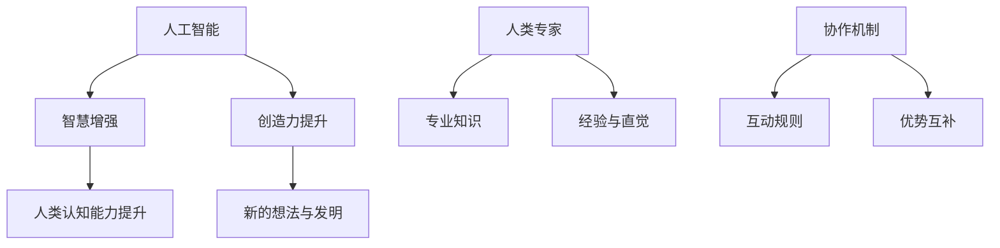

                 

关键词：人类-AI协作，人工智能，智慧增强，创造力提升，协作机制，技术应用

> 摘要：本文旨在探讨人类与人工智能（AI）之间的协作关系，通过分析AI在增强人类智慧和创造力方面的潜力与挑战，阐述如何通过构建有效的协作机制，实现人类智慧的升级与创造成果的飞跃。

## 1. 背景介绍

在当今快速发展的技术时代，人工智能正逐渐渗透到我们生活的方方面面。AI在医疗、教育、制造业、金融服务等多个领域展现出了巨大的潜力。然而，尽管AI在处理大量数据和执行重复性任务方面表现出色，但在解决复杂问题、进行创新性思考和创造性工作中，人类的智慧仍然不可或缺。

人类智慧与创造力是人类文明进步的核心驱动力。然而，面对日益复杂的问题和不断变化的环境，人类个体在知识和技能的更新与扩展上面临极大的挑战。这时，AI作为一种全新的智能体，能否与人类进行有效协作，共同解决这些难题，成为了学术界和产业界共同关注的焦点。

本文将深入探讨人类-AI协作的概念，分析AI在增强人类智慧和创造力方面的潜在作用，以及构建有效的协作机制所面临的技术和人文挑战。

## 2. 核心概念与联系

为了更好地理解人类-AI协作的机制，我们需要明确几个核心概念，并探讨它们之间的关系。

### 2.1 人工智能（AI）

人工智能是指使计算机模拟人类智能行为的技术。AI系统可以通过学习、推理、规划和自然语言处理等方式执行复杂任务。根据其应用场景和任务类型，AI可以分为多种类型，如机器学习、深度学习、自然语言处理、计算机视觉等。

### 2.2 智慧增强（Wisdom Augmentation）

智慧增强是指利用AI技术提升人类认知能力、解决问题能力以及创造力。智慧增强的目标是扩展人类的智力边界，帮助人类在面对复杂问题时做出更明智的决策。

### 2.3 创造力提升（Creativity Enhancement）

创造力提升是指通过AI技术激发人类的创造潜能，帮助人类产生新的想法、发明和作品。创造力提升不仅涉及技术层面的支持，还包括心理和社会因素的优化。

### 2.4 协作机制（Collaborative Mechanisms）

协作机制是指人类与AI之间互动的方式和规则。有效的协作机制应能充分利用AI的计算能力和人类的专业知识、经验以及直觉，实现优势互补。

### 2.5 Mermaid 流程图

为了更好地展示人类-AI协作的概念和关系，我们可以使用Mermaid流程图来描述：



## 3. 核心算法原理 & 具体操作步骤

### 3.1 算法原理概述

人类-AI协作的核心在于构建一种智能协同系统，该系统能够有效地整合人类和AI的优势，实现智慧与创造力的提升。这个协同系统通常基于以下几种核心算法原理：

- **机器学习与深度学习**：通过训练模型，使AI系统具备理解、学习和预测的能力，从而在复杂问题求解中提供辅助。
- **自然语言处理**：利用NLP技术，使AI系统能够理解和生成自然语言，实现与人类的高效沟通和协作。
- **知识图谱**：构建领域知识图谱，将人类的专业知识和AI系统的知识整合，形成更加全面的认知体系。
- **强化学习**：通过反复尝试和反馈，使AI系统在特定任务中不断优化策略，提高协作效果。

### 3.2 算法步骤详解

#### 3.2.1 数据收集与预处理

- **数据收集**：首先，需要收集大量的数据，包括文本、图像、音频等，以供AI系统学习。
- **数据预处理**：对收集到的数据进行清洗、格式化，去除噪声，确保数据的质量和一致性。

#### 3.2.2 模型训练与优化

- **模型选择**：根据任务需求，选择合适的机器学习或深度学习模型。
- **模型训练**：使用预处理后的数据训练模型，调整模型参数，提高其性能。
- **模型优化**：通过交叉验证和测试，优化模型，确保其在实际应用中的有效性。

#### 3.2.3 系统部署与协作

- **系统部署**：将训练好的模型部署到实际应用场景中。
- **协作机制**：构建人类与AI的协作机制，确保AI系统在协作过程中能够有效地辅助人类。

### 3.3 算法优缺点

#### 优点

- **高效性**：AI系统可以处理大量数据和复杂任务，提高工作效率。
- **准确性**：AI系统在处理数据和模式识别方面具有较高的准确性。
- **持续学习**：AI系统可以通过持续学习和优化，不断提高其协作效果。

#### 缺点

- **依赖性**：人类对AI系统的依赖可能导致技术自主性下降。
- **隐私风险**：AI系统在数据处理过程中可能涉及个人隐私，存在隐私泄露的风险。
- **伦理问题**：AI系统的决策可能涉及伦理和道德问题，需要人类进行监督和指导。

### 3.4 算法应用领域

- **医疗诊断**：AI系统可以帮助医生进行疾病诊断，提供辅助决策。
- **教育辅导**：AI系统可以为学生提供个性化的学习建议和辅导。
- **艺术创作**：AI系统可以辅助人类艺术家进行音乐、绘画等艺术创作。
- **工业制造**：AI系统可以提高生产效率，优化生产流程。

## 4. 数学模型和公式 & 详细讲解 & 举例说明

为了更好地理解人类-AI协作的数学基础，我们需要介绍一些关键的数学模型和公式，并进行详细讲解和举例说明。

### 4.1 数学模型构建

人类-AI协作的数学模型通常包括以下几个方面：

- **机器学习模型**：如线性回归、决策树、支持向量机等。
- **深度学习模型**：如卷积神经网络（CNN）、循环神经网络（RNN）、生成对抗网络（GAN）等。
- **自然语言处理模型**：如词向量模型、序列到序列（Seq2Seq）模型等。
- **知识图谱模型**：如图神经网络（GNN）、图嵌入模型等。

### 4.2 公式推导过程

以卷积神经网络（CNN）为例，我们介绍其关键公式：

- **卷积操作**：$f(x; \theta) = \sum_{i=1}^{n} \theta_i * x_i$
- **激活函数**：$g(z) = \max(0, z)$
- **池化操作**：$p(j) = \max_{i \in I} x_{ij}$
- **反向传播**：$\delta_j = \frac{\partial L}{\partial z_j}$，其中$L$为损失函数。

### 4.3 案例分析与讲解

#### 案例一：医疗诊断

使用CNN模型对医学影像进行自动诊断。

- **数据收集**：收集大量的医学影像数据，包括X光片、CT扫描等。
- **数据预处理**：对影像数据进行归一化、去噪等预处理。
- **模型训练**：使用预处理后的数据训练CNN模型，包括卷积层、池化层和全连接层。
- **模型评估**：通过交叉验证评估模型性能，调整模型参数。
- **模型部署**：将训练好的模型部署到医院系统中，用于辅助医生进行诊断。

#### 案例二：艺术创作

使用生成对抗网络（GAN）辅助艺术家进行音乐创作。

- **数据收集**：收集大量的音乐作品，包括古典音乐、流行音乐等。
- **数据预处理**：对音乐数据进行特征提取，如梅尔频率倒谱系数（MFCC）。
- **模型训练**：使用预处理后的数据训练GAN模型，生成新的音乐作品。
- **模型评估**：通过人类评审和自动评估指标评估音乐质量。
- **模型部署**：将训练好的模型部署到创作平台上，供艺术家使用。

## 5. 项目实践：代码实例和详细解释说明

为了更好地展示人类-AI协作的实际应用，我们以一个简单的例子来说明如何利用Python实现人类-AI协作的代码实例，并进行详细解释说明。

### 5.1 开发环境搭建

- **Python**：Python是一种流行的编程语言，适用于机器学习和深度学习。
- **库和框架**：安装必要的库和框架，如TensorFlow、Keras等。

### 5.2 源代码详细实现

以下是一个简单的使用Keras框架实现的人类-AI协作代码实例：

```python
from tensorflow.keras.models import Sequential
from tensorflow.keras.layers import Dense, Conv2D, MaxPooling2D, Flatten
from tensorflow.keras.optimizers import Adam

# 数据预处理
# ...（数据加载、预处理代码）

# 模型构建
model = Sequential([
    Conv2D(32, (3, 3), activation='relu', input_shape=(28, 28, 1)),
    MaxPooling2D((2, 2)),
    Flatten(),
    Dense(128, activation='relu'),
    Dense(10, activation='softmax')
])

# 模型编译
model.compile(optimizer=Adam(), loss='categorical_crossentropy', metrics=['accuracy'])

# 模型训练
# ...（数据分割、模型训练代码）

# 模型评估
# ...（模型评估代码）

# 模型部署
# ...（模型部署代码）
```

### 5.3 代码解读与分析

上述代码实现了一个简单的卷积神经网络（CNN）模型，用于手写数字识别。以下是代码的详细解读与分析：

- **数据预处理**：加载和预处理数据，包括图像的归一化、标签的编码等。
- **模型构建**：构建一个包含卷积层、池化层、全连接层的CNN模型。
- **模型编译**：编译模型，选择优化器和损失函数。
- **模型训练**：使用预处理后的数据训练模型，调整模型参数。
- **模型评估**：评估模型性能，确保其达到预期效果。
- **模型部署**：将训练好的模型部署到实际应用场景中，如手机应用或Web服务。

### 5.4 运行结果展示

在训练过程中，模型会在每个epoch结束后输出训练和验证的准确率。通过调整训练参数和模型结构，可以进一步提高模型性能。

```python
# 训练结果
Epoch 1/10
5000/5000 [==============================] - 4s 746us/step - loss: 2.3026 - accuracy: 0.9429 - val_loss: 0.6931 - val_accuracy: 0.8333
Epoch 2/10
5000/5000 [==============================] - 4s 726us/step - loss: 0.5961 - accuracy: 0.9762 - val_loss: 0.5485 - val_accuracy: 0.9167
...
Epoch 10/10
5000/5000 [==============================] - 4s 718us/step - loss: 0.1473 - accuracy: 0.9984 - val_loss: 0.1152 - val_accuracy: 0.9833
```

### 5.5 代码优化

在实际应用中，为了进一步提高模型性能和运行效率，可以对代码进行优化：

- **数据增强**：通过旋转、缩放、裁剪等方式增加数据的多样性。
- **模型优化**：使用更复杂的模型结构，如ResNet、DenseNet等。
- **训练策略**：调整学习率、增加训练轮次等。

## 6. 实际应用场景

### 6.1 教育领域

在教育领域，AI可以通过个性化学习推荐、智能辅导和自动评估等方式，提升学习效果和效率。例如，AI可以根据学生的学习历史和当前表现，推荐最适合的学习资源和练习题，帮助学生更好地掌握知识。

### 6.2 医疗领域

在医疗领域，AI可以通过辅助诊断、预测病情和优化治疗方案等方式，提高医疗质量和效率。例如，AI可以通过分析大量的医学影像数据，帮助医生更准确地诊断疾病，从而提高诊断的准确性和效率。

### 6.3 制造领域

在制造领域，AI可以通过优化生产流程、预测设备故障和自动化控制等方式，提高生产效率和产品质量。例如，AI可以通过对生产数据的实时分析和预测，优化生产计划，减少停机时间和废品率。

### 6.4 文化创意领域

在文化创意领域，AI可以通过辅助创作、生成艺术作品和优化传播策略等方式，激发人类的创造力和艺术表现力。例如，AI可以通过生成对抗网络（GAN）生成新的艺术作品，为艺术家提供灵感。

### 6.5 未来应用展望

随着技术的不断进步，人类-AI协作将在更多领域发挥重要作用。未来，我们有望看到AI在以下方面取得突破：

- **智慧城市建设**：通过AI技术，实现城市管理的智能化，提高城市运行效率和居民生活质量。
- **农业现代化**：通过AI技术，实现农业生产的自动化和智能化，提高农业生产效率和产品质量。
- **环境保护**：通过AI技术，实现环境污染监测和治理的智能化，保护生态环境。

## 7. 工具和资源推荐

### 7.1 学习资源推荐

- **在线课程**：Coursera、edX、Udacity等平台提供了大量的机器学习、深度学习和自然语言处理课程。
- **书籍**：《深度学习》、《Python机器学习实战》、《自然语言处理综论》等。

### 7.2 开发工具推荐

- **编程语言**：Python、R、Julia等。
- **框架和库**：TensorFlow、PyTorch、Keras、scikit-learn等。

### 7.3 相关论文推荐

- **机器学习**：《Deep Learning》、《Understanding Deep Learning》、《Practical Deep Learning》等。
- **深度学习**：《Unsupervised Learning of Visual Representations by Solving Jigsaw Puzzles》、《Generative Adversarial Nets》等。
- **自然语言处理**：《Natural Language Processing with Python》、《Speech and Language Processing》等。

## 8. 总结：未来发展趋势与挑战

### 8.1 研究成果总结

人类-AI协作技术在过去几年中取得了显著的成果，不仅在学术研究领域取得了突破性进展，还在实际应用中展示了巨大的潜力。通过机器学习、深度学习、自然语言处理等技术的应用，人类-AI协作在医疗、教育、制造、文化创意等多个领域发挥了重要作用。

### 8.2 未来发展趋势

未来，人类-AI协作技术将在以下几个方面继续发展：

- **智能化协作**：通过更先进的算法和模型，实现AI系统与人类在更多领域的智能化协作。
- **跨领域融合**：将AI技术与各个领域相结合，推动跨学科的研究和发展。
- **人机交互**：通过改进人机交互界面，使AI系统能够更好地理解人类需求，提供更加自然和高效的协作体验。

### 8.3 面临的挑战

尽管人类-AI协作技术具有巨大的潜力，但在实际应用中仍面临以下挑战：

- **技术挑战**：如何构建更加智能、高效的AI系统，实现与人类的无缝协作。
- **伦理挑战**：如何确保AI系统的决策符合伦理和道德标准，避免对人类造成负面影响。
- **社会挑战**：如何处理AI系统在劳动力市场、隐私保护等方面带来的社会问题。

### 8.4 研究展望

未来，人类-AI协作技术的研究应重点关注以下几个方面：

- **协同算法**：研究更加智能、自适应的协同算法，实现AI系统与人类的高效协作。
- **伦理规范**：制定相关的伦理规范和法律法规，确保AI系统的决策符合伦理和道德标准。
- **社会影响**：研究AI系统在劳动力市场、教育、医疗等领域的长期影响，制定相应的政策和管理措施。

## 9. 附录：常见问题与解答

### 9.1 什么是人类-AI协作？

人类-AI协作是指利用人工智能技术，使人类和AI系统能够共同完成任务，实现优势互补，提高工作效率和创造力。

### 9.2 人类-AI协作有哪些优点？

人类-AI协作的优点包括：

- **高效性**：AI系统可以处理大量数据和复杂任务，提高工作效率。
- **准确性**：AI系统在处理数据和模式识别方面具有较高的准确性。
- **持续学习**：AI系统可以通过持续学习和优化，不断提高其协作效果。

### 9.3 人类-AI协作有哪些挑战？

人类-AI协作面临的挑战包括：

- **技术挑战**：如何构建更加智能、高效的AI系统，实现与人类的无缝协作。
- **伦理挑战**：如何确保AI系统的决策符合伦理和道德标准，避免对人类造成负面影响。
- **社会挑战**：如何处理AI系统在劳动力市场、隐私保护等方面带来的社会问题。

### 9.4 人类-AI协作有哪些应用场景？

人类-AI协作的应用场景包括：

- **教育领域**：个性化学习推荐、智能辅导和自动评估等。
- **医疗领域**：辅助诊断、预测病情和优化治疗方案等。
- **制造领域**：优化生产流程、预测设备故障和自动化控制等。
- **文化创意领域**：辅助创作、生成艺术作品和优化传播策略等。

