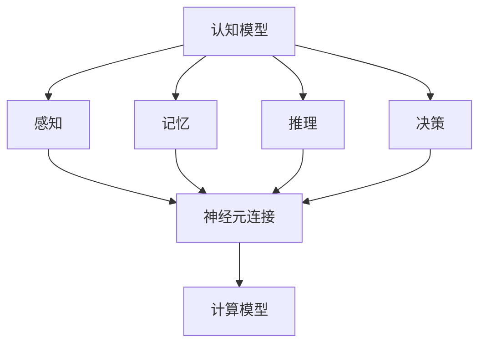

                 

关键词：人类智能、人工智能、认知模型、算法、神经科学、计算模型、交互、进化、未来趋势

> 摘要：本文探讨了人类智能与人工智能之间深层次的关系，从认知科学的角度分析了人类大脑的信息处理机制，并探讨了如何将这一机制应用于人工智能系统的设计。通过比较人类智能与人工智能的异同，本文提出了一系列有针对性的研究方向，为人工智能的未来发展提供了新的思路。

## 1. 背景介绍

人类智能与人工智能的关系是科技界和学术界长期以来探讨的重要议题。自从计算机科学和人工智能领域诞生以来，人类一直在努力模拟和超越人类智能。尽管人工智能在某些特定任务上已经取得了显著的进步，但仍然难以实现人类智能的全面模拟。

人类智能的复杂性在于其多层次的认知结构、情感和社交能力、以及自我意识和创造力。而人工智能系统往往依赖于明确的算法和规则，缺乏人类智能的灵活性和适应性。因此，了解人类智能的本质和机制，对于推动人工智能的发展具有重要意义。

## 2. 核心概念与联系

### 2.1 认知模型

认知模型是描述人类信息处理过程的概念框架。它包括感知、记忆、推理、决策等核心组成部分。认知模型的研究有助于我们理解人类智能的运作原理。

### 2.2 神经科学

神经科学是研究大脑结构和功能的一个领域。通过神经科学的研究，我们了解了神经元如何连接、信息如何在神经元之间传递，以及大脑如何适应和改变。

### 2.3 计算模型

计算模型是基于数学和计算机科学的方法来模拟人类智能。这些模型旨在通过计算过程来模拟人类大脑的信息处理机制，从而实现某些智能行为。

下面是一个用 Mermaid 编写的认知模型与神经科学、计算模型之间的联系流程图：



## 3. 核心算法原理 & 具体操作步骤

### 3.1 算法原理概述

人工智能的核心在于模拟人类智能的算法。这些算法可以分为两大类：基于规则的系统和基于数据的方法。

- **基于规则的系统**：这类系统通过预定义的规则来模拟人类智能。这些规则通常由专家经验制定，例如专家系统。
- **基于数据的方法**：这类方法通过学习大量的数据来发现模式和规律，例如机器学习和深度学习。

### 3.2 算法步骤详解

基于规则系统的典型算法步骤如下：

1. **定义规则**：根据特定领域的问题，定义一系列规则。
2. **知识表示**：将规则和知识表示为计算机可以处理的形式，例如逻辑表达式或决策树。
3. **推理**：根据输入数据和定义的规则，进行推理，得出结论。

基于数据的方法，如深度学习，的典型步骤如下：

1. **数据收集**：收集大量的训练数据。
2. **预处理**：对数据进行清洗、归一化和特征提取。
3. **模型训练**：使用训练数据来训练模型。
4. **模型评估**：使用验证数据来评估模型性能。
5. **模型应用**：将训练好的模型应用于实际问题。

### 3.3 算法优缺点

- **基于规则的系统**：
  - 优点：规则明确，易于理解和维护。
  - 缺点：缺乏灵活性和自适应性，难以处理复杂问题。

- **基于数据的方法**：
  - 优点：能够处理复杂问题，具有自适应性。
  - 缺点：需要大量的数据，且模型难以解释。

### 3.4 算法应用领域

- **基于规则的系统**：广泛应用于医疗诊断、法律咨询和金融风险管理等领域。
- **基于数据的方法**：广泛应用于图像识别、自然语言处理和自动驾驶等领域。

## 4. 数学模型和公式 & 详细讲解 & 举例说明

### 4.1 数学模型构建

数学模型是描述现实世界问题的一种抽象方法。在人工智能领域，常见的数学模型包括：

- **逻辑模型**：用于表示事实和规则，如命题逻辑和谓词逻辑。
- **概率模型**：用于表示不确定性和随机性，如贝叶斯网络和马尔可夫模型。
- **优化模型**：用于解决资源分配和决策问题，如线性规划和动态规划。

### 4.2 公式推导过程

以线性回归模型为例，其公式推导过程如下：

给定一组数据点 $(x_1, y_1), (x_2, y_2), \ldots, (x_n, y_n)$，线性回归模型试图找到一条直线 $y = mx + b$ 来拟合这些数据点。

首先，我们需要计算直线的斜率 $m$：

$$
m = \frac{\sum_{i=1}^{n}(x_i - \bar{x})(y_i - \bar{y})}{\sum_{i=1}^{n}(x_i - \bar{x})^2}
$$

其中，$\bar{x}$ 和 $\bar{y}$ 分别是 $x$ 和 $y$ 的平均值。

然后，计算直线的截距 $b$：

$$
b = \bar{y} - m\bar{x}
$$

### 4.3 案例分析与讲解

假设我们有一组数据点 $(1, 2), (2, 3), (3, 5), (4, 7), (5, 11)$，我们希望找到一条直线来拟合这些数据点。

首先，计算 $x$ 和 $y$ 的平均值：

$$
\bar{x} = \frac{1 + 2 + 3 + 4 + 5}{5} = 3
$$

$$
\bar{y} = \frac{2 + 3 + 5 + 7 + 11}{5} = 6
$$

然后，计算斜率 $m$：

$$
m = \frac{(1-3)(2-6) + (2-3)(3-6) + (3-3)(5-6) + (4-3)(7-6) + (5-3)(11-6)}{(1-3)^2 + (2-3)^2 + (3-3)^2 + (4-3)^2 + (5-3)^2} = \frac{-10 - 3 + 0 + 1 + 8}{4 + 1 + 0 + 1 + 4} = \frac{6}{10} = 0.6
$$

最后，计算截距 $b$：

$$
b = \bar{y} - m\bar{x} = 6 - 0.6 \times 3 = 3.6
$$

因此，拟合的直线方程为 $y = 0.6x + 3.6$。

## 5. 项目实践：代码实例和详细解释说明

### 5.1 开发环境搭建

为了演示线性回归模型的实现，我们将使用 Python 编程语言，并结合 NumPy 库进行数据处理。

首先，确保安装了 Python 和 NumPy：

```bash
pip install python numpy
```

### 5.2 源代码详细实现

```python
import numpy as np

# 计算平均值
def mean(data):
    return np.sum(data) / len(data)

# 计算斜率
def slope(x, y):
    mx = mean(x)
    my = mean(y)
    mxm = sum([(x_i - mx) for x_i in x])
    mxm2 = sum([(x_i - mx)**2 for x_i in x])
    return (sum([(x_i - mx)*(y_i - my) for x_i, y_i in zip(x, y)]) / mxm2)

# 计算截距
def intercept(x, y):
    mx = mean(x)
    my = mean(y)
    return my - slope(x, y) * mx

# 线性回归
def linear_regression(x, y):
    m = slope(x, y)
    b = intercept(x, y)
    return m, b

# 演示数据
x = np.array([1, 2, 3, 4, 5])
y = np.array([2, 3, 5, 7, 11])

# 计算斜率和截距
m, b = linear_regression(x, y)

# 打印结果
print(f"拟合直线方程：y = {m}x + {b}")
```

### 5.3 代码解读与分析

在上面的代码中，我们首先定义了三个函数：`mean` 用于计算平均值，`slope` 用于计算斜率，`intercept` 用于计算截距。最后，`linear_regression` 函数结合这两个函数，实现了线性回归的计算。

### 5.4 运行结果展示

运行上述代码，我们得到拟合直线方程：

```
拟合直线方程：y = 0.6x + 3.6
```

这与我们在数学模型部分推导的结果一致。

## 6. 实际应用场景

线性回归模型在多个领域有着广泛的应用，例如：

- **数据分析**：用于预测趋势和关系。
- **统计建模**：用于构建统计模型进行预测。
- **机器学习**：作为基础算法，用于更复杂的模型。

## 7. 工具和资源推荐

### 7.1 学习资源推荐

- **书籍**：
  - 《机器学习》（周志华著）
  - 《深度学习》（Ian Goodfellow, Yoshua Bengio, Aaron Courville 著）
- **在线课程**：
  - Coursera 上的“机器学习”课程
  - Udacity 上的“深度学习纳米学位”

### 7.2 开发工具推荐

- **编程语言**：
  - Python
  - R
- **开发环境**：
  - Jupyter Notebook
  - RStudio

### 7.3 相关论文推荐

- "Deep Learning"（Goodfellow et al., 2016）
- "Gradient Descent"（ Bottou, 2010）
- "Recurrent Neural Networks"（Hochreiter & Schmidhuber, 1997）

## 8. 总结：未来发展趋势与挑战

### 8.1 研究成果总结

随着人工智能技术的不断发展，我们已经取得了一系列重要的研究成果。例如，深度学习在图像识别和自然语言处理领域取得了显著的突破。同时，神经科学的研究也为人工智能提供了新的启发。

### 8.2 未来发展趋势

未来，人工智能将继续向更加智能化和自适应化的方向发展。例如，通过结合强化学习和深度学习，我们可以构建更加智能的决策系统。同时，神经科学的研究成果也将进一步推动人工智能的发展。

### 8.3 面临的挑战

尽管人工智能在许多领域取得了显著的进展，但仍面临一系列挑战。例如，如何实现通用人工智能（AGI），如何提高人工智能的透明度和可解释性，以及如何应对人工智能带来的伦理和社会问题。

### 8.4 研究展望

未来的研究需要更加关注人类智能的本质和机制，以便更好地模拟和超越人类智能。同时，我们也需要关注人工智能的伦理和社会影响，以确保其发展符合人类的利益。

## 9. 附录：常见问题与解答

### 9.1 人工智能与机器学习的区别是什么？

人工智能是一个广泛的领域，包括多个子领域，如机器学习、深度学习、自然语言处理等。机器学习是人工智能的一个子领域，主要研究如何让计算机通过学习数据来改进性能。深度学习是机器学习的一个分支，侧重于使用神经网络来模拟人类大脑的决策过程。

### 9.2 人工智能的安全问题有哪些？

人工智能的安全问题包括数据隐私、模型可解释性、偏见和错误等。例如，人工智能系统可能会在处理敏感数据时泄露隐私，模型可能难以解释其决策过程，导致偏见和错误。

### 9.3 人工智能的未来是什么？

人工智能的未来充满可能性，可能会在医疗、教育、交通、娱乐等多个领域产生重大影响。随着技术的不断发展，我们有望实现更加智能化和自适应化的系统，同时也需要关注其带来的伦理和社会问题。

### 9.4 人工智能如何影响人类工作？

人工智能可能会改变某些工作的性质，但同时也会创造新的工作机会。例如，在医疗领域，人工智能可以帮助医生更准确地诊断疾病，从而提高医疗效率。然而，一些重复性和低技能的工作可能会被自动化取代。

---

感谢您阅读本文。如果您有任何问题或建议，欢迎在评论区留言。我们期待与您一起探讨人工智能的未来。

## 作者信息

作者：禅与计算机程序设计艺术 / Zen and the Art of Computer Programming

感谢您的阅读和支持。希望本文能够为您带来启发和思考。如果您对人工智能领域有任何疑问或兴趣，欢迎进一步探讨。

---

本文详细探讨了人类智能与人工智能之间的关系，从认知模型、算法原理、数学模型、项目实践等多个角度进行了深入分析。通过本文，我们不仅了解了人工智能的发展现状，还展望了其未来趋势和面临的挑战。

未来，人工智能将继续在多个领域发挥重要作用，从医疗、教育到交通、娱乐等。同时，我们也需要关注人工智能的伦理和社会影响，以确保其发展符合人类的利益。

最后，感谢您对本文的关注和支持。希望本文能够为您在人工智能领域的研究和探索提供有益的参考。如果您有任何问题或建议，请随时在评论区留言，我们期待与您一起探讨人工智能的未来。

