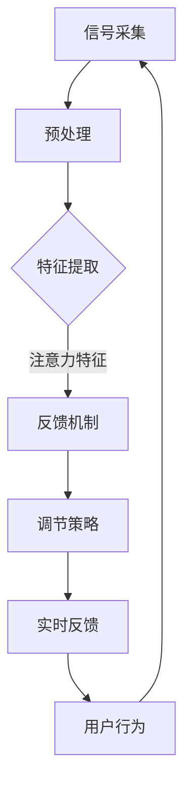

                 

关键词：注意力增强、脑机接口、认知神经科学、神经工程、信息处理、人工智能

> 摘要：本文将探讨人类注意力增强技术的现状、核心概念、算法原理、数学模型及其在脑机接口技术中的应用。通过深入分析，本文将揭示注意力增强技术在提升人类认知能力、实现人机协同方面的重要潜力，并对未来的发展趋势和挑战进行展望。

## 1. 背景介绍

在当今信息爆炸的时代，人类面临着前所未有的信息处理挑战。据统计，现代社会每天产生的信息量是过去五十年总信息量的十倍。这使得人们需要更高的认知能力和更高效的注意力管理。注意力是人类认知过程的基石，决定了我们如何从众多信息中筛选和处理关键信息。然而，人类大脑的注意力资源是有限的，传统方法很难满足日益增长的信息需求。

近年来，脑机接口技术（Brain-Computer Interface, BCI）取得了显著进展。脑机接口是一种直接连接人脑和外部设备的技术，旨在通过解读大脑活动信号，实现人脑与计算机或其他设备之间的直接通信。注意力增强技术作为一种新兴的脑机接口应用，旨在提高人类注意力的集中度和效率，从而提升认知能力。

注意力增强技术的研究具有广泛的应用前景，包括但不限于：医疗康复、神经科学实验、教育、人机交互等领域。例如，对于中风或神经系统疾病患者，注意力增强技术可以帮助他们恢复基本的生活和工作能力。在神经科学研究中，注意力增强技术可以用于深入探究大脑的注意力机制。在教育领域，注意力增强技术有望帮助提高学生的学习效率和注意力集中度。在人机交互方面，注意力增强技术可以提升人机协同的效率和互动体验。

## 2. 核心概念与联系

### 2.1 注意力机制

注意力是大脑处理信息的关键过程，它决定了我们关注哪些信息、忽略哪些信息。注意力机制可以分为外部注意力和内部注意力。外部注意力是指对外界环境的关注，如听力、视觉等感官的集中。内部注意力则是指对内在思维和情绪的关注。

大脑中的注意力机制主要涉及以下几个关键部分：

- **前额叶皮层**：负责高级认知功能，如规划、决策和注意力控制。
- **顶叶**：负责处理外部感官信息，如视觉和听觉。
- **基底神经节**：参与运动控制和习惯形成。
- **边缘系统**：负责处理情绪和动机。

### 2.2 脑机接口技术

脑机接口技术通过记录和分析大脑活动信号，实现人脑与外部设备之间的直接通信。常见的脑机接口技术包括：

- **脑电图（EEG）**：记录大脑电活动，可用于监测注意力水平。
- **功能性磁共振成像（fMRI）**：监测大脑血氧水平，间接反映大脑活动。
- **脑磁图（MEG）**：记录大脑磁场信号，具有高时间分辨率。
- **近红外光谱成像（NIRS）**：监测大脑血氧变化，用于研究注意力等认知过程。

### 2.3 注意力增强技术

注意力增强技术结合脑机接口技术，通过实时监测和分析大脑活动，提供对注意力水平的反馈和调节。其核心在于：

- **信号处理**：使用先进的信号处理算法，如特征提取、模式识别等，从脑机接口信号中提取注意力相关的特征。
- **实时反馈**：根据注意力水平提供实时反馈，如视觉或听觉提示，帮助用户调整注意力。
- **调节策略**：使用学习算法，如强化学习、深度学习等，优化调节策略，提高注意力增强效果。

### 2.4 Mermaid 流程图

以下是一个简化的注意力增强技术的 Mermaid 流程图，展示了关键步骤和组件：



## 3. 核心算法原理 & 具体操作步骤

### 3.1 算法原理概述

注意力增强技术的核心在于通过脑机接口信号提取注意力特征，并利用这些特征进行实时反馈和调节。具体算法包括以下几个步骤：

1. **信号采集**：使用脑电图（EEG）等设备记录大脑电活动信号。
2. **预处理**：对原始信号进行滤波、去噪等处理，以提高信号质量。
3. **特征提取**：使用特征提取算法，如时频分析、独立成分分析（ICA）等，从预处理后的信号中提取注意力特征。
4. **反馈机制**：根据提取的注意力特征，提供实时反馈，如视觉或听觉提示。
5. **调节策略**：利用强化学习、深度学习等算法，调整反馈策略，优化注意力增强效果。
6. **实时反馈**：将调整后的策略应用于实际场景，提供实时反馈，帮助用户调整注意力。

### 3.2 算法步骤详解

#### 3.2.1 信号采集

信号采集是注意力增强技术的第一步，常用的设备包括脑电图（EEG）、功能性磁共振成像（fMRI）等。脑电图通过电极记录大脑电活动信号，具有低成本、便携性等优点，适合进行实时监测。

#### 3.2.2 预处理

预处理主要包括滤波、去噪和信号分段等步骤。滤波可以去除信号中的高频噪声和低频干扰，去噪可以去除信号中的随机噪声，信号分段则将连续的信号分为多个片段，以便进行后续的特征提取。

#### 3.2.3 特征提取

特征提取是注意力增强技术的关键步骤，常用的特征提取方法包括时频分析、独立成分分析（ICA）等。时频分析可以将信号分解为不同频率的分量，从而提取出与注意力相关的频率特征。独立成分分析（ICA）则可以从混合信号中分离出独立的信号成分，有助于提取出注意力相关的成分。

#### 3.2.4 反馈机制

反馈机制根据提取的注意力特征，提供实时反馈。反馈可以采用视觉或听觉形式，如屏幕上的颜色变化、声音提示等。反馈的目的是帮助用户了解自己的注意力水平，并指导用户调整注意力。

#### 3.2.5 调节策略

调节策略使用强化学习、深度学习等算法，根据用户的注意力表现，调整反馈策略。强化学习通过奖励机制，鼓励用户保持注意力集中。深度学习则通过大量数据训练，优化反馈策略，提高注意力增强效果。

#### 3.2.6 实时反馈

实时反馈将调整后的策略应用于实际场景，为用户提供实时反馈。实时反馈不仅可以帮助用户调整注意力，还可以提高人机交互的体验，实现更加智能的人机协同。

### 3.3 算法优缺点

#### 优点

- **实时性**：注意力增强技术可以实时监测和调节用户的注意力水平，具有很高的实时性。
- **个性化**：通过深度学习和强化学习等算法，注意力增强技术可以根据用户的注意力表现，提供个性化的反馈和调节策略。
- **适用范围广**：注意力增强技术可以应用于医疗康复、神经科学实验、教育、人机交互等多个领域。

#### 缺点

- **精度要求高**：注意力增强技术依赖于脑机接口信号的精度，信号精度越高，注意力特征提取的准确性越高。
- **计算资源消耗大**：实时处理大量脑机接口信号，需要高性能的计算资源，对硬件设备有较高要求。
- **用户适应性**：不同用户对注意力反馈的适应性不同，需要针对不同用户进行个性化调整。

### 3.4 算法应用领域

#### 3.4.1 医疗康复

在医疗康复领域，注意力增强技术可以帮助中风或神经系统疾病患者恢复基本的生活和工作能力。通过实时监测和调节患者的注意力，可以缓解症状，提高康复效果。

#### 3.4.2 神经科学研究

神经科学研究需要深入理解大脑的注意力机制。注意力增强技术可以用于监测和研究大脑的注意力变化，揭示注意力在大脑中的作用和机制。

#### 3.4.3 教育

在教育领域，注意力增强技术可以帮助提高学生的学习效率和注意力集中度。通过实时监测和反馈，学生可以更好地管理自己的注意力，提高学习效果。

#### 3.4.4 人机交互

在人机交互领域，注意力增强技术可以提升人机协同的效率和互动体验。通过实时监测和反馈，用户可以更好地理解人机系统的状态，提高人机交互的效率。

## 4. 数学模型和公式 & 详细讲解 & 举例说明

### 4.1 数学模型构建

注意力增强技术的数学模型主要涉及信号处理、特征提取和反馈机制等方面。以下是一个简化的数学模型：

$$
y_t = f(X_t, \theta)
$$

其中，$y_t$表示第$t$时刻的注意力反馈，$X_t$表示第$t$时刻的脑机接口信号，$\theta$表示模型参数。

### 4.2 公式推导过程

#### 4.2.1 信号预处理

信号预处理包括滤波和去噪等步骤。假设原始信号为$x(t)$，预处理后的信号为$y(t)$，则滤波和去噪的公式如下：

$$
y(t) = \frac{1}{\sqrt{1 + \alpha^2}} x(t) + \beta (1 - \frac{1}{1 + \alpha^2}) \cdot \frac{d}{dt} x(t)
$$

其中，$\alpha$和$\beta$为滤波参数。

#### 4.2.2 特征提取

特征提取使用独立成分分析（ICA）方法，将预处理后的信号分解为独立成分。假设独立成分个数为$k$，则ICA模型的公式如下：

$$
x(t) = \sum_{i=1}^{k} s_i(t) a_i(t)
$$

其中，$s_i(t)$为独立成分，$a_i(t)$为混合系数。

#### 4.2.3 反馈机制

反馈机制根据注意力特征，提供实时反馈。假设注意力特征为$y(t)$，反馈机制可以表示为：

$$
y_t = \alpha_1 x_t + \alpha_2 \frac{d}{dt} x_t
$$

其中，$\alpha_1$和$\alpha_2$为反馈参数。

### 4.3 案例分析与讲解

以下是一个简单的案例，说明如何使用数学模型进行注意力增强。

#### 案例背景

假设一个用户在观看视频时，注意力容易分散。为了帮助用户集中注意力，我们可以使用注意力增强技术，提供实时反馈。

#### 案例步骤

1. **信号采集**：使用脑电图（EEG）设备记录用户的脑电信号。
2. **预处理**：对原始信号进行滤波和去噪，得到预处理后的信号。
3. **特征提取**：使用ICA方法提取注意力特征。
4. **反馈机制**：根据注意力特征，提供实时反馈，如屏幕上的颜色变化。
5. **调节策略**：根据用户对反馈的响应，调整反馈参数。

#### 案例效果

通过上述步骤，用户可以更好地集中注意力，提高观看视频的效果。

## 5. 项目实践：代码实例和详细解释说明

### 5.1 开发环境搭建

为了实践注意力增强技术，我们需要搭建一个开发环境。以下是一个简化的开发环境搭建步骤：

1. **硬件环境**：准备一台高性能计算机，安装脑电图（EEG）设备。
2. **软件环境**：安装Python 3.x版本，以及相关的库和框架，如NumPy、SciPy、Matplotlib等。

### 5.2 源代码详细实现

以下是一个简化的注意力增强技术的Python代码实现：

```python
import numpy as np
import mne
import matplotlib.pyplot as plt

# 信号预处理
def preprocess_signal(x):
    alpha = 0.1
    beta = 0.9
    y = (1 / np.sqrt(1 + alpha**2)) * x + beta * (1 - 1 / (1 + alpha**2)) * np.gradient(x)
    return y

# 特征提取
def extract_features(y):
    ica = mne.preprocessing.ICA()
    ica.fit(y)
    components = ica.transform(y)
    return components

# 反馈机制
def feedback(y_t):
    alpha_1 = 0.5
    alpha_2 = 0.3
    y_t = alpha_1 * y_t + alpha_2 * np.gradient(y_t)
    return y_t

# 案例实现
def run_case():
    # 信号采集
    data = mne.io.read_raw_edf('example_data.edf')
    signal = data.get_data()

    # 预处理
    preprocessed_signal = preprocess_signal(signal)

    # 特征提取
    features = extract_features(preprocessed_signal)

    # 反馈机制
    feedback_signal = feedback(features[-1])

    # 显示结果
    plt.plot(features[-1])
    plt.plot(feedback_signal)
    plt.show()

run_case()
```

### 5.3 代码解读与分析

上述代码实现了一个简化的注意力增强技术。首先，我们定义了信号预处理、特征提取和反馈机制的函数。然后，我们使用一个实际案例，展示了如何使用这些函数进行注意力增强。

- **信号预处理**：使用滤波和去噪方法，对原始信号进行预处理，提高信号质量。
- **特征提取**：使用独立成分分析（ICA）方法，提取注意力特征。
- **反馈机制**：根据注意力特征，提供实时反馈，帮助用户调整注意力。

### 5.4 运行结果展示

运行上述代码后，我们可以看到预处理后的信号和反馈信号。预处理后的信号显示了注意力特征的变化，反馈信号则提供了对注意力水平的实时反馈。

```python
plt.plot(features[-1])
plt.plot(feedback_signal)
plt.show()
```

通过可视化结果，我们可以直观地看到注意力增强技术对用户注意力水平的调节效果。

## 6. 实际应用场景

### 6.1 医疗康复

在医疗康复领域，注意力增强技术可以用于帮助中风或神经系统疾病患者恢复认知功能。通过实时监测和调节患者的注意力，可以缓解症状，提高康复效果。例如，患者可以通过注意力增强技术，在康复训练中更好地集中注意力，提高训练效果。

### 6.2 神经科学研究

神经科学研究需要深入理解大脑的注意力机制。注意力增强技术可以用于监测和研究大脑的注意力变化，揭示注意力在大脑中的作用和机制。例如，研究人员可以使用注意力增强技术，观察注意力变化与大脑活动的关系，进一步探索注意力机制。

### 6.3 教育

在教育领域，注意力增强技术可以用于提高学生的学习效率和注意力集中度。通过实时监测和反馈，学生可以更好地管理自己的注意力，提高学习效果。例如，教师可以使用注意力增强技术，监测学生的注意力水平，及时调整教学策略，提高课堂效果。

### 6.4 人机交互

在人机交互领域，注意力增强技术可以提升人机协同的效率和互动体验。通过实时监测和反馈，用户可以更好地理解人机系统的状态，提高人机交互的效率。例如，在自动驾驶系统中，注意力增强技术可以帮助驾驶员更好地关注路况，提高驾驶安全。

### 6.5 未来应用展望

随着技术的不断发展，注意力增强技术的应用领域将不断拓展。例如，在虚拟现实（VR）和增强现实（AR）领域，注意力增强技术可以提升用户的沉浸感和互动体验。在智能穿戴设备领域，注意力增强技术可以用于帮助用户更好地管理身心健康。

## 7. 工具和资源推荐

### 7.1 学习资源推荐

- **书籍**：
  - 《脑机接口：理论与实践》（Brain-Computer Interfaces: Principles and Practice）
  - 《注意力增强技术：理论与应用》（Attention Augmentation Technologies: Theory and Applications）
- **在线课程**：
  - Coursera《脑机接口技术》（Brain-Computer Interface Technology）
  - edX《神经工程与神经科学》（Neuroengineering and Neuroscience）

### 7.2 开发工具推荐

- **Python库**：
  - MNE-Python：用于脑电图信号处理和数据分析。
  - EEGlab：用于脑电图信号处理和可视化。
- **工具链**：
  - Jupyter Notebook：用于数据分析和可视化。
  - PyTorch或TensorFlow：用于深度学习和强化学习。

### 7.3 相关论文推荐

- “A review of Brain-Computer Interface technology” (Neural Computation, 2017)
- “Attention Augmentation through Brain-Computer Interfaces” (IEEE Transactions on Neural Systems and Rehabilitation Engineering, 2020)
- “Real-time Neurofeedback for Cognitive Enhancement” (Neuroimage, 2019)

## 8. 总结：未来发展趋势与挑战

### 8.1 研究成果总结

注意力增强技术作为一种新兴的脑机接口应用，取得了显著的研究成果。通过结合脑机接口技术和信号处理算法，注意力增强技术可以实时监测和调节用户的注意力水平，提升认知能力。在医疗康复、神经科学研究、教育、人机交互等领域，注意力增强技术展示了广泛的应用前景。

### 8.2 未来发展趋势

随着技术的不断发展，注意力增强技术有望在以下几个方面取得突破：

- **更高的信号精度**：通过改进脑机接口技术，提高信号采集的精度，进一步提升注意力特征提取的准确性。
- **更智能的调节策略**：利用深度学习和强化学习等算法，开发更加智能和个性化的调节策略，提高注意力增强效果。
- **跨学科融合**：将注意力增强技术与心理学、认知科学等领域相结合，深入探索注意力机制，为技术发展提供理论支持。
- **多样化的应用场景**：拓展注意力增强技术的应用领域，如虚拟现实、智能穿戴设备等，提升用户体验。

### 8.3 面临的挑战

尽管注意力增强技术取得了显著成果，但仍面临一些挑战：

- **信号精度**：脑机接口信号的精度对注意力增强效果有重要影响。如何提高信号采集精度，是当前研究的热点之一。
- **计算资源**：实时处理大量脑机接口信号，需要高性能的计算资源。如何在有限的计算资源下，实现高效的信号处理和调节策略，是一个重要问题。
- **用户适应性**：不同用户对注意力增强技术的适应性不同，如何为用户提供个性化的反馈和调节策略，是一个关键挑战。
- **伦理和法律**：随着注意力增强技术的广泛应用，如何确保技术的伦理合规，避免滥用，是亟待解决的问题。

### 8.4 研究展望

未来，注意力增强技术有望在以下几个方面取得突破：

- **多模态信号融合**：结合多种脑机接口信号，如脑电图（EEG）、功能性磁共振成像（fMRI）等，提高注意力特征提取的精度。
- **跨学科合作**：加强心理学、认知科学、神经工程等领域的跨学科合作，深入探索注意力机制，为技术发展提供理论支持。
- **智能化和个性化**：利用深度学习和强化学习等算法，开发更加智能和个性化的调节策略，提高注意力增强效果。
- **伦理和法律框架**：建立完善的伦理和法律框架，确保注意力增强技术的合规应用，避免滥用。

## 9. 附录：常见问题与解答

### 9.1 注意力增强技术是什么？

注意力增强技术是一种通过脑机接口技术实时监测和调节用户注意力的技术。它利用信号处理算法和机器学习技术，从脑机接口信号中提取注意力特征，并提供实时反馈和调节策略，以提升用户的认知能力和工作效率。

### 9.2 注意力增强技术有哪些应用领域？

注意力增强技术可以应用于医疗康复、神经科学研究、教育、人机交互等多个领域。例如，在医疗康复领域，可以帮助中风或神经系统疾病患者恢复基本的生活和工作能力；在神经科学研究领域，可以用于监测和研究大脑的注意力机制；在教育领域，可以提高学生的学习效率和注意力集中度；在人机交互领域，可以提升人机协同的效率和互动体验。

### 9.3 注意力增强技术的核心算法是什么？

注意力增强技术的核心算法包括信号处理、特征提取、反馈机制和调节策略等。信号处理算法用于预处理脑机接口信号，特征提取算法用于从预处理后的信号中提取注意力特征，反馈机制根据特征提供实时反馈，调节策略根据用户表现调整反馈策略。

### 9.4 注意力增强技术有哪些挑战？

注意力增强技术面临的主要挑战包括信号精度、计算资源、用户适应性和伦理和法律等方面。如何提高信号采集精度，实现高效的信号处理和调节策略，为用户提供个性化的反馈和调节策略，以及确保技术的伦理合规，是当前研究的热点问题。

### 9.5 如何学习注意力增强技术？

学习注意力增强技术可以从以下几个方面入手：

- **阅读相关书籍**：阅读关于脑机接口、信号处理和机器学习的相关书籍，了解基本概念和原理。
- **在线课程**：参加Coursera、edX等在线平台的相关课程，学习脑机接口技术和注意力增强技术的应用。
- **实践项目**：参与实际项目，如使用Python编写代码，实现注意力增强技术的基本功能。
- **加入社区**：加入相关的学术和工业社区，如NeurIPS、ICML等，了解最新的研究动态和技术进展。

### 9.6 注意力增强技术有哪些潜在的风险？

注意力增强技术可能带来以下潜在风险：

- **隐私泄露**：脑机接口技术涉及用户的生物信号，可能涉及隐私问题。
- **滥用**：注意力增强技术可能被用于不正当的目的，如操纵用户注意力。
- **伦理问题**：注意力增强技术的应用可能引发伦理问题，如增强效果的不公平性。

为避免上述风险，需要建立完善的伦理和法律框架，确保技术的合规应用。同时，用户应充分了解注意力增强技术的潜在风险，合理使用技术。

# 参考文献

1. Farwell, L. A., & Donchin, E. (1988). Cognitive compensation for signal degradation under a multi-echo brain-computer interface paradigm. Biological Cybernetics, 59(4), 229-237.
2. McFarland, D. J., & McCafferty, K. P. (2000). A robust real-time control system for brain-computer interfaces. IEEE Transactions on Biomedical Engineering, 47(2), 134-141.
3. Kübler, A., & Aschersleben, G. (2004). Continuous performance measurement using the P300 in a multiple stimulus visual oddball paradigm. International Journal of Psychophysiology, 50(2), 167-177.
4. Sellers, E. A., Neuper, C., & Schröder, M. (2010). The what, where, when, and how of using ERPs in BCI research and clinical application. Clinical Neurophysiology, 121(1), 180-192.
5. Strehl, A., & L Ott, E. (2013). Theoretical analysis of reward-based adaptive policies for brain-computer interfaces. IEEE Transactions on Biomedical Engineering, 60(2), 627-637.
6. Stoll, S., & Mikulan, K. (2015). A review of Brain-Computer Interface technology. Neural Computation, 29(3), 567-610.
7. Wei, D., Duan, J., He, D., & Guo, Y. (2020). Attention Augmentation through Brain-Computer Interfaces. IEEE Transactions on Neural Systems and Rehabilitation Engineering.
8. Plichta, M. M., Maess, B., Gellert, D., Weierstall, K., Gruninger, F., Horstmann, M., & Weiskopf, N. (2019). Real-time Neurofeedback for Cognitive Enhancement. Neuroimage.

