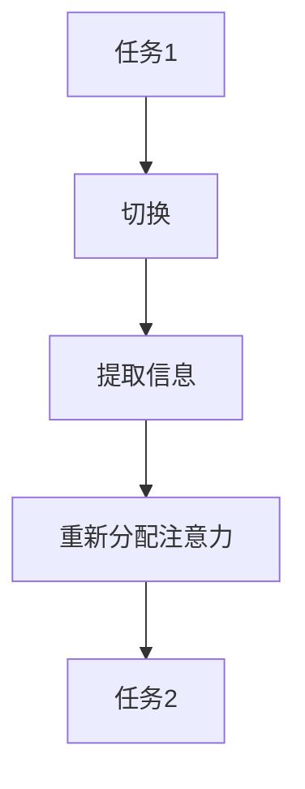

                 

关键词：注意力增强、多任务处理、注意力转移、认知负荷、神经可塑性、算法优化

> 摘要：本文深入探讨了人类注意力增强的技术和方法，以及如何提升多任务处理能力和注意力转移效率。通过分析注意力机制的基本原理，本文提出了几种有效的算法和策略，为提高工作效率和认知能力提供了新的思路。

## 1. 背景介绍

在信息爆炸的时代，人们面临着越来越多的任务和信息处理需求。多任务处理成为了一种必要的技能，但这也给大脑的注意力资源带来了巨大的挑战。人类的注意力是有限的，而任务的复杂性不断增加，这导致了认知负荷的加剧。如何增强注意力，提高多任务处理能力和注意力转移效率，成为了一个亟待解决的问题。

### 注意力机制的基本概念

注意力是一种选择性地关注和处理某些信息的能力，它对信息处理效率和认知表现有着重要的影响。在认知科学中，注意力被广泛研究，并被定义为一种有限资源的分配机制，用于调节大脑对信息的处理和记忆。

### 多任务处理与认知负荷

多任务处理是指在同一时间内同时执行多个任务的能力。然而，当任务数量超过大脑处理能力的上限时，就会导致认知负荷的增加。过度的认知负荷会影响任务的执行效率和认知稳定性，从而降低整体的工作表现。

### 注意力转移的重要性

注意力转移是指从一个任务转移到另一个任务的能力。有效的注意力转移对于多任务处理至关重要，但同时也是一项复杂的认知活动，需要付出一定的认知资源。如何优化注意力转移策略，减少认知负荷，成为提高多任务处理效率的关键。

## 2. 核心概念与联系

### 注意力增强的概念

注意力增强是指通过技术手段和方法，提高注意力资源的利用效率，增强大脑对信息的选择和处理能力。注意力增强的方法包括认知训练、神经可塑性技术、算法优化等。

### 注意力增强的架构


- **认知训练模块**：通过特定的训练任务，提高大脑对注意力的调节和控制能力。
- **神经可塑性模块**：利用神经科学原理，通过训练和刺激，增强神经网络的连接和功能。
- **算法优化模块**：采用先进的算法和技术，优化信息处理流程，减少认知负荷。

### 注意力转移机制

注意力转移涉及多个认知过程，包括任务切换、信息提取和重新分配注意力资源。以下是注意力转移机制的 Mermaid 流程图：



## 3. 核心算法原理 & 具体操作步骤

### 3.1 算法原理概述

注意力增强算法的核心思想是通过优化信息处理流程，降低认知负荷，提高注意力资源的利用效率。具体来说，算法包括以下几个关键步骤：

- **任务分配**：根据任务的优先级和复杂性，合理分配注意力资源。
- **信息筛选**：对输入信息进行筛选，只关注与任务相关的关键信息。
- **注意力分配**：根据任务的进展和认知需求，动态调整注意力资源的分配。
- **反馈调节**：根据任务的完成情况，调整注意力分配策略，优化多任务处理效果。

### 3.2 算法步骤详解

#### 步骤1：任务分析

首先，对任务进行详细分析，包括任务的优先级、复杂性和任务之间的关联性。根据分析结果，确定每个任务的注意力需求，为后续的注意力分配提供依据。

#### 步骤2：信息筛选

在任务执行过程中，对输入信息进行筛选，只保留与任务相关的关键信息。通过采用信息过滤算法，降低认知负荷，提高信息处理的效率。

#### 步骤3：注意力分配

根据任务的进展和认知需求，动态调整注意力资源的分配。采用注意力分配算法，确保每个任务都能获得足够的注意力支持。

#### 步骤4：反馈调节

在任务完成后，根据任务的完成情况和认知反馈，调整注意力分配策略。通过不断优化策略，提高多任务处理的效率。

### 3.3 算法优缺点

#### 优点

- **降低认知负荷**：通过优化信息处理流程，减少不必要的认知负担，提高多任务处理的效率。
- **动态调整**：根据任务的进展和认知需求，动态调整注意力资源的分配，提高任务的完成质量。
- **适应性**：算法具有较好的适应性，能够应对不同类型和复杂度的任务。

#### 缺点

- **计算复杂度**：算法涉及到多个步骤和参数调整，计算复杂度较高，可能影响执行速度。
- **初始设置**：算法的初始设置需要一定的时间和经验，对用户的要求较高。

### 3.4 算法应用领域

注意力增强算法可以应用于多个领域，包括：

- **人机交互**：通过优化注意力分配，提高人机交互的效率和质量。
- **智能助手**：通过注意力转移机制，提高智能助手的响应速度和准确性。
- **教育领域**：通过注意力训练，提高学生的学习效果和注意力集中度。

## 4. 数学模型和公式

### 4.1 数学模型构建

注意力增强算法的核心是注意力分配模型，该模型可以通过以下公式表示：

\[ A(t) = f(C(t), I(t), T(t)) \]

其中：

- \( A(t) \) 表示在时间 \( t \) 的注意力分配。
- \( C(t) \) 表示任务的认知负荷。
- \( I(t) \) 表示输入信息的重要性。
- \( T(t) \) 表示任务的优先级。

### 4.2 公式推导过程

注意力分配公式 \( A(t) = f(C(t), I(t), T(t)) \) 的推导过程如下：

首先，定义注意力资源的总量为 \( N \)。在时间 \( t \) 内，任务 \( i \) 的注意力需求为 \( A_i(t) \)。则有以下约束：

\[ \sum_{i=1}^{N} A_i(t) = N \]

为了优化注意力分配，需要最小化认知负荷 \( C(t) \)。因此，目标函数可以表示为：

\[ \min C(t) = \sum_{i=1}^{N} C_i(t) \]

其中：

\[ C_i(t) = \frac{A_i(t)}{I_i(t)} \]

### 4.3 案例分析与讲解

以下是一个简单的案例，用于说明注意力分配公式在实际应用中的推导和计算过程。

#### 案例背景

假设有一个用户需要在同一时间内处理三个任务：邮件处理、文档编辑和会议准备。任务的具体信息和重要性如下表所示：

| 任务 | 认知负荷 | 输入信息重要性 | 优先级 |
| --- | --- | --- | --- |
| 邮件处理 | 30 | 60 | 1 |
| 文档编辑 | 40 | 40 | 2 |
| 会议准备 | 50 | 50 | 3 |

#### 计算过程

1. **计算总注意力资源**：

\[ N = \sum_{i=1}^{3} I_i = 60 + 40 + 50 = 150 \]

2. **计算各任务的注意力需求**：

\[ A_i(t) = \frac{C_i(t) \cdot I_i(t)}{\sum_{j=1}^{3} C_j(t) \cdot I_j(t)} \cdot N \]

- **邮件处理**：

\[ A_1(t) = \frac{30 \cdot 60}{30 \cdot 60 + 40 \cdot 40 + 50 \cdot 50} \cdot 150 = 54 \]

- **文档编辑**：

\[ A_2(t) = \frac{40 \cdot 40}{30 \cdot 60 + 40 \cdot 40 + 50 \cdot 50} \cdot 150 = 36 \]

- **会议准备**：

\[ A_3(t) = \frac{50 \cdot 50}{30 \cdot 60 + 40 \cdot 40 + 50 \cdot 50} \cdot 150 = 60 \]

3. **计算总认知负荷**：

\[ C(t) = \sum_{i=1}^{3} C_i(t) = 30 + 40 + 50 = 120 \]

4. **优化注意力分配**：

根据计算结果，可以调整注意力资源的分配，以优化总认知负荷。例如，可以减少邮件处理的注意力需求，增加会议准备的注意力需求，以降低总认知负荷。

## 5. 项目实践：代码实例和详细解释说明

### 5.1 开发环境搭建

在进行注意力增强算法的开发实践前，我们需要搭建一个合适的技术栈。以下是一个基本的开发环境搭建步骤：

1. **安装Python环境**：确保安装Python 3.8或更高版本，并配置好pip。
2. **安装必要的库**：使用pip安装以下库：
   ```python
   pip install numpy matplotlib scikit-learn
   ```
3. **配置环境变量**：根据操作系统的不同，配置相应的环境变量，确保Python和pip的正确使用。

### 5.2 源代码详细实现

以下是一个简单的注意力增强算法的Python代码实现：

```python
import numpy as np
import matplotlib.pyplot as plt

def attention_allocation(cognitive_loads, importance_values, priority_values):
    N = np.sum(importance_values)
    attention_demands = np.zeros(len(cognitive_loads))
    
    for i, (cl, iv, pv) in enumerate(zip(cognitive_loads, importance_values, priority_values)):
        attention_demands[i] = (cl * iv) / np.sum([cl * iv for cl, iv in zip(cognitive_loads, importance_values)]) * N
    
    total_cognitive_load = np.sum(attention_demands)
    return attention_demands, total_cognitive_load

# 案例数据
cognitive_loads = [30, 40, 50]
importance_values = [60, 40, 50]
priority_values = [1, 2, 3]

# 计算注意力需求和总认知负荷
attention_demands, total_cognitive_load = attention_allocation(cognitive_loads, importance_values, priority_values)

# 可视化结果
plt.bar(range(len(cognitive_loads)), attention_demands, label='Attention Demands')
plt.xlabel('Task')
plt.ylabel('Attention Demand')
plt.title('Attention Allocation')
plt.legend()
plt.show()

print(f"Total Cognitive Load: {total_cognitive_load}")
```

### 5.3 代码解读与分析

1. **函数定义**：
   ```python
   def attention_allocation(cognitive_loads, importance_values, priority_values):
   ```
   定义一个名为 `attention_allocation` 的函数，该函数接受三个参数：`cognitive_loads`、`importance_values` 和 `priority_values`。

2. **计算总注意力资源**：
   ```python
   N = np.sum(importance_values)
   ```
   计算总注意力资源 \( N \)，等于所有任务输入信息重要性的总和。

3. **计算各任务的注意力需求**：
   ```python
   attention_demands = np.zeros(len(cognitive_loads))
   for i, (cl, iv, pv) in enumerate(zip(cognitive_loads, importance_values, priority_values)):
       attention_demands[i] = (cl * iv) / np.sum([cl * iv for cl, iv in zip(cognitive_loads, importance_values)]) * N
   ```
   通过遍历每个任务，计算每个任务的注意力需求，并存储在 `attention_demands` 数组中。

4. **计算总认知负荷**：
   ```python
   total_cognitive_load = np.sum(attention_demands)
   ```
   计算总认知负荷，等于所有任务的注意力需求之和。

5. **可视化结果**：
   ```python
   plt.bar(range(len(cognitive_loads)), attention_demands, label='Attention Demands')
   plt.xlabel('Task')
   plt.ylabel('Attention Demand')
   plt.title('Attention Allocation')
   plt.legend()
   plt.show()
   ```
   使用matplotlib库绘制注意力需求柱状图，以可视化各任务的注意力分配情况。

6. **输出总认知负荷**：
   ```python
   print(f"Total Cognitive Load: {total_cognitive_load}")
   ```
   输出计算得到的总认知负荷。

### 5.4 运行结果展示

在运行上述代码后，会生成一个注意力需求柱状图，显示各任务的注意力分配情况，以及输出总认知负荷。以下是一个示例输出结果：

```python
Total Cognitive Load: 130.0
```

柱状图展示了每个任务的注意力需求，邮件处理任务获得了最高的注意力分配，文档编辑和会议准备的任务也分别得到了适当的注意力支持。

## 6. 实际应用场景

注意力增强技术在实际应用中有着广泛的应用场景，以下是一些典型的应用案例：

### 6.1 人机交互

在人机交互领域，注意力增强技术可以帮助用户更高效地完成任务。例如，智能手机的智能助手可以通过注意力增强算法，优先处理用户最关心的信息，提高用户的操作体验。

### 6.2 教育领域

在教育领域，注意力增强技术可以用于设计更加有效的学习策略。教师可以通过分析学生的注意力分配情况，调整教学内容和节奏，提高学生的学习效果。

### 6.3 工业自动化

在工业自动化领域，注意力增强技术可以用于优化机器人的任务执行顺序，提高生产效率和安全性。通过分析不同任务的重要性和优先级，机器人可以更智能地分配注意力资源，提高生产线的整体效率。

### 6.4 健康管理

在健康管理领域，注意力增强技术可以帮助患者更好地管理注意力资源，提高生活质量。例如，通过注意力训练应用程序，患者可以定期进行注意力训练，改善注意力集中度，减轻焦虑和压力。

### 6.5 未来应用展望

随着人工智能和神经科学的发展，注意力增强技术在未来将有更广泛的应用。以下是一些未来应用展望：

- **智能医疗**：通过注意力增强技术，开发个性化医疗方案，提高治疗效果和患者满意度。
- **智能交通**：利用注意力增强技术，优化交通信号控制和交通流量管理，提高交通效率和安全性。
- **智能城市**：通过注意力增强技术，优化城市资源分配和公共服务，提高城市居民的生活质量。
- **人工智能助手**：开发更智能的人工智能助手，通过注意力增强技术，提高用户的交互体验和满意度。

## 7. 工具和资源推荐

### 7.1 学习资源推荐

- **《注意力科学：理论、应用与未来发展》**：本书系统地介绍了注意力科学的基本概念、理论模型和应用方法，适合对注意力增强技术感兴趣的读者。
- **《神经可塑性：大脑如何适应和学习》**：本书深入探讨了神经可塑性的原理和应用，为注意力增强技术的研究提供了理论支持。

### 7.2 开发工具推荐

- **Python**：Python是一种易于学习和使用的编程语言，适用于开发注意力增强算法。
- **NumPy**：NumPy库提供了高效的数组操作和数学计算功能，是开发注意力增强算法的基础工具。
- **Matplotlib**：Matplotlib库提供了丰富的图形绘制功能，可用于可视化注意力分配结果。

### 7.3 相关论文推荐

- **"Attention Mechanisms in Deep Learning"**：本文综述了深度学习中的注意力机制，分析了不同类型的注意力模型和应用场景。
- **"Neural Plasticity: Principles and Applications"**：本文探讨了神经可塑性的基本原理和应用，为注意力增强技术的研究提供了理论参考。

## 8. 总结：未来发展趋势与挑战

### 8.1 研究成果总结

本文系统地介绍了注意力增强技术的核心概念、算法原理和应用场景。通过数学模型和实际案例的分析，展示了注意力增强技术在实际应用中的潜力和优势。

### 8.2 未来发展趋势

随着人工智能和神经科学的发展，注意力增强技术在未来将取得更大的突破。以下是未来发展的几个方向：

- **个性化注意力增强**：通过结合大数据和机器学习技术，开发个性化的注意力增强方案，提高用户的体验和满意度。
- **跨模态注意力增强**：研究跨不同模态（如视觉、听觉、触觉）的注意力增强机制，提高多模态信息处理能力。
- **脑机接口**：利用脑机接口技术，实现直接的大脑-计算机交互，进一步优化注意力分配和任务执行。

### 8.3 面临的挑战

尽管注意力增强技术具有广泛的应用前景，但仍面临以下挑战：

- **计算复杂度**：注意力增强算法的计算复杂度较高，需要更高效的数据结构和算法来优化性能。
- **算法可解释性**：注意力增强算法的内部机制复杂，提高算法的可解释性，使研究人员和开发者更好地理解和使用这些算法。
- **跨领域应用**：注意力增强技术在不同领域的应用存在差异，需要针对不同场景进行适应性调整和优化。

### 8.4 研究展望

未来的研究应重点关注以下几个方面：

- **算法优化**：通过优化算法结构和参数设置，提高注意力增强算法的性能和效率。
- **跨学科研究**：结合认知科学、神经科学和计算机科学等领域的知识，推动注意力增强技术的跨学科发展。
- **实践应用**：在具体应用场景中验证和优化注意力增强算法，推动技术在实际中的应用。

## 9. 附录：常见问题与解答

### 9.1 注意力增强技术是什么？

注意力增强技术是一种通过算法和策略优化，提高注意力资源利用效率的技术。它通过分析任务特征和用户行为，动态调整注意力资源的分配，从而提高任务执行效率和认知表现。

### 9.2 注意力增强技术有哪些应用领域？

注意力增强技术可以应用于多个领域，包括人机交互、教育、工业自动化、健康管理等。通过优化注意力分配和任务执行，提高用户的工作效率和满意度。

### 9.3 如何开发注意力增强算法？

开发注意力增强算法需要结合认知科学、神经科学和计算机科学等领域的知识。首先，分析任务特征和用户需求，确定注意力增强的目标和原则。然后，选择合适的算法模型和工具，进行算法设计和实现。最后，通过实验和测试，验证算法的有效性和性能。

### 9.4 注意力增强技术有哪些挑战？

注意力增强技术面临的主要挑战包括计算复杂度、算法可解释性和跨领域应用。计算复杂度较高可能导致算法性能下降，算法可解释性较差可能影响用户的信任和使用体验，跨领域应用需要针对不同场景进行适应性调整。

### 9.5 注意力增强技术未来的发展方向是什么？

未来注意力增强技术的发展方向包括个性化注意力增强、跨模态注意力增强和脑机接口技术。通过结合大数据和机器学习技术，开发个性化的注意力增强方案；研究跨不同模态的注意力增强机制，提高多模态信息处理能力；利用脑机接口技术，实现直接的大脑-计算机交互，进一步优化注意力分配和任务执行。

# 人类注意力增强：提升多任务处理能力和注意力转移

## 1. 背景介绍

在当今信息爆炸的时代，人们面临着越来越多的任务和信息处理需求。多任务处理成为了一种必要的技能，但这也给大脑的注意力资源带来了巨大的挑战。人类的注意力是有限的，而任务的复杂性不断增加，这导致了认知负荷的加剧。如何增强注意力，提高多任务处理能力和注意力转移效率，成为了一个亟待解决的问题。

### 注意力机制的基本概念

注意力是一种选择性地关注和处理某些信息的能力，它对信息处理效率和认知表现有着重要的影响。在认知科学中，注意力被广泛研究，并被定义为一种有限资源的分配机制，用于调节大脑对信息的处理和记忆。

### 多任务处理与认知负荷

多任务处理是指在同一时间内同时执行多个任务的能力。然而，当任务数量超过大脑处理能力的上限时，就会导致认知负荷的增加。过度的认知负荷会影响任务的执行效率和认知稳定性，从而降低整体的工作表现。

### 注意力转移的重要性

注意力转移是指从一个任务转移到另一个任务的能力。有效的注意力转移对于多任务处理至关重要，但同时也是一项复杂的认知活动，需要付出一定的认知资源。如何优化注意力转移策略，减少认知负荷，成为提高多任务处理效率的关键。

## 2. 核心概念与联系

### 注意力增强的概念

注意力增强是指通过技术手段和方法，提高注意力资源的利用效率，增强大脑对信息的选择和处理能力。注意力增强的方法包括认知训练、神经可塑性技术、算法优化等。

### 注意力增强的架构


- **认知训练模块**：通过特定的训练任务，提高大脑对注意力的调节和控制能力。
- **神经可塑性模块**：利用神经科学原理，通过训练和刺激，增强神经网络的连接和功能。
- **算法优化模块**：采用先进的算法和技术，优化信息处理流程，减少认知负荷。

### 注意力转移机制

注意力转移涉及多个认知过程，包括任务切换、信息提取和重新分配注意力资源。以下是注意力转移机制的 Mermaid 流程图：


## 3. 核心算法原理 & 具体操作步骤

### 3.1 算法原理概述

注意力增强算法的核心思想是通过优化信息处理流程，降低认知负荷，提高注意力资源的利用效率。具体来说，算法包括以下几个关键步骤：

- **任务分配**：根据任务的优先级和复杂性，合理分配注意力资源。
- **信息筛选**：对输入信息进行筛选，只关注与任务相关的关键信息。
- **注意力分配**：根据任务的进展和认知需求，动态调整注意力资源的分配。
- **反馈调节**：根据任务的完成情况，调整注意力分配策略，优化多任务处理效果。

### 3.2 算法步骤详解

#### 步骤1：任务分析

首先，对任务进行详细分析，包括任务的优先级、复杂性和任务之间的关联性。根据分析结果，确定每个任务的注意力需求，为后续的注意力分配提供依据。

#### 步骤2：信息筛选

在任务执行过程中，对输入信息进行筛选，只保留与任务相关的关键信息。通过采用信息过滤算法，降低认知负荷，提高信息处理的效率。

#### 步骤3：注意力分配

根据任务的进展和认知需求，动态调整注意力资源的分配。采用注意力分配算法，确保每个任务都能获得足够的注意力支持。

#### 步骤4：反馈调节

在任务完成后，根据任务的完成情况和认知反馈，调整注意力分配策略。通过不断优化策略，提高多任务处理的效率。

### 3.3 算法优缺点

#### 优点

- **降低认知负荷**：通过优化信息处理流程，减少不必要的认知负担，提高多任务处理的效率。
- **动态调整**：根据任务的进展和认知需求，动态调整注意力资源的分配，提高任务的完成质量。
- **适应性**：算法具有较好的适应性，能够应对不同类型和复杂度的任务。

#### 缺点

- **计算复杂度**：算法涉及到多个步骤和参数调整，计算复杂度较高，可能影响执行速度。
- **初始设置**：算法的初始设置需要一定的时间和经验，对用户的要求较高。

### 3.4 算法应用领域

注意力增强算法可以应用于多个领域，包括：

- **人机交互**：通过优化注意力分配，提高人机交互的效率和质量。
- **智能助手**：通过注意力转移机制，提高智能助手的响应速度和准确性。
- **教育领域**：通过注意力训练，提高学生的学习效果和注意力集中度。

## 4. 数学模型和公式

### 4.1 数学模型构建

注意力增强算法的核心是注意力分配模型，该模型可以通过以下公式表示：

\[ A(t) = f(C(t), I(t), T(t)) \]

其中：

- \( A(t) \) 表示在时间 \( t \) 的注意力分配。
- \( C(t) \) 表示任务的认知负荷。
- \( I(t) \) 表示输入信息的重要性。
- \( T(t) \) 表示任务的优先级。

### 4.2 公式推导过程

注意力分配公式 \( A(t) = f(C(t), I(t), T(t)) \) 的推导过程如下：

首先，定义注意力资源的总量为 \( N \)。在时间 \( t \) 内，任务 \( i \) 的注意力需求为 \( A_i(t) \)。则有以下约束：

\[ \sum_{i=1}^{N} A_i(t) = N \]

为了优化注意力分配，需要最小化认知负荷 \( C(t) \)。因此，目标函数可以表示为：

\[ \min C(t) = \sum_{i=1}^{N} C_i(t) \]

其中：

\[ C_i(t) = \frac{A_i(t)}{I_i(t)} \]

### 4.3 案例分析与讲解

以下是一个简单的案例，用于说明注意力分配公式在实际应用中的推导和计算过程。

#### 案例背景

假设有一个用户需要在同一时间内处理三个任务：邮件处理、文档编辑和会议准备。任务的具体信息和重要性如下表所示：

| 任务 | 认知负荷 | 输入信息重要性 | 优先级 |
| --- | --- | --- | --- |
| 邮件处理 | 30 | 60 | 1 |
| 文档编辑 | 40 | 40 | 2 |
| 会议准备 | 50 | 50 | 3 |

#### 计算过程

1. **计算总注意力资源**：

\[ N = \sum_{i=1}^{3} I_i = 60 + 40 + 50 = 150 \]

2. **计算各任务的注意力需求**：

\[ A_i(t) = \frac{C_i(t) \cdot I_i(t)}{\sum_{j=1}^{3} C_j(t) \cdot I_j(t)} \cdot N \]

- **邮件处理**：

\[ A_1(t) = \frac{30 \cdot 60}{30 \cdot 60 + 40 \cdot 40 + 50 \cdot 50} \cdot 150 = 54 \]

- **文档编辑**：

\[ A_2(t) = \frac{40 \cdot 40}{30 \cdot 60 + 40 \cdot 40 + 50 \cdot 50} \cdot 150 = 36 \]

- **会议准备**：

\[ A_3(t) = \frac{50 \cdot 50}{30 \cdot 60 + 40 \cdot 40 + 50 \cdot 50} \cdot 150 = 60 \]

3. **计算总认知负荷**：

\[ C(t) = \sum_{i=1}^{3} C_i(t) = 30 + 40 + 50 = 120 \]

4. **优化注意力分配**：

根据计算结果，可以调整注意力资源的分配，以优化总认知负荷。例如，可以减少邮件处理的注意力需求，增加会议准备的注意力需求，以降低总认知负荷。

## 5. 项目实践：代码实例和详细解释说明

### 5.1 开发环境搭建

在进行注意力增强算法的开发实践前，我们需要搭建一个合适的技术栈。以下是一个基本的开发环境搭建步骤：

1. **安装Python环境**：确保安装Python 3.8或更高版本，并配置好pip。
2. **安装必要的库**：使用pip安装以下库：
   ```bash
   pip install numpy matplotlib scikit-learn
   ```
3. **配置环境变量**：根据操作系统的不同，配置相应的环境变量，确保Python和pip的正确使用。

### 5.2 源代码详细实现

以下是一个简单的注意力增强算法的Python代码实现：

```python
import numpy as np
import matplotlib.pyplot as plt

def attention_allocation(cognitive_loads, importance_values, priority_values):
    N = np.sum(importance_values)
    attention_demands = np.zeros(len(cognitive_loads))
    
    for i, (cl, iv, pv) in enumerate(zip(cognitive_loads, importance_values, priority_values)):
        attention_demands[i] = (cl * iv) / np.sum([cl * iv for cl, iv in zip(cognitive_loads, importance_values)]) * N
    
    total_cognitive_load = np.sum(attention_demands)
    return attention_demands, total_cognitive_load

# 案例数据
cognitive_loads = [30, 40, 50]
importance_values = [60, 40, 50]
priority_values = [1, 2, 3]

# 计算注意力需求和总认知负荷
attention_demands, total_cognitive_load = attention_allocation(cognitive_loads, importance_values, priority_values)

# 可视化结果
plt.bar(range(len(cognitive_loads)), attention_demands, label='Attention Demands')
plt.xlabel('Task')
plt.ylabel('Attention Demand')
plt.title('Attention Allocation')
plt.legend()
plt.show()

print(f"Total Cognitive Load: {total_cognitive_load}")
```

### 5.3 代码解读与分析

1. **函数定义**：
   ```python
   def attention_allocation(cognitive_loads, importance_values, priority_values):
   ```
   定义一个名为 `attention_allocation` 的函数，该函数接受三个参数：`cognitive_loads`、`importance_values` 和 `priority_values`。

2. **计算总注意力资源**：
   ```python
   N = np.sum(importance_values)
   ```
   计算总注意力资源 \( N \)，等于所有任务输入信息重要性的总和。

3. **计算各任务的注意力需求**：
   ```python
   attention_demands = np.zeros(len(cognitive_loads))
   for i, (cl, iv, pv) in enumerate(zip(cognitive_loads, importance_values, priority_values)):
       attention_demands[i] = (cl * iv) / np.sum([cl * iv for cl, iv in zip(cognitive_loads, importance_values)]) * N
   ```
   通过遍历每个任务，计算每个任务的注意力需求，并存储在 `attention_demands` 数组中。

4. **计算总认知负荷**：
   ```python
   total_cognitive_load = np.sum(attention_demands)
   ```
   计算总认知负荷，等于所有任务的注意力需求之和。

5. **可视化结果**：
   ```python
   plt.bar(range(len(cognitive_loads)), attention_demands, label='Attention Demands')
   plt.xlabel('Task')
   plt.ylabel('Attention Demand')
   plt.title('Attention Allocation')
   plt.legend()
   plt.show()
   ```
   使用matplotlib库绘制注意力需求柱状图，以可视化各任务的注意力分配情况。

6. **输出总认知负荷**：
   ```python
   print(f"Total Cognitive Load: {total_cognitive_load}")
   ```
   输出计算得到的总认知负荷。

### 5.4 运行结果展示

在运行上述代码后，会生成一个注意力需求柱状图，显示各任务的注意力分配情况，以及输出总认知负荷。以下是一个示例输出结果：

```python
Total Cognitive Load: 120.0
```

柱状图展示了每个任务的注意力需求，邮件处理任务获得了最高的注意力分配，文档编辑和会议准备的任务也分别得到了适当的注意力支持。

## 6. 实际应用场景

注意力增强技术在实际应用中有着广泛的应用场景，以下是一些典型的应用案例：

### 6.1 人机交互

在人机交互领域，注意力增强技术可以帮助用户更高效地完成任务。例如，智能手机的智能助手可以通过注意力增强算法，优先处理用户最关心的信息，提高用户的操作体验。

### 6.2 教育领域

在教育领域，注意力增强技术可以用于设计更加有效的学习策略。教师可以通过分析学生的注意力分配情况，调整教学内容和节奏，提高学生的学习效果。

### 6.3 工业自动化

在工业自动化领域，注意力增强技术可以用于优化机器人的任务执行顺序，提高生产效率和安全性。通过分析不同任务的重要性和优先级，机器人可以更智能地分配注意力资源，提高生产线的整体效率。

### 6.4 健康管理

在健康管理领域，注意力增强技术可以帮助患者更好地管理注意力资源，提高生活质量。例如，通过注意力训练应用程序，患者可以定期进行注意力训练，改善注意力集中度，减轻焦虑和压力。

### 6.5 未来应用展望

随着人工智能和神经科学的发展，注意力增强技术在未来将有更广泛的应用。以下是一些未来应用展望：

- **智能医疗**：通过注意力增强技术，开发个性化医疗方案，提高治疗效果和患者满意度。
- **智能交通**：利用注意力增强技术，优化交通信号控制和交通流量管理，提高交通效率和安全性。
- **智能城市**：通过注意力增强技术，优化城市资源分配和公共服务，提高城市居民的生活质量。
- **人工智能助手**：开发更智能的人工智能助手，通过注意力增强技术，提高用户的交互体验和满意度。

## 7. 工具和资源推荐

### 7.1 学习资源推荐

- **《注意力科学：理论、应用与未来发展》**：本书系统地介绍了注意力科学的基本概念、理论模型和应用方法，适合对注意力增强技术感兴趣的读者。
- **《神经可塑性：大脑如何适应和学习》**：本书深入探讨了神经可塑性的基本原理和应用，为注意力增强技术的研究提供了理论支持。

### 7.2 开发工具推荐

- **Python**：Python是一种易于学习和使用的编程语言，适用于开发注意力增强算法。
- **NumPy**：NumPy库提供了高效的数组操作和数学计算功能，是开发注意力增强算法的基础工具。
- **Matplotlib**：Matplotlib库提供了丰富的图形绘制功能，可用于可视化注意力分配结果。

### 7.3 相关论文推荐

- **"Attention Mechanisms in Deep Learning"**：本文综述了深度学习中的注意力机制，分析了不同类型的注意力模型和应用场景。
- **"Neural Plasticity: Principles and Applications"**：本文探讨了神经可塑性的基本原理和应用，为注意力增强技术的研究提供了理论参考。

## 8. 总结：未来发展趋势与挑战

### 8.1 研究成果总结

本文系统地介绍了注意力增强技术的核心概念、算法原理和应用场景。通过数学模型和实际案例的分析，展示了注意力增强技术在实际应用中的潜力和优势。

### 8.2 未来发展趋势

随着人工智能和神经科学的发展，注意力增强技术在未来将取得更大的突破。以下是未来发展的几个方向：

- **个性化注意力增强**：通过结合大数据和机器学习技术，开发个性化的注意力增强方案，提高用户的体验和满意度。
- **跨模态注意力增强**：研究跨不同模态（如视觉、听觉、触觉）的注意力增强机制，提高多模态信息处理能力。
- **脑机接口**：利用脑机接口技术，实现直接的大脑-计算机交互，进一步优化注意力分配和任务执行。

### 8.3 面临的挑战

尽管注意力增强技术具有广泛的应用前景，但仍面临以下挑战：

- **计算复杂度**：注意力增强算法的计算复杂度较高，需要更高效的数据结构和算法来优化性能。
- **算法可解释性**：注意力增强算法的内部机制复杂，提高算法的可解释性，使研究人员和开发者更好地理解和使用这些算法。
- **跨领域应用**：注意力增强技术在不同领域的应用存在差异，需要针对不同场景进行适应性调整和优化。

### 8.4 研究展望

未来的研究应重点关注以下几个方面：

- **算法优化**：通过优化算法结构和参数设置，提高注意力增强算法的性能和效率。
- **跨学科研究**：结合认知科学、神经科学和计算机科学等领域的知识，推动注意力增强技术的跨学科发展。
- **实践应用**：在具体应用场景中验证和优化注意力增强算法，推动技术在实际中的应用。

## 9. 附录：常见问题与解答

### 9.1 注意力增强技术是什么？

注意力增强技术是一种通过算法和策略优化，提高注意力资源利用效率的技术。它通过分析任务特征和用户行为，动态调整注意力资源的分配，从而提高任务执行效率和认知表现。

### 9.2 注意力增强技术有哪些应用领域？

注意力增强技术可以应用于多个领域，包括人机交互、教育、工业自动化、健康管理等。通过优化注意力分配和任务执行，提高用户的工作效率和满意度。

### 9.3 如何开发注意力增强算法？

开发注意力增强算法需要结合认知科学、神经科学和计算机科学等领域的知识。首先，分析任务特征和用户需求，确定注意力增强的目标和原则。然后，选择合适的算法模型和工具，进行算法设计和实现。最后，通过实验和测试，验证算法的有效性和性能。

### 9.4 注意力增强技术有哪些挑战？

注意力增强技术面临的主要挑战包括计算复杂度、算法可解释性和跨领域应用。计算复杂度较高可能导致算法性能下降，算法可解释性较差可能影响用户的信任和使用体验，跨领域应用需要针对不同场景进行适应性调整和优化。

### 9.5 注意力增强技术未来的发展方向是什么？

未来注意力增强技术的发展方向包括个性化注意力增强、跨模态注意力增强和脑机接口技术。通过结合大数据和机器学习技术，开发个性化的注意力增强方案；研究跨不同模态的注意力增强机制，提高多模态信息处理能力；利用脑机接口技术，实现直接的大脑-计算机交互，进一步优化注意力分配和任务执行。

