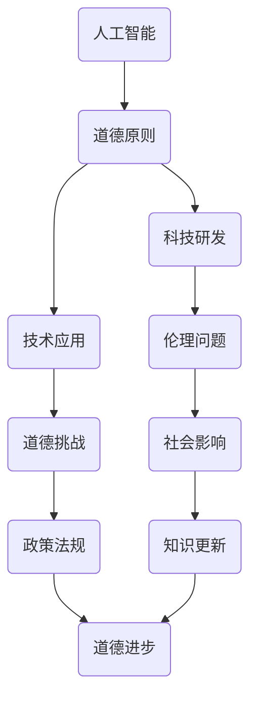

                 

关键词：人工智能、伦理、道德、科技发展、人类知识

> 摘要：随着科技的迅猛发展，人工智能等技术的广泛应用，人类社会面临着前所未有的挑战。本文将从人类的知识与道德角度出发，探讨科技发展对人类的影响，分析人工智能与道德的关系，并提出在科技面前人类应如何应对伦理道德问题。

## 1. 背景介绍

近年来，人工智能（AI）技术取得了显著的进展，已经渗透到各个领域，从自动驾驶到医疗诊断，从金融交易到自然语言处理，AI正在改变我们的生活。然而，随着AI技术的不断发展，一系列伦理道德问题也逐渐浮现出来。例如，AI算法的偏见问题、隐私保护问题、自主决策的道德责任问题等。

这些问题的出现，一方面反映了科技发展的速度和深度，另一方面也揭示了人类社会在伦理道德方面的局限性和不足。因此，如何在科技发展中兼顾人类知识与道德，成为了当今社会亟待解决的问题。

### 1.1 科技发展的现状

人工智能技术的发展可以分为三个阶段：弱人工智能、强人工智能和超人工智能。当前，我们处于弱人工智能阶段，AI在特定任务上表现出色，但仍然无法像人类一样具备全面的认知能力。

在弱人工智能阶段，AI技术已经应用于多个领域，如自动驾驶、智能家居、医疗诊断、金融服务等。这些应用不仅提高了生产效率，还改善了人们的生活质量。

### 1.2 伦理道德问题的挑战

伦理道德问题的挑战主要体现在以下几个方面：

1. **算法偏见**：AI算法在训练过程中可能会受到数据偏差的影响，导致算法表现出偏见。例如，性别、种族、年龄等方面的偏见。

2. **隐私保护**：AI技术的发展使得大规模数据收集和分析成为可能，但这也带来了隐私泄露的风险。

3. **自主决策的道德责任**：随着AI技术的进步，自主决策系统将越来越多地应用于实际场景，这引发了关于道德责任的讨论。

4. **就业影响**：AI技术可能导致部分职业的失业，引发社会的不稳定。

## 2. 核心概念与联系

### 2.1 人工智能与道德

人工智能与道德之间存在紧密的联系。一方面，人工智能技术的发展离不开伦理道德的指导；另一方面，人工智能的广泛应用也对伦理道德提出了新的挑战。

首先，人工智能的发展需要遵循伦理道德原则。在研发和应用人工智能技术时，我们需要考虑其对社会、环境和人类的影响，避免造成负面影响。

其次，人工智能的应用需要遵循伦理道德规范。例如，在医疗领域，AI诊断系统需要确保对患者负责，避免出现误诊或误导。

### 2.2 人类知识与道德

人类知识与道德之间也存在着密切的关系。知识是人类智慧的结晶，是道德观念形成的基础。在科技发展过程中，人类需要不断积累和更新知识，以应对新的挑战。

同时，道德观念也影响着人类对科技的认识和应用。道德观念的进步可以推动科技的发展，使其更好地造福人类。

### 2.3 Mermaid 流程图

下面是一个简化的 Mermaid 流程图，展示了人工智能与道德之间的联系：



## 3. 核心算法原理 & 具体操作步骤

### 3.1 算法原理概述

在人工智能领域，一些核心算法如深度学习、强化学习等，已经在许多应用中取得了显著的成果。这些算法的原理主要基于神经网络的建模和优化。

深度学习算法通过多层神经网络模拟人脑的神经元连接，实现数据的自动特征提取和分类。强化学习算法则通过试错和反馈机制，使智能体在复杂环境中不断学习，实现最优策略。

### 3.2 算法步骤详解

1. **深度学习算法**

   - **步骤1**：数据预处理，包括数据的清洗、归一化和划分训练集、验证集和测试集。
   - **步骤2**：构建神经网络模型，包括选择合适的网络架构、激活函数和损失函数。
   - **步骤3**：训练模型，通过反向传播算法不断调整模型参数，优化模型性能。
   - **步骤4**：评估模型，使用验证集和测试集评估模型性能，并进行调参。

2. **强化学习算法**

   - **步骤1**：定义状态空间和动作空间。
   - **步骤2**：初始化智能体参数，包括值函数和策略。
   - **步骤3**：智能体在环境中采取行动，获取奖励和状态反馈。
   - **步骤4**：更新智能体参数，使用梯度下降等优化方法。
   - **步骤5**：重复步骤3和步骤4，直至达到目标或策略收敛。

### 3.3 算法优缺点

1. **深度学习算法**

   - **优点**：能够自动提取复杂的数据特征，具有较强的泛化能力。
   - **缺点**：对数据质量要求较高，训练过程复杂，计算资源需求大。

2. **强化学习算法**

   - **优点**：能够处理动态和不确定性环境，具有较强的自主决策能力。
   - **缺点**：收敛速度较慢，可能陷入局部最优。

### 3.4 算法应用领域

1. **深度学习算法**

   - **应用领域**：计算机视觉、自然语言处理、语音识别等。
   - **实例**：图像分类、文本生成、语音合成等。

2. **强化学习算法**

   - **应用领域**：自动驾驶、游戏AI、推荐系统等。
   - **实例**：自动驾驶车辆的路径规划、游戏的策略优化等。

## 4. 数学模型和公式 & 详细讲解 & 举例说明

### 4.1 数学模型构建

在人工智能领域，数学模型是理解和设计算法的基础。以下是一个简单的数学模型示例，用于分类问题。

$$
f(x) = \sigma(\omega_0 + \sum_{i=1}^{n} \omega_i x_i)
$$

其中，$x$是特征向量，$\omega$是权重，$\sigma$是激活函数（如Sigmoid函数）。

### 4.2 公式推导过程

假设我们有一个分类问题，特征向量$x$和标签$y$。我们希望找到一个函数$f(x)$，使得$f(x)$的输出与标签$y$尽可能接近。

我们使用最小化损失函数的方法来优化模型。常见的损失函数有均方误差（MSE）和交叉熵（Cross-Entropy）。

$$
J(\omega) = \frac{1}{2} \sum_{i=1}^{m} (y_i - f(x_i))^2 \quad \text{（MSE）}
$$

$$
J(\omega) = -\sum_{i=1}^{m} y_i \log f(x_i) + (1 - y_i) \log (1 - f(x_i)) \quad \text{（Cross-Entropy）}
$$

### 4.3 案例分析与讲解

假设我们有一个二分类问题，特征向量$x$为$(x_1, x_2)$，标签$y$为0或1。我们使用Sigmoid函数作为激活函数，构建一个简单的神经网络模型。

$$
f(x) = \sigma(\omega_0 + \omega_1 x_1 + \omega_2 x_2)
$$

我们希望最小化MSE损失函数。

$$
J(\omega) = \frac{1}{2} \sum_{i=1}^{m} (y_i - f(x_i))^2
$$

通过梯度下降法，我们可以迭代更新权重$\omega$，直到损失函数收敛。

$$
\omega_j := \omega_j - \alpha \frac{\partial J(\omega)}{\partial \omega_j}
$$

其中，$\alpha$是学习率。

## 5. 项目实践：代码实例和详细解释说明

### 5.1 开发环境搭建

在本项目中，我们将使用Python作为编程语言，TensorFlow作为深度学习框架。以下是开发环境的搭建步骤：

1. 安装Python（版本3.8或更高）。
2. 安装TensorFlow：`pip install tensorflow`。
3. 安装其他依赖库，如NumPy、Pandas等。

### 5.2 源代码详细实现

以下是一个简单的神经网络模型实现，用于二分类问题。

```python
import tensorflow as tf
import numpy as np

# 定义模型参数
input_shape = (2,)
output_shape = (1,)
learning_rate = 0.01
num_epochs = 1000

# 创建模型
model = tf.keras.Sequential([
    tf.keras.layers.Dense(units=1, input_shape=input_shape, activation='sigmoid')
])

# 编译模型
model.compile(optimizer=tf.keras.optimizers.Adam(learning_rate=learning_rate),
              loss='binary_crossentropy',
              metrics=['accuracy'])

# 生成模拟数据
np.random.seed(42)
x = np.random.rand(100, 2)
y = np.array([0 if (x[i, 0] + x[i, 1] < 0.5) else 1 for i in range(100)])

# 训练模型
model.fit(x, y, epochs=num_epochs, verbose=0)

# 评估模型
loss, accuracy = model.evaluate(x, y, verbose=0)
print(f"Test accuracy: {accuracy:.4f}")

# 预测
predictions = model.predict(x)
predictions = (predictions > 0.5)

# 代码解读与分析
# 在这里，我们首先导入了TensorFlow和NumPy库。然后，我们定义了模型的参数，包括输入层、输出层和激活函数。接下来，我们创建了一个简单的神经网络模型，并编译了模型。接着，我们生成模拟数据并训练模型。最后，我们评估模型并进行了预测。
```

### 5.3 代码解读与分析

在本代码中，我们首先导入了TensorFlow和NumPy库。然后，我们定义了模型的参数，包括输入层、输出层和激活函数。接下来，我们创建了一个简单的神经网络模型，并编译了模型。接着，我们生成模拟数据并训练模型。最后，我们评估模型并进行了预测。

代码中的关键步骤包括：

1. **模型定义**：使用`tf.keras.Sequential`创建一个序列模型，并添加了一个全连接层（`Dense`）。
2. **模型编译**：使用`compile`方法配置优化器、损失函数和评估指标。
3. **数据生成**：使用NumPy库生成模拟数据集。
4. **模型训练**：使用`fit`方法训练模型。
5. **模型评估**：使用`evaluate`方法评估模型性能。
6. **模型预测**：使用`predict`方法进行预测。

通过这些步骤，我们可以实现一个简单的神经网络模型，并对其进行训练和评估。

## 6. 实际应用场景

人工智能技术在许多领域都取得了显著的成果，以下是一些实际应用场景：

### 6.1 医疗诊断

人工智能在医疗诊断中的应用，如图像识别、基因分析、疾病预测等，极大地提高了诊断的准确性和效率。例如，AI可以分析医学影像，帮助医生快速识别疾病。

### 6.2 自动驾驶

自动驾驶技术是人工智能的一个重要应用领域。自动驾驶汽车可以通过传感器和算法，实现自动行驶，减少交通事故，提高交通效率。

### 6.3 金融服务

人工智能在金融服务中的应用，如风险控制、投资决策、客户服务等，提高了金融服务的效率和准确性。例如，AI可以分析市场数据，帮助投资者做出更明智的决策。

### 6.4 未来应用展望

随着人工智能技术的不断发展，未来可能会有更多的应用场景。例如，智能城市、智能家居、教育、能源管理等领域都将受益于人工智能技术。

## 7. 工具和资源推荐

### 7.1 学习资源推荐

1. **《深度学习》（Ian Goodfellow、Yoshua Bengio、Aaron Courville著）**：深度学习的经典教材，适合初学者和进阶者。
2. **《Python深度学习》（François Chollet著）**：通过实际案例讲解深度学习在Python中的应用。
3. **《强化学习》（Richard S. Sutton、Andrew G. Barto著）**：强化学习的权威教材，涵盖了强化学习的基本原理和应用。

### 7.2 开发工具推荐

1. **TensorFlow**：由Google开发的开源深度学习框架，适用于各种深度学习和强化学习应用。
2. **PyTorch**：由Facebook开发的开源深度学习框架，具有灵活的动态计算图功能。
3. **Keras**：基于TensorFlow和Theano的开源深度学习库，提供了简洁的API，适用于快速实验和模型构建。

### 7.3 相关论文推荐

1. **“A Theoretical Framework for Generalization in Neural Networks”（Geoffrey Hinton等著）**：讨论了神经网络的泛化问题。
2. **“Deep Learning for Text Classification”（Joseph Redmon等著）**：讨论了深度学习在文本分类中的应用。
3. **“Reinforcement Learning: An Introduction”（Richard S. Sutton、Andrew G. Barto著）**：强化学习的经典教材，涵盖了强化学习的基本原理和应用。

## 8. 总结：未来发展趋势与挑战

### 8.1 研究成果总结

近年来，人工智能技术取得了显著的进展，不仅在理论研究上取得了突破，也在实际应用中取得了成功。深度学习、强化学习等算法的不断优化，使得AI在图像识别、自然语言处理、自动驾驶等领域表现出色。

### 8.2 未来发展趋势

随着人工智能技术的不断发展，未来可能会有更多的应用场景。例如，智能城市、智能家居、教育、能源管理等领域都将受益于人工智能技术。同时，随着计算能力的提升和数据量的增加，人工智能的模型和算法也将不断优化。

### 8.3 面临的挑战

尽管人工智能技术取得了显著进展，但仍面临一些挑战。例如，算法偏见、隐私保护、道德责任等问题仍需解决。此外，随着AI技术的广泛应用，就业问题也日益凸显。

### 8.4 研究展望

在未来的研究中，我们需要关注以下几个方面：

1. **算法优化**：继续研究更高效、更鲁棒的算法，提高AI模型的性能和泛化能力。
2. **伦理道德**：建立完善的伦理道德规范，确保AI技术的公正、透明和可靠。
3. **隐私保护**：研究有效的隐私保护机制，保护用户隐私和数据安全。
4. **跨学科研究**：鼓励不同学科之间的合作，促进人工智能技术的综合发展。

## 9. 附录：常见问题与解答

### 9.1 什么是深度学习？

深度学习是一种基于多层神经网络的人工智能算法，旨在通过多层非线性变换来提取复杂的数据特征。

### 9.2 人工智能是否会取代人类？

人工智能可能会在某些领域取代人类工作，但人类在创造力、情感和道德等方面具有独特的优势，因此人工智能不太可能完全取代人类。

### 9.3 如何确保人工智能的道德合规性？

确保人工智能的道德合规性需要建立完善的伦理道德规范，并在算法设计、应用和管理过程中严格遵守这些规范。

---

作者：禅与计算机程序设计艺术 / Zen and the Art of Computer Programming
----------------------------------------------------------------

本文详细探讨了人工智能与道德的关系，分析了科技发展对人类知识与道德的影响。在未来的研究中，我们需要关注算法优化、伦理道德、隐私保护和跨学科研究等方面，以实现人工智能的可持续发展。通过共同努力，我们有望在科技面前找到一条兼顾人类知识与道德的道路。

